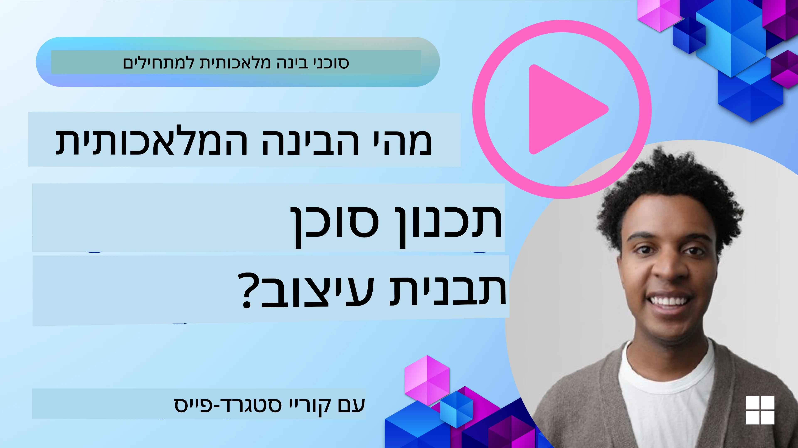
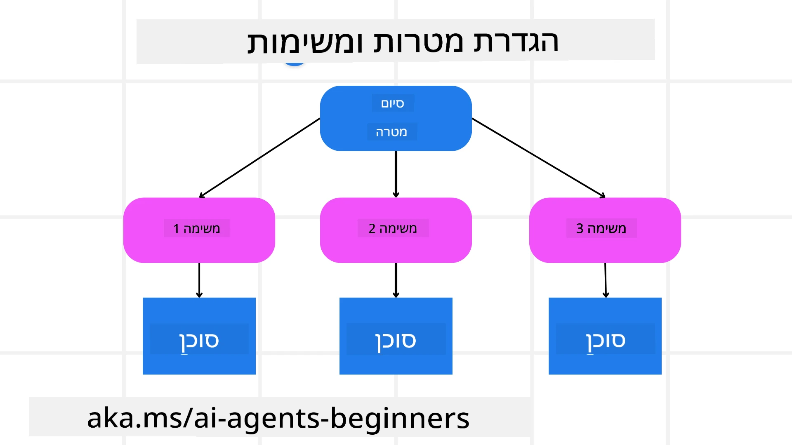

[](https://youtu.be/kPfJ2BrBCMY?si=9pYpPXp0sSbK91Dr)

> _(לחצו על התמונה למעלה כדי לצפות בסרטון של השיעור הזה)_

# תבנית תכנון

## מבוא

השיעור יכסה

* הגדרת מטרה כוללת ברורה ופיצול משימה מורכבת למשימות ניתנות לניהול.
* שימוש בפלט מובנה לקבלת תגובות אמינות יותר וקריאות-מכונה.
* יישום גישה מונחית-אירועים לטיפול במשימות דינמיות וקלטים לא צפויים.

## מטרות למידה

בסיום שיעור זה תהיה לך הבנה של:

* לזהות ולקבוע מטרה כוללת לסוכן בינה מלאכותית, כך שהוא יבין בבירור מה יש להשיג.
* לפצל משימה מורכבת לתתי-משימות ניתנות לניהול ולארגן אותן ברצף לוגי.
* לצייד סוכנים בכלים המתאימים (למשל כלי חיפוש או כלי ניתוח נתונים), להחליט מתי ואיך להשתמש בהם, ולטפל במצבים לא צפויים שעשויים לעלות.
* להעריך תוצאות של תתי-משימות, למדוד ביצועים ולחזור על פעולות כדי לשפר את התוצאה הסופית.

## הגדרת המטרה הכוללת ופיצול משימה



רוב המשימות בעולם האמיתי מורכבות מדי כדי לטפל בהן בצעד אחד. סוכן בינה מלאכותית זקוק למטרה תמציתית שתנחה את תכנון פעולותיו. לדוגמה, שקול את המטרה:

    "הכן מסלול טיול ל-3 ימים."

למרות שקל להצהיר על כך, יש צורך להבהיר ולחדד אותה. ככל שהמטרה ברורה יותר, כך יוכלו הסוכן (וכל שותף אנושי) להתמקד בהשגת התוצאה הנכונה, כמו יצירת מסלול מקיף הכולל אופציות טיסה, המלצות על מלונות והצעות לפעילויות.

### פירוק משימה

משימות גדולות או מורכבות נעשות ניתנות לניהול יותר כאשר מפצלים אותן לתת-משימות ממוקדות מטרה.
לדוגמה למסלול טיול, ניתן לפצל את המטרה ל:

* הזמנת טיסות
* הזמנת מלון
* השכרת רכב
* התאמה אישית

כל תת-משימה ניתנת לביצוע על-ידי סוכנים או תהליכים ייעודיים. סוכן אחד עשוי להתמחות בחיפוש העסקאות הטובות ביותר לטיסות, אחר יתמקד בהזמנת מלונות, וכן הלאה. סוכן מתאם או "סוכן יורד" יכול לאסוף את התוצאות הללו וליצור מסלול אחד מלוכד עבור המשתמש הקצה.

גישה מודולרית זו גם מאפשרת שיפורים מצטברים. לדוגמה, ניתן להוסיף סוכנים מיוחדים להמלצות אוכל או הצעות לפעילויות מקומיות ולחדד את המסלול לאורך זמן.

### פלט מובנה

דגמי שפה גדולים (LLMs) יכולים לייצר פלט מובנה (למשל JSON) שקל יותר לפרסר ולעבד על ידי סוכנים או שירותים אחרים. זה שימושי במיוחד בהקשר רב-סוכני, שבו אפשר לבצע את המשימות לאחר קבלת תוצאת התכנון.

קטע ה-Python הבא מדגים סוכן תכנון שמפצל מטרה לתת-משימות ומייצר תוכנית מובנית:

```python
from pydantic import BaseModel
from enum import Enum
from typing import List, Optional, Union
import json
import os
from typing import Optional
from pprint import pprint
from agent_framework.azure import AzureAIProjectAgentProvider
from azure.identity import AzureCliCredential

class AgentEnum(str, Enum):
    FlightBooking = "flight_booking"
    HotelBooking = "hotel_booking"
    CarRental = "car_rental"
    ActivitiesBooking = "activities_booking"
    DestinationInfo = "destination_info"
    DefaultAgent = "default_agent"
    GroupChatManager = "group_chat_manager"

# מודל תת-משימה לנסיעה
class TravelSubTask(BaseModel):
    task_details: str
    assigned_agent: AgentEnum  # אנו רוצים להקצות את המשימה לסוכן

class TravelPlan(BaseModel):
    main_task: str
    subtasks: List[TravelSubTask]
    is_greeting: bool

provider = AzureAIProjectAgentProvider(credential=AzureCliCredential())

# הגדר את הודעת המשתמש
system_prompt = """You are a planner agent.
    Your job is to decide which agents to run based on the user's request.
    Provide your response in JSON format with the following structure:
{'main_task': 'Plan a family trip from Singapore to Melbourne.',
 'subtasks': [{'assigned_agent': 'flight_booking',
               'task_details': 'Book round-trip flights from Singapore to '
                               'Melbourne.'}
    Below are the available agents specialised in different tasks:
    - FlightBooking: For booking flights and providing flight information
    - HotelBooking: For booking hotels and providing hotel information
    - CarRental: For booking cars and providing car rental information
    - ActivitiesBooking: For booking activities and providing activity information
    - DestinationInfo: For providing information about destinations
    - DefaultAgent: For handling general requests"""

user_message = "Create a travel plan for a family of 2 kids from Singapore to Melbourne"

response = client.create_response(input=user_message, instructions=system_prompt)

response_content = response.output_text
pprint(json.loads(response_content))
```

### סוכן תכנון עם תזמור רב-סוכני

בדוגמה זו, סוכן נתב סמנטי מקבל בקשת משתמש (למשל, "אני צריך תוכנית מלון לטיול שלי.").

המתכנן אז:

* מקבל את תוכנית המלון: המתכנן לוקח את הודעת המשתמש ובהסתמך על הוראות מערכת (כולל פרטי סוכנים זמינים), מייצר תוכנית נסיעה מובנית.
* רושם את הסוכנים וכלי העבודה שלהם: רישום הסוכנים מחזיק ברשימת סוכנים (למשל להזמנות טיסות, מלונות, השכרת רכב ופעילויות) יחד עם הפונקציות או הכלים שהם מציעים.
* מנתב את התוכנית לסוכנים הרלוונטיים: בהתאם למספר תתי-המשימות, המתכנן או ישלח את ההודעה ישירות לסוכן ייעודי (למקרים של משימה יחידה) או יתאם באמצעות מנהל צ'אט קבוצתי לשיתוף פעולה רב-סוכני.
* מסכם את התוצאה: לבסוף, המתכנן מסכם את התוכנית שנוצרה להבהרה.
הקטע הקוד Python הבא ממחיש את השלבים הללו:

```python

from pydantic import BaseModel

from enum import Enum
from typing import List, Optional, Union

class AgentEnum(str, Enum):
    FlightBooking = "flight_booking"
    HotelBooking = "hotel_booking"
    CarRental = "car_rental"
    ActivitiesBooking = "activities_booking"
    DestinationInfo = "destination_info"
    DefaultAgent = "default_agent"
    GroupChatManager = "group_chat_manager"

# מודל תת-משימה לנסיעות

class TravelSubTask(BaseModel):
    task_details: str
    assigned_agent: AgentEnum # אנחנו רוצים להקצות את המשימה לסוכן

class TravelPlan(BaseModel):
    main_task: str
    subtasks: List[TravelSubTask]
    is_greeting: bool
import json
import os
from typing import Optional

from agent_framework.azure import AzureAIProjectAgentProvider
from azure.identity import AzureCliCredential

# צור את הלקוח

provider = AzureAIProjectAgentProvider(credential=AzureCliCredential())

from pprint import pprint

# הגדר את הודעת המשתמש

system_prompt = """You are a planner agent.
    Your job is to decide which agents to run based on the user's request.
    Below are the available agents specialized in different tasks:
    - FlightBooking: For booking flights and providing flight information
    - HotelBooking: For booking hotels and providing hotel information
    - CarRental: For booking cars and providing car rental information
    - ActivitiesBooking: For booking activities and providing activity information
    - DestinationInfo: For providing information about destinations
    - DefaultAgent: For handling general requests"""

user_message = "Create a travel plan for a family of 2 kids from Singapore to Melbourne"

response = client.create_response(input=user_message, instructions=system_prompt)

response_content = response.output_text

# הדפס את תוכן התגובה לאחר טעינתו כ-JSON

pprint(json.loads(response_content))
```

להלן הפלט המתקבל מהקוד הקודם ואפשר להשתמש בפלט המובנה הזה כדי לנתב אל `assigned_agent` ולסכם את תוכנית הנסיעות למשתמש הקצה.

```json
{
    "is_greeting": "False",
    "main_task": "Plan a family trip from Singapore to Melbourne.",
    "subtasks": [
        {
            "assigned_agent": "flight_booking",
            "task_details": "Book round-trip flights from Singapore to Melbourne."
        },
        {
            "assigned_agent": "hotel_booking",
            "task_details": "Find family-friendly hotels in Melbourne."
        },
        {
            "assigned_agent": "car_rental",
            "task_details": "Arrange a car rental suitable for a family of four in Melbourne."
        },
        {
            "assigned_agent": "activities_booking",
            "task_details": "List family-friendly activities in Melbourne."
        },
        {
            "assigned_agent": "destination_info",
            "task_details": "Provide information about Melbourne as a travel destination."
        }
    ]
}
```

מחברת דוגמה עם דוגמת הקוד הקודמת זמינה [כאן](07-python-agent-framework.ipynb).

### תכנון איטרטיבי

חלק מהמשימות דורשות דיאלוג חוזר או תכנון מחדש, כאשר תוצאת תת-משימה אחת משפיעה על הבאה. לדוגמה, אם הסוכן מגלה פורמט נתונים לא צפוי בעת הזמנת טיסות, ייתכן שיהיה עליו להתאים את האסטרטגיה שלו לפני המעבר להזמנת מלונות.

בנוסף, משוב משתמש (למשל אדם המחליט שהוא מעדיף טיסה מוקדמת יותר) יכול להפעיל תכנון חלקי מחדש. גישה דינמית ואיטרטיבית זו מבטיחה שהתוצאה הסופית תתאים למגבלות העולם האמיתי ולהעדפות המשתמש המשתנות.

לדוגמה: דוגמת קוד

```python
from agent_framework.azure import AzureAIProjectAgentProvider
from azure.identity import AzureCliCredential
#.. כמו בקוד הקודם והעבר את היסטוריית המשתמש ואת התוכנית הנוכחית

system_prompt = """You are a planner agent to optimize the
    Your job is to decide which agents to run based on the user's request.
    Below are the available agents specialized in different tasks:
    - FlightBooking: For booking flights and providing flight information
    - HotelBooking: For booking hotels and providing hotel information
    - CarRental: For booking cars and providing car rental information
    - ActivitiesBooking: For booking activities and providing activity information
    - DestinationInfo: For providing information about destinations
    - DefaultAgent: For handling general requests"""

user_message = "Create a travel plan for a family of 2 kids from Singapore to Melbourne"

response = client.create_response(
    input=user_message,
    instructions=system_prompt,
    context=f"Previous travel plan - {TravelPlan}",
)
# .. תכנן מחדש ושלח את המשימות לסוכנים המתאימים
```

לתכנון מקיף יותר עיינו ב-Magnetic One <a href="https://www.microsoft.com/research/articles/magentic-one-a-generalist-multi-agent-system-for-solving-complex-tasks" target="_blank">פוסט בבלוג</a> לפתרון משימות מורכבות.

## סיכום

במאמר זה הסתכלנו על דוגמה כיצד ניתן ליצור מתכנן שיכול לבחור באופן דינמי את הסוכנים הזמינים שהוגדרו. הפלט של המתכנן מפצל את המשימות ומקצה את הסוכנים כדי שניתן יהיה לבצע אותן. מניחים שלסוכנים יש גישה לפונקציות/כלים הנדרשים לביצוע המשימה. בנוסף לסוכנים ניתן לכלול דפוסים נוספים כמו רפלקציה, מסכמת וצ'אט בסגנון רונד-רובין כדי להתאמה אישית נוספת.

## משאבים נוספים

Magentic One - מערכת רב-סוכנית כללית לפתרון משימות מורכבות שהשיגה תוצאות מרשימות במספר מדדי אתגר סוכניים. מקור: <a href="https://www.microsoft.com/research/articles/magentic-one-a-generalist-multi-agent-system-for-solving-complex-tasks" target="_blank">Magentic One</a>. במימוש זה המתזמר יוצר תוכניות ספציפיות למשימה ומפנה את המשימות האלה לסוכנים הזמינים. בנוסף לתכנון, המתזמר גם עושה שימוש במנגנון מעקב כדי לפקח על התקדמות המשימה ולבצע תכנון מחדש לפי הצורך.

### יש לכם שאלות נוספות לגבי תבנית התכנון?

הצטרפו ל-[Microsoft Foundry Discord](https://aka.ms/ai-agents/discord) כדי לפגוש לומדים אחרים, להשתתף בשעות משרד ולקבל תשובות לשאלות על סוכני הבינה המלאכותית שלכם.

## שיעור קודם

[בניית סוכני בינה מלאכותית אמינים](../06-building-trustworthy-agents/README.md)

## השיעור הבא

[דפוס רב-סוכני](../08-multi-agent/README.md)

---

<!-- CO-OP TRANSLATOR DISCLAIMER START -->
כתב ויתור:
מסמך זה תורגם באמצעות שירות תרגום מבוסס בינה מלאכותית Co-op Translator (https://github.com/Azure/co-op-translator). אף שאנו שואפים לדיוק, יש לשים לב כי תרגומים אוטומטיים עלולים להכיל שגיאות או אי-דיוקים. יש לראות במסמך המקורי בשפתו כמקור הסמכותי. לפרטים קריטיים מומלץ להיעזר בתרגום מקצועי על ידי מתרגם אנושי. איננו אחראים לכל אי-הבנה או פרשנות שגויה הנובעת מהשימוש בתרגום זה.
<!-- CO-OP TRANSLATOR DISCLAIMER END -->