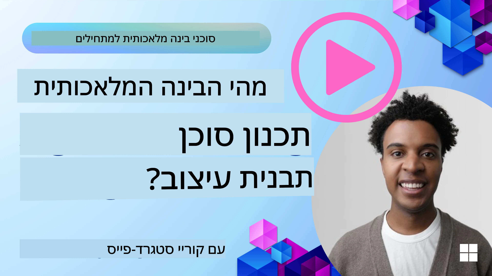
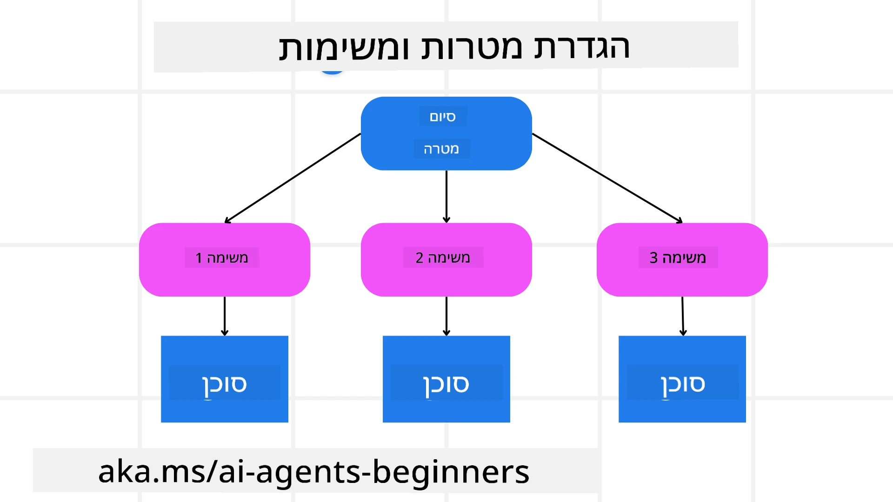

[](https://youtu.be/kPfJ2BrBCMY?si=9pYpPXp0sSbK91Dr)

> _(לחץ על התמונה למעלה כדי לצפות בסרטון של שיעור זה)_

# תכנון עיצוב

## הקדמה

שיעור זה יכלול

* הגדרת מטרה כוללת ברורה ופירוק משימה מורכבת למשימות ניתנות לניהול.
* ניצול פלט מובנה לתגובות אמינות יותר וקריאות מכונה.
* יישום גישה מונעת אירועים לטיפול במשימות דינמיות וקלטים בלתי צפויים.

## מטרות הלמידה

לאחר השלמת שיעור זה, תבין את הנושאים הבאים:

* לזהות ולקבוע מטרה כוללת לסוכן AI, ולוודא שהוא יודע בבירור מה יש להשיג.
* לפרק משימה מורכבת לתתי משימות ניתנות לניהול ולארגן אותן ברצף לוגי.
* לצייד סוכנים בכלים הנכונים (למשל, כלים לחיפוש או ניתוח נתונים), להחליט מתי ואיך להשתמש בהם, ולנהל מצבים בלתי צפויים שמתעוררים.
* להעריך תוצאות תתי המשימות, למדוד ביצועים ולחזור על פעולות כדי לשפר את התוצאה הסופית.

## הגדרת המטרה הכוללת ופירוק משימה



רוב המשימות בעולם האמיתי מורכבות מדי כדי להתמודד איתן בצעד אחד. סוכן AI צריך מטרה תמציתית שתקבע את תכנון הפעולות שלו. לדוגמה, שקול את המטרה:

    "ליצור תוכנית טיול לשלושה ימים."

אף שזו הצהרה פשוטה, עדיין יש צורך בשכלול. ככל שהמטרה ברורה יותר, כך הסוכן (וכל שותף אנושי) יוכל להתמקד בהשגת התוצאה הנכונה, כמו יצירת תוכנית מפורטת הכוללת אפשרויות טיסה, המלצות למלונות והצעות לפעילויות.

### פירוק המשימה

משימות גדולות או מורכבות נהפכות לניתנות לניהול כשהן מפורקות לתת-משימות קטנות וממוקדות מטרה.
בדוגמת תוכנית הטיול, ניתן לפרק את המטרה ל:

* הזמנת טיסות
* הזמנת מלון
* השכרת רכב
* התאמה אישית

כל תת-משימה יכולה להתבצע על ידי סוכנים או תהליכים ייעודיים. סוכן אחד יתמחה בחיפוש דילים לטיסות, אחר יתמקד בהזמנת מלונות, וכן הלאה. סוכן מתאם או "מזרם מטה" יכול לאחד את התוצאות לתוכנית אחידה למשתמש הקצה.

גישה מודולרית זו מאפשרת גם שיפורים הדרגתיים. לדוגמה, ניתן להוסיף סוכנים מיוחדים להמלצות אוכל או הצעות לפעילויות מקומיות ולהשביח את התוכנית לאורך זמן.

### פלט מובנה

מודלים גדולים של שפה (LLMs) יכולים לייצר פלט מובנה (למשל JSON) שקל יותר לסוכנים או שירותים "מטה" לפרס ולנתח. זה שימושי במיוחד בהקשר של רב-סוכנים, בו ניתן לפעול על המשימות לאחר קבלת פלט התכנון.

הקוד הבא בפייתון ממחיש סוכן תכנון פשוט שמפירק מטרה לתת-משימות ומייצר תוכנית מובנית:

```python
from pydantic import BaseModel
from enum import Enum
from typing import List, Optional, Union
import json
import os
from typing import Optional
from pprint import pprint
from agent_framework.foundry import FoundryChatClient
from azure.identity import AzureCliCredential

class AgentEnum(str, Enum):
    FlightBooking = "flight_booking"
    HotelBooking = "hotel_booking"
    CarRental = "car_rental"
    ActivitiesBooking = "activities_booking"
    DestinationInfo = "destination_info"
    DefaultAgent = "default_agent"
    GroupChatManager = "group_chat_manager"

# דגם משימת משנה לטיולים
class TravelSubTask(BaseModel):
    task_details: str
    assigned_agent: AgentEnum  # אנחנו רוצים להקצות את המשימה לסוכן

class TravelPlan(BaseModel):
    main_task: str
    subtasks: List[TravelSubTask]
    is_greeting: bool

provider = FoundryChatClient(
    project_endpoint=os.environ["AZURE_AI_PROJECT_ENDPOINT"],
    model=os.environ["AZURE_AI_MODEL_DEPLOYMENT_NAME"],
    credential=AzureCliCredential(),
)

# הגדר את הודעת המשתמש
system_prompt = """You are a planner agent.
    Your job is to decide which agents to run based on the user's request.
    Provide your response in JSON format with the following structure:
{'main_task': 'Plan a family trip from Singapore to Melbourne.',
 'subtasks': [{'assigned_agent': 'flight_booking',
               'task_details': 'Book round-trip flights from Singapore to '
                               'Melbourne.'}
    Below are the available agents specialised in different tasks:
    - FlightBooking: For booking flights and providing flight information
    - HotelBooking: For booking hotels and providing hotel information
    - CarRental: For booking cars and providing car rental information
    - ActivitiesBooking: For booking activities and providing activity information
    - DestinationInfo: For providing information about destinations
    - DefaultAgent: For handling general requests"""

user_message = "Create a travel plan for a family of 2 kids from Singapore to Melbourne"

response = client.create_response(input=user_message, instructions=system_prompt)

response_content = response.output_text
pprint(json.loads(response_content))
```

### סוכן תכנון עם תזמור רב-סוכני

בדוגמה זו, סוכן ניתוב סמנטי מקבל בקשת משתמש (למשל, "אני צריך תוכנית מלון לטיול שלי.").

הסוכן המתכנן אז:

* מקבל את תוכנית המלון: המתכנן לוקח את הודעת המשתמש ומייצר תוכנית טיול מובנית על בסיס פרומפט מערכת (שכולל פרטי סוכנים זמינים).
* מפרט סוכנים וכלים שלהם: רשם הסוכנים מכיל רשימה של סוכנים (למשל לטיסה, מלון, השכרת רכב ופעילויות) יחד עם הפונקציות או הכלים שהם מציעים.
* מנתב את התוכנית לסוכנים המתאימים: בהתאם למספר תתי המשימות, המתכנן שולח ישירות לסוכן ייעודי (למקרה של משימה יחידה) או מתאם באמצעות מנהל חדר צ'אט לשיתוף פעולה של רב-סוכנים.
* מסכם את התוצאה: לבסוף, המתכנן מסכם את התוכנית שנוצרה לצורך בהירות.
דוגמת הקוד בפייתון להלן מתארת את השלבים האלה:

```python

from pydantic import BaseModel

from enum import Enum
from typing import List, Optional, Union

class AgentEnum(str, Enum):
    FlightBooking = "flight_booking"
    HotelBooking = "hotel_booking"
    CarRental = "car_rental"
    ActivitiesBooking = "activities_booking"
    DestinationInfo = "destination_info"
    DefaultAgent = "default_agent"
    GroupChatManager = "group_chat_manager"

# מודל תת-משימה של טיול

class TravelSubTask(BaseModel):
    task_details: str
    assigned_agent: AgentEnum # אנו רוצים להקצות את המשימה לסוכן

class TravelPlan(BaseModel):
    main_task: str
    subtasks: List[TravelSubTask]
    is_greeting: bool
import json
import os
from typing import Optional

from agent_framework.foundry import FoundryChatClient
from azure.identity import AzureCliCredential

# צור את הלקוח

provider = FoundryChatClient(
    project_endpoint=os.environ["AZURE_AI_PROJECT_ENDPOINT"],
    model=os.environ["AZURE_AI_MODEL_DEPLOYMENT_NAME"],
    credential=AzureCliCredential(),
)

from pprint import pprint

# הגדר את הודעת המשתמש

system_prompt = """You are a planner agent.
    Your job is to decide which agents to run based on the user's request.
    Below are the available agents specialized in different tasks:
    - FlightBooking: For booking flights and providing flight information
    - HotelBooking: For booking hotels and providing hotel information
    - CarRental: For booking cars and providing car rental information
    - ActivitiesBooking: For booking activities and providing activity information
    - DestinationInfo: For providing information about destinations
    - DefaultAgent: For handling general requests"""

user_message = "Create a travel plan for a family of 2 kids from Singapore to Melbourne"

response = client.create_response(input=user_message, instructions=system_prompt)

response_content = response.output_text

# הדפס את תוכן התגובה לאחר טעינתו כ-JSON

pprint(json.loads(response_content))
```

מה שמופיע בהמשך הוא הפלט מהקוד הקודם, ואתה יכול להשתמש בפלט המובנה הזה כדי לנתב לסוכן `assigned_agent` ולסכם את תוכנית הטיול למשתמש הקצה.

```json
{
    "is_greeting": "False",
    "main_task": "Plan a family trip from Singapore to Melbourne.",
    "subtasks": [
        {
            "assigned_agent": "flight_booking",
            "task_details": "Book round-trip flights from Singapore to Melbourne."
        },
        {
            "assigned_agent": "hotel_booking",
            "task_details": "Find family-friendly hotels in Melbourne."
        },
        {
            "assigned_agent": "car_rental",
            "task_details": "Arrange a car rental suitable for a family of four in Melbourne."
        },
        {
            "assigned_agent": "activities_booking",
            "task_details": "List family-friendly activities in Melbourne."
        },
        {
            "assigned_agent": "destination_info",
            "task_details": "Provide information about Melbourne as a travel destination."
        }
    ]
}
```

דוגמה לפנקס פתקים עם הדוגמה הקודמת זמינה [כאן](./code_samples/07-python-agent-framework.ipynb).

### תכנון איטרטיבי

חלק מהמשימות דורשות תהליך חזרה או תכנון מחדש, בו תוצאת תת-המשימה משפיעה על הבאה. לדוגמה, אם הסוכן מגלה פורמט נתונים בלתי צפוי בעת הזמנת טיסות, יתכן ויצטרך להתאים את האסטרטגיה לפני שהוא ממשיך להזמנת המלון.

בנוסף, משוב משתמש (למשל אדם שמחליט שהוא מעדיף טיסה מוקדמת יותר) יכול לגרום לתכנון חלקי מחדש. גישה דינמית ואיטרטיבית זו מוודאת שהפתרון הסופי מתאים למגבלות עולם אמיתי ולהעדפות המשתמש המשתנות.

לדוגמה קוד

```python
import os
from agent_framework.foundry import FoundryChatClient
from azure.identity import AzureCliCredential
#.. אותו דבר כמו הקוד הקודם והעבר את היסטוריית המשתמש, התוכנית הנוכחית

system_prompt = """You are a planner agent to optimize the
    Your job is to decide which agents to run based on the user's request.
    Below are the available agents specialized in different tasks:
    - FlightBooking: For booking flights and providing flight information
    - HotelBooking: For booking hotels and providing hotel information
    - CarRental: For booking cars and providing car rental information
    - ActivitiesBooking: For booking activities and providing activity information
    - DestinationInfo: For providing information about destinations
    - DefaultAgent: For handling general requests"""

user_message = "Create a travel plan for a family of 2 kids from Singapore to Melbourne"

response = client.create_response(
    input=user_message,
    instructions=system_prompt,
    context=f"Previous travel plan - {TravelPlan}",
)
# .. תכנן מחדש ושלח את המשימות לסוכנים המתאימים
```

לתכנון מקיף יותר מומלץ לעיין ב-Magnetic One <a href="https://www.microsoft.com/research/articles/magentic-one-a-generalist-multi-agent-system-for-solving-complex-tasks" target="_blank">בלוגפוסט</a> לפתרון משימות מורכבות.

## סיכום

במאמר זה סקרנו דוגמה לאיך ניתן ליצור מתכנן שבוחר בצורה דינמית את הסוכנים הזמינים שהוגדרו. הפלט של המתכנן מפצל את המשימות ומקצה את הסוכנים כך שיוכלו להתבצע. מניחים שהסוכנים ניגשים לפונקציות/כלים הנדרשים לביצוע המשימה. בנוסף לסוכנים ניתן לכלול דפוסים נוספים כמו רפלקשן, מסכם וצ'אט עם סיבוב נעים להתאמה אישית נוספת.

## משאבים נוספים

Magnetic One - מערכת רב-סוכנים כללי לפתרון משימות מורכבות, שהשיגה תוצאות מרשימות בבנצ'מרקים אתגריים. הפניה: <a href="https://www.microsoft.com/research/articles/magentic-one-a-generalist-multi-agent-system-for-solving-complex-tasks" target="_blank">Magnetic One</a>. במימוש זה המתזמן יוצר תוכניות ספציפיות למשימות ומאציל אותן לסוכנים הזמינים. בנוסף לתכנון, המתזמן משתמש במנגנון מעקב למעקב אחר התקדמות המשימה ולתכנון מחודש לפי הצורך.

### יש לך שאלות נוספות על תבנית התכנון?

הצטרף ל-[Microsoft Foundry Discord](https://discord.com/invite/ATgtXmAS5D) כדי לפגוש לומדים אחרים, להגיע לשעות משרדים ולקבל מענה לשאלותיך על סוכני AI.

## שיעור קודם

[בניית סוכני AI אמינים](../06-building-trustworthy-agents/README.md)

## השיעור הבא

[תבנית עיצוב רב-סוכנית](../08-multi-agent/README.md)

---

<!-- CO-OP TRANSLATOR DISCLAIMER START -->
**כתב ויתור**:
מסמך זה תורגם באמצעות שירות תרגום אוטומטי [Co-op Translator](https://github.com/Azure/co-op-translator). למרות שאנו שואפים לדיוק, יש לקחת בחשבון שתרגומים אוטומטיים עלולים להכיל שגיאות או אי-דיוקים. יש להחשיב את המסמך המקורי בשפתו הטבעית כמקור הסמכות. למידע קריטי מומלץ להשתמש בתרגום מקצועי על ידי מתרגם אדם. אנו לא אחראים לכל אי-הבנה או פירוש שגוי הנובע מהשימוש בתרגום זה.
<!-- CO-OP TRANSLATOR DISCLAIMER END -->