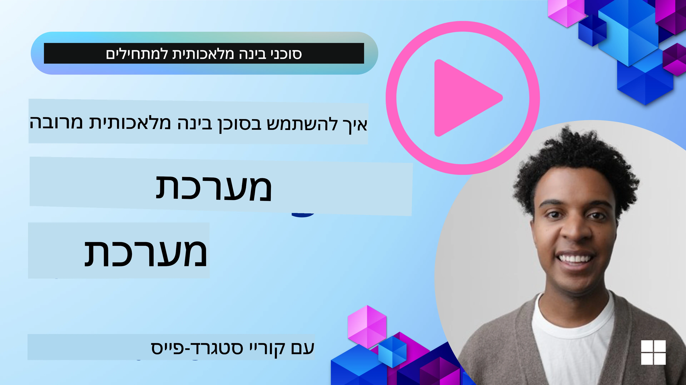
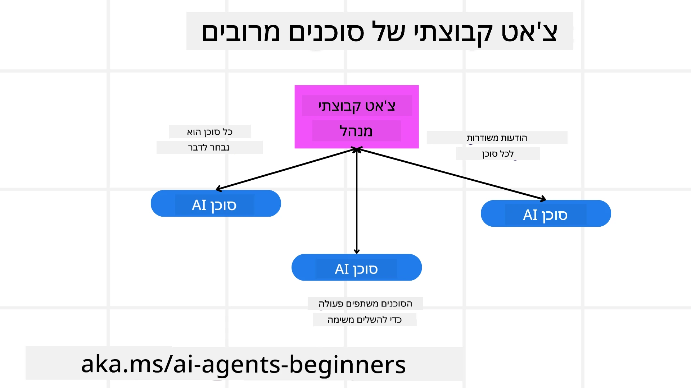
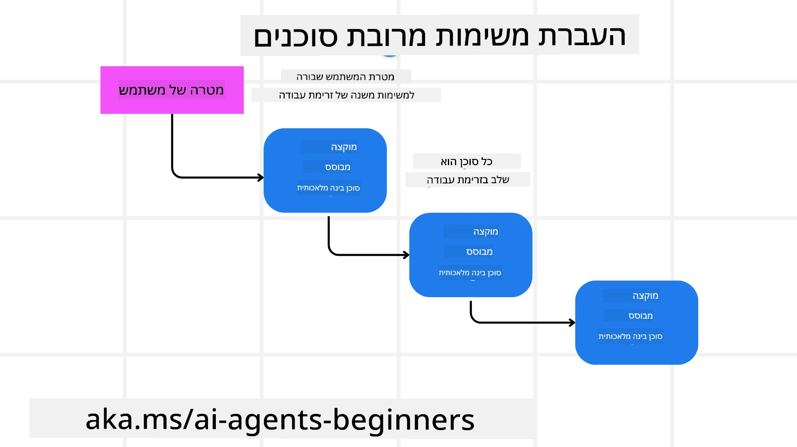
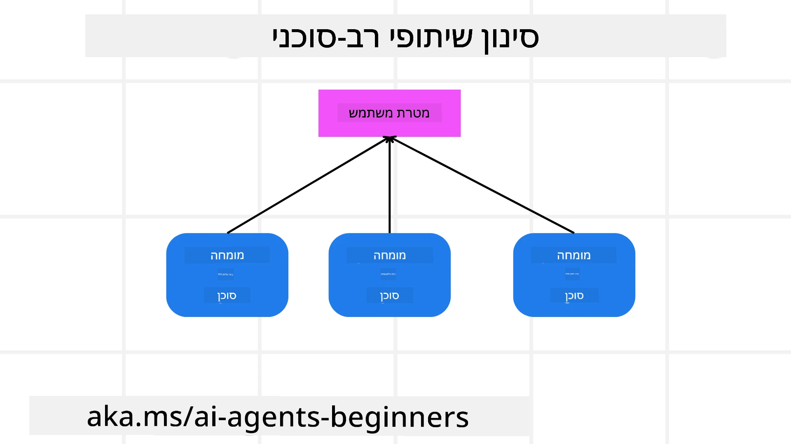

> _(לחץ על התמונה למעלה כדי לצפות בסרטון של שיעור זה)_

# תבניות עיצוב רב-סוכניות

ברגע שתתחיל לעבוד על פרויקט שמעורבים בו מספר סוכנים, תצטרך לשקול את תבנית העיצוב הרב-סוכנית. עם זאת, ייתכן שלא יהיה ברור מיד מתי לעבור לרב-סוכנים ומה היתרונות בכך.

## הקדמה

בשיעור זה ננסה לענות על השאלות הבאות:

- באילו תרחישים מתאימים שימוש ברב-סוכנים?
- מהם היתרונות של שימוש ברב-סוכנים לעומת סוכן יחיד שמבצע כמה משימות?
- מהם אבני הבניין ליישום תבנית העיצוב הרב-סוכנית?
- כיצד נוכל לקבל שקיפות לגבי האינטראקציה בין הסוכנים השונים?

## יעדי הלמידה

בסיום שיעור זה תוכל/י:

- לזהות תרחישים שבהם מתאימות מערכות רב-סוכניות
- לזהות את היתרונות של שימוש ברב-סוכנים לעומת סוכן יחיד
- להבין את אבני הבניין של יישום תבנית העיצוב הרב-סוכנית

מה התמונה הכוללת?

*רב-סוכנים הם תבנית עיצוב שמאפשרת למספר סוכנים לעבוד יחד כדי להשיג מטרה משותפת*.

תבנית זו נמצאת בשימוש נרחב בתחומים שונים, כולל רובוטיקה, מערכות אוטונומיות ומחשוב מבוזר.

## תרחישים שבהם מתאימות מערכות רב-סוכניות

אז אילו תרחישים מהווים מקרה שימוש טוב לשימוש ברב-סוכנים? התשובה היא שישנם תרחישים רבים שבהם שימוש במספר סוכנים מועיל, במיוחד במקרים הבאים:

- **עומסי עבודה גדולים**: ניתן לחלק עומסי עבודה גדולים למשימות קטנות יותר ולהקצותם לסוכנים שונים, מה שמאפשר עיבוד מקבילי והשלמה מהירה יותר. דוגמה לכך היא מטלה גדולה של עיבוד נתונים.
- **משימות מורכבות**: משימות מורכבות, כמו עומסי עבודה גדולים, יכולות להיות מפורקות לתת-משימות קטנות יותר ולהוקצות לסוכנים שונים, כל אחד מתמחה בהיבט מסוים של המשימה. דוגמה טובה לכך היא במערכות רכב אוטונומי שבהן סוכנים שונים מנהלים ניווט, זיהוי מכשולים ותקשורת עם רכבים אחרים.
- **מגוון מומחיות**: סוכנים שונים יכולים להחזיק במומחיות שונה, מה שמאפשר להם לטפל בהיבטים שונים של משימה ביעילות רבה יותר מאשר סוכן יחיד. לדוגמה בתחום הבריאות סוכנים יכולים לנהל אבחון, תכניות טיפול ומעקב אחר מטופלים.

## יתרונות השימוש ברב-סוכנים לעומת סוכן יחיד

מערכת עם סוכן יחיד יכולה לעבוד היטב במשימות פשוטות, אך במשימות מורכבות יותר, שימוש במספר סוכנים יכול להעניק יתרונות רבים:

- **התמחות**: כל סוכן יכול להיות מיומן למשימה מסוימת. חוסר התמחות בסוכן יחיד אומר שיש לך סוכן שיכול לעשות הכל אך עשוי להתבלבל מה לעשות מול משימה מורכבת. למשל, הוא עלול בסופו של דבר לבצע משימה שאינה מתאימה לו ביותר.
- **יכולת הרחבה**: קל יותר להרחיב מערכות על ידי הוספת סוכנים נוספים מאשר להעמיס על סוכן יחיד.
- **עמידות לתקלות**: אם סוכן אחד נכשל, אחרים יכולים להמשיך לתפקד, וכך להבטיח את אמינות המערכת.

ניקח דוגמה: נסתדר להזמין טיול עבור משתמש. מערכת עם סוכן יחיד תצטרך לטפל בכל היבטי תהליך הזמנת הטיול, החל ממציאת טיסות ועד הזמנת מלונות והשכרת רכב. כדי להשיג זאת עם סוכן יחיד, הסוכן יצטרך כלי עבודה לטיפול בכל המשימות הללו. זה יכול להוביל למערכת מורכבת ומונוליטית שקשה לתחזק ולהרחיב. מערכת רב-סוכנית, לעומת זאת, יכולה לכלול סוכנים שונים שמתמחים במציאת טיסות, בהזמנת מלונות ובהשכרת רכבים. זה יהפוך את המערכת למודולרית יותר, קלה יותר לתחזוקה ולהרחבה.

השווה זאת לסוכנות נסיעות המנוהלת כחנות משפחתית קטנה לעומת סוכנות נסיעות הפועלת כשיטת זכיינות. בחנות המשפחתית יהיה סוכן יחיד המטפל בכל היבטי תהליך הזמנת הטיול, בעוד שבזכיינות יהיו סוכנים שונים המטפלים בהיבטים שונים של תהליך ההזמנה.

## אבני הבניין ליישום תבנית העיצוב הרב-סוכנית

לפני שתוכל ליישם את תבנית העיצוב הרב-סוכנית, עליך להבין את אבני הבניין שמרכיבות את התבנית.

נחזור לדוגמת הזמנת הטיול עבור משתמש. במקרה זה, אבני הבניין יכללו:

- **תקשורת בין סוכנים**: סוכנים למציאת טיסות, הזמנת מלונות והשכרת רכבים צריכים לתקשר ולשתף מידע על העדפות ומגבלות המשתמש. עליך להחליט על הפרוטוקולים והשיטות לתקשורת זו. באופן קונקרטי הדבר אומר שסוכן מציאת הטיסות צריך לתקשר עם סוכן הזמנת המלונות כדי להבטיח שהמלון יזומן לאותם תאריכים כמו הטיסה. משמעות הדבר היא שהסוכנים צריכים לשתף מידע על תאריכי הנסיעה של המשתמש, כלומר עליך להחליט *אילו סוכנים משתפים מידע ואיך הם משתפים מידע*.
- **מנגנוני תיאום**: על הסוכנים לתאם את פעולותיהם כדי להבטיח שהעדפות ומגבלות המשתמש יתקיימו. העדפת משתמש יכולה להיות רצון במלון קרוב לשדה התעופה בעוד שמגבלה יכולה להיות שהשכרת הרכב זמינה רק בשדה התעופה. זה אומר שסוכן הזמנת המלונות צריך לתאם עם סוכן השכרת הרכב כדי להבטיח שהעדפות ומגבלות המשתמש מתקיימות. עליך להחליט *איך הסוכנים מתאמים את פעולותיהם*.
- **ארכיטקטורת הסוכן**: על הסוכנים להיות בעלי מבנה פנימי שיאפשר קבלת החלטות ולמידה מאינטראקציות עם המשתמש. זה אומר שסוכן מציאת הטיסות צריך להיות בעל מבנה פנימי שיחליט אילו טיסות להמליץ למשתמש. עליך להחליט *איך הסוכנים מקבלים החלטות ולומדים מהאינטראקציות שלהם עם המשתמש*. דוגמאות לדרך שבה סוכן לומד ומשתפר יכולות להיות שסוכן מציאת הטיסות ישתמש במודל למידת מכונה להמלצת טיסות למשתמש בהתבסס על העדפותיו הקודמות.
- **שקיפות באינטראקציות בין סוכנים**: עליך לקבל שקיפות לגבי כיצד הסוכנים השונים מתקשרים זה עם זה. משמעות הדבר היא שיש צורך בכלים ובטכניקות למעקב אחר פעילויות ואינטראקציות של סוכנים. זה יכול להתבצע באמצעות כלים לרישום ומעקב, כלים לויזואליזציה ומדדי ביצוע.
- **תבניות רב-סוכניות**: קיימות תבניות שונות ליישום מערכות רב-סוכניות, כגון ארכיטקטורות מרכזיות, מבוזרות והיברידיות. עליך לבחור את התבנית המתאימה ביותר למקרה השימוש שלך.
- **אדם בתהליך**: ברוב המקרים יהיה אדם בתהליך ויש להחליט מתי הסוכנים צריכים לבקש התערבות אנושית. זה יכול להיות בצורת בקשת משתמש עבור מלון או טיסה ספציפית שסוכנים לא הציעו, או בקשת אישור לפני ביצוע הזמנה.

## שקיפות באינטראקציות בין סוכנים

חשוב שיהיה לך שקיפות לגבי איך הסוכנים השונים מתקשרים זה עם זה. שקיפות זו חיונית לניפוי באגים, לאופטימיזציה ולהבטחת אפקטיביות המערכת הכוללת. כדי להשיג זאת, עליך להחזיק בכלים ובטכניקות למעקב אחר פעילויות ואינטראקציות של סוכנים. זה יכול להתבצע בצורת כלים לרישום ומעקב, כלים לויזואליזציה ומדדי ביצוע.

לדוגמה, במקרה של הזמנת טיול עבור משתמש, ניתן להחזיק בלוח בקרה שמציג את מצב כל סוכן, את העדפות ומגבלות המשתמש, ואת האינטראקציות בין הסוכנים. לוח בקרה כזה יכול להציג את תאריכי הנסיעה של המשתמש, את הטיסות שהומלצו על ידי סוכן הטיסות, את המלונות שהומלצו על ידי סוכן המלונות, ואת רכבי ההשכרה שהומלצו על ידי סוכן השכרת הרכבים. זה ייתן תמונה ברורה של האופן שבו הסוכנים מתקשרים זה עם זה והאם העדפות ומגבלות המשתמש מתקיימות.

נבחן כל אחד מההיבטים הללו ביתר פירוט.

- **כלי רישום ומעקב**: רצוי לבצע רישום עבור כל פעולה שננקטת על ידי סוכן. רשומת לוג יכולה לאחסן מידע על הסוכן שביצע את הפעולה, הפעולה שבוצעה, זמן ביצוע הפעולה ותוצאת הפעולה. מידע זה יכול לשמש לניפוי באגים, לאופטימיזציה ולמטרות נוספות.
- **כלי ויזואליזציה**: כלים לויזואליזציה יכולים לעזור לראות את האינטראקציות בין הסוכנים בצורה אינטואיטיבית יותר. לדוגמה, ניתן להציג גרף שמראה את זרימת המידע בין הסוכנים. זה יכול לעזור לזהות צווארי בקבוק, אי-יעילויות ובעיות אחרות במערכת.
- **מדדי ביצוע**: מדדי ביצוע יכולים לעזור לעקוב אחר היעילות של מערכת רב-סוכנית. לדוגמה, ניתן למדוד את הזמן הנדרש להשלמת משימה, מספר המשימות שהושלמו ביחידת זמן, ואת דיוק ההמלצות שהסוכנים נותנים. מידע זה יכול לעזור לזהות תחומי שיפור ולאופטימיזציה של המערכת.

## תבניות רב-סוכניות

בואו נצלול לכמה תבניות קונקרטיות שניתן להשתמש בהן ליצירת אפליקציות רב-סוכניות. הנה כמה תבניות מעניינות שכדאי לשקול:

### צ'אט קבוצתי

תבנית זו שימושית כאשר רוצים ליצור אפליקציית צ'אט קבוצתי שבה מספר סוכנים יכולים לתקשר זה עם זה. שימושים טיפוסיים לתבנית זו כוללים שיתוף פעולה בצוות, תמיכת לקוחות ורשתות חברתיות.

בתבנית זו, כל סוכן מייצג משתמש בצ'אט הקבוצתי, והודעות מוחלפות בין הסוכנים באמצעות פרוטוקול הודעות. הסוכנים יכולים לשלוח הודעות לקבוצת הצ'אט, לקבל הודעות מהקבוצה ולהגיב להודעות של סוכנים אחרים.

ניתן ליישם תבנית זו באמצעות ארכיטקטורה מרכזית שבה כל ההודעות מנותבות דרך שרת מרכזי, או ארכיטקטורה מבוזרת שבה ההודעות מוחלפות ישירות.

### העברת משימות

תבנית זו שימושית כאשר רוצים ליצור אפליקציה שבה מספר סוכנים יכולים להעביר משימות זה לזה.

שימושים טיפוסיים לתבנית זו כוללים תמיכת לקוחות, ניהול משימות ואוטומציה של זרימות עבודה.

בתבנית זו, כל סוכן מייצג משימה או שלב בזרימת עבודה, וסוכנים יכולים להעביר משימות לסוכנים אחרים בהתאם לחוקים שהוגדרו מראש.

### סינון שיתופי

תבנית זו שימושית כאשר רוצים ליצור אפליקציה שבה מספר סוכנים יכולים לשתף פעולה כדי להמליץ למשתמשים.

הסיבה לרצון שיתוף פעולה בין סוכנים היא שכל סוכן יכול להכיל מומחיות שונה ויכול לתרום לתהליך ההמלצה בדרכים שונות.

ניקח דוגמה שבה משתמש מעוניין בהמלצה על המניה הטובה ביותר לקנייה בשוק ההון.

- **מומחה תעשייה**:. סוכן אחד יכול להיות מומחה בתחום תעשייה מסוים.
- **ניתוח טכני**: סוכן אחר יכול להיות מומחה בניתוח טכני.
- **ניתוח מהותי**: וסוכן נוסף יכול להיות מומחה בניתוח מהותי. על ידי שיתוף פעולה, סוכנים אלה יכולים לספק למשתמש המלצה מקיפה יותר.

## תרחיש: תהליך החזר כספי

שקול תרחיש שבו לקוח מנסה לקבל החזר עבור מוצר. בתהליך זה יכולים להיות מעורבים מספר סוכנים, אך נחלק אותם בין סוכנים ספציפיים לתהליך זה וסוכנים כלליים שניתן להשתמש בהם בתהליכים אחרים.

**סוכנים ספציפיים לתהליך ההחזר**:

להלן כמה סוכנים שיכולים להיות מעורבים בתהליך ההחזר:

- **סוכן לקוח**: סוכן זה מייצג את הלקוח ואחראי על ייזום תהליך ההחזר.
- **סוכן מוכר**: סוכן זה מייצג את המוכר ואחראי על עיבוד ההחזר.
- **סוכן תשלום**: סוכן זה מייצג את תהליך התשלום ואחראי על החזרת התשלום ללקוח.
- **סוכן פתרון**: סוכן זה מייצג את תהליך הפתרון ואחראי על טיפול בבעיות שעולות במהלך תהליך ההחזר.
- **סוכן ציות**: סוכן זה מייצג את תהליך הציות ואחראי על הבטחת עמידה בתקנות ומדיניות בתהליך ההחזר.

**סוכנים כלליים**:

סוכנים אלה ניתנים לשימוש גם בחלקים אחרים בעסק שלך.

- **סוכן שילוח**: סוכן זה מייצג את תהליך השילוח ואחראי למשלוח המוצר חזרה למוכר. סוכן זה ניתן לשימוש גם לתהליכי שילוח כלליים של מוצר בעקבות רכישה, לדוגמה.
- **סוכן משוב**: סוכן זה מייצג את תהליך המשוב ואחראי על איסוף משוב מהלקוח. ניתן לאסוף משוב בכל זמן ולא רק במהלך תהליך ההחזר.
- **סוכן הסלמה**: סוכן זה מייצג את תהליך ההסלמה ואחראי על העלאת בעיות לרמת תמיכה גבוהה יותר. ניתן להשתמש בסוג סוכן זה בכל תהליך שבו יש צורך בהסלמה.
- **סוכן התראות**: סוכן זה מייצג את תהליך ההתראות ואחראי על שליחת התראות ללקוח בשלבים שונים של תהליך ההחזר.
- **סוכן אנליטיקה**: סוכן זה מייצג את תהליך האנליטיקה ואחראי על ניתוח נתונים הקשורים לתהליך ההחזר.
- **סוכן ביקורת**: סוכן זה מייצג את תהליך הביקורת ואחראי על בדיקת תהליך ההחזר כדי להבטיח שהוא מתבצע כראוי.
- **סוכן דוחות**: סוכן זה מייצג את תהליך הדיווח ואחראי על יצירת דוחות על תהליך ההחזר.
- **סוכן ידע**: סוכן זה מייצג את תהליך הידע ואחראי על תחזוקת בסיס ידע של מידע הקשור לתהליך ההחזר. סוכן זה יכול להיות בקיא גם בנושאי החזר וגם בחלקים אחרים של העסק שלך.
- **סוכן אבטחה**: סוכן זה מייצג את תהליך האבטחה ואחראי על הבטחת אבטחת תהליך ההחזר.
- **סוכן איכות**: סוכן זה מייצג את תהליך האיכות ואחראי על הבטחת איכות תהליך ההחזר.

נרשמו למעלה מספר סוכנים, הן לתהליך ההחזר הספציפי והן הסוכנים הכלליים שניתן להשתמש בהם בחלקים אחרים של העסק שלך. מקווה שזה נותן לך מושג כיצד להחליט אילו סוכנים להשתמש במערכת הרב-סוכנית שלך.

## משימה

עצב מערכת רב-סוכנית לתהליך תמיכת לקוחות. זהה את הסוכנים המעורבים בתהליך, את התפקידי והאחריות שלהם, וכיצד הם מתקשרים זה עם זה. שקול גם סוכנים ספציפיים לתהליך התמיכה בספק וסוכנים כלליים שניתן להשתמש בהם בחלקים אחרים של העסק.
> כדאי לחשוב לפני שתקראו את הפתרון הבא, ייתכן שתזדקקו ליותר סוכנים ממה שאתם חושבים.
> 
> טיפ: חשבו על השלבים השונים בתהליך התמיכה בלקוחות וחשבו גם על הסוכנים הנדרשים לכל מערכת.

## פתרון

[פתרון](./solution/solution.md)

## בדיקות ידע

שאלה: מתי כדאי לשקול שימוש בסוכנים מרובים?

- [ ] A1: כאשר יש לכם עומס עבודה קטן ומשימה פשוטה.
- [ ] A2: כאשר יש לכם עומס עבודה גדול
- [ ] A3: כאשר יש לכם משימה פשוטה.

[חידון הפתרון](./solution/solution-quiz.md)

## סיכום

בשיעור זה בחנו את תבנית העיצוב של סוכנים מרובים, כולל התרחישים שבהם סוכנים מרובים רלוונטיים, היתרונות של שימוש בסוכנים מרובים לעומת סוכן יחיד, אבני הבנייה למימוש תבנית העיצוב של סוכנים מרובים, וכיצד לקבל נראות לגבי האופן שבו הסוכנים המרובים מתקשרים זה עם זה.

### יש לכם עוד שאלות לגבי תבנית העיצוב של סוכנים מרובים?

הצטרפו ל[שרת ה-Discord של Microsoft Foundry](https://aka.ms/ai-agents/discord) כדי להיפגש עם לומדים נוספים, להשתתף בשעות ייעוץ ולקבל תשובות לשאלותיכם על סוכני ה-AI.

## משאבים נוספים

- <a href="https://learn.microsoft.com/azure/ai-services/agents/overview" target="_blank">תיעוד Microsoft Agent Framework</a>
- <a href="https://www.analyticsvidhya.com/blog/2024/10/agentic-design-patterns/" target="_blank">תבניות עיצוב מבוססות-סוכנים</a>

## השיעור הקודם

[תכנון ועיצוב](../07-planning-design/README.md)

## השיעור הבא

[מטה-קוגניציה בסוכני AI](../09-metacognition/README.md)

---

<!-- CO-OP TRANSLATOR DISCLAIMER START -->
הצהרת אי-אחריות:
מסמך זה תורגם באמצעות שירות תרגום מבוסס בינה מלאכותית [Co-op Translator](https://github.com/Azure/co-op-translator). אף שאנו שואפים לדייק, יש לשים לב כי תרגומים אוטומטיים עלולים להכיל שגיאות או אי-דיוקים. יש לראות במסמך המקורי בשפתו כמקור הסמכות. עבור מידע קריטי מומלץ תרגום מקצועי על ידי מתרגם אנושי. איננו אחראים לכל אי-הבנה או לפרשנות שגויה הנובעות משימוש בתרגום זה.
<!-- CO-OP TRANSLATOR DISCLAIMER END -->