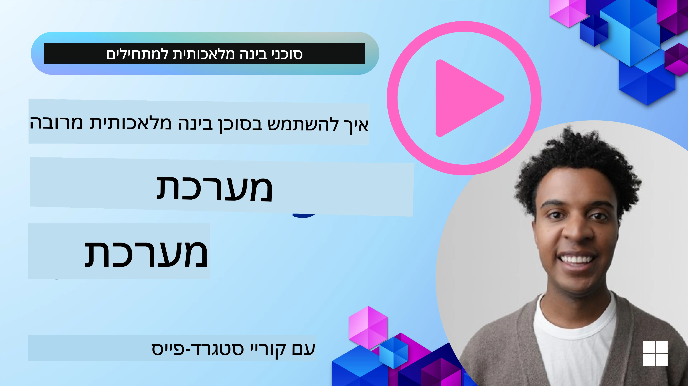
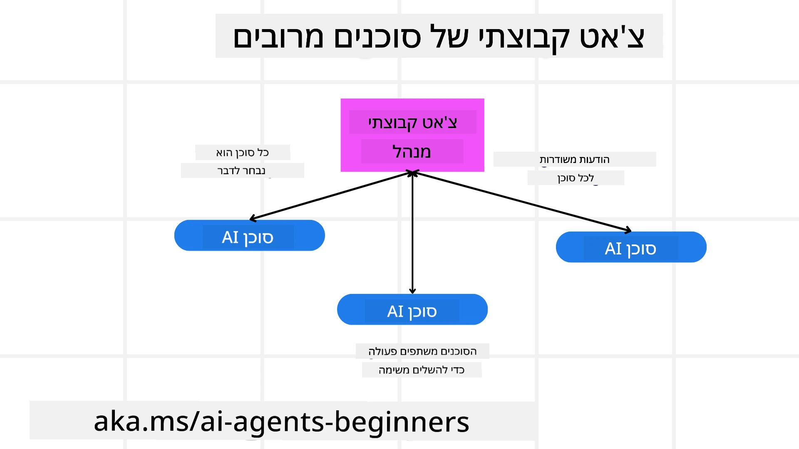
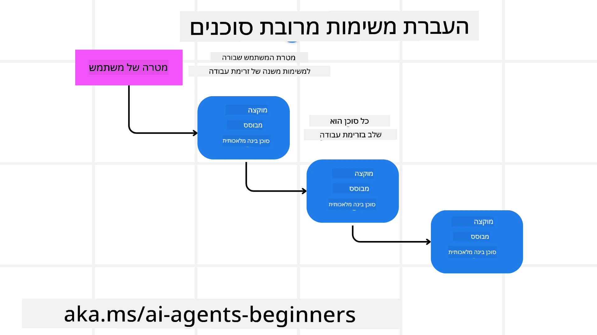
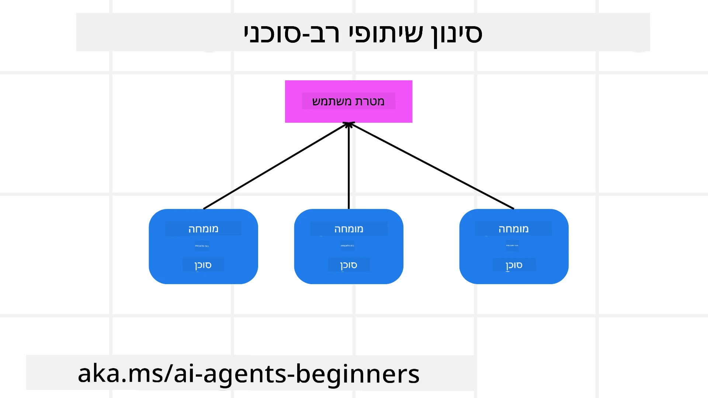

> _(לחצו על התמונה למעלה לצפייה בווידאו של השיעור)_

# תבניות עיצוב רב-סוכנים

ברגע שתתחילו לעבוד על פרויקט הכולל סוכנים מרובים, תצטרכו לשקול את דפוס העיצוב של רב-סוכנים. עם זאת, ייתכן שלא יהיה מיידי מתי לעבור לרב-סוכנים ומהם היתרונות.

## מבוא

בשיעור זה, אנו מתכוונים לענות על השאלות הבאות:

- מהם התרחישים שבהם רב-סוכנים רלוונטיים?
- מהם היתרונות של שימוש ברב-סוכנים לעומת סוכן בודד המבצע משימות רבות?
- מהם אבני הבניין ליישום דפוס העיצוב של רב-סוכנים?
- כיצד יש לנו נראות לאופן שבו הסוכנים המרובים מתקשרים זה עם זה?

## מטרות הלמידה

לאחר שיעור זה, תצטרכו להיות מסוגלים:

- לזהות תרחישים שבהם רב-סוכנים רלוונטיים
- להבין את היתרונות של שימוש ברב-סוכנים לעומת סוכן יחיד.
- להבין את אבני הבניין ליישום דפוס העיצוב של רב-סוכנים.

מה התמונה הגדולה יותר?

*רב-סוכנים הם דפוס עיצוב שמאפשר לסוכנים מרובים לעבוד יחד להשגת מטרה משותפת*.

דפוס זה משמש נפוץ בתחומים שונים, כולל רובוטיקה, מערכות אוטונומיות ומחשוב מבוזר.

## תרחישים בהם רב-סוכנים רלוונטיים

אז באילו תרחישים כדאי להשתמש ברב-סוכנים? התשובה היא שישנם רבים שבהם יש יתרון בשימוש בסוכנים מרובים, במיוחד במקרים הבאים:

- **עומסי עבודה גדולים**: עומסים גדולים יכולים להתחלק למשימות קטנות יותר ולהקצות לסוכנים שונים, מה שמאפשר עיבוד מקבילי והשלמה מהירה יותר. דוגמה לכך היא במקרה של משימת עיבוד נתונים גדולה.
- **משימות מורכבות**: משימות מורכבות, כמו עומסי עבודה גדולים, ניתן לפרק לתת-משימות קטנות יותר ולהקצות לסוכנים שונים, שכל אחד מתמחה בהיבט מסוים של המשימה. דוגמה טובה לכך היא במקרה של רכבים אוטונומיים, שבהם סוכנים שונים מנהלים ניווט, גילוי מכשולים ותקשורת עם רכבים אחרים.
- **מומחיות מגוונת**: סוכנים שונים יכולים להחזיק במומחיות מגוונת, מה שמאפשר להם להתמודד עם היבטים שונים של המשימה בצורה יעילה יותר מסוכן יחיד. דוגמה טובה לכך היא בתחום הבריאות, שבו סוכנים יכולים לטפל באבחונים, תוכניות טיפול ומעקב אחר מטופלים.

## יתרונות של שימוש ברב-סוכנים לעומת סוכן יחיד

מערכת עם סוכן יחיד יכולה לעבוד טוב במשימות פשוטות, אך למשימות מורכבות יותר, שימוש בסוכנים מרובים יכול לספק מספר יתרונות:

- **התמחות**: כל סוכן יכול להתמחות במשימה ספציפית. היעדר התמחות אצל סוכן יחיד משמע שיש סוכן שיכול לעשות הכל, אך עשוי להתבלבל לגבי מה לעשות כאשר הוא מתמודד עם משימה מורכבת. למשל, הוא עלול בסופו של דבר לבצע משימה שאינה מתאימה לו.
- **קנה מידה**: קל יותר להרחיב מערכות על ידי הוספת סוכנים נוספים מאשר להעמיס על סוכן יחיד.
- **סבילות לתקלות**: אם סוכן אחד נכשל, אחרים יכולים להמשיך לפעול, מה שמבטיח אמינות במערכת.

ניקח לדוגמה: נניח שברצוננו להזמין טיול למשתמש. מערכת עם סוכן יחיד תצטרך לטפל בכל ההיבטים של תהליך הזמנת הטיול, החל ממציאת טיסות ועד הזמנת מלונות ורכבי השכרה. כדי להשיג זאת עם סוכן יחיד, על הסוכן להחזיק בכלים לטיפול בכל המשימות האלה. זה עלול להוביל למערכת מורכבת ומונוליטית שקשה לתחזק ולהרחיב. לעומת זאת, מערכת רב-סוכנים יכולה לכלול סוכנים שונים שמתמחים במציאת טיסות, הזמנת מלונות ורכבי השכרה. זה יהפוך את המערכת ליותר מודולרית, קלה לתחזוקה וניתנת להרחבה.

השוו זאת למשרד נסיעות המנוהל כחנות משפחתית לעומת משרד נסיעות כפראנצ'ייז. החנות המשפחתית הייתה כוללת סוכן יחיד המטפל בכל ההיבטים של תהליך הזמנת הטיול, בעוד שהפראנצ'ייז כלל סוכנים שונים המטפלים בהיבטים שונים של תהליך ההזמנה.

## אבני הבניין ליישום דפוס העיצוב של רב-סוכנים

לפני שניתן ליישם את דפוס העיצוב של רב-סוכנים, יש להבין את אבני הבניין שמרכיבות את הדפוס.

נתחיל להיות יותר מוחשיים שוב עם דוגמת הזמנת טיול למשתמש. במקרה זה, אבני הבניין כוללות:

- **תקשורת בין סוכנים**: סוכנים למציאת טיסות, הזמנת מלונות ורכבי השכרה צריכים לתקשר ולשתף מידע על העדפות והגבלות המשתמש. יש להחליט על הפרוטוקולים והשיטות לתקשורת זו. באופן קונקרטי, הסוכן למציאת טיסות צריך לתקשר עם הסוכן להזמנת מלונות כדי לוודא שהמלון מוזמן לאותם תאריכים כמו הטיסה. משמעות הדבר היא שהסוכנים צריכים לשתף מידע על תאריכי הנסיעה של המשתמש, כלומר יש להחליט *אילו סוכנים משתפים מידע ואיך הם משתפים אותו*.
- **מנגנוני תיאום**: הסוכנים צריכים לתאם את פעולותיהם כדי להבטיח שהעדפות וההגבלות של המשתמש יתקיימו. העדפת משתמש יכולה להיות שהוא רוצה מלון קרוב לשדה התעופה בעוד שהגבלה יכולה להיות שרכבי השכרה זמינים רק בשדה התעופה. משמעות הדבר היא שהסוכן להזמנת מלונות צריך לתאם עם הסוכן להזמנת רכבי השכרה כדי להבטיח שהעדפות וההגבלות יתקיימו. משמעות הדבר היא שיש להחליט *כיצד הסוכנים מתאמים את פעולותיהם*.
- **ארכיטקטורת סוכן**: לסוכנים צריכה להיות מבנה פנימי לקבלת החלטות ולמידה מאינטראקציות עם המשתמש. משמעות הדבר היא שהסוכן למציאת טיסות צריך להכיל מבנה פנימי לקבלת החלטות לגבי אילו טיסות להמליץ למשתמש. משמעות הדבר שיש להחליט *כיצד הסוכנים מקבלים החלטות ולומדים מאינטראקציות עם המשתמש*. דוגמאות לאופן בו סוכן לומד ומשפר יכולות להיות שסוכן למציאת טיסות משתמש במודל למידה ממוחשבת להמלץ על טיסות למשתמש בהתבסס על העדפות העבר.
- **נראות אינטראקציות רב-סוכניות**: יש צורך בנראות לאופן שבו סוכנים מרובים מתקשרים זה עם זה. כלומר יש לשלב כלים וטכניקות למעקב אחרי פעילויות ואינטראקציות של סוכנים. זה יכול להיות בצורת כלים ללוגים ומעקב, כלים להמחשה ומדדי ביצועים.
- **תבניות רב-סוכניים**: קיימים דפוסים שונים ליישום מערכות רב-סוכניות, כגון ארכיטקטורות מרכזיות, מבוזרות והיברידיות. יש להחליט על הדפוס המתאים ביותר למקרה השימוש שלכם.
- **אדם בתהליך**: ברוב המקרים יהיה אדם בתהליך ויש להנחות את הסוכנים מתי לבקש התערבות אנושית. זה יכול להיות בצורת בקשת משתמש למלון או טיסה ספציפיים שהסוכנים לא המליצו עליהם, או בקשת אישור טרם הזמנת טיסה או מלון.

## נראות לאינטראקציות רב-סוכניות

חשוב שתהיה נראות לאופן שבו הסוכנים המרובים מתקשרים זה עם זה. נראות זו חיונית לניפוי באגים, אופטימיזציה ולהבטחת יעילות המערכת הכוללת. כדי להשיג זאת, יש צורך בכלים וטכניקות למעקב אחרי פעילויות ואינטראקציות של סוכנים. זה יכול להיות בצורת כלים ללוגים ומעקב, כלים להמחשה ומדדי ביצועים.

לדוגמה, במקרה של הזמנת טיול למשתמש, ניתן יהיה להציג לוח מחוונים המציג את מצב כל סוכן, העדפות והגבלות המשתמש, והאינטראקציות בין הסוכנים. לוח מחוונים זה יוכל להציג את תאריכי הנסיעה של המשתמש, את הטיסות שמומלצות על ידי סוכן הטיסות, את המלונות שמומלצים על ידי סוכן המלונות, ואת רכבי ההשכרה שמומלצים על ידי סוכן רכבים להשכרה. זה ייתן לכם תמונה ברורה כיצד הסוכנים מתקשרים זה עם זה והאם העדפות וההגבלות של המשתמש מתקיימות.

בואו נבחן כל אחד מההיבטים האלה בפירוט רב יותר.

- **כלים ללוגים ומעקב**: יש לרשום לוג עבור כל פעולה שבוצעה על ידי סוכן. רשומת הלוג יכולה לכלול מידע על הסוכן שביצע את הפעולה, הפעולה שבוצעה, הזמן שבו בוצעה וההישג של הפעולה. מידע זה יכול לשמש לניפוי באגים, אופטימיזציה ועוד.

- **כלים להמחשה**: כלים להמחשה יכולים לסייע לכם לראות את האינטראקציות בין הסוכנים בצורה אינטואיטיבית יותר. לדוגמה, תוכלו להציג גרף המדגים את זרימת המידע בין הסוכנים. זה יכול לסייע לזהות צווארי בקבוק, חוסר יעילות ובעיות נוספות במערכת.

- **מדדי ביצועים**: מדדי ביצועים יכולים לסייע לכם לעקוב אחר יעילות מערכת הרב-סוכנים. לדוגמה, תוכלו למדוד את זמן השלמת משימה, את מספר המשימות שהושלמו ליחידת זמן ואת דיוק ההמלצות שניתנו על ידי הסוכנים. מידע זה יכול לסייע לזהות תחומים לשיפור ואופטימיזציה של המערכת.

## תבניות רב-סוכניות

נצלול לכמה דפוסים מוחשיים שניתן להשתמש בהם ליצירת אפליקציות רב-סוכניות. להלן כמה דפוסים מעניינים ששווה לשקול:

### שיחת קבוצתית

דפוס זה שימושי כאשר רוצים ליצור אפליקציית שיחה קבוצתית שבה סוכנים מרובים יכולים לתקשר זה עם זה. מקרים טיפוסיים לשימוש בדפוס זה כוללים שיתופי פעולה בקבוצה, תמיכת לקוחות ורשתות חברתיות.

בדפוס זה, כל סוכן מייצג משתמש בשיחת הקבוצה, והודעות מוחלפות בין הסוכנים באמצעות פרוטוקול הודעות. הסוכנים יכולים לשלוח הודעות לשיחת הקבוצה, לקבל הודעות מהקבוצה ולהגיב להודעות מסוכנים אחרים.

דפוס זה ניתן למימוש באמצעות ארכיטקטורה מרכזית שבה כל ההודעות מנותבות דרך שרת מרכזי, או ארכיטקטורה מבוזרת שבה ההודעות מוחלפות ישירות.

### העברת משימות (Hand-off)

דפוס זה שימושי כאשר רוצים ליצור אפליקציה שבה סוכנים מרובים יכולים להעביר משימות אחד לשני.

מקרים טיפוסיים לשימוש בדפוס זה כוללים תמיכת לקוחות, ניהול משימות ואוטומציה של זרימות עבודה.

בדפוס זה, כל סוכן מייצג משימה או שלב בזרימת עבודה, והסוכנים יכולים להעביר משימות לסוכנים אחרים בהתאם לכללים שהוגדרו מראש.

### סינון שיתופי

דפוס זה שימושי כאשר רוצים ליצור אפליקציה שבה סוכנים מרובים משתפים פעולה לתת המלצות למשתמשים.

מדוע תרצו שסוכנים מרובים ישתפו פעולה? מכיוון שכל סוכן יכול להחזיק במומחיות שונה ולהשתתף בתהליך ההמלצות בדרכים שונות.

ניקח לדוגמה משתמש המבקש המלצה על המניה הטובה ביותר לקנייה בשוק ההון.

- **מומחה לתעשייה**: סוכן אחד יכול להיות מומחה בתחום תעשייה מסוים.
- **ניתוח טכני**: סוכן נוסף יכול להיות מומחה בניתוח טכני.
- **ניתוח יסודי**: וסוכן נוסף יכול להיות מומחה בניתוח יסודי. באמצעות שיתוף פעולה, סוכנים אלה יכולים לתת המלצה מקיפה יותר למשתמש.

## תרחיש: תהליך החזר כספי

שקלו תרחיש שבו לקוח מנסה לקבל החזר על מוצר. בתהליך זה יכולים להיות מעורבים סוכנים רבים, אך נחלק אותם בין סוכנים ספציפיים לתהליך וסוכנים כלליים שניתן להשתמש בהם בתהליכים אחרים.

**סוכנים ספציפיים לתהליך ההחזר**:

להלן כמה סוכנים שיכולים להיות מעורבים בתהליך ההחזר:

- **סוכן לקוח**: סוכן זה מייצג את הלקוח ואחראי על ייזום תהליך ההחזר.
- **סוכן מוכר**: סוכן זה מייצג את המוכר ואחראי על עיבוד ההחזר.
- **סוכן תשלום**: סוכן זה מייצג את תהליך התשלום ואחראי על החזר התשלום ללקוח.
- **סוכן פתרון בעיות**: סוכן זה מייצג את תהליך הפתרון ואחראי על טיפול בכל בעיה שעולה במהלך תהליך ההחזר.
- **סוכן ציות**: סוכן זה מייצג את תהליך הציות ואחראי על הבטחת עמידה בתקנות ובמדיניות בתהליך ההחזר.

**סוכנים כלליים**:

סוכנים אלה יכולים לשמש בחלקים אחרים בעסק שלכם.

- **סוכן משלוחים**: סוכן זה מייצג את תהליך המשלוחים ואחראי על שליחת המוצר חזרה למוכר. סוכן זה יכול לשמש גם עבור תהליך ההחזר וגם עבור משלוח כללי של מוצר במסגרת רכישה, לדוגמה.
- **סוכן משוב**: סוכן זה מייצג את תהליך המשוב ואחראי על איסוף משוב מהלקוח. משוב יכול להינתן בכל עת ולא רק במהלך תהליך ההחזר.
- **סוכן הסלמה**: סוכן זה מייצג את תהליך ההסלמה ואחראי על העברת בעיות לרמה גבוהה יותר של תמיכה. ניתן להשתמש בסוג זה של סוכן בכל תהליך שבו יש צורך בהסלמה.
- **סוכן הודעות**: סוכן זה מייצג את תהליך ההודעות ואחראי על שליחת התראות ללקוח בשלבים שונים של תהליך ההחזר.
- **סוכן אנליטיקה**: סוכן זה מייצג את תהליך האנליטיקה ואחראי על ניתוח נתונים הקשורים לתהליך ההחזר.
- **סוכן ביקורת**: סוכן זה מייצג את תהליך הביקורת ואחראי על ביקורת תהליך ההחזר כדי לוודא שהוא מתבצע כהלכה.
- **סוכן דיווח**: סוכן זה מייצג את תהליך הדיווח ואחראי על הפקת דוחות על תהליך ההחזר.
- **סוכן ידע**: סוכן זה מייצג את תהליך הידע ואחראי על תחזוקת בסיס ידע של מידע הקשור לתהליך ההחזר. סוכן זה יכול להיות בקיא גם בנושא ההחזרים וגם בנושאים אחרים של העסק שלכם.
- **סוכן אבטחה**: סוכן זה מייצג את תהליך האבטחה ואחראי על הבטחת אבטחת תהליך ההחזר.
- **סוכן איכות**: סוכן זה מייצג את תהליך האיכות ואחראי על הבטחת איכות תהליך ההחזר.

ישנם לא מעט סוכנים שמוזכרים לעיל, גם לסוכנים הספציפיים לתהליך ההחזר וגם לסוכנים הכלליים שניתן להשתמש בהם בחלקים אחרים בעסק שלכם. מקווים שזה נותן לכם מושג כיצד להחליט אילו סוכנים לשלב במערכת רב-סוכנית שלכם.

## משימה

עצבו מערכת רב-סוכנים לתהליך תמיכת לקוחות. זהו את הסוכנים המעורבים בתהליך, תפקידיהם ואחריותם, ואיך הם מתקשרים זה עם זה. שקלו גם את הסוכנים הספציפיים לתהליך תמיכת הלקוחות וגם את הסוכנים הכלליים שניתן להשתמש בהם בחלקים אחרים בעסק שלכם.

> חשוב לפני שתקרא את הפתרון הבא, ייתכן שתזדקק ליותר סוכנים ממה שאתה חושב.

> טיפ: חשוב על השלבים השונים של תהליך שירות הלקוחות וקח בחשבון גם סוכנים שנדרשים לכל מערכת.

## פתרון

[פתרון](./solution/solution.md)

## בדיקות ידע

### שאלה 1

איזו תרחיש מתאים ביותר למערכת מרובת סוכנים?

- [ ] A1: בוט תמיכה שעונה על שאלות נפוצות באמצעות מאגר ידע אחד וקבוצה קטנה של כלים.
- [ ] A2: תהליך החזרות דורש תפקידים נפרדים להונאה, לתשלום וציות, כשכל אחד מהם עם הכלים שלו, ותוצאותיהם חייבות להתואם.
- [ ] A3: אותה בקשת סיווג פשוטה מגיעה אלפי פעמים בשעה.

### שאלה 2

מתי סוכן יחיד הוא בדרך כלל הבחירה הטובה יותר?

- [ ] A1: המשימה ניתנת לטיפול בעזרת סט אחד של הוראות וכלים, ללא העברות למומחים.
- [ ] A2: לסוכן יש גישה ליותר מכלי אחד.
- [ ] A3: תהליך העבודה דורש תפקידים נפרדים עם הרשאות שונות ומסלולי ביקורת עצמאיים.

[פתרון המבחן](./solution/solution-quiz.md)

## סיכום

בשיעור זה בחנו את דפוס העיצוב של מערכת מרובת סוכנים, כולל התרחישים בהם מתאים להשתמש במרובי סוכנים, היתרונות של שימוש במרובי סוכנים על פני סוכן יחיד, אבני הבניין ליישום דפוס העיצוב של מרובי סוכנים, ואיך לקבל נראות על האינטראקציה בין הסוכנים השונים.

### יש לך עוד שאלות לגבי דפוס העיצוב של מרובי סוכנים?

הצטרף ל-[Microsoft Foundry Discord](https://discord.com/invite/ATgtXmAS5D) כדי לפגוש לומדים אחרים, להשתתף בשעות משרד ולקבל תשובות על שאלותיך בנוגע לסוכני AI.

## משאבים נוספים

- <a href="https://learn.microsoft.com/azure/ai-services/agents/overview" target="_blank">תיעוד מסגרת סוכני מיקרוסופט</a>
- <a href="https://www.analyticsvidhya.com/blog/2024/10/agentic-design-patterns/" target="_blank">דפוסי עיצוב סוכניים</a>

## שיעור קודם

[תכנון עיצוב](../07-planning-design/README.md)

## שיעור הבא

[מטה-קוגניציה בסוכני AI](../09-metacognition/README.md)

---

<!-- CO-OP TRANSLATOR DISCLAIMER START -->
**כתב ויתור**:
מסמך זה תורגם באמצעות שירות תרגום אוטומטי [Co-op Translator](https://github.com/Azure/co-op-translator). למרות שאנו שואפים לדיוק, יש לקחת בחשבון שתרגומים אוטומטיים עלולים להכיל שגיאות או אי-דיוקים. יש להחשיב את המסמך המקורי בשפתו הטבעית כמקור הסמכות. למידע קריטי מומלץ להשתמש בתרגום מקצועי על ידי מתרגם אדם. אנו לא אחראים לכל אי-הבנה או פירוש שגוי הנובע מהשימוש בתרגום זה.
<!-- CO-OP TRANSLATOR DISCLAIMER END -->