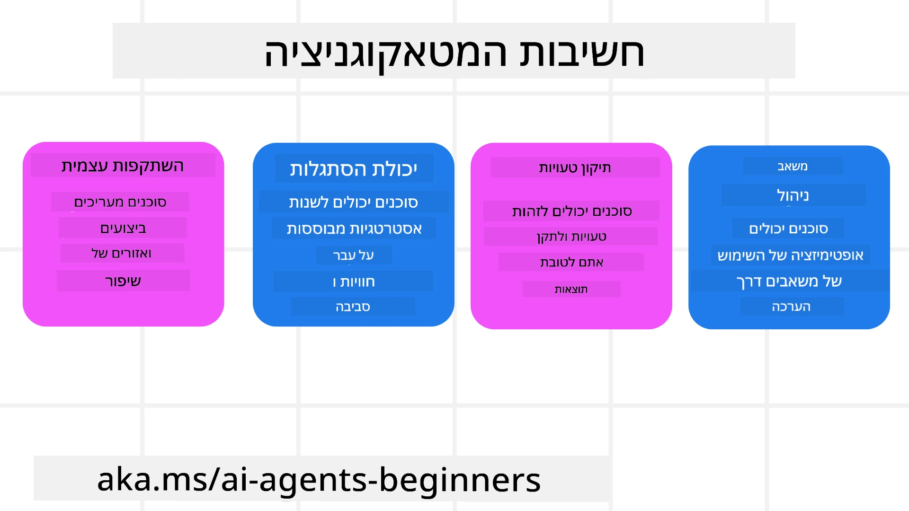
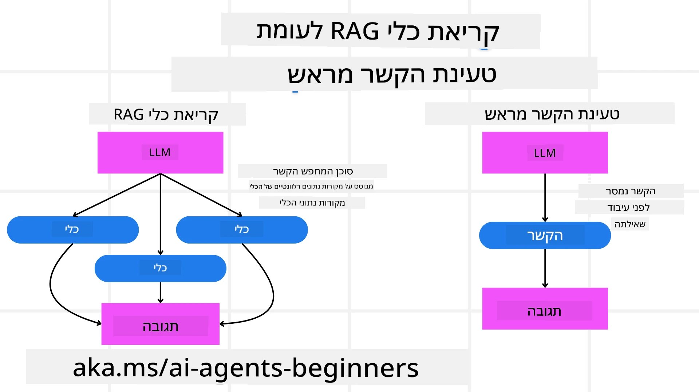

[](https://youtu.be/His9R6gw6Ec?si=3_RMb8VprNvdLRhX)

> _(לחץ על התמונה למעלה כדי לצפות בסרטון של השיעור)_
# מטאקוגניציה בסוכני AI

## מבוא

ברוכים הבאים לשיעור על מטאקוגניציה בסוכני בינה מלאכותית! פרק זה מיועד למתחילים הסקרנים לגבי כיצד סוכני AI יכולים לחשוב על תהליכי החשיבה שלהם עצמם. בסיום השיעור הזה, תבינו מושגים מרכזיים ותהיו מצוידים בדוגמאות מעשיות ליישום מטאקוגניציה בעיצוב סוכני AI.

## מטרות הלמידה

לאחר שתסיימו את השיעור, תוכלו:

1. להבין את ההשלכות של לולאות היסק בהגדרות סוכנים.
2. להשתמש בטכניקות תכנון והערכה כדי לסייע לסוכנים מתוקנים עצמם.
3. ליצור סוכנים משלכם המסוגלים למניפולציה של קוד כדי להשלים משימות.

## מבוא למטאקוגניציה

מטאקוגניציה מתייחסת לתהליכים קוגניטיביים ברמה גבוהה שכוללים חשיבה על החשיבה של עצמנו. עבור סוכני בינה מלאכותית, זה אומר להיות מסוגלים להעריך ולהתאים את פעולותיהם בהתבסס על מודעות עצמית וניסיון עבר. מטאקוגניציה, או "חשיבה על חשיבה," הוא מושג חשוב בפיתוח מערכות AI סוכניות. זה כולל מערכות AI המודעות לתהליכים הפנימיים שלהן והמסוגלות לנטר, לווסת ולהתאים את ההתנהגות שלהן בהתאם. בדומה למה שאנחנו עושים כשאנחנו "קוראים את החדר" או מתבוננים בבעיה. מודעות עצמית זו יכולה לסייע למערכות AI לקבל החלטות טובות יותר, לאתר שגיאות ולשפר את הביצועים שלהן עם הזמן - שוב מקשר חזרה למבחן טיורינג ולדיון האם AI ישתלט בעתיד.

בהקשר של מערכות AI סוכניות, מטאקוגניציה יכולה לסייע להתמודד עם כמה אתגרים, כגון:
- שקיפות: הבטחת יכולת הסבר של מערכות AI לגבי ההיסק וההחלטות שלהן.
- היסק: שיפור יכולת המערכות ליצור סינתזה של מידע ולקבל החלטות נכונות.
- התאמה: מתן אפשרות למערכות AI להסתגל לסביבות חדשות ולשינויים בתנאים.
- תפיסה: שיפור הדיוק של מערכות AI בזיהוי ובפרשנות נתונים מהסביבה שלהן.

### מהי מטאקוגניציה?

מטאקוגניציה, או "חשיבה על חשיבה," היא תהליך קוגניטיבי גבוה הכולל מודעות עצמית וויסות עצמי של תהליכים קוגניטיביים. בתחום ה-AI, מטאקוגניציה מאפשרת לסוכנים להעריך ולהתאים את האסטרטגיות והפעולות שלהם, מה שמוביל לשיפור בפתרון בעיות ובקבלת החלטות. בהבנת מטאקוגניציה, תוכלו לעצב סוכני AI שהם לא רק אינטיליגנטיים יותר אלא גם אדפטיביים ויעילים יותר. במטאקוגניציה אמיתית, ניתן לראות את ה-AI מנמק במפורש על ההיסק שלו עצמו.

דוגמה: "עדפתי טיסות זולות כי... אולי אני מפספס טיסות ישירות, אז אשוב לבדוק."
מעקב אחרי כיצד או מדוע בחר במסלול מסוים.
- לציין שעשה טעויות כי הסתמך יותר מדי על העדפות המשתמש מלפעם שעברה, ולכן משנה את אסטרטגיית קבלת ההחלטות שלו ולא רק את ההמלצה הסופית.
- לאבחן דפוסים כמו, "כל פעם שאני שומע את המשתמש אומר 'רע מאוד צפוף,' אני לא רק אמחק אטרקציות מסוימות אלא גם אשקף שהשיטה שלי לבחירת 'אטרקציות מובילות' פגומה אם אני תמיד מדרג לפי פופולריות."

### חשיבות המטאקוגניציה בסוכני AI

למטאקוגניציה יש תפקיד מכריע בעיצוב סוכני AI ממספר סיבות:



- הרהור עצמי: סוכנים יכולים להעריך את הביצועים שלהם ולזהות אזורים לשיפור.
- יכולת התאמה: סוכנים יכולים לשנות את האסטרטגיות שלהם בהתבסס על ניסיון עבר וסביבות משתנות.
- תיקון שגיאות: סוכנים יכולים לאתר ולתקן שגיאות באופן אוטונומי, מה שמוביל לתוצאות מדויקות יותר.
- ניהול משאבים: סוכנים יכולים לייעל את השימוש במשאבים, כגון זמן וכוח מחשוב, על ידי תכנון והערכת פעולותיהם.

## רכיבים של סוכן AI

לפני שנכנסים לתהליכים מטאקוגניטיביים, חשוב להבין את הרכיבים הבסיסיים של סוכן AI. סוכן AI בדרך כלל מורכב מ:

- פרסונה: האישיות והתכונות של הסוכן, המגדירות כיצד הוא מתקשר עם המשתמשים.
- כלים: היכולות והפונקציות שהסוכן מסוגל לבצע.
- מיומנויות: הידע והמומחיות שהסוכן מחזיק.

רכיבים אלה עובדים יחד כדי ליצור "יחידת מומחיות" שיכולה לבצע משימות ספציפיות.

**דוגמה**:
שקלו סוכן נסיעות, שירותי סוכן שמתכנן את החופשה שלכם וגם מתאים את מסלולו בהתבסס על נתונים בזמן אמת וניסיון טיולים קודמים של הלקוחות.

### דוגמה: מטאקוגניציה בשירות סוכן נסיעות

דמיינו שאתם מתכננים שירות סוכן נסיעות המונע על ידי AI. סוכן זה, "סוכן נסיעות," מסייע למשתמשים לתכנן את חופשותיהם. כדי לשלב מטאקוגניציה, סוכן הנסיעות צריך להעריך ולהתאים את פעולותיו על בסיס מודעות עצמית וניסיון עבר. כך המטאקוגניציה יכולה לשחק תפקיד:

#### משימה נוכחית

המשימה הנוכחית היא לעזור למשתמש לתכנן טיול לפריז.

#### צעדים להשלמת המשימה

1. **איסוף העדפות המשתמש**: לשאול את המשתמש על תאריכי הנסיעה, התקציב, תחומי עניין (למשל מוזיאונים, קולינריה, קניות) וכל דרישה ספציפית.
2. **איסוף מידע**: לחפש אפשרויות טיסה, מגורים, אטרקציות ומסעדות שתואמות להעדפות המשתמש.
3. **יצירת המלצות**: לספק מסלול מותאם אישית עם פרטי טיסות, הזמנות במלונות ופעילויות מוצעות.
4. **התאמה על בסיס משוב**: לבקש משוב מהמשתמש על ההמלצות ולבצע התאמות נדרשות.

#### משאבים נדרשים

- גישה למסדי נתונים של הזמנות טיסות ומלונות.
- מידע על אטרקציות ומסעדות בפריז.
- נתוני משוב משתמשים מאינטראקציות קודמות.

#### ניסיון והרהור עצמי

סוכן הנסיעות משתמש במטאקוגניציה כדי להעריך את ביצועיו וללמוד מניסיון עבר. לדוגמה:

1. **ניתוח משוב משתמשים**: סוכן הנסיעות בוחן את המשוב שניתן כדי לקבוע אילו המלצות התקבלו היטב ואילו לא. הוא מתאים את ההמלצות העתידיות בהתאמה.
2. **יכולת התאמה**: אם משתמש הזכיר בעבר שהוא לא אוהב מקומות צפופים, סוכן הנסיעות יימנע מהמלצה על אתרים תיירותיים פופולריים בשעות העומס בעתיד.
3. **תיקון שגיאות**: אם סוכן הנסיעות עשה טעות בהזמנה קודמת, כמו להמליץ על מלון שהיה מלא, הוא ילמד לבדוק זמינות ביתר רגשנות לפני מתן המלצות.

#### דוגמה מעשית למפתח

הנה דוגמה מפושטת כיצד הקוד של סוכן נסיעות עשוי להיראות כשהוא משלב מטאקוגניציה:

```python
class Travel_Agent:
    def __init__(self):
        self.user_preferences = {}
        self.experience_data = []

    def gather_preferences(self, preferences):
        self.user_preferences = preferences

    def retrieve_information(self):
        # חפש טיסות, בתי מלון ואטרקציות בהתבסס על העדפות
        flights = search_flights(self.user_preferences)
        hotels = search_hotels(self.user_preferences)
        attractions = search_attractions(self.user_preferences)
        return flights, hotels, attractions

    def generate_recommendations(self):
        flights, hotels, attractions = self.retrieve_information()
        itinerary = create_itinerary(flights, hotels, attractions)
        return itinerary

    def adjust_based_on_feedback(self, feedback):
        self.experience_data.append(feedback)
        # נתח משוב והתאם המלצות עתידיות
        self.user_preferences = adjust_preferences(self.user_preferences, feedback)

# דוגמת שימוש
travel_agent = Travel_Agent()
preferences = {
    "destination": "Paris",
    "dates": "2025-04-01 to 2025-04-10",
    "budget": "moderate",
    "interests": ["museums", "cuisine"]
}
travel_agent.gather_preferences(preferences)
itinerary = travel_agent.generate_recommendations()
print("Suggested Itinerary:", itinerary)
feedback = {"liked": ["Louvre Museum"], "disliked": ["Eiffel Tower (too crowded)"]}
travel_agent.adjust_based_on_feedback(feedback)
```

#### למה מטאקוגניציה חשובה

- **הרהור עצמי**: סוכנים יכולים לנתח את ביצועיהם ולזהות אזורים לשיפור.
- **יכולת התאמה**: סוכנים יכולים לשנות אסטרטגיות בהתבסס על משוב ותנאים משתנים.
- **תיקון שגיאות**: סוכנים יכולים לזהות ולתקן טעויות באופן אוטונומי.
- **ניהול משאבים**: סוכנים יכולים לייעל את השימוש במשאבים, כגון זמן וכוח מחשוב.

באמצעות שילוב מטאקוגניציה, סוכן הנסיעות יכול לספק המלצות נסיעה מותאמות ומדויקות יותר, המשפרות את חוויית המשתמש הכוללת.

---

## 2. תכנון בסוכנים

תכנון הוא רכיב קריטי בהתנהגות סוכני AI. הוא כולל תכנון הצעדים הנדרשים להשגת מטרה, תוך התחשבות במצב הנוכחי, במשאבים ובמכשולים אפשריים.

### מרכיבי התכנון

- **משימה נוכחית**: הגדרת המשימה בצורה ברורה.
- **צעדים להשלמת המשימה**: פירוק המשימה לצעדים ניתנים לניהול.
- **משאבים נדרשים**: זיהוי המשאבים הנחוצים.
- **ניסיון**: שימוש בניסיון עבר כדי לתמוך בתכנון.

**דוגמה**:
הנה הצעדים שסוכן הנסיעות צריך לבצע כדי לסייע למשתמש בתכנון הטיול ביעילות:

### צעדים לסוכן הנסיעות

1. **איסוף העדפות המשתמש**
   - לשאול את המשתמש על פרטים כגון תאריכי נסיעה, תקציב, תחומי עניין וכל דרישה מיוחדת.
   - דוגמאות: "מתי אתה מתכנן לנסוע?" "מה טווח התקציב שלך?" "אילו פעילויות אתה נהנה בחופשה?"

2. **איסוף מידע**
   - לחפש אפשרויות נסיעה רלוונטיות בהתבסס על העדפות המשתמש.
   - **טיסות**: לחפש טיסות זמינות בטווח תקציב ותאריכי הנסיעה של המשתמש.
   - **מגורים**: למצוא מלונות או נכסים להשכרה שתואמים להעדפות המשתמש בנוגע למיקום, מחיר ושירותים.
   - **אטרקציות ומסעדות**: לזהות אטרקציות, פעילויות ואפשרויות אוכל פופולריות התואמות לתחומי העניין של המשתמש.

3. **יצירת המלצות**
   - לאסוף את המידע שנאסף ליצירת מסלול מותאם.
   - לספק פרטים כגון אפשרויות טיסה, הזמנות במלונות ופעילויות מוצעות, תוך התאמה להעדפות המשתמש.

4. **הצגת המסלול למשתמש**
   - לשתף את המסלול המוצע עם המשתמש לבדיקתו.
   - דוגמה: "הנה מסלול מוצע לטיול שלך בפריז. כולל פרטי טיסות, הזמנות במלונות ורשימת פעילויות ומסעדות מומלצות. ספר לי מה דעתך!"

5. **איסוף משוב**
   - לבקש מהמשתמש משוב על המסלול המוצע.
   - דוגמאות: "האם אתה מרוצה מאפשרויות הטיסה?" "המלון מתאים לצרכים שלך?" "יש פעילויות שברצונך להוסיף או להסיר?"

6. **התאמה על בסיס המשוב**
   - לשנות את המסלול בהתאם למשוב המשתמש.
   - לבצע שינויים נדרשים בהמלצות טיסה, מגורים ופעילויות כדי להתאים טוב יותר להעדפות המשתמש.

7. **אישור סופי**
   - להציג למשתמש את המסלול המעודכן לאישור סופי.
   - דוגמה: "ביצעתי את השינויים לפי המשוב שלך. הנה המסלול המעודכן. הכל נראה טוב?"

8. **הזמנה ואישור הזמנות**
   - ברגע שהמשתמש מאשר את המסלול, להמשיך בהזמנת טיסות, מגורים וכל פעילות מתוכננת מראש.
   - לשלוח למשתמש את פרטי האישור.

9. **מתן תמיכה מתמשכת**
   - להיות זמין לסייע למשתמש עם שינויים או בקשות נוספות לפני ובמהלך הטיול.
   - דוגמה: "אם תזדקק לעזרה נוספת במהלך הטיול, אל תהסס לפנות אליי בכל עת!"

### דוגמת אינטראקציה

```python
class Travel_Agent:
    def __init__(self):
        self.user_preferences = {}
        self.experience_data = []

    def gather_preferences(self, preferences):
        self.user_preferences = preferences

    def retrieve_information(self):
        flights = search_flights(self.user_preferences)
        hotels = search_hotels(self.user_preferences)
        attractions = search_attractions(self.user_preferences)
        return flights, hotels, attractions

    def generate_recommendations(self):
        flights, hotels, attractions = self.retrieve_information()
        itinerary = create_itinerary(flights, hotels, attractions)
        return itinerary

    def adjust_based_on_feedback(self, feedback):
        self.experience_data.append(feedback)
        self.user_preferences = adjust_preferences(self.user_preferences, feedback)

# שימוש לדוגמה בתוך בקשת ליגוח
travel_agent = Travel_Agent()
preferences = {
    "destination": "Paris",
    "dates": "2025-04-01 to 2025-04-10",
    "budget": "moderate",
    "interests": ["museums", "cuisine"]
}
travel_agent.gather_preferences(preferences)
itinerary = travel_agent.generate_recommendations()
print("Suggested Itinerary:", itinerary)
feedback = {"liked": ["Louvre Museum"], "disliked": ["Eiffel Tower (too crowded)"]}
travel_agent.adjust_based_on_feedback(feedback)
```

## 3. מערכת RAG מתקנת

נתחיל בהבנת ההבדל בין כלי RAG לבין טעינת הקשר ממוקד מראש



### ייצור משולב עם שליפה (RAG)

RAG משלבת מערכת שליפה עם מודל יצירתי. כשמתבצע שאילתה, מערכת השליפה מושכת מסמכים או נתונים רלוונטיים ממקור חיצוני, והמידע שנשלף משמש להרחבת הקלט למודל היצירתי. זה עוזר למודל לייצר תגובות מדויקות ורלוונטיות יותר להקשר.

במערכת RAG, הסוכן מושך מידע רלוונטי מבסיס ידע ומשתמש בו ליצירת תגובות או פעולות מתאימות.

### גישת RAG מתקנת

גישת ה-RAG המתקנת מתמקדת בשימוש בטכניקות RAG לתיקון שגיאות ולשיפור דיוק סוכני AI. זה כולל:

1. **טכניקת הנחיה**: שימוש בהנחיות ספציפיות להכוונת הסוכן בשליפת מידע רלוונטי.
2. **כלי**: יישום אלגוריתמים ומנגנונים שמאפשרים לסוכן להעריך את הרלוונטיות של המידע שנשלף וליצור תגובות מדויקות.
3. **הערכה**: הערכה מתמשכת של ביצועי הסוכן וביצוע התאמות לשיפור הדיוק והיעילות.

#### דוגמה: RAG מתקנת בסוכן חיפוש

שקלו סוכן חיפוש שחולץ מידע מהאינטרנט כדי לענות על שאלות משתמשים. גישת ה-RAG המתקנת עשויה לכלול:

1. **טכניקת הנחיה**: ניסוח שאילתות חיפוש בהתאם לקלט של המשתמש.
2. **כלי**: שימוש בעיבוד שפה טבעית ואלגוריתמי למידה ממוחשבת כדי לדרג ולסנן תוצאות חיפוש.
3. **הערכה**: ניתוח משוב משתמשים לזיהוי ותיקון אי-דיוקים במידע שנשלף.

### RAG מתקנת בסוכן נסיעות

RAG מתקנת (Retrieval-Augmented Generation) משפרת את יכולת ה-AI לשלוף וליצור מידע תוך תיקון אי-דיוקים. נבחן כיצד סוכן הנסיעות יכול להשתמש בגישת RAG מתקנת כדי לספק המלצות נסיעה מדויקות ורלוונטיות יותר.

זה כולל:

- **טכניקת הנחיה:** שימוש בהנחיות ספציפיות להכוונת הסוכן בשליפת מידע רלוונטי.
- **כלי:** יישום אלגוריתמים ומנגנונים המאפשרים לסוכן להעריך את רלוונטיות המידע שנשלף וליצור תגובות מדויקות.
- **הערכה:** הערכה מתמשכת של ביצועי הסוכן וביצוע התאמות לשיפור הדיוק והיעילות.

#### צעדים ליישום RAG מתקנת בסוכן נסיעות

1. **אינטראקציה ראשונית עם המשתמש**
   - סוכן הנסיעות אוסף העדפות ראשוניות מהמשתמש, כגון יעד, תאריכי נסיעה, תקציב ותחומי עניין.
   - דוגמה:

     ```python
     preferences = {
         "destination": "Paris",
         "dates": "2025-04-01 to 2025-04-10",
         "budget": "moderate",
         "interests": ["museums", "cuisine"]
     }
     ```

2. **שליפת מידע**
   - סוכן הנסיעות מושך מידע על טיסות, מקומות אירוח, אטרקציות ומסעדות בהתבסס על העדפות המשתמש.
   - דוגמה:

     ```python
     flights = search_flights(preferences)
     hotels = search_hotels(preferences)
     attractions = search_attractions(preferences)
     ```

3. **יצירת המלצות ראשוניות**
   - סוכן הנסיעות משתמש במידע שנשלף כדי ליצור מסלול מותאם אישית.
   - דוגמה:

     ```python
     itinerary = create_itinerary(flights, hotels, attractions)
     print("Suggested Itinerary:", itinerary)
     ```

4. **איסוף משוב מהמשתמש**
   - סוכן הנסיעות שואל את המשתמש משוב על ההמלצות הראשוניות.
   - דוגמה:

     ```python
     feedback = {
         "liked": ["Louvre Museum"],
         "disliked": ["Eiffel Tower (too crowded)"]
     }
     ```

5. **תהליך RAG מתקנת**
   - **טכניקת הנחיה**: סוכן הנסיעות מנסח שאילתות חיפוש חדשות בהתבסס על משוב המשתמש.
     - דוגמה:

       ```python
       if "disliked" in feedback:
           preferences["avoid"] = feedback["disliked"]
       ```

   - **כלי**: סוכן הנסיעות משתמש באלגוריתמים לדרוג וסינון תוצאות חיפוש חדשות, תוך הדגשת הרלוונטיות בהתבסס על משוב המשתמש.
     - דוגמה:

       ```python
       new_attractions = search_attractions(preferences)
       new_itinerary = create_itinerary(flights, hotels, new_attractions)
       print("Updated Itinerary:", new_itinerary)
       ```

   - **הערכה**: סוכן הנסיעות מעריך באופן מתמשך את הרלוונטיות והדיוק של ההמלצות על ידי ניתוח משוב משתמשים וביצוע התאמות נדרשות.
     - דוגמה:

       ```python
       def adjust_preferences(preferences, feedback):
           if "liked" in feedback:
               preferences["favorites"] = feedback["liked"]
           if "disliked" in feedback:
               preferences["avoid"] = feedback["disliked"]
           return preferences

       preferences = adjust_preferences(preferences, feedback)
       ```

#### דוגמה מעשית

הנה דוגמת קוד פייתון מפושטת המשולבת בגישת RAG מתקנת בסוכן נסיעות:

```python
class Travel_Agent:
    def __init__(self):
        self.user_preferences = {}
        self.experience_data = []

    def gather_preferences(self, preferences):
        self.user_preferences = preferences

    def retrieve_information(self):
        flights = search_flights(self.user_preferences)
        hotels = search_hotels(self.user_preferences)
        attractions = search_attractions(self.user_preferences)
        return flights, hotels, attractions

    def generate_recommendations(self):
        flights, hotels, attractions = self.retrieve_information()
        itinerary = create_itinerary(flights, hotels, attractions)
        return itinerary

    def adjust_based_on_feedback(self, feedback):
        self.experience_data.append(feedback)
        self.user_preferences = adjust_preferences(self.user_preferences, feedback)
        new_itinerary = self.generate_recommendations()
        return new_itinerary

# דוגמת שימוש
travel_agent = Travel_Agent()
preferences = {
    "destination": "Paris",
    "dates": "2025-04-01 to 2025-04-10",
    "budget": "moderate",
    "interests": ["museums", "cuisine"]
}
travel_agent.gather_preferences(preferences)
itinerary = travel_agent.generate_recommendations()
print("Suggested Itinerary:", itinerary)
feedback = {"liked": ["Louvre Museum"], "disliked": ["Eiffel Tower (too crowded)"]}
new_itinerary = travel_agent.adjust_based_on_feedback(feedback)
print("Updated Itinerary:", new_itinerary)
```

### טעינת הקשר ממוקדת מראש


טעינת הקשר מראש כוללת טעינת הקשר רלוונטי או מידע רקע למודל לפני עיבוד השאילתה. משמעות הדבר היא שהמודל ניגש למידע זה מההתחלה, מה שיכול לעזור לו לייצר תגובות מושכלות יותר ללא צורך בשליפת מידע נוסף במהלך התהליך.

הנה דוגמה מפושטת כיצד טעינת הקשר מראש עשויה להיראות עבור אפליקציית סוכן נסיעות ב-Python:

```python
class TravelAgent:
    def __init__(self):
        # הטען מראש יעדים פופולריים ואת המידע שלהם
        self.context = {
            "Paris": {"country": "France", "currency": "Euro", "language": "French", "attractions": ["Eiffel Tower", "Louvre Museum"]},
            "Tokyo": {"country": "Japan", "currency": "Yen", "language": "Japanese", "attractions": ["Tokyo Tower", "Shibuya Crossing"]},
            "New York": {"country": "USA", "currency": "Dollar", "language": "English", "attractions": ["Statue of Liberty", "Times Square"]},
            "Sydney": {"country": "Australia", "currency": "Dollar", "language": "English", "attractions": ["Sydney Opera House", "Bondi Beach"]}
        }

    def get_destination_info(self, destination):
        # שלוף מידע על היעד מההקשר שהוטען מראש
        info = self.context.get(destination)
        if info:
            return f"{destination}:\nCountry: {info['country']}\nCurrency: {info['currency']}\nLanguage: {info['language']}\nAttractions: {', '.join(info['attractions'])}"
        else:
            return f"Sorry, we don't have information on {destination}."

# דוגמת שימוש
travel_agent = TravelAgent()
print(travel_agent.get_destination_info("Paris"))
print(travel_agent.get_destination_info("Tokyo"))
```

#### הסבר

1. **איתחול (מתודת `__init__`)**: מחלקת `TravelAgent` טוענת מראש מילון המכיל מידע על יעדים פופולריים כגון פריז, טוקיו, ניו יורק וסידני. מילון זה כולל פרטים כמו מדינה, מטבע, שפה ואטרקציות מרכזיות לכל יעד.

2. **שליפת מידע (מתודת `get_destination_info`)**: כאשר משתמש שואל על יעד מסוים, המתודה `get_destination_info` מביאה את המידע הרלוונטי מהמילון הטעון מראש.

באמצעות טעינת ההקשר מראש, אפליקציית סוכן הנסיעות יכולה להגיב במהירות לשאילתות המשתמש ללא צורך לשלוף מידע זה ממקור חיצוני בזמן אמת. זה הופך את האפליקציה ליעילה ותגובתית יותר.

### אתחול התוכנית עם מטרה לפני איטרציה

אתחול תכנית עם מטרה כרוך בהתחלה עם יעד ברור או תוצאה רצויה במוח. על ידי הגדרת המטרה מראש, המודל יכול להשתמש בה כעיקרון מנחה לאורך תהליך האיטרציה. זה עוזר להבטיח שכל איטרציה מתקרבת להשגת התוצאה הרצויה, מה שהופך את התהליך ליעיל וממוקד יותר.

הנה דוגמה כיצד ניתן לאתחל תכנית נסיעה עם מטרה לפני איטרציה עבור סוכן נסיעות ב-Python:

### תרחיש

סוכן נסיעות רוצה לתכנן חופשה מותאמת אישית ללקוח. המטרה היא ליצור מסלול טיול שממקסם את שביעות רצון הלקוח בהתבסס על ההעדפות והתקציב שלו.

### שלבים

1. הגדרת העדפות הלקוח והתקציב.
2. אתחול התוכנית הראשונית בהתבסס על העדפות אלה.
3. איטרציה לשיפור התוכנית, תוך אופטימיזציה לשביעות רצון הלקוח.

#### קוד Python

```python
class TravelAgent:
    def __init__(self, destinations):
        self.destinations = destinations

    def bootstrap_plan(self, preferences, budget):
        plan = []
        total_cost = 0

        for destination in self.destinations:
            if total_cost + destination['cost'] <= budget and self.match_preferences(destination, preferences):
                plan.append(destination)
                total_cost += destination['cost']

        return plan

    def match_preferences(self, destination, preferences):
        for key, value in preferences.items():
            if destination.get(key) != value:
                return False
        return True

    def iterate_plan(self, plan, preferences, budget):
        for i in range(len(plan)):
            for destination in self.destinations:
                if destination not in plan and self.match_preferences(destination, preferences) and self.calculate_cost(plan, destination) <= budget:
                    plan[i] = destination
                    break
        return plan

    def calculate_cost(self, plan, new_destination):
        return sum(destination['cost'] for destination in plan) + new_destination['cost']

# דוגמה לשימוש
destinations = [
    {"name": "Paris", "cost": 1000, "activity": "sightseeing"},
    {"name": "Tokyo", "cost": 1200, "activity": "shopping"},
    {"name": "New York", "cost": 900, "activity": "sightseeing"},
    {"name": "Sydney", "cost": 1100, "activity": "beach"},
]

preferences = {"activity": "sightseeing"}
budget = 2000

travel_agent = TravelAgent(destinations)
initial_plan = travel_agent.bootstrap_plan(preferences, budget)
print("Initial Plan:", initial_plan)

refined_plan = travel_agent.iterate_plan(initial_plan, preferences, budget)
print("Refined Plan:", refined_plan)
```

#### הסבר קוד

1. **איתחול (מתודת `__init__`)**: מחלקת `TravelAgent` מאותחלת עם רשימת יעדים פוטנציאליים, שכל אחד מהם מכיל תכונות כמו שם, עלות וסוג פעילות.

2. **אתחול התוכנית (`bootstrap_plan` מתודה)**: מתודה זו יוצרת תכנית נסיעה ראשונית בהתבסס על העדפות הלקוח והתקציב. היא עוברת על רשימת היעדים ומוסיפה אותם לתוכנית אם הם תואמים להעדפות הלקוח ומתאימים לתקציב.

3. **התאמת העדפות (`match_preferences` מתודה)**: מתודה זו בודקת אם יעד מסוים תואם להעדפות הלקוח.

4. **איטרציה של התוכנית (`iterate_plan` מתודה)**: מתודה זו משפרת את התוכנית הראשונית על ידי ניסיון להחליף כל יעד בתכנית בהתאמה טובה יותר בהתחשב בהעדפות הלקוח ומגבלות התקציב.

5. **חישוב עלות (`calculate_cost` מתודה)**: מתודה זו מחשבת את העלות הכוללת של התוכנייה הנוכחית, כולל יעד חדש פוטנציאלי.

#### דוגמת שימוש

- **תוכנית ראשונית**: סוכן הנסיעות יוצר תוכנית ראשונית על בסיס העדפות הלקוח לסיורים ותקציב של 2000$.
- **תוכנית משופרת**: סוכן הנסיעות מבצע איטרציה לתוכנית, תוך אופטימיזציה להעדפות הלקוח ותקציבו.

באמצעות אתחול התוכנית עם מטרה ברורה (למשל, מקסום שביעות רצון הלקוח) וביצוע איטרציות לשיפור התוכנית, סוכן הנסיעות יכול ליצור מסלול נסיעה מותאם אישית ואופטימלי עבור הלקוח. גישה זו מבטיחה שהתוכנית תתאם להעדפות ותקציב הלקוח מההתחלה ותשתפר בכל איטרציה.

### ניצול מודלים גדולים לשפה (LLM) למיון מחדש וציונים

ניתן להשתמש במודלים גדולים לשפה (LLMs) למיון מחדש וציונים על ידי הערכת הרלוונטיות והאיכות של מסמכים שנשלפו או תגובות שנוצרו. כך זה עובד:

**שליפת מידע:** שלב השליפה הראשוני מביא קבוצת מסמכים או תגובות מועמדות בהתבסס על השאילתה.

**מיון מחדש:** ה-LLM מעריך את המועמדים האלו וממיין אותם מחדש בהתבסס על הרלוונטיות והאיכות שלהם. שלב זה מוודא שהמידע הרלוונטי והאיכותי ביותר מוצג ראשון.

**ציונים:** ה-LLM מעניק ציונים לכל מועמד, המשקפים את הרלוונטיות והאיכות שלהם. זה עוזר לבחור את התגובה או המסמך הטובים ביותר למשתמש.

באמצעות ניצול LLM למיון מחדש וציונים, המערכת יכולה לספק מידע מדויק ורלוונטי להקשר, ולשפר את חוויית המשתמש הכוללת.

הנה דוגמה כיצד סוכן נסיעות עשוי להשתמש במודל שפה גדול (LLM) למיון מחדש וציונים של יעדי נסיעה בהתבסס על העדפות המשתמש ב-Python:

#### תרחיש - נסיעות בהתבסס על העדפות

סוכן נסיעות רוצה להמליץ על היעדים הטובים ביותר ללקוח על פי העדפותיו. ה-LLM יעזור במיון מחדש וציוניהם כדי לוודא שהאפשרויות הרלוונטיות ביותר מוצגות.

#### שלבים:

1. איסוף העדפות משתמש.
2. שליפת רשימת יעדי נסיעה פוטנציאליים.
3. שימוש ב-LLM למיון מחדש וציונים של היעדים בהתבסס על העדפות המשתמש.

הנה כיצד ניתן לעדכן את הדוגמה הקודמת לשימוש בשירותי Azure OpenAI:

#### דרישות

1. יש להחזיק במנוי Azure.
2. ליצור משאב Azure OpenAI ולקבל את מפתח ה-API שלך.

#### דוגמת קוד Python

```python
import requests
import json

class TravelAgent:
    def __init__(self, destinations):
        self.destinations = destinations

    def get_recommendations(self, preferences, api_key, endpoint):
        # צור הנחיה עבור Azure OpenAI
        prompt = self.generate_prompt(preferences)
        
        # הגדר כותרות ונתוני בקשה
        headers = {
            'Content-Type': 'application/json',
            'Authorization': f'Bearer {api_key}'
        }
        payload = {
            "prompt": prompt,
            "max_tokens": 150,
            "temperature": 0.7
        }
        
        # קרא ל-API של Azure OpenAI כדי לקבל את היעדים המדורגים והמדורגים מחדש
        response = requests.post(endpoint, headers=headers, json=payload)
        response_data = response.json()
        
        # חילץ והחזר את ההמלצות
        recommendations = response_data['choices'][0]['text'].strip().split('\n')
        return recommendations

    def generate_prompt(self, preferences):
        prompt = "Here are the travel destinations ranked and scored based on the following user preferences:\n"
        for key, value in preferences.items():
            prompt += f"{key}: {value}\n"
        prompt += "\nDestinations:\n"
        for destination in self.destinations:
            prompt += f"- {destination['name']}: {destination['description']}\n"
        return prompt

# דוגמת שימוש
destinations = [
    {"name": "Paris", "description": "City of lights, known for its art, fashion, and culture."},
    {"name": "Tokyo", "description": "Vibrant city, famous for its modernity and traditional temples."},
    {"name": "New York", "description": "The city that never sleeps, with iconic landmarks and diverse culture."},
    {"name": "Sydney", "description": "Beautiful harbour city, known for its opera house and stunning beaches."},
]

preferences = {"activity": "sightseeing", "culture": "diverse"}
api_key = 'your_azure_openai_api_key'
endpoint = 'https://your-endpoint.com/openai/deployments/your-deployment-name/completions?api-version=2022-12-01'

travel_agent = TravelAgent(destinations)
recommendations = travel_agent.get_recommendations(preferences, api_key, endpoint)
print("Recommended Destinations:")
for rec in recommendations:
    print(rec)
```

#### הסבר קוד - מנהל העדפות

1. **איתחול**: מחלקת `TravelAgent` מאותחלת עם רשימת יעדי תיירות פוטנציאליים, שכל אחד מהם כולל תכונות כמו שם ותיאור.

2. **קבלת המלצות (מתודת `get_recommendations`)**: מתודה זו יוצרת פקודה לשירות Azure OpenAI בהתבסס על העדפות המשתמש ומבצעת בקשת HTTP POST ל-API של Azure OpenAI לקבלת יעדים ממוקמים ומדורגים מחדש.

3. **יצירת פקודה (מתודת `generate_prompt`)**: מתודה זו בונה פקודה ל-Azure OpenAI, הכוללת את העדפות המשתמש ורשימת היעדים. הפקודה מכוונת את המודל למיין מחדש ולתת ציונים ליעדים בהתבסס על ההעדפות שסופקו.

4. **קריאת API**: ספריית `requests` משמשת לביצוע בקשת HTTP POST לכתובת ה-API של Azure OpenAI. התגובה מכילה את היעדים הממוינים והמדורגים.

5. **דוגמת שימוש**: סוכן הנסיעות אוסף את העדפות המשתמש (למשל, עניין בסיורי תיירות ותרבות מגוונת) ומשתמש בשירות Azure OpenAI לקבלת המלצות ממוקמות ומדורגות מחדש ליעדי נסיעה.

ודא להחליף את `your_azure_openai_api_key` במפתח ה-API האמיתי של Azure OpenAI ואת `https://your-endpoint.com/...` בכתובת האמתית של פריסת Azure OpenAI שלך.

באמצעות ניצול ה-LLM למיון מחדש וציונים, סוכן הנסיעות יכול לספק המלצות נסיעה מותאמות אישית ורלוונטיות יותר ללקוחות, מה שמשפר את חווייתם הכוללת.

### RAG: טכניקת פקודות לעומת כלי

יצירת תוכן משולבת עם שליפה (RAG) יכולה להיות גם טכניקת פקודות וגם כלי בפיתוח סוכני AI. הבנת ההבדל ביניהם יכולה לעזור לך לנצל את RAG בצורה יעילה יותר בפרויקטים שלך.

#### RAG כטכניקת פקודות

**מהי?**

- כטכניקת פקודות, RAG כוללת גיבוש שאילתות או פקודות ספציפיות כדי להנחות את שליפת המידע הרלוונטי מתוך מאגר גדול או בסיס נתונים. מידע זה משמש לאחר מכן לייצור תגובות או פעולות.

**איך זה עובד:**

1. **גיבוש פקודות**: יצירת פקודות או שאילתות מבניות היטב בהתאם למשימה או לתשומת לב המשתמש.
2. **שליפת מידע**: שימוש בפקודות כדי לחפש מידע רלוונטי מתוך בסיס ידע או מערך נתונים קיים.
3. **יצירת תגובה**: שילוב המידע שנשלף עם מודלים גנרטיביים ליצירת תגובה מקיפה וקוהרנטית.

**דוגמה בסוכן נסיעות**:

- קלט משתמש: "אני רוצה לבקר במוזיאונים בפריז."
- פקודה: "מצא את המוזיאונים המובילים בפריז."
- מידע שנשלף: פרטים על מוזיאון הלובר, מוזיאון ד’אורסה וכו'.
- תגובה שנוצרה: "הנה כמה מוזיאונים מובילים בפריז: מוזיאון הלובר, מוזיאון ד’אורסה, ומרכז פומפידו."

#### RAG ככלי

**מהו?**

- ככלי, RAG הוא מערכת משולבת שמבצעת אוטומציה בתהליך השליפה והיצירה, ומקלה על מפתחי תוכנה ליישם פונקציונליות AI מורכבת ללא צורך ביצירת פקודות ידניות לכל שאילתה.

**איך זה עובד:**

1. **אינטגרציה**: שילוב RAG בארכיטקטורת סוכן ה-AI, כך שיטפל באופן אוטומטי במשימות השליפה והיצירה.
2. **אוטומציה**: הכלי מנהל את כל התהליך, מקבלת קלט המשתמש ועד יצירת התגובה הסופית, ללא צורך בפקודות מפורשות בכל שלב.
3. **יעילות**: משפר את ביצועי הסוכן על ידי יעול תהליך השליפה והיצירה, ומאפשר תגובות מהירות ומדויקות יותר.

**דוגמה בסוכן נסיעות**:

- קלט משתמש: "אני רוצה לבקר במוזיאונים בפריז."
- כלי RAG: שולף אוטומטית מידע על מוזיאונים ויוצר תגובה.
- תגובה שנוצרה: "הנה כמה מוזיאונים מובילים בפריז: מוזיאון הלובר, מוזיאון ד’אורסה, ומרכז פומפידו."

### השוואה

| היבט                  | טכניקת פקודות                                          | כלי                                                  |
|------------------------|-----------------------------------------------------------|-------------------------------------------------------|
| **ידני מול אוטומטי**   | ניסוח ידני של פקודות לכל שאילתה.                         | תהליך אוטומטי לשליפה וליצירה.                          |
| **בקרה**               | מציע שליטה רבה יותר על תהליך השליפה.                     | מייעל ומבצע אוטומציה לשליפה וליצירה.                    |
| **גמישות**             | מאפשר פקודות מותאמות אישית בהתאם לצרכים ספציפיים.        | יעיל יותר ליישומים בהיקפים גדולים.                      |
| **מורכבות**            | דורש יצירה וכיוונון של פקודות.                            | קל יותר לשילוב בארכיטקטורת סוכן AI.                    |

### דוגמאות מעשיות

**דוגמת טכניקת פקודות:**

```python
def search_museums_in_paris():
    prompt = "Find top museums in Paris"
    search_results = search_web(prompt)
    return search_results

museums = search_museums_in_paris()
print("Top Museums in Paris:", museums)
```

**דוגמת כלי:**

```python
class Travel_Agent:
    def __init__(self):
        self.rag_tool = RAGTool()

    def get_museums_in_paris(self):
        user_input = "I want to visit museums in Paris."
        response = self.rag_tool.retrieve_and_generate(user_input)
        return response

travel_agent = Travel_Agent()
museums = travel_agent.get_museums_in_paris()
print("Top Museums in Paris:", museums)
```

### הערכת רלוונטיות

הערכת הרלוונטיות היא היבט חיוני בביצועי סוכן AI. היא מבטיחה שהמידע שנשלף ונוצר על ידי הסוכן הולם, מדויק ושימושי למשתמש. בואו נבדוק כיצד להעריך רלוונטיות בסוכני AI, כולל דוגמאות טכניות ומעשיות.

#### מושגים מרכזיים בהערכת רלוונטיות

1. **מודעות להקשר**:
   - הסוכן צריך להבין את ההקשר של השאילתה של המשתמש כדי לשלוף וליצור מידע רלוונטי.
   - דוגמה: אם משתמש מבקש "המסעדות הטובות ביותר בפריז", הסוכן צריך לשקול את העדפות המשתמש, כמו סוג המטבח והתקציב.

2. **דיוק**:
   - המידע שמספק הסוכן צריך להיות מדויק ועדכני.
   - דוגמה: המלצה על מסעדות פתוחות כעת עם ביקורות טובות במקום אפשרויות מיושנות או סגורות.

3. **כוונת המשתמש**:
   - הסוכן צריך להסיק את כוונת המשתמש מאחורי השאילתה כדי לספק את המידע הרלוונטי ביותר.
   - דוגמה: אם משתמש מבקש "בתי מלון בתקציב נמוך", הסוכן צריך להעדיף אפשרויות זולות.

4. **לולאת משוב**:
   - איסוף וניתוח מתמשך של משוב משתמש עוזר לסוכן לחדד את תהליך הערכת הרלוונטיות.
   - דוגמה: שילוב דירוגי משתמשים ומשוב על המלצות קודמות לשיפור התגובות בעתיד.

#### טכניקות מעשיות להערכת רלוונטיות

1. **מתן ציון רלוונטיות**:
   - הענק ציון רלוונטיות לכל פריט שנשלף בהתבסס על מידת ההתאמה שלו לשאילתה ולהעדפות המשתמש.
   - דוגמה:

     ```python
     def relevance_score(item, query):
         score = 0
         if item['category'] in query['interests']:
             score += 1
         if item['price'] <= query['budget']:
             score += 1
         if item['location'] == query['destination']:
             score += 1
         return score
     ```

2. **סינון ומיון**:
   - סנן פריטים לא רלוונטיים ומיין את הנותרים לפי ציוני הרלוונטיות שלהם.
   - דוגמה:

     ```python
     def filter_and_rank(items, query):
         ranked_items = sorted(items, key=lambda item: relevance_score(item, query), reverse=True)
         return ranked_items[:10]  # להחזיר את 10 הפריטים הרלוונטיים העליונים
     ```

3. **עיבוד שפה טבעית (NLP)**:
   - השתמש בטכניקות NLP כדי להבין את שאילתת המשתמש ולשלוף מידע רלוונטי.
   - דוגמה:

     ```python
     def process_query(query):
         # השתמש ב-NLP כדי לחלץ מידע מרכזי משאילתת המשתמש
         processed_query = nlp(query)
         return processed_query
     ```

4. **שילוב משוב משתמש**:
   - אסוף משוב משתמש על ההמלצות שניתנו והשתמש בו להתאמת הערכות הרלוונטיות בעתיד.
   - דוגמה:

     ```python
     def adjust_based_on_feedback(feedback, items):
         for item in items:
             if item['name'] in feedback['liked']:
                 item['relevance'] += 1
             if item['name'] in feedback['disliked']:
                 item['relevance'] -= 1
         return items
     ```

#### דוגמה: הערכת רלוונטיות בסוכן נסיעות

הנה דוגמה מעשית כיצד סוכן נסיעות יכול להעריך את הרלוונטיות של המלצות טיול:

```python
class Travel_Agent:
    def __init__(self):
        self.user_preferences = {}
        self.experience_data = []

    def gather_preferences(self, preferences):
        self.user_preferences = preferences

    def retrieve_information(self):
        flights = search_flights(self.user_preferences)
        hotels = search_hotels(self.user_preferences)
        attractions = search_attractions(self.user_preferences)
        return flights, hotels, attractions

    def generate_recommendations(self):
        flights, hotels, attractions = self.retrieve_information()
        ranked_hotels = self.filter_and_rank(hotels, self.user_preferences)
        itinerary = create_itinerary(flights, ranked_hotels, attractions)
        return itinerary

    def filter_and_rank(self, items, query):
        ranked_items = sorted(items, key=lambda item: self.relevance_score(item, query), reverse=True)
        return ranked_items[:10]  # החזר את 10 הפריטים הרלוונטיים ביותר

    def relevance_score(self, item, query):
        score = 0
        if item['category'] in query['interests']:
            score += 1
        if item['price'] <= query['budget']:
            score += 1
        if item['location'] == query['destination']:
            score += 1
        return score

    def adjust_based_on_feedback(self, feedback, items):
        for item in items:
            if item['name'] in feedback['liked']:
                item['relevance'] += 1
            if item['name'] in feedback['disliked']:
                item['relevance'] -= 1
        return items

# דוגמה לשימוש
travel_agent = Travel_Agent()
preferences = {
    "destination": "Paris",
    "dates": "2025-04-01 to 2025-04-10",
    "budget": "moderate",
    "interests": ["museums", "cuisine"]
}
travel_agent.gather_preferences(preferences)
itinerary = travel_agent.generate_recommendations()
print("Suggested Itinerary:", itinerary)
feedback = {"liked": ["Louvre Museum"], "disliked": ["Eiffel Tower (too crowded)"]}
updated_items = travel_agent.adjust_based_on_feedback(feedback, itinerary['hotels'])
print("Updated Itinerary with Feedback:", updated_items)
```

### חיפוש עם כוונה

חיפוש עם כוונה כולל הבנה ופרשנות של המטרה או היעד העומדים מאחורי השאילתה של המשתמש כדי לשלוף וליצור את המידע הרלוונטי והשימושי ביותר. גישה זו חורגת רק מהתאמת מילות מפתח ומתמקדת בהבנת הצרכים וההקשר האמיתיים של המשתמש.

#### מושגים מרכזיים בחיפוש עם כוונה

1. **הבנת כוונת המשתמש**:
   - כוונת המשתמש יכולה להתחלק לשלושה סוגים עיקריים: אינפורמטיבי, ניווטי ועסקי.
     - **כוונה אינפורמטיבית**: המשתמש מחפש מידע בנושא (למשל, "מהם המוזיאונים הטובים ביותר בפריז?").
     - **כוונה ניווטית**: המשתמש רוצה לנווט לאתר או דף ספציפי (למשל, "האתר הרשמי של מוזיאון הלובר").
     - **כוונה עסקית**: המשתמש רוצה לבצע פעולה עסקית, כמו הזמנת טיסה או רכישה (למשל, "להזמין טיסה לפריז").

2. **מודעות להקשר**:
   - ניתוח ההקשר של השאילתה של המשתמש עוזר לזהות במדויק את הכוונה שלו. זה כולל התחשבות באינטראקציות קודמות, העדפות משתמש ופרטים ספציפיים של השאילתה הנוכחית.

3. **עיבוד שפה טבעית (NLP)**:
   - משתמשים בטכניקות NLP להבנת ופירוש השאילתות בשפה טבעית שמספקים המשתמשים. זאת כוללת פעולות כמו זיהוי ישויות, ניתוח סנטימנט וניתוח שאילתות.

4. **התאמה אישית**:
   - התאמת תוצאות החיפוש בהתאם להיסטוריית המשתמש, העדפותיו ומשובו משפרת את הרלוונטיות של המידע הנשאב.

#### דוגמה מעשית: חיפוש עם כוונה בסוכן נסיעות

בואו ניקח את סוכן הנסיעות כדוגמה לראות כיצד ניתן ליישם חיפוש עם כוונה.

1. **איסוף העדפות המשתמש**

   ```python
   class Travel_Agent:
       def __init__(self):
           self.user_preferences = {}

       def gather_preferences(self, preferences):
           self.user_preferences = preferences
   ```

2. **הבנת כוונת המשתמש**

   ```python
   def identify_intent(query):
       if "book" in query or "purchase" in query:
           return "transactional"
       elif "website" in query or "official" in query:
           return "navigational"
       else:
           return "informational"
   ```

3. **מודעות להקשר**


   ```python
   def analyze_context(query, user_history):
       # לשלב את השאילתה הנוכחית עם ההיסטוריה של המשתמש כדי להבין את ההקשר
       context = {
           "current_query": query,
           "user_history": user_history
       }
       return context
   ```

4. **חיפוש והתאמת תוצאות אישית**

   ```python
   def search_with_intent(query, preferences, user_history):
       intent = identify_intent(query)
       context = analyze_context(query, user_history)
       if intent == "informational":
           search_results = search_information(query, preferences)
       elif intent == "navigational":
           search_results = search_navigation(query)
       elif intent == "transactional":
           search_results = search_transaction(query, preferences)
       personalized_results = personalize_results(search_results, user_history)
       return personalized_results

   def search_information(query, preferences):
       # דוגמת לוגיקת חיפוש למטרת מידע
       results = search_web(f"best {preferences['interests']} in {preferences['destination']}")
       return results

   def search_navigation(query):
       # דוגמת לוגיקת חיפוש למטרת ניווט
       results = search_web(query)
       return results

   def search_transaction(query, preferences):
       # דוגמת לוגיקת חיפוש למטרת עסקה
       results = search_web(f"book {query} to {preferences['destination']}")
       return results

   def personalize_results(results, user_history):
       # דוגמת לוגיקת התאמה אישית
       personalized = [result for result in results if result not in user_history]
       return personalized[:10]  # החזר את 10 התוצאות המותאמות אישית הטובות ביותר
   ```

5. **דוגמת שימוש**

   ```python
   travel_agent = Travel_Agent()
   preferences = {
       "destination": "Paris",
       "interests": ["museums", "cuisine"]
   }
   travel_agent.gather_preferences(preferences)
   user_history = ["Louvre Museum website", "Book flight to Paris"]
   query = "best museums in Paris"
   results = search_with_intent(query, preferences, user_history)
   print("Search Results:", results)
   ```

---

## 4. יצירת קוד ככלי

סוכן יצירת קוד משתמש במודלים של בינה מלאכותית כדי לכתוב ולהריץ קוד, לפתור בעיות מורכבות ולבצע אוטומציה למשימות.

### סוכני יצירת קוד

סוכני יצירת קוד משתמשים במודלים של בינה מלאכותית יצירתית כדי לכתוב ולהריץ קוד. סוכנים אלה יכולים לפתור בעיות מורכבות, לבצע אוטומציה למשימות, ולספק תובנות חשובות על ידי יצירה והרצה של קוד בשפות תכנות שונות.

#### יישומים מעשיים

1. **יצירת קוד אוטומטית**: יצירת קטעי קוד למשימות ספציפיות, כמו ניתוח נתונים, שאיבת מידע מהאינטרנט, או למידת מכונה.
2. **SQL כ-RAG**: שימוש בשאילתות SQL לשליפת נתונים ועיבודם מבסיסי נתונים.
3. **פתרון בעיות**: יצירה והרצה של קוד לפתרון בעיות ספציפיות, כמו אופטימיזציה של אלגוריתמים או ניתוח נתונים.

#### דוגמה: סוכן יצירת קוד לניתוח נתונים

דמיינו שאתם מעצבים סוכן יצירת קוד. ככה זה עשוי לפעול:

1. **משימה**: לנתח מערך נתונים כדי לזהות מגמות ודפוסים.
2. **שלבים**:
   - טעינת מערך הנתונים לכלי ניתוח נתונים.
   - יצירת שאילתות SQL לסינון וסיכום הנתונים.
   - הרצת השאילתות ושליפת התוצאות.
   - שימוש בתוצאות ליצירת המחשות ותובנות.
3. **משאבים דרושים**: גישה למערך הנתונים, כלי ניתוח נתונים, ויכולות SQL.
4. **ניסיון**: שימוש בתוצאות ניתוח קודמות כדי לשפר את הדיוק והרלוונטיות של ניתוחים עתידיים.

### דוגמה: סוכן יצירת קוד לסוכן נסיעות

בדוגמה זו, נעצב סוכן יצירת קוד בשם סוכן נסיעות, שיעזור למשתמשים בתכנון נסיעות על ידי יצירה והרצת קוד. סוכן זה יוכל לבצע משימות כמו שליפת אפשרויות נסיעה, סינון תוצאות, והרכבת מסלול נסיעה מותאם אישית באמצעות בינה מלאכותית יצירתית.

#### סקירה כללית של סוכן יצירת הקוד

1. **איסוף העדפות המשתמש**: אוסף קלט מהמשתמש כמו יעד, תאריכי נסיעה, תקציב ותחומי עניין.
2. **יצירת קוד לשליפת נתונים**: יוצר קטעי קוד לשליפת מידע על טיסות, מלונות ואטרקציות.
3. **הרצת הקוד שנוצר**: מריץ את הקוד שנוצר כדי לקבל מידע בזמן אמת.
4. **יצירת מסלול נסיעה**: מרכיב את הנתונים שנשלפו לתוכנית נסיעה מותאמת אישית.
5. **התאמה לפי פידבק**: מקבל משוב מהמשתמש ומייצר קוד מחדש במידת הצורך לשיפור התוצאות.

#### מימוש שלב אחר שלב

1. **איסוף העדפות משתמש**

   ```python
   class Travel_Agent:
       def __init__(self):
           self.user_preferences = {}

       def gather_preferences(self, preferences):
           self.user_preferences = preferences
   ```

2. **יצירת קוד לשליפת נתונים**

   ```python
   def generate_code_to_fetch_data(preferences):
       # דוגמה: ליצור קוד לחיפוש טיסות על סמך העדפות המשתמש
       code = f"""
       def search_flights():
           import requests
           response = requests.get('https://api.example.com/flights', params={preferences})
           return response.json()
       """
       return code

   def generate_code_to_fetch_hotels(preferences):
       # דוגמה: ליצור קוד לחיפוש מלונות
       code = f"""
       def search_hotels():
           import requests
           response = requests.get('https://api.example.com/hotels', params={preferences})
           return response.json()
       """
       return code
   ```

3. **הרצת הקוד שנוצר**

   ```python
   def execute_code(code):
       # הפעל את הקוד שנוצר באמצעות exec
       exec(code)
       result = locals()
       return result

   travel_agent = Travel_Agent()
   preferences = {
       "destination": "Paris",
       "dates": "2025-04-01 to 2025-04-10",
       "budget": "moderate",
       "interests": ["museums", "cuisine"]
   }
   travel_agent.gather_preferences(preferences)
   
   flight_code = generate_code_to_fetch_data(preferences)
   hotel_code = generate_code_to_fetch_hotels(preferences)
   
   flights = execute_code(flight_code)
   hotels = execute_code(hotel_code)

   print("Flight Options:", flights)
   print("Hotel Options:", hotels)
   ```

4. **יצירת מסלול נסיעה**

   ```python
   def generate_itinerary(flights, hotels, attractions):
       itinerary = {
           "flights": flights,
           "hotels": hotels,
           "attractions": attractions
       }
       return itinerary

   attractions = search_attractions(preferences)
   itinerary = generate_itinerary(flights, hotels, attractions)
   print("Suggested Itinerary:", itinerary)
   ```

5. **התאמה לפי פידבק**

   ```python
   def adjust_based_on_feedback(feedback, preferences):
       # כוונן העדפות בהתבסס על משוב משתמש
       if "liked" in feedback:
           preferences["favorites"] = feedback["liked"]
       if "disliked" in feedback:
           preferences["avoid"] = feedback["disliked"]
       return preferences

   feedback = {"liked": ["Louvre Museum"], "disliked": ["Eiffel Tower (too crowded)"]}
   updated_preferences = adjust_based_on_feedback(feedback, preferences)
   
   # הפעל מחדש ותרגם קוד עם העדפות מעודכנות
   updated_flight_code = generate_code_to_fetch_data(updated_preferences)
   updated_hotel_code = generate_code_to_fetch_hotels(updated_preferences)
   
   updated_flights = execute_code(updated_flight_code)
   updated_hotels = execute_code(updated_hotel_code)
   
   updated_itinerary = generate_itinerary(updated_flights, updated_hotels, attractions)
   print("Updated Itinerary:", updated_itinerary)
   ```

### מינוף מודעות סביבתית והסקת מסקנות

בהתבסס על הסכימה של הטבלה, אכן ניתן לשפר את תהליך יצירת השאילתא על ידי מינוף מודעות סביבתית והסקת מסקנות.

הנה דוגמה איך זה יכול להתבצע:

1. **הבנת הסכימה**: המערכת תבין את סכימת הטבלה ותשתמש במידע זה כדי לייסד את יצירת השאילתא.
2. **התאמה לפי פידבק**: המערכת תתאים את העדפות המשתמש בהתבסס על משוב ותשקול איזה שדות בסכימה צריכים לעדכון.
3. **יצירה והרצת שאילתות**: המערכת תיצור ותהריץ שאילתות לשליפת נתוני טיסות ומלונות מעודכנים בהתבסס על ההעדפות החדשות.

הנה דוגמת קוד עדכנית בפייתון שמשלבת את המושגים האלו:

```python
def adjust_based_on_feedback(feedback, preferences, schema):
    # להתאים העדפות בהתבסס על משוב משתמש
    if "liked" in feedback:
        preferences["favorites"] = feedback["liked"]
    if "disliked" in feedback:
        preferences["avoid"] = feedback["disliked"]
    # הסקה המבוססת על הסכמה להתאמת העדפות קשורות אחרות
    for field in schema:
        if field in preferences:
            preferences[field] = adjust_based_on_environment(feedback, field, schema)
    return preferences

def adjust_based_on_environment(feedback, field, schema):
    # לוגיקה מותאמת אישית להתאמת העדפות בהתבסס על הסכמה ומשוב
    if field in feedback["liked"]:
        return schema[field]["positive_adjustment"]
    elif field in feedback["disliked"]:
        return schema[field]["negative_adjustment"]
    return schema[field]["default"]

def generate_code_to_fetch_data(preferences):
    # ליצור קוד לשליפת נתוני טיסות בהתבסס על העדפות מעודכנות
    return f"fetch_flights(preferences={preferences})"

def generate_code_to_fetch_hotels(preferences):
    # ליצור קוד לשליפת נתוני מלונות בהתבסס על העדפות מעודכנות
    return f"fetch_hotels(preferences={preferences})"

def execute_code(code):
    # לסמלץ ביצוע קוד ולהחזיר נתוני הדמיה
    return {"data": f"Executed: {code}"}

def generate_itinerary(flights, hotels, attractions):
    # ליצור תכנית נסיעה בהתבסס על טיסות, מלונות ואטרקציות
    return {"flights": flights, "hotels": hotels, "attractions": attractions}

# דוגמת הסכמה
schema = {
    "favorites": {"positive_adjustment": "increase", "negative_adjustment": "decrease", "default": "neutral"},
    "avoid": {"positive_adjustment": "decrease", "negative_adjustment": "increase", "default": "neutral"}
}

# דוגמת שימוש
preferences = {"favorites": "sightseeing", "avoid": "crowded places"}
feedback = {"liked": ["Louvre Museum"], "disliked": ["Eiffel Tower (too crowded)"]}
updated_preferences = adjust_based_on_feedback(feedback, preferences, schema)

# ליצור מחדש ולהריץ קוד עם העדפות מעודכנות
updated_flight_code = generate_code_to_fetch_data(updated_preferences)
updated_hotel_code = generate_code_to_fetch_hotels(updated_preferences)

updated_flights = execute_code(updated_flight_code)
updated_hotels = execute_code(updated_hotel_code)

updated_itinerary = generate_itinerary(updated_flights, updated_hotels, feedback["liked"])
print("Updated Itinerary:", updated_itinerary)
```

#### הסבר - הזמנה בהתבסס על פידבק

1. **מודעות לסכימה**: מילון ה-`schema` מגדיר איך יש להתאים העדפות בהתבסס על פידבק. הוא כולל שדות כמו `favorites` ו-`avoid` עם ההתאמות המתאימות.
2. **התאמת העדפות (שיטת `adjust_based_on_feedback`)**: שיטה זו מתאימה העדפות בהתבסס על פידבק משתמש והסכימה.
3. **התאמות מבוססות סביבה (שיטת `adjust_based_on_environment`)**: שיטה זו מותאמת התאמות בהתבסס על הסכימה והפידבק.
4. **יצירה והרצת שאילתות**: המערכת יוצרת קוד לשליפת נתוני טיסות ומלונות מעודכנים על פי העדפות מותאמות ומדמה את הרצת השאילתות.
5. **יצירת מסלול נסיעה**: המערכת יוצרת מסלול נסיעה מעודכן בהתבסס על הנתונים החדשים של טיסות, מלונות ואטרקציות.

על ידי הפיכת המערכת למודעת סביבה ולהסקת מסקנות בהתבסס על הסכימה, ניתן ליצור שאילתות מדויקות ורלוונטיות יותר, מה שמוביל להמלצות טיול משופרות ולחוויית משתמש מותאמת יותר.

### שימוש ב-SQL כטכניקת Retrieval-Augmented Generation (RAG)

SQL (שפת שאילתות מובנית) היא כלי חזק לאינטראקציה עם בסיסי נתונים. כאשר משתמשים בה כחלק מגישת Retrieval-Augmented Generation (RAG), ניתן לשאוב נתונים רלוונטיים מבסיסי נתונים כדי להעשיר וליצור תגובות או פעולות בסוכני בינה מלאכותית. נבחן כיצד ניתן להשתמש ב-SQL כטכניקת RAG בהקשר של סוכן נסיעות.

#### מונחים מרכזיים

1. **אינטראקציה עם בסיס נתונים**:
   - SQL משמשת לשאילת מידע, לשליפת נתונים רלוונטיים ולעיבודם.
   - דוגמה: שליפת פרטי טיסות, מידע על מלונות ואטרקציות מבסיס נתונים של נסיעות.

2. **אינטגרציה עם RAG**:
   - שאילתות SQL נוצרים בהתבסס על קלט והעדפות המשתמש.
   - הנתונים שנשלפו משמשים ליצירת המלצות או פעולות מותאמות אישית.

3. **יצירת שאילתות דינמית**:
   - הסוכן יוצר שאילתות SQL דינמיות בהתאם להקשר ולצרכי המשתמש.
   - דוגמה: התאמת שאילתות SQL לסינון תוצאות בהתבסס על תקציב, תאריכים ותחומי עניין.

#### יישומים

- **יצירת קוד אוטומטית**: יצירת קטעי קוד למשימות ספציפיות.
- **SQL כ-RAG**: שימוש בשאילתות SQL לעיבוד נתונים.
- **פתרון בעיות**: יצירת והרצת קוד לצורך פתרון בעיות.

**דוגמה**:
סוכן לניתוח נתונים:

1. **משימה**: ניתוח מערך נתונים למציאת מגמות.
2. **שלבים**:
   - טעינת מערך הנתונים.
   - יצירת שאילתות SQL לסינון הנתונים.
   - הרצת השאילתות ושליפת התוצאות.
   - יצירת המחשות ותובנות.
3. **משאבים**: גישה למערך הנתונים, יכולות SQL.
4. **ניסיון**: שימוש בתוצאות עבר לשיפור ניתוחים עתידיים.

#### דוגמה מעשית: שימוש ב-SQL בסוכן נסיעות

1. **איסוף העדפות משתמש**

   ```python
   class Travel_Agent:
       def __init__(self):
           self.user_preferences = {}

       def gather_preferences(self, preferences):
           self.user_preferences = preferences
   ```

2. **יצירת שאילתות SQL**

   ```python
   def generate_sql_query(table, preferences):
       query = f"SELECT * FROM {table} WHERE "
       conditions = []
       for key, value in preferences.items():
           conditions.append(f"{key}='{value}'")
       query += " AND ".join(conditions)
       return query
   ```

3. **הרצת שאילתות SQL**

   ```python
   import sqlite3

   def execute_sql_query(query, database="travel.db"):
       connection = sqlite3.connect(database)
       cursor = connection.cursor()
       cursor.execute(query)
       results = cursor.fetchall()
       connection.close()
       return results
   ```

4. **יצירת המלצות**

   ```python
   def generate_recommendations(preferences):
       flight_query = generate_sql_query("flights", preferences)
       hotel_query = generate_sql_query("hotels", preferences)
       attraction_query = generate_sql_query("attractions", preferences)
       
       flights = execute_sql_query(flight_query)
       hotels = execute_sql_query(hotel_query)
       attractions = execute_sql_query(attraction_query)
       
       itinerary = {
           "flights": flights,
           "hotels": hotels,
           "attractions": attractions
       }
       return itinerary

   travel_agent = Travel_Agent()
   preferences = {
       "destination": "Paris",
       "dates": "2025-04-01 to 2025-04-10",
       "budget": "moderate",
       "interests": ["museums", "cuisine"]
   }
   travel_agent.gather_preferences(preferences)
   itinerary = generate_recommendations(preferences)
   print("Suggested Itinerary:", itinerary)
   ```

#### דוגמת שאילתות SQL

1. **שאילתת טיסה**

   ```sql
   SELECT * FROM flights WHERE destination='Paris' AND dates='2025-04-01 to 2025-04-10' AND budget='moderate';
   ```

2. **שאילתת מלון**

   ```sql
   SELECT * FROM hotels WHERE destination='Paris' AND budget='moderate';
   ```

3. **שאילתת אטרקציה**

   ```sql
   SELECT * FROM attractions WHERE destination='Paris' AND interests='museums, cuisine';
   ```

במינוף SQL כחלק מטכניקת Retrieval-Augmented Generation (RAG), יכולים סוכני בינה מלאכותית כמו סוכן נסיעות לשלוף ולהשתמש בנתונים רלוונטיים באופן דינמי כדי לספק המלצות מדויקות ומותאמות אישית.

### דוגמה למטה-קוגניציה

כדי להדגים מימוש של מטה-קוגניציה, ניצור סוכן פשוט ש*משקף על תהליך קבלת ההחלטות שלו* תוך כדי פתרון בעיה. לדוגמה זו, נבנה מערכת שבה סוכן מנסה לאופטימיזציה של בחירת מלון, אך לאחר מכן מעריך את ההסקה שהוביל להחלטה ומותאם את האסטרטגיה שלו כאשר נעשות טעויות או הבחירות אינן מיטביות.

נדמה זאת באמצעות דוגמה בסיסית שבה הסוכן בוחר מלונות לפי שילוב של מחיר ואיכות, אך "משקף" את החלטותיו ומותאם בהתאם.

#### איך זה ממחיש מטה-קוגניציה:

1. **החלטה ראשונית**: הסוכן יבחר את המלון הזול ביותר, מבלי להבין את השפעת האיכות.
2. **הרהור והערכה**: לאחר הבחירה הראשונית, הסוכן יבדוק, על סמך משוב משתמש, האם הבחירה הייתה "רעה". אם ימצא שאיכות המלון הייתה נמוכה מדי, הוא ישקף על ההסקה שלו.
3. **התאמת אסטרטגיה**: הסוכן מתאים את אסטרטגייתו בהתאם להרהור ועובר מ"בחירה בזול ביותר" ל"בחירה באיכות הגבוהה ביותר", וכך משפר את תהליך קבלת ההחלטות שלו באיטרציות הבאות.

הנה דוגמה:

```python
class HotelRecommendationAgent:
    def __init__(self):
        self.previous_choices = []  # מאחסן את המלונות שנבחרו בעבר
        self.corrected_choices = []  # מאחסן את הבחירות המתוקנות
        self.recommendation_strategies = ['cheapest', 'highest_quality']  # אסטרטגיות זמינות

    def recommend_hotel(self, hotels, strategy):
        """
        Recommend a hotel based on the chosen strategy.
        The strategy can either be 'cheapest' or 'highest_quality'.
        """
        if strategy == 'cheapest':
            recommended = min(hotels, key=lambda x: x['price'])
        elif strategy == 'highest_quality':
            recommended = max(hotels, key=lambda x: x['quality'])
        else:
            recommended = None
        self.previous_choices.append((strategy, recommended))
        return recommended

    def reflect_on_choice(self):
        """
        Reflect on the last choice made and decide if the agent should adjust its strategy.
        The agent considers if the previous choice led to a poor outcome.
        """
        if not self.previous_choices:
            return "No choices made yet."

        last_choice_strategy, last_choice = self.previous_choices[-1]
        # נניח שיש לנו משוב משתמש שמודיע לנו האם הבחירה האחרונה הייתה טובה או לא
        user_feedback = self.get_user_feedback(last_choice)

        if user_feedback == "bad":
            # מתאים את האסטרטגיה אם הבחירה הקודמת הייתה לא מספקת
            new_strategy = 'highest_quality' if last_choice_strategy == 'cheapest' else 'cheapest'
            self.corrected_choices.append((new_strategy, last_choice))
            return f"Reflecting on choice. Adjusting strategy to {new_strategy}."
        else:
            return "The choice was good. No need to adjust."

    def get_user_feedback(self, hotel):
        """
        Simulate user feedback based on hotel attributes.
        For simplicity, assume if the hotel is too cheap, the feedback is "bad".
        If the hotel has quality less than 7, feedback is "bad".
        """
        if hotel['price'] < 100 or hotel['quality'] < 7:
            return "bad"
        return "good"

# מדמה רשימת מלונות (מחיר ואיכות)
hotels = [
    {'name': 'Budget Inn', 'price': 80, 'quality': 6},
    {'name': 'Comfort Suites', 'price': 120, 'quality': 8},
    {'name': 'Luxury Stay', 'price': 200, 'quality': 9}
]

# יוצר סוכן
agent = HotelRecommendationAgent()

# שלב 1: הסוכן ממליץ על מלון באמצעות אסטרטגיית "הזול ביותר"
recommended_hotel = agent.recommend_hotel(hotels, 'cheapest')
print(f"Recommended hotel (cheapest): {recommended_hotel['name']}")

# שלב 2: הסוכן מתבונן בבחירה ומותאם את האסטרטגיה אם יש צורך
reflection_result = agent.reflect_on_choice()
print(reflection_result)

# שלב 3: הסוכן ממליץ שוב, הפעם באמצעות האסטרטגיה המעודכנת
adjusted_recommendation = agent.recommend_hotel(hotels, 'highest_quality')
print(f"Adjusted hotel recommendation (highest_quality): {adjusted_recommendation['name']}")
```

#### יכולות מטה-קוגניציה של סוכנים

המפתח כאן הוא היכולת של הסוכן:
- להעריך את הבחירות הקודמות ותהליך קבלת ההחלטות שלו.
- להתאים את האסטרטגיה שלו בהתבסס על ההרהור, כלומר מטה-קוגניציה בפעולה.

זוהי צורה פשוטה של מטה-קוגניציה שבה המערכת מסוגלת להתאים את תהליך ההסקה שלה בהתבסס על משוב פנימי.

### סיכום

מטה-קוגניציה היא כלי רב עוצמה שיכול לשפר באופן משמעותי את היכולות של סוכני בינה מלאכותית. על ידי שילוב תהליכים מטה-קוגניטיביים, ניתן לעצב סוכנים חכמים, אדפטיביים ויעילים יותר. השתמשו במשאבים הנוספים כדי להעמיק בעולם המרתק של מטה-קוגניציה בסוכני AI.

### יש לכם שאלות נוספות על תבנית העיצוב של מטה-קוגניציה?

הצטרפו ל-[Microsoft Foundry Discord](https://discord.com/invite/ATgtXmAS5D) כדי להיפגש עם לומדים אחרים, להשתתף בשעות משרד ולקבל מענה לשאלותיכם בנוגע לסוכני AI.

## השיעור הקודם

[תבנית עיצוב רב-סוכנית](../08-multi-agent/README.md)

## השיעור הבא

[סוכני AI בפרודקשן](../10-ai-agents-production/README.md)

---

<!-- CO-OP TRANSLATOR DISCLAIMER START -->
**כתב ויתור**:
מסמך זה תורגם באמצעות שירות תרגום אוטומטי [Co-op Translator](https://github.com/Azure/co-op-translator). למרות שאנו שואפים לדיוק, יש לקחת בחשבון שתרגומים אוטומטיים עלולים להכיל שגיאות או אי-דיוקים. יש להחשיב את המסמך המקורי בשפתו הטבעית כמקור הסמכות. למידע קריטי מומלץ להשתמש בתרגום מקצועי על ידי מתרגם אדם. אנו לא אחראים לכל אי-הבנה או פירוש שגוי הנובע מהשימוש בתרגום זה.
<!-- CO-OP TRANSLATOR DISCLAIMER END -->