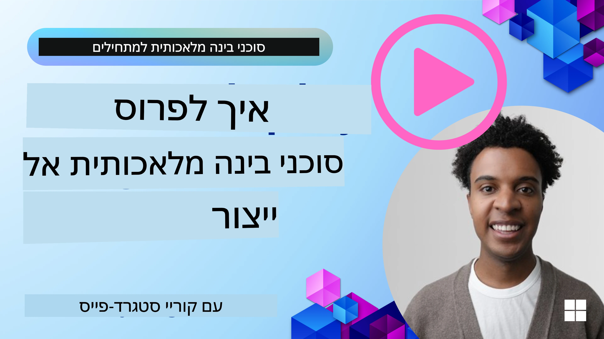

# סוכני בינה מלאכותית בפרודקשן: יכולת תצפית והערכה

[](https://youtu.be/l4TP6IyJxmQ?si=reGOyeqjxFevyDq9)

כאשר סוכני בינה מלאכותית עוברים מפרוטוטיפים ניסיוניים ליישומים בעולם האמיתי, היכולת להבין את ההתנהגות שלהם, לעקוב אחרי ביצועים ולהעריך באופן שיטתי את התוצרים שלהם נהיית חשובה.

## יעדי הלמידה

עם סיום השיעור תדע/תבין כיצד:
- מושגי יסוד ביכולת תצפית והערכת סוכנים
- שיטות לשיפור הביצועים, העלויות והאפקטיביות של סוכנים
- מה ואיך להעריך את סוכני הבינה המלאכותית שלך באופן שיטתי
- איך לשלוט בעלויות בעת פריסה של סוכני בינה מלאכותית בפרודקשן
- איך לאמלץ סוכנים שנבנו עם Microsoft Agent Framework

המטרה היא לצייד אותך בידע שיעזור להפוך את הסוכנים "תיבת שחורה" שקשה להבין לתהליכים שקופים, ניתנים לניהול ואמינים.

_**הערה:** חשוב לפרוס סוכני בינה מלאכותית בטוחים ואמינים. אפשר גם לעיין בשיעור [בונה סוכני בינה מלאכותית אמינים](./06-building-trustworthy-agents/README.md)._

## עקבות ופריסות

כלי תצפית כגון [Langfuse](https://langfuse.com/) או [Microsoft Foundry](https://learn.microsoft.com/en-us/azure/ai-foundry/what-is-azure-ai-foundry) מייצגים בדרך כלל ריצות סוכנים כעקבות ופריסות.

- **עקבה** מייצגת משימה שלמה של הסוכן מתחילתה ועד סופה (כמו טיפול בשאילתת משתמש).
- **פריסות** הן צעדים בודדים בתוך העקבה (כגון קריאה למודל שפה או אחזור מידע).


<!-- Image URL retained for illustration purposes -->

בלי יכולת תצפית, סוכן בינה מלאכותית יכול להרגיש כמו "תיבת שחורה" – מצבו הפנימי ותהליכי החשיבה שלו אינם גלויים, מה שמקשה על אבחון תקלות או אופטימיזציית הביצועים. עם יכולת תצפית הסוכנים הופכים ל"תיבות זכוכית", המציעות שקיפות שהיא חיונית לבניית אמון ולהבטחת פעילות בהתאם למתוכנן.

## מדוע תצפית חשובה בסביבות פרודקשן

המעבר של סוכני בינה מלאכותית לסביבת פרודקשן מציב סט חדש של אתגרים ודרישות. תצפית היא לא עוד "מאפיין נעים", אלא יכולת קריטית:

*   **ניפוי שגיאות וניתוח סיבת שורש:** כאשר סוכן נכשל או מייצר פלט בלתי צפוי, כלי התצפית מספקים את העקבות הדרושים כדי לאתר את מקור הטעות. זה קריטי במיוחד בסוכנים מורכבים הכוללים קריאות מרובות למודלי שפה, אינטראקציות עם כלים, ולוגיקה מותנית.
*   **ניהול זמני תגובה ועלויות:** סוכני בינה מלאכותית מסתמכים לעיתים על מודלי שפה גדולים ו־APIs חיצוניים המחייבים לפי טוקן או פנייה. תצפית מאפשרת מעקב מדויק אחר הפניות, עוזרת לזהות פעולות איטיות מדי או יקרות מדי. זה מאפשר לצוותים לאופטם פרומפטים, לבחור דגמים יעילים יותר, או לתכנן מחדש זרימות עבודה לניהול עלויות תפעול ולשיפור חוויית המשתמש.
*   **אמון, בטיחות וציות:** במגוון שימושים חשוב לוודא שהסוכנים מתנהגים בצורה בטוחה ואתית. תצפית מספקת מסלול ביקורת על פעולות והחלטות הסוכן. זה יכול לשמש לגילוי ומניעת בעיות כמו הזרקת פרומפט, יצירת תוכן מזיק, או טיפול לקוי במידע אישי מזהה (PII). לדוגמה, אפשר לסקור עקבות כדי להבין מדוע סוכן נתן תגובה מסוימת או השתמש בכלי מסוים.
*   **לופים לשיפור מתמשך:** נתוני התצפית מהווים בסיס לתהליך פיתוח איטרטיבי. באמצעות ניטור ביצועי הסוכנים בעולם האמיתי, צוותים יכולים לאתר אזורי שיפור, לאסוף נתונים לכיוון עדין של מודלים, ולאמת את השפעת השינויים. זה יוצר לולאת משוב שבה תובנות מהערכת פרודקשן מקוונת מחזקות ניסיון ואקספרימנטים לא מקוונים, ומובילות לביצועים טובים יותר.

## מדדים מרכזיים למעקב

כדי לנטר ולהבין את התנהגות הסוכן, יש לעקוב אחרי מגוון מדדים ואותות. המדדים הספציפיים עשויים להשתנות לפי מטרת הסוכן, אך חלקם חשובים באופן אוניברסלי.

הנה כמה מהמדדים הנפוצים שכלי תצפית עוקבים אחריהם:

**זמני תגובה:** כמה מהר הסוכן מגיב? זמני המתנה ארוכים פוגעים בחוויית המשתמש. יש למדוד זמני תגובה למשימות ולצעדים בודדים דרך עקבות ריצות הסוכן. לדוגמה, סוכן שלוקח 20 שניות לקריאות למודל יכול להיות מואץ באמצעות מודל מהיר יותר או הרצת קריאות במקביל.

**עלויות:** מהי העלות לכל ריצת סוכן? סוכני בינה מלאכותית מסתמכים על קריאות למודלי שפה גדולים המחויבות לפי טוקן או API חיצוני. שימוש תכוף בכלים או מספר פרומפטים גבוהים יכול להעלות עלויות במהירות. לדוגמה, אם סוכן קורא למודל חמש פעמים לשיפור איכות שולית, יש להעריך אם העלות מוצדקת או אם ניתן להפחית את מספר הקריאות או להשתמש במודל זול יותר. ניטור בזמן אמת גם עוזר לזהות זעזועים בלתי צפויים (כגון תקלות הגורמות ללולאות API מופרזות).

**שגיאות בבקשות:** כמה בקשות נכשלו? זה יכול לכלול שגיאות API או קריאות כלים שנכשלו. כדי להפוך את הסוכן לעמיד יותר בפרודקשן, ניתן להגדיר תרחישי גיבוי או ניסיונות חוזרים. לדוגמה, אם ספק מודל שפה A אינו זמין, עוברים לספק B כגיבוי.

**משוב משתמש:** ביצוע הערכות משתמש ישירות מספק תובנות חשובות. זה יכול לכלול דירוגים מפורשים (👍אהבתי/👎לא אהבתי, ⭐1-5 כוכבים) או תגובות טקסטואליות. משוב שלילי עקבי צריך להדליק נורה אדומה כי זהו סימן שהסוכן לא מתפקד כהוגן.

**משוב משתמש בלתי מפורש:** התנהגות משתמשים מספקת משוב עקיף גם ללא דירוגים מפורשים. לדוגמה, ניסוח מחדש מידי של שאלה, שאילתות חוזרות או לחיצה על כפתור ניסיון חוזר מצביעים על כך שהסוכן אולי אינו פועל כראוי.

**דיוק:** באיזו תדירות הסוכן מפיק תוצאות נכונות או רצויות? הגדרות הדיוק משתנות (למשל, נכונות פתרון בעיות, דיוק אחזור מידע, שביעות רצון משתמש). השלב הראשון הוא להגדיר מהי הצלחה עבור הסוכן שלך. ניתן לעקוב אחרי הדיוק באמצעות בדיקות אוטומטיות, ציוני הערכה או תגיות השלמת משימות. לדוגמה, לסמן עקבות כ"צלחו" או "נכשלו".

**מדדי הערכה אוטומטיים:** אפשר גם להגדיר הערכות אוטומטיות. לדוגמה, להשתמש במודל שפה גדול כדי לדרג את פלט הסוכן – האם הוא מועיל, מדויק או לא. קיימים גם ספריות קוד פתוח שמסייעות לדרג היבטים שונים של הסוכן, למשל [RAGAS](https://docs.ragas.io/) לסוכני RAG או [LLM Guard](https://llm-guard.com/) לזיהוי שפה מזיקה או הזרקת פרומפט.

בפועל, שילוב של מדדים אלו נותן כיסוי מיטבי לבריאות סוכן הבינה המלאכותית. בדוגמת מחברת הפרק [example notebook](./code_samples/10-expense_claim-demo.ipynb), נראה כיצד המדדים הללו נראים במקרים אמיתיים, אך קודם נלמד כיצד נראה תהליך הערכה טיפוסי.

## אמלץ את הסוכן שלך

כדי לאסוף נתוני עקיבה, תצטרך לאמלץ את הקוד שלך. המטרה היא לאמלץ את קוד הסוכן כדי להפיק עקבות ומדדים שניתן ללכוד, לעבד ולהציג באמצעות פלטפורמת תצפית.

**OpenTelemetry (OTel):** [OpenTelemetry](https://opentelemetry.io/) הפך לסטנדרט בתעשייה לתצפית מודלי שפה גדולים. הוא מספק סט APIs, SDKs, וכלים ליצירה, איסוף ויצוא של נתוני טלמטריה.

ישנן ספריות אמלוץ רבות שמעטפות את מסגרות הסוכנים הקיימות ומקלות על ייצוא פריסות OpenTelemetry לכלי תצפית. Microsoft Agent Framework משתלב עם OpenTelemetry באופן טבעי. להלן דוגמה לאמלוץ סוכן MAF:

```python
from agent_framework.observability import get_tracer, get_meter

tracer = get_tracer()
meter = get_meter()

with tracer.start_as_current_span("agent_run"):
    # ביצוע הסוכן מתועד באופן אוטומטי
    pass
```

ה[דוגמת המחברת](./code_samples/10-expense_claim-demo.ipynb) בפרק זה תדגים כיצד לאמלץ את סוכן ה־MAF שלך.

**יצירת פריסה ידנית:** למרות שספריות אמלוץ מספקות בסיס טוב, יש מקרים שבהם דרושה מידע מפורט או מותאם יותר. אפשר ליצור פריסות ידנית להוספת לוגיקה מותאמת אישית. חשוב מכך, ניתן להעשיר פריסות שנוצרו אוטומטית או ידנית בתכונות מותאמות אישית (המוכרים גם כמטבעות או מטא-דאטה). תכונות אלו יכולות לכלול נתוני עסק ספציפיים, חישובים ביניים או כל הקשר שיכול לסייע בניפוי שגיאות או ניתוח, כגון `user_id`, `session_id`, או `model_version`.

דוגמה ליצירת עקבות ופריסות ידנית עם [Langfuse Python SDK](https://langfuse.com/docs/sdk/python/sdk-v3):

```python
from langfuse import get_client
 
langfuse = get_client()
 
span = langfuse.start_span(name="my-span")
 
span.end()
```

## הערכת סוכן

תצפית נותנת לנו מדדים, אך הערכה היא התהליך שבו מנתחים את הנתונים (ומבצעים בדיקות) כדי להחליט כמה טוב סוכן הבינה המלאכותית מתפקד וכיצד ניתן לשפרו. במילים אחרות, אחרי שיש לך את העקבות והמדדים, איך אתה משתמש בהם כדי לשפוט את הסוכן ולקבל החלטות?

הערכה סדירה חשובה כי סוכני בינה מלאכותית אינם תמיד דטרמיניסטיים ויכולים להתפתח (באמצעות עדכונים או שינוי תפקוד המודל) – בלי הערכה לא תדע אם ה"סוכן החכם" באמת מבצע את עבודתו היטב או ירד ברמתו.

קיימות שתי קטגוריות של הערכות לסוכני בינה מלאכותית: **הערכה מקוונת** ו**הערכה לא מקוונת**. שתיהן חשובות, ומשלימות זו את זו. בדרך כלל מתחילים בהערכה לא מקוונת, כי זו הצעד המינימלי הנדרש לפני פריסה של סוכן כלשהו.

### הערכה לא מקוונת


הערכה זאת כוללת בדיקת הסוכן בסביבה מבוקרת, בדרך כלל באמצעות מאגרי נתונים לבחינה, ולא באמצעות שאילתות משתמשים חיים. משתמשים במאגרי נתונים מובחרים שבהם ידוע מה הפלט הצפוי או התנהגות נכונה, ואז מריצים את הסוכן עליהם.

לדוגמה, אם בנית סוכן לפתרון בעיות מתמטיות בשפה, ייתכן שיש לך [מאגר מבחן](https://huggingface.co/datasets/gsm8k) המכיל 100 בעיות עם תשובות ידועות. הערכה לא מקוונת מתבצעת לעיתים קרובות במהלך הפיתוח (וחלק מצינורות CI/CD) כדי לבדוק שיפורים או להגן מפני התדרדרות. היתרון הוא שהיא **ניתנת לחזרה וניתן לקבל מדדי דיוק ברורים כי יש אמת בסיסית ידועה**. אפשר גם לסמלץ שאלות משתמש ולמדוד את תגובות הסוכן כנגד תשובות אידיאליות או להשתמש במדדים אוטומטיים כפי שתואר למעלה.

האתגר המרכזי בהערכה לא מקוונת הוא לוודא שמאגר הבדיקה שלך מקיף ונשאר רלוונטי – הסוכן עשוי לתפקד טוב במערכת בדיקה קבועה אך להיתקל בשאילתות שונייות מאוד בפרודקשן. לכן כדאי לעדכן מערכי מבחן עם מקרים קיצוניים ודוגמאות המייצגות תרחישים מהעולם האמיתי. שילוב של מקרים קטנים "לבדיקת תקינות מהירה" ושל קבוצות גדולות יותר להערכת ביצועים רחבה הוא שימושי: קבוצות קטנות לבדיקות מהירות וגדולות למדדים מקיפים יותר.

### הערכה מקוונת


אופציה זו מתייחסת להערכת הסוכן בסביבה חיה, בעולם האמיתי, כלומר בשימוש אמיתי בפרודקשן. הערכה מקוונת כוללת מעקב אחרי ביצועי הסוכן באינטראקציות חיוניות עם משתמשים וניתוח תוצאות באופן רציף.

לדוגמה, אפשר לעקוב אחרי שיעורי הצלחה, ציוני שביעות רצון משתמש, או מדדים אחרים בזרם תנועה אמיתי. היתרון של הערכה מקוונת הוא שהיא **תופסת דברים שאולי לא תצפה להם בסביבה מבוקרת** – אתה יכול לצפות בהסטות דגם עם הזמן (אם יעילות הסוכן יורדת ככל שמאפייני הקלט משתנים) ולזהות שאילתות או מצבים בלתי צפויים שלא היו במאגר הבדיקה. היא מספקת תמונה אמיתית על אופן התנהגות הסוכן בשטח.

הערכת מקוונת כוללת לעיתים איסוף משוב משתמשים מפורש ובלתי מפורש, וכמו כן הרצת בדיקות הצללה או בדיקות A/B (בהן גרסה חדשה של הסוכן פועלת במקביל כדי להשוות לגרסה הישנה). האתגר הוא שקשה להשיג תוויות אמינות או ציונים לאינטראקציות חי בחיים – לעיתים מסתמכים על משוב משתמש או מדדי מומנטום (למשל האם המשתמש לחץ על תוצאה).

### שילוב בין השתיים

הערכות מקוונות ולא מקוונות אינן סותרות זו את זו; הן משלימות במידה רבה. תובנות ממעקב מקוון (למשל סוגים חדשים של שאילתות משתמש שמהן הסוכן מתפקד לא טוב) יכולות לשמש להרחבת ולטיוב מאגרי הבדיקה הלא מקוונים. להפך, סוכנים שמצליחים במבחנים לא מקוונים יכולים להיות מופעלים בביטחון רב יותר במעקב מקוון.

בפועל, צוותים רבים מאמצים לולאה:

_להעריך לא מקוון -> לפרוס -> לנטר מקוון -> לאסוף מקרים חדשים של כשל -> להוסיף למאגר הלא מקוון -> לדייק את הסוכן -> לחזור על התהליך_.

## בעיות נפוצות

כשאתה מפרסם סוכני בינה מלאכותית בפרודקשן, עלולות לצוץ מגוון אתגרים. הנה כמה בעיות נפוצות ופתרונות אפשריים:

| **בעיה**    | **פתרון אפשרי**   |
| ------------- | ------------------ |
| הסוכן לא מבצע משימות בעקביות | - לחדד את הפרומפט הנתון לסוכן; להיות ברורים לגבי המטרות.<br>- לזהות מקרים בהם חלוקה למשימות משנה וניהול על ידי סוכנים מרובים עוזרים. |
| הסוכן נכנס ללולאות בלתי פוסקות  | - לוודא שיש תנאי סיום ברורים כדי שהסוכן ידע מתי להפסיק.<br>- למשימות מורכבות הדורשות חשיבה ותכנון, יש להשתמש במודל גדול וממוקד לתחום החשיבה. |
| קריאות כלים בסוכן לא מתפקדות היטב   | - לבדוק ולאמת את הפלט של הכלי מחוץ למערכת הסוכן.<br>- לחדד פרמטרים, פרומפטים ושמות של הכלים.  |
| מערכת עם מספר סוכנים לא מתפקדת בעקביות | - לחדד פרומפטים לכל סוכן כדי לוודא שהם ספציפיים ומובחנים זה מזה.<br>- לבנות מערכת היררכית בה סוכן "מנתב" או שולט קובע איזה סוכן מתאים. |

רבים מהנושאים האלו גורמים לבעיות שניתן לאתר ביעילות רבה יותר כשיש תצפית בתהליכים. העקבות והמדדים שדיברנו עליהם עוזרים למקד בדיוק היכן בתהליך הסוכן הבעיה, מה שהופך את הניפוי ואופטימיזציה ליעילים הרבה יותר.

## ניהול עלויות
להלן כמה אסטרטגיות לניהול הוצאות פריסת סוכני בינה מלאכותית בפרודקשן:

**שימוש במודלים קטנים יותר:** מודלי שפה קטנים (SLMs) יכולים לתפקד היטב במקרים שימוש של סוכנים מסוימים ויקטינו משמעותית את העלויות. כפי שנאמר קודם, בניית מערכת הערכה לקביעת הביצועים והשוואתם מול מודלים גדולים יותר היא הדרך הטובה ביותר להבין עד כמה SLM יתאים למקרה השימוש שלך. שקול להשתמש ב-SLM למשימות פשוטות יותר כמו סיווג כוונות או חילוץ פרמטרים, בעוד שמודלים גדולים יותר יישמרו למשימות של הסקת מסקנות מורכבות.

**שימוש במודל מיתוג (Router):** אסטרטגיה דומה היא להשתמש במגוון מודלים וגדלים. ניתן להשתמש ב-LLM/SLM או פונקציה ללא שרת כדי לנתב בקשות לפי מורכבות למודלים המתאימים ביותר. זה גם יסייע בהפחתת העלויות תוך שמירה על ביצועים במשימות הנכונות. לדוגמה, ניתוב שאילתות פשוטות למודלים קטנים ומהירים, ושימוש במודלים יקרים וגדולים רק למשימות הסקה מורכבות.

**שמירת תוצאות במטמון:** זיהוי בקשות ומשימות נפוצות ומתן תגובות לפני שהן עוברות במערכת הסוכנית שלך היא דרך טובה להפחית נפח בקשות דומות. ניתן אפילו לממש תהליך לזיהוי דמיון בין בקשה לבקשות שמורות במטמון באמצעות מודלי בינה מלאכותית פשוטים יותר. אסטרטגיה זו יכולה להפחית משמעותית עלויות עבור שאלות נפוצות או תהליכים שוטפים.

## בוא נבחן איך זה עובד בפועל

ב[מחברת הדוגמא של חלק זה](./code_samples/10-expense_claim-demo.ipynb), נראה דוגמאות לשימוש בכלי תצפית למעקב והערכת הסוכן שלנו.


### יש לך עוד שאלות לגבי סוכני בינה מלאכותית בפרודקשן?

הצטרף ל[Discord של Microsoft Foundry](https://aka.ms/ai-agents/discord) כדי לפגוש לומדים אחרים, להשתתף בשעות פעילות ולקבל מענה לשאלותיך על סוכני בינה מלאכותית.

## השיעור הקודם

[תבנית עיצוב מטה-קוגניציה](../09-metacognition/README.md)

## השיעור הבא

[פרוטוקולים סוכניים](../11-agentic-protocols/README.md)

---

<!-- CO-OP TRANSLATOR DISCLAIMER START -->
**כתב ויתור**:  
מסמך זה תורגם באמצעות שירות תרגום מבוסס בינה מלאכותית [Co-op Translator](https://github.com/Azure/co-op-translator). למרות שאנו שואפים לדיוק, יש לקחת בחשבון כי תרגומים אוטומטיים עשויים להכיל שגיאות או אי-דיוקים. המסמך המקורי בשפת המקור שלו נחשב למקור הסמכותי. עבור מידע קריטי מומלץ תרגום מקצועי על ידי אדם. אנו לא נושאים באחריות על כל אי-הבנות או פרשנויות מוטעות הנובעות משימוש בתרגום זה.
<!-- CO-OP TRANSLATOR DISCLAIMER END -->