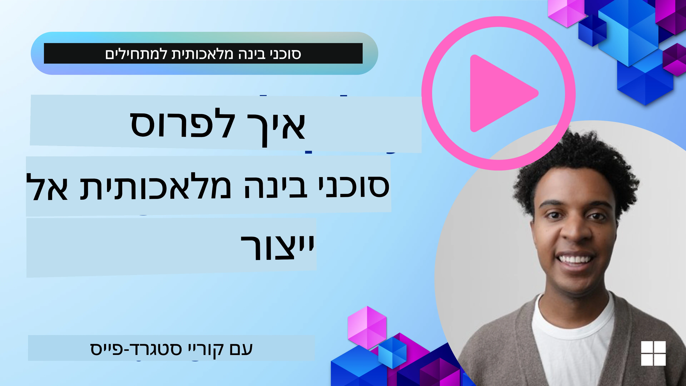

# סוכני בינה מלאכותית בפרודקשן: נראות והערכה

[](https://youtu.be/l4TP6IyJxmQ?si=reGOyeqjxFevyDq9)

כאשר סוכני בינה מלאכותית עוברים מפרוטוטיפים ניסיוניים ליישומים בעולם האמיתי, היכולת להבין את התנהגותם, לנטר את ביצועיהם ולהעריך את התוצרים שלהם בצורה שיטתית הופכת לחשובה.

## מטרות הלמידה

לאחר שתסיים את השיעור הזה, תדע / תבין כיצד:
- עקרונות ליבה של נראות והערכה של סוכנים
- טכניקות לשיפור ביצועים, עלויות ויעילות הסוכנים
- מה ואיך להעריך את סוכני הבינה המלאכותית שלך באופן שיטתי
- כיצד לשלוט בעלויות כאשר מפרסים סוכנים לפרודקשן
- כיצד לאסוף מדדים בסוכנים שנבנו עם Microsoft Agent Framework

המטרה היא להקנות לך את הידע לשנות את הסוכנים "הקופסה השחורה" שלך למערכות שקופות, ניתנות לניהול ואמינות.

_**הערה:** חשוב לפרוס סוכני בינה מלאכותית שהם בטוחים ואמינים. מומלץ לעיין גם בשיעור [בניית סוכני בינה מלאכותית אמינים](../06-building-trustworthy-agents/README.md)._

## עקבות וטעימות

כלי נראות כמו [Langfuse](https://langfuse.com/) או [Microsoft Foundry](https://learn.microsoft.com/en-us/azure/ai-foundry/what-is-azure-ai-foundry) בדרך כלל מייצגים הפעלות של סוכנים כעקבות וטעימות.

- **עקבה** מייצגת משימת סוכן שלמה מתחילתה ועד סופה (כגון טיפול בשאילתא של משתמש).
- **טעימות** הן שלבים בודדים בתוך העקבה (כגון קריאה למודל שפה או משיכת נתונים).


<!-- Image URL retained for illustration purposes -->

ללא נראות, סוכן בינה מלאכותית עלול להרגיש כמו "קופסה שחורה" - מצבו הפנימי וההסבר שלו אינם שקופים, מה שמקשה לזהות תקלות או לייעל ביצועים. עם נראות, הסוכנים הופכים ל"קופסאות זכוכית", ומציעים שקיפות שהיא חיונית לבניית אמון ולהבטיח שהם פועלים כפי שמתכוונים.

## מדוע נראות חשובה בסביבות פרודקשן

המעבר של סוכני בינה מלאכותית לסביבות פרודקשן מציג סט חדש של אתגרים ודרישות. נראות אינה עוד "תוספת נחמדה" אלא יכולת קריטית:

*   **איתור שגיאות וניתוח שורש הבעיה**: כאשר סוכן נכשל או מייצר תוצאה בלתי צפויה, כלי הנראות מספקים את העקבות הדרושים כדי לאתר את מקור הטעות. זה חשוב במיוחד בסוכנים מורכבים שיכולים לכלול קריאות מרובות למודל שפה, אינטראקציות עם כלים ולוגיקה מותנית.
*   **ניהול זמני תגובה ועלויות**: סוכני בינה מלאכותית מסתמכים לעיתים קרובות על מודלים שפתיים גדולים (LLMs) ו-APIs חיצוניים שתחייבו לפי טוקן או קריאה. נראות מאפשרת מעקב מדויק אחר קריאות אלו, ועוזרת לזהות פעולות איטיות או יקרות מדי. זה מאפשר לצוותים לייעל הפעלות, לבחור מודלים יעילים יותר או לעצב תהליכי עבודה מחדש לניהול עלויות תפעוליים והבטחת חוויית משתמש טובה.
*   **אמון, בטיחות ותאימות**: ביישומים רבים חשוב להבטיח שהתנהגות הסוכנים בטוחה ואתית. נראות מספקת מעקב של פעולות והחלטות הסוכן. ניתן להשתמש בכך לזיהוי ומניעה של בעיות כמו הזרקת פרומפט, יצירת תוכן מזיק או טיפול לא תקין במידע אישי (PII). לדוגמה, ניתן לבדוק עקבות כדי להבין מדוע סוכן סיפק תגובה מסוימת או השתמש בכלי ספציפי.
*   **לולאות שיפור מתמידות**: נתוני נראות הם בסיס לתהליך פיתוח איטרטיבי. על ידי מעקב אחר ביצועי הסוכנים בעולם האמיתי, צוותים יכולים לזהות תחומים לשיפור, לאסוף נתונים לכיול מודלים ולאמת את השפעת השינויים. זה יוצר לולאת משוב בה תובנות מהערכה מקוונת מנחות ניסויים ושיפורים לא מקוונים, מה שמוביל לביצועים משופרים באופן הדרגתי.

## מדדים מרכזיים למעקב

כדי לנטר ולהבין את התנהגות הסוכן, יש לעקוב אחרי מגוון מדדים ואותות. בעוד שהמדדים הספציפיים עשויים להשתנות בהתאם למטרת הסוכן, חלקם חשובים באופן כללי.

להלן כמה מהמדדים הנפוצים שכלי נראות עוקבים אחריהם:

**זמן תגובה (Latency):** כמה מהר מגיב הסוכן? זמני המתנה ארוכים משפיעים לרעה על חוויית המשתמש. יש למדוד זמן תגובה למשימות ולשלבים בודדים באמצעות מעקב אחר הרצת הסוכן. לדוגמה, סוכן שלוקח 20 שניות לכל קריאות המודל יכול להיות מואץ על ידי שימוש במודל מהיר יותר או ביצוע קריאות במקביל.

**עלויות:** מה העלות לכל הפעלת סוכן? סוכני בינה מלאכותית מסתמכים על קריאות ל-LLM ו-APIs חיצוניים עם חיוב לפי טוקן או קריאה. שימוש תכוף בכלים או פרומפטים מרובים יכול להגדיל את העלויות במהירות. למשל, אם סוכן קורא ל-LLM חמש פעמים לשיפור איכות שולית, יש להעריך אם העלות מוצדקת או שניתן להפחית את מספר הקריאות או להשתמש במודל זול יותר. מעקב בזמן אמת יכול לעזור גם לזהות זינוקים לא צפויים (כגון באגים שגורמים ללולאות API בלתי פוסקות).

**שגיאות בבקשות:** כמה בקשות הסוכן נכשל? זה יכול לכלול שגיאות API או קריאות כישלון לכלים. כדי להפוך את הסוכן לעמיד יותר בפרודקשן, ניתן להגדיר גיבויים או נסיונות חוזרים. לדוגמה, אם ספק LLM א' לא זמין, עוברים לספק B כגיבוי.

**משוב משתמש:** יישום הערכות ישירות של משתמשים מספק תובנות חשובות. זה יכול לכלול דירוגים מפורשים (👍לאהוב/👎לא, ⭐1-5 כוכבים) או תגובות טקסטואליות. משוב שלילי עקבי אמור להזהיר כי הסוכן אינו עובד כמצופה.

**משוב משתמש מרומז:** התנהגות משתמשים מספקת משוב עקיף גם ללא דירוגים מפורשים. זה יכול לכלול ניסוח מחדש מיידי של שאלה, שאילתות חוזרות או לחיצה על כפתור ניסיון חוזר. לדוגמה, אם משתמשים שואלים שוב ושוב את אותה שאלה, זו אינדיקציה שהסוכן אינו מתפקד כהלכה.

**דיוק:** באיזו תדירות הסוכן מייצר תוצאות נכונות או רצויות? הגדרות הדיוק משתנות (כגון נכונות פתרון בעיות, דיוק אחזור מידע, שביעות רצון משתמש). השלב הראשון הוא להגדיר מהו הצלחה עבור הסוכן שלך. ניתן לעקוב אחר הדיוק באמצעות בדיקות אוטומטיות, ציוני הערכה או תוויות השלמת משימות. לדוגמה, לסמן עקבות כ"צלחנו" או "נכשלנו".

**מדדי הערכה אוטומטית:** ניתן להגדיר גם הערכות אוטומטיות. למשל, אפשר להשתמש ב-LLM כדי לתת ציון לתוצאת הסוכן, כגון אם היא מועילה, מדויקת או לא. יש גם מספר ספריות קוד פתוח שעוזרות לציין היבטים שונים של הסוכן, כגון [RAGAS](https://docs.ragas.io/) לסוכני RAG או [LLM Guard](https://llm-guard.com/) לזיהוי שפה מזיקה או הזרקת פרומפט.

בפועל, שילוב של מדדים אלו נותן את הכיסוי הטוב ביותר לבריאות סוכן בינה מלאכותית. במחברת [דוגמא בפרק הזה](./code_samples/10-expense_claim-demo.ipynb) נראה איך המדדים האלה נראים בדוגמאות אמיתיות, אבל קודם נלמד איך נראה תהליך הערכה טיפוסי.

## איסוף מדדים בסוכן שלך

כדי לאסוף נתוני מעקב, יש צורך בכלי איסוף נתונים (instrumentation) בקוד שלך. המטרה היא לאפשר לקוד הסוכן לשדר עקבות ומדדים שניתן ללכוד, לעבד ולחזות על ידי פלטפורמה לנראות.

**OpenTelemetry (OTel):** [OpenTelemetry](https://opentelemetry.io/) הפך לסטנדרט בתעשייה לנראות מודלים שפתיים גדולים. הוא מספק מערך APIs, SDKs וכלים ליצירת, איסוף וייצוא נתוני טלמטריה.

ישנן ספריות איסוף נתונים רבות העוטפות מסגרות סוכנים קיימות ומאפשרות ייצוא של טעימות OpenTelemetry לכלי נראות. Microsoft Agent Framework משתלב באופן טבעי עם OpenTelemetry. להלן דוגמה לאיסוף מדדים בסוכן MAF:

```python
from agent_framework.observability import get_tracer, get_meter

tracer = get_tracer()
meter = get_meter()

with tracer.start_as_current_span("agent_run"):
    # ביצוע הסוכן מתועד אוטומטית
    pass
```

המחברת [דוגמא](./code_samples/10-expense_claim-demo.ipynb) בפרק זה תדגים כיצד לאסוף מדדים בסוכן MAF שלך.

**יצירת טעימות ידנית:** בעוד שספריות איסוף נתונים מספקות בסיס טוב, לעיתים נדרש מידע מפורט או מותאם אישית יותר. ניתן ליצור טעימות באופן ידני כדי להוסיף לוגיקה מותאמת אישית. חשוב יותר, ניתן להעשיר טעימות שנוצרו אוטומטית או ידנית בתכונות מותאמות (הידועות גם כתגיות או מטה-נתונים). תכונות אלו יכולות לכלול נתונים עסקיים, חישובים ביניים או כל הקשר שעשוי להיות שימושי לדיבוג או לניתוח, כגון `user_id`, `session_id` או `model_version`.

דוגמה ליצירת עקבות וטעימות ידנית עם [Langfuse Python SDK](https://langfuse.com/docs/sdk/python/sdk-v3):

```python
from langfuse import get_client
 
langfuse = get_client()
 
span = langfuse.start_span(name="my-span")
 
span.end()
```

## הערכת סוכן

נראות מספקת מדדים, אך הערכה היא התהליך של ניתוח נתונים אלו (וביצוע בדיקות) כדי לקבוע כמה טוב סוכן הבינה המלאכותית מתפקד וכיצד ניתן לשפרו. במילים אחרות, לאחר שיש לך עקבות ומדדים, איך אתה משתמש בהם כדי לשפוט את הסוכן ולקבל החלטות?

הערכה סדירה חשובה כי סוכני AI לעיתים אינם דטרמיניסטיים ויכולים להתפתח (דרך עדכונים או תזוזות בהתנהגות המודל) – בלי הערכה, לא תדע אם ה"סוכן החכם" באמת מבצע את תפקידו טוב או אם הוא הידרדר.

קיימות שתי קטגוריות של הערכות לסוכני בינה מלאכותית: **הערכה מקוונת** ו-**הערכה לא מקוונת**. שתי השיטות חשובות ומשלימות זו את זו. בדרך כלל מתחילים בהערכה לא מקוונת, מכיוון שזהו הצעד המינימלי הנדרש לפני פריסת סוכן.

### הערכה לא מקוונת


הערכה זו כוללת בדיקת הסוכן בסביבה מבוקרת, בדרך כלל באמצעות מערכי בדיקה, לא בשאילתות משתמש בזמן אמת. משתמשים במערכים מתוחזקים שבהם יודעים מה הפלט הצפוי או ההתנהגות הנכונה, ואז מפעילים את הסוכן עליהם.

לדוגמה, אם בנית סוכן לפתרון בעיות מתמטיות, ייתכן ויש לך [מערך בדיקה](https://huggingface.co/datasets/gsm8k) עם 100 בעיות ותשובות ידועות. ההערכה הלא מקוונת מתבצעת בדרך כלל במהלך הפיתוח (ויכולה להיות חלק מצינורות CI/CD) כדי לבדוק שיפורים או למנוע הדרדרות. היתרון הוא שהיא **ניתנת לחזרה וניתן לקבל מדדים ברורים של דיוק כי יש אמת בסיסית**. ניתן גם לדמות שאילתות משתמש ולמדוד את תגובות הסוכן מול התשובות האידיאליות או להשתמש במדדים אוטומטיים כפי שתואר לעיל.

האתגר המרכזי בהערכה הלא מקוונת הוא לוודא שמערך הבדיקה מקיף ונותר רלוונטי – ייתכן שהסוכן מתפקד היטב על מערך בדיקה קבוע אך ייתקל בשאילתות שונות מאוד בפרודקשן. לכן יש לשמור על עדכון מערכי הבדיקה עם מקרים ודוגמאות חדשים המשקפים תרחישים בעולם האמיתי. שילוב של מקרים קטנים ל"בדיקת עשן" ומערכי הערכה גדולים יותר שימושי: קטנים לבדיקות מהירות וגדולים למדדים רחבים.

### הערכה מקוונת


הכוונה להערכת הסוכן בסביבה חיה, בעולם האמיתי, כלומר במהלך שימוש ממשי בפרודקשן. הערכה מקוונת כוללת מעקב אחר ביצועי הסוכן באינטראקציות עם משתמשים אמיתיים וניתוח תוצאות באופן מתמשך.

לדוגמה, ייתכן שתעקוב אחר שיעורי הצלחה, ציוני שביעות רצון משתמשים או מדדים אחרים בטרפיק חי. היתרון בהערכה מקוונת הוא שהיא **תופסת דברים שאולי לא צפית במעבדה** – ניתן להבחין בסטיית מודל עם הזמן (אם יעילות הסוכן מתדרדרת כששינויים דפוסי הקלט מתרחשים) ולתפוס שאילתות או מצבים בלתי צפויים שלא היו במערך הבדיקה. היא מספקת תמונה אמיתית של התנהגות הסוכן בשטח.

הערכה מקוונת כוללת לעיתים איסוף משוב מפורש ועקיף של משתמשים, כפי שנדון, ואולי גם בדיקות במקביל (shadow) או בדיקות A/B (בהן גרסה חדשה של הסוכן פועלת במקביל להשוואה לגרסה הישנה). האתגר הוא שקשה לקבל תוויות או ציונים אמינים לאינטראקציות חי בחיים – ייתכן שתסתמך על משוב משתמשים או מדדים יורדים (למשל האם המשתמש לחץ על התוצאה).

### שילוב בין השניים

ההערכות המקוונת והלא מקוונת אינן סותרות זו את זו; הן משלימות מאוד זו את זו. תובנות ממעקב מקוון (למשל סוגי שאילתות משתמש חדשים שבהן הסוכן מתפקד גרוע) יכולות לשמש להרחבת ושיפור מערכי הבדיקה הלא מקוונים. להפך, סוכנים שמצליחים במבחנים לא מקוונים יכולים להיפרס בביטחון רב יותר ולהיות מנוטרים במקוון.

למעשה, צוותים רבים מאמצים לולאה של:

_הערכה לא מקוונת -> פריסה -> ניטור במקוון -> איסוף מקרים של כישלון -> הוספה למערך הבדיקה הלא מקוון -> שיפור הסוכן -> חזרה על הפעולה_.

## בעיות נפוצות

בפריסה של סוכני בינה מלאכותית לפרודקשן, ייתכן ותיתקל באתגרים שונים. הנה כמה בעיות נפוצות ופתרונות אפשריים:

| **בעיה**    | **פתרון אפשרי**   |
| ------------- | ------------------ |
| הסוכן אינו מבצע משימות בקביעות | - שפר את הפרומפט שניתן לסוכן; היה ברור במטרות.<br>- זיהוי היכן חלוקת המשימות לתת–משימות וטיפול על ידי סוכנים מרובים יכולה לעזור. |
| הסוכן נתקע בלולאות רציפות  | - וודא שיש תנאים ברורים לסיום כדי שהסוכן ידע מתי להפסיק את התהליך.<br>- למשימות מורכבות הדורשות הסקה ותכנון, השתמש במודל גדול יותר המתמחה במשימות הסקה. |
| קריאות לכלי אינן מתפקדות טוב   | - בדוק ואמת את פלט הכלי מחוץ למערכת הסוכן.<br>- שפר את הפרמטרים, הפרומפטים ושמות הכלים שהוגדרו.  |
| מערכת רב-סוכנים אינה מתפקדת באופן עקבי | - שפר את הפרומפטים הניתנים לכל סוכן כדי להבטיח שהם ספציפיים ונבדלים זה מזה.<br>- בנה מערכת היררכית באמצעות סוכן "ניתוב" או בקרה שיקבע איזה סוכן הוא הנכון. |

רבות מהבעיות הללו ניתן לזהות ביעילות רבה יותר עם נראות במקום. העקבות והמדדים שדיברנו עליהם קודם עוזרים לזהות בדיוק היכן בזרימת העבודה של הסוכן הבעיות מתרחשות, מה שהופך את הדיבוג והאופטימיזציה ליעילים הרבה יותר.

## ניהול עלויות


הנה כמה אסטרטגיות לניהול עלויות פריסת סוכני AI בסביבת הייצור:

**שימוש במודלים קטנים יותר:** מודלים שפתיים קטנים (SLMs) יכולים לבצע היטב במשימות סוכניות מסוימות ויקטינו עלויות באופן משמעותי. כפי שהוזכר קודם, בניית מערכת הערכה כדי לקבוע ולהשוות ביצועים מול מודלים גדולים יותר היא הדרך הטובה ביותר להבין כמה טוב SLM יבצע במשימת השימוש שלך. שקול להשתמש ב-SLM למשימות פשוטות כמו סיווג כוונה או חילוץ פרמטרים, תוך שמירת מודלים גדולים יותר למשימות חשיבה מורכבות.

**שימוש במודל ראוטור:** אסטרטגיה דומה היא להשתמש במגוון מודלים וגדלים. ניתן להשתמש ב-LLM/SLM או פונקציה ללא שרת כדי לנתב בקשות על פי המורכבות למודלים המתאימים ביותר. זה יסייע גם להפחית עלויות וגם להבטיח ביצועים במשימות הנכונות. לדוגמה, לנתב שאילתות פשוטות למודלים קטנים ומהירים יותר, ולהשתמש במודלים גדולים ויקרים רק למשימות חשיבה מורכבות.

**שמירת תגובות במטמון:** זיהוי בקשות ומשימות נפוצות והצגת התגובות לפני שהן עוברות דרך מערכת הסוכנים שלך היא דרך טובה להפחית את נפח הבקשות הדומות. ניתן אפילו ליישם זרימה לזיהוי המידת דמיון של בקשה לעומת הבקשות המאוחסנות במטמון באמצעות מודלי AI בסיסיים יותר. אסטרטגיה זו יכולה להפחית משמעותית עלויות עבור שאלות נפוצות או זרימות עבודה שכיחות.

## בואו נראה כיצד זה עובד בפועל

ב[מחברת הדוגמה של חלק זה](./code_samples/10-expense_claim-demo.ipynb), נראה דוגמאות כיצד נוכל להשתמש בכלי תצפית לניטור והערכת הסוכן שלנו.


### יש לך שאלות נוספות על סוכני AI בסביבת ייצור?

הצטרף ל[Discord של Microsoft Foundry](https://discord.com/invite/ATgtXmAS5D) כדי להיפגש עם לומדים אחרים, להשתתף בשעות פתוחות ולקבל תשובות לשאלותיך על סוכני AI.

## השיעור הקודם

[תבנית עיצוב מטאקוגניציה](../09-metacognition/README.md)

## השיעור הבא

[פרוטוקולים סוכניים](../11-agentic-protocols/README.md)

---

<!-- CO-OP TRANSLATOR DISCLAIMER START -->
**כתב ויתור**:
מסמך זה תורגם באמצעות שירות תרגום אוטומטי [Co-op Translator](https://github.com/Azure/co-op-translator). למרות שאנו שואפים לדיוק, יש לקחת בחשבון שתרגומים אוטומטיים עלולים להכיל שגיאות או אי-דיוקים. יש להחשיב את המסמך המקורי בשפתו הטבעית כמקור הסמכות. למידע קריטי מומלץ להשתמש בתרגום מקצועי על ידי מתרגם אדם. אנו לא אחראים לכל אי-הבנה או פירוש שגוי הנובע מהשימוש בתרגום זה.
<!-- CO-OP TRANSLATOR DISCLAIMER END -->