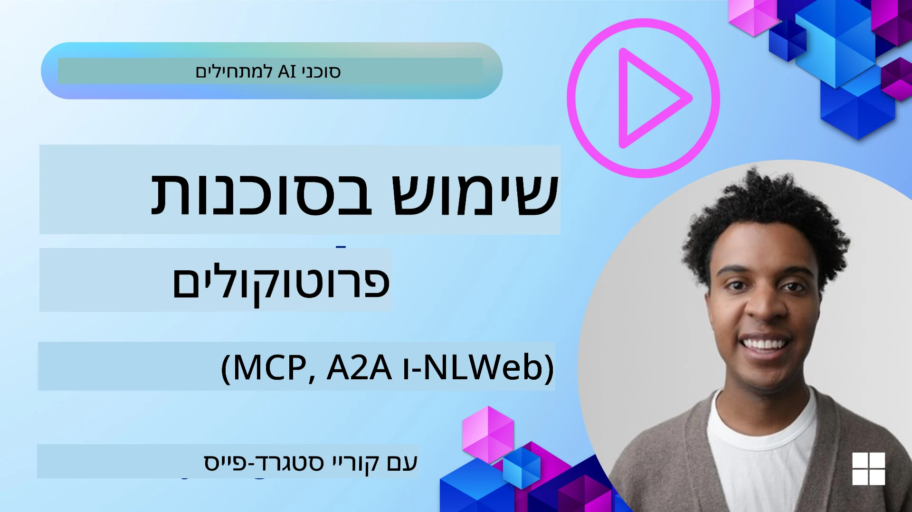
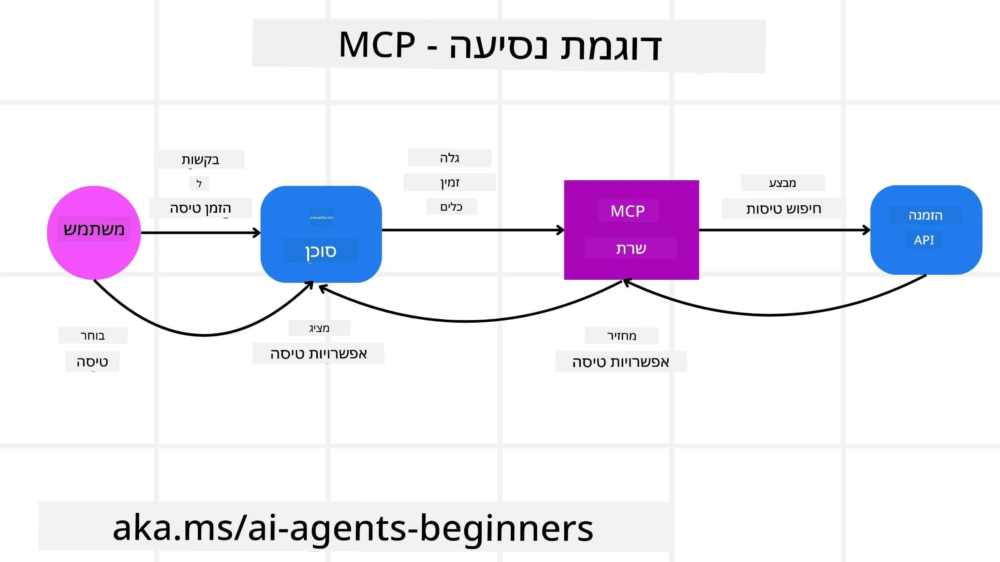
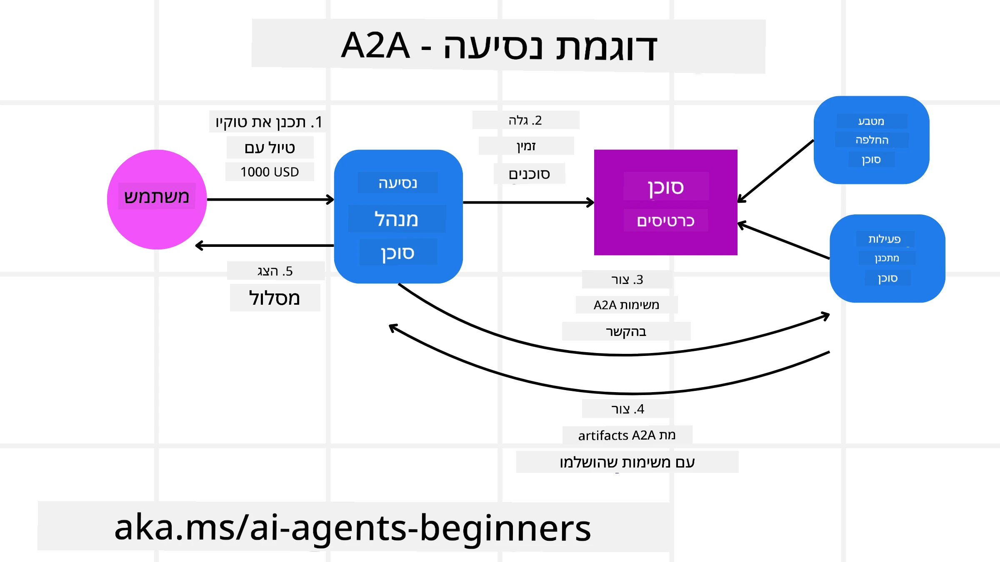
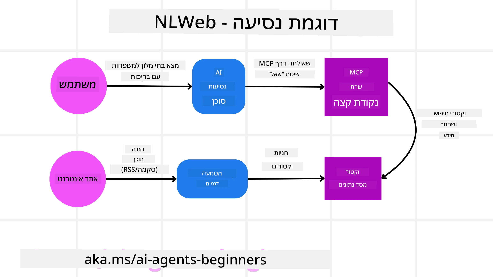

# שימוש בפרוטוקולים אייג'נטיים (MCP, A2A ו-NLWeb)

> _(לחצו על התמונה למעלה לצפייה בסרטון השיעור)_

עם הגידול בשימוש בסוכני בינה מלאכותית, גדלה גם ההכרח בפרוטוקולים שמבטיחים תקינה, אבטחה ותומכים בחדשנות פתוחה. בשיעור זה, נכסה 3 פרוטוקולים שמטרתם לענות על צורך זה - פרוטוקול הקשר דגם (MCP), Agent to Agent (A2A) ו-Natural Language Web (NLWeb).

## מבוא

בשיעור זה נכסה:

• כיצד **MCP** מאפשר לסוכני בינה מלאכותית לגשת לכלים ולנתונים חיצוניים כדי להשלים משימות משתמש.

• כיצד **A2A** מאפשר תקשורת ושיתוף פעולה בין סוכני בינה מלאכותית שונים.

• כיצד **NLWeb** מביא ממשקי שפה טבעית לכל אתר אינטרנט, ומאפשר לסוכני בינה מלאכותית לגלות ולתקשר עם התוכן.

## מטרות הלמידה

• **לזהות** את המטרה המרכזית והיתרונות של MCP, A2A ו-NLWeb בהקשר של סוכני בינה מלאכותית.

• **להסביר** כיצד כל פרוטוקול מקל על תקשורת ואינטראקציה בין LLMים, כלים וסוכנים אחרים.

• **להכיר** את התפקידים השונים שכל פרוטוקול ממלא בבניית מערכות אייג'נט מורכבות.

## פרוטוקול הקשר דגם

ה-**Model Context Protocol (MCP)** הוא סטנדרט פתוח המספק דרך סטנדרטית לאפליקציות לספק הקשר וכלים ל-LLMים. זה מאפשר "מתאם אוניברסלי" למקורות נתונים וכלים שונים שסוכני בינה מלאכותית יכולים להתחבר אליהם בצורה עקבית.

בואו נבחן את המרכיבים של MCP, היתרונות מול שימוש ישיר ב-API, ודוגמה לאופן שבו סוכני בינה מלאכותית עשויים להשתמש בשרת MCP.

### מרכיבי הליבה של MCP

MCP פועל בארכיטקטורת **לקוח-שרת** והמרכיבים המרכזיים הם:

• **מאחסנים (Hosts)** הם אפליקציות LLM (למשל עורך קוד כמו VSCode) שמתחילות את החיבור לשרת MCP.

• **לקוחות (Clients)** הם רכיבים בתוך אפליקציית המאחסן שמנהלים חיבור אחד-על-אחד עם השרתים.

• **שרתים (Servers)** הם תוכניות קלות שמציגות יכולות ספציפיות.

כלולים בפרוטוקול שלושה פרימיטיבים מרכזיים שהם היכולות של שרת MCP:

• **כלים**: פעולות או פונקציות דיסקרטיות שסוכן בינה מלאכותית יכול לקרוא כדי לבצע פעולה. לדוגמה, שירות מזג אוויר עשוי לחשוף כלי "קבל מזג אוויר", או שרת מסחר אלקטרוני עשוי לחשוף כלי "רכוש מוצר". שרתי MCP מפרסמים את שם הכלי, תיאורו וסכמת קלט/פלט ברשימת היכולות שלהם.

• **משאבים**: פריטי נתונים או מסמכים לקריאה בלבד ששרת MCP יכול לספק, ולקוחות יכולים למשוך אותם על פי דרישה. דוגמאות כוללות תוכן קבצים, רשומות מסד נתונים או קבצי יומן. משאבים יכולים להיות טקסט (כגון קוד או JSON) או בינאריים (כגון תמונות או PDF).

• **הנחיות (Prompts)**: תבניות מוגדרות מראש המספקות הנחיות מוצעות, המאפשרות זרימות עבודה מורכבות יותר.

### יתרונות MCP

MCP מציע יתרונות משמעותיים לסוכני בינה מלאכותית:

• **גילוי כלים דינמי**: סוכנים יכולים לקבל ברשימה דינמית את הכלים הזמינים מהשרת יחד עם תיאורים של מה שהם עושים. זאת בניגוד ל-API טיפוסיים, שלעיתים מחייבים קידוד סטטי לאינטגרציות, מה שדורש עדכוני קוד בכל שינוי API. MCP מספק גישה של "אינטגרציה פעם אחת", המובילה לגמישות רבה יותר.

• **אינטרופרביליות בין LLMים שונים**: MCP עובד עם LLMים שונים, ומעניק גמישות להחליף דגמים מרכזיים לצורך הערכה של ביצועים טובים יותר.

• **אבטחה סטנדרטית**: MCP כולל שיטת אימות סטנדרטית, המשפרת יכולת הורכבות כאשר מוסיפים גישה לשרתי MCP נוספים. זה פשוט יותר מניהול מפתחות וסוגי אימות שונים עבור APIים מסורתיים.

### דוגמה ל-MCP

דמיינו שמשתמש רוצה להזמין טיסה באמצעות עוזר בינה מלאכותית מופעל על ידי MCP.

1. **חיבור**: עוזר הבינה (לקוח MCP) מתחבר לשרת MCP המסופק על ידי חברת תעופה.

2. **גילוי כלי**: הלקוח שואל את שרת MCP של חברת התעופה, "אילו כלים זמינים אצלכם?" השרת משיב עם כלים כמו "חפש טיסות" ו"הזמן טיסות".

3. **קריאת כלי**: אתם מבקשים מעוזר הבינה, "אנא חפש טיסה מפורטלנד להונולולו." עוזר הבינה, המשתמש ב-LLM שלו, מזהה שיש לקרוא לכלי "חפש טיסות" ומעביר את הפרמטרים הרלוונטיים (מקור, יעד) לשרת MCP.

4. **ביצוע ותגובה**: שרת MCP, הפועל כמעטפת, מבצע את הקריאה ל-API הפנימי של חברת התעופה. הוא מקבל את מידע הטיסה (למשל נתוני JSON) ושולח אותם לעוזר הבינה.

5. **אינטראקציה נוספת**: עוזר הבינה מציג את אפשרויות הטיסה. לאחר שאתם בוחרים טיסה, העוזר עשוי לקרוא לכלי "הזמן טיסה" על אותו שרת MCP, ומשלים את ההזמנה.

## פרוטוקול Agent-to-Agent (A2A)

בעוד ש-MCP מתמקד בקישור בין LLMים לכלים, פרוטוקול **Agent-to-Agent (A2A)** עושה צעד נוסף ומאפשר תקשורת ושיתוף פעולה בין סוכני בינה מלאכותית שונים. A2A מחבר סוכנים מארגונים, סביבות וערכות טכנולוגיה שונות לצורך השלמת משימה משותפת.

נבחן את המרכיבים והיתרונות של A2A, יחד עם דוגמה לאופן שבו ניתן ליישם זאת באפליקציית הטיולים שלנו.

### מרכיבי הליבה של A2A

A2A מתמקד באפשרות תקשורת בין סוכנים ובעבודתם המשותפת להשלים משימה משנית עבור המשתמש. כל רכיב בפרוטוקול תורם לכך:

#### כרטיס סוכן (Agent Card)

בדומה לאופן שבו שרת MCP משתף רשימת כלים, כרטיס סוכן כולל:
- שם הסוכן.
- **תיאור המשימות הכלליות** שהוא מבצע.
- **רשימת מיומנויות ספציפיות** עם תיאורים כדי לסייע לסוכנים אחרים (או אפילו למשתמשים אנושיים) להבין מתי ומדוע יבחרו לקרוא לסוכן זה.
- כתובת ה-URL הנוכחית של הסוכן.
- **גרסה** ו**יכולות** של הסוכן, כגון תגובות סטרימינג והתראות.

#### מבצע סוכן (Agent Executor)

המבצע אחראי על **העברת הקשר של שיחה עם המשתמש לסוכן מרוחק**, הסוכן המרוחק זקוק לכך כדי להבין את המשימה שיש להשלים. בשרת A2A, סוכן משתמש בדגם השפה שלו (LLM) כדי לפרש בקשות נכנסות ולבצע משימות באמצעות הכלים הפנימיים שלו.

#### ארטיפקט (Artifact)

לאחר שהסוכן המרוחק השלים את המשימה שהתבקשה, תוצר העבודה שלו נוצר כארטיפקט. ארטיפקט **מכיל את תוצאת עבודת הסוכן**, **תיאור של מה שהושלם** ו**הקשר טקסטואלי** שנשלח דרך הפרוטוקול. לאחר שליחת הארטיפקט, הקשר עם הסוכן המרוחק נסגר עד שיידרש שוב.

#### תור אירועים (Event Queue)

רכיב זה משמש **לטיפול בעדכונים והעברתם**. הוא חשוב במיוחד בייצור מערכות אייג'נטיות כדי למנוע סגירת הקשר בין סוכנים לפני שהמשימה הושלמה, במיוחד כאשר זמני השלמה של משימות יכולים להתארך.

### יתרונות A2A

• **שיתוף פעולה משופר**: מאפשר לסוכנים מספקים ופלטפורמות שונות לתקשר, לשתף הקשר ולעבוד יחד, ומאפשר אוטומציה חלקה במערכות שהיו מנותקות בדרך כלל.

• **גמישות בבחירת מודלים**: כל סוכן A2A יכול לבחור את ה-LLM שהוא משתמש בו כדי לשרת את בקשותיו, מה שמאפשר אופטימיזציה או כוונון לפי סוכן, שלא קיימת ביישום MCP עם חיבור ל-LLM יחיד.

• **אימות מובנה**: האימות משולב ישירות בפרוטוקול A2A, ומספק מסגרת אבטחה חזקה לאינטראקציות בין סוכנים.

### דוגמה ל-A2A

נרחיב את תרחיש ההזמנה לטיול, אך הפעם באמצעות A2A.

1. **בקשת משתמש למולטי-אייג'נט**: משתמש מתקשר עם "סוכן נסיעות" בלקוח/סוכן A2A, למשל באומרו "אנא הזמן טיול שלם להונולולו לשבוע הבא, כולל טיסות, מלון ורכב שכור".

2. **תזמור על ידי סוכן הנסיעות**: סוכן הנסיעות מקבל את הבקשה המורכבת. הוא משתמש ב-LLM שלו כדי להעריך את המשימה ולקבוע שהוא צריך לתקשר עם סוכנים מומחים אחרים.

3. **תקשורת בין סוכנים**: סוכן הנסיעות משתמש בפרוטוקול A2A כדי להתחבר לסוכנים בירידת זרם, כגון "סוכן חברת תעופה", "סוכן מלונות" ו"סוכן השכרת רכבים" שנוצרו על ידי חברות שונות.

4. **ביצוע משימות מואצלות**: סוכן הנסיעות שולח משימות ספציפיות לסוכנים המתמחים (לדוגמה, "מצא טיסות להונולולו", "הזמן מלון", "השכר רכב"). כל סוכן מתמחה זה, שרץ עם ה-LLM והכלים שלו (שיכולים להיות שרתי MCP בעצמם), מבצע את חלקו בהזמנה.

5. **תגובה מאוחדת**: לאחר שכל הסוכנים השונים משלים את המשימות, סוכן הנסיעות אוסף את התוצאות (פרטי טיסה, אישור מלון, הזמנת רכב שכור) ושולח תגובה מלאה בסגנון צ'אט חזרה למשתמש.

## Natural Language Web (NLWeb)

אתרי אינטרנט היו כבר זמן רב הדרך העיקרית עבור משתמשים לגשת למידע ולנתונים ברחבי האינטרנט.

בואו נבחן את המרכיבים השונים של NLWeb, היתרונות שלו, ודוגמה לאופן שבו NLWeb שלנו עובד באמצעות אפליקציית הטיולים שלנו.

### מרכיבי NLWeb

- **אפליקציית NLWeb (קוד שירות ליבה)**: המערכת שמעבדת שאלות בשפה טבעית. היא מחברת את חלקי הפלטפורמה השונים כדי ליצור תגובות. אפשר לחשוב עליה כמנוע שמפעיל את תכונות השפה הטבעית של אתר אינטרנט.

- **פרוטוקול NLWeb**: זהו **מערך כללי של כללים לאינטראקציה בשפה טבעית** עם אתר אינטרנט. הוא מחזיר תגובות בפורמט JSON (לעיתים תוך שימוש ב-Schema.org). מטרתו ליצור בסיס פשוט ל"אתר האינטרנט עם בינה מלאכותית", בדומה לאופן שבו HTML אפשר שיתוף מסמכים אונליין.

- **שרת MCP (נקודת סיום של פרוטוקול הקשר דגם)**: כל התקנת NLWeb פועלת גם כשרת MCP. משמעות הדבר שהוא יכול לשתף כלים (כמו שיטת `ask`) ונתונים עם מערכות בינה מלאכותית אחרות. למעשה, זה הופך את תוכן ואפשרויות האתר לשימושיות לסוכני בינה מלאכותית, ומאפשר לאתר להיות חלק מאקוסיסטם רחב של סוכנים.

- **מודלי הטמעה (Embedding Models)**: מודלים אלו משמשים כדי להמיר תוכן אתר למייצגים מספריים המכונים וקטורים (embeddings). וקטורים אלה לקוטלים משמעות באופן שבו מחשבים יכולים להשוות ולחפש. הם נשמרים במסד נתונים מיוחד, ומשתמשים יכולים לבחור את מודל ההטמעה שהם מעוניינים בו.

- **מסד וקטורים (מנגנון שליפה)**: מסד זה מאחסן את ההטמעות של תוכן האתר. כשמישהו שואל שאלה, NLWeb בודק את מסד הוקטורים כדי למצוא במהירות את המידע הרלוונטי ביותר. הוא מספק רשימה מהירה של תשובות אפשריות, המדורגות לפי דמיון. NLWeb עובד עם מערכות אחסון וקטורים שונות כמו Qdrant, Snowflake, Milvus, Azure AI Search, ו-Elasticsearch.

### NLWeb בדוגמה

חשבו שוב על אתר ההזמנות לטיולים שלנו, אך הפעם מופעל על ידי NLWeb.

1. **טעינת נתונים**: קטלוגי המוצרים הקיימים באתר הנסיעות (למשל רשימות טיסות, תיאורי מלונות, חבילות טיולים) מעוצבים באמצעות Schema.org או נטענים דרך RSS. הכלים של NLWeb טוענים את הנתונים המובנים, יוצרים הטמעות, ושומרים אותן במסד וקטורים מקומי או מרוחק.

2. **שאילתא בשפה טבעית (אנושי)**: משתמש נכנס לאתר, ובמקום לגלוש בתפריטים, מקליד בממשק צ'אט: "מצא לי מלון ידידותי למשפחות בהונולולו עם בריכה לשבוע הבא".

3. **עיבוד NLWeb**: אפליקציית NLWeb מקבלת את השאילתא. היא שולחת אותה ל-LLM להבנה ובמקביל מחפשת במסד הוקטורים שלה את רשימות המלונות הרלוונטיות.

4. **תוצאות מדויקות**: ה-LLM מסייע לפרש את תוצאות החיפוש מתוך מסד הנתונים, מזהה את ההתאמות הטובות ביותר לפי הקריטריונים "ידידותי למשפחות", "בריכה", ו"הונולולו", ואז מעצב תגובה בשפה טבעית. חשוב לציין שהתגובה מתייחסת למלונות אמיתיים מתוך קטלוג האתר, ללא מידע שהומצא.

5. **אינטראקציה עם סוכן בינה מלאכותית**: מאחר ש-NLWeb משמש כשרת MCP, סוכן נסיעות חיצוני יכול להתחבר למופע NLWeb של האתר. הסוכן יכול אז להשתמש בשיטת `ask` של MCP לשאול את האתר ישירות: `ask("האם יש מסעדות ידידותיות לטבעונים באזור הונולולו שמומלצות על ידי המלון?")`. מופע NLWeb יעבד זאת, ישתמש במסד הנתונים של מידע המסעדות (אם טען), ויחזיר תגובה מבנית בפורמט JSON.

### יש לכם עוד שאלות על MCP/A2A/NLWeb?

הצטרפו ל-[Microsoft Foundry Discord](https://aka.ms/ai-agents/discord) כדי לפגוש לומדים נוספים, להשתתף בשעות קבלה ולקבל מענה לשאלותיכם על סוכני בינה מלאכותית.

## משאבים

- [MCP למתחילים](https://aka.ms/mcp-for-beginners)  
- [תיעוד MCP](https://learn.microsoft.com/python/api/overview/azure/ai-projects-readme)
- [מאגר NLWeb](https://github.com/nlweb-ai/NLWeb)
- [מסגרת סוכני Microsoft](https://aka.ms/ai-agents-beginners/agent-framewrok)

---

<!-- CO-OP TRANSLATOR DISCLAIMER START -->
**כתב ויתור**:  
מסמך זה תורגם באמצעות שירות תרגום מבוסס בינה מלאכותית [Co-op Translator](https://github.com/Azure/co-op-translator). אנו שואפים לדיוק, אך יש לזכור כי תרגומים אוטומטיים עלולים להכיל שגיאות או אי-דיוקים. המסמך המקורי בשפתו המקורית הוא המקור הרשמי והמהימן. עבור מידע קריטי, מומלץ לבצע תרגום מקצועי על ידי אדם. אנו לא נושאים באחריות לכל אי-הבנות או פרשנויות שגויות הנובעות משימוש בתרגום זה.
<!-- CO-OP TRANSLATOR DISCLAIMER END -->