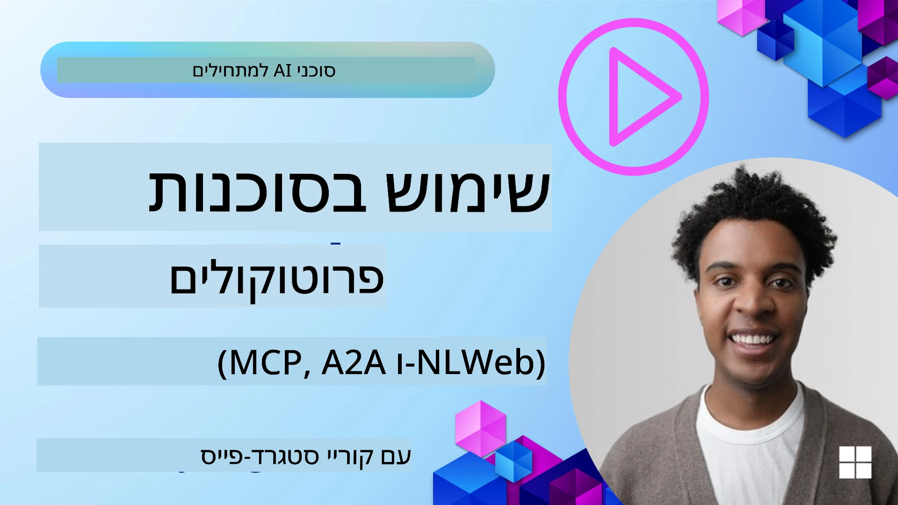
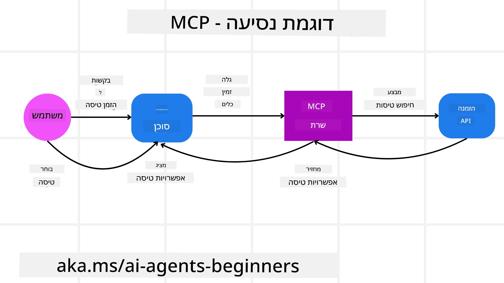
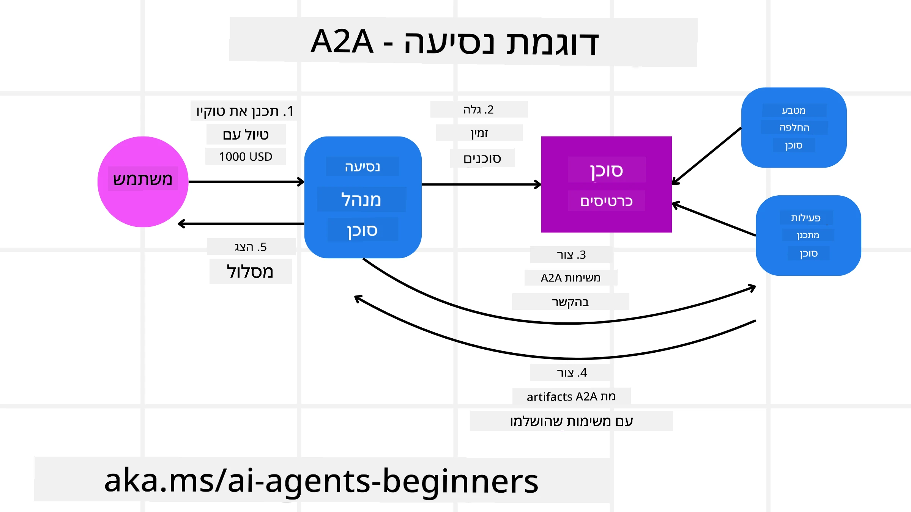
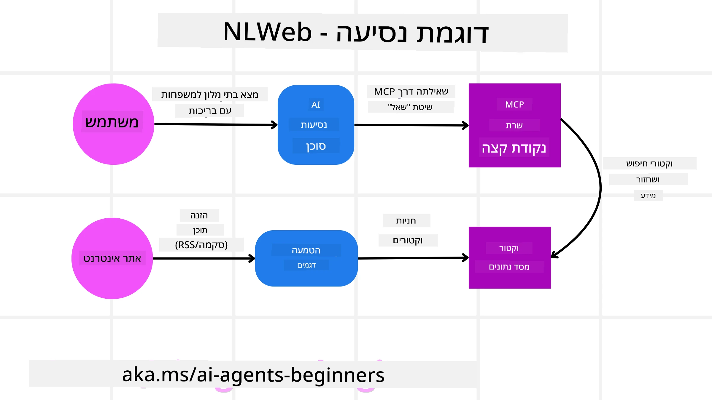

# שימוש בפרוטוקולים סוכניים (MCP, A2A ו-NLWeb)

> _(לחצו על התמונה למעלה לצפייה בסרטון של השיעור)_

ככל שהשימוש בסוכני בינה מלאכותית גדל, גדלה גם הצורך בפרוטוקולים שמבטיחים סטנדרטיזציה, אבטחה ותמיכה בחדשנות פתוחה. בשיעור זה, נכסה 3 פרוטוקולים שמטרתם לענות על צורך זה - פרוטוקול הקשר מודלי (MCP), סוכן לסוכן (A2A) ו-Web שפה טבעית (NLWeb).

## מבוא

בשיעור זה, נסקור:

• כיצד **MCP** מאפשר לסוכני בינה מלאכותית לגשת לכלים ולנתונים חיצוניים להשלמת משימות משתמש.

• כיצד **A2A** מאפשר תקשורת ושיתופי פעולה בין סוכני בינה מלאכותית שונים.

• כיצד **NLWeb** מביא ממשקי שפה טבעית לכל אתר אינטרנט ומאפשר לסוכני בינה מלאכותית לגלות ולהתייחס לתוכן.

## מטרות הלמידה

• **לזהות** את המטרה והיתרונות המרכזיים של MCP, A2A ו-NLWeb בהקשר של סוכני בינה מלאכותית.

• **להסביר** כיצד כל פרוטוקול מאפשר תקשורת ואינטראקציה בין מודלים לשפה גדולה (LLM), כלים וסוכנים אחרים.

• **להכיר** את התפקידים המיוחדים שכל פרוטוקול ממלא בבניית מערכות סוכניות מורכבות.

## פרוטוקול הקשר מודלי

פרוטוקול הקשר מודלי (**MCP**) הוא תקן פתוח המספק דרך מאורגנת ליישומים להעניק הקשר וכלים למודלים לשפה גדולה. זה מאפשר "מתאם אוניברסלי" למקורות נתונים וכלים שונים שסוכני בינה מלאכותית יכולים להתחבר אליהם באופן עקבי.

נבחן את רכיבי MCP, היתרונות לעומת שימוש ישיר ב-API, ודוגמה לאופן שבו סוכני בינה מלאכותית עשויים להשתמש בשרת MCP.

### רכיבים עיקריים ב-MCP

MCP פועל במבנה **לקוח-שרת** והרכיבים העיקריים הם:

• **מארחים** (Hosts) הם יישומים של LLM (לדוגמה עורך קוד כמו VSCode) שמתחילים את החיבורים לשרת MCP.

• **לקוחות** (Clients) הם רכיבים בתוך יישום המארח שמנהלים חיבורים אישיים עם שרתים.

• **שרתים** הם תוכניות קלות המשדרות יכולות ספציפיות.

כלולים בפרוטוקול שלושה יסודות עיקריים שהם היכולות של שרת MCP:

• **כלים**: אלה פעולות או פונקציות מובחנות שסוכן בינה מלאכותית יכול לקרוא כדי לבצע פעולה. לדוגמה, שירות מזג אוויר עשוי להציע כלי "קבל מזג אוויר", או שרת מסחר אלקטרוני עשוי להציע כלי "רכוש מוצר". שרתי MCP מפרסמים את שם הכלי, תיאור ומבנה קלט/פלט ברשימת היכולות שלהם.

• **משאבים**: אלה פריטי נתונים או מסמכים לקריאה בלבד ששרת MCP יכול לספק, והלקוחות יכולים לשלוף אותם לפי דרישה. דוגמאות כוללות תוכן קבצים, רשומות מסד נתונים או קבצי יומן. המשאבים יכולים להיות טקסט (כמו קוד או JSON) או בינאריים (כמו תמונות או PDF).

• **פרומפטים**: אלה תבניות מוגדרות מראש המספקות פרומפטים מוצעים, המאפשרים זרימות עבודה מורכבות יותר.

### יתרונות MCP

MCP מציע יתרונות משמעותיים לסוכני בינה מלאכותית:

• **גילוי דינמי של כלים**: סוכנים יכולים לקבל באופן דינמי רשימת כלים זמינים משרת יחד עם תיאורים של מה שהם עושים. זאת בניגוד ל-APIs מסורתיים שדורשים תכנות סטטי לשילובים, כך שכל שינוי ב-API דורש עדכון קוד. MCP מציע גישה של "שילוב פעם אחת", שמאפשרת התאמה רבה יותר.

• **תאימות בין LLMs שונים**: MCP פועל על פני מודלים לשפה גדולים שונים, ומספק גמישות להחליף מודלים להערכת ביצועים טובים יותר.

• **אבטחה סטנדרטית**: MCP כולל שיטת אימות סטנדרטית, שמשפרת את הקנה מידה כשמוסיפים גישה לשרתים נוספים. זה פשוט יותר מניהול מפתחות ושיטות אימות שונות עבור APIs מסורתיים.

### דוגמת MCP

דמיינו שמשתמש רוצה להזמין טיסה באמצעות עוזר בינה מלאכותית המופעל על MCP.

1. **חיבור**: העוזר (הלקוח של MCP) מתחבר לשרת MCP המסופק על ידי חברת תעופה.

2. **גילוי כלים**: הלקוח שואל את שרת MCP של חברת התעופה, "אילו כלים קיימים?". השרת משיב עם כלים כמו "חפש טיסות" ו"הזמן טיסה".

3. **קריאת כלים**: אז אתם מבקשים מהעוזר, "אנא חפש טיסה מפורטלנד להונולולו." העוזר משתמש במודל השפה הגדולה שלו, מזהה שהוא צריך לקרוא לכלי "חפש טיסות" ומעביר את הפרמטרים הרלוונטיים (מוצא, יעד) לשרת MCP.

4. **ביצוע ותשובה**: שרת MCP, הפועל כמעטפת, מבצע את הקריאה הנכונה ל-API הפנימי של חברת התעופה. הוא מקבל את פרטי הטיסה (למשל נתוני JSON) ושולח אותם חזרה לעוזר.

5. **אינטראקציה נוספת**: העוזר מציג את אפשרויות הטיסה. ברגע שבוחרים טיסה, העוזר עשוי להפעיל את הכלי "הזמן טיסה" על אותו שרת MCP, ולהשלים את ההזמנה.

## פרוטוקול סוכן-לסוכן (A2A)

בזמן ש-MCP מתמקד בחיבור LLM לכלים, פרוטוקול **סוכן-לסוכן (A2A)** מקדם זאת צעד נוסף ומאפשר תקשורת ושיתופי פעולה בין סוכני בינה מלאכותית שונים.  A2A מחבר סוכני בינה מלאכותית מארגונים שונים, סביבות וערכות טכנולוגיות כדי להשלים משימה משותפת.

נבחן את רכיבי ויתרונות A2A, יחד עם דוגמה לשימוש ביישום התיירות שלנו.

### רכיבים עיקריים ב-A2A

A2A מתמקד בהנגשת תקשורת בין סוכנים ובעבודה משותפת להשלמת תת-משימה של המשתמש. כל רכיב בפרוטוקול תורם לכך:

#### כרטיס סוכן

בדומה לאופן שבו שרת MCP משתף רשימת כלים, כרטיס סוכן מכיל:
- שם הסוכן.
- **תיאור של המשימות הכלליות** שהוא מבצע.
- **רשימת מיומנויות ספציפיות** עם תיאורים כדי לעזור לסוכנים אחרים (או אפילו למשתמשים אנושיים) להבין מתי ולמה כדאי לקרוא לסוכן זה.
- **כתובת ה-Endpoint הנוכחית** של הסוכן.
- **גרסה** ו**יכולות** של הסוכן כגון תגובות בשידור חי והתראות.

#### מבצע סוכן

מבצע הסוכן אחראי על **העברת הקשר של השיחה עם המשתמש לסוכן הרחוק**, הסוכן הרחוק צריך זאת כדי להבין את המשימה שיש להשלים. בשרת A2A, סוכן משתמש במודל שפה גדול משלו (LLM) כדי לפרש בקשות נכנסות ולבצע משימות באמצעות הכלים הפנימיים שלו.

#### ארטיפקט

לאחר שהסוכן הרחוק השלים את המשימה המבוקשת, מוצר העבודה שלו נוצר כארטיפקט. ארטיפקט **מכיל את תוצאת עבודת הסוכן**, **תיאור של מה שהושלם**, ו**הקשר הטקסטואלי** שנשלח בפרוטוקול. לאחר שליחת הארטיפקט, החיבור עם הסוכן הרחוק נסגר עד שיידרש שוב.

#### תור אירועים

רכיב זה משמש ל**טיפול בעדכונים והעברת מסרים**. הוא חשוב במיוחד במערכות סוכניות ייצור למניעת סגירת החיבור בין סוכנים לפני הסיום של משימה, במיוחד כאשר זמן השלמת המשימה יכול להיות ארוך.

### יתרונות A2A

• **שיתוף פעולה משופר**: מאפשר לסוכנים מספקים ופלטפורמות שונות לתקשר, לשתף הקשר ולעבוד יחד, ומקל על אוטומציה חלקה בין מערכות שמסורתית היו מנותקות.

• **גמישות בבחירת מודל**: כל סוכן A2A יכול לבחור את ה-LLM שבו הוא משתמש לשירות הפניותיו, מה שמאפשר אופטימיזציה או כיוונון מודלים ספציפיים לסוכן, בניגוד לחיבור LLM יחיד כפי שחלק ממקרי MCP משמשים.

• **אימות מובנה**: האימות משולב ישירות בפרוטוקול A2A, ומספק מסגרת אבטחה חזקה לאינטראקציות בין סוכנים.

### דוגמת A2A

נרחיב את תרחיש הזמנת הטיול שלנו, אך הפעם נשתמש ב-A2A.

1. **בקשת משתמש לרב-סוכן**: משתמש מקיים אינטראקציה עם לקוח/סוכן A2A "סוכן טיולים", אולי באמירה, "אנא הזמין טיול שלם להונולולו לשבוע הבא, כולל טיסות, מלון ורכב שכור".

2. **תזמור על ידי סוכן הטיולים**: סוכן הטיולים מקבל את הבקשה המורכבת. הוא משתמש במודל השפה שלו כדי לשקול את המשימה ולקבוע שיש צורך באינטראקציה עם סוכנים מומחים אחרים.

3. **תקשורת בין סוכנים**: סוכן הטיולים משתמש אז בפרוטוקול A2A כדי להתחבר לסוכנים באמצע הרשת, כגון "סוכן חברת תעופה", "סוכן מלון" ו"סוכן השכרת רכב" שיצרו חברות שונות.

4. **ביצוע משימות מועברות**: סוכן הטיולים שולח משימות ספציפיות לסוכנים המומחים האלו (למשל, "מצא טיסות להונולולו", "הזמן מלון", "השכר רכב"). כל אחד מסוכני המומחים האלו, שרצים עם מודל השפה שלהן ומשתמשים בכלים משלהן (אשר יכולים להיות שרתי MCP עצמם), מבצע את החלק הספציפי שלו בהזמנה.

5. **תגובה מאוחדת**: לאחר שכל הסוכנים השונים משלימים את משימותיהם, סוכן הטיולים אוסף את התוצאות (פרטי טיסה, אישור מלון, הזמנת השכרת רכב) ושולח תגובה סגנונת שיחה מקיפה חזרה למשתמש.

## רשת שפה טבעית (NLWeb)

אתרי אינטרנט היו מזמן הדרך הראשית למשתמשים לגשת למידע ונתונים ברחבי האינטרנט.

נבחן את רכיבי NLWeb השונים, את היתרונות של NLWeb ודוגמה לאופן שבו NLWeb שלנו עובד על ידי עיון באפליקציית התיירות שלנו.

### רכיבי NLWeb

- **יישום NLWeb (קוד שירות הליבה)**: המערכת שמעבדת שאלות בשפה טבעית. היא מחברת את החלקים השונים של הפלטפורמה ליצירת תגובות. ניתן לחשוב עליה כמנוע שמפעיל את תכונות השפה הטבעית של אתר אינטרנט.

- **פרוטוקול NLWeb**: זהו **מערך כללים בסיסי לאינטראקציה בשפה טבעית** עם אתר אינטרנט. הוא מחזיר תגובות בפורמט JSON (לעיתים משתמש ב-Schema.org). מטרתו ליצור בסיס פשוט ל"Web AI", בדומה לאופן שבו HTML אפשר שיתוף מסמכים באינטרנט.

- **שרת MCP (נקודת קצה של פרוטוקול הקשר מודלי)**: כל הגדרת NLWeb גם פועלת כשרת MCP. זאת אומרת, היא יכולה **לשתף כלים (כמו שיטת "ask") ונתונים** עם מערכות AI אחרות. בפועל, זה הופך את תוכן האתר והיכולות שלו לשימושיות על ידי סוכני בינה מלאכותית, ומאפשר לאתר להיות חלק מ"האקוסיסטם הסוכני" הרחב יותר.

- **מודלים מובנים**: מודלים אלה משמשים להמרת תוכן אתר האינטרנט לייצוגים מספריים שנקראים וקטורים (embeddings). וקטורים אלו לוכדים משמעות בצורה שבה מחשבים יכולים להשוות ולחפש. הם מאוחסנים במסד נתונים מיוחד, והמשתמשים יכולים לבחור איזה מודל embedding להשתמש.

- **מסד נתונים וקטורי (מנגנון אחזור)**: מסד נתונים זה **מאחסן את ה-embeddings של תוכן האתר**. כאשר שואלים שאלה, NLWeb בודק את מסד הנתונים הוקטורי כדי למצוא במהירות את המידע הרלוונטי ביותר. הוא נותן רשימה מהירה של תשובות אפשריות, מדורגות לפי דמיון. NLWeb עובד עם מערכות אחסון וקטוריות שונות כמו Qdrant, Snowflake, Milvus, Azure AI Search ו-Elasticsearch.

### NLWeb כדוגמה

שקלו שוב את אתר ההזמנות של הטיולים שלנו, אך הפעם הוא מופעל על ידי NLWeb.

1. **קליטת נתונים**: קטלוגי המוצרים הקיימים באתר התיירות (למשל, רשימות טיסות, תיאורי מלונות, חבילות טיולים) מעוצבים באמצעות Schema.org או נטענים דרך RSS. כלי NLWeb קולטים נתונים ממוסדים אלה, יוצרים embeddings ומאחסנים אותם במסד נתונים וקטורי מקומי או מרוחק.

2. **שאילתה בשפה טבעית (אנושית)**: משתמש מבקר באתר ובמקום לניווט בתפריטים, מקליד בממשק שיחה: "מצא לי מלון ידידותי למשפחות בהונולולו עם בריכה לשבוע הבא".

3. **עיבוד NLWeb**: יישום NLWeb מקבל את השאילתה. הוא שולח את השאילתה ל-LLM כדי להבין ומחפש בו-זמנית במסד הנתונים הוקטורי רשימות המלונות הרלוונטיות.

4. **תוצאות מדויקות**: ה-LLM מסייע לפרש את תוצאות החיפוש מהמסד, מזהה את ההתאמות הטובות ביותר על סמך הקריטריונים "ידידותי למשפחות", "בריכה" ו"הונולולו", ומעצב תגובה בשפה טבעית. חשוב שהתגובה מתייחסת למלונות האמיתיים בקטלוג של האתר, ומונעת מידע בדוי.

5. **אינטראקציה עם סוכן AI**: מכיוון ש-NLWeb משמש כשרת MCP, עוזר טיולים חיצוני יכול להתחבר גם הוא למופע NLWeb של אתר זה. אז סוכן ה-AI יכול להשתמש בשיטת `ask` של MCP כדי לשאול באתר ישירות: `ask("האם יש מסעדות ידידותיות לטבעונות באזור הונולולו שמומלצות על ידי המלון?")`. מופע ה-NLWeb יעבד זאת, ינצל את מסד הנתונים שלו על מידע מסעדות (אם נטען), וישיב תשובה מובנית ב-JSON.

### יש לכם שאלות נוספות על MCP/A2A/NLWeb?

הצטרפו ל-[Microsoft Foundry Discord](https://discord.com/invite/ATgtXmAS5D) לפגוש לומדים אחרים, להשתתף בשעות קבלה ולקבל מענה לשאלות על סוכני בינה מלאכותית.

## משאבים

- [MCP למתחילים](https://aka.ms/mcp-for-beginners)  
- [תיעוד MCP](https://learn.microsoft.com/python/api/overview/azure/ai-projects-readme)
- [מאגר NLWeb](https://github.com/nlweb-ai/NLWeb)
- [מסגרת סוכני Microsoft](https://aka.ms/ai-agents-beginners/agent-framework)

---

<!-- CO-OP TRANSLATOR DISCLAIMER START -->
**כתב ויתור**:
מסמך זה תורגם באמצעות שירות תרגום אוטומטי [Co-op Translator](https://github.com/Azure/co-op-translator). למרות שאנו שואפים לדיוק, יש לקחת בחשבון שתרגומים אוטומטיים עלולים להכיל שגיאות או אי-דיוקים. יש להחשיב את המסמך המקורי בשפתו הטבעית כמקור הסמכות. למידע קריטי מומלץ להשתמש בתרגום מקצועי על ידי מתרגם אדם. אנו לא אחראים לכל אי-הבנה או פירוש שגוי הנובע מהשימוש בתרגום זה.
<!-- CO-OP TRANSLATOR DISCLAIMER END -->