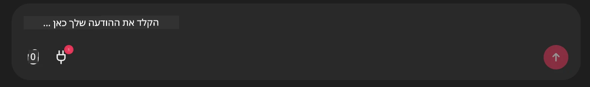

# דוגמת שרת Github MCP

## תיאור

זוהי הדגמה שנוצרה עבור האקתון סוכני ה-AI שהתקיים דרך Microsoft Reactor.

הכלי משמש להמלצות פרויקטים להאקתון בהתבסס על מאגרים של משתמש ב-Github.  
הדבר נעשה על ידי:

1. **סוכן Github** - שימוש בשרת Github MCP כדי לשלוף מאגרים ומידע על אותם מאגרים.  
2. **סוכן האקתון** - מקבל את הנתונים מסוכן ה-Github ומציע רעיונות יצירתיים לפרויקטי האקתון בהתבסס על הפרויקטים, השפות בהם משתמש המשתמש ועל המסלולים של הפרויקטים בהאקתון סוכני ה-AI.  
3. **סוכן אירועים** - בהתבסס על ההצעה של סוכן ההאקתון, סוכן האירועים ימליץ על אירועים רלוונטיים מסדרת האקתון סוכני ה-AI.  

## הרצת הקוד

### משתני סביבה

הדגמה זו משתמשת במסגרת Microsoft Agent Framework, שירות Azure OpenAI, שרת Github MCP וחיפוש Azure AI.

ודא כי הוגדרו לך משתני סביבה מתאימים לשימוש בכלים אלו:

```python
AZURE_AI_PROJECT_ENDPOINT=""
AZURE_AI_MODEL_DEPLOYMENT_NAME=""
AZURE_SEARCH_SERVICE_ENDPOINT=""
AZURE_SEARCH_API_KEY=""
``` 


## הרצת שרת Chainlit

כדי להתחבר לשרת MCP, הדגמה זו משתמשת ב-Chainlit כממשק שיחה.

להרצת השרת, השתמש בפקודה הבאה בטרמינל שלך:

```bash
chainlit run app.py -w
```


זה יפעיל את שרת Chainlit שלך ב־`localhost:8000` וימלא את אינדקס Azure AI Search שלך בתוכן `event-descriptions.md`.

## התחברות לשרת MCP

כדי להתחבר לשרת Github MCP, בחר באייקון "תקע" מתחת לתיבת השיחה עם הכיתוב "Type your message here..":



משם תוכל ללחוץ על "Connect an MCP" כדי להוסיף את הפקודה להתחברות לשרת Github MCP:

```bash
npx -y @modelcontextprotocol/server-github --env GITHUB_PERSONAL_ACCESS_TOKEN=[YOUR PERSONAL ACCESS TOKEN]
```


החלף את "[YOUR PERSONAL ACCESS TOKEN]" באסימון הגישה האישי שלך.

לאחר ההתחברות, יופיע (1) ליד אייקון התקע כדי לאשר שהחיבור הצליח. אם לא, נסה להפעיל מחדש את שרת ה-chainlit עם `chainlit run app.py -w`.

## שימוש בהדגמה

כדי להתחיל את זרימת העבודה של הסוכן ולהמליץ על פרויקטים להאקתון, תוכל להקליד הודעה כמו:

"Recommend hackathon projects for the Github user koreyspace"

סוכן ה-Router ינתח את הבקשה שלך ויקבע איזו שילוב של סוכנים (GitHub, האקתון, ואירועים) מתאים לטיפול בבקשה. הסוכנים עובדים יחד כדי לספק המלצות מקיפות המבוססות על ניתוח מאגרים ב-GitHub, יצירת רעיונות לפרויקטים ואירועי טק רלוונטיים.

---

<!-- CO-OP TRANSLATOR DISCLAIMER START -->
**כתב ויתור**:
מסמך זה תורגם באמצעות שירות תרגום מבוסס בינה מלאכותית [Co-op Translator](https://github.com/Azure/co-op-translator). למרות שאנו שואפים לדיוק, יש לקחת בחשבון כי תרגומים אוטומטיים עשויים להכיל שגיאות או אי-דיוקים. המסמך המקורי בשפת המקור שלו נחשב למקור הסמכותי. למידע קריטי מומלץ להשתמש בתרגום מקצועי על ידי בני אדם. אנו לא נושאים באחריות לכל אי-הבנות או פרשנויות שגויות הנובעות מהשימוש בתרגום זה.
<!-- CO-OP TRANSLATOR DISCLAIMER END -->