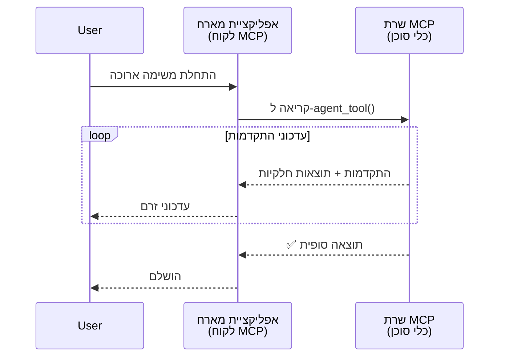
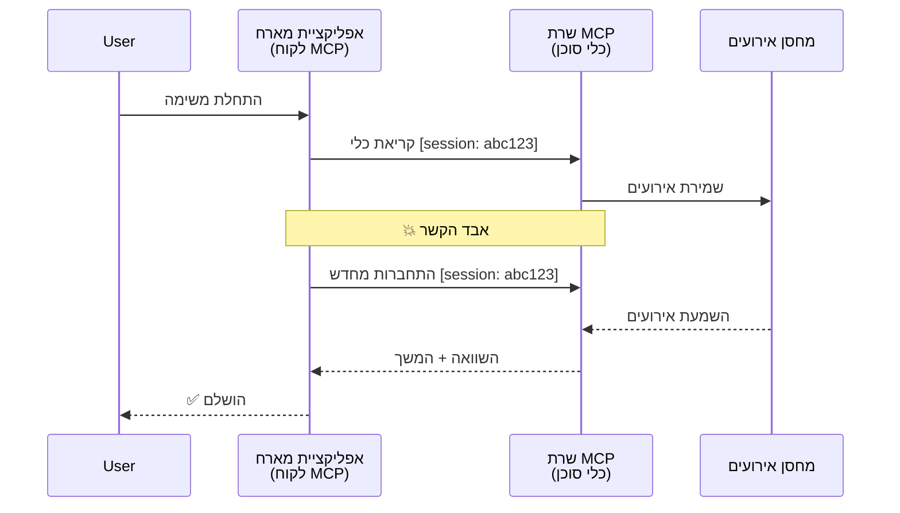
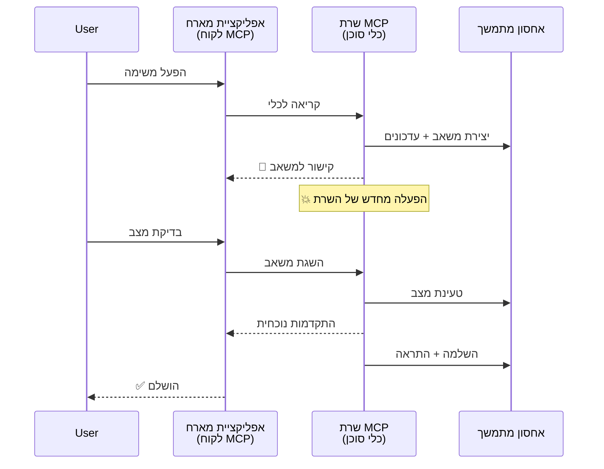
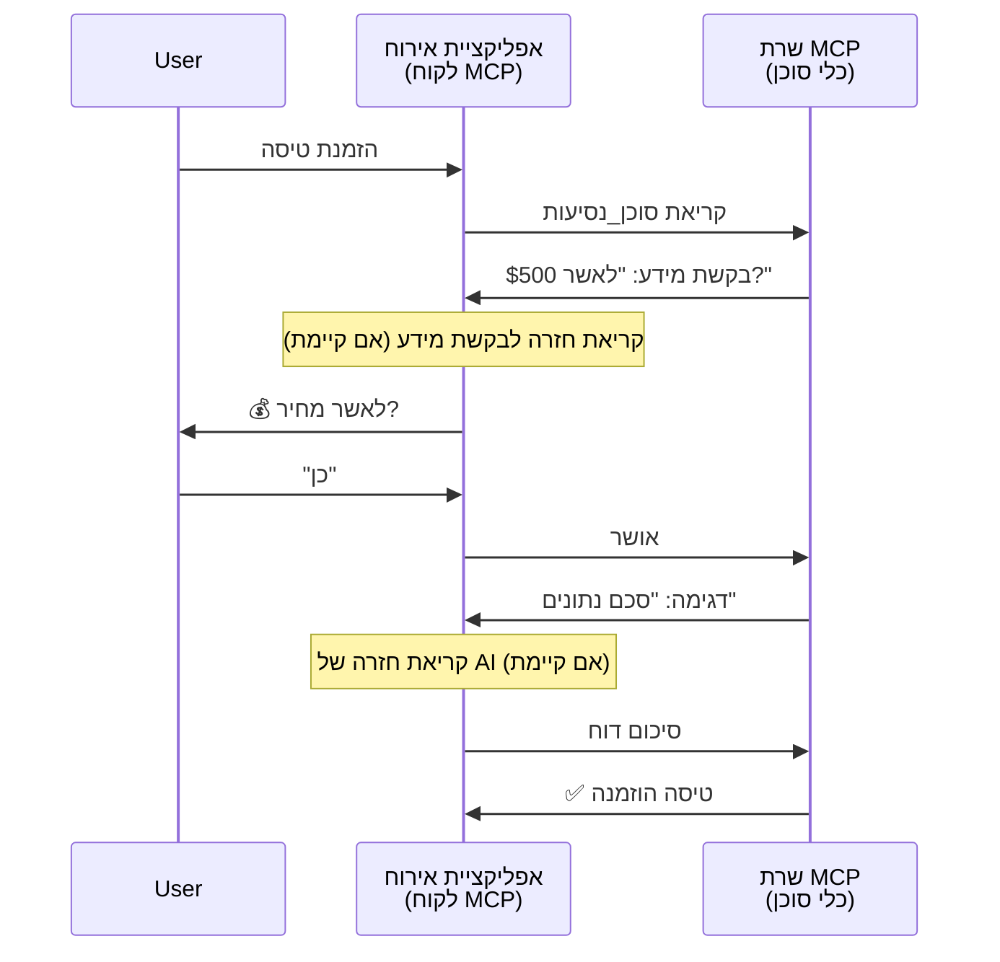
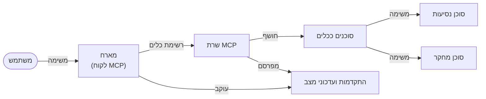

# בניית מערכות תקשורת סוכן-לסוכן עם MCP

> תקציר - האם ניתן לבנות תקשורת Agent2Agent על MCP? כן!

MCP התפתח משמעותית מעבר למטרתו המקורית של "מתן הקשר ל-LLMs". עם שיפורים אחרונים הכוללים [זרמים שניתנים להמשך](https://modelcontextprotocol.io/docs/concepts/transports#resumability-and-redelivery), [אילוץ](https://modelcontextprotocol.io/specification/2025-06-18/client/elicitation), [דגימה](https://modelcontextprotocol.io/specification/2025-06-18/client/sampling), והודעות ([התקדמות](https://modelcontextprotocol.io/specification/2025-06-18/basic/utilities/progress) ו-[משאבים](https://modelcontextprotocol.io/specification/2025-06-18/schema#resourceupdatednotification)), MCP מספק כעת בסיס חזק לבניית מערכות תקשורת סוכן-לסוכן מורכבות.

## הטעות לגבי סוכן/כלי

ככל שמפתחים רבים יותר חוקרים כלים עם התנהגויות סוכניות (מתפקדים לפרקי זמן ארוכים, עשויים לדרוש קלט נוסף באמצע ההרצה, וכו'), טעות נפוצה היא שמערכת MCP אינה מתאימה בעיקר כי הדוגמאות המוקדמות של הכלים היו מבוססות על דפוסי בקשה-תגובה פשוטים.

תפיסה זו מיושנת. מפרט ה-MCP שופר משמעותית במהלך החודשים האחרונים עם יכולות שמסגרות את הפער לבניית התנהגות סוכנית שנמשכת זמן רב:

- **זרימה ותוצאות חלקיות**: עדכוני התקדמות בזמן אמת במהלך ביצוע
- **יכולת המשך (Resumability)**: לקוחות יכולים להתחבר מחדש ולהמשיך לאחר ניתוק
- **עמידות**: תוצאות ששרדו הפעלות מחדש של השרת (למשל, באמצעות קישורי משאבים)
- **רב סבבים**: קלט אינטראקטיבי באמצע הביצוע דרך אילוץ ודגימה

תכונות אלו יכולות להרכב כדי לאפשר יישומים סוכניים ומרובי סוכנים מורכבים, הכל פרוס על פרוטוקול ה-MCP.

כהתייחסות, נשתמש במונח "כלי" לייצוג סוכן הזמין על שרת MCP. משמעות הדבר היא קיום אפליקציית מארח שמממשת לקוח MCP שמקים סשן עם שרת ה-MCP ויכול לקרוא לסוכן.

## מה עושה כלי MCP ל"סוכני"?

לפני שנצלול למימוש, נגדיר אילו יכולות תשתיתיות נדרשות לתמיכה בסוכנים הפועלים זמן רב.

> נגדיר סוכן כיישות שיכולה לפעול באופן אוטונומי לאורך תקופות ארוכות, ויכולה להתמודד עם משימות מורכבות שיכולות לדרוש אינטראקציות מרובות או התאמות בהתאם למשוב בזמן אמת.

### 1. זרימה ותוצאות חלקיות

דפוסי בקשה-תגובה מסורתיים אינם מתאימים למשימות ארוכות טווח. סוכנים צריכים לספק:

- עדכוני התקדמות בזמן אמת
- תוצאות ביניים

**תמיכת MCP**: הודעות עדכון משאבים מאפשרות זרימה של תוצאות חלקיות, אך זה מחייב תכנון זהיר כדי למנוע התנגשויות עם דגם הבקשה/תגובה 1:1 של JSON-RPC.

| תכונה                      | מקרה שימוש                                                                                                                                                                 | תמיכת MCP                                                                              |
| -------------------------- | -------------------------------------------------------------------------------------------------------------------------------------------------------------------------- | ---------------------------------------------------------------------------------------- |
| עדכוני התקדמות בזמן אמת    | משתמש מבקש משימת העברת בסיס קוד. הסוכן זורם התקדמות: "10% - ניתוח תלותיות... 25% - המרת קבצי TypeScript... 50% - עדכון ייבוא..."                                          | ✅ הודעות התקדמות                                                                       |
| תוצאות חלקיות              | משימת "הפקת ספר" זורמת תוצאות חלקיות, למשל 1) מתווה הסיפור, 2) רשימת פרקים, 3) כל פרק בהשלמה. המארח יכול לבדוק, לבטל, או להפנות מחדש בכל שלב.                     | ✅ ניתן "להרחיב" הודעות לכלול תוצאות חלקיות - ראו הצעות ב-PR 383, 776                   |

<div align="center" style="font-style: italic; font-size: 0.95em; margin-bottom: 0.5em;">
<strong>איור 1:</strong> דיאגרמה זו ממחישה כיצד סוכן MCP זורם עדכוני התקדמות בזמן אמת ותוצאות חלקיות לאפליקציית המארח במהלך משימה ארוכת טווח, ומאפשרת למשתמש לעקוב אחר הביצוע בזמן אמת.
</div>



### 2. יכולת המשך (Resumability)

סוכנים חייבים לנהל הפסקות רשת בצורה חלקה:

- התחברות מחדש לאחר ניתוק (הלקוח)
- המשך מהמקום בו הופסקו (הספקת הודעות מחדש)

**תמיכת MCP**: הובלת StreamableHTTP של MCP תומכת כיום בהמשך סשן והספקת הודעות מחדש עם מזהי סשן ומזהי אירועים אחרונים. חשוב לציין שהשרת חייב לממש EventStore שמאפשר חזרות אירועים בעת חיבור מחדש של הלקוח.  
ישנה הצעת קהילה (PR #975) החוקרת זרמים ניתנים להמשך שאינם תלויים בפרוטוקול הובלה ספציפי.

| תכונה      | מקרה שימוש                                                                                                                                          | תמיכת MCP                                                                |
| ---------- | -------------------------------------------------------------------------------------------------------------------------------------------------- | -------------------------------------------------------------------------- |
| יכולת המשך | לקוח מתנתק במהלך משימה ארוכת טווח. לאחר חיבור מחדש, הסשן ממשיך עם חזרות אירועים שהוחמצו בצורה חלקה מהמקום בו הופסק.                              | ✅ הובלת StreamableHTTP עם מזהי סשן, חזרות אירועים ו-EventStore           |

<div align="center" style="font-style: italic; font-size: 0.95em; margin-bottom: 0.5em;">
<strong>איור 2:</strong> דיאגרמה זו מראה כיצד הובלת StreamableHTTP ו-EventStore של MCP מאפשרים המשך סשן חלק: אם הלקוח מתנתק, הוא יכול להתחבר מחדש ולנגן את האירועים שהוחמצו, ולהמשיך את המשימה ללא אובדן התקדמות.
</div>



### 3. עמידות

סוכנים הפועלים זמן רב זקוקים למצב מתמשך:

- תוצאות ששרדו הפעלות חוזרות של השרת
- סטטוס שניתן לשלוף מחוץ לזרם
- מעקב התקדמות בין סשנים

**תמיכת MCP**: MCP תומך כעת בסוג החזרה מסוג Resource link לקריאות כלי. כיום, דפוס אפשרי הוא לעצב כלי שיוצר משאב ומחזיר מיד קישור למשאב. הכלי יכול להמשיך לטפל במשימה ברקע ולעדכן את המשאב. בהתאם, הלקוח יכול לבחור לסקר את מצב המשאב לקבלת תוצאות חלקיות או מלאות (בהתאם לעדכוני משאבים שהשרת מספק) או להירשם לעדכוני המשאב.

מגבלה אחת היא שסקר משאבים או הרשמה לעדכונים יכולים לצרוך משאבים עם השלכות בהיקפים גדולים. יש הצעת קהילה פתוחה (כולל #992) החוקרת אפשרות של שילוב ווב-וקים או טריגרים שהשרת יכול לקרוא כדי להודיע ללקוח/אפליקציית המארח על עדכונים.

| תכונה    | מקרה שימוש                                                                                                                                          | תמיכת MCP                                                        |
| -------- | --------------------------------------------------------------------------------------------------------------------------------------------------- | ------------------------------------------------------------------ |
| עמידות   | קריסת שרת במהלך משימת העברת נתונים. התוצאות וההתקדמות שורדים הפעלה מחדש, הלקוח יכול לבדוק סטטוס ולהמשיך מהמשאב המתמשך.                        | ✅ קישורי משאבים עם אחסון מתמשך והודעות סטטוס                     |

כיום, דפוס נפוץ הוא לעצב כלי שיוצר משאב ומחזיר מיד קישור למשאב. הכלי יכול לטפל במשימה ברקע, להנפיק הודעות משאב המשמשות כעדכוני התקדמות או מכילות תוצאות חלקיות, ולעדכן את התוכן במשאב לפי הצורך.

<div align="center" style="font-style: italic; font-size: 0.95em; margin-bottom: 0.5em;">
<strong>איור 3:</strong> דיאגרמה זו מדגימה כיצד סוכני MCP משתמשים במשאבים מתמשכים ובהודעות סטטוס כדי להבטיח שמשימות ארוכות טווח שורדות הפעלות מחדש של השרת, ומאפשרות ללקוחות לבדוק התקדמות ולהפיק תוצאות גם לאחר כשלים.
</div>



### 4. אינטראקציות רב-סבביות

סוכנים לעיתים זקוקים לקלט נוסף במהלך ההרצה:

- הבהרה או אישור אנושי
- סיוע בינה מלאכותית להחלטות מורכבות
- התאמת פרמטרים דינמית

**תמיכת MCP**: נתמכת במלואה דרך דגימה (לקלט בינה מלאכותית) ואילוץ (לקלט אנושי).

| תכונה                   | מקרה שימוש                                                                                                                                       | תמיכת MCP                                           |
| ----------------------- | ------------------------------------------------------------------------------------------------------------------------------------------------ | ----------------------------------------------------- |
| אינטראקציות רב-סבביות | סוכן הזמנת נסיעות מבקש אישור מחיר מהמשתמש, ואז מבקש מהבינה המלאכותית לסכם נתוני נסיעה לפני השלמת ההזמנה.                                  | ✅ אילוץ לקלט אנושי, דגימה לקלט בינה מלאכותית         |

<div align="center" style="font-style: italic; font-size: 0.95em; margin-bottom: 0.5em;">
<strong>איור 4:</strong> דיאגרמה זו מתארת כיצד סוכני MCP יכולים לקבל אינטראקטיבית קלט אנושי או לבקש סיוע בינה מלאכותית באמצע ביצוע, תומכים בזרימות עבודה מורכבות רב-סבביות כמו אישורים וקבלת החלטות דינמית.
</div>



## יישום סוכנים הפועלים זמן רב על MCP - סקירת קוד

כחלק ממאמר זה, אנו מספקים [מאגר קוד](https://github.com/victordibia/ai-tutorials/tree/main/MCP%20Agents) המכיל מימוש מלא של סוכנים הפועלים זמן רב באמצעות SDK של MCP בפייתון עם הובלת StreamableHTTP להמשך סשן והספקת הודעות מחדש. המימוש מדגים כיצד יכולות MCP יכולות להרכב כדי לאפשר התנהגויות מתוחכמות כמו סוכן.

בפרט, אנו מממשים שרת עם שני כלים עיקריים של סוכנים:

- **סוכן נסיעות** - מדמה שירות הזמנת נסיעות עם אישור מחיר דרך אילוץ
- **סוכן מחקר** - מבצע משימות מחקר עם סיכומים בסיוע AI דרך דגימה

שני הסוכנים מדגימים עדכוני התקדמות בזמן אמת, אישורים אינטראקטיביים, ויכולת המשך סשן מלאה.

### רעיונות מרכזיים במימוש

הקטעים הבאים מראים מימוש סוכן בצד השרת וטיפול במארח בצד הלקוח עבור כל יכולת:

#### זרימה ועדכוני התקדמות - סטטוס משימה בזמן אמת

זרימה מאפשרת לסוכנים לספק עדכוני התקדמות בזמן אמת במהלך משימות ארוכות, שומרת על המשתמשים מעודכנים במצב המשימה ובתוצאות הביניים.

**מימוש צד שרת (הסוכן שולח הודעות התקדמות):**

```python
# מסרבר/server.py - סוכן נסיעות ששולח עדכוני התקדמות
for i, step in enumerate(steps):
    await ctx.session.send_progress_notification(
        progress_token=ctx.request_id,
        progress=i * 25,
        total=100,
        message=step,
        related_request_id=str(ctx.request_id)
    )
    await anyio.sleep(2)  # לדמות עבודה

# אלטרנטיבה: להקליט הודעות לעדכונים מפורטים של כל שלב ושלב
await ctx.session.send_log_message(
    level="info",
    data=f"Processing step {current_step}/{steps} ({progress_percent}%)",
    logger="long_running_agent",
    related_request_id=ctx.request_id,
)
```

**מימוש צד לקוח (המארח מקבל עדכוני התקדמות):**

```python
# מטיפול בלקוח לקוח/client.py - טיפול בהתראות בזמן אמת
async def message_handler(message) -> None:
    if isinstance(message, types.ServerNotification):
        if isinstance(message.root, types.LoggingMessageNotification):
            console.print(f"📡 [dim]{message.root.params.data}[/dim]")
        elif isinstance(message.root, types.ProgressNotification):
            progress = message.root.params
            console.print(f"🔄 [yellow]{progress.message} ({progress.progress}/{progress.total})[/yellow]")

# לרשום מנהל הודעות בעת יצירת מושב
async with ClientSession(
    read_stream, write_stream,
    message_handler=message_handler
) as session:
```

#### אילוץ - בקשת קלט מהמשתמש

אילוץ מאפשר לסוכנים לבקש קלט מהמשתמש באמצע ההרצה. זה חיוני לאישורים, הבהרות או אישורים במהלך משימות ארוכות.

**מימוש צד שרת (הסוכן מבקש אישור):**

```python
# מסוכנות נסיעות מבקש אישור מחיר משרת שרת/שרת.py
elicit_result = await ctx.session.elicit(
    message=f"Please confirm the estimated price of $1200 for your trip to {destination}",
    requestedSchema=PriceConfirmationSchema.model_json_schema(),
    related_request_id=ctx.request_id,
)

if elicit_result and elicit_result.action == "accept":
    # המשך עם ההזמנה
    logger.info(f"User confirmed price: {elicit_result.content}")
elif elicit_result and elicit_result.action == "decline":
    # בטל את ההזמנה
    booking_cancelled = True
```

**מימוש צד לקוח (המארח מספק קריאת חזרה לאילוץ):**

```python
# מטיפול בלקוח/client.py - טיפול בבקשות הפקת מידע מהלקוח
async def elicitation_callback(context, params):
    console.print(f"💬 Server is asking for confirmation:")
    console.print(f"   {params.message}")

    response = console.input("Do you accept? (y/n): ").strip().lower()

    if response in ['y', 'yes']:
        return types.ElicitResult(
            action="accept",
            content={"confirm": True, "notes": "Confirmed by user"}
        )
    else:
        return types.ElicitResult(
            action="decline",
            content={"confirm": False, "notes": "Declined by user"}
        )

# רישום הפונקציה החוזרת בעת יצירת המפגש
async with ClientSession(
    read_stream, write_stream,
    elicitation_callback=elicitation_callback
) as session:
```

#### דגימה - בקשת סיוע AI

דגימה מאפשרת לסוכנים לבקש סיוע ממודל שפה גדול (LLM) להחלטות מורכבות או יצירת תוכן במהלך הביצוע. זה מאפשר זרימות עבודה היברידיות אדם-מכונה.

**מימוש צד שרת (הסוכן מבקש סיוע AI):**

```python
# מסקרבר/סרבר.py - סוכן מחקר מבקש סיכום בינה מלאכותית
sampling_result = await ctx.session.create_message(
    messages=[
        SamplingMessage(
            role="user",
            content=TextContent(type="text", text=f"Please summarize the key findings for research on: {topic}")
        )
    ],
    max_tokens=100,
    related_request_id=ctx.request_id,
)

if sampling_result and sampling_result.content:
    if sampling_result.content.type == "text":
        sampling_summary = sampling_result.content.text
        logger.info(f"Received sampling summary: {sampling_summary}")
```

**מימוש צד לקוח (המארח מספק קריאת חזרה לדגימה):**

```python
# מטיפול בקליינט/client.py - טיפול בבקשות דגימה
async def sampling_callback(context, params):
    message_text = params.messages[0].content.text if params.messages else 'No message'
    console.print(f"🧠 Server requested sampling: {message_text}")

    # ביישום אמיתי, זה יכול לקרוא ל-API של LLM
    # למטרות הדגמה, אנו מספקים תגובה מדומה
    mock_response = "Based on current research, MCP has evolved significantly..."

    return types.CreateMessageResult(
        role="assistant",
        content=types.TextContent(type="text", text=mock_response),
        model="interactive-client",
        stopReason="endTurn"
    )

# רשום את הקריאה החוזרת בעת יצירת הסשן
async with ClientSession(
    read_stream, write_stream,
    sampling_callback=sampling_callback,
    elicitation_callback=elicitation_callback
) as session:
```

#### יכולת המשך - המשכיות סשן אחרי ניתוקים

יכולת ההמשך מבטיחה שמשימות סוכן ארוכות יצליחו לשרוד ניתוקים של הלקוח וימשיכו חלק עם חיבור מחדש. זו מיושמת דרך מאגרי אירועים ותגי המשך.

**מימוש EventStore (השרת מחזיק במצב סשן):**

```python
# מחנות אירועים פשוט בזיכרון מ־server/event_store.py
class SimpleEventStore(EventStore):
    def __init__(self):
        self._events: list[tuple[StreamId, EventId, JSONRPCMessage]] = []
        self._event_id_counter = 0

    async def store_event(self, stream_id: StreamId, message: JSONRPCMessage) -> EventId:
        """Store an event and return its ID."""
        self._event_id_counter += 1
        event_id = str(self._event_id_counter)
        self._events.append((stream_id, event_id, message))
        return event_id

    async def replay_events_after(self, last_event_id: EventId, send_callback: EventCallback) -> StreamId | None:
        """Replay events after the specified ID for resumption."""
        start_index = None
        stream_id = None
        for index, (event_stream_id, event_id, _) in enumerate(self._events):
            if event_id == last_event_id:
                start_index = index + 1
                stream_id = event_stream_id
                break

        if start_index is None:
            return None

        # השמעה מחדש של אירועים מאוחרים בלבד מזרם המקורי של הסשן.
        for event_stream_id, event_id, message in self._events[start_index:]:
            if event_stream_id != stream_id:
                continue
            await send_callback(EventMessage(message, event_id))

        return stream_id

# העברת מחסן האירועים למנהל הסשן מ־server/server.py
def create_server_app(event_store: Optional[EventStore] = None) -> Starlette:
    server = ResumableServer()

    # יצירת מנהל סשן עם מחסן אירועים להמשך
    session_manager = StreamableHTTPSessionManager(
        app=server,
        event_store=event_store,  # מחסן האירועים מאפשר המשך סשן
        json_response=False,
        security_settings=security_settings,
    )

    return Starlette(routes=[Mount("/mcp", app=session_manager.handle_request)])

# שימוש: אתחול עם מחסן אירועים
event_store = SimpleEventStore()
app = create_server_app(event_store)
```

**מטא-נתוני לקוח עם תו המשך (הלקוח מתחבר מחדש בעזרת מצב מאוחסן):**

```python
# מלקוח/client.py - חידוש לקוח עם מטה-נתונים
if existing_tokens and existing_tokens.get("resumption_token"):
    # השתמש בטוקן חידוש קיים כדי להמשיך מהמקום בו הפסקנו
    metadata = ClientMessageMetadata(
        resumption_token=existing_tokens["resumption_token"],
    )
else:
    # צור פונקציית קריאה חוזרת לשמירת טוקן החידוש כשהוא מתקבל
    def enhanced_callback(token: str):
        protocol_version = getattr(session, 'protocol_version', None)
        token_manager.save_tokens(session_id, token, protocol_version, command, args)

    metadata = ClientMessageMetadata(
        on_resumption_token_update=enhanced_callback,
    )

# שלח בקשה עם מטה-נתוני החידוש
result = await session.send_request(
    types.ClientRequest(
        types.CallToolRequest(
            method="tools/call",
            params=types.CallToolRequestParams(name=command, arguments=args)
        )
    ),
    types.CallToolResult,
    metadata=metadata,
)
```

אפליקציית המארח שומרת באופן מקומי על מזהי סשן ותווי המשך, ומאפשרת לה להתחבר מחדש לסשנים קיימים בלי לאבד התקדמות או מצב.

### ארגון קוד

<div align="center" style="font-style: italic; font-size: 0.95em; margin-bottom: 0.5em;">
<strong>איור 5:</strong> ארכיטקטורת מערכת סוכן מבוססת MCP
</div>



**קבצים מרכזיים:**

- **`server/server.py`** - שרת MCP שניתן להמשך עם סוכני נסיעות ומחקר המדגימים אילוץ, דגימה, ועדכוני התקדמות
- **`client/client.py`** - אפליקציית מארח אינטראקטיבית עם תמיכת המשך, מטפלי קריאות חוזרות, וניהול תווים
- **`server/event_store.py`** - מימוש מאגר אירועים המאפשר המשך סשן והספקת הודעות מחדש

## הרחבה לתקשורת מרובת סוכנים ב-MCP

המימוש שלעיל יכול להיות מורחב למערכות מרובות סוכנים על ידי שיפור האינטליגנציה והטווח של אפליקציית המארח:

- **פירוק משימות אינטיליגנטי**: המארח מנתח בקשות משתמש מורכבות ומפרק אותן לתת-משימות לסוכנים מיוחדים שונים
- **תיאום בין שרתים מרובים**: המארח שומר על קשרים מול מספר שרתי MCP, שכל אחד חושף יכולות סוכנים שונות
- **ניהול מצב משימות**: המארח עוקב אחרי התקדמות משימות סוכן במקביל, מתמודד עם תלותיות ורצף
- **חוסן וניסיונות חוזרים**: המארח מנהל כשלונות, מיישם לוגיקת ניסיונות חוזרים, ומפנה משימות מחדש כשהסוכנים לא זמינים
- **סינתזת תוצאות**: המארח משלב תוצרי סוכנים מרובים לתוצאות סופיות קוהרנטיות

המארח מתפתח מלקוח פשוט למאורגן אינטיליגנטי, המתאם יכולות סוכן מבוזרות תוך שמירה על יסודות פרוטוקול MCP.

## סיכום

יכולות MCP המורחבות - הודעות משאבים, אילוץ/דגימה, זרמים ניתנים להמשך, ומשאבים מתמשכים - מאפשרות אינטראקציות סוכן-לסוכן מורכבות תוך שמירה על פשטות הפרוטוקול.

## התחלה מהירה

מוכן לבנות מערכת agent2agent משלך? עקוב אחר השלבים הבאים:

### 1. הרץ את הדמו

```bash
# הפעל את השרת עם מחסן האירועים עבור המשך
python -m server.server --port 8006

# במסוף נוסף, הפעל את לקוח האינטראקציה
python -m client.client --url http://127.0.0.1:8006/mcp
```

**פקודות זמינות במצב אינטראקטיבי:**

- `travel_agent` - הזמנת נסיעה עם אישור מחיר דרך אילוץ
- `research_agent` - מחקר נושאים עם סיכומים בסיוע AI דרך דגימה
- `list` - הצגת כל הכלים הזמינים
- `clean-tokens` - ניקוי תווי המשך
- `help` - הצגת עזרה מפורטת לפקודות
- `quit` - יציאה מהלקוח

### 2. בדוק יכולות המשך

- התחל סוכן הפועל זמן רב (למשל, `travel_agent`)
- נתק את הלקוח במהלך ההרצה (Ctrl+C)
- הפעל מחדש את הלקוח - הוא ימשיך אוטומטית מהמקום בו עצר

### 3. חקור והרחב

- **חקור את הדוגמאות**: בדוק את [mcp-agents](https://github.com/victordibia/ai-tutorials/tree/main/MCP%20Agents)
- **הצטרף לקהילה**: השתתף בדיונים על MCP ב-GitHub
- **ניסוי**: התחל עם משימה פשוטה הפועלת זמן רב והוסף בהדרגה זרימה, המשכיות ותיאום בין סוכנים מרובים

זה מדגים כיצד MCP מאפשר התנהגויות סוכן אינטיליגנטיות תוך שמירה על פשטות מבוססת כלים.

בגדול, מפרט פרוטוקול MCP מתפתח במהירות; מומלץ לקורא לעיין באתר התיעוד הרשמי לקבלת העדכונים האחרונים - https://modelcontextprotocol.io/introduction

---

<!-- CO-OP TRANSLATOR DISCLAIMER START -->
**כתב ויתור**:
מסמך זה תורגם באמצעות שירות תרגום אוטומטי [Co-op Translator](https://github.com/Azure/co-op-translator). למרות שאנו שואפים לדיוק, יש לקחת בחשבון שתרגומים אוטומטיים עלולים להכיל שגיאות או אי-דיוקים. יש להחשיב את המסמך המקורי בשפתו הטבעית כמקור הסמכות. למידע קריטי מומלץ להשתמש בתרגום מקצועי על ידי מתרגם אדם. אנו לא אחראים לכל אי-הבנה או פירוש שגוי הנובע מהשימוש בתרגום זה.
<!-- CO-OP TRANSLATOR DISCLAIMER END -->