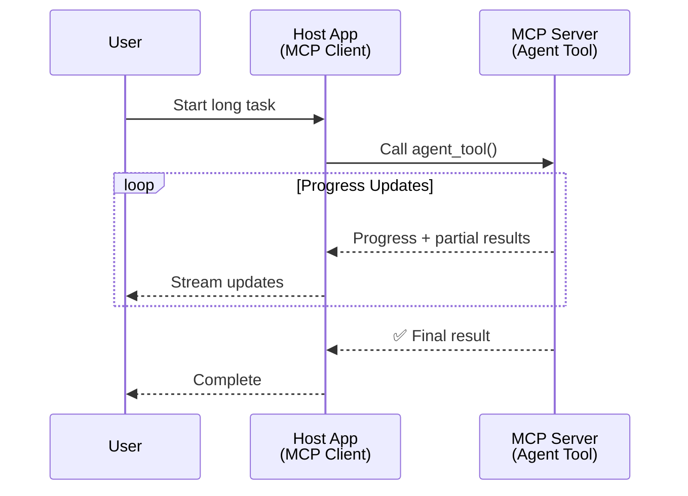
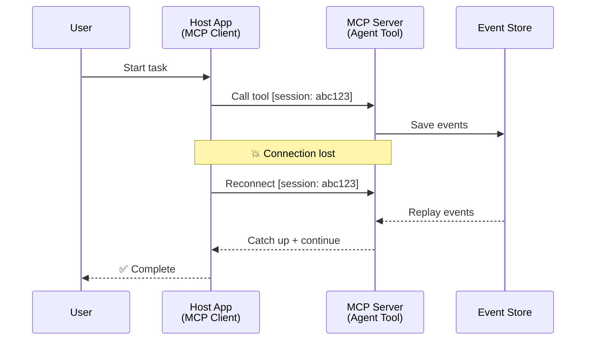
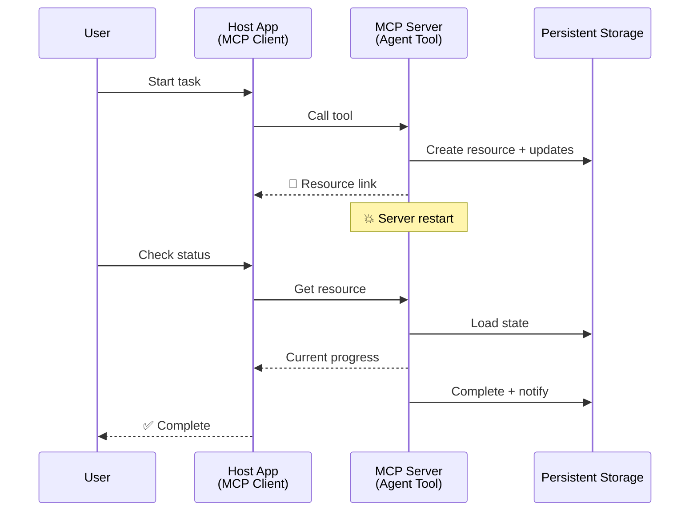
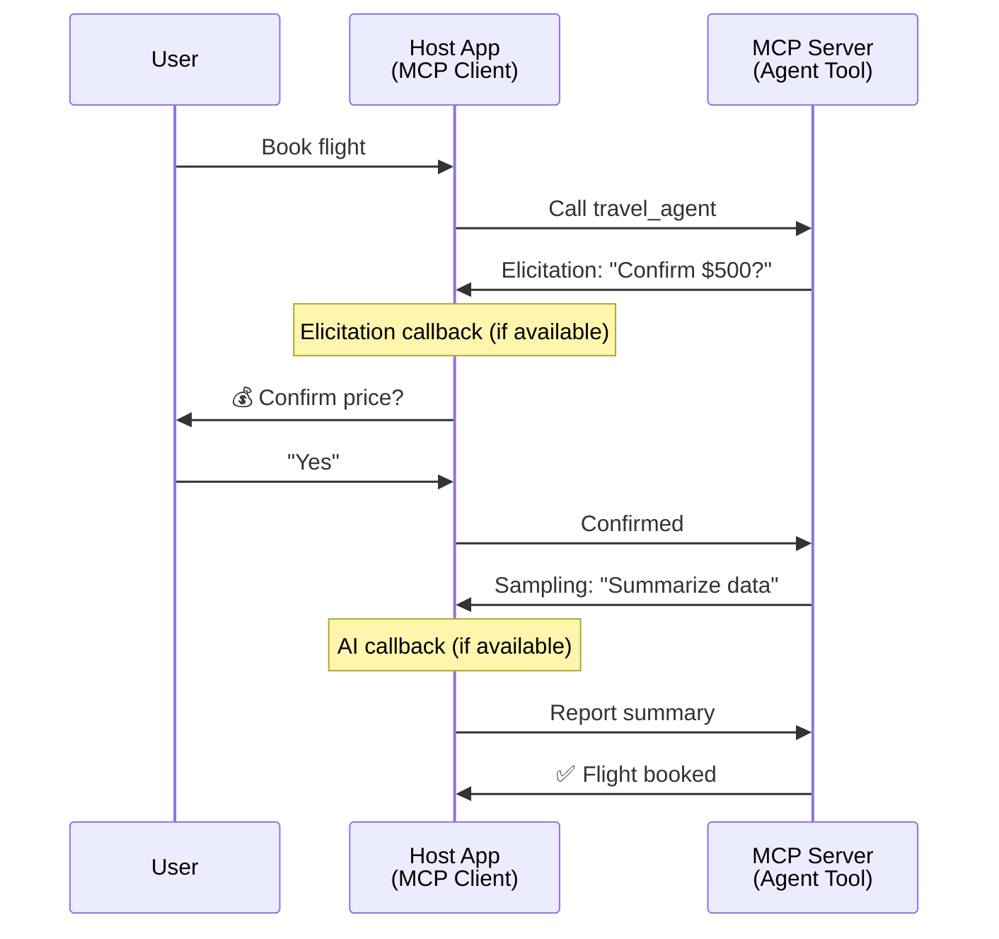
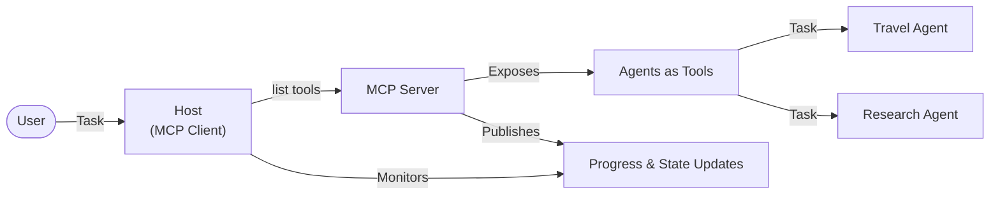

<!--
CO_OP_TRANSLATOR_METADATA:
{
  "original_hash": "5cc6836626047aa055e8960c8484a7d0",
  "translation_date": "2025-07-24T09:58:02+00:00",
  "source_file": "11-mcp/code_samples/mcp-agents/README.md",
  "language_code": "he"
}
-->
# בניית מערכות תקשורת בין סוכנים באמצעות MCP

> בקצרה - האם אפשר לבנות תקשורת בין סוכנים באמצעות MCP? כן!

MCP התפתח משמעותית מעבר למטרתו המקורית של "מתן הקשר ל-LLMs". עם שיפורים אחרונים כמו [זרמים ניתנים להמשכה](https://modelcontextprotocol.io/docs/concepts/transports#resumability-and-redelivery), [הזמנה](https://modelcontextprotocol.io/specification/2025-06-18/client/elicitation), [דגימה](https://modelcontextprotocol.io/specification/2025-06-18/client/sampling), והתראות ([התקדמות](https://modelcontextprotocol.io/specification/2025-06-18/basic/utilities/progress) ו-[משאבים](https://modelcontextprotocol.io/specification/2025-06-18/schema#resourceupdatednotification)), MCP מספק כיום תשתית חזקה לבניית מערכות תקשורת מורכבות בין סוכנים.

## תפיסת השגויה לגבי סוכן/כלי

ככל שיותר מפתחים חוקרים כלים עם התנהגות סוכנית (פועלים לאורך זמן ממושך, עשויים לדרוש קלט נוסף במהלך הביצוע וכו'), קיימת תפיסה שגויה ש-MCP אינו מתאים בעיקר משום שדוגמאות מוקדמות של הכלים שלו התמקדו בדפוסי בקשה-תגובה פשוטים.

תפיסה זו אינה עדכנית. מפרט MCP שודרג משמעותית בחודשים האחרונים עם יכולות שסוגרות את הפער לבניית התנהגות סוכנית ממושכת:

- **זרימה ותוצאות חלקיות**: עדכוני התקדמות בזמן אמת במהלך הביצוע
- **יכולת המשכיות**: לקוחות יכולים להתחבר מחדש ולהמשיך לאחר ניתוק
- **עמידות**: תוצאות שורדות הפעלה מחדש של השרת (לדוגמה, באמצעות קישורי משאבים)
- **רב-סבב**: קלט אינטראקטיבי במהלך הביצוע באמצעות הזמנה ודגימה

תכונות אלו ניתנות להרכבה כדי לאפשר יישומים סוכניים ומרובי סוכנים מורכבים, כולם מופעלים על פרוטוקול MCP.

לצורך הדיון, נתייחס לסוכן כ"כלי" הזמין בשרת MCP. הדבר מרמז על קיומה של אפליקציית מארח שמיישמת לקוח MCP שמקים סשן עם שרת MCP ויכול לקרוא לסוכן.

## מה הופך כלי MCP ל"סוכני"?

לפני שנצלול ליישום, נבהיר אילו יכולות תשתית נדרשות לתמיכה בסוכנים הפועלים לאורך זמן ממושך.

> נגדיר סוכן כישות שיכולה לפעול באופן עצמאי לאורך זמן ממושך, מסוגלת להתמודד עם משימות מורכבות שעשויות לדרוש אינטראקציות או התאמות מרובות בהתבסס על משוב בזמן אמת.

### 1. זרימה ותוצאות חלקיות

דפוסי בקשה-תגובה מסורתיים אינם מתאימים למשימות ממושכות. סוכנים צריכים לספק:

- עדכוני התקדמות בזמן אמת
- תוצאות ביניים

**תמיכה ב-MCP**: התראות עדכון משאבים מאפשרות זרימה של תוצאות חלקיות, אם כי הדבר דורש עיצוב זהיר כדי להימנע מקונפליקטים עם מודל הבקשה/תגובה של JSON-RPC.

| תכונה                     | מקרה שימוש                                                                                                                                                                       | תמיכה ב-MCP                                                                                 |
| -------------------------- | ------------------------------------------------------------------------------------------------------------------------------------------------------------------------------ | ------------------------------------------------------------------------------------------ |
| עדכוני התקדמות בזמן אמת   | משתמש מבקש משימת מיגרציה של בסיס קוד. הסוכן מזרים התקדמות: "10% - ניתוח תלות... 25% - המרת קבצי TypeScript... 50% - עדכון ייבואים..."                                        | ✅ התראות התקדמות                                                                           |
| תוצאות חלקיות             | משימת "יצירת ספר" מזרים תוצאות חלקיות, לדוגמה: 1) מתווה קשת הסיפור, 2) רשימת פרקים, 3) כל פרק כשהוא מושלם. המארח יכול לבדוק, לבטל או להפנות מחדש בכל שלב.                  | ✅ התראות ניתנות להרחבה כדי לכלול תוצאות חלקיות, ראו הצעות ב-PR 383, 776                   |

<div align="center" style="font-style: italic; font-size: 0.95em; margin-bottom: 0.5em;">
<strong>איור 1:</strong> תרשים זה ממחיש כיצד סוכן MCP מזרים עדכוני התקדמות בזמן אמת ותוצאות חלקיות לאפליקציית המארח במהלך משימה ממושכת, ומאפשר למשתמש לעקוב אחר הביצוע בזמן אמת.
</div>



### 2. יכולת המשכיות

סוכנים חייבים להתמודד עם הפרעות ברשת בצורה חלקה:

- התחברות מחדש לאחר ניתוק (לקוח)
- המשך מהמקום שבו הפסיקו (שליחת הודעות מחדש)

**תמיכה ב-MCP**: פרוטוקול StreamableHTTP של MCP תומך כיום בהמשכיות סשן ושליחת הודעות מחדש באמצעות מזהי סשן ומזהי אירועים אחרונים. חשוב לציין שהשרת חייב ליישם EventStore שמאפשר השמעת אירועים מחדש בעת התחברות מחדש של הלקוח.  
יש לציין כי קיימת הצעת קהילה (PR #975) שחוקרת זרמים ניתנים להמשכה שאינם תלויים בפרוטוקול.

| תכונה         | מקרה שימוש                                                                                                                                                   | תמיכה ב-MCP                                                                |
| ------------- | ---------------------------------------------------------------------------------------------------------------------------------------------------------- | -------------------------------------------------------------------------- |
| יכולת המשכיות | לקוח מתנתק במהלך משימה ממושכת. בעת התחברות מחדש, הסשן ממשיך עם אירועים שהוחמצו מושמעים מחדש, וממשיך בצורה חלקה מהמקום שבו הפסיק.                           | ✅ פרוטוקול StreamableHTTP עם מזהי סשן, השמעת אירועים ו-EventStore          |

<div align="center" style="font-style: italic; font-size: 0.95em; margin-bottom: 0.5em;">
<strong>איור 2:</strong> תרשים זה מציג כיצד פרוטוקול StreamableHTTP של MCP ו-EventStore מאפשרים המשכיות סשן בצורה חלקה: אם הלקוח מתנתק, הוא יכול להתחבר מחדש ולהשמיע אירועים שהוחמצו, ולהמשיך את המשימה ללא אובדן התקדמות.
</div>



### 3. עמידות

סוכנים הפועלים לאורך זמן זקוקים למצב מתמשך:

- תוצאות שורדות הפעלה מחדש של השרת
- ניתן לאחזר סטטוס מחוץ לסשן
- מעקב התקדמות בין סשנים

**תמיכה ב-MCP**: MCP תומך כיום בסוג החזרה של קישור משאבים לקריאות כלים. כיום, דפוס אפשרי הוא לעצב כלי שיוצר משאב ומחזיר מיד קישור משאב. הכלי יכול להמשיך לטפל במשימה ברקע ולעדכן את המשאב. בתורו, הלקוח יכול לבחור לבדוק את מצב המשאב כדי לקבל תוצאות חלקיות או מלאות (בהתבסס על עדכוני המשאב שהשרת מספק) או להירשם למשאב לקבלת התראות עדכון.

מגבלה אחת כאן היא שבדיקת משאבים או הרשמה לעדכונים יכולה לצרוך משאבים עם השלכות בקנה מידה גדול. קיימת הצעת קהילה פתוחה (כולל #992) שחוקרת את האפשרות לכלול webhooks או טריגרים שהשרת יכול לקרוא כדי להודיע ללקוח/אפליקציית המארח על עדכונים.

| תכונה       | מקרה שימוש                                                                                                                                        | תמיכה ב-MCP                                                        |
| ----------- | ----------------------------------------------------------------------------------------------------------------------------------------------- | ------------------------------------------------------------------ |
| עמידות      | השרת קורס במהלך משימת מיגרציה של נתונים. תוצאות והתקדמות שורדות הפעלה מחדש, הלקוח יכול לבדוק סטטוס ולהמשיך ממשאב מתמשך.                          | ✅ קישורי משאבים עם אחסון מתמשך והתראות סטטוס                      |

כיום, דפוס נפוץ הוא לעצב כלי שיוצר משאב ומחזיר מיד קישור משאב. הכלי יכול לטפל במשימה ברקע, להוציא התראות משאבים שמשמשות כעדכוני התקדמות או כוללות תוצאות חלקיות, ולעדכן את התוכן במשאב לפי הצורך.

<div align="center" style="font-style: italic; font-size: 0.95em; margin-bottom: 0.5em;">
<strong>איור 3:</strong> תרשים זה מדגים כיצד סוכני MCP משתמשים במשאבים מתמשכים ובהתראות סטטוס כדי להבטיח שמשימות ממושכות שורדות הפעלה מחדש של השרת, ומאפשרים ללקוחות לבדוק התקדמות ולאחזר תוצאות גם לאחר כשלונות.
</div>



### 4. אינטראקציות רב-סבביות

סוכנים לעיתים קרובות זקוקים לקלט נוסף במהלך הביצוע:

- הבהרה או אישור אנושי
- סיוע AI להחלטות מורכבות
- התאמת פרמטרים דינמית

**תמיכה ב-MCP**: נתמך באופן מלא באמצעות דגימה (לקלט AI) והזמנה (לקלט אנושי).

| תכונה                 | מקרה שימוש                                                                                                                                     | תמיכה ב-MCP                                           |
| --------------------- | -------------------------------------------------------------------------------------------------------------------------------------------- | ----------------------------------------------------- |
| אינטראקציות רב-סבביות | סוכן הזמנת נסיעות מבקש אישור מחיר מהמשתמש, ואז מבקש מ-AI לסכם נתוני נסיעות לפני השלמת העסקה.                                                | ✅ הזמנה לקלט אנושי, דגימה לקלט AI                   |

<div align="center" style="font-style: italic; font-size: 0.95em; margin-bottom: 0.5em;">
<strong>איור 4:</strong> תרשים זה מתאר כיצד סוכני MCP יכולים לבקש קלט אנושי באופן אינטראקטיבי או סיוע AI במהלך הביצוע, תומכים בתהליכי עבודה מורכבים ורב-סבביים כמו אישורים וקבלת החלטות דינמית.
</div>



## יישום סוכנים ממושכים על MCP - סקירת קוד

כחלק ממאמר זה, אנו מספקים [מאגר קוד](https://github.com/victordibia/ai-tutorials/tree/main/MCP%20Agents) שמכיל יישום מלא של סוכנים ממושכים באמצעות MCP Python SDK עם פרוטוקול StreamableHTTP להמשכיות סשן ושליחת הודעות מחדש. היישום מדגים כיצד ניתן להרכיב יכולות MCP כדי לאפשר התנהגויות סוכניות מתוחכמות.

באופן ספציפי, אנו מיישמים שרת עם שני כלים סוכניים עיקריים:

- **סוכן נסיעות** - מדמה שירות הזמנת נסיעות עם אישור מחיר באמצעות הזמנה
- **סוכן מחקר** - מבצע משימות מחקר עם סיכומים בסיוע AI באמצעות דגימה

שני הסוכנים מדגימים עדכוני התקדמות בזמן אמת, אישורים אינטראקטיביים, ויכולות המשכיות סשן מלאות.

### מושגי יישום מרכזיים

הקטעים הבאים מציגים יישום סוכן בצד השרת וטיפול מארח בצד הלקוח עבור כל יכולת:

#### זרימה ועדכוני התקדמות - סטטוס משימה בזמן אמת

זרימה מאפשרת לסוכנים לספק עדכוני התקדמות בזמן אמת במהלך משימות ממושכות, ולשמור את המשתמשים מעודכנים לגבי סטטוס המשימה ותוצאות ביניים.

**יישום שרת (הסוכן שולח התראות התקדמות):**

```python
# From server/server.py - Travel agent sending progress updates
for i, step in enumerate(steps):
    await ctx.session.send_progress_notification(
        progress_token=ctx.request_id,
        progress=i * 25,
        total=100,
        message=step,
        related_request_id=str(ctx.request_id)
    )
    await anyio.sleep(2)  # Simulate work

# Alternative: Log messages for detailed step-by-step updates
await ctx.session.send_log_message(
    level="info",
    data=f"Processing step {current_step}/{steps} ({progress_percent}%)",
    logger="long_running_agent",
    related_request_id=ctx.request_id,
)
```

**יישום לקוח (המארח מקבל עדכוני התקדמות):**

```python
# From client/client.py - Client handling real-time notifications
async def message_handler(message) -> None:
    if isinstance(message, types.ServerNotification):
        if isinstance(message.root, types.LoggingMessageNotification):
            console.print(f"📡 [dim]{message.root.params.data}[/dim]")
        elif isinstance(message.root, types.ProgressNotification):
            progress = message.root.params
            console.print(f"🔄 [yellow]{progress.message} ({progress.progress}/{progress.total})[/yellow]")

# Register message handler when creating session
async with ClientSession(
    read_stream, write_stream,
    message_handler=message_handler
) as session:
```

#### הזמנה - בקשת קלט משתמש

הזמנה מאפשרת לסוכנים לבקש קלט משתמש במהלך הביצוע. זה חיוני לאישורים, הבהרות או אישורים במהלך משימות ממושכות.

**יישום שרת (הסוכן מבקש אישור):**

```python
# From server/server.py - Travel agent requesting price confirmation
elicit_result = await ctx.session.elicit(
    message=f"Please confirm the estimated price of $1200 for your trip to {destination}",
    requestedSchema=PriceConfirmationSchema.model_json_schema(),
    related_request_id=ctx.request_id,
)

if elicit_result and elicit_result.action == "accept":
    # Continue with booking
    logger.info(f"User confirmed price: {elicit_result.content}")
elif elicit_result and elicit_result.action == "decline":
    # Cancel the booking
    booking_cancelled = True
```

**יישום לקוח (המארח מספק קריאת חזרה להזמנה):**

```python
# From client/client.py - Client handling elicitation requests
async def elicitation_callback(context, params):
    console.print(f"💬 Server is asking for confirmation:")
    console.print(f"   {params.message}")

    response = console.input("Do you accept? (y/n): ").strip().lower()

    if response in ['y', 'yes']:
        return types.ElicitResult(
            action="accept",
            content={"confirm": True, "notes": "Confirmed by user"}
        )
    else:
        return types.ElicitResult(
            action="decline",
            content={"confirm": False, "notes": "Declined by user"}
        )

# Register the callback when creating the session
async with ClientSession(
    read_stream, write_stream,
    elicitation_callback=elicitation_callback
) as session:
```

#### דגימה - בקשת סיוע AI

דגימה מאפשרת לסוכנים לבקש סיוע מ-LLM להחלטות מורכבות או יצירת תוכן במהלך הביצוע. זה מאפשר תהליכי עבודה משולבים אדם-AI.

**יישום שרת (הסוכן מבקש סיוע AI):**

```python
# From server/server.py - Research agent requesting AI summary
sampling_result = await ctx.session.create_message(
    messages=[
        SamplingMessage(
            role="user",
            content=TextContent(type="text", text=f"Please summarize the key findings for research on: {topic}")
        )
    ],
    max_tokens=100,
    related_request_id=ctx.request_id,
)

if sampling_result and sampling_result.content:
    if sampling_result.content.type == "text":
        sampling_summary = sampling_result.content.text
        logger.info(f"Received sampling summary: {sampling_summary}")
```

**יישום לקוח (המארח מספק קריאת חזרה לדגימה):**

```python
# From client/client.py - Client handling sampling requests
async def sampling_callback(context, params):
    message_text = params.messages[0].content.text if params.messages else 'No message'
    console.print(f"🧠 Server requested sampling: {message_text}")

    # In a real application, this could call an LLM API
    # For demo purposes, we provide a mock response
    mock_response = "Based on current research, MCP has evolved significantly..."

    return types.CreateMessageResult(
        role="assistant",
        content=types.TextContent(type="text", text=mock_response),
        model="interactive-client",
        stopReason="endTurn"
    )

# Register the callback when creating the session
async with ClientSession(
    read_stream, write_stream,
    sampling_callback=sampling_callback,
    elicitation_callback=elicitation_callback
) as session:
```

#### יכולת המשכיות - המשכיות סשן לאחר ניתוקים

יכולת המשכיות מבטיחה שמשימות סוכן ממושכות יכולות לשרוד ניתוקי לקוח ולהמשיך בצורה חלקה בעת התחברות מחדש. זה מיושם באמצעות EventStore ואסימוני המשכיות.

**יישום Event Store (השרת מחזיק מצב סשן):**

```python
# From server/event_store.py - Simple in-memory event store
class SimpleEventStore(EventStore):
    def __init__(self):
        self._events: list[tuple[StreamId, EventId, JSONRPCMessage]] = []
        self._event_id_counter = 0

    async def store_event(self, stream_id: StreamId, message: JSONRPCMessage) -> EventId:
        """Store an event and return its ID."""
        self._event_id_counter += 1
        event_id = str(self._event_id_counter)
        self._events.append((stream_id, event_id, message))
        return event_id

    async def replay_events_after(self, last_event_id: EventId, send_callback: EventCallback) -> StreamId | None:
        """Replay events after the specified ID for resumption."""
        # Find events after the last known event and replay them
        for _, event_id, message in self._events[start_index:]:
            await send_callback(EventMessage(message, event_id))

# From server/server.py - Passing event store to session manager
def create_server_app(event_store: Optional[EventStore] = None) -> Starlette:
    server = ResumableServer()

    # Create session manager with event store for resumption
    session_manager = StreamableHTTPSessionManager(
        app=server,
        event_store=event_store,  # Event store enables session resumption
        json_response=False,
        security_settings=security_settings,
    )

    return Starlette(routes=[Mount("/mcp", app=session_manager.handle_request)])

# Usage: Initialize with event store
event_store = SimpleEventStore()
app = create_server_app(event_store)
```

**מטא-נתונים לקוח עם אסימון המשכיות (הלקוח מתחבר מחדש באמצעות מצב מאוחסן):**

```python
# From client/client.py - Client resumption with metadata
if existing_tokens and existing_tokens.get("resumption_token"):
    # Use existing resumption token to continue where we left off
    metadata = ClientMessageMetadata(
        resumption_token=existing_tokens["resumption_token"],
    )
else:
    # Create callback to save resumption token when received
    def enhanced_callback(token: str):
        protocol_version = getattr(session, 'protocol_version', None)
        token_manager.save_tokens(session_id, token, protocol_version, command, args)

    metadata = ClientMessageMetadata(
        on_resumption_token_update=enhanced_callback,
    )

# Send request with resumption metadata
result = await session.send_request(
    types.ClientRequest(
        types.CallToolRequest(
            method="tools/call",
            params=types.CallToolRequestParams(name=command, arguments=args)
        )
    ),
    types.CallToolResult,
    metadata=metadata,
)
```

אפליקציית המארח שומרת מזהי סשן ואסימוני המשכיות באופן מקומי, ומאפשרת לה להתחבר מחדש לסשנים קיימים ללא אובדן התקדמות או מצב.

### ארגון קוד

<div align="center" style="font-style: italic; font-size: 0.95em; margin-bottom: 0.5em;">
<strong>איור 5:</strong> ארכיטקטורת מערכת סוכנים מבוססת MCP
</div>



**קבצים מרכזיים:**

- **`server/server.py`** - שרת MCP עם יכולת המשכיות, כולל סוכני נסיעות ומחקר המדגימים הזמנה, דגימה ועדכוני התקדמות
- **`client/client.py`** - אפליקציית מארח אינטראקטיבית עם תמיכה בהמשכיות, מטפלי קריאות חזרה וניהול אסימונים
- **`server/event_store.py`** - יישום Event Store המאפשר המשכיות סשן ושליחת הודעות מחדש

## הרחבה לתקשורת מרובת סוכנים על MCP

היישום לעיל ניתן להרחבה למערכות מרובות סוכנים על ידי שיפור האינטליגנציה והיקף של אפליקציית המארח:

- **פירוק משימות אינטליגנטי**: המארח מנתח בקשות משתמש מורכבות ומפרק אותן למשימות משנה עבור סוכנים מתמחים שונים
- **תיאום מרובה שרתים**: המארח שומר חיבורים למספר שרתי MCP, שכל אחד חושף יכולות סוכן שונות
- **ניהול מצב משימות**: המארח עוקב אחר התקדמות בין משימות סוכן מרובות במקביל, מטפל בתלות ובסדר
- **עמידות וניסיונות חוזרים**: המארח מנהל כשלונות, מיישם לוגיקת ניסיונות חוזרים ומפנה משימות מחדש כאשר סוכנים אינם זמינים
- **סינתזת תוצאות**: המארח משלב פלטים מסוכנים מרובים לתוצאות סופיות קוהרנטיות

המארח מתפתח מלקוח פשוט לאורקסטרטור אינטליגנטי, מתאם יכולות סוכן מבוזרות תוך שמירה על אותה תשתית פרוטוקול MCP.

## סיכום

היכולות המשופרות של MCP - התראות משאבים, הזמנה/דגימה, זרמים ניתנים להמשכה ומשאבים מתמשכים - מאפשרות אינטראקציות מורכבות בין סוכנים תוך שמירה על פשטות הפרוטוקול.

## התחלת עבודה

מוכנים לבנות מערכת agent2agent משלכם? בצעו את השלבים הבאים:

### 1. הריצו את הדמו

```bash
# Start the server with event store for resumption
python -m server.server --port 8006

# In another terminal, run the interactive client
python -m client.client --url http://127.0.0.1:8006/mcp
```

**פקודות זמינות במצב אינטראקטיבי:**

- `travel_agent` - הזמנת נסיעות עם אישור מחיר באמצעות הזמנה
- `research_agent` - מחקר נושאים עם סיכומים בסיוע AI באמצעות דגימה
- `list` - הצגת כל הכלים הזמינים
- `clean-tokens` - ניקוי אסימוני המשכיות
- `help` - הצגת עזרה מפורטת לפקודות
- `quit` - יציאה מהלקוח

### 2. בדקו יכולות המשכיות

- התחילו סוכן ממושך (לדוגמה, `travel_agent`)
- הפריעו ללקוח במהלך הביצוע (Ctrl+C)
- הפעילו מחדש את הלקוח - הוא ימשיך אוטומטית מהמקום שבו הפסיק

### 3. חקרו והרחיבו

- **חקרו את הדוגמאות**: עיינו ב-[mcp-agents](https://github.com/victordibia/ai-tutorials/tree/main/MCP%20Agents)
- **הצטרפו לקהילה**: השתתפו בדיונים על MCP ב-GitHub
- **נסו**: התחילו עם משימה ממושכת פשוטה והוסיפו בהדרגה זרימה, יכולת המשכיות ותיאום מרובה סוכנים

זה מדגים כיצד MCP מאפשר התנהגויות סוכנים אינטליגנטיות תוך שמירה על פשטות מבוססת כלים.

בסך הכל, מפרט פרוטוקול MCP מתפתח במהירות; מומלץ לקורא לעיין באתר התיעוד הרשמי לעדכונים האחרונים - https://modelcontextprotocol.io/introduction

**כתב ויתור**:  
מסמך זה תורגם באמצעות שירות תרגום מבוסס בינה מלאכותית [Co-op Translator](https://github.com/Azure/co-op-translator). למרות שאנו שואפים לדיוק, יש לקחת בחשבון שתרגומים אוטומטיים עשויים להכיל שגיאות או אי-דיוקים. המסמך המקורי בשפתו המקורית נחשב למקור הסמכותי. למידע קריטי, מומלץ להשתמש בתרגום מקצועי על ידי בני אדם. איננו נושאים באחריות לכל אי-הבנה או פרשנות שגויה הנובעת משימוש בתרגום זה.