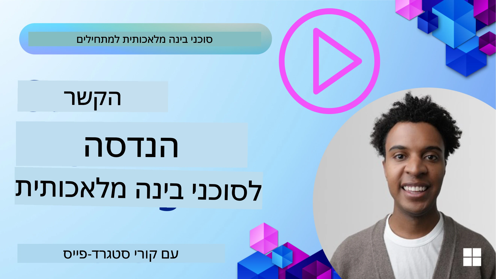
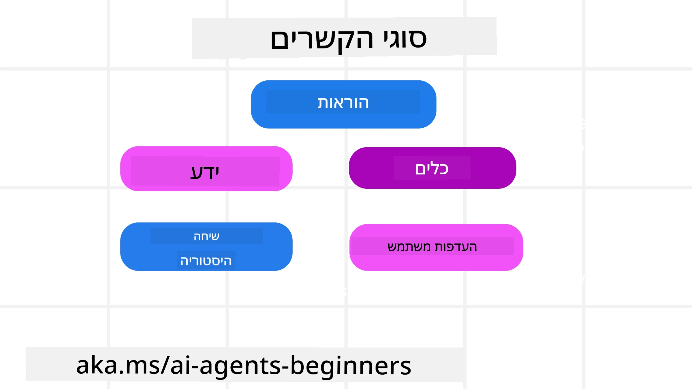
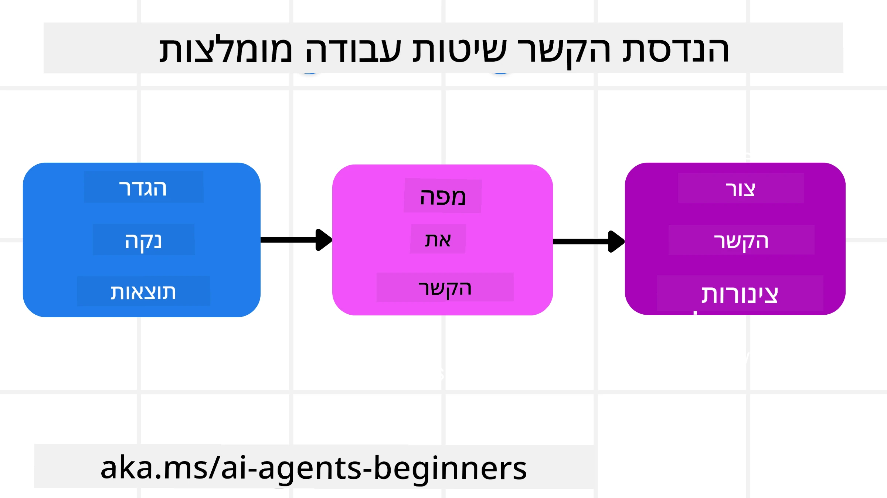

# הנדסת הקשר לסוכני בינה מלאכותית

> _(לחצו על התמונה למעלה לצפייה בסרטון השיעור)_

הבנת המורכבות של היישום שאתה בונה עבורו סוכן בינה מלאכותית חשובה להקמת סוכן אמין. עלינו לבנות סוכני בינה מלאכותית שמנהלים מידע בצורה אפקטיבית כדי לטפל בצרכים מורכבים שמעבר להנדסת פקודות.

בשיעור זה נבחן מהי הנדסת הקשר ותפקידה בבניית סוכני בינה מלאכותית.

## מבוא

בשיעור זה נכסה:

• **מהי הנדסת הקשר** ומדוע היא שונה מהנדסת פקודות.

• **אסטרטגיות להנדסת הקשר אפקטיבית**, כולל איך לכתוב, לבחור, לדחוס ולבודד מידע.

• **נפילות נפוצות בהקשר** שעלולות להביא לכישלון הסוכן ואיך לתקן אותן.

## מטרות הלמידה

בסיום שיעור זה תבין איך:

• **להגדיר הנדסת הקשר** ולהבחין בינה לבין הנדסת פקודות.

• **לזהות את רכיבי המפתח של הקשר** ביישומי מודלים לשוניים גדולים (LLM).

• **ליישם אסטרטגיות לכתיבה, בחירה, דחיסה ובידוד הקשר** לשיפור ביצועי הסוכן.

• **לזהות נפילות נפוצות בהקשר** כגון הרעלה, הסחה, בלבול והתנגחות, וליישם טכניקות הפחתה.

## מהי הנדסת הקשר?

עבור סוכני בינה מלאכותית, ההקשר הוא מה שמניע את תכנון הסוכן לפעול בצורה מסוימת. הנדסת הקשר היא התרגול לוודא שלסוכן יש את המידע הנכון כדי להשלים את השלב הבא במשימה. חלון ההקשר מוגבל בגודלו, ולכן כבוני סוכנים עלינו לבנות מערכות ותהליכים לניהול הוספה, הסרה ודחיסה של המידע בחלון ההקשר.

### הנדסת פקודות מול הנדסת הקשר

הנדסת פקודות מתמקדת בקבוצה סטטית בודדת של הוראות שמכוונות את הסוכנים עם סט של כללים. הנדסת הקשר עוסקת בניהול סט דינמי של מידע, כולל הפקודה הראשונית, כדי להבטיח שלסוכן יש את מה שהוא צריך לאורך זמן. הרעיון המרכזי בהנדסת הקשר הוא להפוך את התהליך הזה לחוזר ואמין.

### סוגי הקשר

חשוב לזכור שהקשר אינו דבר אחד בלבד. המידע שהסוכן צריך יכול לבוא ממספר מקורות שונים ואנחנו אחראים להבטיח שלסוכן תהיה גישה למקורות הללו:

סוגי ההקשר שסוכן עשוי לנהל כוללים:

• **הוראות:** אלו דומות ל"כללים" של הסוכן – פקודות, הודעות מערכת, דוגמאות מועטות (המחשת הדרך לבצע משהו), ותיאורים של כלים שניתן להשתמש בהם. כאן מתמזגים מוקד הנדסת הפקודות והנדסת הקשר.

• **ידע:** כולל עובדות, מידע שמושג מבסיסי נתונים, או זיכרונות ארוכי טווח שהסוכן צבר. זה כולל גם אינטגרציה של מערכת של הפקת ידע מוגברת (RAG) אם הסוכן זקוק לגישה למאגרי ידע שונים ובסיסי נתונים.

• **כלים:** אלו הם ההגדרות של פונקציות חיצוניות, API ושרתי MCP שהסוכן יכול לקרוא, יחד עם המשוב (התגובות) שהוא מקבל מהשימוש בהם.

• **היסטוריית שיחה:** הדיאלוג המתמשך עם המשתמש. ככל שהזמן עובר, שיחות אלו מתארכות ומסובכות יותר, מה שתופס מקום בחלון ההקשר.

• **העדפות משתמש:** מידע שנלמד על הטעמים והאנטי-טעמים של המשתמש לאורך זמן. ייתכן שמידע זה יאוחסן ויופעל בתהליכי קבלת החלטות מרכזיים כדי לסייע למשתמש.

## אסטרטגיות להנדסת הקשר אפקטיבית

### אסטרטגיות תכנון

הנדסת הקשר טובה מתחילה בתכנון טוב. להלן גישה שתעזור לך להתחיל לחשוב איך ליישם את מושג הנדסת הקשר:

1. **הגדר תוצאות ברורות** – יש להגדיר בבירור את תוצאות המשימות שהסוכנים יבצעו. השב על השאלה – "איך העולם ייראה כאשר הסוכן יסיים את המשימה?" במילים אחרות, מה השינוי, המידע או התגובה שהמשתמש יקבל לאחר האינטראקציה עם הסוכן.
2. **מפה את ההקשר** – לאחר שהגדרת את תוצאות הסוכן, עליך לענות על השאלה "איזה מידע הסוכן צריך כדי להשלים את המשימה?". כך תוכל להתחיל למפות את ההקשר היכן שנמצא המידע.
3. **צור צינורות הקשר** – עכשיו כשאתה יודע איפה נמצא המידע, אתה צריך לענות על השאלה "איך הסוכן יקבל את המידע הזה?". ניתן לעשות זאת בדרכים שונות כולל RAG, שימוש בשרתי MCP וכלים אחרים.

### אסטרטגיות מעשיות

התכנון חשוב אבל ברגע שהמידע מתחיל להיכנס לחלון ההקשר של הסוכן, עלינו להיות בעלי אסטרטגיות מעשיות לניהולו:

#### ניהול הקשר

בעוד שחלק מהמידע יתווסף אוטומטית לחלון ההקשר, הנדסת הקשר עוסקת בעתיחת תפקיד פעיל יותר במידע זה, וזה יכול להתבצע בכמה אסטרטגיות:

1. **פנקס פתקים של הסוכן**  
   מאפשר לסוכן תיעוד של מידע רלוונטי על המשימות הנוכחיות ואינטראקציות עם המשתמש במהלך מושב יחיד. פנקס זה קיים מחוץ לחלון ההקשר בקובץ או באובייקט ריצה שהסוכן יכול לשלוף במידת הצורך במהלך המושב.

2. **זיכרונות**  
   פנקסים טובים לניהול מידע מחוץ לחלון ההקשר של מושב יחיד. זיכרונות מאפשרים לסוכנים לאחסן ולשלוף מידע רלוונטי לאורך מושבים מרובים. זה יכול לכלול סיכומים, העדפות משתמש ומשוב לשיפורים בעתיד.

3. **דחיסת הקשר**  
   כאשר חלון ההקשר גדל ומתקרב למגבלה שלו, ניתן להשתמש בטכניקות כמו סיכום והקטנה. זה כולל שמירה רק על המידע הרלוונטי ביותר או הסרה של הודעות ישנות.

4. **מערכות מולטי-סוכנים**  
   פיתוח מערכות משתפות של סוכנים מהווה צורה של הנדסת הקשר כי לכל סוכן יש את חלון ההקשר שלו. כיצד ההקשר הזה משותף ומועבר לסוכנים השונים הוא נושא לתכנון בבניית מערכות כאלה.

5. **סביבות סנדבוקס**  
   אם סוכן צריך להריץ קוד או לעבד כמויות גדולות של מידע במסמך, זה עלול לדרוש הרבה טוקנים לעיבוד התוצאות. במקום לאחסן זאת כולו בחלון ההקשר, הסוכן יכול להשתמש בסביבת סנדבוקס שמסוגלת להריץ את הקוד ולקרוא רק את התוצאות ומידע רלוונטי אחר.

6. **אובייקטים במצב ריצה**  
   נעשה זאת באמצעות יצירת מכולות מידע לניהול מצבים כאשר הסוכן צריך גישה למידע מסוים. למשימה מורכבת, זה יאפשר לסוכן לאחסן את תוצאות כל שלב משנה בצורה מדורגת, ובכך לשמור שההקשר יתמקד רק במשימה המשנית הספציפית.

#### בדיקת ההקשר

לאחר יישום אחת מהאסטרטגיות הללו, כדאי לבדוק מה הקריאה הבאה למודל אכן קיבלה. שאלה יעילה לדיבוג היא:

> האם הסוכן טען יותר מדי הקשר, הקשר שגוי, או חסר הקשר שהיה צריך?

אין צורך לתעד פקודות גולמיות, פלטי כלים, או תוכן זיכרון כדי לענות על שאלה זו. בסביבת ייצור, עדיף להעדיף רשומות בדיקת הקשר קטנות שכוללות ספירות, מזהים, פקדים ותוויות מדיניות:

- **בחירה:** עקוב כמה חתיכות מועמדות, כלים או זיכרונות נשקלו, כמה נבחרו, ואיזה כלל או ניקוד גרמו לסינון השאר.
- **דחיסה:** תעד טווח המקור או מזהה מעקב, מזהה סיכום, הערכת כמות טוקנים לפני ואחרי הדחיסה, והאם תוכן גולמי אינו כלול בקריאה הבאה.
- **בודדות:** שים לב איזו משימה משנה רצה בסוכן, מושב או סנדבוקס נפרד, איזו סיכום מוגבל הוחזר, והאם פלט כלי גדול נשאר מחוץ להקשר הסוכן הראשי.
- **זיכרון ו-RAG:** אחסן מזהי מסמכי שליפה, מזהי זיכרון, ניקודים, מזהים נבחרים, ומצב עריכה במקום טקסט מלא שנשלף.
- **בטיחות ופרטיות:** העדף פקדים, מזהים, דליי טוקנים ותוויות מדיניות על פני טקסט פקודה רגיש, ארגומנטים של כלים, תוצאות כלים או תוכן זיכרון משתמש.

המטרה היא לא לשמור יותר מדי הקשר. המטרה היא להשאיר מספיק ראיות שמפתח יוכל לדעת איזו אסטרטגיית הקשר פעלה והאם היא שינתה את הקריאה הבאה למודל בדרך הרצויה.

### דוגמה להנדסת הקשר

נאמר שאתה רוצה שסוכן בינה מלאכותית **"יזמין לי טיול לפריז."**

• סוכן פשוט המשתמש רק בהנדסת פקודות עשוי פשוט להגיב: **"בסדר, מתי תרצה לנסוע לפריז?"** הוא רק עיבד את שאלתך הישירה ברגע שהמשתמש שאל.

• סוכן המשתמש באסטרטגיות הנדסת הקשר שנלמדו יעשה הרבה יותר. לפני התגובה עצמה, המערכת שלו עשויה:

  ◦ **לבחון את היומן שלך** עבור תאריכים פנויים (שליפה בזמן אמת).

 ◦ **לזכור העדפות נסיעות קודמות** (מזיכרון ארוך טווח) כמו חברת תעופה מועדפת, תקציב, או האם אתה מעדיף טיסות ישירות.

 ◦ **לאתר כלים זמינים** להזמנת טיסות ובתי מלון.

- אז תגובה לדוגמה יכולה להיות: "היי [שמך]! אני רואה שאתה פנוי בשבוע הראשון של אוקטובר. להסתכל אחר טיסות ישירות לפריז על [חברת תעופה מועדפת] במסגרת התקציב הרגיל שלך של [תקציב]?". תגובה עשירה ומודעת הקשר זו מדגימה את כוח הנדסת הקשר.

## נפילות נפוצות בהקשר

### הרעלה של הקשר

**מהי:** כאשר הזיה (מידע שגוי שנוצר על ידי ה-LLM) או שגיאה נכנסות להקשר ומוזכרות שוב ושוב, מה שגורם לסוכן לרדוף אחרי מטרות בלתי אפשריות או לפתח אסטרטגיות חסרות היגיון.

**מה לעשות:** יש ליישם **אימות הקשר** ו**בידוד**. לאמת מידע לפני הוספתו לזיכרון ארוך טווח. אם מתגלה הרעלה אפשרית, יש להתחיל חוטי הקשר חדשים כדי למנוע הפצת מידע שגוי.

**דוגמה להזמנת טיסות:** הסוכן שלך מדמיין **טיסה ישירה מנמל תעופה מקומי קטן לעיר בינלאומית רחוקה** שאינה מציעה טיסות בינלאומיות בפועל. פרט זה לא קיים נשמר בהקשר. לאחר מכן, כשאתה מבקש להזמין, הסוכן ממשיך לנסות למצוא כרטיסים לנתיב בלתי אפשרי זה, מה שגורם לשגיאות חוזרות.

**פתרון:** יש ליישם שלב שבה **מאמתים את קיום הטיסה והמסלולים עם API בר-זמן לפני הוספת הפרט להקשר הפועל של הסוכן**. אם האימות נכשל, המידע השגוי "מבודד" ואינו בשימוש נוסף.

### הסחת ההקשר

**מהי:** כאשר ההקשר נעשה כל כך גדול שהמודל מתמקד יותר מדי בהיסטוריית הצטברות במקום להשתמש במה שלמד במהלך האימון, מה שמוביל לפעולות חוזרות או לא מועילות. המודלים עלולים להתחיל לעשות טעויות אף לפני שחלו ההקשר מלא.

**מה לעשות:** השתמש ב**סיכום הקשר**. מעת לעת דחוס את המידע המצטבר לסיכומים קצרים, שומר על פרטים חשובים ומסיר היסטוריה מיותרת. זה עוזר "לאפס" את המיקוד.

**דוגמה להזמנת טיסות:** דיברת זמן רב על יעדי חלום שונים, כולל תיאור מפורט של טיול תרמילאות שעשית לפני שנתיים. כשאתה סוף סוף מבקש **"תמצא לי טיסה זולה ל** **חודש הבא****,"** הסוכן מותש מפרטים ישנים ולא רלוונטיים ושואל שוב ושוב על ציוד התרמילאות או מסלולי עבר, ומתעלם מבקשתך הנוכחית.

**פתרון:** לאחר מספר סבבים או כשההקשר גדל מדי, על הסוכן **לסכם את החלקים האחרונים והרלוונטיים ביותר של השיחה** – להתמקד בתאריכי הנסיעה הנוכחיים וביעד – ולהשתמש בסיכום הדחוס הקריאה הבאה ל-LLM, תוך סילוק צ'אטים היסטוריים פחות רלוונטיים.

### בלבול בהקשר

**מהי:** כאשר הקשר לא נחוץ, לרוב בצורת כלי רבים זמינים, גורם למודל לייצר תגובות לא טובות או לקרוא כלים לא רלוונטיים. דגמים קטנים עלולים להיות רגישים לכך במיוחד.

**מה לעשות:** יש ליישם **ניהול טען-כלים** באמצעות טכניקות RAG. אחסן תיאורי כלים במאגר וקטורים ובחר _רק_ את הכלים הרלוונטיים ביותר לכל משימה ספציפית. מחקרים מראים שיש להגביל בחירת כלים לפחות מ-30.

**דוגמה להזמנת טיסות:** לסוכן שלך יש גישה לעשרות כלים: `book_flight`, `book_hotel`, `rent_car`, `find_tours`, `currency_converter`, `weather_forecast`, `restaurant_reservations` וכו'. אתה שואל, **"מהי הדרך הטובה ביותר להתנייד בפריז?"** עקב ריבוי הכלים, הסוכן מתבלבל ומנסה לקרוא `book_flight` _בתוך_ פריז, או `rent_car` אף על פי שאתה מעדיף תחבורה ציבורית, משום שתיאורי הכלים חופפים או שהוא פשוט אינו מבחין בין הטוב ביותר.

**פתרון:** השתמש ב**RAG על תיאורי הכלים**. כשאתה שואל על התנועה בפריז, המערכת מושכת דינמית _רק_ את הכלים הרלוונטיים כמו `rent_car` או `public_transport_info` על סמך השאילתה שלך, ומציגה "עומס" ממוקד של כלים ל-LLM.

### התנגשות בהקשר

**מהי:** כאשר מידע סותר קיים בהקשר, מה שגורם לטיעון לא עקבי או לתגובות סופיות גרועות. זה קורה לעיתים כשהמידע מגיע בשלבים, והנחות מוקדמות וטעויות נשארות בהקשר.

**מה לעשות:** השתמש ב**גיזום הקשר** ו**העברה חיצונית**. גיזום פירושו הסרת מידע מיושן או סותר כאשר פרטים חדשים מתקבלים. העברה חיצונית נותנת למודל סביבת "פנקס פתקים" נפרדת לעיבוד מידע מבלי להעמיס על ההקשר הראשי.
**דוגמת הזמנת טיסה:** בתחילה אתה אומר לסוכן שלך, **"אני רוצה לטוס במחלקת תיירים."** מאוחר יותר בשיחה, אתה משנה את דעתך ואומר, **"בעצם, לטיול הזה, בוא נלך במחלקת עסקים."** אם שני ההוראות הללו נשארות בהקשר, הסוכן עלול לקבל תוצאות חיפוש סותרות או להתבלבל לגבי העדפה שיש לתת לה עדיפות.

**פתרון:** יישום **גיזום הקשר**. כאשר הוראה חדשה סותרת הוראה ישנה, ההוראה הישנה מוסרת או מוזנת בהקשר במפורש כמיועדת להתחלף. חלופה נוספת היא שהסוכן יוכל להשתמש ב**מחברת עבודה** כדי ליישב את העדפות הסותרות לפני קבלת החלטה, מה שמבטיח שרק ההוראה הסופית והעקבית תנחה את פעולותיו.

## יש לך עוד שאלות על הנדסת הקשר?

הצטרף אל [Microsoft Foundry Discord](https://aka.ms/ai-agents/discord) כדי להיפגש עם לומדים אחרים, להשתתף בשעות קבלה ולקבל מענה על שאלות בנוגע לסוכני AI.

---

<!-- CO-OP TRANSLATOR DISCLAIMER START -->
**כתב ויתור**:
מסמך זה תורגם באמצעות שירות תרגום אוטומטי [Co-op Translator](https://github.com/Azure/co-op-translator). למרות שאנו שואפים לדיוק, יש לקחת בחשבון שתרגומים אוטומטיים עלולים להכיל שגיאות או אי-דיוקים. יש להחשיב את המסמך המקורי בשפתו הטבעית כמקור הסמכות. למידע קריטי מומלץ להשתמש בתרגום מקצועי על ידי מתרגם אדם. אנו לא אחראים לכל אי-הבנה או פירוש שגוי הנובע מהשימוש בתרגום זה.
<!-- CO-OP TRANSLATOR DISCLAIMER END -->