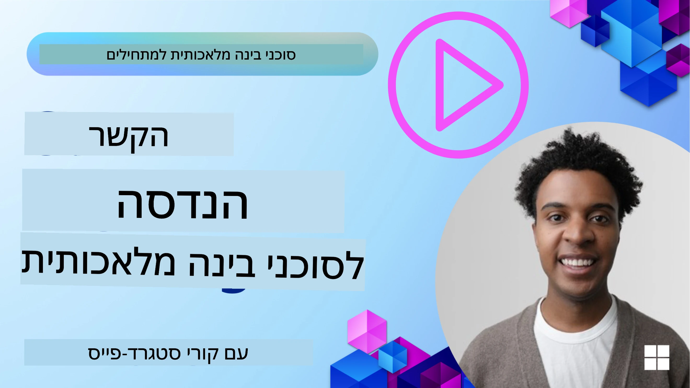
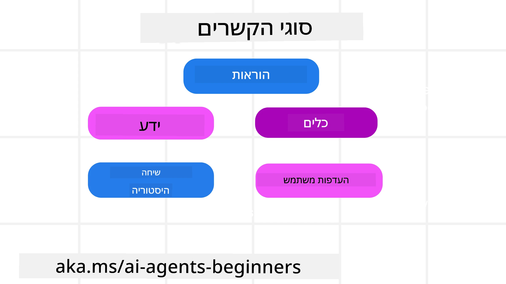
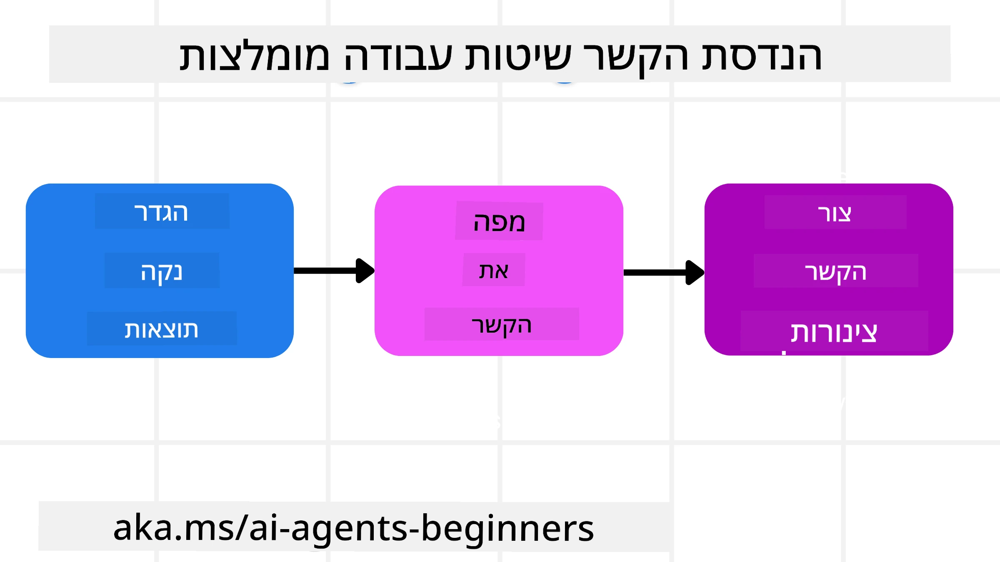

# הנדסת הקשר לסוכני בינה מלאכותית

> _(לחצו על התמונה למעלה לצפייה בסרטון של השיעור)_

הבנת המורכבות של האפליקציה שאתה בונה עבורה סוכן בינה מלאכותית חשובה ליצירת סוכן מהימן. עלינו לבנות סוכני בינה מלאכותית שמנהלים מידע ביעילות כדי לטפל בצרכים מורכבים מעבר להנדסת הפקודות.

בשיעור זה נבחן מהי הנדסת הקשר ומה תפקידה בבניית סוכני בינה מלאכותית.

## מבוא

שיעור זה יכסה:

• **מהי הנדסת הקשר** ומדוע היא שונה מהנדסת פקודות.

• **אסטרטגיות להנדסת הקשר יעילה**, כולל כיצד לכתוב, לבחור, לדחוס ולהפריד מידע.

• **כישלונות נפוצים בהקשר** שעלולים לסכל את הסוכן וכיצד לתקן אותם.

## מטרות הלמידה

לאחר השלמת שיעור זה, תדע כיצד:

• **להגדיר הנדסת הקשר** ולהבדיל אותה מהנדסת פקודות.

• **לזהות את הרכיבים המרכזיים של ההקשר** ביישומים מבוססי מודל שפה גדול (LLM).

• **ליישם אסטרטגיות לכתיבה, בחירה, דחיסה והפרדה של ההקשר** לשיפור ביצועי הסוכן.

• **להכיר כישלונות נפוצים בהקשר** כמו הרעלה, הסחת דעת, בלבול והתנגשות, וליישם שיטות הפחתה.

## מהי הנדסת הקשר?

עבור סוכני בינה מלאכותית, ההקשר הוא מה שמניע את תכנון הסוכן לנקוט פעולות מסוימות. הנדסת הקשר היא התרגול לוודא לסוכן בינה מלאכותית יש את המידע הנכון להשלמת הצעד הבא במשימה. חלון ההקשר מוגבל בגודלו, ולכן כבוני סוכנים עלינו לבנות מערכות ותהליכים לניהול הוספה, הסרה ודחיסת המידע בחלון ההקשר.

### הנדסת פקודות מול הנדסת הקשר

הנדסת פקודות מתמקדת בקבוצת הוראות סטטיות להתוויית סוכני הבינה עם סט כללים. הנדסת הקשר עוסקת בניהול סט דינמי של מידע, כולל הפקודה הראשונית, כדי להבטיח שלסוכן יש את מה שהוא צריך לאורך זמן. הרעיון המרכזי בהנדסת הקשר הוא להפוך את התהליך לחוזר ואמין.

### סוגי הקשר

חשוב לזכור שההקשר אינו דבר אחד בלבד. המידע שהסוכן זקוק לו יכול להגיע ממגוון מקורות שונים ואנחנו האחראים לוודא שהסוכן יוכל לגשת אליהם:

סוגי ההקשר שסוכן בינה מלאכותית עשוי לנהל כוללים:

• **הוראות:** אלה כמו "הכללים" של הסוכן – פקודות, הודעות מערכת, דוגמאות מועטות (מציגות לסוכן איך לבצע משהו) ותיאורי כלים שהוא יכול להשתמש בהם. כאן מתמזגים תחום הנדסת הפקודות עם הנדסת ההקשר.

• **ידע:** זה כולל עובדות, מידע שנשלף ממאגרי נתונים, או זיכרונות ארוכי טווח שהסוכן צבר. זה כולל אינטגרציה של מערכת Retrieval Augmented Generation (RAG) אם הסוכן זקוק לגישה למאגרים ומסדי נתונים שונים.

• **כלים:** אלה ההגדרות של פונקציות חיצוניות, APIs ושרתי MCP שהסוכן יכול לקרוא להם, יחד עם המשוב (תוצאות) שהוא מקבל משימוש בהם.

• **היסטוריית שיחה:** הדיאלוג המתמשך עם המשתמש. עם הזמן, שיחות אלו נהיות ארוכות ומורכבות יותר, מה שאמורה לתפוס מקום בחלון ההקשר.

• **העדפות משתמש:** מידע שלמדנו על טעמיו והעדפותיו של המשתמש לאורך זמן. מידע זה יכול להיות מאוחסן ולהיקרא בעת קבלת החלטות חשובות כדי לסייע למשתמש.

## אסטרטגיות להנדסת הקשר יעילה

### אסטרטגיות תכנון

הנדסת הקשר טובה מתחילה בתכנון טוב. להלן גישה שתעזור לכם להתחיל לחשוב כיצד ליישם את רעיון הנדסת ההקשר:

1. **הגדר תוצאות ברורות** - יש להגדיר בבירור את התוצאות של המשימות שיוקצו לסוכני הבינה. השיבו לשאלה - "איך ייראה העולם כאשר הסוכן יסיים את משימתו?" במילים אחרות, איזה שינוי, מידע או תגובה המשתמש צריך לקבל לאחר האינטראקציה עם הסוכן.
2. **מפה את ההקשר** - לאחר שהגדרת את תוצאות הסוכן, עליך לענות על השאלה "איזה מידע הסוכן צריך כדי להשלים את המשימה?" כך תוכל להתחיל למפות היכן ניתן למצוא את המידע הזה.
3. **צור צינורות הקשר** - כעת כשאתה יודע היכן המידע נמצא, עליך לענות על השאלה "איך הסוכן יקבל את המידע הזה?" ניתן לעשות זאת בדרכים שונות, כולל RAG, שימוש בשרתי MCP וכלים נוספים.

### אסטרטגיות מעשיות

התכנון חשוב, אך כאשר המידע מתחיל לזרום לחלון ההקשר של הסוכן, עלינו אסטרטגיות מעשיות לניהלו:

#### ניהול הקשר

בעוד שחלק מהמידע יתווסף אוטומטית לחלון ההקשר, הנדסת הקשר מתמקדת בליטול תפקיד פעיל יותר בניהול המידע הזה, שניתן לעשות זאת באמצעות מספר אסטרטגיות:

 1. **פנקס סוכן**
 מאפשר לסוכן בינה מלאכותית לרשום הערות על מידע רלוונטי בנוגע למשימות הנוכחיות ואינטראקציות עם המשתמש במהלך סשן אחד. הפנקס צריך להתקיים מחוץ לחלון ההקשר בקובץ או באובייקט ריצה שהסוכן יכול לשלוף בהמשך תוך כדי הסשן במידת הצורך.

 2. **זיכרונות**
 פנקסים טובים לניהול מידע מחוץ לחלון ההקשר בסשן יחיד. זיכרונות מאפשרים לסוכנים לאחסן ולשלוף מידע רלוונטי במהלך סשנים מרובים. זה יכול לכלול סיכומים, העדפות משתמש ומשוב לשיפורים בעתיד.

 3. **דחיסת הקשר**
  כאשר חלון ההקשר גדל ומתקרב לגודלו המקסימלי, ניתן להשתמש בטכניקות כמו סיכום ועיבוי. זה כולל שמירה רק על המידע הרלוונטי ביותר או הסרת הודעות ישנות.
  
 4. **מערכות רב-סוכנים**
  פיתוח מערכות רב-סוכנים הוא סוג של הנדסת הקשר כי לכל סוכן יש את חלון ההקשר שלו. כיצד ההקשר הזה משותף ומועבר בין סוכנים שונים הוא דבר נוסף שיש לתכנן בבניית מערכות אלו.
  
 5. **סביבות סנדבוקס**
  אם לסוכן יש צורך להריץ קוד או לעבד כמויות גדולות של מידע במסמך, זה עלול לעלות בכמות רבה של טוקנים לעיבוד התוצאות. במקום לאחסן את כל זה בחלון ההקשר, הסוכן יכול להשתמש בסביבת סנדבוקס שיכולה להריץ את הקוד ולקרוא רק את התוצאות ומידע רלוונטי נוסף.
  
 6. **אובייקטי מצב ריצה**
   זה נעשה באמצעות יצירת מכולות מידע לניהול מצבים שבהם הסוכן צריך גישה למידע מסוים. במשימה מורכבת, זה אפשרי לאפשר לסוכן לאחסן את התוצאות של כל תת-משימה שלב אחר שלב, כך שההקשר יישאר מחובר רק לאותה תת-משימה ספציפית.

#### בדיקת ההקשר

לאחר יישום אחת מהאסטרטגיות הללו, כדאי לבדוק מה בדיוק קיבל הקריאה הבאה למודל. שאלה שימושית לניפוי שגיאות היא:

> האם הסוכן טען יותר מדי הקשר, הקשר שגוי, או פספס הקשר שהיה צריך?

אין צורך ללוג פקודות גולמיות, פלטים של כלים או תוכן זיכרונות כדי לענות על השאלה הזו. בייצור, העדיפו רשומות בדיקת הקשר קטנות שמכילות ספירות, מזהים, חשיש ותוויות מדיניות:

- **בחירה:** עקבו אחר כמה חתיכות מועמדות, כלים או זיכרונות נשקלו, כמה נבחרו, ואיזו כלל או ציון גרם לסינון האחרים.
- **דחיסה:** רשמו את טווח המקור או מזהה המעקב, מזהה הסיכום, מספר משוער של טוקנים לפני ואחרי הדחיסה, והאם התוכן הגולמי הוצא מהקריאה הבאה.
- **הפרדה:** ציינו איזו תת-משימה רצה בסוכן נפרד, סשן או סנדבוקס, איזה סיכום חבול הוחזר, והאם פלט כלים גדול נשאר מחוץ להקשר של הסוכן הראשי.
- **זיכרון ו-RAG:** שמרו מזהי מסמכים שנשלפו, מזהי זיכרון, ציונים, מזהים שנבחרו, ומצב עריכה במקום טקסט שלם שנשלף.
- **בטיחות ופרטיות:** העדיפו חשישים, מזהים, דליי טוקנים ותוויות מדיניות על פני טקסט פקודה רגיש, אגרומנטים של כלים, תוצאות כלים או גופי זיכרונות משתמש.

המטרה אינה לשמור יותר הקשר. היא להשאיר מספיק הוכחות כך שמפתח יוכל לזהות איזו אסטרטגיית הקשר הופעלה והאם היא שינתה את הקריאה הבאה למודל באופן המתוכנן.

### דוגמה להנדסת הקשר

נגיד שאנחנו רוצים שסוכן בינה מלאכותית **"יקום לי טיול לפריז."**

• סוכן פשוט המשתמש רק בהנדסת פקודות עשוי להגיב: **"בסדר, מתי תרצה לטוס לפריז?"** הוא רק עיבד את שאלתך הישירה בזמן שהמשתמש שאל.

• סוכן שמשתמש באסטרטגיות הנדסת הקשר שהוצגו יעשה הרבה יותר. לפני התגובה, המערכת שלו עשויה:

  ◦ **לבחון את היומן שלך** לתאריכים פנויים (שליפת נתונים בזמן אמת).

 ◦ **לזכור העדפות טיול קודמות** (מזיכרון ארוך טווח) כמו חברת התעופה המועדפת, תקציב, או אם אתה מעדיף טיסות ישירות.

 ◦ **לזהות כלים זמינים** להזמנת טיסות ובתי מלון.

- אז, תגובה לדוגמה יכולה להיות: "היי [שמך]! אני רואה שאתה פנוי בשבוע הראשון של אוקטובר. רוצה שאחפש טיסות ישירות לפריז עם [חברת התעופה המועדפת] במסגרת התקציב הרגיל שלך של [תקציב]?" תגובה עשירה ומודעת הקשר זו ממחישה את כוח הנדסת ההקשר.

## כישלונות נפוצים בהקשר

### הרעלת הקשר

**מה זה:** כאשר הזיהוי השגוי (מידע שגוי שנוצר על ידי ה-LLM) או שגיאה נכנסים להקשר ומוזכרים שוב ושוב, דבר הגורם לסוכן לשאוף למטרות בלתי אפשריות או לפתח אסטרטגיות חסרות היגיון.

**מה לעשות:** יש ליישם **אימות הקשר** ו**בידוד**. אימות המידע לפני הוספתו לזיכרון ארוך טווח. אם מזוהה הרעלה אפשרית, יש להתחיל שרשורי הקשר חדשים כדי למנוע הפצת מידע רע.

**דוגמה להזמנת טיולים:** הסוכן שלך מדמיין טיסה ישירה מגרש תעופה קטן מקומי לעיר בינלאומית רחוקה שלמעשה אינה מציעה טיסות בינלאומיות. פרטי הטיסה הלא קיימים האלה נשמרים בהקשר. לאחר מכן, כשאתה מבקש מהסוכן להזמין טיסה, הוא ממשיך לנסות למצוא כרטיסים לנתיב בלתי אפשרי זה, מה שמוביל לשגיאות חוזרות.

**פתרון:** יש ליישם שלב של **אימות קיומה ונתיבי הטיסה עם API בזמן אמת** _לפני_ הוספת פרטי הטיסה להקשר העבודה של הסוכן. אם האימות נכשל, המידע השגוי "מבודד" ואינו משומש הלאה.

### הסחת דעת בהקשר

**מה זה:** כאשר ההקשר הופך לגדול כל כך שהמודל מתמקד מדי בהיסטוריה שנאגרה במקום להשתמש במה שלמד באימון, מה שמוביל לפעולות חוזרות או לא מועילות. מודלים עלולים להתחיל לעשות טעויות אף לפני שחלון ההקשר מלא.

**מה לעשות:** השתמשו ב**סיכום הקשר**. מדי תקופה דחסו מידע מצטבר לסיכומים קצרים, שמרו פרטים חשובים והסירו היסטוריה מיותרת. זה עוזר ל"לאפס" את המיקוד.

**דוגמה להזמנת טיולים:** דיברתם במשך זמן רב על יעדים שונים בטיול החלומות, כולל תיאור מפורט של מסע הגיבוש שלך מלפני שנתיים. כשביקשת בסופו של דבר **"מצא לי טיסה זולה לחודש הבא"**, הסוכן תקוע בפרטים ישנים ולא רלוונטיים וממשיך לשאול על ציוד הגיבוש או מסלולים ישנים, ומתעלם מהבקשה הנוכחית שלך.

**פתרון:** לאחר מספר סבבים או כשההקשר גדל מדי, הסוכן צריך **לסכם את החלקים הרלוונטיים והעדכניים ביותר של השיחה** – עם התמקדות בתאריכי הטיול הנוכחיים והיעד – ולהשתמש בסיכום המצומצם הזה לקריאה הבאה ל-LLM, תוך התאפקות מהיסטוריית צ'אט פחות רלוונטית.

### בלבול בהקשר

**מה זה:** כאשר הקשר מיותר, לעיתים בצורת כלים זמינים רבים מדי, גורם למודל לייצר תגובות גרועות או לקרוא לכלים לא רלוונטיים. מודלים קטנים רגישים לכך במיוחד.

**מה לעשות:** יש ליישם **ניהול טעינת כלים** באמצעות טכניקות RAG. שמור תיאורי כלים במסד נתונים וקטורי ובחר _רק_ את הכלים הרלוונטיים ביותר לכל משימה ספציפית. מחקר מראה שמומלץ להגביל את בחירת הכלים לפחות מ-30.

**דוגמה להזמנת טיולים:** לסוכן שלך יש גישה לעשרות כלים: `book_flight`, `book_hotel`, `rent_car`, `find_tours`, `currency_converter`, `weather_forecast`, `restaurant_reservations` וכו'. אתה שואל, **"מה הדרך הטובה ביותר להתנייד בפריז?"** בגלל מספר הכלים הרב, הסוכן נבלבל ומנסה לקרוא ל-`book_flight` _בתוך_ פריז, או ל-`rent_car` אף על פי שאתה מעדיף תחבורה ציבורית, כי תיאורי הכלים חופפים או שהוא פשוט לא מצליח להבחין בין הטוב ביותר.

**פתרון:** השתמש ב-**RAG על תיאורי כלים**. כשאתה שואל על התנועה בפריז, המערכת מושכת דינמית _רק_ את הכלים הרלוונטיים ביותר כמו `rent_car` או `public_transport_info` לפי השאלה שלך, מציגה "טעינה" ממוקדת של כלים ל-LLM.

### התנגשות בהקשר

**מה זה:** כאשר מידע סותרים קיימים בתוך ההקשר, מה שמוביל להיגיון לא עקבי או תגובות סופיות גרועות. זה קורה לעיתים קרובות כאשר מידע מגיע בשלבים, והנחות מוקדמות שגויות נשארות בהקשר.

**מה לעשות:** השתמש ב**קיצוץ הקשר** ו**העברה החוצה**. קיצוץ משמעותו הסרת מידע מיושן או סותר בזמן שהפרטים החדשים מגיעים. העברה החוצה נותנת למודל אזור עבודה נפרד ("פנקס") לתהליך המידע בלי לעמעם את ההקשר הראשי.

**דוגמה להזמנת נסיעה:** בתחילה אתה אומר לסוכן שלך, **"אני רוצה לטוס במחלקת תיירים."** מאוחר יותר בשיחה, אתה משנה את דעתך ואומר, **"למעשה, לטיול הזה, נלך על מחלקת עסקים."** אם שתי ההוראות נשארות בהקשר, הסוכן עלול לקבל תוצאות חיפוש סותרות או להתבלבל לגבי איזו העדפה לתת לה עדיפות.

**פתרון:** יש ליישם **גיזום הקשר**. כאשר הוראה חדשה סותרת הוראה ישנה, ההוראה הישנה מוסרת או מבוטלת במפורש בהקשר. לחלופין, הסוכן יכול להשתמש ב**פנקס רשימות** כדי להתחשב ולהפיץ בין העדפות סותרות לפני קבלת החלטה, ולהבטיח שרק ההוראה הסופית והעקבית תנחה את פעולותיו.

## יש לך עוד שאלות על הנדסת הקשר?

הצטרף ל-[Microsoft Foundry Discord](https://discord.com/invite/ATgtXmAS5D) כדי לפגוש לומדים אחרים, להשתתף בשעות קבלה ולקבל מענה לשאלות שלך על סוכני בינה מלאכותית.

---

<!-- CO-OP TRANSLATOR DISCLAIMER START -->
**כתב ויתור**:
מסמך זה תורגם באמצעות שירות תרגום אוטומטי [Co-op Translator](https://github.com/Azure/co-op-translator). למרות שאנו שואפים לדיוק, יש לקחת בחשבון שתרגומים אוטומטיים עלולים להכיל שגיאות או אי-דיוקים. יש להחשיב את המסמך המקורי בשפתו הטבעית כמקור הסמכות. למידע קריטי מומלץ להשתמש בתרגום מקצועי על ידי מתרגם אדם. אנו לא אחראים לכל אי-הבנה או פירוש שגוי הנובע מהשימוש בתרגום זה.
<!-- CO-OP TRANSLATOR DISCLAIMER END -->