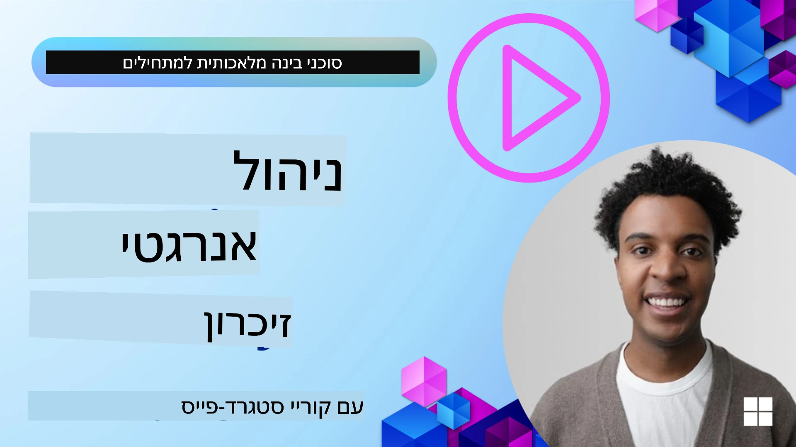

# זיכרון לסוכני AI  

כשמדברים על היתרונות הייחודיים של יצירת סוכני AI, שני דברים נדונים בעיקר: היכולת לקרוא לכלים לביצוע משימות והיכולת להשתפר עם הזמן. הזיכרון מהווה את היסוד ליצירת סוכן שמשתפר בעצמו ויכול ליצור חוויות טובות יותר למשתמשים שלנו.

בשיעור זה, נבחן מהו זיכרון לסוכני AI ואיך ניתן לנהל אותו ולהשתמש בו לטובת היישומים שלנו.

## מבוא

השיעור יכלול:

• **הבנת זיכרון סוכני AI**: מהו זיכרון ולמה הוא חיוני לסוכנים.

• **יישום ואחסון זיכרון**: שיטות מעשיות להוספת יכולות זיכרון לסוכני AI שלך, עם דגש על זיכרון קצר טווח וארוך טווח.

• **הפיכת סוכני AI למשתפרים בעצמם**: איך זיכרון מאפשר לסוכנים ללמוד מאינטראקציות עבר ולשפר את עצמם עם הזמן.

## יישומים זמינים

השיעור כולל שני סדנאות מפורטות בפייתון:

• **[13-agent-memory.ipynb](./13-agent-memory.ipynb)**: מיישם זיכרון באמצעות Mem0 ו-Azure AI Search במסגרת Microsoft Agent

• **[13-agent-memory-cognee.ipynb](./13-agent-memory-cognee.ipynb)**: מיישם זיכרון מובנה באמצעות Cognee, הבונה אוטומטית גרף ידע מגובה באמבדים, מציג את הגרף ומאפשר שליפה אינטיליגנטית

## מטרות הלמידה

בסיום שיעור זה תדע כיצד:

• **להבדיל בין סוגי זיכרון שונים לסוכני AI**, כולל זיכרון עבודה, קצר טווח וארוך טווח, וכן סוגים מיוחדים כמו זיכרון פרסונה וזיכרון אפיזודי.

• **ליישם ולנהל זיכרון קצר טווח וארוך טווח לסוכני AI** באמצעות Microsoft Agent Framework, תוך שימוש בכלים כמו Mem0, Cognee, זיכרון Whiteboard, ושילוב עם Azure AI Search.

• **להבין את העקרונות מאחורי סוכני AI שמשתפרים בעצמם** ואיך מערכות ניהול זיכרון חזקות תורמות ללמידה מתמשכת והתאמה.

## הבנת זיכרון סוכני AI

בליבה, **זיכרון לסוכני AI מתייחס למנגנונים שמאפשרים להם לשמר ולזכור מידע**. מידע זה יכול להיות פרטים ספציפיים על שיחה, העדפות משתמש, פעולות עבר, או אפילו דפוסים שנלמדו.

בלי זיכרון, יישומי AI לרוב חסרי מצב, כלומר כל אינטראקציה מתחילה מחדש. זה מוביל לחוויית משתמש שחוזרת על עצמה ומעיקה, שבה הסוכן "שוכח" הקשר או העדפות קודמות.

### למה הזיכרון חשוב?

האינטליגנציה של סוכן קשורה עמוקות ליכולתו לזכור ולהשתמש במידע עבר. הזיכרון מאפשר לסוכנים להיות:

• **הרהוריים**: ללמוד מפעולות ותוצאות בעבר.

• **אינטראקטיביים**: לשמור על ההקשר במהלך שיחה מתמשכת.

• **פעילים ותגובתיים**: לצפות לצרכים או להגיב כראוי על סמך נתונים היסטוריים.

• **אוטונומיים**: לפעול בצורה יותר עצמאית על ידי שימוש בידע מאוחסן.

המטרה ביישום זיכרון היא להפוך את הסוכנים ליותר **אמינים ובעלי יכולת**.

### סוגי זיכרון

#### זיכרון עבודה

חשוב עליו כנייר לשרטוט שבו הסוכן משתמש במהלך משימה או תהליך חשיבתי אחד מתמשך. הוא מחזיק מידע מיידי הנחוץ לחישוב הצעד הבא.

לסוכני AI, זיכרון עבודה לרוב לוכד את המידע הרלוונטי ביותר מהשיחה, גם אם היסטוריית הצ'אט המלאה ארוכה או מקוצרת. הוא מתמקד בהוצאת אלמנטים מרכזיים כמו דרישות, הצעות, החלטות ופעולות.

**דוגמה לזיכרון עבודה**

בסוכן הזמנת נסיעות, זיכרון עבודה יכול להכיל את בקשת המשתמש הנוכחית, כמו "אני רוצה להזמין טיול לפריז". דרישה ספציפית זו מחזיקה בהקשר המיידי של הסוכן כדי להנחות את האינטראקציה הנוכחית.

#### זיכרון קצר טווח

סוג זה של זיכרון שומר מידע למשך שיחת יחיד או מושב אחד. זהו ההקשר של הצ'אט הנוכחי, ומאפשר לסוכן להתייחס לסיבובים קודמים בדיאלוג.

**דוגמה לזיכרון קצר טווח**

אם המשתמש שואל, "כמה יעלה טיסה לפריז?" ואז ממשיך עם "מה לגבי לינה שם?", זיכרון קצר טווח מבטיח שהסוכן יודע כי "שם" מתייחס ל"פריז" באותה שיחה.

#### זיכרון ארוך טווח

זהו מידע שנשמר בין שיחות או מושבים מרובים. הוא מאפשר לסוכנים לזכור העדפות משתמש, אינטראקציות היסטוריות או ידע כללי על פני תקופות ממושכות. זה חשוב להתאמה אישית.

**דוגמה לזיכרון ארוך טווח**

זיכרון ארוך טווח יכול לשמור ש"בן אוהב סקי ופעילויות חוץ, מעדיף קפה עם נוף הררי, ורוצה להימנע ממדרונות סקי מתקדמים בגלל פציעה בעבר". מידע זה, שנלמד מאינטראקציות קודמות, משפיע על ההמלצות במפגשי תכנון טיולים עתידיים, ועושה אותם מותאמים אישית מאוד.

#### זיכרון פרסונה

סוג זיכרון מיוחד זה עוזר לסוכן לפתח "אישיות" או "פרסונה" עקבית. הוא מאפשר לסוכן לזכור פרטים על עצמו או על תפקידו המיועד, מה שהופך את האינטראקציות לנוזליות וממוקדות יותר.

**דוגמה לזיכרון פרסונה**  
אם סוכן הנסיעות מתוכנן להיות "מתכנן סקי מומחה", זיכרון פרסונה עשוי לחזק תפקיד זה, ולהשפיע על תגובותיו כך שישקפו את טון וידע המומחה.

#### זיכרון זרימה/אפיזודי

זיכרון זה שומר את רצף הצעדים שסוכן נוקט במהלך משימה מורכבת, כולל הצלחות וכישלונות. זה כמו לזכור "אפיזודות" ספציפיות או חוויות עבר כדי ללמוד מהן.

**דוגמה לזיכרון אפיזודי**

אם הסוכן ניסה להזמין טיסה מסוימת אך נכשל עקב חוסר זמינות, זיכרון אפיזודי יכול לתעד כישלון זה, מה שמאפשר לסוכן לנסות טיסות חלופיות או ליידע את המשתמש על הבעיה בצורה מושכלת יותר בניסיון הבא.

#### זיכרון ישות

זה כרוך בהוצאת וישמור ישויות ספציפיות (כמו אנשים, מקומות או דברים) ואירועים מהשיחות. זה מאפשר לסוכן לבנות הבנה מבנית של אלמנטים מרכזיים שנדונו.

**דוגמה לזיכרון ישות**

משיחה על טיול עבר, הסוכן עשוי להוציא "פריז," "מגדל האייפל," ו"ארוחת ערב במסעדת לה שא נואר" כישויות. באינטראקציה עתידית, הסוכן יוכל לזכור את "לה שא נואר" ולהציע לבצע הזמנה חדשה שם.

#### RAG מובנה (Retrieval Augmented Generation)

בעוד ש-RAG היא טכניקה רחבה יותר, "RAG מובנה" מודגש כטכנולוגיית זיכרון חזקה. הוא מוציא מידע צפוף ומובנה ממקורות שונים (שיחות, אימיילים, תמונות) ומשתמש בו לשיפור הדיוק, השליפה והמהירות בתגובות. בניגוד ל-RAG הקלאסי שמתבסס רק על דמיון סמנטי, RAG מובנה עובד עם המבנה הטבוע של המידע.

**דוגמה ל-RAG מובנה**

במקום להתאים רק מילות מפתח, RAG מובנה יכול לפרסר פרטי טיסה (יעד, תאריך, שעה, חברת תעופה) מאימייל ולאחסן אותם בצורה מובנית. זה מאפשר שאילתות מדויקות כמו "איזו טיסה הזמנתי לפריז ביום שלישי?"

## יישום ואחסון זיכרון

יישום זיכרון לסוכני AI כולל תהליך שיטתי של **ניהול זיכרון**, שכולל יצירה, אחסון, שליפה, אינטגרציה, עדכון, ואפילו "שכחה" (או מחיקה) של מידע. השליפה מהווה היבט קריטי במיוחד.

### כלים מיוחדים לזיכרון

#### Mem0

דרך אחת לאחסן ולנהל זיכרון של סוכן היא באמצעות כלים מיוחדים כמו Mem0. Mem0 פועל כשכבת זיכרון מתמשכת, המאפשרת לסוכנים לשלוף אינטראקציות רלוונטיות, לאחסן העדפות משתמש והקשר עובדתי, וללמוד מהצלחות וכישלונות לאורך זמן. הרעיון כאן הוא שסוכנים חסרי מצב הופכים לסוכנים בעלי מצב.

זה פועל דרך **קו זיכרון דו-שלבי: חילוץ ועדכון**. תחילה, הודעות המתווספות לחוט של סוכן נשלחות לשירות Mem0, שמשתמש במודל שפה גדול (LLM) לסיכום היסטוריית שיחה וחילוץ זיכרונות חדשים. לאחר מכן, שלב עדכון מונחה LLM קובע האם להוסיף, לשנות או למחוק זיכרונות אלו, ואוחסן במאגר נתונים היברידי שיכול לכלול מאגרי וקטור, גרף ומפתח-ערך. מערכת זו תומכת גם בסוגי זיכרון שונים ויכולה לכלול זיכרון גרפי לניהול מערכות יחסים בין ישויות.

#### Cognee

גישה חזקה נוספת היא שימוש ב-**Cognee**, זיכרון סמנטי קוד פתוח לסוכני AI שממיר מידע מובנה ולא מובנה לגרפי ידע שניתן לשאול אותם מגובה באמבדים. Cognee מספקת **ארכיטקטורת אחסון כפולה** המשלבת חיפוש דמיון וקטורי עם קשרי גרף, ומאפשרת לסוכנים להבין לא רק מה המידע הדומה, אלא איך מושגים מתקשרים זה לזה.

הוא מצטיין ב**שליפה היברידית** המשלבת דמיון וקטורי, מבנה גרף והסקת מודל שפה - מחיפוש חומרים גולמיים ועד מענה לשאלות מודע גרף. המערכת שומרת **זיכרון חי** שמתפתח וגדל תוך כדי שהוא נשאר ניתן לשאול כשכבה מחוברת אחת, תומך גם בהקשר מושב קצר טווח וגם בזיכרון מתמשך ארוך טווח.

מדריך הפייתון של Cognee ([13-agent-memory-cognee.ipynb](./13-agent-memory-cognee.ipynb)) מציג בניית שכבת הזיכרון המאוחדת הזו, עם דוגמאות מעשיות של הכנסת מקורות נתונים מגוונים, ויזואליזציה של גרף הידע ושאילתות עם אסטרטגיות חיפוש שונות המותאמות לצרכי סוכן ספציפיים.

### אחסון זיכרון באמצעות RAG

מעבר לכלי זיכרון מיוחדים כמו mem0, ניתן להשתמש בשירותי חיפוש חזקים כמו **Azure AI Search כאחסון ושליפה של זיכרונות**, במיוחד עבור RAG מובנה.

זה מאפשר לך לשרש את תגובות הסוכן שלך עם הנתונים שלך, ולהבטיח תשובות רלוונטיות ומדויקות יותר. Azure AI Search יכולה לשמש לאחסון זיכרונות נסיעות ספציפיים למשתמש, קטלוגי מוצרים או כל ידע תחומי אחר.

Azure AI Search תומכת ביכולות כמו **RAG מובנה**, שמצטיין בחילוץ ושליפת מידע צפוף ומובנה ממאגרי נתונים גדולים כמו היסטוריות שיחות, אימיילים או אפילו תמונות. זה מספק "דיוק ושליפה על אנושית" בהשוואה לשיטות קלאסיות של פישוט טקסט והטמעות.

## הפיכת סוכני AI למשתפרים בעצמם

תבנית נפוצה לסוכנים שמשתפרים בעצמם כוללת יצירת **"סוכן ידע"** נפרד. סוכן זה עוקב אחרי השיחה הראשית בין המשתמש לסוכן הראשי. תפקידו הוא:

1. **לזהות מידע בעל ערך**: לקבוע אם חלק מהשיחה שווה לשמירה כידע כללי או העדפה ספציפית של המשתמש.

2. **לחלץ ולסכם**: לזקק את הלמידה או ההעדפה העיקרית מהשיחה.

3. **לאחסן בבסיס ידע**: לשמר מידע זה, לעיתים קרובות במאגר וקטורי, כך שיוכל להישלף מאוחר יותר.

4. **להעשיר שאילתות עתידיות**: כאשר המשתמש מתחיל שאילתה חדשה, סוכן הידע שולף מידע רלוונטי שנשמר ומוסיף אותו לטריגר של המשתמש, ומספק הקשר חיוני לסוכן הראשי (בדומה ל-RAG).

### אופטימיזציות לזיכרון

• **ניהול השהיה**: כדי למנוע האטת האינטראקציות של המשתמש, ניתן להשתמש במודל זול ומהיר בתחילה כדי לבדוק במהירות אם מידע שווה לשמירה או שליפה, ולהפעיל את תהליך החילוץ/השליפה המורכב רק בעת הצורך.

• **תחזוקת בסיס הידע**: עבור בסיס ידע שגדל, מידע פחות בשימוש יכול להיות מועבר ל"אחסון קר" כדי לנהל עלויות.

## יש לכם שאלות נוספות על זיכרון לסוכני AI?

הצטרפו אל ה-[Microsoft Foundry Discord](https://aka.ms/ai-agents/discord) כדי להיפגש עם לומדים אחרים, להשתתף בשעות קבלה ולקבל מענה לשאלות שלכם על סוכני AI.

---

<!-- CO-OP TRANSLATOR DISCLAIMER START -->
**כתב ויתור**:  
מסמך זה תורגם באמצעות שירות תרגום מבוסס בינה מלאכותית [Co-op Translator](https://github.com/Azure/co-op-translator). למרות שאנו שואפים לדיוק, יש לקחת בחשבון שתרגומים אוטומטיים עלולים להכיל שגיאות או אי-דיוקים. המסמך המקורי בשפת המקור שלו הוא המקור הרשמי והמהימן. עבור מידע חיוני, מומלץ להיעזר בתרגום מקצועי ומבוסס על אדם. אנו לא נושאים באחריות לכל אי-הבנה או פרשנות שגויה הנובעים מהשימוש בתרגום זה.
<!-- CO-OP TRANSLATOR DISCLAIMER END -->