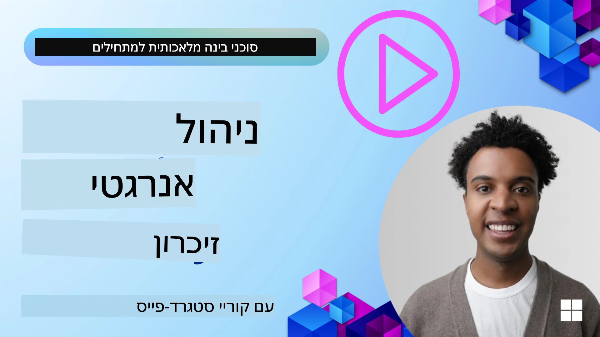

# זיכרון לסוכני AI

כשמדברים על היתרונות הייחודיים של יצירת סוכני AI, דנים בעיקר בשני דברים: היכולת לקרוא לכלים כדי להשלים משימות והיכולת להשתפר עם הזמן. הזיכרון הוא היסוד ביצירת סוכן שמשתפר בעצמו ויכול ליצור חוויות טובות יותר עבור המשתמשים שלנו.

בשיעור זה נבחן מהו זיכרון לסוכני AI ואיך אנחנו יכולים לנהל אותו ולהשתמש בו לטובת היישומים שלנו.

## מבוא

שיעור זה יכלול:

• **הבנת זיכרון סוכני AI**: מהו זיכרון ולמה הוא חשוב לסוכנים.

• **מימוש ואחסון זיכרון**: שיטות מעשיות להוספת יכולות זיכרון לסוכני ה-AI שלכם, בהתמקדות בזיכרון קצר טווח וארוך טווח.

• **יצירת סוכני AI שמשתפרים בעצמם**: איך הזיכרון מאפשר לסוכנים ללמוד מאינטראקציות קודמות ולהשתפר עם הזמן.

## מימושים זמינים

שיעור זה כולל שני מדריכים מפורטים בפורמט מחברת:

• **[13-agent-memory.ipynb](./13-agent-memory.ipynb)**: מממש זיכרון באמצעות Mem0 ו-Azure AI Search במסגרת Microsoft Agent Framework

• **[13-agent-memory-cognee.ipynb](./13-agent-memory-cognee.ipynb)**: מממש זיכרון מובנה באמצעות Cognee, בונה אוטומטית גרף ידע מגובה בהטמעות, מציג את הגרף ומשפר את ההנפקה החכמה

## מטרות הלמידה

לאחר סיום שיעור זה, תדעו כיצד:

• **להבחין בין סוגי זיכרון שונים לסוכני AI**, כולל זיכרון עבודה, קצר טווח וארוך טווח, וכן צורות מיוחדות כמו זיכרון אישיות וזיכרון אפיזודי.

• **לממש ולנהל זיכרון קצר טווח וארוך טווח לסוכני AI** באמצעות Microsoft Agent Framework, תוך שימוש בכלים כמו Mem0, Cognee, זיכרון Whiteboard, ואינטגרציה עם Azure AI Search.

• **להבין את העקרונות שמאחורי סוכני AI שמשתפרים בעצמם** וכיצד מערכות ניהול זיכרון חזקות תורמות ללמידה והתאמה מתמשכת.

## הבנת זיכרון סוכני AI

בליבה, **זיכרון לסוכני AI מתייחס למנגנונים שמאפשרים להם לשמור ולשלוף מידע**. מידע זה יכול להיות פרטים ספציפיים על שיחה, העדפות משתמש, פעולות קודמות או אפילו דפוסים שנלמדו.

בלי זיכרון, יישומי AI הם לרוב חסרי-מדינה, כלומר כל אינטראקציה מתחילה מאפס. זה מוביל לחוויית משתמש חוזרת ומתסכלת שבה הסוכן "שוכח" את ההקשר או ההעדפות הקודמות.

### למה הזיכרון חשוב?

האינטליגנציה של סוכן קשורה לעומק ליכולת שלו לשחזר ולהשתמש במידע קודם. הזיכרון מאפשר לסוכנים להיות:

• **הרהוריים**: לומדים מפעולות ותוצאות עבר.

• **אינטראקטיביים**: שומרים על הקשר לאורך שיחה מתמשכת.

• **יוזמים ומגיבים**: צופים צרכים או מגיבים בהתאם לנתונים היסטוריים.

• **אוטונומיים**: פועלים באופן עצמאי יותר באמצעות שימוש בידע שנשמר.

המטרה במימוש הזיכרון היא להפוך את הסוכנים ליותר **אמינים ומסוגלים**.

### סוגי זיכרון

#### זיכרון עבודה

תחשבו על זה ככלי לשרטוט שמסייע לסוכן במהלך משימה אחת או תהליך חשיבה מתמשך. הוא מחזיק מידע מיידי הנחוץ לחישוב השלב הבא.

עבור סוכני AI, זיכרון העבודה לעיתים תופס את המידע הרלוונטי ביותר משיחה, גם אם היסטוריית השיחה הארוכה או מקוצרת. הוא מתמקד בשליפת פריטים מרכזיים כמו דרישות, הצעות, החלטות ופעולות.

**דוגמה לזיכרון עבודה**

בסוכן הזמנות טיולים, זיכרון עובד עשוי לתפוס את בקשת המשתמש הנוכחית, כמו "אני רוצה להזמין טיול לפריז". דרישה ספציפית זו מוחזקת בהקשר המיידי של הסוכן כדי להנחות את האינטראקציה הנוכחית.

#### זיכרון קצר טווח

סוג זה של זיכרון שומר מידע לאורך שיחה בודדת או סשן. הוא מהווה את ההקשר של השיחה הנוכחית ומאפשר לסוכן להתייחס לסבבים קודמים בדיאלוג.

בדוגמאות Python של [Microsoft Agent Framework](https://github.com/microsoft/agent-framework), זה מתאים ל-AgentSession שנוצר עם `agent.create_session()`. הסשן הוא זיכרון קצר טווח מובנה במסגרת: הוא שומר את הקשר השיחה זמין כל עוד אותו סשן בשימוש, אך ההקשר אינו שומר כשהסשן מסתיים או שהיישום מופעל מחדש. יש להשתמש בזיכרון ארוך טווח לעובדות והעדפות שצריכות לשרוד בין סשנים, בדרך כלל דרך מסד נתונים, אינדקס וקטור, או אחסון מתמשך אחר.

**דוגמה לזיכרון קצר טווח**

אם משתמש שואל, "כמה עולה טיסה לפריז?" ואז שואל "מה לגבי הלינה שם?", זיכרון קצר הטווח מבטיח שהסוכן יודע "שם" מתייחס ל"פריז" באותה שיחה.

#### זיכרון ארוך טווח

זהו מידע שנשמר לאורך מספר שיחות או סשנים. הוא מאפשר לסוכנים לזכור העדפות משתמש, אינטראקציות היסטוריות או ידע כללי לאורך תקופות ממושכות. זה חשוב להתאמה אישית.

**דוגמה לזיכרון ארוך טווח**

זיכרון ארוך טווח עשוי לשמור ש"בן אוהב סקי ופעילויות חוץ, אוהב קפה עם נוף הררי, ורוצה להימנע ממדרונות סקי מתקדמים בעקבות פציעה בעבר". מידע זה, שלמד משיחות קודמות, משפיע על ההמלצות במפגשי תכנון טיולים עתידיים, מה שהופך אותם לאישיים מאוד.

#### זיכרון אישיות

סוג זיכרון מיוחד זה עוזר לסוכן לפתח "אישיות" או "פרסונה" עקבית. הוא מאפשר לסוכן לזכור פרטים על עצמו או על התפקיד המיועד לו, מה שהופך את האינטראקציות לזורמות וממוקדות יותר.

**דוגמה לזיכרון אישיות**
אם סוכן הטיולים מתוכנת להיות "מתכנן סקי מומחה", זיכרון האישיות עשוי לחזק תפקיד זה, ולהשפיע על תגובותיו להתאים לטון ולידע של מומחה.

#### זיכרון זרימת עבודה / אפיזודי

זיכרון זה שומר את רצף השלבים שסוכן עושה במהלך משימה מורכבת, כולל הצלחות וכישלונות. זה דומה לזכירת "פרקים" או חוויות עבר כדי ללמוד מהם.

**דוגמה לזיכרון אפיזודי**

אם הסוכן ניסה להזמין טיסה מסוימת אך זה נכשל עקב חוסר זמינות, זיכרון אפיזודי יכול לתעד את הכישלון הזה, לאפשר לסוכן לנסות טיסות חלופיות או להודיע למשתמש על הבעיה בצורה מודעת יותר בניסיון הבא.

#### זיכרון ישויות

זה כולל חילוץ וזכירת ישויות ספציפיות (כמו אנשים, מקומות או חפצים) ואירועים מתוך שיחות. זה מאפשר לסוכן לבנות הבנה מובנית של אלמנטים מרכזיים שנדונו.

**דוגמה לזיכרון ישויות**

משיחה על טיול עבר, הסוכן עשוי לחלץ "פריז," "מגדל אייפל," ו"ארוחת ערב במסעדת 륀ה צ׳אט נואר" כישויות. באינטראקציה עתידית, הסוכן יכול לזכור את "류ה צ׳אט נואר" ולהציע לבצע הזמנה חדשה שם.

#### RAG מובנה (Retrieval Augmented Generation)

בעוד ש-RAG היא טכניקה רחבה יותר, "RAG מובנה" מודגש כטכנולוגיית זיכרון חזקה. היא מחלחלת מידע צפוף ומובנה ממקורות שונים (שיחות, דוא"ל, תמונות) ומשתמשת בו לשפר דיוק, שליפה ומהירות בתגובות. בשונה מ-RAG קלאסי שמתבסס רק על דמיון סמנטי, RAG מובנה עובדת עם המבנה הטבעי של המידע.

**דוגמה ל-RAG מובנה**

במקום להתמקד רק במילות מפתח, RAG מובנה עשויה לנתח פרטי טיסה (יעד, תאריך, שעה, חברת תעופה) מתוך דוא"ל ולשמור אותם בצורה מובנית. זה מאפשר שאילתות מדויקות כמו "איזו טיסה הזמנתי לפריז ביום שלישי?"

## מימוש ואחסון זיכרון

מימוש זיכרון לסוכני AI כולל תהליך שיטתי של **ניהול זיכרון**, שכולל יצירה, אחסון, שליפה, אינטגרציה, עדכון ואפילו "שכחה" (או מחיקה) של מידע. השליפה היא היבט חשוב במיוחד.

### כלים מיוחדים לזיכרון

#### Mem0

דרך אחת לאחסן ולנהל זיכרון סוכן היא באמצעות כלים מיוחדים כמו Mem0. Mem0 פועל כשכבת זיכרון מתמשכת, ומאפשר לסוכנים לשחזר אינטראקציות רלוונטיות, לשמור העדפות משתמש והקשר עובדתי, וללמוד מהצלחות וכישלונות לאורך זמן. הרעיון כאן הוא שסוכנים חסרי-מדינה יהפכו לסוכני מדינה.

הוא פועל באמצעות **צינור זיכרון דו-שלבי: חילוץ ועדכון**. תחילה, הודעות שנוספו לנושא של סוכן נשלחות לשירות Mem0, המשתמש בדגם שפה גדול (LLM) לסכם היסטוריית שיחה ולחלץ זיכרונות חדשים. לאחר מכן, שלב עדכון מונחה LLM קובע האם להוסיף, לשנות או למחוק זיכרונות אלו, ומשמר אותם במסד נתונים היברידי שיכול לכלול מסדי נתונים וקטוריים, גרפיים ו-Key-Value. המערכת תומכת גם בסוגי זיכרון שונים ויכולה לשלב זיכרון גרפי לניהול יחסים בין ישויות.

#### Cognee

גישה עוצמתית נוספת היא שימוש ב-**Cognee**, זיכרון סמנטי בקוד פתוח לסוכני AI שמשנה נתונים מובנים ולא מובנים לגרפי ידע ניתנים לשאילתה התומכים בהטמעות. Cognee מספקת **ארכיטקטורת דואל-סטור** המשלבת חיפוש דמיון וקטורי עם יחסי גרף, ומאפשרת לסוכנים להבין לא רק איזו מידע דומה, אלא איך מושגים קשורים זה לזה.

היא מצטיינת ב**שליפה היברידית** המשלבת דמיון וקטורי, מבנה גרף והסקת דגם שפה - מחיפוש גושי מידע גולמיים עד למענה על שאלות עם מודעות גרף. המערכת שומרת על **זיכרון חי** שמתפתח וגדל תוך שמירה על ניתנות לשאילתה כגרף מחובר אחד, ותומכת בהקשר סשן קצר טווח וזיכרון מתמשך ארוך טווח.

מדריך מחברת Cognee ([13-agent-memory-cognee.ipynb](./13-agent-memory-cognee.ipynb)) מדגים בניית שכבת זיכרון מאוחדת זו, עם דוגמאות מעשיות של הטמעת מקורות מידע מגוונים, חזות גרף הידע, ושאילתות עם אסטרטגיות חיפוש שונות המותאמות לצרכי הסוכן.

### אחסון זיכרון עם RAG

מעבר לכלים מיוחדים לזיכרון כמו Mem0, ניתן לנצל שירותי חיפוש חזקים כמו **Azure AI Search כגב אחסון ושליפה לזיכרונות**, במיוחד עבור RAG מובנה.

זה מאפשר לייסד את תגובות הסוכן על מידע משלכם, מה שמבטיח תשובות רלוונטיות ומדויקות יותר. Azure AI Search יכול לשמש לאחסון זיכרונות טיול ספציפיים למשתמש, קטלוגי מוצרים או כל ידע תחומי אחר.

Azure AI Search תומך ביכולות כמו **RAG מובנה**, שמצטיינת בשליפה והפקת מידע צפוף ומובנה ממאגרי מידע גדולים כמו היסטוריות שיחות, דוא"ל, או אפילו תמונות. זה מספק "דיוק ושליפה על-אנושיים" לעומת גישות מסורתיות תחת חיתוך טקסט והטמעות.

## יצירת סוכני AI שמשתפרים בעצמם

דפוס נפוץ לסוכנים שמשתפרים עצמם כולל הכנסת **"סוכן ידע"**. סוכן נפרד זה עוקב אחרי השיחה הראשית בין המשתמש לסוכן הראשי. תפקידו הוא:

1. **לזהות מידע חשוב**: לקבוע אם חלק מהשיחה שווה שמירה כידע כללי או העדפת משתמש ספציפית.

2. **לחלץ ולסכם**: לתמצת את הלמידה או ההעדפה העיקרית מהשיחה.

3. **לאחסן בבסיס ידע**: לשמר את המידע החילוץ, לעיתים במסד נתונים וקטורי, כך שיכול להישלח לשליפה מאוחרת.

4. **להגדיל שאילתות עתידיות**: כאשר המשתמש מעלה שאלה חדשה, סוכן הידע מושך מידע רלוונטי ממאגר הזיכרון ומוסיף אותו למבנה הפנייה של המשתמש, כדי לספק הקשר חיוני לסוכן הראשי (בדומה ל-RAG).

### אופטימיזציות לזיכרון

• **ניהול השהיה**: כדי להימנע מהאטת האינטראקציה עם המשתמש, ניתן להשתמש במודל זול ומהיר תחילה שמבדק במהירות אם המידע שווה לשמור או לשלוף, ולהפעיל את תהליך החילוץ/השליפה המורכב יותר רק כשהנדרש.

• **תחזוקת בסיס ידע**: עבור בסיס ידע מתרחב, מידע שמשתמשים בו פחות מוקצה לאחסון "קר" כדי לנהל עלויות.

## יש לכם שאלות נוספות על זיכרון סוכן?

הצטרפו ל-[Microsoft Foundry Discord](https://discord.com/invite/ATgtXmAS5D) לפגוש לומדים נוספים, להשתתף בשעות קבלה ולקבל מענה לשאלות על סוכני AI.

---

<!-- CO-OP TRANSLATOR DISCLAIMER START -->
**כתב ויתור**:
מסמך זה תורגם באמצעות שירות תרגום אוטומטי [Co-op Translator](https://github.com/Azure/co-op-translator). למרות שאנו שואפים לדיוק, יש לקחת בחשבון שתרגומים אוטומטיים עלולים להכיל שגיאות או אי-דיוקים. יש להחשיב את המסמך המקורי בשפתו הטבעית כמקור הסמכות. למידע קריטי מומלץ להשתמש בתרגום מקצועי על ידי מתרגם אדם. אנו לא אחראים לכל אי-הבנה או פירוש שגוי הנובע מהשימוש בתרגום זה.
<!-- CO-OP TRANSLATOR DISCLAIMER END -->