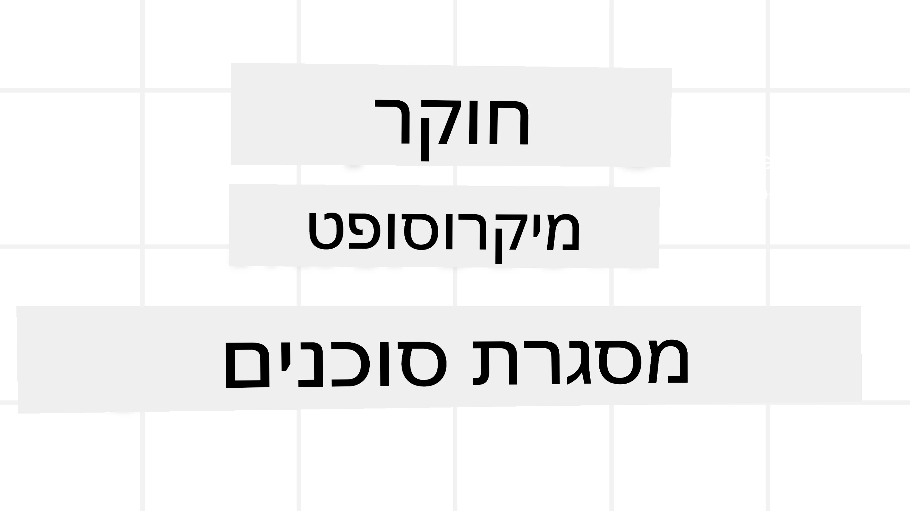
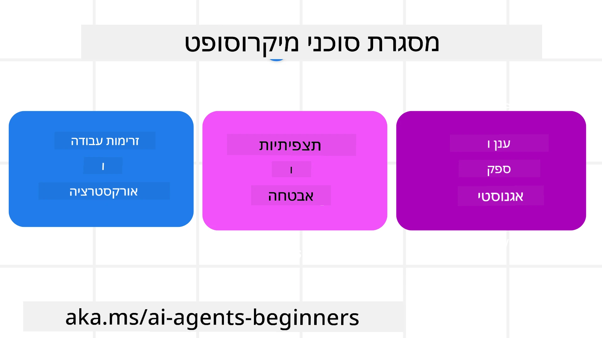
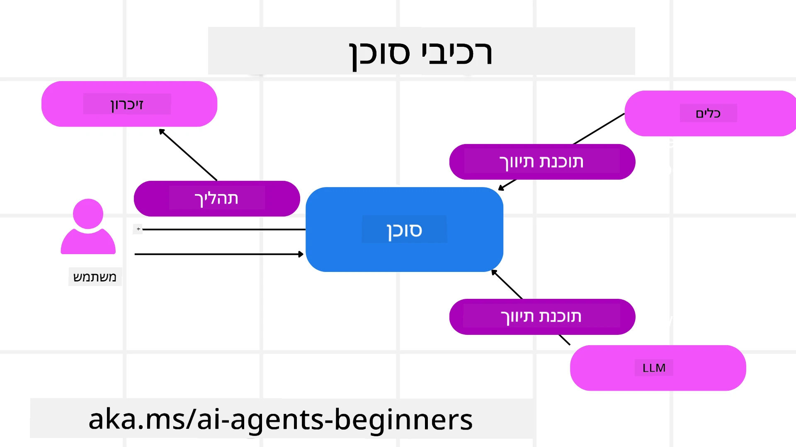

# חקר Microsoft Agent Framework



### מבוא

שיעור זה יכסה:

- הבנת Microsoft Agent Framework: תכונות עיקריות וערך  
- חקירת המושגים המרכזיים של Microsoft Agent Framework
- דפוסי MAF מתקדמים: זרימות עבודה, Middleware וזיכרון

## מטרות למידה

לאחר השלמת שיעור זה, תדע כיצד:

- לבנות סוכני AI מוכנים לייצור באמצעות Microsoft Agent Framework
- ליישם את התכונות העיקריות של Microsoft Agent Framework במקרי שימוש Agentic שלך
- להשתמש בדפוסים מתקדמים הכוללים זרימות עבודה, middleware ותצפית

## דוגמאות קוד 

דוגמאות קוד עבור [Microsoft Agent Framework (MAF)](https://aka.ms/ai-agents-beginners/agent-framewrok) נמצאות במאגר זה תחת הקבצים `xx-python-agent-framework` ו-`xx-dotnet-agent-framework`.

## הבנת Microsoft Agent Framework



[Microsoft Agent Framework (MAF)](https://aka.ms/ai-agents-beginners/agent-framewrok) היא מסגרת מאוחדת של Microsoft לבניית סוכני AI. היא מציעה גמישות להתמודדות עם מגוון רחב של מקרי שימוש אייג'נטיים הנראים בסביבות ייצור ומחקר כאחד, כולל:

- **תזמור רציף של סוכנים** בתרחישים שבהם נדרשות זרימות עבודה שלב אחר שלב.
- **תזמור מקבילי של סוכנים** בתרחישים בהם סוכנים צריכים להשלים משימות בו-זמנית.
- **תזמור שיחה קבוצתית** בתרחישים שבהם סוכנים יכולים לשתף פעולה יחד על משימה אחת.
- **תזמור העברות** בתרחישים שבהם סוכנים מעבירים זה לזה את המשימה כשהתתי-משימות מוגמרות.
- **תזמור מגנטי** בתרחישים שבהם סוכן מנהל יוצר ומעדכן רשימת משימות ומטפל בתיאום תת-סוכנים להשלמת המשימה.

כדי לספק סוכני AI בייצור, MAF כוללת גם תכונות עבור:

- **תצפית (Observability)** באמצעות שימוש ב-OpenTelemetry, כאשר כל פעולה של סוכן ה-AI כולל קריאת כלים, שלבי תזמור, זרמי הסקה ומעקב ביצועים דרך לוחות המחוונים של Microsoft Foundry.
- **אבטחה** על ידי אירוח סוכנים באופן מקורי ב-Microsoft Foundry, הכולל בקרים של אבטחה כגון גישה מבוססת תפקיד, טיפול בנתונים פרטיים ובטיחות תוכן מובנית.
- **עמידות** שכן תהליכי סוכן וזרימות עבודה יכולים להשהות, לחדש ולהתאושש משגיאות, מה שמאפשר תהליכים ארוכי-ריצה.
- **בקרה** מאחר שזרימות עבודה עם מעורבות אדם נתמכות, בהן משימות מסומנות כמצריכות אישור אנושי.

Microsoft Agent Framework גם שמה דגש על תאימות פעולה בין מערכות על ידי:

- **עצמאית מהענן** - סוכנים יכולים לרוץ בקונטיינרים, on-prem ובעננים שונים.
- **עצמאית מספקים** - סוכנים יכולים להיווצר באמצעות ה-SDK המועדף עליך כולל Azure OpenAI ו-OpenAI
- **שילוב תקנים פתוחים** - סוכנים יכולים להשתמש בפרוטוקולים כגון Agent-to-Agent(A2A) ו-Model Context Protocol (MCP) כדי לגלות ולהשתמש בסוכנים וכלים אחרים.
- **תוספים ומחברים** - ניתן ליצור חיבורים לשירותי נתונים וזיכרון כגון Microsoft Fabric, SharePoint, Pinecone ו-Qdrant.

הבה נבחן כיצד תכונות אלה מיושמות בחלק מהמושגים המרכזיים של Microsoft Agent Framework.

## המושגים המרכזיים של Microsoft Agent Framework

### סוכנים



**יצירת סוכנים**

יצירת סוכן נעשית על ידי הגדרת שירות ההסקה (LLM Provider), קבוצת הוראות שהסוכן יצטרך לפעול לפיהן, ו-`name` שיוקצה:

```python
agent = AzureOpenAIChatClient(credential=AzureCliCredential()).create_agent( instructions="You are good at recommending trips to customers based on their preferences.", name="TripRecommender" )
```

לעיל נעשה שימוש ב-`Azure OpenAI` אך ניתן ליצור סוכנים באמצעות מגוון שירותים כולל `Microsoft Foundry Agent Service`:

```python
AzureAIAgentClient(async_credential=credential).create_agent( name="HelperAgent", instructions="You are a helpful assistant." ) as agent
```

ממשקי API של OpenAI `Responses`, `ChatCompletion`

```python
agent = OpenAIResponsesClient().create_agent( name="WeatherBot", instructions="You are a helpful weather assistant.", )
```

```python
agent = OpenAIChatClient().create_agent( name="HelpfulAssistant", instructions="You are a helpful assistant.", )
```

או סוכנים מרוחקים המשתמשים בפרוטוקול A2A:

```python
agent = A2AAgent( name=agent_card.name, description=agent_card.description, agent_card=agent_card, url="https://your-a2a-agent-host" )
```

**הרצת סוכנים**

סוכנים מופעלים באמצעות המתודות `.run` או `.run_stream` עבור תגובות לא-סטרימינג או סטרימינג בהתאמה.

```python
result = await agent.run("What are good places to visit in Amsterdam?")
print(result.text)
```

```python
async for update in agent.run_stream("What are the good places to visit in Amsterdam?"):
    if update.text:
        print(update.text, end="", flush=True)

```

לכל הרצה של סוכן יכולות להיות גם אפשרויות להתאמת פרמטרים כגון `max_tokens` בהם משתמש הסוכן, `tools` שהסוכן יכול לקרוא, ואפילו ה-`model` עצמו המשמש את הסוכן.

זה שימושי במקרים שבהם יש צורך במודלים או כלים ספציפיים להשלמת משימת המשתמש.

**כלים**

ניתן להגדיר כלים הן בעת הגדרת הסוכן:

```python
def get_attractions( location: Annotated[str, Field(description="The location to get the top tourist attractions for")], ) -> str: """Get the top tourist attractions for a given location.""" return f"The top attractions for {location} are." 


# כאשר יוצרים את ה-ChatAgent ישירות

agent = ChatAgent( chat_client=OpenAIChatClient(), instructions="You are a helpful assistant", tools=[get_attractions]

```

וכן בעת הרצת הסוכן:

```python

result1 = await agent.run( "What's the best place to visit in Seattle?", tools=[get_attractions] # הכלי ניתן לשימוש רק בהרצה זו )
```

**שרשורי סוכן**

שרשורי סוכן משמשים לטיפול בשיחות מרובות תורות. ניתן ליצור שרשורים באופן הבא:

- שימוש ב-`get_new_thread()` שמאפשר לשמור את השרשור לאורך זמן
- יצירת שרשור אוטומטית בעת הרצת סוכן והיוותרות השרשור רק במהלך ההרצה הנוכחית.

ליצירת שרשור, הקוד נראה כך:

```python
# צור חוט חדש.
thread = agent.get_new_thread() # הרץ את הסוכן באמצעות החוט.
response = await agent.run("Hello, I am here to help you book travel. Where would you like to go?", thread=thread)

```

ניתן לאחר מכן לסריאליזציה של השרשור כדי לאחסן אותו לשימוש עתידי:

```python
# צור חוט חדש.
thread = agent.get_new_thread() 

# הרץ את הסוכן עם החוט.

response = await agent.run("Hello, how are you?", thread=thread) 

# סריאליזציה של החוט לצורך אחסון.

serialized_thread = await thread.serialize() 

# בצע דסיריאליזציה של מצב החוט לאחר טעינה מהאחסון.

resumed_thread = await agent.deserialize_thread(serialized_thread)
```

**Middleware של סוכן**

סוכנים מתקשרים עם כלים ו-LLMs כדי להשלים משימות של משתמשים. בתרחישים מסוימים, אנו מעוניינים לבצע או לעקוב אחרי פעולות שבין האינטראקציות הללו. ה-Middleware של הסוכן מאפשר לנו לעשות זאת באמצעות:

*Middleware של פונקציה*

Middleware זה מאפשר לנו לבצע פעולה בין הסוכן לבין פונקציה/כלי שהוא יתקשר אליו. דוגמה לשימוש תהיה כאשר נרצה לבצע רישום (logging) על קריאת הפונקציה.

בקוד למטה `next` מגדיר האם יש לקרוא למידלוור הבא או לפונקציה עצמה.

```python
async def logging_function_middleware(
    context: FunctionInvocationContext,
    next: Callable[[FunctionInvocationContext], Awaitable[None]],
) -> None:
    """Function middleware that logs function execution."""
    # עיבוד מקדים: רישום לפני ביצוע הפונקציה
    print(f"[Function] Calling {context.function.name}")

    # המשך לשכבת הביניים הבאה או לביצוע הפונקציה
    await next(context)

    # עיבוד לאחר הפעולה: רישום לאחר ביצוע הפונקציה
    print(f"[Function] {context.function.name} completed")
```

*Middleware של צ'אט*

Middleware זה מאפשר לנו לבצע או לרשום פעולה בין הסוכן והבקשות ל-LLM.

זה מכיל מידע חשוב כגון ה-`messages` שנשלחים לשירות ה-AI.

```python
async def logging_chat_middleware(
    context: ChatContext,
    next: Callable[[ChatContext], Awaitable[None]],
) -> None:
    """Chat middleware that logs AI interactions."""
    # עיבוד מקדים: רישום לפני קריאה ל-AI
    print(f"[Chat] Sending {len(context.messages)} messages to AI")

    # המשך למידלוואר הבא או לשירות ה-AI
    await next(context)

    # עיבוד לאחר: רישום לאחר תגובת ה-AI
    print("[Chat] AI response received")

```

**זיכרון סוכן**

כמו שנידון בשיעור `Agentic Memory`, זיכרון הוא מרכיב חשוב לאפשר לסוכן לפעול בהקשרים שונים. ל-MAF יש כמה סוגי זיכרונות שונים:

*אחסון בזיכרון פנימי*

זהו הזיכרון הנשמר בשרשורים במהלך זמן הריצה של היישום.

```python
# צור חוט חדש.
thread = agent.get_new_thread() # הפעל את הסוכן עם החוט.
response = await agent.run("Hello, I am here to help you book travel. Where would you like to go?", thread=thread)
```

*הודעות מתמשכות*

זיכרון זה משמש לאחסון היסטוריית שיחה על פני מסגרות שונות. הוא מוגדר באמצעות ה-`chat_message_store_factory` :

```python
from agent_framework import ChatMessageStore

# צור מאגר הודעות מותאם אישית
def create_message_store():
    return ChatMessageStore()

agent = ChatAgent(
    chat_client=OpenAIChatClient(),
    instructions="You are a Travel assistant.",
    chat_message_store_factory=create_message_store
)

```

*זיכרון דינמי*

זיכרון זה נוסף להקשר לפני הרצת הסוכנים. זיכרונות אלה יכולים להישמר בשירותים חיצוניים כגון mem0:

```python
from agent_framework.mem0 import Mem0Provider

# שימוש ב-Mem0 עבור יכולות זיכרון מתקדמות
memory_provider = Mem0Provider(
    api_key="your-mem0-api-key",
    user_id="user_123",
    application_id="my_app"
)

agent = ChatAgent(
    chat_client=OpenAIChatClient(),
    instructions="You are a helpful assistant with memory.",
    context_providers=memory_provider
)

```

**תצפית של סוכן**

תצפית חשובה לבניית מערכות אייג'נטיות אמינות וניתנות לתחזוקה. MAF משתלבת עם OpenTelemetry כדי לספק מעקבים ומדדים לשיפור התצפית.

```python
from agent_framework.observability import get_tracer, get_meter

tracer = get_tracer()
meter = get_meter()
with tracer.start_as_current_span("my_custom_span"):
    # עשה משהו
    pass
counter = meter.create_counter("my_custom_counter")
counter.add(1, {"key": "value"})
```

### זרימות עבודה

MAF מציעה זרימות עבודה שהן צעדים מוגדרים מראש להשלמת משימה וכוללות סוכני AI כרכיבים באותם שלבים.

זרימות עבודה מורכבות מרכיבים שונים שמאפשרים שליטה טובה יותר בזרימת הבקרה. זרימות עבודה מאפשרות גם **אורקסטרציה מרובת-סוכנים** ו-**שימור נקודות בדיקה (checkpointing)** לשמירת מצבי הזרימה.

הרכיבים המרכזיים של זרימת עבודה הם:

**מבצעים (Executors)**

מבצעים מקבלים הודעות קלט, מבצעים את המשימות שהוקצו להם, ואז מייצרים הודעת פלט. זה מקדם את זרימת העבודה לקראת השלמת המשימה הכוללת. מבצעים יכולים להיות גם סוכן AI או לוגיקה מותאמת.

**קשתות (Edges)**

קשתות משמשות להגדרת זרימת ההודעות בזרימת עבודה. אלו יכולות להיות:

*קשתות ישירות (Direct Edges)* - חיבורים פשוטים אחד-לאחד בין מבצעים:

```python
from agent_framework import WorkflowBuilder

builder = WorkflowBuilder()
builder.add_edge(source_executor, target_executor)
builder.set_start_executor(source_executor)
workflow = builder.build()
```

*קשתות מותנות (Conditional Edges)* - מופעלות לאחר שמתקיים תנאי מסוים. לדוגמה, כאשר חדרי מלון אינם זמינים, מבצע יכול להציע אפשרויות אחרות.

*קשתות switch-case* - מפנות הודעות למבצעים שונים בהתאם לתנאים מוגדרים. לדוגמה, אם ללקוח נסיעה יש גישת עדיפות והמטלות שלו יטופלו דרך זרימת עבודה אחרת.

*קשתות Fan-out* - שולחות הודעה אחת למספר יעדים.

*קשתות Fan-in* - אוספות הודעות מרובות ממבצעים שונים ושולחות ליעד אחד.

**אירועים**

כדי לספק תצפית טובה יותר על זרימות עבודה, MAF מציעה אירועים מובנים לביצוע הכוללים:

- `WorkflowStartedEvent` - ההרצה של זרימת העבודה מתחילה
- `WorkflowOutputEvent` - זרימת העבודה מייצרת פלט
- `WorkflowErrorEvent` - זרימת העבודה נתקלת בשגיאה
- `ExecutorInvokeEvent` - המבצע מתחיל בעיבוד
- `ExecutorCompleteEvent` - המבצע מסיים את העיבוד
- `RequestInfoEvent` - בקשה נשלחת

## דפוסי MAF מתקדמים

הסעיפים לעיל מכסים את המושגים המרכזיים של Microsoft Agent Framework. ככל שתבנה סוכנים מורכבים יותר, הנה כמה דפוסים מתקדמים לשקול:

- **הרכבת Middleware**: שרשרת של מטפלי middleware מרובים (logging, auth, rate-limiting) באמצעות middleware של פונקציות וצ'אט לשליטה מדוקדקת בהתנהגות הסוכן.
- **שימור נקודות בזמן זרימת עבודה (Checkpointing)**: השתמש באירועי זרימת עבודה וסיריאליזציה כדי לשמור ולחדש תהליכים ארוכי-ריצה של סוכן.
- **בחירה דינמית של כלים**: שלב RAG על תיאורי כלים עם רישום הכלים של MAF כדי להציג רק את הכלים הרלוונטיים לכל שאילתה.
- **העברות בין-סוכניות (Multi-Agent Handoff)**: השתמש בקשתות זרימת עבודה וכיוונון מותנה כדי לתזמר העברות בין סוכנים מתמחים.

## דוגמאות קוד 

דוגמאות קוד עבור Microsoft Agent Framework נמצאות במאגר זה תחת הקבצים `xx-python-agent-framework` ו-`xx-dotnet-agent-framework`.

## יש לך עוד שאלות לגבי Microsoft Agent Framework?

הצטרף ל-[Microsoft Foundry Discord](https://aka.ms/ai-agents/discord) כדי להיפגש עם לומדים אחרים, להשתתף בשעות ייעוץ ולקבל תשובות לשאלות על סוכני ה-AI שלך.

---

<!-- CO-OP TRANSLATOR DISCLAIMER START -->
כתב ויתור:

מסמך זה תורגם באמצעות שירות תרגום מבוסס בינה מלאכותית Co-op Translator (https://github.com/Azure/co-op-translator). על אף שאנו שואפים לדיוק, יש לשים לב שתרגומים אוטומטיים עלולים להכיל שגיאות או אי-דיוקים. יש להתייחס למסמך המקורי בשפת המקור כאל המקור הסמכותי. לפרטים קריטיים מומלץ להיעזר בתרגום מקצועי של מתרגם אנושי. איננו נושאים באחריות לכל אי־הבנה או פרשנות שגויה הנובעת משימוש בתרגום זה.
<!-- CO-OP TRANSLATOR DISCLAIMER END -->