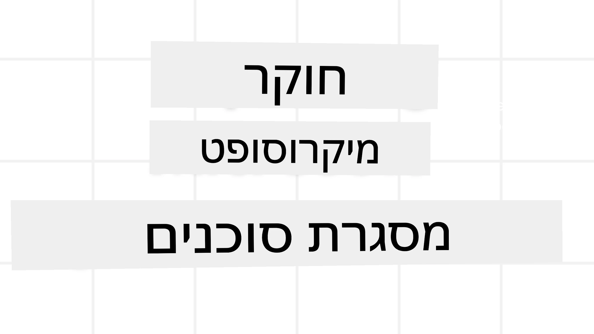
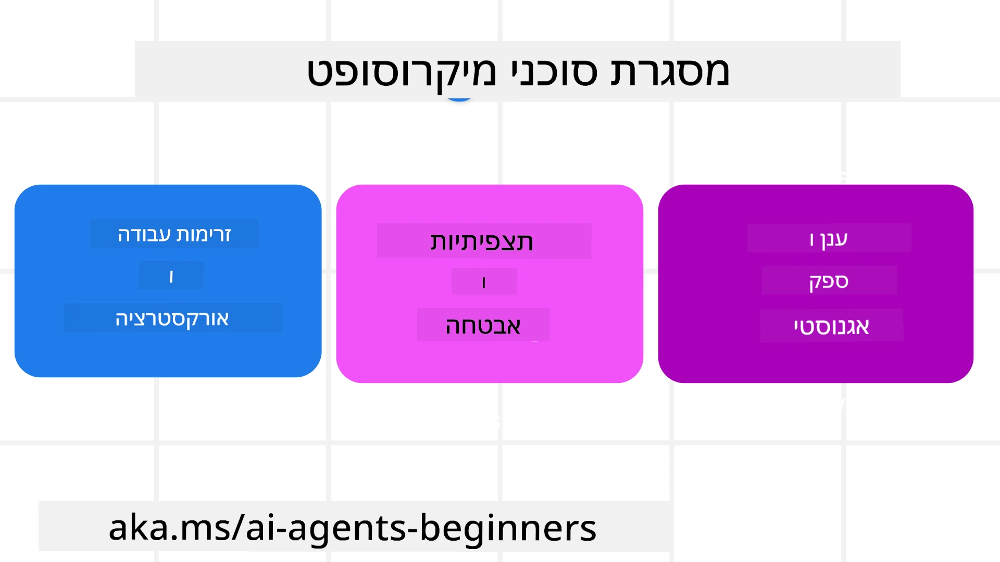
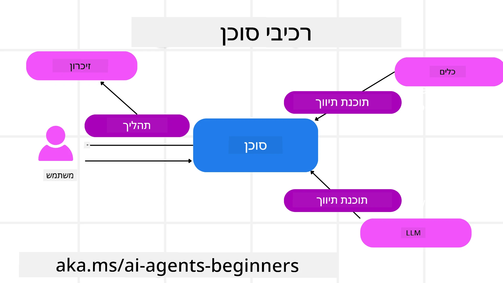

# חקירת מסגרת Microsoft Agent



### מבוא

שיעור זה יכלול:

- הבנת מסגרת Microsoft Agent: תכונות מפתח וערך  
- חקירת המושגים המרכזיים של מסגרת Microsoft Agent
- דפוסי MAF מתקדמים: זרימות עבודה, תווך וזיכרון

## מטרות הלמידה

לאחר סיום שיעור זה, תדעו כיצד:

- לבנות סוכני AI מוכנים לייצור באמצעות מסגרת Microsoft Agent
- ליישם את התכונות המרכזיות של מסגרת Microsoft Agent במקרי השימוש הסוכניים שלכם
- להשתמש בדפוסים מתקדמים כולל זרימות עבודה, תווך ונראות

## דוגמאות קוד 

דוגמאות קוד עבור [Microsoft Agent Framework (MAF)](https://learn.microsoft.com/en-us/agent-framework/overview/?wt.mc_id=youtube_26688_organicsocial_reactor&pivots=programming-language-python) נמצאות במאגר זה תחת הקבצים `xx-python-agent-framework` ו-`xx-dotnet-agent-framework`.

## הבנת מסגרת Microsoft Agent



[Microsoft Agent Framework (MAF)](https://learn.microsoft.com/en-us/agent-framework/overview/?wt.mc_id=youtube_26688_organicsocial_reactor&pivots=programming-language-python) היא המסגרת המאוחדת של מיקרוסופט לבניית סוכני AI. היא מציעה את הגמישות להתייחס למגוון רחב של מקרי שימוש סוכניים הנראים הן בסביבות ייצור והן במחקר הכוללים:

- **תזמור סוכנים סדרתי** בסביבות בהן נדרשות זרימות עבודה שלב אחר שלב.
- **תזמור מקביל** בסביבות בהן סוכנים צריכים להשלים משימות בו-זמנית.
- **תזמור שיחה קבוצתית** בסביבות בהן סוכנים יכולים לשתף פעולה יחד על משימה אחת.
- **תזמור העברת משימות** בסביבות בהן סוכנים מעבירים את המשימה זה לזה כשהמשימות המשניות הושלמו.
- **תזמור מגנטי** בסביבות בהן סוכן מנהל יוצר ומשנה רשימת משימות ומטפל בתיאום של תת-סוכנים להשלמת המשימה.

כדי לספק סוכני AI בייצור, MAF כוללת גם תכונות עבור:

- **נראות** באמצעות שימוש ב-OpenTelemetry כאשר כל פעולה של סוכן ה-AI כולל קריאת כלים, שלבי תזמור, זרימות היסק ומעקב ביצועים דרך לוחות מידע של Microsoft Foundry.
- **אבטחה** על ידי אירוח סוכנים באופן מקומי ב-Microsoft Foundry הכוללת בקרות אבטחה כגון גישה מבוססת תפקיד, טיפול בנתונים פרטיים ובטיחות תוכן מובנית.
- **עמידות** כיוון שיכולות להיעשות הפסקות, חידושים ושחזור שגיאות בשרשורי סוכנים וזרימות עבודה מה שמאפשר תהליכים ארוכי טווח.
- **בקרה** מאחר וזרימות עבודה של אדם בלולאה נתמכות כאשר משימות מסומנות כדרושות אישור אנושי.

מסגרת Microsoft Agent מתמקדת גם באינטרופרביליות באמצעות:

- **אי-תלות בענן** - סוכנים יכולים לפעול במכולות, באתר ומעל מספר עננים שונים.
- **אי-תלות בספק** - סוכנים יכולים להיווצר באמצעות ה-SDK המועדף עליכם כולל Azure OpenAI ו-OpenAI
- **שילוב תקנים פתוחים** - סוכנים יכולים לנצל פרוטוקולים כגון Agent-to-Agent (A2A) ו-Model Context Protocol (MCP) כדי לגלות ולהשתמש בסוכנים וכלים נוספים.
- **תוספים ומחברים** - ניתן ליצור חיבורים לשירותי נתונים וזיכרון כגון Microsoft Fabric, SharePoint, Pinecone ו-Qdrant.

בואו נבחן כיצד תכונות אלה מיושמות בחלק מהמושגים המרכזיים של מסגרת Microsoft Agent.

## מושגים מרכזיים של מסגרת Microsoft Agent

### סוכנים




**יצירת סוכנים**

יצירת סוכן מתבצעת על ידי הגדרת שירות המסקנה (ספק LLM), מערך הוראות לסוכן ה-AI לעקוב אחריהן, ו`name` מוקצה:


```python
agent = AzureOpenAIChatClient(credential=AzureCliCredential()).create_agent( instructions="You are good at recommending trips to customers based on their preferences.", name="TripRecommender" )
```

הדוגמה שלמעלה משתמשת ב-`Azure OpenAI` אך ניתן ליצור סוכנים באמצעות מגוון שירותים כולל `Microsoft Foundry Agent Service`:

```python
AzureAIAgentClient(async_credential=credential).create_agent( name="HelperAgent", instructions="You are a helpful assistant." ) as agent
```

OpenAI `Responses`, API של `ChatCompletion`

```python
agent = OpenAIResponsesClient().create_agent( name="WeatherBot", instructions="You are a helpful weather assistant.", )
```

```python
agent = OpenAIChatClient().create_agent( name="HelpfulAssistant", instructions="You are a helpful assistant.", )
```

או [MiniMax](https://platform.minimaxi.com/), המספק API תואם OpenAI עם חלונות הקשר גדולים (עד 204K טוקנים):

```python
agent = OpenAIChatClient(base_url="https://api.minimax.io/v1", api_key=os.environ["MINIMAX_API_KEY"], model_id="MiniMax-M3").create_agent( name="HelpfulAssistant", instructions="You are a helpful assistant.", )
```

או סוכנים מרוחקים המשתמשים בפרוטוקול A2A:

```python
agent = A2AAgent( name=agent_card.name, description=agent_card.description, agent_card=agent_card, url="https://your-a2a-agent-host" )
```

**הרצת סוכנים**

הסוכנים מורצים באמצעות המתודות `.run` או `.run_stream` לתגובות לא סטרימינג או סטרימינג.

```python
result = await agent.run("What are good places to visit in Amsterdam?")
print(result.text)
```

```python
async for update in agent.run_stream("What are the good places to visit in Amsterdam?"):
    if update.text:
        print(update.text, end="", flush=True)

```

לכל הרצת סוכן יכולות להיות אפשרויות להתאמת פרמטרים כגון `max_tokens` בהם הסוכן משתמש, `tools` שהסוכן יכול לקרוא להם, ואפילו ה`model` עצמו שבו משתמש הסוכן.

זה שימושי במקרים שבהם נדרשים מודלים או כלים ספציפיים להשלמת המשימה של המשתמש.

**כלים**

ניתן להגדיר כלים גם בעת הגדרת הסוכן:

```python
def get_attractions( location: Annotated[str, Field(description="The location to get the top tourist attractions for")], ) -> str: """Get the top tourist attractions for a given location.""" return f"The top attractions for {location} are." 


# כאשר יוצרים סוכן שיחה ישירות

agent = ChatAgent( chat_client=OpenAIChatClient(), instructions="You are a helpful assistant", tools=[get_attractions]

```

וגם במהלך הרצת הסוכן:

```python

result1 = await agent.run( "What's the best place to visit in Seattle?", tools=[get_attractions] # כלי המיועד לריצה זו בלבד )
```

**שרשורי סוכן**

שרשורי סוכן משמשים לטיפול בשיחות מרובות סבבים. ניתן ליצור שרשורים על ידי:

- שימוש ב-`get_new_thread()` שמאפשר לשמור את השרשור לאורך זמן
- יצירת שרשור אוטומטית כאשר מריצים סוכן ושמירת השרשור רק במהלך הריצה הנוכחית.

ליצירת שרשור, הקוד נראה כך:

```python
# צור נּוּר חדש.
thread = agent.get_new_thread() # הפעל את הסוכן עם הנוּר.
response = await agent.run("Hello, I am here to help you book travel. Where would you like to go?", thread=thread)

```

לאחר מכן ניתן לסריאליז את השרשור כדי לאחסן לשימוש מאוחר יותר:

```python
# ליצור אשף חדש.
thread = agent.get_new_thread() 

# להריץ את הסוכן עם האשף.

response = await agent.run("Hello, how are you?", thread=thread) 

# לסדר את האשף לאיחסון.

serialized_thread = await thread.serialize() 

# לפענח את מצב האשף לאחר טעינה מאוחסון.

resumed_thread = await agent.deserialize_thread(serialized_thread)
```

**מערכת תוכנה מתווכת לסוכן**

סוכנים מתקשרים עם כלים ו-LLMs להשלמת משימות המשתמש. במקרים מסוימים, אנו רוצים לבצע או לעקוב אחרי פעולות בין אינטראקציות אלו. מערכת תוכנה מתווכת מאפשרת לנו לעשות זאת באמצעות:

*תוכנה מתווכת לפונקציות*

תוכנה זו מאפשרת לבצע פעולה בין הסוכן לפונקציה/כלי שהוא יקרא לה. דוגמה לשימוש היא ביצוע רישום יומן על קריאת הפונקציה.

בקוד שלמטה, `next` מגדיר אם יש לקרוא לתוכנה המתוכנת הבאה או לפונקציה עצמה.

```python
async def logging_function_middleware(
    context: FunctionInvocationContext,
    next: Callable[[FunctionInvocationContext], Awaitable[None]],
) -> None:
    """Function middleware that logs function execution."""
    # עיבוד מקדים: רישום לפני ביצוע הפונקציה
    print(f"[Function] Calling {context.function.name}")

    # המשך למידלוור הבא או לביצוע הפונקציה
    await next(context)

    # עיבוד לאחר ביצוע: רישום לאחר ביצוע הפונקציה
    print(f"[Function] {context.function.name} completed")
```

*תוכנה מתווכת ל-Chat*

תוכנה זו מאפשרת לבצע או לרשום פעולה בין הסוכן לבין הבקשות בין ה-LLM.

זה מכיל מידע חשוב כגון ה`messages` שנשלחים לשירות ה-AI.

```python
async def logging_chat_middleware(
    context: ChatContext,
    next: Callable[[ChatContext], Awaitable[None]],
) -> None:
    """Chat middleware that logs AI interactions."""
    # עיבוד מוקדם: רישום לפני קריאת ה-AI
    print(f"[Chat] Sending {len(context.messages)} messages to AI")

    # המשך ל-middleware הבא או לשירות ה-AI
    await next(context)

    # עיבוד לאחר: רישום אחרי תגובת ה-AI
    print("[Chat] AI response received")

```

**זיכרון הסוכן**

כפי שכוסה בשיעור `Agentic Memory`, הזיכרון הוא אלמנט חשוב לאפשר לסוכן לפעול בהקשרים שונים. MAF מציע מספר סוגי זכרונות שונים:

*אחסון בזיכרון*

זוהי הזיכרון הנשמר בשרשורים במהלך זמן ריצת היישום.

```python
# צור אשכול חדש.
thread = agent.get_new_thread() # הפעל את הסוכן עם האשכול.
response = await agent.run("Hello, I am here to help you book travel. Where would you like to go?", thread=thread)
```

*הודעות מתמשכות*

זיכרון זה משמש לאחסון היסטוריית שיחה בין מושבים שונים. הוא מוגדר באמצעות `chat_message_store_factory`:

```python
from agent_framework import ChatMessageStore

# צור מאגר הודעות מותאם אישית
def create_message_store():
    return ChatMessageStore()

agent = ChatAgent(
    chat_client=OpenAIChatClient(),
    instructions="You are a Travel assistant.",
    chat_message_store_factory=create_message_store
)

```

*זיכרון דינמי*


זיכרון זה מתווסף להקשר לפני שהסוכנים רצים. זיכרונות אלו יכולים להיות מאוחסנים בשירותים חיצוניים כגון mem0:

```python
from agent_framework.mem0 import Mem0Provider

# שימוש ב-Mem0 ליכולות זיכרון מתקדמות
memory_provider = Mem0Provider(
    api_key="your-mem0-api-key",
    user_id="user_123",
    application_id="my_app"
)

agent = ChatAgent(
    chat_client=OpenAIChatClient(),
    instructions="You are a helpful assistant with memory.",
    context_providers=memory_provider
)

```

**ניתנות לצפייה של סוכן**

ניתנות לצפייה חשובה לבניית מערכות הסוכנות אמינות וניתנות לתחזוקה. MAF משתלבת עם OpenTelemetry לספק מעקב ומדדים לניטור משופר.

```python
from agent_framework.observability import get_tracer, get_meter

tracer = get_tracer()
meter = get_meter()
with tracer.start_as_current_span("my_custom_span"):
    # לעשות משהו
    pass
counter = meter.create_counter("my_custom_counter")
counter.add(1, {"key": "value"})
```

### זרימות עבודה

MAF מציעה זרימות עבודה שהן שלבים מוגדרים מראש להשלים משימה וכוללות סוכני AI כמרכיבים באותם שלבים.

זרימות עבודה מורכבות ממרכיבים שונים שמאפשרים זרימת שליטה טובה יותר. זרימות עבודה גם מאפשרות **אורקסטרציה מרובת סוכנים** ו-**שמירת נקודות ביקורת** לשמירת מצבי זרימת העבודה.

המרכיבים המרכזיים של זרימת עבודה הם:

**מבצעים**

מבצעים מקבלים הודעות כניסה, מבצעים את המשימות שהוקצו להם ואז מפיקים הודעת יציאה. זה מקדם את זרימת העבודה לקראת השלמת המשימה הגדולה. מבצעים יכולים להיות או סוכן AI או לוגיקה מותאמת אישית.

**קצוות**

הקצוות משמשים להגדרת זרימת ההודעות בזרימת עבודה. אלו יכולים להיות:

*קצוות ישירים* - חיבורים פשוטים אחד על אחד בין המבצעים:

```python
from agent_framework import WorkflowBuilder

builder = WorkflowBuilder()
builder.add_edge(source_executor, target_executor)
builder.set_start_executor(source_executor)
workflow = builder.build()
```

*קצוות מותנים* - מופעלים לאחר שמתקיימת תנאי מסוים. לדוגמה, כאשר חדרי מלון אינם זמינים, מבצע יכול להציע אפשרויות אחרות.

*קצוות מתג-מקרה* - מנתבים הודעות למבצעים שונים בהתבסס על תנאים שהוגדרו. לדוגמה, אם ללקוח הנסיעות יש גישה עדיפות והמשימות שלו יטופלו דרך זרימת עבודה אחרת.

*קצוות פאן-אאוט* - שולחים הודעה אחת למספר יעדים.

*קצוות פאן-אין* - אוספים מספר הודעות ממבצעים שונים ושולחים ליעד אחד.

**אירועים**

כדי לספק ניטור טוב יותר לזרימות עבודה, MAF מציעה אירועים מובנים לביצוע כולל:

- `WorkflowStartedEvent`  - התחלת ביצוע זרימת העבודה
- `WorkflowOutputEvent` - זרימת העבודה מייצרת פלט
- `WorkflowErrorEvent` - זרימת העבודה נתקלה בשגיאה
- `ExecutorInvokeEvent`  - המבצע מתחיל לעבד
- `ExecutorCompleteEvent`  -  המבצע מסיים עיבוד
- `RequestInfoEvent` - נשלח בקשה

## דפוסי MAF מתקדמים

הקטעים למעלה מכסים את המושגים המרכזיים של Microsoft Agent Framework. ככל שתבנו סוכנים מורכבים יותר, הנה כמה דפוסים מתקדמים לשקול:

- **רכבת ביניים מורכבת**: שרשרת של מטפלי ביניים מרובים (רישום, אימות, הגבלת קצב) באמצעות פונקציות וביניים לשיחה לשליטה מדויקת יותר בהתנהגות הסוכן.
- **שמירת נקודת ביקורת בזרימת עבודה**: השתמש באירועי זרימת עבודה ושרשור כדי לשמור ולהמשיך תהליכים ארוכי טווח של סוכנים.
- **בחירת כלי דינמית**: שילוב RAG מעל תיאורי כלים עם רישום הכלים של MAF להציג רק כלים רלוונטיים לכל שאילתה.
- **העברת משימות מרובת סוכנים**: שימוש בקצוות זרימות עבודה וניתוב מותנה לאורקסטרציה של העברות בין סוכנים מומחים.

## אירוח סוכני LangChain / LangGraph ב-Microsoft Foundry

Microsoft Agent Framework הוא **מתואם עם מסגרות אחרות** — אינכם מוגבלים לסוכנים שנכתבו עם MAF. אם יש לכם כבר סוכן שנבנה עם **LangChain** או **LangGraph**, ניתן להריץ אותו כסוכן **מארח ב-Microsoft Foundry** כך ש-Foundry ינהל את זמן הריצה, מושבים, הרחבה, זהות ונקודות קצה פרוטוקול עבורכם, בעוד הלוגיקה של הסוכן שלכם נשארת ב-LangGraph.

זה נעשה עם חבילת `langchain_azure_ai.agents.hosting`, אשר חושפת גרף LangGraph מקומפל על פני אותם פרוטוקולים שסוכני Foundry משתמשים בהם.

**1. התקן את התוסף לאירוח:**

```bash
pip install -U "langchain-azure-ai[hosting]>=1.2.4" azure-identity
```

התוסף `hosting` מתקין את ספריות הפרוטוקול Foundry: `azure-ai-agentserver-responses` (נקודת קצה `/responses` תואמת OpenAI) ו-`azure-ai-agentserver-invocations` (נקודת קצה כללית `/invocations`).

**2. בחר פרוטוקול אירוח:**

| פרוטוקול | מחלקת מארח | נקודת קצה | מתי להשתמש |
|----------|-----------|----------|----------|
| **Responses** | `ResponsesHostServer` | `/responses` | אם אתה רוצה צ'אט תואם OpenAI, סטרימינג, היסטוריית תגובות ושרשור שיחה — ברירת המחדל המומלצת לסוכני שיחה. |
| **Invocations** | `InvocationsHostServer` | `/invocations` | צריך צורת JSON מותאמת אישית, נקודת קצה בסגנון webhook או עיבוד לא שיחתי. |

מכיוון ש**API התגובות הוא ה-API הראשי לפיתוח בסגנון סוכן ב-Foundry**, התחילו עם `ResponsesHostServer` עבור רוב הסוכנים.

**3. הגדר משתני סביבה** (`az login` קודם כדי ש-`DefaultAzureCredential` יוכל לאמת):

```bash
export FOUNDRY_PROJECT_ENDPOINT="https://<resource>.services.ai.azure.com/api/projects/<project>"
export FOUNDRY_MODEL_NAME="gpt-5-mini"
```

כשמאוחר יותר הסוכן ירוץ כסוכן אירוח ב-Foundry, הפלטפורמה תזריק אוטומטית את `FOUNDRY_PROJECT_ENDPOINT`.

**4. חשוף סוכן LangGraph על פרוטוקול התגובות:**

```python
import os

from azure.ai.projects import AIProjectClient
from azure.identity import DefaultAzureCredential, get_bearer_token_provider
from langchain.agents import create_agent
from langchain_openai import ChatOpenAI
from langchain_azure_ai.agents.hosting import ResponsesHostServer

_AZURE_AI_SCOPE = "https://ai.azure.com/.default"


def build_chat_model() -> ChatOpenAI:
    project_endpoint = os.environ["FOUNDRY_PROJECT_ENDPOINT"].rstrip("/")
    deployment = os.environ.get("FOUNDRY_MODEL_NAME", "gpt-5-mini")
    credential = DefaultAzureCredential()
    project = AIProjectClient(endpoint=project_endpoint, credential=credential)
    openai_client = project.get_openai_client()
    token_provider = get_bearer_token_provider(credential, _AZURE_AI_SCOPE)

    # ChatOpenAI כאן פונה לנקודת הקצה התואמת ל-OpenAI (Responses) של פרויקט Foundry.
    return ChatOpenAI(
        model=deployment,
        base_url=str(openai_client.base_url),
        api_key=token_provider,
    )


def main() -> None:
    graph = create_agent(build_chat_model(), tools=[])
    port = int(os.environ.get("PORT", "8088"))
    ResponsesHostServer(graph).run(port=port)


if __name__ == "__main__":
    main()
```

הרץ אותו מקומית עם `python main.py`, ואז שלח בקשת Responses אל `http://localhost:8088/responses`.

**התנהגויות מפתח:**

- **שיחות**: לקוחות ממשיכים שיחה על ידי העברת `previous_response_id` או מזהה `conversation`. אם הגרף שלך מקומפל עם LangGraph checkpointer, Foundry מקשרת את מצב השיחה לנקודת הביקורת (השתמש ב-checkpointer עמיד בייצור; `MemorySaver` מתאים לבדיקות מקומיות).
- **אדם בלולאה**: אם הגרף שלך משתמש ב-LangGraph `interrupt()`, `ResponsesHostServer` מציג את ההפרעה התלויה כפריט `function_call` / `mcp_approval_request` של Responses, והלקוחות ממשיכים עם `function_call_output` / `mcp_approval_response` תואם.
- **פריסה ל-Foundry**: השתמש ב-Azure Developer CLI — `azd ext install azure.ai.agents`, `azd ai agent init -m <manifest>`, `azd ai agent run` (מקומי, דורש Docker), ואז `azd provision` ו-`azd deploy`. פריסת סוכן אירוח דורשת את תפקיד **Foundry Project Manager**.

גרסה רצה של דוגמה זו נמצאת ב-[code-samples/14-langchain-hosted-agent.py](../../../14-microsoft-agent-framework/code-samples/14-langchain-hosted-agent.py). להדרכה מלאה (פרוטוקול Invocations, סכמות בקשה מותאמות אישית ופתרון בעיות), ראו [Host LangGraph agents as Foundry hosted agents](https://learn.microsoft.com/azure/foundry/how-to/develop/langchain-hosted-agents).

## דוגמאות קוד 

דוגמאות קוד ל-Microsoft Agent Framework נמצאות במחסן זה תחת הקבצים `xx-python-agent-framework` ו-`xx-dotnet-agent-framework`.

## יש לך שאלות נוספות על Microsoft Agent Framework?

הצטרף אל [Microsoft Foundry Discord](https://discord.com/invite/ATgtXmAS5D) לפגוש לומדים אחרים, להשתתף בשעות משרד ולקבל תשובות על שאלותיך בנוגע לסוכני AI.
## השיעור הקודם

[Memory for AI Agents](../13-agent-memory/README.md)

## השיעור הבא


[בניית סוכני שימוש במחשב (CUA)](../15-browser-use/README.md)

---

<!-- CO-OP TRANSLATOR DISCLAIMER START -->
**כתב ויתור**:
מסמך זה תורגם באמצעות שירות תרגום אוטומטי [Co-op Translator](https://github.com/Azure/co-op-translator). למרות שאנו שואפים לדיוק, יש לקחת בחשבון שתרגומים אוטומטיים עלולים להכיל שגיאות או אי-דיוקים. יש להחשיב את המסמך המקורי בשפתו הטבעית כמקור הסמכות. למידע קריטי מומלץ להשתמש בתרגום מקצועי על ידי מתרגם אדם. אנו לא אחראים לכל אי-הבנה או פירוש שגוי הנובע מהשימוש בתרגום זה.
<!-- CO-OP TRANSLATOR DISCLAIMER END -->