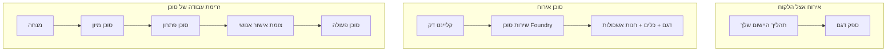
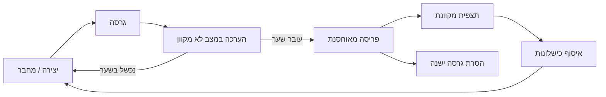
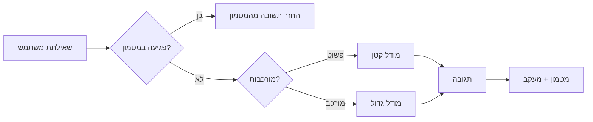
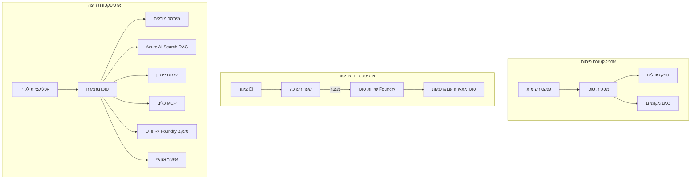

# פריסת סוכנים מדרגים עם Microsoft Foundry


עד לנקודה זו בקורס בנית סוכנים שרצים על המחשב הנייד שלך, בתוך פנקס רשימות, מונעים על ידי `az login` וכמה משתני סביבה. זו בדיוק הדרך הנכונה ללמוד. זו לא הדרך הנכונה להריץ סוכן שאלפי לקוחות סומכים עליו בשעה 3 לפנות בוקר.

השיעור הזה עוסק בפער בין "זה עובד על המחשב שלי" לבין "זה עובד, באופן אמין ומשתלם, בפרודקשן." אנחנו סוגרים את הפער הזה באמצעות **Microsoft Foundry** ו-**Microsoft Foundry Agent Service**, ועושים זאת על ידי בניית סוכן תמיכה בלקוחות אמיתי שיש לו כלים, אחזור, זיכרון, הערכה ומעקב.

## הקדמה

שיעור זה יכסה:

- ההבדל בין **סוכן אב-טיפוס** ל-**סוכן פרוס**, ולמה המעבר הוא בעיקר על כל מה שמסביב למודל.
- **דפוסי פריסה** לסוכנים: מתארח בצד הלקוח, מתארח כשרות (Hosted Agents), ומנוהל באמצעות זרימת עבודה.
- **מחזור החיים של הסוכן** ב-Microsoft Foundry — יצירה, גרסה, פריסה, הערכה, מעקב, פרישה.
- **אסטרטגיות מדרוג**: ניתוב מודלים, מטמון, ריבוי משימות, ועיצוב ללא מצב.
- **תצפית** עם OpenTelemetry ומעקב Foundry.
- **אופטימיזציית עלות** באמצעות בחירת מודל, ניתוב ושערי הערכה.
- **שיקולי ארגון**: ממשל, אישור אנושי, והרצת שרתי MCP בצורה בטוחה בפרודקשן.

## מטרות הלמידה

בסיום שיעור זה תלמד כיצד:

- לבחור את דפוס הפריסה המתאים לעומס העבודה של סוכן מסוים.
- לפרוס סוכן לשירות Microsoft Foundry Agent כך שיהיה בעל גרסאות, מתנהל וניתן לתצפית.
- לאבחן סוכן למעקב ולחבר צינור הערכה שרץ לפני כל שחרור.
- להחיל ניתוב מודלים ומטמון לשמירת זמן תגובה ועלות תחת שליטה בקנה מידה.
- להוסיף שער אישור אנושי לפעולות בסיכון גבוה ולשלב שרת MCP בדרך בטוחה לפרודקשן.

## דרישות מוקדמות

השיעור מניח שסיימת שיעורים קודמים ומכירים:

- בניית סוכנים עם [Microsoft Agent Framework](../14-microsoft-agent-framework/README.md) (שיעור 14).
- [שימוש בכלים](../04-tool-use/README.md) (שיעור 4) ו-[Agentic RAG](../05-agentic-rag/README.md) (שיעור 5).
- [זיכרון סוכן](../13-agent-memory/README.md) (שיעור 13) ו-[פרוטוקולים אזוריים / MCP](../11-agentic-protocols/README.md) (שיעור 11).
- [תצפית והערכה](../10-ai-agents-production/README.md) (שיעור 10) — שיעור זה בונה ישירות עליו.

תזדקק גם ל:

- **מנוי Azure** ו-**פרויקט Microsoft Foundry** עם לפחות מודל צ'אט פרוס אחד.
- Azure CLI מאומת (`az login`).
- Python 3.12+ והחבילות במאגר [`requirements.txt`](../../../requirements.txt).

## מאב-טיפוס לפרודקשן: מה באמת משתנה

סוכן אב-טיפוס וסוכן פרודקשן חולקים את הלולאה המרכזית זהה — חשיבה, קריאת כלים, תגובה. מה שמשתנה הוא כל מה שמסביב ללולאה הזו. המודל הוא אולי 20% מסוכן פרודקשן; ה-80% האחרים הם השלד התפעולי.

| דאגה | אב-טיפוס | פרודקשן |
| --- | --- | --- |
| **אירוח** | רץ בתוך פנקס הרשימות שלך | רץ כשירות מתארח, עם גרסאות ופריסה מבוקרת |
| **זיהוי** | טוקן `az login` שלך | זהות מנוהלת עם RBAC ממוקד |
| **מצב** | בזיכרון פנימי, אובד באתחול | מוחצן (מאגר תהליכים, שירות זיכרון) |
| **כשל** | רואים את ה-traceback | ניסיונות חוזרים, נשירות, תיבת דואר מתה, התראות |
| **עלות** | "כמה סנטים" | נמדד לפי בקשה, מנוהל, מטמון, תקציבי |
| **איכות** | בודקים בעין את הפלט | מוערך אוטומטית לפני כל שחרור |
| **אמון** | מאשרים כל פעולה בעצמכם | מדיניות + אישור אנושי בפעולות מסוכנות |

שמור טבלה זו בראש. כל נושא למטה מתאים לשורה אחת בטבלה.

## דפוסי פריסת סוכנים

יש שלושה דפוסים שתשתמש בהם, לרוב בשילוב.

### 1. סוכנים מתארחים בצד הלקוח

האובייקט של הסוכן חי בתוך תהליך האפליקציה *שלך*. הקוד שלך קורא לספק המודל ישירות; לולאת החשיבה רצה בשירות שלך. זה מה שכל שיעור קודם עשה.

- **שימוש** כאשר אתה צריך שליטה מלאה בלולאה, שכבת ביניים מותאמת, או שאתה משלב את הסוכן בתוך backend קיים.
- **פשרה**: אתה אחראי על המדרוג, מצב ועמידות בעצמך.

### 2. סוכנים מתארחים (Foundry Agent Service)

הסוכן *נרשם כמשאב* ב-Microsoft Foundry. Foundry מארח את לולאת החשיבה, מאחסן תהליכים, מאכף בטיחות תוכן ו-RBAC, ומציג את הסוכן בפורטל Foundry. האפליקציה שלך הופכת ללקוח דק שיוצר תהליכים וקורא תגובות.

- **שימוש** כאשר רוצים עמידות, תצפית מובנית, ממשל, ופחות שטח תפעולי.
- **פשרה**: פחות שליטה ברמת נמוכה בתמורה לסביבת הרצה מנוהלת.

### 3. זרימות עבודה של סוכנים

סוכנים וכלים מרובים מורכבים לגרף עם זרימת בקרה מפורשת — שלבים רציפים, הסתעפויות, נקודות אישור אנושיות, ונקודות בדיקה עמידות שניתן להשהות ולחדש. זו היכולת של Microsoft Agent Framework **Workflows** מוחלת בקנה מידה של פריסה.

- **שימוש** כאשר משימה בודדת כוללת מספר סוכנים מתמחים או דורשת שלב אישור באמצע.
- **פשרה**: יותר מרכיבים זזים; דורשת תצפית ברמת האורקסטרציה.



## מחזור החיים של הסוכן ב-Microsoft Foundry

פריסת סוכן אינה פעולה חד-פעמית של `push`. זאת לולאה, והיא נראית הרבה כמו מחזור שחרור תוכנה כי זו בדיוק מה שהיא.



הרעיון המרכזי, שנושא מ-[שיעור 10](../10-ai-agents-production/README.md): **הערכת מצב לא מקוונת היא שער, לא מחשבה מאוחרת.** גרסה חדשה של סוכן לא משוחררת אם לא עברה את סף ההערכה שלך. תצפית מקוונת מזינה כישלונות אמיתיים חזרה למערך המבחנים הלא מקוון. זו כל הלולאה.

## אסטרטגיות מדרוג

מדרוג של סוכן שונה ממדרוג API ללא מצב, משום שכל בקשה יכולה להפעיל מספר קריאות למודל וכלים יקרים. ארבע טכניקות נושאות את רוב העומס.

**טיפול בבקשות ללא מצב.** אל תשמור מצב per-user בזיכרון התהליך שלך. אחסן תהליכי שיחה במאגר Foundry או בשירות זיכרון כך שכל מופע יוכל לטפל בכל בקשה. זה מה שמאפשר לך מדרוג אופקי — הוסף מופעים, בלי session צמוד.

**ניתוב מודלים.** לא כל בקשה דורשת את המודל היקר והמסוגל ביותר שלך. נהל בקשות פשוטות — סיווג כוונה, תשובות עובדתיות קצרות — למודל קטן ומהיר, והשאר את המודל הגדול לחשיבה אמיתית. Foundry's **Model Router** יכול לעשות זאת עבורך, או שתוכל לבנות מסווג קל משקל בעצמך. תבנה גרסת DIY במעבדה.

**מטמון תגובה.** שאלות תמיכה רבות הן כמעט כפילויות ("איך אני מאפס סיסמה?"). אחסן תשובות לשאלות נפוצות והגש אותן ללא קריאה למודל כלל. אפילו אחוז פגיעות מטמון צנועה חותך משמעותית עלות וזמני תגובה.

**ריבוי משימות ולחץ חוזר.** לספקי מודל יש מגבלות קצב. גבול את הריבוי המשימות, השתמש בניסיונות חוזרים עם רטרייס אקספוננציאלי, וכשל בנעימות (תגובה "אנחנו מטפלים בזה" בתור מנצחת שגיאה 500).



## תצפית בפרודקשן

אי אפשר לתפעל מה שלא ניתן לראות. כפי שדובר בשיעור 10, Microsoft Agent Framework מפיק **OpenTelemetry** traces באופן טבעי — כל קריאת מודל, הפעלת כלי, ושלב אורקסטרציה הופכים לספאן. בפרודקשן מייצאים את הספאנים ל-Microsoft Foundry (או כל backend תואם OTel) כדי שתוכל:

- לעקוב אחרי תלונת לקוח בודדת מקצה לקצה בכל קריאה למודל וכלי.
- לצפות בעיכוב p50/p95 ובעלות לכל בקשה לאורך זמן.
- להתריע על שגיאות וחריגות עלויות לפני שמשתמשים (או הצוות הפיננסי) מבחינים.

```python
from agent_framework.observability import get_tracer

tracer = get_tracer()

with tracer.start_as_current_span("support_request") as span:
    span.set_attribute("customer.tier", "enterprise")
    span.set_attribute("routed.model", "gpt-5-nano")
    # ביצוע הסוכן מתועד אוטומטית בתוך תחום זה
```

מאפיינים כמו `customer.tier` ו-`routed.model` הופכים קיר של traces לשאלות שניתן לענות עליהן ("האם לקוחות ארגוניים מופנים מדי למודל הקטן?").

## אופטימיזציית עלות

העלות בסוכני פרודקשן נשלטת על ידי טוקנים. שלושה מנופים, לפי השפעה:

1. **גדל את המודל נכון.** מודל קטן שמצליח את שער ההערכה שלך הוא כמעט תמיד זול יותר מגדול שעובר גם כן. השתמש בהערכה כדי *להוכיח* שהמודל הקטן מספיק טוב, במקום לבחור בברירת המחדל — הכי גדול — משיקול זהירות.
2. **נתב לפי מורכבות.** כמו לעיל — שלם מחירי מודל גדול רק עבור בקשות שדורשות חשיבה של מודל גדול.
3. **מטמון באופן אגרסיבי.** קריאת המודל הזולה ביותר היא זו שאינה נעשית כלל.

שערי הערכה ושליטת עלות הן אותו משמעת שנראית משני זוויות: הערכה אומרת את *רצפת האיכות*, ניתוב ומטמון שומרים אותך קרוב ל-*העלות* של הרצפה הזו ככל האפשר.

## שיקולי פריסה ארגונית

**ממשל.** סוכנים מתארחים ירשו את RBAC, בטיחות התוכן, ורישום ביקורת של Foundry. תן לכל סוכן זהות מנוהלת עם המינימום הרשאות הנדרשות — גישה לקריאה בלבד לבסיס הידע, גישה ממוקדת ל-API ניהול הפניות, ולא יותר.

**אנושי בלולאה.** יש פעולות שחשיבותן רבה מדי כדי לאוטומט אותן לגמרי — הוצאת החזר כספי, מחיקת חשבון, עלייה לצוות משפטי. Microsoft Agent Framework תומך בכלים שדורשים **אישור**: הסוכן מציע את הפעולה, ההרצה נעצרת, אדם מאשר או דוחה, וזרימת העבודה ממשיכה. ראית את הפרימיטיב בשיעור [6](../06-building-trustworthy-agents/README.md); כאן אתה מפרסמו.

**MCP בפרודקשן.** [MCP](../11-agentic-protocols/README.md) מאפשר לסוכן שלך לצרוך כלים חיצוניים דרך ממשק סטנדרטי. בפרודקשן, התייחס לכל שרת MCP כגבול לא מהימן: נעץ את גרסת השרת, הרץ אותו עם זהות ממוקדת, אמת את הפלטים שלו, ואל תחשוף לו סודות. שרת MCP הוא תלות, ותלויות מתעדכנות, מתוחקרות ומוגבלות בקצב.



שלוש התרשימים האלה — פיתוח, פריסה, זמן ריצה — הם אותו סוכן בשלבים שונים של חייו. המעבדה הבאה מטפלת בבנייתו שלב אחר שלב.

## מעבדה מעשית: סוכן תמיכה בלקוחות מוכן לפרודקשן

פתח את [`code_samples/16-python-agent-framework.ipynb`](./code_samples/16-python-agent-framework.ipynb) ועבור עליו מתחילתו ועד סופו. תבנה **סוכן תמיכה ללקוחות Contoso** עם כל חשש לפרודקשן מחובר:

1. **קריאת כלי** — בדוק סטטוס הזמנה ופתח פניות תמיכה.
2. **RAG** — מענה לשאלות מדיניות מבסיס ידע (Azure AI Search, עם אופציית נפילה בזיכרון כדי שהפנקס ירוץ ללא משאב חיפוש).
3. **זיכרון** — זכר את הלקוח בין הפניות בשיחה.
4. **ניתוב מודלים** — מסווג מורכבות מנתב כל בקשה למודל קטן או גדול.
5. **מטמון תגובה** — שאלות חוזרות מוגשות מהמטמון.
6. **אישור אנושי** — החזרות מעל סף נעצרות לאישור אנושי.
7. **צינור הערכה** — מערך מבחן קטן לא מקוון מדרג ומגן על השחרור.
8. **תצפית** — OpenTelemetry עוקב אחרי כל בקשה.

### הליכה צעד אחר צעד

הפנקס מאורגן כך שכל חשש לפרודקשן הוא קטע עצמאי והריץ. הלב שלו הוא המטפל בבקשה שמשלב ניתוב ומטמון:

```python
async def handle_support_request(query: str, customer_id: str) -> str:
    # 1. לשרת מהמטמון כאשר אפשר.
    cached = response_cache.get(normalize(query))
    if cached:
        return cached

    # 2. למסור לפי מורכבות כדי לשלוט בעלות.
    model = "gpt-5-nano" if is_simple(query) else "gpt-5-mini"

    # 3. להריץ את הסוכן בתוך טווח עקיבה לניטור.
    with tracer.start_as_current_span("support_request") as span:
        span.set_attribute("routed.model", model)
        span.set_attribute("customer.id", customer_id)
        response = await support_agent.run(query, model=model)

    # 4. לאחסן במטמון ולהחזיר.
    response_cache.set(normalize(query), response.text)
    return response.text
```

שער ההערכה המגן על שחרור נראה כך:

```python
async def evaluation_gate(agent, test_cases, threshold: float = 0.8) -> bool:
    passed = 0
    for case in test_cases:
        result = await agent.run(case["input"])
        if score_response(result.text, case["expected"]) >= 0.8:
            passed += 1
    pass_rate = passed / len(test_cases)
    print(f"Evaluation pass rate: {pass_rate:.0%} (gate: {threshold:.0%})")
    return pass_rate >= threshold  # לפרוס רק אם השער עובר
```

קרא כל שורה — הפנקס שומר את הפרימיטיבים קטנים בכוונה כדי ששום דבר לא יוסתר בקריאה למסגרת.

## אימות סוכן פרוס עם מבחני עשן

שער ההערכה שלמעלה רץ *לא מקוון* נגד האובייקט של הסוכן שלך. ברגע שהסוכן פרוס כסוכן מתארח, אתה צריך בדיקה אחת נוספת, אפילו זולה יותר: **האם נקודת הקצה הפרוסה באמת עונה?**

פריסה "מוצלחת" רק מוכיחה שמישור הבקרה קיבל את ההגדרה — זה לא מוכיח שהסוכן מגיב. תלות חסרה, ניתוב מודל שגוי, או חיבור שפג תוקפו יכולות להשאיר פריסה ירוקה שמחזירה כלום. **מבחן עשן** תופס זאת תוך שניות, בכל פריסה, ללא העלות של הערכה מלאה.

מאגר זה כולל צינור מבחן עשן מוכן לשימוש שנבנה על פעולת GitHub של [AI Smoke Test](https://github.com/marketplace/actions/ai-smoke-test):

- **קטלוג** — [`tests/lesson-16-smoke-tests.json`](../../../tests/lesson-16-smoke-tests.json) מכיל בקשות ואישורים לסוכן התמיכה של Contoso (תשובות מדיניות מבוססות, חיפוש הזמנה, שמירה על הנושא, ורציפות שיחה מרובת סבבים). קטלוגים לסוכנים של שיעורים אחרים נמצאים לצידו — ראה [`tests/README.md`](../tests/README.md).
- **זרימת עבודה** — [`.github/workflows/smoke-test.yml`](../../../.github/workflows/smoke-test.yml) נכנס עם Azure OIDC ושולח כל בקשה לנקודת תגובות הסוכן, ומכשל את העבודה על כל פגם באישור.

```yaml
- name: Smoke-test hosted agent
  uses: JFolberth/ai-smoketest@v1
  with:
    project_endpoint: ${{ inputs.project_endpoint }}
    agent_name: ContosoSupportAgent
    tests_file: tests/lesson-16-smoke-tests.json
```


הפעל את זה מהכרטיסייה **Actions** ברגע שסוכן שלך פועל, והזן את נקודת הקצה של פרויקט Foundry ואת שם הסוכן שלך. זהות מאוחדת צריכה לקבל את תפקיד **Azure AI User** בהיקף פרויקט Foundry. חשוב על השכבות כמו פירמידה: בדיקות עשן (זמין ומגיב?) מתבצעות בכל פרסום, הערכה לא מקוונת (טובה מספיק למשלוח?) מתבצעת לפני קידום, והערכה מקוונת (איך זה מתפקד בשטח?) מתבצעת כל העת.

## בדיקת ידע

בדוק את הבנתך לפני המעבר למשימה.

**1. בערך כמה מהסוכן שמופעל בפועל הוא "המודל," ומהו השאר?**

<details>
<summary>תשובה</summary>

המודל הוא מיעוט במערכת — מצוטט לעיתים קרובות ככ-20%. השאר הוא השלד התפעולי: אירוח וניהול גרסאות, זהות וניהול הרשאות מבוסס תפקיד (RBAC), מצב מאוחסן חיצונית, טיפול בכשלים, מעקב אחר עלויות, הערכה, ובקרות עם מעורבות אדם בלולאה. המעבר לייצור הוא בעיקר בניית הכל *מסביב* ללולאת ההסקה.
</details>

**2. מתי תבחר סוכן Hosted Agent על פני סוכן שמופעל בצד הלקוח?**

<details>
<summary>תשובה</summary>

כשאתה רוצה סביבת ריצה מנוהלת עם עמידות מובנית (תהליכים שנמשכים ויכולים להתחדש), נגישות, בטיחות תוכן, ו-RBAC, ואתה מוכן לוותר על מעט שליטה ברמת הלולאת ההסקה לטובת הפחתת המורכבות התפעולית. סוכן שמופעל בצד הלקוח מתאים יותר כאשר אתה צריך שליטה מלאה על הלולאה או משלב את הסוכן במערכת קיימת.
</details>

**3. מדוע סוכן שניתן להרחבה חייב להיות חסר-מצב בזיכרון התהליך שלו?**

<details>
<summary>תשובה</summary>

כדי שכל מופע יוכל לטפל בכל בקשה, מה שמאפשר הרחבה אופקית ללא מושבים דביקים. מצב השיחה לכל משתמש מיוצא לשמירת תהליכים או שירות זיכרון חיצוני. אם המצב היה נשמר בזיכרון התהליך, היית מאבד אותו באתחול ולא יכולת לחלק עומסים בחופשיות.
</details>

**4. איזו בעיה פתר מסלול המודל, ואיך זה קשור להערכה?**

<details>
<summary>תשובה</summary>

המסלול שולח בקשות פשוטות למודל קטן, זול ומהיר ושומר את המודל הגדול להסקה אמיתית, מה ששולט גם בלייטנס וגם בעלויות. זה קשור להערכה כי ההערכה היא מה שמוכיח שהמודל הקטן טוב מספיק לסוג של בקשות — מסלול ללא הערכה הוא ניחוש.
</details>

**5. מהי "שער הערכה" ואיפה הוא נמצא במחזור החיים?**

<details>
<summary>תשובה</summary>

שער הערכה מריץ סט מבחנים לא מקוון נגד גרסה חדשה של סוכן וחוסם פריסה אלא אם שיעור המעבר עובר סף מסוים. הוא נמצא בין "גרסה" ל"הפעלה" במחזור החיים, ומהווה תנאי מוקדם לאיכות לשחרור במקום בדיקה לאחר השחרור.
</details>

**6. מדוע יש לטפל בשרת MCP כגבול לא מהימן בייצור?**

<details>
<summary>תשובה</summary>

כי זו תלות חיצונית שהסוכן שלך קורא לה. יש לקבע את גרסתה, להריץ אותה עם זהות מוגבלת, לאמת את הפלט שלה, להגביל קצב, ולא לחשוף לה סודות — אותו משמעת שחלה על כל תלות צד שלישי. הפלט שלה מוזרם לתוך ההסקה של הסוכן, לכן אמון לא מאומת מהווה סיכון אבטחה.
</details>

**7. איזו שינוי יחיד בדרך כלל משפיע הכי הרבה על עלות הסוכן בייצור, ולמה?**

<details>
<summary>תשובה</summary>

התאמת גודל המודל — שימוש במודל הקטן ביותר שעובר את שער ההערכה שלך. העלות נשלטת ע"י טוקנים, ומודל קטן שעונה על רמת האיכות כמעט תמיד זול יותר מגדול. מטמון ומסלול מפחיתים עוד עלויות, אבל בחירת המודל היסודי הנכון היא ההשפעה הגדולה ביותר.
</details>

**8. איזו תפקיד יש לתכונות קצה כמו `customer.tier` ו-`routed.model` בנגישות?**

<details>
<summary>תשובה</summary>

הן הופכות עקבות גולמיים לשאלות עסקיות שניתן לענות עליהן. בלי תכונות יש לך חומת קצה; איתן ניתן לשאול "האם לקוחות ארגוניים מנותבים למודל הקטן יותר לעיתים קרובות מדי?" או "איזה מודל מטפל בבקשות האיטיות ביותר שלנו?" תכונות הן האופן בו אתה חותך את הטלמטריה לפי הממדים החשובים לתפעול שלך.
</details>

## משימה

קח את סוכן התמיכה בלקוחות מהמעבדה וחזק אותו לתרחיש מסוים: **סוכן תמיכה לחיוב במנוי עבור חברת SaaS.**

ההגשה שלך צריכה:

1. **להחליף את הכלים** בכלים רלוונטיים לחיוב: `get_subscription_status`, `get_invoice`, ו-`issue_credit` (אשראי מעל 50$ דורש אישור אנושי).
2. **להוסיף שלושה מסמכי RAG** המכסים את מדיניות ההחזרות, מחזור החיוב, ומדיניות הביטול של החברה.
3. **להרחיב את סט ההערכה** לפחות לשמונה מקרים, כולל לפחות שתיים שצריכות לגרום לנתיב אישור אנושי, ואשר לאשר שער ההערכה שלך נכונה.
4. **להוסיף דוח עלויות אחד**: לאחר הרצת עשר שאילתות מעורבות דרך הסוכן, הדפס כמה הופנו למודל הקטן, כמה למודל הגדול וכמה הוגשו מהמטמון.

כתוב פסקה קצרה (בתא markdown) המסבירה איזו כלל ניתוב מודל בחרת ואיך תאמת את זה עם תנועה אמיתית. אין תשובה נכונה יחידה — אתה מוערך לפי האם הדאגות בייצור מחוברות באופן קוהרנטי.

## סיכום

בשיעור הזה העברת סוכן מפרוטוטיפ לייצור עם Microsoft Foundry:

- המעבר לייצור הוא בעיקר על **השלד התפעולי** מסביב למודל — אירוח, זהות, מצב, טיפול בכשלים, עלות, איכות ואמון.
- למדת את שלוש **תבניות הפריסה** — סוכן שמופעל בצד הלקוח, Hosted Agents, ו-Agent Workflows — ומתי כל אחת מתאימה.
- הלכת ב**מחזור חיי הסוכן**, שבו **הערכה לא מקוונת משמשת כשער שחרור** ונגישות מקוונת מאכילה כשלים חזרה לסט המבחנים.
- יישמת **אסטרטגיות הסקיילינג** — עיצוב חסר-מצב, ניתוב מודלים, מטמון, ומקביליות מוגבלת — וחיברת אותם ל**אופטימיזציה של עלויות**.
- שילבת **בקרות ארגוניות**: RBAC, אישור אדם בלולאה ושילוב בטוח של MCP בייצור.
- בנית סוכן תמיכה בלקוחות המוכן לייצור המחבר את כל הדאגות הללו בקוד פועל.

השיעור הבא עושה את המסע ההפוך: במקום להרחיב סוכנים לענן, תוריד אותם למכונת מפתח אחת ותפעיל אותם מקומית לחלוטין.

## משאבים נוספים

- <a href="https://learn.microsoft.com/azure/ai-foundry/what-is-azure-ai-foundry" target="_blank">תיעוד Microsoft Foundry</a>
- <a href="https://learn.microsoft.com/azure/ai-foundry/agents/overview" target="_blank">סקירה כללית של שירות סוכני Microsoft Foundry</a>
- <a href="https://learn.microsoft.com/en-us/agent-framework/overview/?wt.mc_id=youtube_26688_organicsocial_reactor&pivots=programming-language-python" target="_blank">Microsoft Agent Framework</a>
- <a href="https://learn.microsoft.com/azure/ai-foundry/concepts/model-router" target="_blank">נתב מודלים ב-Microsoft Foundry</a>
- <a href="https://learn.microsoft.com/azure/search/search-what-is-azure-search" target="_blank">חיפוש Azure AI</a>
- <a href="https://opentelemetry.io/" target="_blank">OpenTelemetry</a>
- <a href="https://github.com/marketplace/actions/ai-smoke-test" target="_blank">פעולת GitHub של AI Smoke Test</a>
- <a href="https://modelcontextprotocol.io/" target="_blank">פרוטוקול הקשר של מודל (MCP)</a>

## שיעור קודם

[בניית סוכני שימוש במחשב (CUA)](../15-browser-use/README.md)

## שיעור הבא

[יצירת סוכני AI מקומיים](../17-creating-local-ai-agents/README.md)

---

<!-- CO-OP TRANSLATOR DISCLAIMER START -->
**כתב ויתור**:
מסמך זה תורגם באמצעות שירות תרגום אוטומטי [Co-op Translator](https://github.com/Azure/co-op-translator). למרות שאנו שואפים לדיוק, יש לקחת בחשבון שתרגומים אוטומטיים עלולים להכיל שגיאות או אי-דיוקים. יש להחשיב את המסמך המקורי בשפתו הטבעית כמקור הסמכות. למידע קריטי מומלץ להשתמש בתרגום מקצועי על ידי מתרגם אדם. אנו לא אחראים לכל אי-הבנה או פירוש שגוי הנובע מהשימוש בתרגום זה.
<!-- CO-OP TRANSLATOR DISCLAIMER END -->