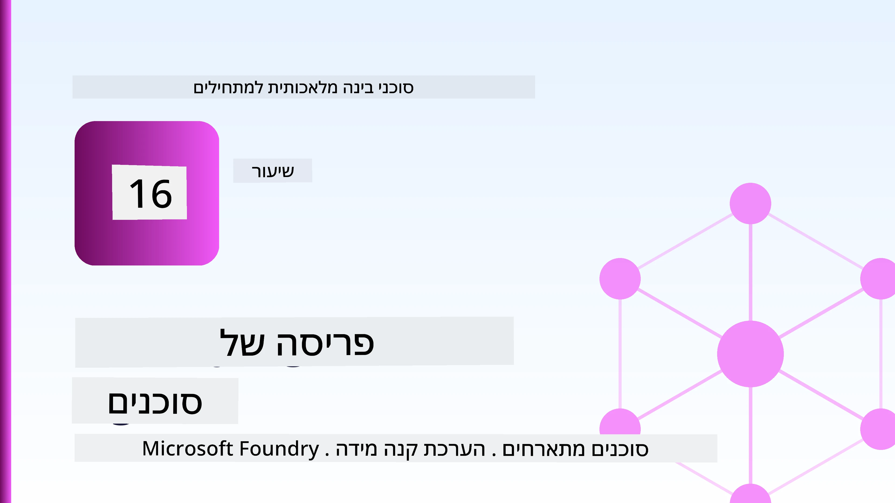
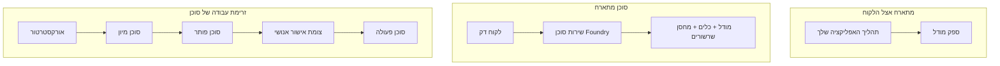
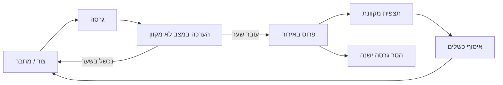
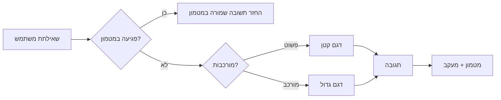
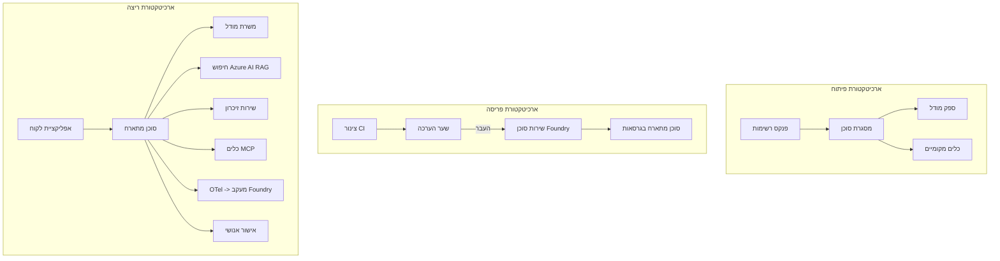

# פריסת סוכנים מדרגיים עם Microsoft Foundry



עד לנקודה זו בקורס בנית סוכנים שפועלים על המחשב הנייד שלך, בתוך מחברת, מונעים על ידי `az login` וכמה משתני סביבה. זו בדיוק הדרך הנכונה ללמוד. זו לא הדרך הנכונה להפעיל סוכן שאלפי לקוחות תלויים בו בשעה 3 לפנות בוקר.

השיעור הזה עוסק בפער בין "זה עובד על המחשב שלי" ל"זאת עובדת, בצורה אמינה וזולה, בייצור." אנו סוגרים את הפער הזה באמצעות **Microsoft Foundry** ו-**Microsoft Foundry Agent Service**, ועושים זאת על ידי בניית סוכן תמיכה ללקוח אמיתי שיש לו כלים, אחזור מידע, זיכרון, הערכה ומעקב.

## הקדמה

השיעור יכלול:

- ההבדל בין **סוכן אב-טיפוס** ל**סוכן מתפרס**, ולמה המעבר קשור בעיקר לכל מה ש*מסביב* למודל.
- **דפוסי פריסה** לסוכנים: אירוח בלקוח, אירוח כשירות (Hosted Agents), וזרימות עבודה מתוזמנות.
- **מחזור חיי הסוכן** ב-Microsoft Foundry — יצירה, גרסאות, פריסה, הערכה, מעקב, הפסקה.
- **אסטרטגיות מדרוג**: ניתוב מודל, מטמון, תחרות, ועיצוב ללא מצב.
- **מעקב** עם OpenTelemetry ו-Founry tracing.
- **אופטימיזציית עלות** דרך בחירת מודל, ניתוב וסינון הערכה.
- **שיקולי ארגון**: ממשל, אישור אנושי, והרצת שרתי MCP בצורה בטוחה בייצור.

## מטרות למידה

לאחר השלמת שיעור זה, תדע כיצד:

- לבחור את דפוס הפריסה המתאים לעומס העבודה של סוכן מסוים.
- לפרוס סוכן לשירות הסוכנים של Microsoft Foundry כך שהוא יהיה בגרסה, נתון לממשל וניתן למעקב.
- לאפשר מעקב אחרי הסוכן ולחבר צינור הערכה שפועל לפני כל גרסה.
- ליישם ניתוב מודל ומטמון כדי לשמור על זמן תגובה ועלות תחת שליטה בקנה מידה גדול.
- להוסיף שער אישור אנושי לפעולות בסיכון גבוה ולשלב שרת MCP באופן בטוח בייצור.

## דרישות מוקדמות

שיעור זה מניח שסיימת את השיעורים הקודמים ואתה שולט ב:

- בניית סוכנים עם [Microsoft Agent Framework](../14-microsoft-agent-framework/README.md) (שיעור 14).
- [שימוש בכלים](../04-tool-use/README.md) (שיעור 4) ו-[Agentic RAG](../05-agentic-rag/README.md) (שיעור 5).
- [זיכרון סוכן](../13-agent-memory/README.md) (שיעור 13) ו[פרוטוקולים סוכניים / MCP](../11-agentic-protocols/README.md) (שיעור 11).
- [מעקב והערכה](../10-ai-agents-production/README.md) (שיעור 10) — השיעור הזה בונה ישירות עליו.

גם תזדקק ל:

- **מנוי Azure** ו-**פרויקט Microsoft Foundry** עם לפחות דגם צ'אט אחד מתפרס.
- כלי שורת הפקודה של Azure מאומת (`az login`).
- Python 3.12+ והחבילות במאגר [`requirements.txt`](../../../requirements.txt).

## מאב-טיפוס לייצור: מה משתנה בפועל

סוכן אב-טיפוס וסוכן ייצור חולקים את הלולאה המרכזית — הסקת מסקנות, קריאת כלים, תגובה. מה שמשתנה הוא כל מה שמסביב ללולאה הזו. המודל הוא אולי 20% מסוכן בייצור; ה-80% האחרים הם השלד התפעולי.

| נושא | אב-טיפוס | ייצור |
| --- | --- | --- |
| **אירוח** | פועל במחברת שלך | פועל כשירות מופעל ומנותב בגרסאות |
| **זהות** | אסימון `az login` שלך | זהות מנוהלת עם RBAC ממוקד |
| **מצב** | בזיכרון, אובדן באתחול | מחוץ לזיכרון (מאגר שרשור, שירות זיכרון) |
| **כישלון** | אתה רואה את ה-traceback | ניסיונות חוזרים, גיבוי, תיבות דואר למות, התראות |
| **עלות** | "זה כמה סנטים" | מתועד לפי בקשה, מנותב, מתוחזק, מוגבל תקציב |
| **איכות** | אתה מסתכל ידנית על התוצאה | מוערך אוטומטית לפני כל שחרור |
| **אמון** | אתה מאשר כל פעולה | מדיניות + אדם במחזור לפעולות מסוכנות |

זכור טבלה זו. כל סעיף להלן מתייחס לאחד מהשורות בה.

## דפוסי פריסת סוכן

יש שלושה דפוסים שבהם תשתמש, לעיתים בשילוב.

### 1. סוכני אירוח בלקוח

אובייקט הסוכן חי בתהליך היישום *שלך*. הקוד שלך קורא ישירות לספק המודל; לולאת ההסקה פועלת בשירות שלך. זה מה שכל השיעורים הקודמים עשו.

- **השימוש בהם כש** אתה צריך שליטה מלאה בלולאה, middleware מותאם אישית, או כשאתה משתלב בתוך backend קיים.
- **חיסרון**: אתה אחראי על המדרוג, המצב והיציבות בעצמך.

### 2. סוכנים מאוחסנים (Foundry Agent Service)

הסוכן *נרשם כמשאב* ב-Microsoft Foundry. Foundry מאחסנת את לולאת ההסקה, מאחסנת שרשורים, אוכפת בטיחות תוכן ו-RBAC, והופכת את הסוכן לנראה בפורטל Foundry. האפליקציה שלך הופכת ללקוח דק שיוצר שרשורים וקורא תגובות.

- **השימוש בהם כש** אתה רוצה עמידות, מעקב מובנה, ממשל, ופחות שטח תפעולי.
- **חיסרון**: פחות שליטה נמוכה ברמה בתמורה לסביבת ריצה מנוהלת.

### 3. זרימות עבודה של סוכן

מספר סוכנים (וכלים) מורכבים לגרף עם זרימת שליטה מפורשת — צעדים סדרתיים, הסתעפויות, צמתים לאישור אנושי, ונקודות בדיקה שהן עמידות וניתנות להפסקה ולהמשך. זו יכולת ה-**Workflows** של Microsoft Agent Framework המיושמת בקנה מידה לפריסה.

- **השימוש בהם כש** משימה יחידה מכסה כמה סוכנים מומחים או דורשת שלב אישור באמצע.
- **חיסרון**: יותר חלקים נעים; זקוק למעקב ברמת האורקסטרציה.



## מחזור חיי הסוכן ב-Microsoft Foundry

פריסת סוכן אינה פעולה חד-פעמית של `push`. זו לולאה, ונראית הרבה כמו מחזור שחרור תוכנה כי זה בדיוק מה שהיא.



הרעיון המרכזי, שמקורו ב-[שיעור 10](../10-ai-agents-production/README.md): **הערכת מצב לא מקוונת היא שער, לא דבר מזניח.** גרסה חדשה של סוכן לא משוחררת אלא אם כן היא עוברת את ספי ההערכה שלך. המעקב המקוון מזין את הכישלונות בעולם האמיתי חזרה למערך הבדיקות הלא מקוון. זו כל הלולאה.

## אסטרטגיות מדרוג

מדרוג סוכן שונה ממדרוג API ללא מצב, כי כל בקשה יכולה לגרום להרבה קריאות מודל וכלים יקרים. ארבע טכניקות סוחבות את רוב העומס.

**טיפול בבקשות ללא מצב.** שמור על מצבה של שום משתמש בזיכרון התהליך שלך. שמור את השרשורים בשירות Foundry או בשירות זיכרון כך שכל מופע יוכל לטפל בכל בקשה. זה מה שמאפשר מדרוג אופקי — הוסף מופעים, ללא מפגשי מדבקה.

**ניתוב מודל.** לא כל בקשה צריכה את המודל היעיל והיקר ביותר שלך. ניתוב בקשות פשוטות — סיווג כוונה, תשובות קצרות עובדתיות — למודל קטן ומהיר, ושמור את המודל הגדול להסקת מסקנות אמיתית. **Model Router** של Foundry יכול לעשות זאת עבורך, או שאתה יכול לממש מסווג קל-משקל בעצמך. תבנה את הגרסה העצמית במעבדה.

**מטמון תגובות.** הרבה שאלות תמיכה הן כמעט כפילויות ("איך אני מאפס את הסיסמא שלי?"). מטמֵן תשובות לשאלות נפוצות ומשרת אותן מבלי לפנות למודל בכלל. אפילו שיעור פגיעה צנוע במטמון חותך משמעותית עלות ושליחות.

**תחרות ולחץ-גב.** לספקי מודלים יש מגבלות קצב. גבול את התחרות שלך, השתמש בניסיונות חוזרים עם גבול אקספוננציאלי, וכשל בחן (תגובה בתור "אנחנו עובדים על זה" עדיפה על שגיאה 500).



## מעקב בייצור

אי אפשר לתפעל מה שלא ניתן לראות. כפי שכוסה בשיעור 10, Microsoft Agent Framework מפיק מעקבים של **OpenTelemetry** באופן טבעי — כל קריאת מודל, קריאת כלי, וצעדי אורקסטרציה הופכים לטווח. בייצור אתה מייצא את הטווחים האלה ל-Microsoft Foundry (או לכל backend תואם OTel) כדי שתוכל:

- לעקוב אחרי תלונת לקוח בודדת מקצה לקצה בכל קריאת מודל וכלי.
- לצפות ב-p50/p95 של זמן תגובה ועלות לפי בקשה לאורך זמן.
- להתריע על זינוקים בשיעורי שגיאות ואנומליות עלות לפני שהמשתמשים שלך (או צוות הכספים) מבחינים.

```python
from agent_framework.observability import get_tracer

tracer = get_tracer()

with tracer.start_as_current_span("support_request") as span:
    span.set_attribute("customer.tier", "enterprise")
    span.set_attribute("routed.model", "gpt-5-nano")
    # ביצוע הסוכן מיועד באופן אוטומטי בתוך טווח זה
```

מאפיינים כמו `customer.tier` ו-`routed.model` הם מה שהופך חומת מעקבים לשאלות ניתנות למענה ("האם לקוחות ארגוניים מנותבים יותר מדי למודל הקטן?").

## אופטימיזציית עלות

העלות בסוכני ייצור נשלטת על ידי טוקנים. שלושה מנופים, בסדר השפעה:

1. **גודל נכון של המודל.** מודל קטן שעובר את שער ההערכה שלך כמעט תמיד זול יותר ממודל גדול שעובר גם כן. השתמש בהערכה כדי *להוכיח* שהמודל הקטן טוב מספיק במקום לבחור כברירת מחדל במודל הכי גדול מתוך זהירות.
2. **ניתוב לפי מורכבות.** כמו למעלה — שלם מחיר של מודל גדול רק עבור בקשות שדורשות הסקה במודל גדול.
3. **מטמון באגרסיביות.** קריאת המודל הזולה ביותר היא זו שמעולם לא עשית.

שערי הערכה ושליטה על עלות הם אותו משמעת שנצפית משתי זוויות: הערכה מראה את *רצפת האיכות*, ניתוב ומטמון שומרים על עלות קרובה ככל האפשר לרצפה הזו.

## שיקולי פריסה ארגוניים

**ממשל.** סוכני אירוח יורשים RBAC, בטיחות תוכן ויומני ביקורת של Foundry. תן לכל סוכן זהות מנוהלת עם ההרשאות המינימליות שהוא צריך — גישה לקריאה בלבד למאגר הידע, גישה ממוקדת ל-API של מערכת הכרטיסים, ולא מעבר.

**אדם במחזור.** יש פעולות שהן משמעותיות מדי לאוטומציה ישירה — החזרת כספים, מחיקת חשבון, העלאה לצוות משפטי. Microsoft Agent Framework תומך בכלים שדורשים **אישור**: הסוכן מציע את הפעולה, ההרצה נעצרת, אדם מאשר או דוחה, וזרימת העבודה נמשכת. ראית את הפרימיטיב ב-[שיעור 6](../06-building-trustworthy-agents/README.md); כאן אתה מפעיל אותו.

**MCP בייצור.** [MCP](../11-agentic-protocols/README.md) מאפשר לסוכן שלך לצרוך כלים חיצוניים דרך ממשק סטנדרטי. בייצור, התייחס לכל שרת MCP כרצועה לא מהימנה: תקבע את גרסת השרת, תריץ אותו עם זהות ממוקדת, תוודא את הפלטים שלו, ואל תחשוף לו סודות אף פעם. שרת MCP הוא תלות, ותלויות מתוקנות, מוגברות ומוגבלות קצב.



שלושת התרשימים האלה — פיתוח, פריסה, ריצה — הם אותו סוכן בשלושה שלבים בחייו. המעבדה להלן מלווה אותך בבנייתו.

## מעבדה מעשית: סוכן תמיכת לקוחות מוכן לייצור

פתח [`code_samples/16-python-agent-framework.ipynb`](./code_samples/16-python-agent-framework.ipynb) ועבוד בו מקצה לקצה. תאסף סוכן תמיכת לקוחות **Contoso** עם כל שיקול ייצור מחובר:

1. **קריאת כלים** — חיפוש סטטוס הזמנה ופתיחת כרטיס תמיכה.
2. **RAG** — מענה על שאלות מדיניות מתוך מאגר ידע (Azure AI Search, עם נקודת חזרה בזיכרון כדי שהמחברת תרוץ ללא משאב Search).
3. **זיכרון** — זכור את הלקוח בין סבבי שיחה.
4. **ניתוב מודל** — מסווג מורכבות מנותב כל בקשה למודל קטן או גדול.
5. **מטמון תגובות** — שאלות חוזרות מוגשות מהמטמון.
6. **אישור אנושי** — החזרים מעל סף מחכים לאישור אנושי.
7. **צינור הערכה** — מערך בדיקה קטן לא מקוון מדרג את הסוכן ופועל כשער שחרור.
8. **מעקב** — מעקב OpenTelemetry סביב כל בקשה.

### הדרכה

המחברת מאורגנת כך שכל שיקול ייצור הוא חלק עצמאי והריץ. הלב שלה הוא מטפל בבקשה עם ניתוב ומטמון:

```python
async def handle_support_request(query: str, customer_id: str) -> str:
    # 1. לשרת מהמטמון מתי שאפשר.
    cached = response_cache.get(normalize(query))
    if cached:
        return cached

    # 2. לנתב לפי מורכבות כדי לשלוט בעלות.
    model = "gpt-5-nano" if is_simple(query) else "gpt-5-mini"

    # 3. להריץ את הסוכן בתוך טווח מעקב לצורך נראות.
    with tracer.start_as_current_span("support_request") as span:
        span.set_attribute("routed.model", model)
        span.set_attribute("customer.id", customer_id)
        response = await support_agent.run(query, model=model)

    # 4. לבצע מטמון ולהחזיר.
    response_cache.set(normalize(query), response.text)
    return response.text
```

שער ההערכה ששומר על השחרור נראה כך:

```python
async def evaluation_gate(agent, test_cases, threshold: float = 0.8) -> bool:
    passed = 0
    for case in test_cases:
        result = await agent.run(case["input"])
        if score_response(result.text, case["expected"]) >= 0.8:
            passed += 1
    pass_rate = passed / len(test_cases)
    print(f"Evaluation pass rate: {pass_rate:.0%} (gate: {threshold:.0%})")
    return pass_rate >= threshold  # לפרוס רק אם השער מצליח
```

קרא כל שורה — המחברת שומרת על הפונקציות הבסיסיות קטנות בכוונה כדי שלא יסתיר דבר מאחורי קריאת מסגרת.

## אימות סוכן מתפרס עם בדיקות עשן

שער ההערכה למעלה רץ *לא מקוון* מול אובייקט הסוכן שלך. כאשר הסוכן מתפרס כסוכן אירוח, אתה צריך בדיקה נוספת, אפילו זולה יותר: **האם נקודת הקצה המתפרסת אכן עונה?**

פריסה "מוצלחת" מוכיחה רק שמישור הבקרה קיבל את ההגדרה — היא לא מוכיחה שהסוכן מגיב. תלות חסרה, ניתוב מודל לא נכון, או חיבור שפג תוקפו יכולים להשאיר פריסה ירוקה שמחזירה כלום. **בדיקת עשן** תופסת זאת בשניות, בכל פריסה, בלי עלות של הערכה מלאה.

מאגר זה מספק צינור בדיקות עשן מוכן לשימוש מבוסס על פעולה GitHub [AI Smoke Test](https://github.com/marketplace/actions/ai-smoke-test):

- **קטלוג** — [`tests/lesson-16-smoke-tests.json`](../../../tests/lesson-16-smoke-tests.json) כולל הנחיות ואישורים לסוכן התמיכה של Contoso (תשובות מדיניות מושרשות, חיפוש הזמנה, שמירה על נושא, ורצף שיחה רב-סיבובי). קטלוגים לסוכנים של שיעורים אחרים נמצאים לצידו — ראה [`tests/README.md`](../tests/README.md).
- **זרימת עבודה** — [`.github/workflows/smoke-test.yml`](../../../.github/workflows/smoke-test.yml) מתחברת עם Azure OIDC ושולחת POST לכל הנחיה לנקודת הקצה Responses של הסוכן, ומכשלת את העבודה בכל פספוס.

```yaml
- name: Smoke-test hosted agent
  uses: JFolberth/ai-smoketest@v1
  with:
    project_endpoint: ${{ inputs.project_endpoint }}
    agent_name: ContosoSupportAgent
    tests_file: tests/lesson-16-smoke-tests.json
```


הפעל את זה מכרטיסיית **Actions** ברגע שהסוכן שלך מופעל, תוך מתן נקודת קצה של פרויקט Foundry ושם הסוכן. הזהות המאוחדת צריכה את התפקיד **Azure AI User** בהיקף פרויקט Foundry. חשבו על השכבות כמו פירמידה: בדיקות עישון (ניתן להגיע ומגיב?) רצות על כל פריסה, הערכה לא מקוונת (טוב מספיק למשלוח?) רצה לפני קידום, והערכה מקוונת (איך זה מתפקד בשטח?) רצה באופן מתמשך.

## בדיקת ידע

בדוק את הבנתך לפני המעבר למשימה.

**1. בערך כמה מהסוכן בפרודקשן הוא "המודל", ומה השאר?**

<details>
<summary>תשובה</summary>

המודל הוא מיעוט במערכת — בדרך כלל מצוטט בכ-20%. השאר הוא השלד התפעולי: אירוח וניהול גרסאות, זהות ו-RBAC, מצב חיצוני, טיפול בכשלים, מעקב עלויות, הערכה, ובקרות עם מעורבות אדם. המעבר לפרודקשן הוא בעיקר בניית הכל *סביב* לולאת ההסקה.
</details>

**2. מתי תבחר סוכן מאוחסן על פני סוכן מתארח לקוח?**

<details>
<summary>תשובה</summary>

כאשר אתה רוצה סביבת ריצה מנוהלת עם עמידות מובנית (תהליכים שנשמרים ויכולים להמשיך), ניתור, בטיחות תוכן ו-RBAC, ואתה מוכן לוותר על מעט שליטה ברמת הלולאה תמורת פחות שטח תפעולי. סוכן מתארח לקוח מתאים כאשר אתה צריך שליטה מלאה בלולאה או משתלב במערכת קיימת.
</details>

**3. למה סוכן סקלאבילי חייב להיות ללא מצב בזיכרון התהליך שלו?**

<details>
<summary>תשובה</summary>

כדי שכל מופע יוכל לטפל בכל בקשה, מה שמאפשר סקיילינג אופקי ללא מושבים דביקים. המצב של שיחה למשתמש מאוחסן החוצה במאגר תהליכים או שירות זיכרון. אם המצב היה בתוך הזיכרון, היית מאבד אותו בהפעלה מחדש ולא יכול לחלק עומסים בחופשיות.
</details>

**4. איזו בעיה פתר ההפניית מודל, ואיך זה קשור להערכה?**

<details>
<summary>תשובה</summary>

ההפנייה שולחת בקשות פשוטות למודל קטן, זול ומהיר ומשמרת את המודל הגדול להסקה אמיתית, תוך שליטה גם על השהייה וגם על העלות. זה קשור להערכה כי ההערכה מראה שהמודל הקטן טוב מספיק עבור קבוצת בקשות — הפנייה ללא הערכה היא ניחוש.
</details>

**5. מהו "שער הערכה" ואיפה הוא נמצא במחזור החיים?**

<details>
<summary>תשובה</summary>

שער הערכה מריץ סט בדיקות לא מקוון נגד גרסה חדשה של הסוכן ומונע פריסה אלא אם שיעור ההצלחה עובר סף מסוים. הוא ממוקם בין "גרסה" ל"פריסה" במחזור החיים, מה שהופך איכות לתנאי מוקדם לשחרור במקום משהו שנבדק אחרי השליחה.
</details>

**6. למה יש להתייחס לשרת MCP כגבול לא אמין בפרודקשן?**

<details>
<summary>תשובה</summary>

כי זו תלות חיצונית שהסוכן שלך קורא לה. אתה צריך לקבע את גרסתו, להריץ אותו עם זהות מוגדרת, לאמת את התוצאות שלו, להגביל את קצב השימוש, ולעולם לא לחשוף סודות אליו — אותו משמעת שאתה מיישם בכל תלות צד ג'. התוצאות שלו משולבות בהסקת הסוכן, אז אמון שלא מאומת מהווה סיכון אבטחה.
</details>

**7. איזו שינוי בודד בדרך כלל משפיע הכי הרבה על עלות סוכן בפרודקשן, ולמה?**

<details>
<summary>תשובה</summary>

גודל המודל — שימוש במודל הכי קטן שעובר את שער ההערכה שלך. העלות נשלטת על ידי טוקנים, ומודל קטן שמגיע לרף האיכות כמעט תמיד זול יותר מגדול. שמירה במטמון והפנייה מורידות עוד יותר עלויות, אבל בחירת המודל הבסיסי הנכון היא ההשפעה הגדולה ביותר.
</details>

**8. איזו תפקיד יש למאפייני span כמו `customer.tier` ו-`routed.model` בתצפית?**

<details>
<summary>תשובה</summary>

הם הופכים עקבות גולמיים לשאלות עסקיות שניתן לענות עליהן. בלי מאפיינים יש לך קיר של סבבים; איתם תוכל לשאול "האם לקוחות ארגוניים מופנים יותר מדי למודל הקטן?" או "איזה מודל מטפל בבקשות האיטיות ביותר שלנו?" מאפיינים הם איך אתה מפרק טלמטריה לפי המימדים החשובים להפעלה שלך.
</details>

## משימה

קח את סוכן התמיכה בלקוחות מהמעבדה וחזק אותו לתרחיש ספציפי: **סוכן תמיכה בחיוב במנוי לחברת SaaS.**

ההגשה שלך צריכה לכלול:

1. **החלף את הכלים** בכלים הרלוונטיים לחיוב: `get_subscription_status`, `get_invoice`, ו-`issue_credit` (זיכויים מעל 50$ דורשים אישור אדם).
2. **הוסף שלושה מסמכי RAG** המכסים את מדיניות ההחזר של החברה, מחזור החיוב ומדיניות הביטול.
3. **הרחב את סט ההערכה** לפחות לשמונה מקרים, כולל לפחות שניים ש*צריכים* להפעיל את נתיב האישור האנושי, ואשרור ששער ההערכה שלך עובר נכונה או נכשל.
4. **הוסף דוח עלות אחד**: לאחר הרצת עשר שאילתות מעורבות דרך הסוכן, הדפס כמה פנו למודל הקטן, כמה לגדול, וכמה הוצאו מתוך המטמון.

כתוב פסקה קצרה (בתא markdown) שמסבירה איזו כלל הפניית מודל בחרת ואיך תאמת אותו עם תנועה אמיתית. אין תשובה נכונה יחידה — אתה נבחן על חיבור הגיוני של דאגות הפרודקשן.

## סיכום

בשיעור זה העברת סוכן מפרוטוטייפ לפרודקשן עם Microsoft Foundry:

- המעבר לפרודקשן הוא בעיקר סביב ה**שלד התפעולי** סביב המודל — אירוח, זהות, מצב, טיפול בכשלונות, עלות, איכות ואמון.
- למדת את שלוש **תבניות הפריסה** — סוכן מתארח לקוח, Hosted Agents, ו-Agent Workflows — ומתי כל אחת מתאימה.
- עקבת אחר **מחזור חיי הסוכן**, שבו הערכה לא מקוונת **משמשת כשער שחרור** ותצפית מקוונת מזינה כשלים חזרה לסט הבדיקות.
- יישמת **אסטרטגיות סקיילינג** — עיצוב ללא מצב, הפניית מודלים, מטמון, ותחרות מוגבלת — וקשרת אותם ל**אופטימיזציה של עלות**.
- שילבת **בקרות ארגוניות**: RBAC, אישור עם מעורבות אדם, ואינטגרציה בטוחה למערכת MCP.
- בנית סוכן תמיכה בלקוחות **מוכן לפרודקשן** שמקשר את כל הדאגות האלו בקוד שניתן להריץ.

השיעור הבא עושה את המסלול ההפוך: במקום להגדיל סוכנים לענן, תוריד אותם *למכונה אחת למפתחים* ותפעיל אותם לגמרי באופן מקומי.

## משאבים נוספים

- <a href="https://learn.microsoft.com/azure/ai-foundry/what-is-azure-ai-foundry" target="_blank">תיעוד Microsoft Foundry</a>
- <a href="https://learn.microsoft.com/azure/ai-foundry/agents/overview" target="_blank">סקירת שירות Agent של Microsoft Foundry</a>
- <a href="https://learn.microsoft.com/en-us/agent-framework/overview/?wt.mc_id=youtube_26688_organicsocial_reactor&pivots=programming-language-python" target="_blank">מסגרת סוכנים של Microsoft</a>
- <a href="https://learn.microsoft.com/azure/ai-foundry/concepts/model-router" target="_blank">מפנה מודלים ב-Microsoft Foundry</a>
- <a href="https://learn.microsoft.com/azure/search/search-what-is-azure-search" target="_blank">Azure AI Search</a>
- <a href="https://opentelemetry.io/" target="_blank">OpenTelemetry</a>
- <a href="https://github.com/marketplace/actions/ai-smoke-test" target="_blank">פעולת GitHub לבדיקת עישון AI</a>
- <a href="https://modelcontextprotocol.io/" target="_blank">פרוטוקול הקשר למודל (MCP)</a>

## שיעור קודם

[בניית סוכני שימוש במחשב (CUA)](../15-browser-use/README.md)

## השיעור הבא

[יצירת סוכני AI מקומיים](../17-creating-local-ai-agents/README.md)

---

<!-- CO-OP TRANSLATOR DISCLAIMER START -->
**כתב ויתור**:
מסמך זה תורגם באמצעות שירות תרגום אוטומטי [Co-op Translator](https://github.com/Azure/co-op-translator). למרות שאנו שואפים לדיוק, יש לקחת בחשבון שתרגומים אוטומטיים עלולים להכיל שגיאות או אי-דיוקים. יש להחשיב את המסמך המקורי בשפתו הטבעית כמקור הסמכות. למידע קריטי מומלץ להשתמש בתרגום מקצועי על ידי מתרגם אדם. אנו לא אחראים לכל אי-הבנה או פירוש שגוי הנובע מהשימוש בתרגום זה.
<!-- CO-OP TRANSLATOR DISCLAIMER END -->