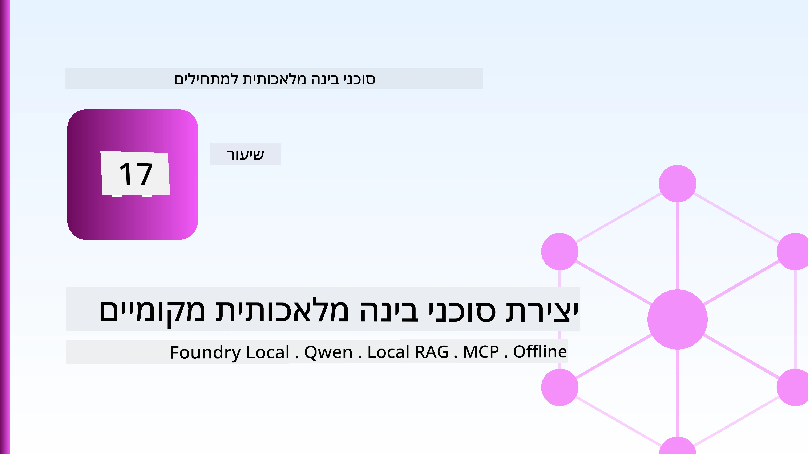
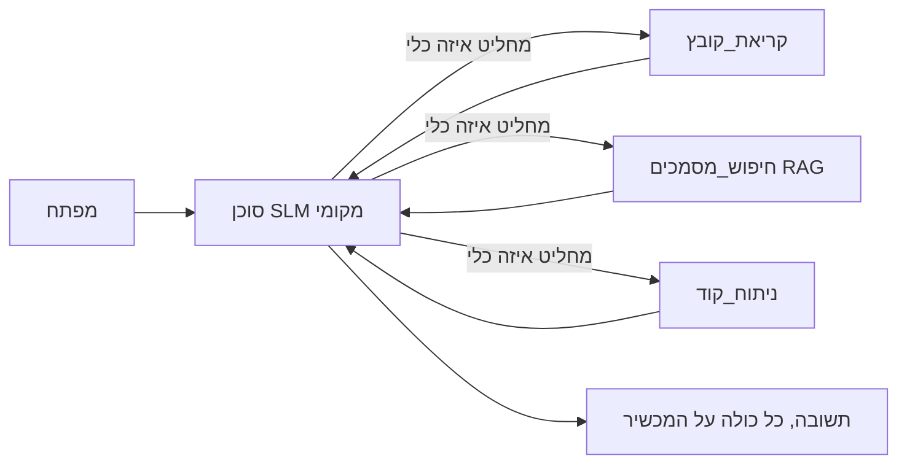
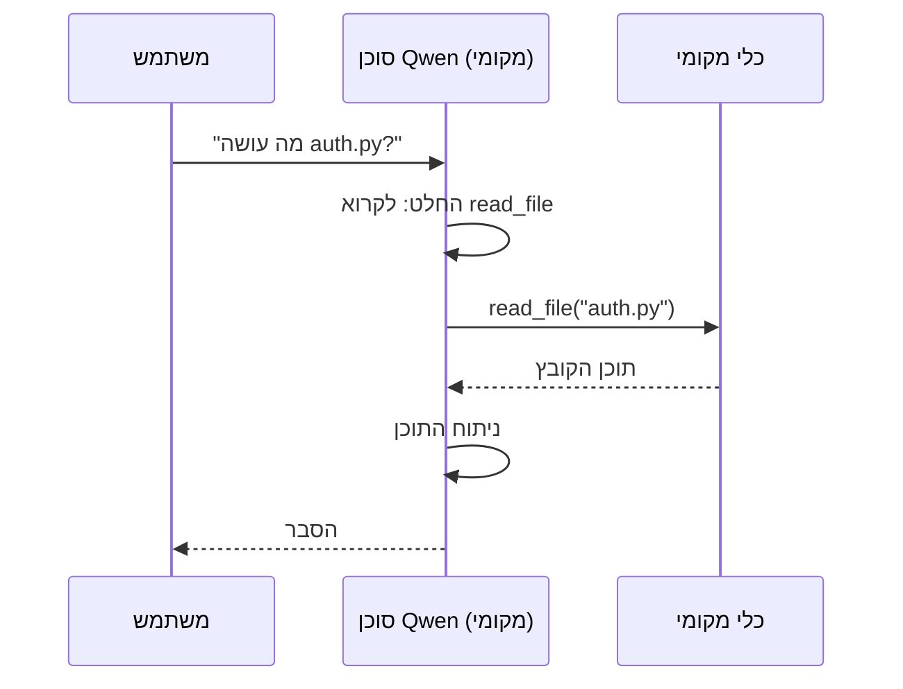
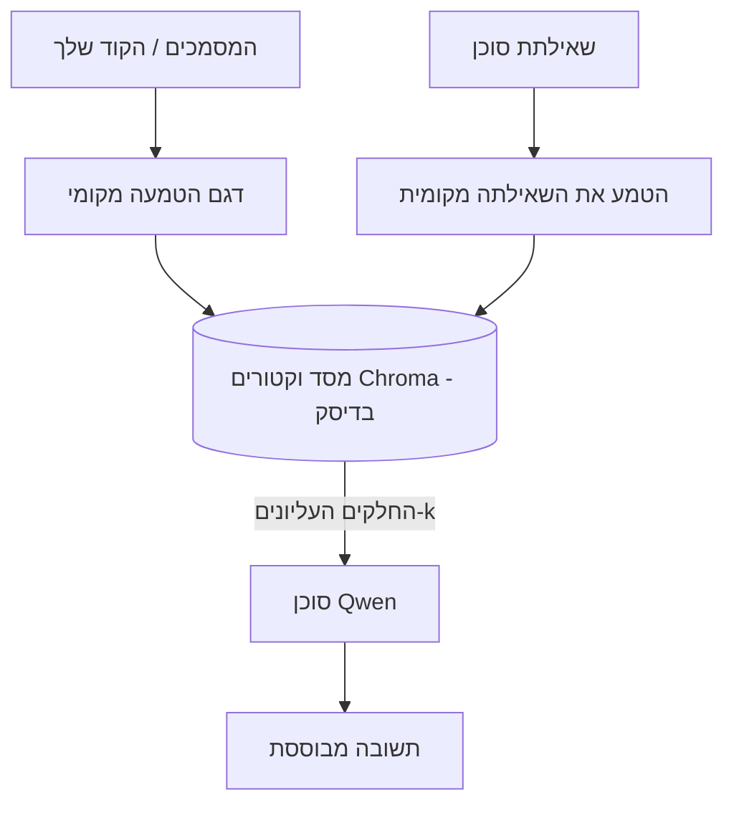
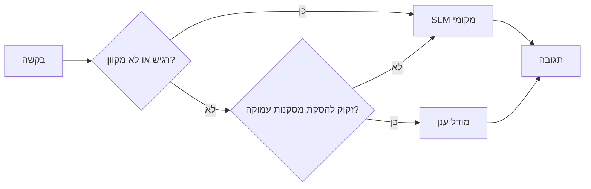

# יצירת סוכני AI מקומיים באמצעות Microsoft Foundry Local ו-Qwen



השיעור הקודם הרחיב סוכנים *לענן*. שיעור זה מביא אותם *למטה* למכונה אחת. בסוף יהיה לך עוזר הנדסי שפועל, טוען כלים, קורא את הקבצים שלך ומחפש בתיעוד שלך — **בלי קריאת הסקת תובנות חסרת ענן אחת.**

מדוע תרצה זאת? שלושה סיבות שמתעוררות כל הזמן בעבודת הנדסה אמיתית:

- **פרטיות.** הקוד והמסמכים לעולם אינם עוזבים את המכונה. אין פרומפט, קטע קוד או נתוני לקוח שמעבירים את הגבול הרשת.
- **עלות.** הסקת תובנות מקומית אינה כרוכה בתשלום פר טוקן. אתה יכול לחזור על הפעולה כל היום במחיר החשמל.
- **לא מקוון.** במטוס, במתקן מאובטח או במהלך הפסקת חשמל, הסוכן עדיין עובד.

החיסרון הוא שאתה מחליף מודל ענני חדשני ב**מודל שפה קטן (SLM)** הפועל על המעבד, המעבד הגרפי, או המעבד הנוירוני שלך. שיעור זה מדבר על בניית סוכנים שהם *טובים* בתוך המגבלה הזו במקום להעמיד פנים שהמגבלה אינה קיימת.

## מבוא

שיעור זה יכסה:

- **מודלים שפתיים קטנים (SLMs)** — מה הם, היכן הם מתבלטים והיכן לא.
- **Microsoft Foundry Local** — סביבת ריצה שמורידה ומגישה מודלים במכשיר דרך **ממשק OpenAI תואם**.
- **מודלים מתפקדים של Qwen** — SLMs שמפיקים קריאות כלים אמינות, מה שהופך סוכנים מקומיים (ולא רק שיחה מקומית) לאפשריים.
- **כלים מקומיים, RAG מקומי, ו-MCP מקומי** — נותנים למפעיל יכולת בלי ענן.
- **תבניות היברידיות** — מתי לשמור דברים מקומיים ומתי לפנות לענן.

## מטרות הלמידה

לאחר השלמת השיעור תדע כיצד:

- להסביר את הפשרות של SLMs ולבחור מקרי שימוש מתאימים לסוכן מקומי.
- להפעיל מודל Qwen מקומית עם Foundry Local ולחבר אליו דרך נקודת הקצה התואמת OpenAI.
- לבנות סוכן שמבצע קריאות כלים ופועל כולו במחשב העבודה שלך.
- להוסיף RAG מקומי על המסמכים שלך באמצעות מסד נתונים וקטורי מקומי (Chroma).
- לחבר את הסוכן לשרת MCP מקומי ולנתח עיצובים היברידיים מקומיים/ענניים.

## דרישות מוקדמות

שיעור זה מניח שסיימת את השיעורים הקודמים ונוח לך עם:

- [שימוש בכלים](../04-tool-use/README.md) (שיעור 4) ו-[Agentic RAG](../05-agentic-rag/README.md) (שיעור 5).
- [פרוטוקולי Agentic / MCP](../11-agentic-protocols/README.md) (שיעור 11).
- [מסגרת הסוכנים של Microsoft](../14-microsoft-agent-framework/README.md) (שיעור 14).

תזדקק גם ל:

- תחנת עבודה למפתח. **8 ג'יגה ראם הוא מינימום ריאלי**; 16 ג'יגה ומעלה נוח. GPU או NPU עוזרים אך אינם חובה.
- התקנת **Microsoft Foundry Local** (ראה את חלק ההתקנה למטה).
- Python 3.12+ והחבילות במאגר [`requirements.txt`](../../../requirements.txt), בנוסף `foundry-local-sdk`, `openai` ו-`chromadb` לשיעור זה.

## מודלים שפתיים קטנים: הכלי הנכון לעבודה מקומית

מודל ענני חדשני כולל מאות מיליארדי פרמטרים ומרכז נתונים מאחוריו. SLM כולל כמה מיליארדי פרמטרים וצריך להיכנס לזיכרון ה-RAM של הלפטופ שלך. ההבדל הזה מגדיר ציפיות ברורות.

**SLMs טובים ב:**

- משימות מבנה ומוגבלות — סיווג, חילוץ, סיכום של מסמך מוכר.
- **קריאת כלים** — החלטה איזו פונקציה לקרוא ובאילו פרמטרים.
- איטרציה מהירה, זולה ופרטית על הנתונים שלך.

**SLMs חלשים ב:**

- חשיבה פתוחה, קפיצות מרובות בהקשר גדול.
- ידע כללי רחב (הם ראו פחות, ושוכחים יותר).

האסטרטגיה המנצחת לסוכנים מקומיים היא לכן: **תן ל-SLM לארגן, ותן לכלים לבצע את העבודה הכבדה.** המודל לא צריך *לדעת* את בסיס הקוד שלך — הוא צריך לדעת מתי לקרוא ל-`read_file` ו-`search_docs`. זה מתאים ישירות לחוזקות של SLM.



## Microsoft Foundry Local

**Microsoft Foundry Local** היא סביבת ריצה קלת משקל שמורידה, מנהלת ומגישה מודלים לחלוטין במחשב שלך. התכונה הכי חשובה עבורנו היא שהיא מציגה **נקודת קצה HTTP תואמת OpenAI** — מה שאומר ש-SDK של OpenAI ולקוח OpenAI של Microsoft Agent Framework עובדים נגדו עם שינוי אחד בלבד של `base_url`. כל מה שלמדת על בניית סוכנים מתורגם ישירות; רק נקודת הקצה זזה מהענן ל-`localhost`.

Foundry Local גם בוחרת את הבנייה המיטבית של מודל לחומרה שלך אוטומטית — בניית CPU, בניית CUDA/GPU, או בניית NPU — כך שלא תידרש לאופטימיזציה ידנית לכל מכונה.

### התקנה

התקן את Foundry Local (ראה את [התיעוד](https://learn.microsoft.com/azure/ai-foundry/foundry-local/) עבור מערכת ההפעלה שלך), ואשר שהשירות פועל:

```bash
# התקן (לדוגמה; עקוב אחר התיעוד לפלטפורמה שלך)
winget install Microsoft.FoundryLocal      # ווינדוס
# brew install microsoft/foundrylocal/foundrylocal   # macOS

# הורד והפעל מודל Qwen, ואז הפעל את השירות המקומי
foundry model run qwen2.5-7b-instruct
foundry service status
```

ברגע שהשירות פועל יש לך נקודת קצה מקומית, תואמת OpenAI (בדרך כלל `http://localhost:PORT/v1`). המחברת משתמשת ב`foundry-local-sdk` לאיתור נקודת הקצה אוטומטית, כך שלא צריך להקליד את הפורט בקוד.

## קריאת פונקציות Qwen: מדוע זה חשוב

סוכן הוא סוכן רק אם הוא יכול לקרוא כלים. רבים מ-SLMs יכולים לשוחח אך מפיקים קריאות כלים לא אמינות ומעוותות. מודלי **Qwen** מאומנים לקריאות פונקציות ומשמיעים מבני קריאת כלים מאורגנים ועקביים — וזה בדיוק מה שהופך מודל שיחה מקומי ל*סוכן* מקומי.

הזרימה היא לולאת קריאת הכלים הסטנדרטית שאתה כבר מכיר, רק שהיא פועלת במכשיר:



## RAG מקומי

חיפוש בתיעוד הוא המקום שבו סוכנים מקומיים מצדיקים את עצמם. במקום לקוות שה-SLM שינן את תיעוד המערכת שלך, אתה משבץ את המסמכים הללו ב**מסד נתונים וקטורי מקומי** ומאפשר לסוכן לשלוף את הקטעים הרלוונטיים לפי דרישה.

אנו משתמשים ב**Chroma**, אחסון וקטורי מוטמע שפועל בתוך התהליך ללא שרת לניהול. הצינור כולו מקומי: מודל מוטמע מקומי → וקטורים מקומיים → שליפה מקומית → SLM מקומי.



זו אותה תבנית Agentic RAG משיעור 5 — השינוי היחיד הוא שכל רכיב פועל במכשיר שלך.

## שרתי MCP מקומיים

[MCP](../11-agentic-protocols/README.md) הוא פרוטוקול תקשורת, לא שירות ענן. שרת MCP יכול לפעול בתהליך מקומי ב-`stdio`, ולחשוף כלים לסוכן שלך בפרוטוקול הסטנדרטי. כך ניתן להשתמש מחדש באקוסיסטם הגדל של שרתי MCP — גישה למערכת הקבצים, פעולות git, שאילתות מסד נתונים — הכל במצב לא מקוון.

עמדת האבטחה שונה מהענן, אך אינה נעדרת: שרת MCP מקומי פועל עדיין בהרשאות המשתמש שלך, לכן יש להגביל את ההיקף שהוא יכול לגשת אליו (תיקיית פרויקט, לא תיקיית הבית כולה) ולהתייחס לתוצריו כקלט שדורש אימות.

## תבניות היברידיות של ענן ומקומי

"מקומי ראשית" לא אומר "רק מקומי". מערכות בשלות מעבירות לפי רגישות וקושי:

| סיטואציה | איפה זה פועל |
| --- | --- |
| קוד/נתונים רגישים, או לא מקוון | **SLM מקומי** |
| משימה פשוטה ומוגבלת | **SLM מקומי** (זול, מהיר) |
| חשיבה קשה עם קפיצות מרובות על נתונים לא רגישים | **מודל ענן** |
| הכל, במהלך הפסקת שירות | **SLM מקומי** (ירידה מתונה באיכות) |

זה משקף את רעיון **הפניית מודל** משיעור 16 — פרט לכך שאחד "המודלים" הוא עכשיו המחשב המקומי שלך. עיצוב איתן חוזר למודלי מקומי כשהענן אינו זמין, כך שהסוכן יורד באיכות במקום להיכשל לגמרי.



## מעבדה פרקטית: עוזר הנדסי מקומי

פתח את [`code_samples/17-local-agent-foundry-local.ipynb`](./code_samples/17-local-agent-foundry-local.ipynb) ועבוד עליו. תבנה **עוזר הנדסי מקומי** שפועל כולו במחשב העבודה שלך ויכול:

1. **לקרוא כלים** — דרך קריאות פונקציות Qwen דרך Foundry Local.
2. **לבצע פעולות קבצים מקומיות** — לרשום ולקרוא קבצים בתיקיית פרויקט.
3. **לנתח קוד** — לדווח מדדים בסיסיים על קובץ מקור.
4. **לחפש בתיעוד** — RAG מקומי על תיקיית מסמכים עם Chroma.
5. **להשתמש ב-MCP** — להתחבר לשרת MCP מקומי (עם דילוג מתון אם לא מוגדר).

לא נעשה שימוש בהסקת תובנות עננית בשום שלב.

### סיור

העוזר מתחבר ל-Foundry Local דרך נקודת הקצה התואמת ל-OpenAI, כך שקוד הסוכן כמעט זהה לשיעורי הענן — רק הלקוח משתנה:

```python
from foundry_local import FoundryLocalManager
from openai import OpenAI

# פאונדרי לוקאל מוצא/מוריד את המודל ונותן לנו נקודת קצה מקומית.
manager = FoundryLocalManager(\"qwen2.5-7b-instruct\")
client = OpenAI(base_url=manager.endpoint, api_key=manager.api_key)  # api_key הוא מציין מקום מקומי
```

הכלים הם פונקציות Python רגילות המוגבלות לתיקיית פרויקט:

```python
def read_file(path: str) -> str:
    \"\"\"Read a file, but only inside the sandboxed project directory.\"\"\"
    full = (PROJECT_ROOT / path).resolve()
    if PROJECT_ROOT not in full.parents and full != PROJECT_ROOT:
        return \"Access denied: path is outside the project directory.\"
    return full.read_text(encoding=\"utf-8\")
```

שים לב לבדיקה של סנדבוקס — אפילו מקומית, כלי שקורא נתיבים שרירותיים הוא סיכון. המחברת מגבילה כל כלי לשורש פרויקט בודד.

## בדיקת ידע

בדוק את הבנתך לפני המעבר למשימה.

**1. ציין שתי סיבות ממשיות להפעיל סוכן מקומי במקום בענן.**

<details>
<summary>תשובה</summary>

כל שתיים מהן: **פרטיות** (קוד ונתונים לעולם אינם עוזבים את המכונה), **עלות** (אין חשבון הסקת תובנות פר טוקן), ו**יכולת לא מקוונת** (עובד ללא רשת — במטוס, במתקן מאובטח, או במהלך הפסקה). הגבלות רגולציה/ציות האוסרות שליחת נתונים מחוץ למכשיר הן סיבה נפוצה לפרטיות.
</details>

**2. מה החלוקה המומלצת של העבודה בין SLM לכלים בסוכן מקומי, ולמה?**

<details>
<summary>תשובה</summary>

תן ל-SLM **לארגן** (להחליט איזה כלי לקרוא ובאילו פרמטרים) ותן ל**כלים לבצע את העבודה הכבדה** (קריאת קבצים, שליפת מסמכים, חישוב תוצאות). SLMs חזקים בהחלטות מוגבלות כמו בחירת כלי אך חלשים בידע רחב וחשיבה מרובת קפיצות, ולכן הסתמכות על כלים מנצלת את חוזקותיהם.
</details>

**3. מה מאפשר להשתמש שוב בקוד סוכן ענני עם Foundry Local?**

<details>
<summary>תשובה</summary>

Foundry Local מציג **נקודת קצה HTTP תואמת OpenAI**. SDK של OpenAI ולקוח OpenAI של Agent Framework עובדים נגדו רק באמצעות שינוי `base_url` (ושבשימוש במפתח API פלייסהולדר מקומי). כל השאר בקוד הסוכן נשאר אותו הדבר.
</details>

**4. מדוע אנחנו משתמשים במיוחד במודל Qwen לקריאות פונקציות במקום כל SLM אחר?**

<details>
<summary>תשובה</summary>

כי סוכן חייב להפיק קריאות כלים אמינות וטובות. רבים מ-SLMs יכולים לשוחח אך מייצרים מבני קריאת כלים שגויים או לא עקביים. מודלי Qwen מאומנים לקריאות פונקציות ומפיקים קריאות כלי עקביות, מה שהופך מודל שיחה מקומי לסוכן מקומי עובד.
</details>

**5. באיזו רכיבים בצינור RAG מקומי פועלים במכונה?**

<details>
<summary>תשובה</summary>

כולם: מודל ההטמעה, מסד הנתונים הוקטורי (Chroma, בדיסק), שלב השליפה, ו-SLM. המסמכים מוטמעים מקומית, מאוחסנים מקומית, נשלפים מקומית, ומנותחים על ידי מודל מקומי — שום רכיב אינו נוגע בענן.
</details>

**6. שרת MCP מקומי פועל על המכונה שלך. האם זה הופך אותו אוטומטית לבטוח? איזה אמצעי זהירות עדיין צריך לנקוט?**

<details>
<summary>תשובה</summary>

לא. שרת MCP מקומי פועל בהרשאות המשתמש שלך, כך שהוא יכול לגשת לכל מה שאתה יכול. הגבל אותו למה שהוא צריך (למשל, תיקיית פרויקט בודדת במקום תיקיית הבית כולה) וטפל בפלטים שלו כקלט לצורך אימות לפני פעולה.
</details>

**7. תאר כלל הפנייה היברידי נבון הכולל מודל מקומי.**

<details>
<summary>תשובה</summary>

הפנה בקשות רגישות או לא מקוונות ל-SLM המקומי; הפנה משימות פשוטות ומוגבלות ל-SLM המקומי לזמן ועלות; הפנה חשיבה קשה מרובת קפיצות בנתונים לא רגישים למודל ענן; והעבר ל-SLM המקומי אם הענן אינו זמין, כך שהסוכן יורד באיכות בהדרגה במקום להיכשל. זה הפניית מודל (שיעור 16) כשהמחשב המקומי הוא אחד המודלים.
</details>

**8. מהו מספר זיכרון RAM ריאלי מינימלי להפעלת סוכן מקומי בשיעור זה, ומה תוספת זיכרון מספקת?**

<details>
<summary>תשובה</summary>

כ-**8 GB** הוא מינימום ריאלי; 16 GB ומעלה נוח. יותר RAM מאפשר להריץ מודלים גדולים ויותר חזקים ולשמור יותר הקשר בזיכרון. GPU או NPU מאיצים את ההסקה אך אינם דרושים — Foundry Local בוחרת בבניית CPU כשאין מאיץ זמין.
</details>

## מטלה

הרחב את העוזר ההנדסי המקומי ל**בודק תיעוד מקומי** לפרויקט קטן לפי בחירתך (תוכל להשתמש באחת מתיקיות השיעורים במאגר זה).

על ההגשה שלך לכלול:

1. **אינדקס תיקיית תיעוד/קוד אמיתית** ב-Chroma (לפחות חמישה קבצים).
2. **הוסף כלי `find_todos`** שסורק את הפרויקט אחר הערות `TODO`/`FIXME` ומחזיר אותן עם שם הקובץ ומספר השורה — שומר על בדיקת הסנדבוקס כמו ב-`read_file`.

3. **שאל את הסוכן שלוש שאלות** שמכריחות אותו לשלב כלים: שאלה אחת טהורה של RAG, שאלה אחת שדורשת קריאת קובץ ספציפי, ושאלה אחת שדורשת למצוא TODOים.
4. **מדוד זאת**: מדוד את הזמן של כל אחת מהתשובות ושלח אותם בתא markdown. הגיב האם העיכוב מקובל עבור זרימת העבודה המתוכננת שלך.

לאחר מכן כתוב פסקה קצרה על **מה היית מעביר לענן ומה היית משאיר מקומי** לסוקר זה, ולמה. אתה מוערך על האם הרכיבים המקומיים מחוברים נכון והאם ההיגיון ההיברידי שלך תקין — לא על איכות המודל.

## סיכום

בשיעור זה בנית סוכן שרץ כולו במכונה שלך:

- **SLMs** מחליפים רוחב טווח בפרטיות, עלות, ותפעול לא מקוון — וזוהרים כשהם **מארגנים כלים** במקום לשאת את כל הידע בעצמם.
- **Foundry Local** מספק מודלים על המכשיר מאחורי **סוף נקודה תואמת OpenAI**, כך שקוד הסוכן בענן שלך עובר עם שינוי של שורה אחת.
- **מודלים עם קריאת פונקציות של Qwen** מאפשרים קריאת כלים מקומית אמינה — ולכן סוכנים מקומיים אפשריים.
- **RAG מקומי** (Chroma) ו-**MCP מקומי** נותנים לסוכן יכולת מבלי לצאת מהמכונה.
- **תבניות היברידיות** מאפשרות לך להפנות לפי רגישות וקושי, עם מקומי כפיתרון גיבוי מתחשב.

זה משלים את הקשת הפרוסה: שיעור 16 הרחיב סוכנים אל Microsoft Foundry, ושיעור זה הקטין אותם אל תחנת עבודה אחת. השיעור הבא מתמקד בשמירת אבטחת הסוכנים המופעלים.

## משאבים נוספים

- <a href="https://learn.microsoft.com/azure/ai-foundry/foundry-local/" target="_blank">תיעוד Microsoft Foundry Local</a>
- <a href="https://learn.microsoft.com/azure/ai-foundry/what-is-azure-ai-foundry" target="_blank">תיעוד Microsoft Foundry</a>
- <a href="https://learn.microsoft.com/en-us/agent-framework/overview/?wt.mc_id=youtube_26688_organicsocial_reactor&pivots=programming-language-python" target="_blank">מסגרת הסוכן של Microsoft</a>
- <a href="https://qwen.readthedocs.io/en/latest/framework/function_call.html" target="_blank">תיעוד קריאת פונקציות של Qwen</a>
- <a href="https://modelcontextprotocol.io/" target="_blank">פרוטוקול הקשר מודל (MCP)</a>
- <a href="https://docs.trychroma.com/" target="_blank">מסד נתונים וקטורי של Chroma</a>

## שיעור קודם

[פריסת סוכנים בקנה מידה](../16-deploying-scalable-agents/README.md)

## שיעור הבא

[אבטחת סוכני AI](../18-securing-ai-agents/README.md)

---

<!-- CO-OP TRANSLATOR DISCLAIMER START -->
**כתב ויתור**:
מסמך זה תורגם באמצעות שירות תרגום אוטומטי [Co-op Translator](https://github.com/Azure/co-op-translator). למרות שאנו שואפים לדיוק, יש לקחת בחשבון שתרגומים אוטומטיים עלולים להכיל שגיאות או אי-דיוקים. יש להחשיב את המסמך המקורי בשפתו הטבעית כמקור הסמכות. למידע קריטי מומלץ להשתמש בתרגום מקצועי על ידי מתרגם אדם. אנו לא אחראים לכל אי-הבנה או פירוש שגוי הנובע מהשימוש בתרגום זה.
<!-- CO-OP TRANSLATOR DISCLAIMER END -->