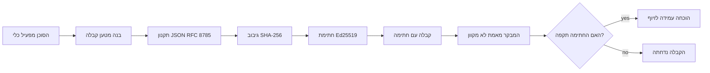
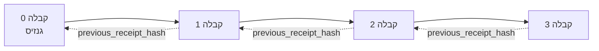

[צפה בסרטון השיעור: אבטחת סוכני AI עם קבלות קריפטוגרפיות](https://youtu.be/PLACEHOLDER_VIDEO_ID)

> _(סרטון השיעור והתמונה המקדימה יתווספו על ידי צוות התוכן של מיקרוסופט לאחר המיזוג, בהתאמה לתבנית השיעור 14 / 15.)_

# אבטחת סוכני AI עם קבלות קריפטוגרפיות

## הקדמה

בשיעור זה נסקור:

- מדוע מסלולי ביקורת עבור סוכני AI חשובים לצורך תאימות, איתור באגים ובניית אמון.
- מהי קבלה קריפטוגרפית וכיצד היא שונה משורת לוג לא חתומה.
- כיצד לייצר קבלה חתומה עבור קריאת כלי של סוכן בפייתון פשוטה.
- כיצד לוודא קבלה במצב לא מקוון ולגלות זיוף.
- כיצד לקשר קבלות כך שהסרה או שינוי סדר של אחת תשבור את השרשרת.
- מה הקבלות מוכיחות ומה הן במפורש אינן מוכיחות.

## מטרות הלמידה

בסיום שיעור זה, תדעו כיצד:

- לזהות מצבי כשל שמניעים שימוש במוצא קריפטוגרפי לפעולות סוכן.
- לייצר קבלה חתומה עם Ed25519 מעל מטען JSON קנוני.
- לוודא קבלה באופן עצמאי תוך שימוש במפתח הציבורי בלבד.
- לזהות זיוף באמצעות הרצת אימות חוזרת על קבלה ששונתה.
- לבנות רצף קבלות מקושר באמצעות פונקציית גיבוב ולהסביר מדוע השרשרת חשובה.
- להבדיל בין מה שהקבלות מוכיחות (שייכות, שלמות, סדר) לבין מה שאינן מוכיחות (תקינות הפעולה, תקפות המדיניות).

## הבעיה: מסלול הביקורת של הסוכן שלך

דמיין שהפעלת סוכן AI עבור Contoso Travel. הסוכן קורא בקשות לקוחות, קורא ל-API טיסות כדי לחפש אפשרויות ומבצע הזמנות בשם הלקוח. ברבעון האחרון, הסוכן טפל ב-50,000 הזמנות.

היום מגיע מבקר. הוא שואל שאלה פשוטה: "הראה לי מה הסוכן שלך עשה."

אתה מוסר את קובצי הלוג שלך. המבקר מסתכל עליהם ושואל שאלה קשה יותר: "איך אני יודע שהלוגים האלה לא נערכו?"

זו הבעיה של מסלול הביקורת. רוב הפעלות הסוכנים כיום מסתמכות על:

- **לוגי יישום**: נכתבים על ידי הסוכן עצמו, ניתן לעריכה על ידי כל מי שיש לו גישה למערכת הקבצים.
- **שירותי ניהול יומנים בענן**: עדות לזיוף ברמת הפלטפורמה אך רק אם המבקר סומך על מפעיל הפלטפורמה.
- **לוגים עסקאות במסדי נתונים**: מתאימים לשינויים במסדי נתונים אך לא לקריאות כלים שרירותיות.

אף אחד מהם אינו יכול לענות על שאלת המבקר מבלי לדרוש ממנו לסמוך על מישהו (אתה, ספק הענן שלך, ספק מסד הנתונים שלך). לצרכים פנימיים, אימון זה מקובל בדרך כלל. לעומס עבודה מפוקח (פיננסים, בריאות, כל דבר בכפוף לחוק AI של האיחוד האירופי) זה אינו מקובל.

קבלות קריפטוגרפיות פותרות זאת בכך שהן מאפשרות אימות עצמאי לכל פעולה של הסוכן. המבקר אינו צריך לסמוך עליך. הוא צריך רק את המפתח הציבורי שלך ואת הקבלה עצמה.

## מהי קבלה קריפטוגרפית?

קבלה היא אובייקט JSON המתעד מה הסוכן עשה, וחתום בחתימה דיגיטלית.


  
קבלה מינימלית נראית כך:

```json
{
  "type": "agent.tool_call.v1",
  "agent_id": "contoso-travel-bot",
  "tool_name": "lookup_flights",
  "tool_args_hash": "sha256:a3f9c1...",
  "result_hash": "sha256:7b2e1d...",
  "policy_id": "contoso-travel-policy-v3",
  "timestamp": "2026-04-25T14:30:00Z",
  "sequence": 47,
  "previous_receipt_hash": "sha256:9d4e6a...",
  "signature": {
    "alg": "EdDSA",
    "sig": "c5af83...",
    "public_key": "8f3b2c..."
  }
}
```
  
שלוש תכונות מבצעות את העבודה:

1. **החתימה**. הקבלה חתומה באמצעות שער הסוכן על ידי מפתח פרטי Ed25519. כל מי שיש לו את המפתח הציבורי המתאים יכול לאמת את החתימה במצב לא מקוון. זיוף בכל שדה יבטל את החתימה.

2. **קידוד קנוני**. לפני החתימה, הקבלה מומרת לפי סכמת קנוניזציה של JSON (JCS, RFC 8785). זה מבטיח ששתי יישומים המייצרים את אותה קבלה לוגית יפיקו בדיוק אותו רצף בתים. ללא קנוניזציה, סיריאלייזרים שונים של JSON היו מייצרים חתימות שונות על אותו תוכן.

3. **שרשור גיבוב**. שדה `previous_receipt_hash` מקשר כל קבלה לזו שלפניה. הסרה או שינוי סדר של קבלה תשבור כל קבלה שבאה אחריה. זיוף מתגלה ברמת השרשרת אפילו אם חתימות בודדות עוברות.

ביחד, תכונות אלו מספקות שלוש הבטחות:

- **שייכות**: מפתח זה חתם על תוכן זה.
- **שלמות**: התוכן לא השתנה מאז החתימה.
- **סדר**: קבלה זו התקבלה אחרי הקבלה ההיא בשרשרת.

## הפקת קבלה בפייתון

אינך צריך ספרייה מיוחדת כדי להפיק קבלה. היסודות הקריפטוגרפיים זמינים ברבים והלוגיקה היא כמה עשרות שורות פייתון.

התרגילים המעשיים ב-`code_samples/18-signed-receipts.ipynb` מראים את כל התהליך. הגרסה המסכמת:

```python
import json
import hashlib
import base64
from nacl import signing
from jcs import canonicalize  # JSON הקנוני לפי RFC 8785

def b64url_nopad(data: bytes) -> str:
    return base64.urlsafe_b64encode(data).decode("ascii").rstrip("=")

def sha256_canonical(obj) -> str:
    """SHA-256 of a Python object's JCS-canonical JSON form."""
    return f"sha256:{hashlib.sha256(canonicalize(obj)).hexdigest()}"

# צור או טען מפתח חתימה (בייצור, אחסן בוולט מפתחות)
signing_key = signing.SigningKey.generate()
verify_key = signing_key.verify_key

# בנה את מטען הקבלה (עדיין ללא חתימה)
tool_args = {"origin": "SYD", "destination": "LAX"}
tool_result = [{"flight": "QF11", "price": 1850, "stops": 0}]

payload = {
    "type": "agent.tool_call.v1",
    "agent_id": "contoso-travel-bot",
    "tool_name": "lookup_flights",
    "tool_args_hash": sha256_canonical(tool_args),
    "result_hash": sha256_canonical(tool_result),
    "policy_id": "contoso-travel-policy-v3",
    "timestamp": "2026-04-25T14:30:00Z",
    "sequence": 0,
    "previous_receipt_hash": None,
}

# הפוך לקנוני, חשב גיבוב, חתום.
canonical_bytes = canonicalize(payload)
message_hash = hashlib.sha256(canonical_bytes).digest()
signature_bytes = signing_key.sign(message_hash).signature

# צרף אובייקט חתימה מובנה.
receipt = {
    **payload,
    "signature": {
        "alg": "EdDSA",
        "sig": b64url_nopad(signature_bytes),
        "public_key": b64url_nopad(bytes(verify_key)),
    },
}
```
  
זו כל צינור החתימה. התרגילים במחברת מתארים כל שלב.

## אימות קבלה וזיהוי זיוף

אימות הוא הפעולה ההפוכה:

```python
import base64
import hashlib
from nacl import signing
from nacl.exceptions import BadSignatureError
from jcs import canonicalize

def b64url_decode(s: str) -> bytes:
    padding = "=" * ((4 - len(s) % 4) % 4)
    return base64.urlsafe_b64decode(s + padding)

def verify_receipt(receipt: dict) -> bool:
    # החתימה היא אובייקט מובנה: {"alg", "sig", "public_key"}.
    sig_obj = receipt.get("signature")
    if not sig_obj or sig_obj.get("alg") != "EdDSA":
        return False

    # שוחזר את המטען שנסמן בפועל (הכל חוץ מהחתימה).
    payload = {k: v for k, v in receipt.items() if k != "signature"}

    canonical_bytes = canonicalize(payload)
    message_hash = hashlib.sha256(canonical_bytes).digest()

    try:
        verify_key = signing.VerifyKey(b64url_decode(sig_obj["public_key"]))
        verify_key.verify(message_hash, b64url_decode(sig_obj["sig"]))
        return True
    except BadSignatureError:
        return False
```
  
פונקציה זו מקבלת קבלה ומחזירה `True` אם החתימה תקפה, אחרת `False`. אין קריאות רשת, אין תלות בשירות, אין צורך באמון לצד שלישי.

כדי לראות זיהוי זיוף בפעולה, המחברת עוברת על:

1. יצירת קבלה תקינה ואימותה.
2. שינוי בתו אחד בשדה `tool_args_hash`.
3. הרצת אימות שנית וצפייה בכישלון.

זו ההדגמה הפרקטית שקבלות הן עדות לזיוף: כל שינוי, אפילו קטן, משבר את החתימה.

## שרשור קבלות עבור סוכנים רב-שלביים

קבלה חתומה יחידה מגנה על פעולה אחת. שרשרת קבלות מגנה על רצף פעולות.


  
כל קבלה מתעדת את גיבוב הקבלה שלפניה. כדי להסיר את קבלה מספר 2 בשקט, התוקף יצטרך:

- לשנות את שדה `previous_receipt_hash` של קבלה 3 (שובר את החתימה של קבלה 3), או  
- לזייף חתימה חדשה על קבלה 3 ששונתה (דורש את המפתח הפרטי של הסוכן).

אם המפתח הפרטי מאוחסן במיכל מפתחות חומרתי ואתה מפרסם את המפתח הציבורי עם כל קבלה, אף אחד מהתקפות אלו אינו אפשרי בלי גילוי.

המחברת עוברת על:

1. בניית שרשרת של שלוש קבלות.
2. אימות ששדה `previous_receipt_hash` של כל קבלה תואם לגיבוב האמיתי של הקבלה הקודמת.
3. זיוף קבלה באמצע השרשרת וצפייה בשבירת השרשרת בנקודה המדויקת.

ככה מייצרים מסלול ביקורת שמבקר חיצוני יכול לוודא בלי לסמוך עליך.

## מה הקבלות מוכיחות (ומה הן אינן מוכיחות)

זהו החלק החשוב ביותר בשיעור זה. קבלות הן כלי רב עוצמה אך תחום כוחן מוגבל.

**קבלות מוכיחות שלושה דברים:**

1. **שייכות**: מפתח מסוים חתם על מטען מסוים.
2. **שלמות**: המטען לא השתנה מאז החתימה.
3. **סדר**: קבלה זו התקבלה אחרי הקבלה ההיא בשרשרת הגיבוב.

**קבלות אינן מוכיחות:**

1. **תקינות**: שלא הפעולה של הסוכן הייתה הפעולה הנכונה. קבלה יכולה להיחתם גם לתשובה שגויה באותה מידה שהתשובה הנכונה.
2. **התאמה למדיניות**: שהמדיניות המתועדת ב-`policy_id` אכן הוערכה, או שהייתה מאפשרת את הפעולה אם הייתה נבדקת. הקבלה מתעדת רק את הדרישה, לא את האכיפה.
3. **זהות מעבר למפתח**: הקבלה אומרת "מפתח זה חתם על תוכן זה." היא אינה אומרת "אדם זה אישר זאת." חיבור בין מפתח לאדם או ארגון דורש תשתית זהות נפרדת (מדריך, רשם מפתחות ציבוריים וכו').
4. **אותנטיות הקלטים**: אם הסוכן מקבל הנחיה שעברה מניפולציה ופועל על פיה, הקבלה מתעדת את הפעולה כנכונה. הקבלות הן לאחר אימות הקלט, לא תחליף לו.

גבול זה חשוב משתי סיבות:

- הוא מבהיר למה הקבלות שימושיות: להפוך את התנהגות הסוכן לאודיטבילית ועמידה לזיופים, גם מעבר לגבולות ארגוניים.
- הוא מבהיר אילו שכבות נוספות עדיין דרושות: אימות קלט (שיעור 6), אכיפת מדיניות (מתואר בקצרה בהמשך), ותשתית זהות (לא במסגרת שיעור זה).

טעות נפוצה היא להניח ש"יש לנו קבלות" פירושו "אנחנו מפוקחים." זה לא כך. קבלות הן הבסיס. הפיקוח הוא המערכת שאתה בונה מעליהן.

## הפניות לפרודקשן

קוד הפייתון בשיעור זה מכוון להיות מינימלי כדי שתוכל לקרוא כל שורה ולהבין בדיוק מה קורה. בפרודקשן יש לך שתי אפשרויות:

1. **לבנות ישירות על היסודות הקריפטוגרפיים.** 50 השורות שראית כאן מספיקות לרוב השימושים. PyNaCl (Ed25519) וחבילת `jcs` (JSON קנוני) הן ספריות מתוחזקות ומבוקרות היטב.

2. **להשתמש בספריית קבלות לפרודקשן.** מספר פרויקטים בקוד פתוח מיישמים דפוס זה עם תכונות נוספות (סיבוב מפתחות, אימות אצווה, הפצת JWK Set, אינטגרציה עם מנועי מדיניות):  
   - פורמט הקבלה בשיעור זה עוקב אחרי IETF Internet-Draft (`draft-farley-acta-signed-receipts`) שנמצא בתהליך תקני.  
   - Microsoft Agent Governance Toolkit מרכיב קבלות עם החלטות מדיניות מבוססות Cedar; ראה מדריך 33 במאגר הדוגמה למימוש מקצה לקצה.  
   - החבילות `protect-mcp` (npm) ו-`@veritasacta/verify` (npm) מספקות מימוש מבוסס Node לחתימה ואימות קבלות במצב לא מקוון, מתוכנן לעטוף כל שרת MCP עם מסלול ביקורת עמיד לזיופים.

הבחירה בין בנייה עצמית לשימוש בספריה משקפת את הבחירה בין כתיבת ספריית JWT משלך לשימוש בקיימת: שתיהן הגיוניות; ספריה חוסכת זמן ומפחיתה שטח ביקורת; גישת הגרידאותר מאלצת הבנה מלאה של כל יסוד. השיעור מלמד את הדרך מההתחלה כדי לתת לך בסיס לשני האופציות.

## בדיקת ידע

בדוק את הבנתך לפני המעבר לתרגול המעשי.

**1. קבלה חתומה עם מפתח פרטי Ed25519 של הסוכן. למבקר יש רק את המפתח הציבורי. האם המבקר יכול לאמת את הקבלה במצב לא מקוון?**

<details>
<summary>תשובה</summary>

כן. אימות Ed25519 דורש רק את המפתח הציבורי והבתים החתומים. אין קריאות רשת, אין תלות בשירות. זו התכונה שהופכת קבלות לשימושיות בסביבות מבודדות, בין-ארגוניות או עם אמון נמוך.
</details>

**2. תוקף משנה את שדה `policy_id` בקבלה כדי לטעון שהיא נשלטה על ידי מדיניות מתירנית יותר. החתימה הייתה על המטען המקורי. מה קורה באימות?**

<details>
<summary>תשובה</summary>

האימות נכשל. החתימה חושבה על הבתים הקנוניים של המטען המקורי; שינוי כל שדה משנה את הבתים הקנוניים, משנה את גיבוב SHA-256, ובכך מבטל את החתימה. התוקף יצטרך את המפתח הפרטי כדי לייצר חתימה חדשה תקפה, ולא יש לו אותו.
</details>

**3. מדוע הקבלה כוללת `tool_args_hash` ו-`result_hash` במקום את הארוגומנטים והתוצאה הגולמיים?**

<details>
<summary>תשובה</summary>

שתי סיבות. ראשית, הקבלה עלולה להישמר או להישלח בסביבות בהן חשיפת התוכן הגולמי (PII, מידע עסקי) בעייתית. גיבוב שומר את הקבלה קטנה ואת התוכן פרטי; המבקר מאמת שהגיבוב תואם עותק מאוחסן בנפרד של התוכן האמיתי. שנית, לגיבובים יש גודל קבוע; קבלה עם גיבובים מוגבלת בגודלה ללא קשר לגודל הקלטות והפלטות.
</details>

**4. שדה `previous_receipt_hash` מקשר כל קבלה לקודמתה. אם תוקף מוחק שקטה קבלה אמצעית בשרשרת, מה הופך ללא תקף?**

<details>
<summary>תשובה</summary>

כל קבלה שהגיעה אחרי הנמחקת. שדות `previous_receipt_hash` שלהן כבר לא תואמים את השרשרת האמיתית (כי הקבלה שהתייחסו אליה כבר אינה קיימת, או שהשרשרת מצביעה כעת על קבלה קודמת שונה). כדי להסתיר את המחיקה, התוקף יצטרך לחתום מחדש על כל הקבלות המאוחרות, ודבר זה מחייב את המפתח הפרטי.
</details>

**5. קבלה עוברת אימות בהצלחה. האם זה מוכיח שהפעולה של הסוכן הייתה נכונה, תקינה או עומדת במדיניות?**

<details>
<summary>תשובה</summary>

לא. קבלה תקינה מוכיחה שלושה דברים: שיוך (מפתח זה חתם על תוכן זה), שלמות (התוכן לא שונה), וסדר (קבלה זו הגיעה אחרי קבלה אחרת). היא אינה מוכיחה שהפעולה הייתה נכונה, שהמדיניות בשם `policy_id` אכן הוערכה, או שהסוכן פעל לפי כל כלל. הקבלות הופכות את התנהגות הסוכן לניתנת לביקורת, לאו דווקא נכונה. זה הגבול החשוב ביותר בשיעור.
</details>

## תרגול

פתח את `code_samples/18-signed-receipts.ipynb` והשלם את כל ארבעת הקטעים:

1. **חלק 1**: חתום על הקבלה הראשונה שלך ואמת אותה.
2. **חלק 2**: טפל בקבלה במניפולציה וצפה בכישלון האימות.
3. **חלק 3**: בנה שרשרת של שלוש קבלות ואמת את שלמות השרשרת.
4. **חלק 4**: החל את התבנית על סוכן שנבנה עם Microsoft Agent Framework: עטוף קריאת כלי בחתימת קבלה, ואז אמת את הקבלה באופן עצמאי.

**אתגר מורחב 1:** הרחב את סכמת הקבלה עם שדה נוסף לבחירתך (למשל, מזהה בקשה למעקב), עדכן את לוגיקת החתימה הקנונית לכלול אותו, ואשר שהקבלה ממשיכה לעבור סבב אימות. לאחר מכן, שנה את השדה לאחר החתימה ואשר שהאימות נכשל. זה יכריח אותך להבין כיצד כל בית בקידוד הקנוני תורם לחתימה.
**אתגר מתיחה 2:** חשב SHA-256 על שתי הקבלות שלך יחד (שרשר את הבתים הקאנוניים שלהן בסדר דטרמיניסטי) והטמע את העיכול המתקבל כשדה חדש בקבלה השלישית לפני החתימה עליה. אמת שכל שלוש הקבלות עדיין עובדות בצורה מעגלית. הרגע בנית הוכחת הכללה שלב אחד: כל מי שמחזיק בקבלה השלישית יכול להוכיח שהקבלות הראשונות התקיימו במועד שבו נחתמה, ללא צורך לחשוף את תוכנן. זה הדגם שבו משתמשות קבלות חשיפת מידע סלקטיבית בקנה מידה (התחייבויות מרקל, RFC 6962).

## סיכום

קבלות קריפטוגרפיות מעניקות לסוכני בינה מלאכותית מסלול ביקורת שהוא:

- **ניתן לאימות עצמאי**: כל צד עם המפתח הציבורי יכול לאמת, ללא תלות בשירות.
- **עדות לשיבוש**: כל שינוי מבטל את החתימה.
- **נייד**: הקבלה היא קובץ JSON קטן; ניתן לארכיב, להעביר ולאמת בכל מקום.
- **מתואם לתקנים**: בנוי על Ed25519 (RFC 8032), JCS (RFC 8785), ו-SHA-256, כולן פרימיטיבים מבוססי פריסה רחבה.

הן אינן תחליף לאימות קלט, לאכיפת מדיניות או לתשתית זהות. הן בסיס לשכבות אלו. כשאתם מפעילים סוכנים בעומסי עבודה מפוקחים, זרימות עבודה מרובות ארגונים, או כל סביבה שבה אין להניח שמבקר עתידי ייתן בכם אמון, הקבלות הן הדרך להפוך את מסלול הביקורת לגלוי והגון.

הלקח החשוב ביותר: קבלות מוכיחות מי אמר מה ומתי. אינן מוכיחות שאמור היה להיות נכון או אמת. החזקו בהבחנה הזו חזק. זו ההבדל בין מערכת מקוריות הוגנת לבין אחת מטעית.

## רשימת בדיקה לפרודקשן

כשאתם מוכנים לעבור משיעור זה להפעלת סוכנים חתומים על קבלות בסביבה אמיתית:

- [ ] **העבר את מפתח החתימה מהמחשב הנייד של המפתח.** השתמש ב-Azure Key Vault, AWS KMS, או מודול אבטחה חומרתית. מפתח הפרטי החותם את הקבלות שלך לא יכול לעולם להתקיים בקוד מקור או טקסט פשוט במכונות האפליקציה.
- [ ] **פרסם את המפתח הציבורי לאימות.** המבקרים זקוקים לו לאימות לא מקוון. הדגם הסטנדרטי הוא סט JWK בכתובת URL מוכרת (RFC 7517), למשל `https://your-org.example.com/.well-known/agent-keys.json`.
- [ ] **עגן את השרשרת מבחוץ.** מדי פעם כתוב את חשיש ראש השרשרת האחרון ליומן שקיפות (Sigstore Rekor, RFC 3161 רשות חותם זמן, או מערכת פנימית שנייה) כך שצד חיצוני יכול לאשר "שרשרת זו התקיימה במועד זה."
- [ ] **אחסן קבלות בצורה בלתי משתנה.** אחסון בלוב שמתווסף בלבד (אחסון Azure עם מדיניות אי-שינוי, AWS S3 Object Lock) מונע ממישהו פנימי למחוק או לשכתב היסטוריה בשכבת האחסון.
- [ ] **החלט על מדיניות שימור.** ריבוי תקנות מצריך שמירה למשך שנים. תכנן לצמיחת הקבלות (כל קבלה היא כשבע מאות בתים; סוכן שמבצע 10K קריאות ביום מפיק כ-1.8 ג"ב בשנה).
- [ ] **תעד מה הקבלות אינן מכסות.** קבלות מוכיחות שיוך, שלמות וסדר. ספר הריצה שלך צריך למנות במפורש אילו בקרים נוספים (אימות קלט, אכיפת מדיניות, הגבלת קצב, תשתית זהות) פועלים לצד הקבלות במצב הממשל שלך.

### יש לך עוד שאלות לגבי אבטחת סוכני AI?

הצטרף ל-[Microsoft Foundry Discord](https://aka.ms/ai-agents/discord) כדי להיפגש עם לומדים אחרים, להשתתף בשעות משרד ולקבל תשובות על שאלות סוכני AI.

## מעבר לשיעור הזה

השיעור הזה מכסה חתימת קבלה בודדת ורצפים בשרשרת חשיש. אותם פרימיטיבים מרכיבים דגמים מתקדמים נוספים שאולי תפגוש ככל שמצב הממשל שלך יתפתח:

- **חשיפת מידע סלקטיבית.** כאשר שדות הקבלה מתחייבים בנפרד (עץ מרקל בסגנון RFC 6962), ניתן לחשוף שדות ספציפיים למבקרים מסוימים ולהוכיח שהאחרים לא שונו מבלי לחשוף אותם. שימושי כשהקבלה באה לענות גם על ביקורת מקיפה (שדורשת שלמות) וגם על תקנות מיקוד-נתונים כמו GDPR (רוצות שהמבקר יראה כמה שפחות).
- **ביטול קבלות.** אם מפתח חתימה נפרץ, צריך דרך לסמן את כל הקבלות שנחתמו במפתח זה כבלתי מהימנות מנקודת זמן מסוימת והלאה. דגמים סטנדרטיים: מפתחות חתימה קצרים וכן רשימת ביטול פומבית, או יומן שקיפות עם רשומות ביטול.
- **קבלות מולטילטרליות / חתימה מפוצלת.** יישומים מסוימים מחלקים את המטען החתום לשני חצאים עצמאיים לפני ביצוע (`authorization_*`) ואחרי ביצוע (`result_*`) עם חתימות נפרדות, שימושי כשהחלטת ההרשאה והתוצאה הנצפית נוצרות על ידי שחקנים שונים או בזמנים שונים. זה בונה על פורמט הקבלה הנלמד בשיעור זה.
- **הרכב מטען.** הקבלה אוטמת את כל הבתים שאתה מכניס ל-`result_hash`. מטענים בעולם האמיתי לעיתים עשירים יותר מתוצאת קריאה בודדת: נימוק לפני ההחלטה (תחזית המודל, אפשרויות שנשקלו, ראיות ושלמותן, מצב סיכון, שרשרת אחריות, תוצאת שער) יכולים כולם להיות בתוך המטען, אוטמים בפורמט קבלה בודד. זה שומר על פורמט הקבלה מינימלי תוך שמאפשר אבולוציה של סכמות מטען תחומה לפי תחום.
- **התאמה חוצה יישומים.** יישומים עצמאיים מרובים לאותו פורמט קבלה (Python, TypeScript, Rust, Go) מאמתים זה מול זה נגד וקטורי בדיקה משותפים. אם תבנה יישום משלך, אימות מול הווקטורים שפורסמו מאשר תאימות ברמת תקשורת הרשת.
- **מעבר לפוסט-קוואנטום.** Ed25519 נפוץ כיום אך אינו עמיד לקוואנטום. פורמט הקבלה הוא אלגוריתמ-גמיש: שדה `signature.alg` יכול לשאת `ML-DSA-65` (תקן חתימות פוסט-קוואנטום של NIST) כשצריך לעבור. תכנן לפרק מעבר שבו הקבלות חתומות בשני מפתחות.

## משאבים נוספים

- <a href="https://datatracker.ietf.org/doc/draft-farley-acta-signed-receipts/" target="_blank">טיוטת IETF: קבלות חתומות להחלטות למכונה-למכונה</a>
- <a href="https://learn.microsoft.com/azure/ai-studio/responsible-use-of-ai-overview" target="_blank">סקירת שימוש אחראי ב-AI (Azure AI)</a>
- <a href="https://datatracker.ietf.org/doc/html/rfc8032" target="_blank">RFC 8032: אלגוריתם חתימה דיגיטלית עם עקום אדוארדס (EdDSA)</a>
- <a href="https://datatracker.ietf.org/doc/html/rfc8785" target="_blank">RFC 8785: סכמת קנוניקליזציה ל-JSON (JCS)</a>
- <a href="https://datatracker.ietf.org/doc/html/rfc6962" target="_blank">RFC 6962: שקיפות תעודות</a> (בנייה עץ מרקל בשימוש בקבלות חשיפת מידע סלקטיביות)
- <a href="https://github.com/microsoft/agent-governance-toolkit/blob/main/docs/tutorials/33-offline-verifiable-receipts.md" target="_blank">Microsoft Agent Governance Toolkit, הדרכה 33: קבלות החלטה שניתן לאמת לא מקוון</a>
- <a href="https://github.com/ScopeBlind/agent-governance-testvectors" target="_blank">וקטורי בדיקה להתאמה חוצה יישומים</a> עבור פורמט הקבלות בשיעור זה (רישיון Apache-2.0)
- <a href="https://pynacl.readthedocs.io/" target="_blank">תיעוד PyNaCl</a> (Ed25519 בפייתון)

## שיעור קודם

[בניית סוכני שימוש במחשב (CUA)](../15-browser-use/README.md)

## שיעור הבא

_(ייקבע על ידי מחזיקי תוכן הלימוד)_

---

<!-- CO-OP TRANSLATOR DISCLAIMER START -->
**כתב ויתור**:
מסמך זה תורגם באמצעות שירות תרגום אוטומטי [Co-op Translator](https://github.com/Azure/co-op-translator). למרות שאנו שואפים לדיוק, יש לקחת בחשבון שתרגומים אוטומטיים עלולים להכיל שגיאות או אי-דיוקים. יש להחשיב את המסמך המקורי בשפתו הטבעית כמקור הסמכות. למידע קריטי מומלץ להשתמש בתרגום מקצועי על ידי מתרגם אדם. אנו לא אחראים לכל אי-הבנה או פירוש שגוי הנובע מהשימוש בתרגום זה.
<!-- CO-OP TRANSLATOR DISCLAIMER END -->