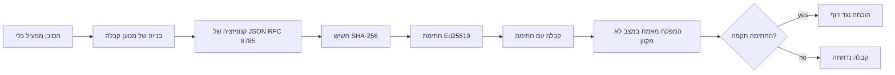
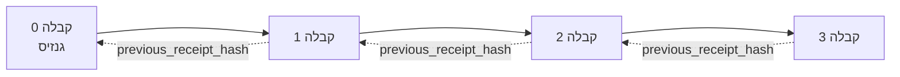

[צפו בסרטון השיעור: אבטחת סוכני בינה מלאכותית עם קבלות קריפטוגרפיות](https://youtu.be/PLACEHOLDER_VIDEO_ID)

> _(סרטון השיעור והתמונה הממוזערת יתווספו על ידי צוות התוכן של מיקרוסופט לאחר המיזוג, בהתאמה לתבנית השיעור 14 / 15.)_

# אבטחת סוכני בינה מלאכותית עם קבלות קריפטוגרפיות

## מבוא

בשיעור זה נתמקד ב:

- מדוע רישומי ביקורת לסוכני בינה מלאכותית חשובים לעמידה בתקנות, איתור שגיאות ואמון.
- מהי קבלה קריפטוגרפית וכיצד היא שונה מקו לוג לא חתום.
- כיצד ליצור קבלה חתומה על קריאת כלי של סוכן בפייתון פשוט.
- כיצד לאמת קבלה במצב לא מקוון ולזהות זיופים.
- כיצד לקשר קבלות כך שהסרה או שינוי סדר של אחת תשבור את הקשר.
- מה הקבלות מוכיחות ומה הן במפורש אינן מוכיחות.

## מטרות הלמידה

בסיום שיעור זה, תדעו כיצד:

- לזהות את מצבי הכשל שמניעים צורך במקור קריפטוגרפי לפעולות הסוכן.
- להפיק קבלה חתומה ב-Ed25519 מעל טען JSON קנוני.
- לאמת קבלה באופן עצמאי באמצעות המפתח הציבורי של החותם בלבד.
- לזהות זיופים על-ידי הרצת אימות חוזר על קבלה ששונתה.
- לבנות רצף עם שרשור hash של קבלות ולהסביר מדוע השרשרת חשובה.
- להבחין בין מה שהקבלות מוכיחות (שייכות, שלמות, סדר) ומה שהן אינן מוכיחות (נכונות הפעולה, תקינות המדיניות).

## הבעיה: רישום הביקורת של הסוכן שלך

דמיין שהפעלת סוכן בינה מלאכותית עבור Contoso Travel. הסוכן קורא בקשות לקוחות, קורא ל-API של טיסות לחיפוש אפשרויות, ומזמין מקומות בשם הלקוח. ברבעון האחרון עיבד הסוכן 50,000 הזמנות.

היום מגיע מבקר. הוא שואל שאלה פשוטה: "הראה לי מה הסוכן שלך עשה."

אתה מוסר את קבצי הלוג שלך. המבקר מסתכל בהם ושואל את השאלה המאתגרת יותר: "איך אני יודע שלוגים אלה לא נערכו?"

זו הבעיה של רישום הביקורת. רוב פריסות הסוכנים כיום מסתמכות על:

- **לוגי אפליקציה**: נכתבים על ידי הסוכן עצמו, ניתנים לעריכה על ידי כל מי שיש לו גישה לקבצים.
- **שירותי לוג בענן**: בעלי יכולת זיהוי זיופים ברמת הפלטפורמה, אך רק אם המבקר סומך על מפעיל הפלטפורמה.
- **לוגי טרנזקציות בבסיס נתונים**: מתאימים לשינויים בבסיס הנתונים אך לא לקריאות כלי שרירותיות.

אף אחד מהם אינו יכול לענות לשאלת המבקר מבלי לדרוש ממנו לסמוך על מישהו (עליך, ספק הענן שלך, או ספק בסיס הנתונים שלך). לשימוש פנימי האמון הזה מקובל לרוב. עבור עומסים מפוקחים (פיננסים, בריאות, כל דבר כפוף ל-EU AI Act), זה לא מקובל.

קבלות קריפטוגרפיות פותרות את הבעיה בכך שהן מאפשרות כל פעולה של סוכן להיות ניתנת לאימות עצמאי. המבקר אינו צריך לסמוך עליך. הוא זקוק רק למפתח הציבורי שלך ולקבלה עצמה.

## מהי קבלה קריפטוגרפית?

קבלה היא אובייקט JSON שרושם מה הסוכן עשה, וחתום בחתימה דיגיטלית.



קבלה מינימלית נראית כך:

```json
{
  "type": "agent.tool_call.v1",
  "agent_id": "contoso-travel-bot",
  "tool_name": "lookup_flights",
  "tool_args_hash": "sha256:a3f9c1...",
  "result_hash": "sha256:7b2e1d...",
  "policy_id": "contoso-travel-policy-v3",
  "timestamp": "2026-04-25T14:30:00Z",
  "sequence": 47,
  "previous_receipt_hash": "sha256:9d4e6a...",
  "signature": {
    "alg": "EdDSA",
    "sig": "c5af83...",
    "public_key": "8f3b2c..."
  }
}
```

שלוש תכונות עומלות יחד:

1. **החתימה**. הקבלה חתומה על ידי שער הסוכן באמצעות מפתח פרטי Ed25519. כל מי שיש לו את המפתח הציבורי המתאים יכול לאמת את החתימה במצב לא מקוון. כל שינוי בשדה מבטל את תוקף החתימה.

2. **קידוד קנוני**. לפני החתימה, הקבלה מסודרת לפי JSON Canonicalization Scheme (JCS, RFC 8785). זה מבטיח ששתי ישומות שמפיקות את אותו תוכן לוגי יספיקו פלט זהה בבייטים. ללא קנוניזציה, מסדרי JSON שונים היו מייצרים חתימות שונות על אותו תוכן.

3. **שרשור hash**. השדה `previous_receipt_hash` מקשר כל קבלה לזו שלפניה. הסרה או שינוי סדר של קבלה אחת שוברים כל קבלה שבאה אחריה. זיופים נראים ברמת השרשרת אפילו אם חתימות בודדות עוקפות.

תכונות אלה מספקות שלוש הבטחות:

- **שייכות**: מפתח זה חתם על תוכן זה.
- **שלמות**: התוכן לא השתנה מאז החתימה.
- **סדר**: קבלה זו התרחשה לאחר קבלה אחרת בשרשרת.

## הפקת קבלה בפייתון

אינך זקוק לספרייה מיוחדת כדי להפיק קבלה. הפרימיטיביים הקריפטוגרפיים זמינים נרחבות והלוגיקה בכמה עשרות שורות פייתון.

התיקונים התרגוליים ב-`code_samples/18-signed-receipts.ipynb` מראים את כל התהליך. הגרסה המסכמת:

```python
import json
import hashlib
import base64
from nacl import signing
from jcs import canonicalize  # JSON קנוני לפי RFC 8785

def b64url_nopad(data: bytes) -> str:
    return base64.urlsafe_b64encode(data).decode("ascii").rstrip("=")

def sha256_canonical(obj) -> str:
    """SHA-256 of a Python object's JCS-canonical JSON form."""
    return f"sha256:{hashlib.sha256(canonicalize(obj)).hexdigest()}"

# הפק או טען מפתח חתימה (בייצור, אחסן בארון מפתחות)
signing_key = signing.SigningKey.generate()
verify_key = signing_key.verify_key

# בניית המטען של הקבלה (עדיין ללא חתימה)
tool_args = {"origin": "SYD", "destination": "LAX"}
tool_result = [{"flight": "QF11", "price": 1850, "stops": 0}]

payload = {
    "type": "agent.tool_call.v1",
    "agent_id": "contoso-travel-bot",
    "tool_name": "lookup_flights",
    "tool_args_hash": sha256_canonical(tool_args),
    "result_hash": sha256_canonical(tool_result),
    "policy_id": "contoso-travel-policy-v3",
    "timestamp": "2026-04-25T14:30:00Z",
    "sequence": 0,
    "previous_receipt_hash": None,
}

# הפוך לקנוני, חשב גיבוב, חתום.
canonical_bytes = canonicalize(payload)
message_hash = hashlib.sha256(canonical_bytes).digest()
signature_bytes = signing_key.sign(message_hash).signature

# הצמד אובייקט חתימה מובנה.
receipt = {
    **payload,
    "signature": {
        "alg": "EdDSA",
        "sig": b64url_nopad(signature_bytes),
        "public_key": b64url_nopad(bytes(verify_key)),
    },
}
```

זוהי כל תהליך החתימה. התרגילים במחברת ההערות עוברים על כל שלב.

## אימות קבלה וזיהוי זיופים

האימות הוא הפעולה ההפוכה:

```python
import base64
import hashlib
from nacl import signing
from nacl.exceptions import BadSignatureError
from jcs import canonicalize

def b64url_decode(s: str) -> bytes:
    padding = "=" * ((4 - len(s) % 4) % 4)
    return base64.urlsafe_b64decode(s + padding)

def verify_receipt(receipt: dict) -> bool:
    # החתימה היא אובייקט מובנה: {"alg", "sig", "public_key"}.
    sig_obj = receipt.get("signature")
    if not sig_obj or sig_obj.get("alg") != "EdDSA":
        return False

    # לבנות מחדש את המטען שנחתם בפועל (הכל מלבד החתימה).
    payload = {k: v for k, v in receipt.items() if k != "signature"}

    canonical_bytes = canonicalize(payload)
    message_hash = hashlib.sha256(canonical_bytes).digest()

    try:
        verify_key = signing.VerifyKey(b64url_decode(sig_obj["public_key"]))
        verify_key.verify(message_hash, b64url_decode(sig_obj["sig"]))
        return True
    except BadSignatureError:
        return False
```

הפונקציה מקבלת קבלה ומחזירה `True` אם החתימה תקפה, ו-`False` אחרת. ללא קריאת רשת, ללא תלות בשירות, ללא צורך באמון בצד שלישי כלשהו.

כדי לראות את זיהוי הזיופים בפעולה, המחברת עוברת על:

1. הפקת קבלה תקפה ואישור שהיא מאמתת.
2. שינוי בתו אחד בשדה `tool_args_hash`.
3. הרצת אימות מחדש ויצירת כישלון.

זו הדגמה מעשית שקבלות הן קשורות לזיופים: כל שינוי, גם קטן, שובש את החתימה.

## שרשור קבלות לסוכנים רב-שלביים

קבלה בודדת מוגנת פעולה אחת. שרשרת קבלות מגנה רצף של פעולות.



כל קבלה מתעדת את ה-hash של הקבלה שקודם לה. להסיר בשקט את קבלה מספר 2, התוקף היה צריך:

- לשנות את שדה `previous_receipt_hash` של קבלה 3 (שובש את חתימת קבלה 3), או
- לזייף חתימה חדשה על קבלה 3 ששונתה (דורש את המפתח הפרטי של הסוכן).

אם המפתח הפרטי מאוחסן בארון מפתחות חומרתי ואתה מפרסם את המפתח הציבורי עם כל קבלה, אף אחת מהתקיפות איננה ברת ביצוע ללא גילוי.

המחברת עוברת על:

1. בניית שרשרת של שלוש קבלות.
2. אימות שכל שדה `previous_receipt_hash` תואם ל-hash האמיתי של הקבלה הקודמת.
3. זיוף בקבלה אחת באמצע וראיית השבירה בשרשרת בדיוק בנקודה זו.

כך מייצרים רישום ביקורת שמבקר חיצוני יכול לאמת מבלי לסמוך עליך.

## מה הקבלות מוכיחות (ומה הן אינן)

זו החלק החשוב ביותר בשיעור זה. הקבלות חזקות אך הכוח שלהן מוגבל.

**הקבלות מוכיחות שלושה דברים:**

1. **שייכות**: מפתח מסוים חתם על טען מסוים.
2. **שלמות**: הטען לא השתנה מאז החתימה.
3. **סדר**: קבלה זו התרחשה לאחר קבלה אחרת בשרשרת.

**הקבלות אינן מוכיחות:**

1. **נכונות**: שהפעולה של הסוכן הייתה הפעולה הנכונה. קבלה יכולה להיחתם גם על תשובה שגויה באותה מידה.
2. **ציות למדיניות**: שהמדיניות שרל תזוהתה ב-`policy_id` הוערכה בפועל, או שהייתה מתירה את הפעולה אם נבדקה. הקבלה מתעדת את הטענה, לא את האכיפה.
3. **זהות מעבר למפתח**: הקבלה אומרת "המפתח הזה חתם על תוכן זה." היא אינה אומרת "האדם הזה העניק הרשאה." חיבור מפתח לאדם או ארגון דורש תשתית זהות נפרדת (ספריה, בסיס מפתחות ציבוריים וכו').
4. **אמינות הקלטים**: אם הסוכן מקבל הוראה ששונתה ופועל לפיה, הקבלה מתעדת את הפעולה באופן נאמן. הקבלות הן אחרי אימות הקלט, לא תחליף לו.

גבול זה חשוב משתי סיבות:

- הוא אומר לך למה הקבלות שימושיות: להפוך את התנהגות הסוכן לניתנת לביקורת וזיהוי זיופים, אפילו מעבר לגבולות ארגוניים.
- הוא אומר לך מה השכבות הנוספות שעדיין צריך: אימות קלט (שיעור 6), אכיפת מדיניות (מכוסה בקצרה מטה), ותשתית זהות (שאינה בתחום השיעור).

טעות נפוצה היא להניח ש"הקבלות קיימות" = "יש ממשל." זה לא נכון. הקבלות הן יסוד. הממשל הוא המערכת שבונים מעליו.

## הפניות לייצור

קוד הפייתון בשיעור זה הוא מכוון מינימלי כדי שתוכל לקרוא כל שורה ולהבין בדיוק מה קורה. בייצור יש לך שתי אפשרויות:

1. **לבנות ישירות על הפרימיטיבים הקריפטוגרפיים.** 50 השורות שראית למעלה מספיקות לרבות מהמקרים. ספריית PyNaCl (Ed25519) והחבילה `jcs` (JSON קנוני) הן ספריות מתוחזקות ומבוקרות היטב.

2. **להשתמש בספריית קבלות לייצור.** מספר פרויקטים קוד פתוח מיישמים את אותו תבנית עם תכונות נוספות (סיבוב מפתחות, אימות באצווה, הפצת JWK Set, אינטגרציה עם מנועי מדיניות):
   - פורמט הקבלה בשיעור מבוסס על טיוטת אינטרנט של IETF (`draft-farley-acta-signed-receipts`) שעומדת בתהליך תקינה.
   - ערכת הכלים Microsoft Agent Governance כוללת קבלות עם החלטות מדיניות מבוססות Cedar; ראה הדרכה 33 במאגר لإדגש לדוגמה מקצה לקצה.
   - חבילות `protect-mcp` (npm) ו-`@veritasacta/verify` (npm) מספקות מימוש Node של חתימת קבלות ואימות offline, מיועדות לעטוף כל שרת MCP ברשומת ביקורת המגנה מפני זיופים.
   - ה-SDK Python **[nobulex](https://github.com/arian-gogani/nobulex)** (`pip install nobulex`) מספק את אותו דפוס חתימה Ed25519 + JCS בפייתון עם אינטגרציות LangChain ו-CrewAI, כולל וקטורים מבדקיים מפורסמים למול חפיפות ומיפוי עמידה בתקן שהועבר באמצעות [OWASP PR #2210](https://github.com/OWASP/CheatSheetSeries/pull/2210).

הבחירה בין פיתוח עצמאי לשימוש בספרייה מחקה את הבחירה בין כתיבת ספריית JWT עצמאית לשימוש באחת נבדקת: שתיהן סבירות; הספרייה חוסכת זמן ומקטינה משטח ביקורת; הגישה מאפס מאלצת להבין כל פרמיטיב. בשיעור זה מלמדים את הדרך מהיסוד כדי שתהיה לך הבנה בסיסית לכל אפשרות.

## בדיקת ידע

בדוק את הבנתך לפני שממשיכים לתרגיל המעשי.

**1. קבלה חתומה במפתח הפרטי Ed25519 של הסוכן. המבקר מחזיק רק את המפתח הציבורי. האם המבקר יכול לאמת את הקבלה במצב לא מקוון?**

<details>
<summary>תשובה</summary>

כן. אימות Ed25519 דורש רק את המפתח הציבורי ואת הבתים החתומים. אין קריאת רשת, אין תלות בשירות. זו התכונה שהופכת את הקבלות לשימושיות בסביבות מבודדות, רב-ארגוניות או נמוכות אמון.
</details>

**2. תוקף משנה את שדה `policy_id` בקבלה כדי לטעון שנשלטה על ידי מדיניות מקלה יותר. החתימה נעשתה על הטען המקורי. מה קורה באימות?**

<details>
<summary>תשובה</summary>

האימות נכשל. החתימה חושבה על הבתים הקנוניים של הטען המקורי; שינוי כל שדה משנה את הבתים הקנוניים, שמשנה את ה-SHA-256, שמבטל את תוקף החתימה. התוקף היה צריך את המפתח הפרטי לייצר חתימה חדשה ותקפה, ואין לו אותו.
</details>

**3. מדוע הקבלה כוללת `tool_args_hash` ו-`result_hash` במקום הפרמטרים והתוצאה הגולמיים?**

<details>
<summary>תשובה</summary>

שתי סיבות. ראשית, ייתכן שצריך לארכיב או להעביר את הקבלה בסביבות שבהן דליפת תוכן גולמי (מידע אישי, נתוני עסק) היא בעיה. ההאש מאפשר לשמור על הקבלה קטנה ולשמור על פרטיות התוכן; המבקר מאמת שההאש תואם עותק מאוחסן בנפרד. שנית, להאשים יש גודל קבוע; קבלה עם האשים מוגבלת בגודלה ללא קשר לגודל הקלטים והפלטים.
</details>

**4. שדה `previous_receipt_hash` מקשר כל קבלה לקודמתה. אם תוקף מסיר בשקט קבלה מהאמצע בשרשרת, מה מבוטל?**

<details>
<summary>תשובה</summary>

כל קבלה שהגיעה לאחר הקבלה שנמחקה. שדות `previous_receipt_hash` שלהם אינם תואמים לשרשרת האמיתית (כי הקבלה שהם התייחסו אליה כבר לא קיימת, או שהשרשרת מצביעה על קודמת שונה). בכדי להסתיר את המחיקה, התוקף היה צריך לחתום מחדש על כל הקבלות המאוחרות, דבר שדורש את המפתח הפרטי.
</details>

**5. קבלה מאומתת תקינה. האם זה מוכיח שהפעולה של הסוכן הייתה נכונה, תקפה או תואמת מדיניות?**

<details>
<summary>תשובה</summary>

לא. קבלה תקינה מוכיחה שלושה דברים: שייכות (המפתח חתם על תוכן זה), שלמות (התוכן לא השתנה), וסדר (קבלה זו התרחשה לאחר אחרת). היא אינה מוכיחה שהפעולה הייתה נכונה, שהמדיניות ב-`policy_id` הוערכה בפועל, או שהסוכן עמד בכללים. קבלות מאפשרות ביקורת התנהגות סוכן, לא בהכרח נכונות. זה הגבול החשוב ביותר בשיעור.
</details>

## תרגיל מעשי

פתח את `code_samples/18-signed-receipts.ipynb` והשלם את כל ארבעת הסעיפים:

1. **סעיף 1**: חתום את הקבלה הראשונה שלך ואמת אותה.
2. **סעיף 2**: זייף את הקבלה וצפה באימות נכשל.
3. **סעיף 3**: בניית שרשרת של שלוש קבלות ואימות שלמות השרשרת.
4. **סעיף 4**: החל את הדפוס על סוכן שנבנה עם Microsoft Agent Framework: עיטוף קריאת כלי בחתימת קבלה, ואז אימות הקבלה באופן עצמאי.
**אתגר מתיחה 1:** הרחב את סכמת הקבלה בשדה נוסף שתבחר (למשל, מזהה בקשה למטרת מעקב), עדכן את הלוגיקה לחתימה הקנונית לכלול אותו, ואשר שהקבלה עדיין עוברת אימות באופן תקין. לאחר מכן שנה את השדה לאחר החתימה ואשר שהאימות נכשל. זה מאלץ אותך להבין כיצד כל בית בקידוד הקנוני תורם לחתימה.

**אתגר מתיחה 2:** חשב SHA-256 לשתי הקבלות שלך יחד (שרשר את הבתים הקנוניים שלהן בסדר דטרמיניסטי) ושתל את התמצית המתקבלת כשדה חדש בקבלה שלישית לפני החתימה שלה. אשר שכל שלוש הקבלות עדיין עוברות אימות באופן תקין. כך בנית הוכחת הכללה בשלב אחד: כל מי שיש לו את הקבלה השלישית יכול להוכיח שהשניים הראשונים התקיימו בזמן שנחתם, מבלי שיצטרך לחשוף את תוכנן. זה התבנית שחשבונות גלויות סלקטיביות משתמשות בה בקנה מידה (מחוייבויות מרקל, RFC 6962).

## סיכום

חשבונות קריפטוגרפיים נותנים לסוכני AI דרך ביקורת שהיא:

- **ניתן לאימות באופן עצמאי**: כל צד עם המפתח הציבורי יכול לאמת, ללא תלות בשירות.
- **גלוי שינוי מגונה**: כל שינוי מבטל את החתימה.
- **נייד**: הקבלה היא קובץ JSON קטן; ניתן לאחסן, לשלוח ולאמת בכל מקום.
- **מתואם עם תקנים**: בנוי על Ed25519 (RFC 8032), JCS (RFC 8785), ו-SHA-256, כלים נפוצים ומופעלים בהרחבה.

הם אינם תחליף לאימות קלט, לאכיפת מדיניות, או לתשתית זהות. הם הבסיס לשכבות אלו. כאשר אתה משלב סוכנים בעומסים מפוקחים, בזרימות עבודה רב-ארגוניות, או בכל סביבה שבה לא ניתן להניח שמבקר עתידי יבין אותך, החשבונות הם איך שאתה מוודא שדרך הביקורת כנה.

הלקח החשוב ביותר: חשבונות מוכיחים מי אמר מה ומתי. הם אינם מוכיחים שהדברים שנאמרו היו נכונים או אמיתיים. החזק הבחנה זו בהדגשה. זו ההבדל בין מערכת מקורית הגונה לבין מערכת מטעה.

## רשימת בדיקה לפרודקשן

כאשר אתה מוכן לעבור מהשיעור הזה לפריסה של סוכנים עם חתימות קבלה בסביבה אמיתית:

- [ ] **העבר את מפתח החתימה ממחשב המפתח.** השתמש ב-Azure Key Vault, AWS KMS, או מודול אבטחה חומרתי. מפתח הפרטי שחותם על הקבלות שלך לא צריך לעולם להימצא בשליטת קוד המקור או בטקסט ברור במכונות היישום.
- [ ] **פרסם את מפתח האימות הציבורי.** מבקרים צריכים אותו לאימות לא מקוון. התבנית המקובלת היא מערך JWK ב-URL ידוע (RFC 7517), לדוגמה: `https://your-org.example.com/.well-known/agent-keys.json`.
- [ ] **עגן את השרשרת חיצונית.** מדי פעם כתוב את ה-hash של ראש השרשרת האחרון ליומן שקיפות (Sigstore Rekor, RFC 3161 מוסמך חותמות זמן, או מערכת פנימית שנייה) כך שצד חיצוני יוכל לאשר "שהשרשרת הזו התקיימה בזמן הזה."
- [ ] **אחסן קבלות באופן בלתי ניתן לשינוי.** אחסון בלוב_APPEND בלבד (Azure Storage עם מדיניות אי-שינוי, AWS S3 Object Lock) מונע ממשתמש פנימי לשכתב היסטוריה ברמת האחסון.
- [ ] **החליט על מדיניות שימור.** מערכות תאימות רבות דורשות שימור רב-שנתי. תכנן לצמיחת קבלות (כל קבלה בערך ~500 בתים; סוכן שעושה 10,000 קריאות ביום מייצר כ-1.8 גיגה-בתים בשנה).
- [ ] **תעד מה הקבלות לא מכסות.** קבלות מוכיחות שיוך, שלמות, וסדר. מדריך התפעול שלך צריך לפרט בבירור אילו בקרות נוספות (אימות קלט, אכיפת מדיניות, הגבלת תדירות, תשתיות זהות) פועלות לצד הקבלות בתנאי הממשל שלך.

### יש לך שאלות נוספות על אבטחת סוכני AI?

הצטרף ל-[Microsoft Foundry Discord](https://aka.ms/ai-agents/discord) לפגוש לומדים אחרים, להשתתף בשעות מיון ולקבל תשובות על שאלותיך לגבי סוכני AI.

## מעבר לשיעור זה

השיעור הזה מכסה חתימה על קבלה יחידה ושרשרות מבוססות hash. אותם כלים מרכיבים מספר דפוסים מתקדמים יותר שתפגוש כשמעמד הממשל שלך יתבסס:

- **גילוי סלקטיבי.** כאשר שדות הקבלה מחויבים עצמאית (עץ מרקל בסגנון RFC 6962), ניתן לחשוף שדות ספציפיים למבקרים מסוימים ולהוכיח שהיתר לא שונה מבלי לחשוף אותם. שימושי כאשר אותה קבלה צריכה לספק גם ביקורת מקיפה (שדורשת שלמות) וגם דרישות צמצום נתונים כמו GDPR (שם רוצים שמבקר יראה כמה שפחות).
- **ביטול קבלה.** אם מפתח חתימה נפרץ, צריך דרך לסמן שכל הקבלות שחתומות באותו מפתח נחשבות כלא אמינות מנקודת זמן מסוימת ואילך. דפוסים נפוצים: מפתחות חתימה קצרי-טווח יחד עם רשימת ביטול מפורסמת, או יומן שקיפות עם רשומות ביטול.
- **חשבונות חתימה דו-צדדית / מפוצלת.** יישומים מסוימים מפצלים את המטען החתום לחלק טרם ביצוע (`authorization_*`) ולחלק לאחר ביצוע (`result_*`) עם חתימות עצמאיות, שימושי כאשר החלטת ההרשאה והתוצאה שצפו הן של שחקנים שונים או בזמנים שונים. זה מצטבר על פורמט הקבלה שנלמד בשיעור זה.
- **הרכבת מטען.** הקבלה אוטמת את כל הבתים שאתה שמר ב-`result_hash`. מטענים אמיתיים לעיתים קרובות מורכבים יותר מתוצאה של קריאה אחת: נימוקים מקדמיים להחלטה (חיזוי מודל, אפשרויות שנשקלו, ראיות ושלמותן, מצב סיכונים, שרשרת אחריות, תוצאת שער) יכולים להיכלל במטען, מאומתים ע"י קבלה יחידה. זה שומר על פורמט הקבלה מינימלי ומשאיר מקום לאבני דרך להתפתח תחום-תחום.
- **התאמה חוצת יישומים.** יישומים עצמאיים מרובים של אותו פורמט קבלה (Python, TypeScript, Rust, Go) מבצעים אימותים נגד וקטורי בדיקה משותפים. אם תבנה יישום משלך, וידוא נגד וקטורים מפורסמים מאשר תאימות מול הקו.
- **מעבר לאחר-כמתי (Post-quantum).** Ed25519 נפוץ כיום אך אינו עמיד בפני מחשוב קוונטי. פורמט הקבלה גמיש אלגוריתמית: השדה `signature.alg` יכול לשאת `ML-DSA-65` (תקן החתימה לאחר-כמתי של NIST) בעת צורך במעבר. תכנן תקופת מעבר שבה הקבלות חתומות פעמיים.

## משאבים נוספים

- <a href="https://datatracker.ietf.org/doc/draft-farley-acta-signed-receipts/" target="_blank">IETF Internet-Draft: חשבונות החלטות חתומות לבקרת גישת מכונה-למכונה</a>
- <a href="https://learn.microsoft.com/azure/ai-studio/responsible-use-of-ai-overview" target="_blank">סקירת AI אחראי (Azure AI)</a>
- <a href="https://datatracker.ietf.org/doc/html/rfc8032" target="_blank">RFC 8032: אלגוריתם חתימה דיגיטלית על עקומת אדוורדס (EdDSA)</a>
- <a href="https://datatracker.ietf.org/doc/html/rfc8785" target="_blank">RFC 8785: סכמת קנוניזציה של JSON (JCS)</a>
- <a href="https://datatracker.ietf.org/doc/html/rfc6962" target="_blank">RFC 6962: שקיפות תעודות</a> (בנייה בעץ מרקל המשמשת חשבונות גילוי סלקטיביים)
- <a href="https://github.com/microsoft/agent-governance-toolkit/blob/main/docs/tutorials/33-offline-verifiable-receipts.md" target="_blank">ערכת ממשל סוכנים של מיקרוסופט, הדרכה 33: חשבונות החלטה ניתנים לאימות לא מקוון</a>
- <a href="https://github.com/ScopeBlind/agent-governance-testvectors" target="_blank">וקטורי בדיקה להתאמה חוצת יישומים</a> לפורמט הקבלה בשיעור זה (Apache-2.0)
- <a href="https://pynacl.readthedocs.io/" target="_blank">תיעוד PyNaCl</a> (Ed25519 בפייתון)

## שיעור קודם

[בניית סוכני שימוש במחשב (CUA)](../15-browser-use/README.md)

## שיעור הבא

_(יקבע על ידי מנהלי התכנית הלימודית)_

---

<!-- CO-OP TRANSLATOR DISCLAIMER START -->
**כתב ויתור**:
מסמך זה תורגם באמצעות שירות תרגום אוטומטי [Co-op Translator](https://github.com/Azure/co-op-translator). למרות שאנו שואפים לדיוק, יש לקחת בחשבון שתרגומים אוטומטיים עלולים להכיל שגיאות או אי-דיוקים. יש להחשיב את המסמך המקורי בשפתו הטבעית כמקור הסמכות. למידע קריטי מומלץ להשתמש בתרגום מקצועי על ידי מתרגם אדם. אנו לא אחראים לכל אי-הבנה או פירוש שגוי הנובע מהשימוש בתרגום זה.
<!-- CO-OP TRANSLATOR DISCLAIMER END -->