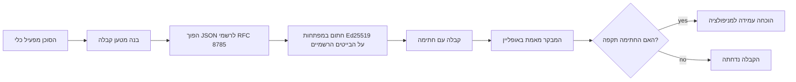
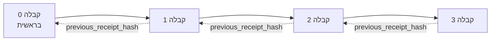

[צפו בסרטון השיעור: אבטחת סוכני AI עם קבלות קריפטוגרפיות](https://youtu.be/PLACEHOLDER_VIDEO_ID)

> _(סרטון השיעור ותמונה ממוזערת יתווספו על ידי צוות התוכן של מיקרוסופט לאחר המיזוג, בהתאמה לדפוס השיעורים 14 / 15.)_

# אבטחת סוכני AI עם קבלות קריפטוגרפיות

## מבוא

שיעור זה יעסוק ב:

- מדוע מסלולי ביקורת לסוכני AI חשובים לצורך עמידה ברגולציה, איתור תקלות ואמון.
- מהי קבלה קריפטוגרפית וכיצד היא שונה משורת לוג לא חתומה.
- כיצד לייצר קבלה חתומה עבור קריאת כלי של סוכן בפייתון רגיל.
- כיצד לאמת קבלה במצב לא מקוון ולגלות שינויי תוכן.
- כיצד לקשר קבלות כך שהסרה או שינוי סדר של אחת יפגום בשרשרת.
- מה הקבלות מוכיחות ומה הן במפורש אינן מוכיחות.

## מטרות הלמידה

לאחר השלמת שיעור זה, תדעו כיצד:

- לזהות מצבי כשל שמניעים צורך במקור קריפטוגרפי לפעולות הסוכן.
- לייצר קבלה חתומה ב-Ed25519 על מטען JSON קנוני.
- לאמת קבלה באופן עצמאי באמצעות המפתח הציבורי בלבד של החותם.
- לגלות שינויי תוכן על ידי ביצוע אימות חוזר על קבלה ששונתה.
- לבנות רצף מקושר של קבלות ולהסביר מדוע השרשרת חשובה.
- להבחין בגבול בין מה שהקבלות מוכיחות (שייכות, שלמות, סדר) לבין מה שהן אינן מוכיחות (תקינות הפעולה, הצלילות של המדיניות).

## הבעיה: מסלול הביקורת של הסוכן שלך

דמיינו כי פרסתם סוכן AI עבור Contoso Travel. הסוכן קורא בקשות לקוח, קורא ל-API של טיסות כדי לבדוק אפשרויות, ומזמין מושבים עבור הלקוח. ברבעון האחרון שמעבד הסוכן 50,000 הזמנות.

היום מגיע מבקר. הוא שואל שאלה פשוטה: "הראה לי מה עשה הסוכן שלך."

אתם מוסרים את קבצי הלוג. המבקר מביט בהם ושואל שאלה מסובכת יותר: "איך אני יודע שהלוגים האלה לא נערכו?"

זו בעיית מסלול הביקורת. רוב הפריסות של סוכנים כיום נסמכות על:

- **לוגים של יישומים**: נכתבים על ידי הסוכן עצמו, ניתנים לעריכה על ידי כל מי שיש לו גישה למערכת הקבצים.
- **שירותי רישום ענניים**: הוכחות לשינוי ברמות הפלטפורמה אך רק אם המבקר סומך על מפעיל הפלטפורמה.
- **לוגי עסקאות של מסדי נתונים**: מתאימים לשינויים במסד הנתונים אך לא לקריאות כלי שרירותיות.

אף אחד מהם לא יכול לענות על שאלת המבקר מבלי להדגיש את הצורך באמון במישהו (אתם, ספק הענן שלכם, ספק מסד הנתונים שלכם). לשימוש פנימי האמון הזה לרוב תקין. לעומסי עבודה מפוקחים (פיננסים, בריאות, כל דבר תחת חוק AI של האיחוד האירופי), הוא אינו.

קבלות קריפטוגרפיות פותרות זאת על ידי כך שכל פעולה של הסוכן ניתנת לאימות עצמאי. המבקר אינו צריך לסמוך עליכם. הוא רק צריך את המפתח הציבורי שלכם ואת הקבלה עצמה.

## מהי קבלה קריפטוגרפית?

קבלה היא אובייקט JSON שמתעד מה הסוכן עשה, חתום עם חתימה דיגיטלית.


```mermaid
flowchart LR
    A[הסוכן מפעיל כלי] --> B[בנה מטען קבלה]
    B --> C[הפוך JSON לרשמי RFC 8785]
    C --> E[חתום במפתחות Ed25519 על הבייטים הרשמיים]
    E --> F[קבלה עם חתימה]
    F --> G[המבקר מאמת באופליין]
    G --> H{האם החתימה תקפה?}
    H -- yes --> I[הוכחה עמידה למניפולציה]
    H -- no --> J[הקבלה נדחתה]
```

קבלה מינימלית נראית כך:

```json
{
  "type": "agent.tool_call.v1",
  "agent_id": "contoso-travel-bot",
  "tool_name": "lookup_flights",
  "tool_args_hash": "sha256:a3f9c1...",
  "result_hash": "sha256:7b2e1d...",
  "policy_id": "contoso-travel-policy-v3",
  "timestamp": "2026-04-25T14:30:00Z",
  "sequence": 47,
  "previous_receipt_hash": "sha256:9d4e6a...",
  "signature": {
    "alg": "EdDSA",
    "sig": "c5af83...",
    "public_key": "8f3b2c..."
  }
}
```

שלוש תכונות מבצעות את העבודה:

1. **החתימה**. הקבלה חתומה על ידי שער הסוכן באמצעות מפתח פרטי Ed25519. כל מי שיש בידו את המפתח הציבורי המתאים יכול לאמת את החתימה במצב לא מקוון. שינוי בכל שדה מבטל את התקפות החתימה.

2. **קידוד קנוני**. לפני החתימה, הקבלה מסודרת באמצעות JSON Canonicalization Scheme (JCS, RFC 8785). זה מבטיח ששני מימושים המייצרים את אותה קבלה לוגית ייצרו פלט זהה ביתר ביטים. ללא קנוניזציה, מיישמי JSON שונים היו מייצרים חתימות שונות על אותו תוכן.

3. **קישור שרשרת באמצעות חשיש**. השדה `previous_receipt_hash` מקשר כל קבלה לזו שלפניה. הסרה או שינוי הסדר של קבלה שוברת כל קבלה שבאה אחריה. שינוי תוכן נראה ברמת השרשרת גם אם חתימות בודדות עוקפות.

יחד תכונות אלה מספקות שלוש הבטחות:

- **השתייכות**: מפתח זה חתם על תוכן זה.
- **שלמות**: התוכן לא השתנה מאז החתימה.
- **סדר**: קבלה זו הגיעה אחרי קבלה זו בשרשרת.

## ייצור קבלה בפייתון

אין צורך בספרייה מיוחדת כדי לייצר קבלה. היסודות הקריפטוגרפיים זמינים ברבים והלוגיקה היא כמה עשרות שורות פייתון.

התרגילים המעשיים ב-`code_samples/18-signed-receipts.ipynb` מעבירים את כל התהליך. הגרסה המסכמת:

```python
import json
import hashlib
import base64
from nacl import signing
from jcs import canonicalize  # JSON קנוני בהתאם ל-RFC 8785

def b64url_nopad(data: bytes) -> str:
    return base64.urlsafe_b64encode(data).decode("ascii").rstrip("=")

def sha256_canonical(obj) -> str:
    """SHA-256 of a Python object's JCS-canonical JSON form."""
    return f"sha256:{hashlib.sha256(canonicalize(obj)).hexdigest()}"

# הפק או טען מפתח חתימה (בייצור, שמור אותו בארון מפתחות)
signing_key = signing.SigningKey.generate()
verify_key = signing_key.verify_key

# בנה את תוכן הקבלה (עדיין ללא חתימה)
tool_args = {"origin": "SYD", "destination": "LAX"}
tool_result = [{"flight": "QF11", "price": 1850, "stops": 0}]

payload = {
    "type": "agent.tool_call.v1",
    "agent_id": "contoso-travel-bot",
    "tool_name": "lookup_flights",
    "tool_args_hash": sha256_canonical(tool_args),
    "result_hash": sha256_canonical(tool_result),
    "policy_id": "contoso-travel-policy-v3",
    "timestamp": "2026-04-25T14:30:00Z",
    "sequence": 0,
    "previous_receipt_hash": None,
}

# הפוך לקנוני וחתום ישירות על הבייטים של JCS. PureEdDSA מבצע שטחי גיבוב פנימיים.
canonical_bytes = canonicalize(payload)
signature_bytes = signing_key.sign(canonical_bytes).signature

# צרף אובייקט חתימה מובנה.
receipt = {
    **payload,
    "signature": {
        "alg": "EdDSA",
        "sig": b64url_nopad(signature_bytes),
        "public_key": b64url_nopad(bytes(verify_key)),
    },
}
```

זה כל צינור החתימה. התרגילים במחברת מסבירים כל שלב.

## אימות קבלה וגילוי שינויי תוכן

האימות הוא הפעולה ההפוכה:

```python
import base64
import hashlib
from nacl import signing
from nacl.exceptions import BadSignatureError
from jcs import canonicalize

def b64url_decode(s: str) -> bytes:
    padding = "=" * ((4 - len(s) % 4) % 4)
    return base64.urlsafe_b64decode(s + padding)

def verify_receipt(receipt: dict) -> bool:
    # החתימה היא אובייקט מובנה: {"alg", "sig", "public_key"}.
    sig_obj = receipt.get("signature")
    if not sig_obj or sig_obj.get("alg") != "EdDSA":
        return False

    # שוחזר את המטען שנחתם בפועל (הכל חוץ מהחתימה).
    payload = {k: v for k, v in receipt.items() if k != "signature"}

    canonical_bytes = canonicalize(payload)

    try:
        verify_key = signing.VerifyKey(b64url_decode(sig_obj["public_key"]))
        verify_key.verify(canonical_bytes, b64url_decode(sig_obj["sig"]))
        return True
    except BadSignatureError:
        return False
```

הפונקציה הזו מקבלת קבלה ומחזירה `True` אם החתימה תקפה, `False` אחרת. אין קריאה לרשת, אין תלות בשירות, אין צורך באמון לצד שלישי כלשהו.

כדי לראות גילוי שינויי תוכן בפעולה, המחברת מתארת:

1. ייצור קבלה תקפה ואישור שהיא מאומתת.
2. שינוי בתא בודד בשדה `tool_args_hash`.
3. הפעלת אימות חוזר וראו שהוא נכשל.

זה ההדגמה המעשית שקבלות הן עמידות לשינוי: כל שינוי, גם הקטן ביותר, שוברת את החתימה.

## קישור קבלות לסוכנים מרובי שלבים

קבלה חתומה בודדת מגינה על פעולה אחת. שרשרת קבלות מגינה על רצף פעולות.


```mermaid
flowchart LR
    R0[קבלה 0<br/>בראשית] --> R1[קבלה 1]
    R1 --> R2[קבלה 2]
    R2 --> R3[קבלה 3]
    R1 -. previous_receipt_hash .-> R0
    R2 -. previous_receipt_hash .-> R1
    R3 -. previous_receipt_hash .-> R2
```

כל קבלה מתעדת את החשיש של הקבלה הקודמת לה. כדי להסיר שקט וקבלה 2 בשקט, התוקף יצטרך לשנות את:

- שדה `previous_receipt_hash` של קבלה 3 (מפוגם את חתימת קבלה 3), או
- לזייף חתימה חדשה על קבלה 3 ששונתה (דורש את המפתח הפרטי של הסוכן).

אם המפתח הפרטי מאוחסן במאגר חומרה ואתם מפרסמים את המפתח הציבורי עם כל קבלה, אף אחד מהתקיפות לא אפשרית מבלי להתגלות.

המחברת מסבירה:

1. בניית שרשרת של שלוש קבלות.
2. אימות שכל `previous_receipt_hash` מתאים לחשיש האמיתי של הקבלה הקודמת.
3. שינוי קבלה אחת באמצע וראיית שבירת השרשרת בדיוק בנקודה זו.

זה כיצד מייצרים מסלול ביקורת שמבקר חיצוני יכול לאמת מבלי לסמוך עליכם.

## מה הקבלות מוכיחות (ומה הן אינן מוכיחות)

זה החלק החשוב ביותר בשיעור זה. הקבלות הן עוצמתיות אך העוצמה שלהן מוגבלת.

**קבלות מוכיחות שלוש דברים:**

1. **השתייכות**: מפתח מסוים חתם על מטען מסוים.
2. **שלמות**: המטען לא השתנה מאז החתימה.
3. **סדר**: קבלה זו הגיעה אחרי קבלה זו בשרשרת החשיש.

**קבלות אינן מוכיחות:**

1. **תקינות**: שהפעולה של הסוכן הייתה הפעולה הנכונה. קבלה יכולה להחתים גם תשובה שגויה בדיוק כמו תשובה נכונה.
2. **עמידה במדיניות**: שהמדיניות המצוטטת ב-`policy_id` הוערכה בפועל, או שהפעולה הזו הייתה מותרת. הקבלה מתעדת מה נטען, לא מה נאכף.
3. **זהות מעבר למפתח**: הקבלה אומרת "מפתח זה חתם על תוכן זה." היא אינה אומרת "אדם זה אישר זאת." חיבור בין מפתח לאדם או ארגון דורש תשתית זהות נפרדת (ספרייה, רישום מפתחות ציבוריים וכו').
4. **אמת הנתונים הקלטיים**: אם הסוכן מקבל פקודה מניפולטיבית ופועל על פיה, הקבלה מתעדת את הפעולה בנאמנות. הקבלות נמצאות אחרי אימות הקלט, לא תחליף לו.

גבול זה חשוב משתי סיבות:

- הוא מבהיר מה הקבלות שימושיות עבורו: להפוך את התנהגות הסוכן לניתנת לבדיקה ולגילוי שינויי תוכן, אפילו בין גבולות ארגוניים.
- הוא מבהיר אילו שכבות נוספות דרושות לכם עדיין: אימות קלט (שיעור 6), אכיפת מדיניות (מוסבר בקצרה בהמשך), ותשתית זהות (מחוץ להיקף השיעור).

טעות נפוצה היא להניח ש"יש לנו קבלות" משמעותו "אנחנו נשלטים." זה לא כך. הקבלות הן יסוד. השליטה היא המערכת שאתם בונים מעליה.

## הוכחת אדם שאישר את הפעולה המדויקת

סעיף 3 לעיל ראוי לסעיף נפרד: קבלת פעולה אומרת "מפתח זה חתם על תוכן זה", לעולם לא "אדם אשרר זאת." לפעולות בסיכון גבוה (החזרים, מחיקות, העברות כספים), מסגרות ממשל דורשות יותר ויותר את ההצהרה החסרה הזו, והיא ניתנת לייצור עם אותן יסודות שבניתם בשיעור זה.

המחברת הממשיכה `code_samples/human-authorization-receipts.ipynb` מוסיפה סוג קבלה שני, `human.approval.v1`, באותו מבנה מעטפה כמו קבלות השיעור (מטען טיפוסי החתום Ed25519 על בתים קנוניים של JCS, עם אובייקט `signature` מחוץ לבתים החתומים). מאשר בשם חותם את **הפעולה הקנונית המלאה ועקירתה** לפני ההוצאה לפועל; קבלת הפעולה של הסוכן נושאת את **העקירה של אותה פעולה** ואת `parent_approval_ref`, חשיש הקבלה של האישור, אותו קונבנציית `previous_receipt_hash` בשרשרת שיצרתם למעלה. פונקציית `verify_chain` אחת בודקת את שני המקרים תחת **רישומי מפתחות נפרדים** (מפתחות המאשרים מול מפתחות הסוכן), כך שהמסלול בקוד משותף אך הסמכויות לעולם אינן.

התכונה שמקבלים, מנוסחת בקפידה: *האדם אישר את הפעולה המדויקת הזו, והסוכן ביצע בדיוק את הפעולה שאושרה.* תיקי הסירוב במחברת הם מה שגורם לתכונה להיות מציאותית ולא רק הבעת טענה:

- הקבוצה הקלאסית: שינוי תוכן, שליח מבלבל, הפעלה חוזרת, זיוף מפתחות בכל צד, קלט פגום;
- **סמכות מיושנת**: חתימה שעדיין מאומתת, נדחתה בכל זאת כי גרסת המדיניות זזה, מפתח המאשר הוצא מהרישום המוקפץ, או האישור פג תוקף לפני ביצוע;
- **החלפת עקירה**: קבלת פעולה חתומה תקפה המצביעה על *אישור אמת* שקושר *פעולה קנונית שונה*.

כל כישלון נדחה מסיבה מובחנת, כך שמבקר שקורא סירוב יכול להבחין אם הסמכות התיישנה או שהפעולה שבוצעה השתנתה. הכלל שהמחברת מלמדת: אישור חתום איננו סמכות בפני עצמו. סמכות קיימת רק אם שתי הקבלות עדיין קשורות לאותה פעולה קנונית בזמן הביצוע. קבלת אישור האדם היא קומפוזיציה חינוכית שהוגדרה בשיעור זה, לא סוג קבלה שהוגדר ב-`draft-farley-acta-signed-receipts`.

## הפניות לייצור

קוד הפייתון בשיעור זה הוא מכוון להיות מינימלי כדי שתוכלו לקרוא כל שורה ולהבין בדיוק מה קורה. בייצור, יש לכם שתי אפשרויות:

1. **לבנות ישירות על היסודות הקריפטוגרפיים.** 50 השורות שראיתם כאן מספיקות למקרים רבים. PyNaCl (Ed25519) ו-`jcs` (JSON קנוני) הן ספריות מתוחזקות ונבדקות היטב.

2. **להשתמש בספריית קבלות לייצור.** מספר פרויקטים בקוד פתוח מממשים את אותה דפוס עם תכונות נוספות (סיבוב מפתחות, אימות בקבוצה, הפצת JWK Set, אינטגרציה עם מנועי מדיניות):
   - צינור החתימה משתמש בקונבנציות JCS ותחום החתימה ב-IETF Internet-Draft עצמאי ([`draft-farley-acta-signed-receipts`](https://datatracker.ietf.org/doc/draft-farley-acta-signed-receipts/), גרסה 02). קבלת ההסבר החינוכית של השיעור שונה מהמעטפה `{payload, signature}` של הטיוטה ואינה מוצגת כמימוש תואם. הטיוטה מפרסמת חבילת בדיקת תאימות משותפת ([agent-governance-testvectors](https://github.com/ScopeBlind/agent-governance-testvectors)) למימושים המיועדים לפורמט הרשת שלה.
   - Microsoft Agent Governance Toolkit יוצרת קבלות עם החלטות מדיניות מבוססות Cedar; ראו את המדריך 33 במאגר זה כדוגמה מקצה לקצה.
   - החבילות `protect-mcp` (npm) ו-`@veritasacta/verify` (npm) מספקות מימוש מבוסס Node של חתימה ואימות לא מקוון של קבלות, מיועדות לעטוף כל שרת MCP עם מסלול ביקורת עמיד לשינוי, כולל זרם המתנה לאישור בו פעולה מושהית מפיקה קבלת אישור קשורה לעקירת הפעולה (WebAuthn-מגובה בזרם שולחן העבודה), אותו תבנית קבלת אישור כמו במחברת האישורים האנושיים למעלה.
   - ערכת ה-SDK של Python **[nobulex](https://github.com/arian-gogani/nobulex)** (`pip install nobulex`) מספקת את אותו דפוס חתימה Ed25519 + JCS בפייתון עם אינטגרציות LangChain ו-CrewAI, כולל וקטורי בדיקת התמדה מפורסמים ומיפוי עמידה בתקן שהוגש דרך [OWASP PR #2210](https://github.com/OWASP/CheatSheetSeries/pull/2210).

ההחלטה בין לבנות לבד לבין שימוש בספרייה היא כמו ההחלטה בין לכתוב ספריית JWT משלכם לבין להשתמש בספרייה שנבדקה: שניהם סבירים; הספרייה חוסכת זמן ומקטינה את משטח הביקורת; הגישה מהיסוד מאלצת אתכם להבין כל יסוד. השיעור מלמד את דרך הבנייה מהיסוד כדי שתהיה לכם הבסיס לכל בחירה.

## בדיקת ידע

בדקו את הבנתכם לפני המעבר לתרגול המעשי.

**1. קבלה חתומה במפתח הפרטי Ed25519 של הסוכן. למבקר יש רק את המפתח הציבורי. האם המבקר יכול לאמת את הקבלה במצב לא מקוון?**

<details>
<summary>תשובה</summary>

כן. אימות Ed25519 דורש רק את המפתח הציבורי ואת הבתים החתומים. אין קריאה לרשת, אין תלות בשירות. זוהי התכונה שהופכת את הקבלות לשימושיות בסביבות מבודדות, רב-ארגוניות או בעלות אמון נמוך.
</details>

**2. תוקף משנה את שדה ה-`policy_id` של קבלה כדי לטעון שהיא נשלטה על ידי מדיניות מתירנית יותר. החתימה הייתה על המטען המקורי. מה קורה במהלך האימות?**

<details>
<summary>תשובה</summary>


האימות נכשל. החתימה חושבה מעל הביטים הקנוניקליים של ההטענה המקורית; שינוי בכל שדה משנה את הביטים האלה, מה שהופך את החתימה לכפופה. התוקף היה צריך את המפתח הפרטי כדי ליצור חתימה חדשה תקפה, שהוא אינו מחזיק בו.
</details>

**3. למה הקבלה כוללת `tool_args_hash` ו-`result_hash` במקום את הפרמטרים הגולמיים ואת התוצאה?**

<details>
<summary>תשובה</summary>

שני סיבות. ראשית, ייתכן שצריך לארכיב או להעביר את הקבלה בסביבות שבהן חשיפת התוכן הגולמי (מידע מזהה אישי, נתוני עסק) מהווה בעיה. גיבוב שומר על הקבלה קטנה ועל התוכן פרטי; הבודק מאמת שהגיבוב תואם עותק שמור בנפרד של התוכן האמיתי. שנית, לגיבובים יש גודל קבוע; קבלה עם גיבובים מוגבלת בגודלה ללא תלות בגודל הקלטים והפלטים.
</details>

**4. שדה `previous_receipt_hash` מקשר כל קבלה לקודמתה. אם תוקף מוחק בשקט קבלה אחת מאמצע השרשרת, מה הופך לכפוף?**

<details>
<summary>תשובה</summary>

כל קבלה שהגיעה אחרי האחת שנמחקה. שדות `previous_receipt_hash` שלהם כבר אינם תואמים לשרשרת בפועל (כי הקבלה שאליה התייחסו כבר לא קיימת, או שהשרשרת מציינת כעת קודמת אחרת). כדי להסתיר את המחיקה, התוקף היה צריך לחתום מחדש על כל הקבלות המאוחרות יותר, מה שדורש את המפתח הפרטי.
</details>

**5. קבלה מאומתת בצורה נקייה. האם זה מוכיח שפעולת הסוכן הייתה נכונה, תקפה או לפי המדיניות?**

<details>
<summary>תשובה</summary>

לא. קבלה תקפה מוכיחה שלושה דברים: ייחוס (המפתח הזה חתם על התוכן הזה), שלמות (התוכן לא השתנה), והזמנה (הקבלה הזו הגיעה אחרי ההיא). היא לא מוכיחה שהפעולה הייתה נכונה, שהמדיניות בשם `policy_id` אכן הוערכה, או שהסוכן פעל לפי כל הכללים. קבלות עושות את התנהגות הסוכן ברת ביקורת, לא בהכרח נכונה. זו הגבול החשוב ביותר בשיעור.
</details>

## תרגול מעשי

פתח את `code_samples/18-signed-receipts.ipynb` והשלים את כל ארבעת הסעיפים:

1. **סעיף 1**: חתום על הקבלה הראשונה שלך ואמת אותה.
2. **סעיף 2**: פגע בקבלה וצפה בכישלון האימות.
3. **סעיף 3**: בנה שרשרת של שלוש קבלות ואמת את שלמות השרשרת.
4. **סעיף 4**: החל את התבנית על סוכן שבנוי עם Microsoft Agent Framework: עטוף קריאת כלי בחתימת קבלה, ואז אמת את הקבלה בנפרד.

**אתגר מתוח 1:** הרחב את סכמת הקבלה עם שדה נוסף שתבחר (למשל, מזהה בקשה למעקב), עדכן את הלוגיקה הקנוניקלית של החתימה לכלול אותו, ואמת שהקבלה עדיין עוברת בדיקה. אז שנה את השדה אחרי החתימה ואמת שכישלון האימות קורה. זה מאלץ אותך להבין איך כל בית בקידוד הקנוני תורם לחתימה.

**אתגר מתוח 2:** חישב SHA-256 על שתי קבלות שלך יחד (שרשר את הביטים הקנוניים בסדר דטרמיניסטי) והטמע את העיכול המתקבל כשדה חדש על קבלה שלישית לפני החתימה שלה. אמת שכל שלוש הקבלות עדיין עובדות בהלוך ושוב. זה בניית הוכחת הכללה של שלב אחד: כל מי שמחזיק בקבלה השלישית יכול להוכיח שהשתי הראשונות היו קיימות בזמן שחתמו עליה, בלי צורך לחשוף את תוכנן. זו התבנית שקטעי קבלה להיחשפות סלקטיבית משתמשים בה בהרחבה (מחויבויות מרקל, RFC 6962).

## סיכום

קבלות קריפטוגרפיות נותנות לסוכני AI שביל ביקורת ש:

- **ניתן לאימות באופן עצמאי**: כל צד עם המפתח הציבורי יכול לאמת, ללא תלות בשירות.
- **עיקוב לפגיעה**: כל שינוי מבטל את החתימה.
- **ניידות**: הקבלה היא קובץ JSON קטן; ניתן לארכיב, להעביר ולאמת אותה בכל מקום.
- **תואם לסטנדרטים**: מבוסס על Ed25519 (RFC 8032), JCS (RFC 8785), ו-SHA-256, כולם פרימיטיבים נפוצים.

הן לא תחליף לאימות קלט, לאכיפת מדיניות או לתשתית זהויות. הן הבסיס לשכבות אלו. כשאתה מיישם סוכנים בעומסי עבודה מפוקחים, זרימות עבודה רב-ארגוניות, או כל סביבה שבה קשה להניח שבודק עתידי יכבד אותך, הקבלות הן איך עושים שביל ביקורת אמין.

המסקנה החשובה ביותר: הקבלות מוכיחות מי אמר מה ומתי. הן לא מוכיחות שהדברים שנאמרו היו נכונים או נכונים באופן מוסרי. החזיקו בהפרדה הזו בחוזקה. זה ההבדל בין מערכת מקורית אמינה למטעה.

## רשימת בדיקה לייצור

כשאתה מוכן לסיים את השיעור הזה ולהפעיל סוכנים עם קבלות חתומות בסביבה אמיתית:

- [ ] **העבר את מפתח החתימה מלפטופ המפתח.** השתמש ב-Azure Key Vault, AWS KMS, או מודול אבטחה חומרתי. המפתח הפרטי שחותם על הקבלות שלך אסור שיחיה במערכת ניהול קוד או בטקסט ברור במכונות האפליקציה.
- [ ] **פרסם את המפתח הציבורי לאימות.** הבודקים צריכים אותו לאימות אופליין. התבנית הסטנדרטית היא JWK Set בכתובת URL ידועה (RFC 7517), למשל `https://your-org.example.com/.well-known/agent-keys.json`.
- [ ] **עגן את השרשרת מבחוץ.** מדי פעם כתוב את גיבוב ראש השרשרת האחרון ביומן שקיפות (Sigstore Rekor, RFC 3161 timestamp authority, או מערכת פנימית שנייה) כדי שצד חיצוני יוכל לאשר "השרשרת הזו הייתה קיימת בזמן זה."
- [ ] **האחסן קבלות באופן בלתי משתנה.** אחסון בלוב מוסיף בלבד (כמו Azure Storage עם מדיניות אי-שינוי, AWS S3 Object Lock) מונע מהפנים לשכתב היסטוריה בשכבת האחסון.
- [ ] **החלט על שימור.** Many compliance regimes דורשים שימור של מספר שנים. תכנן לצמיחת הקבלות (כל קבלה היא בערך 500 בתים; סוכן שעושה 10K קריאות ביום מייצר כ-1.8GB בשנה).
- [ ] **תעוד מה הקבלות לא מכסות.** הקבלות מוכיחות ייחוס, שלמות והזמנה. ספר הריצה שלך צריך לרשום מפורשות אילו שליטות נוספות (אימות קלט, אכיפת מדיניות, הגבלת קצב, תשתית זהויות) נמצאות לצדן בפוזיציית הממשל שלך.

### יש לך שאלות נוספות לגבי אבטחת סוכני AI?

הצטרף ל-[Microsoft Foundry Discord](https://aka.ms/ai-agents/discord) כדי לפגוש לומדים אחרים, להשתתף בשעות קבלה, ולקבל מענה על שאלות AI Agents שלך.

## מעבר לשיעור זה

השיעור עוסק בחתימה על קבלה יחידה ושרשראות מבוססות גיבוב. אותם פרימיטיבים יוצרים כמה דפוסים מתקדמים יותר שתיתקל בהם ככל שפוזיציית הממשל שלך מתפתחת:

- **חשיפה סלקטיבית.** כשלשדות בקבלה יש התחייבות נפרדת (עץ מרקל בסגנון RFC 6962), אפשר לחשוף שדות ספציפיים לבררנים ספציפיים ולהוכיח שהשאר לא השתנו בלי לחשוף אותם. שימושי כשאותה קבלה צריכה לספק גם ביקורת מקיפה (שרוצה שלמות) וגם עמידה בתקנות הפחתת נתונים כמו GDPR (שרוצות שהבורר יראה הכי מעט שנדרש).
- **ביטול קבלה.** אם מפתח חתימה נפגע, צריך דרך לסמן את כל הקבלות שחתומות על ידי אותו מפתח כאמינות פחותה מנקודת זמן מסוימת ואילך. דפוסים רגילים: מפתחות חתימה קצרים יחד עם רשימת ביטול מפורסמת, או יומן שקיפות עם רשומות ביטול.
- **קבלות עם חתימות דו-צדדיות / מפוצלות.** יש מימושים שמפרקים את ההטענה החתומה לחצי טרם-הרצה (`authorization_*`) וחצי לאחר-הרצה (`result_*`) עם חתימות נפרדות, שימושי כשחלטת ההרשה והתוצאה הנצפית מיוצרים על ידי שחקנים שונים או בזמנים שונים. זה מוסיף באופן מצטבר על פורמט הקבלה שנלמד בשיעור.
- **הרכבת הטענה.** הקבלה אוטמת כל הביטים שאתה שם ב-`result_hash`. הטענות בעולם האמיתי לרוב עשירות יותר מתוצאת קריאת כלי יחידה: תהליכי חשיבה לפני ההחלטה (חיזוי מודל, אפשרויות שנשקלו, הראיות וקמילותן, עמדת סיכון, שרשרת אחריות, תוצאת שער), כולם יכולים להיות בתוך ההטענה, אוטמים בחתימה אחת. זה שומר על פורמט הקבלה מינימלי תוך ומתן לאבני הסכמה להתפתח תחום אחר תחום.
- **עמידה חוצצת בין מימושים.** מספר מימושים עצמאיים לאותו פורמט קבלה (Python, TypeScript, Rust, Go) מאמתים זה מול זה בווקטורי בדיקה משותפים. אם אתה מיישם בעצמך, אימות מול הווקטורים המפורסמים מאשר תאימות בכבל.
- **מעבר לפוסט-קוואנטום.** Ed25519 נפוץ כיום אבל אינו עמיד בפני מחשבים קואנטיים. פורמט הקבלה גמיש: שדה `signature.alg` יכול לשאת `ML-DSA-65` (תקן החתימה הפוסט-קוואנטית של NIST) כשצריך לבצע מעבר. תכנן תקופת מעבר שבה הקבלות חתומות פעמיים.

## משאבים נוספים

- <a href="https://datatracker.ietf.org/doc/draft-farley-acta-signed-receipts/" target="_blank">טיוטת IETF: קבלות החלטה חתומות לבקרת גישה בין-מכונתית</a>
- <a href="https://learn.microsoft.com/azure/ai-studio/responsible-use-of-ai-overview" target="_blank">סקירת AI אחראי (Azure AI)</a>
- <a href="https://datatracker.ietf.org/doc/html/rfc8032" target="_blank">RFC 8032: אלגוריתם חתימת דיגיטלית ממעגל אדוארדס (EdDSA)</a>
- <a href="https://datatracker.ietf.org/doc/html/rfc8785" target="_blank">RFC 8785: סכימת קנוניקליזציה ל-JSON (JCS)</a>
- <a href="https://datatracker.ietf.org/doc/html/rfc6962" target="_blank">RFC 6962: שקיפות תעודות</a> (בניית עץ מרקל בשימוש בקבלות חשיפה סלקטיבית)
- <a href="https://github.com/microsoft/agent-governance-toolkit/blob/main/docs/tutorials/33-offline-verifiable-receipts.md" target="_blank">ערכת כלים לממשל סוכנים של מיקרוסופט, מדריך 33: קבלות החלטה שניתן לאמת אופליין</a>
- <a href="https://github.com/ScopeBlind/agent-governance-testvectors" target="_blank">וקטורי בדיקת תאימות בין מימושים</a> לפורמט הקבלה שבשיעור זה (Apache-2.0)
- <a href="https://pynacl.readthedocs.io/" target="_blank">תיעוד PyNaCl</a> (Ed25519 בפייתון)

## השיעור הקודם

[יצירת סוכני AI מקומיים](../17-creating-local-ai-agents/README.md)

---

<!-- CO-OP TRANSLATOR DISCLAIMER START -->
**כתב ויתור**:
מסמך זה תורגם באמצעות שירות תרגום אוטומטי [Co-op Translator](https://github.com/Azure/co-op-translator). למרות שאנו שואפים לדיוק, יש לקחת בחשבון שתרגומים אוטומטיים עלולים להכיל שגיאות או אי-דיוקים. יש להחשיב את המסמך המקורי בשפתו הטבעית כמקור הסמכות. למידע קריטי מומלץ להשתמש בתרגום מקצועי על ידי מתרגם אדם. אנו לא אחראים לכל אי-הבנה או פירוש שגוי הנובע מהשימוש בתרגום זה.
<!-- CO-OP TRANSLATOR DISCLAIMER END -->