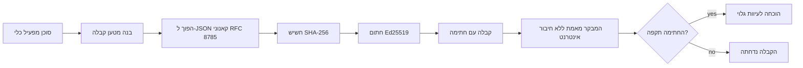
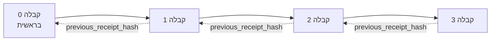

[צפו בסרטון השיעור: אבטחת סוכני AI עם קבלות קריפטוגרפיות](https://youtu.be/PLACEHOLDER_VIDEO_ID)

> _(סרטון השיעור והתמונה הממוזערת יתווספו על ידי צוות התוכן של מיקרוסופט לאחר המיזוג, בהתאם לתבנית של שיעור 14 / 15.)_

# אבטחת סוכני AI עם קבלות קריפטוגרפיות

## מבוא

שיעור זה יכסה:

- מדוע מסלולי ביקורת עבור סוכני AI חשובים לצורכי ציות, איתור שגיאות ואמון.
- מהי קבלה קריפטוגרפית וכיצד היא שונה משורת יומן לא חתומה.
- כיצד לייצר קבלה חתומה עבור קריאת כלי של סוכן בפייתון פשוט.
- כיצד לאמת קבלה ללא קישור לאינטרנט ולגלות זיוף.
- כיצד לקשר קבלות כך שהסרת קבלה או שינוי הסדר שלה יביא לקריסת השרשרת.
- מה הקבלות מוכיחות ומה הן במפורש לא מוכיחות.

## יעדי לימוד

לאחר סיום שיעור זה, תדעו כיצד:

- לזהות מצבי כשל המניעים מקור קריפטוגרפי לפעולות סוכן.
- לייצר קבלה חתומה בעזרת Ed25519 על משקל JSON קנוני.
- לאמת קבלה באופן עצמאי באמצעות מפתח ציבורי בלבד של החותם.
- לזהות זיוף על ידי ביצוע אימות מחדש על קבלה שהשתנתה.
- לבנות שרשרת קבלות מקושרת בשרשרת גיבוב ולהסביר מדוע השרשרת חשובה.
- להבדיל בין מה שהקבלות מוכיחות (שייכות, שלמות, סידור) לבין מה שהן אינן מוכיחות (נכונות הפעולה, תקפות המדיניות).

## הבעיה: מסלול הביקורת של הסוכן שלך

דמיינו כי פרסתם סוכן AI עבור Contoso Travel. הסוכן קורא בקשות לקוחות, קורא API לטיסות לחיפוש אפשרויות, ומבצע הזמנות מושבים עבור הלקוח. ברבעון האחרון, הסוכן עיבד 50,000 הזמנות.

היום מגיע מבקר. הוא שואל שאלה פשוטה: "הראה לי מה הסוכן שלך עשה."

אתם מוסרים את קבצי היומן שלכם. המבקר מסתכל עליהם ושואל שאלה קשה יותר: "כיצד אני יודע שהיומנים לא שונו?"

זו הבעיה של מסלול הביקורת. רוב פריסות הסוכנים כיום מסתמכות על:

- **יומני אפליקציה**: נכתבים על ידי הסוכן עצמו, ניתנים לעריכה על ידי כל אדם שיש לו גישה לקבצי מערכת.
- **שירותי רישום בענן**: מפגינים נגישות לשינוי ברמת הפלטפורמה בלבד אם המבקר סומך על מפעיל הפלטפורמה.
- **יומני עסקאות במסד נתונים**: מתאימים מאוד לשינויים במסד הנתונים אך לא לקריאות כלים אקראיות.

אף אחד מהם אינו יכול לענות על שאלת המבקר מבלי לדרוש ממנו לסמוך על מישהו (אתה, ספק הענן שלך, ספק מסד הנתונים שלך). לשימוש פנימי, אמון זה לעיתים קרובות מקובל. למטלות מבוקרות (פיננסים, בריאות, כל דבר הנתון לחוק ה-AI של האיחוד האירופי), זה לא כך.

קבלות קריפטוגרפיות פותרות זאת בכך שהופכות כל פעולה של הסוכן לניתנת לאימות באופן עצמאי. המבקר אינו צריך לסמוך עליך. הוא צריך רק את המפתח הציבורי שלך ואת הקבלה עצמה.

## מהי קבלה קריפטוגרפית?

קבלה היא אובייקט JSON הרושם מה הסוכן עשה, חתום בחתימה דיגיטלית.


```mermaid
flowchart LR
    A[סוכן מפעיל כלי] --> B[בנה מטען קבלה]
    B --> C[הפוך ל-JSON קאנוני RFC 8785]
    C --> D[חשיש SHA-256]
    D --> E[חתום Ed25519]
    E --> F[קבלה עם חתימה]
    F --> G[המבקר מאמת ללא חיבור אינטרנט]
    G --> H{החתימה תקפה?}
    H -- yes --> I[הוכחה לעיוות גלוי]
    H -- no --> J[הקבלה נדחתה]
```

קבלה מינימלית נראית כך:

```json
{
  "type": "agent.tool_call.v1",
  "agent_id": "contoso-travel-bot",
  "tool_name": "lookup_flights",
  "tool_args_hash": "sha256:a3f9c1...",
  "result_hash": "sha256:7b2e1d...",
  "policy_id": "contoso-travel-policy-v3",
  "timestamp": "2026-04-25T14:30:00Z",
  "sequence": 47,
  "previous_receipt_hash": "sha256:9d4e6a...",
  "signature": {
    "alg": "EdDSA",
    "sig": "c5af83...",
    "public_key": "8f3b2c..."
  }
}
```

שלוש תכונות עושות את העבודה:

1. **החתימה**. הקבלה חתומה על ידי שער הסוכן באמצעות מפתח פרטי Ed25519. כל מי שיש לו את המפתח הציבורי המקביל יכול לאמת את החתימה ללא חיבור לאינטרנט. שינוי בכל שדה מבטל את תוקף החתימה.

2. **קידוד קנוני**. לפני החתימה, הקבלה מומרת לסטרינג באמצעות סכמת הקנוניזציה של JSON (JCS, RFC 8785). זה מבטיח ששתי מימושים המייצרים את אותה הקבלה הלוגית יוּלְדו פלט זהה לתו. ללא קנוניזציה, פרשנים JSON שונים היו מייצרים חתימות שונות עבור אותו תוכן.

3. **שרשרת גיבוב**. השדה `previous_receipt_hash` מקשר כל קבלה לקודמת לה. הסרה או שינוי סדר של קבלה שוברים כל קבלה שבאה אחריה. זיוף מתגלה ברמת השרשרת גם אם עוקפים חתימות בודדות.

יחד התכונות האלו מספקות שלוש הבטחות:

- **שייכות**: מפתח זה חתם על התוכן הזה.
- **שלמות**: התוכן לא השתנה מאז שנחתם.
- **סידור**: קבלה זו הגיעה לאחר קבלה אחרת בשרשרת.

## יצירת קבלה בפייתון

אינך צריך ספרייה מיוחדת כדי לייצר קבלה. הפרימיטיבים הקריפטוגרפיים זמינים ברבים והלוגיקה היא כמה עשרות שורות בפייתון.

התרגילים המעשיים בקובץ `code_samples/18-signed-receipts.ipynb` מצביעים על כל התהליך. הגרסה התקצירית:

```python
import json
import hashlib
import base64
from nacl import signing
from jcs import canonicalize  # JSON קנוני על פי RFC 8785

def b64url_nopad(data: bytes) -> str:
    return base64.urlsafe_b64encode(data).decode("ascii").rstrip("=")

def sha256_canonical(obj) -> str:
    """SHA-256 of a Python object's JCS-canonical JSON form."""
    return f"sha256:{hashlib.sha256(canonicalize(obj)).hexdigest()}"

# יצירת מפתח חתימה או טעינתו (בפרודקשן, אחסן בקופסת מפתחות)
signing_key = signing.SigningKey.generate()
verify_key = signing_key.verify_key

# בניית המטען של הקבלה (עדיין ללא חתימה)
tool_args = {"origin": "SYD", "destination": "LAX"}
tool_result = [{"flight": "QF11", "price": 1850, "stops": 0}]

payload = {
    "type": "agent.tool_call.v1",
    "agent_id": "contoso-travel-bot",
    "tool_name": "lookup_flights",
    "tool_args_hash": sha256_canonical(tool_args),
    "result_hash": sha256_canonical(tool_result),
    "policy_id": "contoso-travel-policy-v3",
    "timestamp": "2026-04-25T14:30:00Z",
    "sequence": 0,
    "previous_receipt_hash": None,
}

# הפיכת הקנוני, חישוב גיבוב, חתימה.
canonical_bytes = canonicalize(payload)
message_hash = hashlib.sha256(canonical_bytes).digest()
signature_bytes = signing_key.sign(message_hash).signature

# צורף אובייקט חתימה מובנה.
receipt = {
    **payload,
    "signature": {
        "alg": "EdDSA",
        "sig": b64url_nopad(signature_bytes),
        "public_key": b64url_nopad(bytes(verify_key)),
    },
}
```

זו כל צנרת החתימה. התרגילים במחברת מסבירים כל שלב.

## אימות קבלה וזיהוי זיוף

האימות הוא הפעולה ההפוכה:

```python
import base64
import hashlib
from nacl import signing
from nacl.exceptions import BadSignatureError
from jcs import canonicalize

def b64url_decode(s: str) -> bytes:
    padding = "=" * ((4 - len(s) % 4) % 4)
    return base64.urlsafe_b64decode(s + padding)

def verify_receipt(receipt: dict) -> bool:
    # החתימה היא אובייקט מובנה: {"alg", "sig", "public_key"}.
    sig_obj = receipt.get("signature")
    if not sig_obj or sig_obj.get("alg") != "EdDSA":
        return False

    # לבנות מחדש את המטען שנחתם בפועל (הכל פרט לחתימה).
    payload = {k: v for k, v in receipt.items() if k != "signature"}

    canonical_bytes = canonicalize(payload)
    message_hash = hashlib.sha256(canonical_bytes).digest()

    try:
        verify_key = signing.VerifyKey(b64url_decode(sig_obj["public_key"]))
        verify_key.verify(message_hash, b64url_decode(sig_obj["sig"]))
        return True
    except BadSignatureError:
        return False
```

פונקציה זו מקבלת קבלה ומחזירה `True` אם החתימה תקפה, `False` אחרת. ללא קריאת רשת, ללא תלות בשירות, ללא צורך באמון בידי צד שלישי.

כדי לראות את זיהוי הזיוף בפעולה, המחברת מראה:

1. ייצור קבלה תקפה ואישורה.
2. שינוי בתו אחד בשדה `tool_args_hash`.
3. הרצת אימות מחדש והמחשה שהאימות נכשל.

זהו ההדגמה המעשית שקבלות מוצגות כעמידות לזיוף: כל שינוי, אפילו קטן, שובר את החתימה.

## שרשור קבלות עבור סוכנים מרובי שלבים

קבלה חתומה יחידה מגינה על פעולה אחת. שרשרת קבלות מגינה על רצף פעולות.


```mermaid
flowchart LR
    R0[קבלה 0<br/>בראשית] --> R1[קבלה 1]
    R1 --> R2[קבלה 2]
    R2 --> R3[קבלה 3]
    R1 -. previous_receipt_hash .-> R0
    R2 -. previous_receipt_hash .-> R1
    R3 -. previous_receipt_hash .-> R2
```

כל קבלה מתעדת את גיבוב הקבלה הקודמת לה. למחוק בשקט את קבלה 2, התוקף יצטרך או:

- לשנות את שדה `previous_receipt_hash` של קבלה 3 (שובר את חתימת קבלה 3), או
- לזייף חתימה חדשה על קבלה 3 ששונתה (דורש את המפתח הפרטי של הסוכן).

אם המפתח הפרטי נמצא בארון מפתחות חומרתי ואתה מפרסם את המפתח הציבורי עם כל קבלה, אף אחד מהמתקפות אינו אפשרי ללא זיהוי.

המחברת מראה:

1. בניית שרשרת בעלת שלוש קבלות.
2. אימות שכל `previous_receipt_hash` בקבלה מתאים לגיבוב הקבלה הקודמת.
3. זיוף קבלה אחת באמצע וקריעת השרשרת בדיוק בנקודה זו.

כך אתה מייצר מסלול ביקורת שמבקר חיצוני יכול לאמת ללא צורך באמון בך.

## מה הקבלות מוכיחות (ומה הן אינן)

זה החלק החשוב ביותר בשיעור זה. הקבלות עוצמתיות אך יש להן גבולות.

**קבלות מוכיחות שלושה דברים:**

1. **שייכות**: מפתח מסוים חתם על מטען מסוים.
2. **שלמות**: המטען לא השתנה מאז החתימה.
3. **סידור**: קבלה זו הגיעה אחרי קבלה אחרת בשרשרת הגיבוב.

**קבלות אינן מוכיחות:**

1. **נכונות**: שהפעולה של הסוכן הייתה נכונה. ניתן לחתום על קבלה עבור תשובה שגויה בדיוק כמו לתשובה נכונה.
2. **ציות למדיניות**: שהמדיניות המצוינת ב-`policy_id` אכן הוערכה, או שהייתה מאשרת את הפעולה אם בוצע בדיקה. הקבלה מתעדת את הטענה, לא את האכיפה.
3. **זהות מעבר למפתח**: הקבלה אומרת "מפתח זה חתם על התוכן הזה." היא אינה אומרת "אדם זה אישר זאת." חיבור מפתח לאדם או ארגון דורש תשתית זהות נפרדת (מוקד מידע, רשם מפתחות ציבוריים וכו').
4. **נכונות הקלטים**: אם הסוכן מקבל קלט שונה ומגיב לפיו, הקבלה מתעדת את הפעולה ביושר. הקבלות הן אחרי אימות הקלט, לא תחליף לו.

גבול זה חשוב משתי סיבות:

- הוא מבהיר למה הקבלות שימושיות: להכשיר את התנהגות הסוכן לביקורת ולזיהוי זיוף, אפילו מעבר לגבולות ארגוניים.
- הוא מבהיר אילו שכבות נוספות עדיין נדרשות: אימות קלט (שיעור 6), אכיפת מדיניות (מוסבר בקצרה למטה), ותשתית זהות (מחוץ לתחום השיעור).

טעות נפוצה היא להניח ש"יש לנו קבלות" פירושו "אנחנו נשלטים." זה לא כך. הקבלות הן יסוד. ניהול הוא המערכת שבונים מעליו.

## מקורות ייצור

קוד הפייתון בשיעור זה הוא מינימליסטי במתכוון כדי שתוכלו לקרוא כל שורה ולהבין בדיוק מה קורה. בייצור, יש לכם שתי אפשרויות:

1. **לבנות ישירות על הפרימיטיבים הקריפטוגרפיים.** 50 השורות שראיתם למעלה מספיקות לשימושים רבים. PyNaCl (Ed25519) ו-`jcs` (JSON קנוני) הן ספריות מתוחזקות ומבוקרות היטב.

2. **לשימוש בספריית קבלות לייצור.** מספר פרויקטים בקוד פתוח מממשים את אותה דפוס עם תכונות נוספות (סיבוב מפתחות, אימות באצווה, הפצת JWK Set, אינטגרציה עם מנועי מדיניות):
   - פורמט הקבלה בשיעור זה עוקב אחר טיוטת אינטרנט IETF (`draft-farley-acta-signed-receipts`) שנמצאת בתהליך התקניות.
   - Microsoft Agent Governance Toolkit משלב קבלות עם החלטות מדיניות מבוססות Cedar; ראו את הדרכה 33 באותו מאגר עבור דוגמה מקצה לקצה.
   - חבילות `protect-mcp` (npm) ו-`@veritasacta/verify` (npm) מספקות מימוש Node של חתימת קבלות ואימות ללא חיבור, מיועדות לעטוף כל שרת MCP עם מסלול ביקורת עמיד לזיוף.
   - ה-SDK לפייתון **[nobulex](https://github.com/arian-gogani/nobulex)** (`pip install nobulex`) מספק את אותו דפוס חתימה Ed25519 + JCS בפייתון עם אינטגרציות LangChain ו-CrewAI, כולל וקטורי בדיקת תיקוף מצטלבים ומיפוי ציות שמספק PR [OWASP מס' 2210](https://github.com/OWASP/CheatSheetSeries/pull/2210).

ההחלטה בין כתיבת הקוד בעצמך לבין שימוש בספרייה דומה להחלטה בין כתיבת ספריית JWT משלך לבין שימוש בספרייה שנבדקה: שניהם סבירים; הספרייה חוסכת זמן ומפחיתה סיכון ביקורת; הגישה מאפס מאלצת אותך להבין כל פרימיטיב. שיעור זה מלמד את הדרך מאפס כדי שתהיה לך הבסיס לכל בחירה.

## בדיקת ידע

בדקו את הבנתכם לפני המעבר לתרגיל המעשי.

**1. קבלה חתומה עם מפתח פרטי Ed25519 של הסוכן. למבקר יש רק את המפתח הציבורי. האם המבקר יכול לאמת את הקבלה ללא רשת?**

<details>
<summary>תשובה</summary>

כן. אימות Ed25519 דורש רק את המפתח הציבורי והבתים החתומים. ללא קריאת רשת, ללא תלות בשירות. זו התכונה שהופכת את הקבלות לשימושיות בסביבות מבודדות, ריבוי ארגונים או ביקורת עם אמון נמוך.
</details>

**2. תוקף משנה את שדה `policy_id` בקבלה כדי לטעון כי היא נשלטה על ידי מדיניות מרחיבה יותר. החתימה הייתה על המטען המקורי. מה קורה באימות?**

<details>
<summary>תשובה</summary>

האימות נכשל. החתימה חושבה על הבתים הקנוניים של המטען המקורי; שינוי כל שדה משנה את הבתים הקנוניים, משנה את גיבוב SHA-256, וגורם לחתימה להיות לא תקפה. התוקף היה צריך את המפתח הפרטי להפיק חתימה תקפה חדשה, שאין לו.
</details>

**3. מדוע הקבלה כוללת `tool_args_hash` ו-`result_hash` במקום הפרמטרים והתוצאה הגולמיים?**

<details>
<summary>תשובה</summary>

שני סיבות. ראשית, ייתכן שהקבלה צריכה לארכב או להישלח בסביבות שבהן חשיפת התוכן הגולמי (PII, נתוני עסק) היא בעיה. הגיבוב שומר על הקבלה קטנה ועל התוכן פרטי; המבקר מאמת שהגיבוב תואם עותק נפרד של התוכן האמיתי. שנית, לגיבובים יש גודל קבוע; קבלה עם גיבובים מוגבלת בגודלה ללא קשר לגודל הקלטים והתוצאות.
</details>

**4. שדה `previous_receipt_hash` מקשר כל קבלה לקודמתה. אם תוקף מוחק בשקט קבלה באמצע השרשרת, מה יהפוך ללא תקף?**

<details>
<summary>תשובה</summary>

כל קבלה שהגיעה אחרי זו שנמחקה. שדות `previous_receipt_hash` שלהם כבר אינם תואמים לשרשרת בפועל (כי הקבלה שהם התייחסו אליה כבר לא קיימת, או שהשרשרת כעת מצביעה על קודמת שונה). כדי להסתיר את ההסרה, התוקף יצטרך לחתום מחדש כל קבלה אחרי ההסרה, מה שדורש מפתח פרטי.
</details>

**5. קבלה עוברת אימות נקי. האם זה מוכיח שהפעולה של הסוכן הייתה נכונה, תקפה או עומדת במדיניות?**

<details>
<summary>תשובה</summary>

לא. קבלה תקפה מוכיחה שלושה דברים: שייכות (מפתח זה חתם על תוכן זה), שלמות (התוכן לא השתנה), וסידור (קבלה זאת הגיעה אחרי קבלה אחרת). היא איננה מוכיחה שהפעולה הייתה נכונה, שהמדיניות שב`policy_id` אכן הוערכה, או שהסוכן פעל לפי כל חוק. קבלות מאפשרות ביקורת על התנהגות הסוכן, לא בהכרח נכונות. זה הגבול החשוב ביותר בשיעור.
</details>

## תרגיל מעשי

פתחו את `code_samples/18-signed-receipts.ipynb` והשלימו את כל ארבעת החלקים:

1. **חלק 1**: חתמו על הקבלה הראשונה שלכם ואמתו אותה.
2. **חלק 2**: זהו זיוף בקבלה וצפו באימות שנכשל.
3. **חלק 3**: בנו שרשרת של שלוש קבלות ואמתו את תקינות השרשרת.
4. **חלק 4**: השתמשו בתבנית עם סוכן שבנוי במסגרת Microsoft Agent: עטפו קריאת כלי בחתימת קבלה, ואז אמתו את הקבלה באופן עצמאי.


**אתגר מתיחה 1:** הרחב את סכמת הקבלה עם שדה נוסף לבחירתך (לדוגמה, מזהה בקשה למעקב), עדכן את הלוגיקה של החתימה הקנונית כך שתכלול אותו, ואשר שהקבלה עדיין עוברת בהצלחה תהליך אימות מעגלי. לאחר מכן שנה את השדה לאחר החתימה ואשר שהאימות נכשל. זה מאלץ אותך להבין כיצד כל בית של הקידוד הקנוני תורם לחתימה.

**אתגר מתיחה 2:** חשב SHA-256 עבור שני הקבלות שלך יחד (שרשר את הבתים הקנוניים שלהם בסדר דטרמיניסטי) ושבץ את הדיגסט הנובע כשדה חדש בקבלה שלישית לפני החתימה עליה. אמת שכל שלוש הקבלות עדיין עובדות בתהליך אימות מעגלי. זהו הוכחת הכללה של שלב אחד: כל מי שמחזיק בקבלה השלישית יכול להוכיח שהשניים הראשונים התקיימו בזמן שהיא נחתמה, מבלי לחשוף את תוכנם. זהו התבנית ששימוש בקבלות גילוי סלקטיבי בקנה מידה (התחייבויות מרקל, RFC 6962).

## סיכום

קבלות קריפטוגרפיות מעניקות לסוכני בינה מלאכותית מסלול ביקורת שהוא:

- **ניתנות לאימות עצמאי**: כל צד עם המפתח הציבורי יכול לאמת, ללא תלות בשירות.
- **עדויות שינוי-מזויפות**: כל שינוי מבטל את החתימה.
- **ניידות**: הקבלה היא קובץ JSON קטן; ניתן לארכוב, להעביר ולאמת בכל מקום.
- **תואמות תקנים**: מבוססות על Ed25519 (RFC 8032), JCS (RFC 8785) ו-SHA-256, כלים נפוצים ומקובלים.

הן אינן תחליף לאימות קלט, לאכיפת מדיניות או לתשתית זהות. הן הבסיס לשכבות אלה. כשאתה מפרסם סוכנים בעומסי עבודה מבוקרים, זרימות עבודה רב-ארגוניות או בכל סביבה שבה לא ניתן לשער שמבקר בעתיד יוכל לסמוך עליך, הקבלות הן האמצעי לשמור על מסלול ביקורת הגון.

הלקח החשוב ביותר: הקבלות מוכיחות מי אמר מה ומתי. הן אינן מוכיחות שהנאמר היה אמת או נכון. שמור על הבחנה זו בקפידה. זו ההבדלה בין מערכת מוצא כנה למערכת מטעה.

## רשימת בדיקה לפרודקשן

כאשר תהיה מוכן להתקדם מהשיעור הזה לפריסת סוכנים עם קבלות חתומות בסביבה אמיתית:

- [ ] **העבר את מפתח החתימה מהמחשב הנייד של המפתח.** השתמש ב-Azure Key Vault, AWS KMS או יחידת אבטחה חומרתית. המפתח הפרטי שחותם על הקבלות שלך אף פעם לא צריך להתקיים במערכת ניהול קוד או להיות בטקסט פשוט במכונות האפליקציה.
- [ ] **פרסם את המפתח הציבורי לאימות.** מבקרים זקוקים לו לאימות לא מקוון. התבנית המקובלת היא סט JWK בכתובת URL ידועה (RFC 7517), לדוגמה `https://your-org.example.com/.well-known/agent-keys.json`.
- [ ] **עגן את השרשרת חיצונית.** כתוב מדי פעם את ה-hash של ראש השרשרת האחרון ליומן שקיפות (Sigstore Rekor, רשאות זמן RFC 3161 או מערכת פנימית שנייה) כך שצד חיצוני יוכל לאשר "ששרשרת זו התקיימה בזמן זה."
- [ ] **אחסן קבלות ללא שינוי.** אחסון ברקמה בלבד ללא אפשרות שינוי (Azure Storage עם מדיניות אי-שינוי, AWS S3 Object Lock) מונע מהאיש הפנימי לשכתב היסטוריה בשכבת האחסון.
- [ ] **החליט על מדיניות שימור.** מערכות תאימות רבות דורשות שימור רב-שנתי. תכנן את הגידול בכמות הקבלות (כל קבלה היא כ-500 בתים; סוכן המבצע 10,000 קריאות ביום מייצר כ-1.8GB בשנה).
- [ ] **תעד מה הקבלות אינן מכסות.** הקבלות מוכיחות שיוך, שלמות וסידור. ספר ההוראות שלך צריך לציין במפורש אילו בקרים נוספים (אימות קלט, אכיפת מדיניות, הגבלת קצב, תשתית זהות) פועלים לצד הקבלות במצבת הממשל שלך.

### יש לך שאלות נוספות לגבי אבטחת סוכני בינה מלאכותית?

הצטרף ל-[Microsoft Foundry Discord](https://aka.ms/ai-agents/discord) כדי לפגוש לומדים אחרים, להשתתף בשעות פתוחות, ולקבל מענה על שאלות בנוגע לסוכני בינה מלאכותית.

## מעבר לשיעור זה

שיעור זה מכסה חתימה על קבלה יחידה ורצפים בשרשרת hash. אותם כלים מהווים בסיס לדפוסים מתקדמים נוספים שתיתקל בהם ככל שמצבת הממשל שלך תתפתח:

- **גילוי סלקטיבי.** כאשר שדות הקבלה מחויבים באופן עצמאי (עץ מרקל בסגנון RFC 6962), ניתן לחשוף שדות ספציפיים למבקרים מסוימים ולהוכיח שהשאר לא שונו מבלי לחשוף אותם. שימושי כאשר אותה קבלה צריכה לספק גם ביקורת מקיפה (הדורשת שלמות) וגם התאמה לתקנות מיזעור נתונים כמו GDPR (דורש שהמבקר יראה הכי מעט שנדרש).
- **ביטול קבלות.** אם מפתח החתימה נפגע, יש צורך בדרך לסמן את כל הקבלות שנחתמו על ידי אותו מפתח כלא אמינות מנקודת זמן מסוימת ואילך. דפוסים מקובלים: מפתחות חתימה בעלי תוקף קצר ברשימת ביטולים מפורסמת, או יומן שקיפות עם רשומות ביטול.
- **קבלות חתימה דו-צדדית/מחולקת.** יישומים מסוימים מפצלים את המטען החתום לחצי טרום-הוצאה לפועל (`authorization_*`) ולחצי לאחר הוצאה לפועל (`result_*`) עם חתימות עצמאיות, שימושי כאשר החלטת האישור והתוצאה הנצפית מופקות על ידי שחקנים שונים או בזמנים שונים. זה מתווסף באופן מצטבר לפורמט הקבלה הנלמד בשיעור זה.
- **הרכבת מטען.** הקבלה אוטמת את כל הבתים שאתה משבץ ב- `result_hash`. מטענים בעולם האמיתי לעתים עשירים יותר מתוצאה של קריאת כלי יחידה: נימוק לפני החלטה (תחזית מודל, אפשרויות שנבדקו, עדויות ושלמותן, עמדת סיכון, שרשרת אחריות, תוצאת שער) יכולים להתקיים בתוך המטען, אוטמים על ידי קבלה אחת. זה שומר על פורמט הקבלה מינימלי ומאפשר לסכמות המטען להתפתח ענף-על-פי-ענף.
- **התאמה חוצת יישום.** כמה יישומים עצמאיים לאותו פורמט קבלה (Python, TypeScript, Rust, Go) מבצעים אימות נגד וקטורי בדיקה משותפים. אם אתה בונה יישום משלך, אימות מול וקטורים פומביים מבטיח תאימות בתקשורת.
- **מעבר לפוסט-קוואנטום.** Ed25519 פרוס כיום באופן נרחב אך אינו עמיד בפני מחשוב קוואנטי. פורמט הקבלה הוא גמיש אלגוריתמית: שדה `signature.alg` יכול להכיל `ML-DSA-65` (תקן החתימה הפוסט-קוואנטי של NIST) כשאתה צריך לבצע מעבר. תכנן תקופת מעבר שבה הקבלות חתומות כפול.

## משאבים נוספים

- <a href="https://datatracker.ietf.org/doc/draft-farley-acta-signed-receipts/" target="_blank">טיוטת IETF: קבלות החלטה חתומות לבקרת גישה בין-מכונות</a>
- <a href="https://learn.microsoft.com/azure/ai-studio/responsible-use-of-ai-overview" target="_blank">סקירה של שימוש אחראי בבינה מלאכותית (Azure AI)</a>
- <a href="https://datatracker.ietf.org/doc/html/rfc8032" target="_blank">RFC 8032: אלגוריתם חתימה דיגיטלית על עקומת אדוורדס (EdDSA)</a>
- <a href="https://datatracker.ietf.org/doc/html/rfc8785" target="_blank">RFC 8785: סכמת קנוניקליזציה של JSON (JCS)</a>
- <a href="https://datatracker.ietf.org/doc/html/rfc6962" target="_blank">RFC 6962: שקיפות תעודות</a> (בניית עץ מרקל המשמשת בקבלות גילוי סלקטיבי)
- <a href="https://github.com/microsoft/agent-governance-toolkit/blob/main/docs/tutorials/33-offline-verifiable-receipts.md" target="_blank">ערכת כלים לממשל סוכן ב-Microsoft, הדרכה 33: קבלות החלטה שניתנות לאימות לא מקוון</a>
- <a href="https://github.com/ScopeBlind/agent-governance-testvectors" target="_blank">וקטורי בדיקת התאמה חוצת יישום</a> לפורמט הקבלה בשיעור זה (Apache-2.0)
- <a href="https://pynacl.readthedocs.io/" target="_blank">תיעוד PyNaCl</a> (Ed25519 ב-Python)

## שיעור קודם

[בניית סוכנים לשימוש מחשב (CUA)](../15-browser-use/README.md)

---

<!-- CO-OP TRANSLATOR DISCLAIMER START -->
**כתב ויתור**:
מסמך זה תורגם באמצעות שירות תרגום אוטומטי [Co-op Translator](https://github.com/Azure/co-op-translator). למרות שאנו שואפים לדיוק, יש לקחת בחשבון שתרגומים אוטומטיים עלולים להכיל שגיאות או אי-דיוקים. יש להחשיב את המסמך המקורי בשפתו הטבעית כמקור הסמכות. למידע קריטי מומלץ להשתמש בתרגום מקצועי על ידי מתרגם אדם. אנו לא אחראים לכל אי-הבנה או פירוש שגוי הנובע מהשימוש בתרגום זה.
<!-- CO-OP TRANSLATOR DISCLAIMER END -->