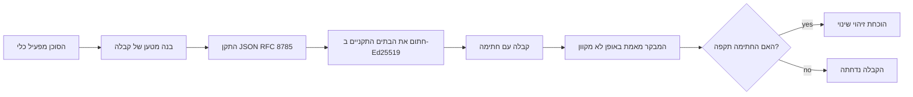
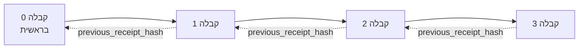

[צפו בסרטון השיעור: אבטחת סוכני בינה מלאכותית עם קבלות קריפטוגרפיות](https://youtu.be/PLACEHOLDER_VIDEO_ID)

> _(סרטון השיעור והתמונה המקדימה יתווספו על ידי צוות התוכן של Microsoft לאחר המיזוג, בהתאמה לדפוס של שיעור 14 / 15.)_

# אבטחת סוכני בינה מלאכותית עם קבלות קריפטוגרפיות

## מבוא

בשיעור זה תלמדו על:

- מדוע מסלולי ביקורת לסוכני בינה מלאכותית חשובים לצורך תאימות, איתור תקלות ואמון.
- מהי קבלה קריפטוגרפית וכיצד היא שונה משורת לוג לא חתומה.
- כיצד ליצור קבלה חתומה עבור קריאת כלי של סוכן בפייתון פשוט.
- כיצד לאמת קבלה באופן מקומי ולגלות זיופים.
- כיצד לקשר קבלות כך שהסרה או שינוי סדר של אחת מהן שוברת את השרשרת.
- מה הקבלות מוכיחות ומה הן במפורש אינן מוכיחות.

## מטרות הלמידה

לאחר השלמת השיעור תדעו כיצד:

- לזהות מצבי כשל שמניעים את הצורך במקור קריפטוגרפי לפעולות הסוכן.
- ליצור קבלה חתומה עם Ed25519 מעל מטען JSON קנוני.
- לאמת קבלה באופן עצמאי תוך שימוש במפתח ציבורי בלבד.
- לזהות זיופים על ידי הרצת אימות מחודשת על קבלה ששונתה.
- לבנות רצף קבלות מקושר עם גיבוב והסבר מדוע השרשרת חשובה.
- לזהות את הגבול בין מה שהקבלות מוכיחות (שייכות, שלמות, סדר) ומה שהן אינן מוכיחות (נכונות הפעולה, תקפות המדיניות).

## הבעיה: מסלול הביקורת של הסוכן שלך

דמיינו שפיתחתם סוכן בינה מלאכותית עבור Contoso Travel. הסוכן קורא בקשות לקוחות, קורא ל-API של טיסות לבדיקת אפשרויות, ומזמין מקומות לטובת הלקוח. ברבעון האחרון, הסוכן ביצע 50,000 הזמנות.

היום מגיע מבקר. הוא שואל שאלה פשוטה: "הראה לי מה הסוכן שלך עשה."

אתם מוסרים לו את קבצי הלוג שלכם. המבקר מסתכל עליהם ושואל שאלה קשה יותר: "איך אני יודע שקבצי הלוג האלה לא עברו עריכה?"

זו בעיית מסלול הביקורת. רוב פריסות הסוכנים היום מסתמכות על:

- **יומני יישומים**: נכתבים על ידי הסוכן עצמו, ניתנים לעריכה על ידי כל מי שיש לו גישה למערכת הקבצים.
- **שירותי לוג בענן**: מוגנים מפני זיופים ברמת הפלטפורמה, אבל רק אם המבקר סומך על מפעיל הפלטפורמה.
- **יומני עסקות של מסד נתונים**: מתאימים לשינויים במסד הנתונים אך לא לקריאות כלים שרירותיות.

אף אחד מהם אינו יכול לענות על שאלת המבקר מבלי שהמבקר יצטרך לבטוח במישהו (בכם, בספק הענן שלכם, בספק מסד הנתונים שלכם). לשימוש פנימי, אמון זה לעיתים קרובות מקובל. לעומסי עבודה עם רגולציה (פיננסים, בריאות, כל דבר תחת חוק ה-AI של האיחוד האירופי) זה לא מתקבל על הדעת.

קבלות קריפטוגרפיות פותרות זאת בכך שכל פעולה של הסוכן ניתנת לאימות באופן עצמאי. המבקר אינו צריך לבטוח בכם, הוא זקוק רק למפתח הציבורי שלכם ולקבלה עצמה.

## מהי קבלה קריפטוגרפית?

קבלה היא אובייקט JSON המתעד מה הסוכן עשה, החתום עם חתימה דיגיטלית.


```mermaid
flowchart LR
    A[הסוכן מפעיל כלי] --> B[בנה מטען של קבלה]
    B --> C[התקן JSON RFC 8785]
    C --> E[חתום את הבתים התקניים ב-Ed25519]
    E --> F[קבלה עם חתימה]
    F --> G[המבקר מאמת באופן לא מקוון]
    G --> H{האם החתימה תקפה?}
    H -- yes --> I[הוכחת זיהוי שינוי]
    H -- no --> J[הקבלה נדחתה]
```

קבלה מינימלית נראית כך:

```json
{
  "type": "agent.tool_call.v1",
  "agent_id": "contoso-travel-bot",
  "tool_name": "lookup_flights",
  "tool_args_hash": "sha256:a3f9c1...",
  "result_hash": "sha256:7b2e1d...",
  "policy_id": "contoso-travel-policy-v3",
  "timestamp": "2026-04-25T14:30:00Z",
  "sequence": 47,
  "previous_receipt_hash": "sha256:9d4e6a...",
  "signature": {
    "alg": "EdDSA",
    "sig": "c5af83...",
    "public_key": "8f3b2c..."
  }
}
```

שלושה מאפיינים עושים את העבודה:

1. **החתימה**. הקבלה חתומה על ידי שער הסוכן באמצעות מפתח פרטי Ed25519. כל מי שיש לו את המפתח הציבורי המתאים יכול לאמת את החתימה באופן מקומי. זיוף בכל שדה מבטל את תוקף החתימה.

2. **קידוד קנוני**. לפני החתימה, הקבלה מסדרת ב-JSON Canonicalization Scheme (JCS, RFC 8785). זה מבטיח ששתי מימושים שמפיקים את אותה הקבלה הלוגית, מפיקים פלט זהה ביתר. ללא קידוד קנוני, סיריאליזרים שונים היו מייצרים חתימות שונות עבור אותו תוכן.

3. **שרשרת גיבוב**. שדה `previous_receipt_hash` מקשר כל קבלה לזו שלפניה. הסרה או שינוי סדר של קבלה שוברים את כל הקבלות שבאו אחריה. זיופים נגלים ברמה של השרשרת אפילו אם חתימות בודדות נפרצות.

המאפיינים האלה יחד מספקים שלוש הבטחות:

- **שייכות**: מפתח זה חתם על תוכן זה.
- **שלמות**: התוכן לא שונה מאז החתימה.
- **סדר**: קבלה זו באה אחרי אותה קבלה בשרשרת.

## יצירת קבלה בפייתון

אין צורך בספריה מיוחדת ליצירת קבלה. הפרימיטיבים הקריפטוגרפיים זמינים באופן נרחב והלוגיקה היא מספר עשרות שורות של פייתון.

התרגולים ב-`code_samples/18-signed-receipts.ipynb` מראים את כל התהליך. הגרסה המתומצתת:

```python
import json
import hashlib
import base64
from nacl import signing
from jcs import canonicalize  # JSON קנוני לפי RFC 8785

def b64url_nopad(data: bytes) -> str:
    return base64.urlsafe_b64encode(data).decode("ascii").rstrip("=")

def sha256_canonical(obj) -> str:
    """SHA-256 of a Python object's JCS-canonical JSON form."""
    return f"sha256:{hashlib.sha256(canonicalize(obj)).hexdigest()}"

# יצירת מפתח חתימה או טעינתו (בייצור, לאכסן במאגר מפתחות)
signing_key = signing.SigningKey.generate()
verify_key = signing_key.verify_key

# בניית נתוני הקבלה (ללא חתימה עדיין)
tool_args = {"origin": "SYD", "destination": "LAX"}
tool_result = [{"flight": "QF11", "price": 1850, "stops": 0}]

payload = {
    "type": "agent.tool_call.v1",
    "agent_id": "contoso-travel-bot",
    "tool_name": "lookup_flights",
    "tool_args_hash": sha256_canonical(tool_args),
    "result_hash": sha256_canonical(tool_result),
    "policy_id": "contoso-travel-policy-v3",
    "timestamp": "2026-04-25T14:30:00Z",
    "sequence": 0,
    "previous_receipt_hash": None,
}

# המרת JCS לקנוני וחתימתו ישירות. PureEdDSA מבצע חשיש פנימית.
canonical_bytes = canonicalize(payload)
signature_bytes = signing_key.sign(canonical_bytes).signature

# צירוף אובייקט חתימה מובנה.
receipt = {
    **payload,
    "signature": {
        "alg": "EdDSA",
        "sig": b64url_nopad(signature_bytes),
        "public_key": b64url_nopad(bytes(verify_key)),
    },
}
```

זה כל קו הצינור של החתימה. התרגולים במחברת מתמקדים בכל שלב.

## אימות קבלה וזיהוי זיוף

האימות הוא הפעולה ההפוכה:

```python
import base64
import hashlib
from nacl import signing
from nacl.exceptions import BadSignatureError
from jcs import canonicalize

def b64url_decode(s: str) -> bytes:
    padding = "=" * ((4 - len(s) % 4) % 4)
    return base64.urlsafe_b64decode(s + padding)

def verify_receipt(receipt: dict) -> bool:
    # החתימה היא אובייקט מובנה: {"alg", "sig", "public_key"}.
    sig_obj = receipt.get("signature")
    if not sig_obj or sig_obj.get("alg") != "EdDSA":
        return False

    # הרכב מחדש את המטען שנחתם בפועל (הכל מלבד החתימה).
    payload = {k: v for k, v in receipt.items() if k != "signature"}

    canonical_bytes = canonicalize(payload)

    try:
        verify_key = signing.VerifyKey(b64url_decode(sig_obj["public_key"]))
        verify_key.verify(canonical_bytes, b64url_decode(sig_obj["sig"]))
        return True
    except BadSignatureError:
        return False
```

פונקציה זו מקבלת קבלה ומחזירה `True` אם החתימה תקפה, ו-`False` אחרת. ללא קריאות רשת, ללא תלות בשירות, ללא צורך באמון בגורם שלישי.

כדי לראות את זיהוי הזיוף בפועל, המחברת מראה:

1. יצירת קבלה תקפה ואישור שהיא מאומתת.
2. שינוי ביט אחד בשדה `tool_args_hash`.
3. הרצת אימות מחדש והצגת הכישלון.

זה ההדגמה המעשית שקבלות הן חשודות לזיופים: כל שינוי, גם קטן, שובר את החתימה.

## שרשור קבלות לסוכנים מרובי שלבים

קבלה חתומה אחת מגינה על פעולה אחת. שרשרת קבלות מגינה על רצף פעולות.


```mermaid
flowchart LR
    R0[קבלה 0<br/>בראשית] --> R1[קבלה 1]
    R1 --> R2[קבלה 2]
    R2 --> R3[קבלה 3]
    R1 -. previous_receipt_hash .-> R0
    R2 -. previous_receipt_hash .-> R1
    R3 -. previous_receipt_hash .-> R2
```

כל קבלה מתעדת את גיבוב הקבלה שלפניה. להסרת קבלה 2 בשקט, התוקף יצטרך או:

- לשנות את שדה `previous_receipt_hash` של קבלה 3 (שובר את חתימת קבלה 3), או
- לזייף חתימה חדשה על קבלה 3 שהשתנתה (דורש את המפתח הפרטי של הסוכן).

אם המפתח הפרטי מאוחסן בארון מפתחות חומרתי ואתה מפרסם את המפתח הציבורי עם כל קבלה, אף אחד מהתקיפות האלו אינו אפשרי ללא גילוי.

המחברת מראה:

1. בניית שרשרת של שלוש קבלות.
2. אימות שכל `previous_receipt_hash` של קבלה תואם לגיבוב האמיתי של הקבלה הקודמת.
3. זיוף קבלה באמצע וראיית השבירה בשרשרת בדיוק בנקודה זו.

כך אתה מייצר מסלול ביקורת שהמבקר החיצוני יכול לאמת ללא צורך באמון בך.

## מה הקבלות מוכיחות (ומה הן אינן)

זהו הסעיף החשוב ביותר בשיעור זה. הקבלות חזקות אך הכוח שלהן מוגבל.

**קבלות מוכיחות שלושה דברים:**

1. **שייכות**: מפתח מסוים חתם על מטען מסוים.
2. **שלמות**: המטען לא שונה מאז החתימה.
3. **סדר**: קבלה זו באה אחרי קבלה אחרת בשרשרת הגיבובים.

**קבלות אינן מוכיחות:**

1. **נכונות**: שפעולת הסוכן הייתה הפעולה הנכונה. קבלה יכולה להיחתם על תשובה שגויה בדיוק כמו על תשובה נכונה.
2. **עמידה במדיניות**: שהמדיניות שצוינה ב-`policy_id` הוערכה, או שהיא הייתה מתירה פעולה זו אם נבדקה. הקבלה מתעדת מה נטען, לא מה נאכף.
3. **זהות מעבר למפתח**: הקבלה אומרת "מפתח זה חתם על תוכן זה." היא אינה אומרת "בן אדם מסוים אישר את זה." חיבור מפתח לאדם או לארגון דורש תשתיות נפרדות (ספר טלפונים, רשם מפתחות ציבוריים וכו').
4. **אמינות הקלטים**: אם הסוכן מקבל הוראה מניפולטיבית ופועל על פיה, הקבלה מתעדת את הפעולה באמינות. הקבלות הן לאחר אימות קלט, לא תחליף לו.

הגבול הזה חשוב משתי סיבות:

- הוא אומר לכם למה הקבלות מועילות: להפוך את התנהגות הסוכן לא ניתנת לזיוף ואודיטבילית, אפילו בעברה של גבולות ארגוניים.
- הוא אומר לכם אילו שכבות נוספות נדרשות: אימות קלט (שיעור 6), אכיפת מדיניות (נדון בקצרה בהמשך), ותשתיות זהות (מחוץ לתחום השיעור).

טעות נפוצה היא להניח ש"יש לנו קבלות" זה "אנחנו נשלטים." זה לא נכון. קבלות הן יסוד. שלטון הוא המערכת שבונים מעליו.

## הוכחת שאישור אדם לווה לפעולה המדויקת

סעיף 3 לעיל ראוי לסעיף משלו: קבלת פעולה אומרת "מפתח זה חתם על תוכן זה," לעולם לא "אדם אישר את זה." לפעולות עם סיכון גבוה (החזרים, מחיקות, העברות כספים), מסגרות ממשל דורשות יותר ויותר את ההצהרה החסרה הזו, והיא ניתנת ליצירה עם אותן פרימיטיבים שכבר בניתם בשיעור זה.

המחברת הנלווית `code_samples/human-authorization-receipts.ipynb` מוסיפה סוג קבלה שני, `human.approval.v1`, באותו מיכל כמו קבלות השיעור (מטען ממוין חתום עם Ed25519 על בתים קנוניים JCS, עם האובייקט `signature` מחוץ לבתים החתומים). מאשר ממוסמך חותם על **הפעולה הקנונית המלאה ועיכול שלה** לפני ביצוע; קבלת הפעולה של הסוכן נושאת את **אותו עיכול פעולה** ו-`parent_approval_ref`, גיבוב הקבלה של האישור, באותו נורמה כמו `previous_receipt_hash` בשרשרת שבניתם למעלה. `verify_chain` אחד בודק את שני המסמכים תחת **רשומות מפתחות נעוצות נפרדות** (מפתחות מאשרים מול מפתחות סוכנים), כך שדרך הקוד משותפת אך הרשויות לעולם אינן משותפות.

התכונה שנרכשת, מנוסחת בקפידה: *האדם אישר את הפעולה המדויקת הזו, והסוכן ביצע בדיוק את הפעולה המאושרת.* הביטולים במחברת הם מה שהופך את התכונה מאמירה ריקה למציאות:

- הקבוצה הקלאסית: זיופים, סגן מבלבל, הפעלה חוזרת, מפתחות מזויפים מכל צד, קלט מעוות;
- **סמכות שפגה**: חתימה שעדיין מאומתת, נדחתה בכל זאת מפני שגרסת המדיניות השתנתה, מפתח המאשר הוסר מהרשומה הנעוצה, או שהאישור פג תוקף לפני ביצוע;
- **החלפת עיכול**: קבלת פעולה חתומה כראוי שמצביעה על *אישור אמיתי* שקושר ל*פעולה קנונית שונה*.

כל כישלון נדחה מסיבה שונה, כך שמבקר שקורא לדחייה יכול לדעת אם הסמכות פגה או שהפעולה שבוצעה השתנתה. הכלל שהמחברת מלמדת: אישור חתום אינו סמכות בפני עצמו. סמכות קיימת רק אם שתי הקבלות עדיין מקשרות לאותה פעולה קנונית בזמן ביצוע. קבלת האישור האנושי היא קומפוזיציה חינוכית שהוגדרה על ידי שיעור זה, לא סוג קבלה מוגדר ב-`draft-farley-acta-signed-receipts`.

## הפניות לייצור

קוד הפייתון בשיעור זה הוא במכוון מינימלי כדי שתוכלו לקרוא כל שורה ולהבין בדיוק מה קורה. בייצור יש לכם שתי אפשרויות:

1. **לבנות ישירות על הפרימיטיבים הקריפטוגרפיים.** 50 השורות שראיתם למעלה מספקות לרבות שימושים. PyNaCl (Ed25519) ו-package `jcs` (JSON קנוני) הן ספריות מטופחות ומבוקרות.

2. **להשתמש בספריית קבלות לייצור.** מספר פרויקטים בקוד פתוח מיישמים את אותו דפוס עם תכונות נוספות (סיבוב מפתחות, אימות באצווה, הפצת JWK Set, אינטגרציה עם מנועי מדיניות):
   - צינור החתימה משתמש בקונבנציה של JCS וטווח חתימה ב-IETF Internet-Draft עצמאי ([`draft-farley-acta-signed-receipts`](https://datatracker.ietf.org/doc/draft-farley-acta-signed-receipts/), גרסה 02). הקבלה החינוכית והשטוחה בשיעור שונה מהעטיפה `{payload, signature}` של הטיוטה ואינה מוצגת כמימוש תואם. הטיוטה מפרסמת סט תואם משותף ([agent-governance-testvectors](https://github.com/ScopeBlind/agent-governance-testvectors)) למימושים המיועדים לפורמט הרשת שלה.
   - Microsoft Agent Governance Toolkit מחבר קבלות עם החלטות מדיניות מבוססות Cedar; ראו את הדרכה 33 במאגר זה כדוגמה מקצה לקצה.
   - חבילות `protect-mcp` (npm) ו-`@veritasacta/verify` (npm) מספקות מימוש Node לחתימת קבלות ואימות מקומי, מיועדת לעטוף כל שרת MCP עם מסלול ביקורת חסין לזיופים, כולל זרם חתימה כפולה שבו פעולה מושהית מפיקה קבלת אישור המקושרת לעיכול הפעולה (תומך ב-WebAuthn בזרם שולחני), התבנית אותה כמו במחברת האישור האנושי שלמעלה.
   - SDK פייתון **[nobulex](https://github.com/arian-gogani/nobulex)** (`pip install nobulex`) מספק את אותו דגם חתימת Ed25519 + JCS בפייתון עם אינטגרציות LangChain ו-CrewAI, כולל וקטורי בדיקה לתוקף צולב ו"מיפוי תאימות" שפורסם דרך [OWASP PR #2210](https://github.com/OWASP/CheatSheetSeries/pull/2210).

ההחלטה לבנות לבד או להשתמש בספריה משקפת את ההחלטה בין כתיבת ספריית JWT משלכם לבין שימוש בספרייה שנבדקה: שתי האפשרויות הגיוניות; ספרייה חוסכת זמן ומפחיתה שטח ביקורת; הגישה מהיסוד מאלצת להבנה מעמיקה של כל פרימיטיב. שיעור זה מלמד את הדרך מהיסוד כדי שתהיה לכם הבנה בסיסית בכל אחת מהאפשרויות.

## בדיקת ידע

בדקו את ההבנה שלכם לפני המעבר לתרגול.

**1. קבלה נחתמת במפתח פרטי Ed25519 של הסוכן. לתובע יש רק את המפתח הציבורי. האם המבקר יכול לאמת את הקבלה באופן מקומי?**

<details>
<summary>תשובה</summary>

כן. אימות Ed25519 דורש רק את המפתח הציבורי ואת הבתים החתומים. ללא קריאה לרשת, ללא תלות בשירות. זוהי התכונה שהופכת את הקבלות לשימושיות בסביבות מנותקות, רב-ארגוניות או עם אמון נמוך.
</details>

**2. תוקף משנה את שדה `policy_id` בקבלה כדי לטעון שהיא נשלטה על ידי מדיניות מקילה יותר. החתימה הייתה על המטען המקורי. מה קורה במהלך האימות?**

<details>
<summary>תשובה</summary>


אימות נכשל. החתימה חושבה על הבייטים הקנוניים של המטען המקורי; שינוי כל שדה משנה את הבייטים האלה, מה שהופך את החתימה לבלתי תקפה. התוקף יצטרך את המפתח הפרטי כדי לייצר חתימה חדשה ותקפה, ואותו מפתח אין ברשותו.
</details>

**3. מדוע הקבלה כוללת `tool_args_hash` ו-`result_hash` במקום את הפרמטרים והתוצאה הגולמיים?**

<details>
<summary>תשובה</summary>

שתי סיבות. ראשית, ייתכן שנדרש לארכב או לשדר את הקבלה בסביבות שבהן דליפת התוכן הגולמי (נתוני זיהוי אישיים, נתוני עסק) מהווה בעיה. ההאש מאפשר לשמור על הקבלה קטנה ועל התוכן פרטי; המפקח בודק שההאש תואם עותק מאוחסן בנפרד של התוכן האמיתי. שנית, להאשים יש גודל קבוע; קבלה עם האשים מוגבלת בגודלה ללא קשר לגודל הקלטים והפלטים.
</details>

**4. שדה `previous_receipt_hash` מקשר כל קבלה לקודמתה. אם תוקף מוחק בשקט קבלה מאמצע שרשרת, מה נהיה בלתי תקף?**

<details>
<summary>תשובה</summary>

כל הקבלות שהגיעו אחרי הקבלה שנמחקה. שדות `previous_receipt_hash` שלהם כבר לא תואמים את השרשרת האמיתית (כי הקבלה שהפנו אליה כבר לא קיימת, או שהשרשרת מצביעה עכשיו על קודמת שונה). כדי להסתיר את המחיקה, התוקף יצטרך לחתום מחדש על כל הקבלות המאוחרות יותר, וזה מצריך את המפתח הפרטי.
</details>

**5. קבלה אומתה בצורה נקייה. האם זה מוכיח שהפעולה של הסוכן הייתה נכונה, תקפה, או תואמת למדיניות?**

<details>
<summary>תשובה</summary>

לא. קבלה תקפה מוכיחה שלושה דברים: שיוך (המפתח הזה חתם על התוכן הזה), שלמות (התוכן לא שונה), וסדר (קבלה זו הגיעה אחרי קבלה אחרת). זה לא מוכיח שהפעולה הייתה נכונה, שהמדיניות שצוינה ב-`policy_id` הוערכה בפועל, או שהסוכן פעל על פי כל הכללים. קבלות מאפשרות ביקורת על התנהגות הסוכן, לא בהכרח תקינות. זה הגבול החשוב ביותר בשיעור.
</details>

## תרגיל מעשי

פתחו את `code_samples/18-signed-receipts.ipynb` והשלים את כל ארבעת החלקים:

1. **חלק 1**: חתום על הקבלה הראשונה שלך ואמת אותה.
2. **חלק 2**: שנו את הקבלה והתבוננו באי-אימות.
3. **חלק 3**: בנה שרשרת של שלוש קבלות ואמת את שלמות השרשרת.
4. **חלק 4**: החל את התבנית על סוכן שנבנה עם Microsoft Agent Framework: עטוף קריאה לכלי בחתימת קבלה, ואז אמת את הקבלה באופן עצמאי.

**אתגר מתמשך 1:** הרחב את סכמת הקבלה בשדה נוסף שתבחר (לדוגמה, מזהה בקשה למעקב), עדכן את הלוגיקה לחתימה קנונית לכלול אותו, ואשר שהקבלה עוברת אימות גם אחרי סבב החתימה. לאחר מכן שנה את השדה אחרי החתימה ואשר שאימות נכשל. כך תלמד איך כל בייט בקידוד הקנוני משפיע על החתימה.

**אתגר מתמשך 2:** חשב SHA-256-האשים משותף לשתי הקבלות שלך (שרשר את הבייטים הקנוניים בסדר דטרמיניסטי) והטמע את תמצית הזה בתור שדה חדש על קבלה שלישית לפני החתימה. אמת שכל שלוש הקבלות עדיין עוברות את הסבב. בנית להוכחת הכללה חד-שלבית: כל מי שמחזיק בקבלה השלישית יכול להוכיח שהשתיים הראשונות התקיימו בזמן החתימה, מבלי לחשוף את תוכנן. זוהי התבנית שמשתמשים בה בקבלות של גילוי סלקטיבי בקנה מידה (מחויבויות מרקל, RFC 6962).

## סיכום

קבלות קריפטוגרפיות מעניקות לסוכני AI נתיב ביקורת שהוא:

- **ניתנות לאימות עצמאי**: כל צד שיש ברשותו את המפתח הציבורי יכול לאשר, ללא תלות בשירות.
- **נחשפות לשימוש זדוני**: כל שינוי מבטל את החתימה.
- **ניידות**: קבלה היא קובץ JSON קטן; ניתן לארכב, לשדר ולאמת אותה מכל מקום.
- **תואמות לתקנים**: מבוססות על Ed25519 (RFC 8032), JCS (RFC 8785), ו-SHA-256, כולם פרימיטיבים נפוצים.

אינן תחליף לאימות קלט, לאכיפת מדיניות, או לתשתית זהות. הן יסוד לשכבות הללו. בהטמעת סוכנים בעומסי עבודה מפוקחים, תהליכי עבודה מרובי ארגונים, או בכל סביבה שבה אין להניח שמפקח עתידי יאמין לך, הקבלות הן הדרך להבטיח שנאטיביות הביקורת תהיה ישרה.

המסר החשוב ביותר: הקבלות מוכיחות מי אמר מה ומתי. הן לא מוכיחות שמה שנאמר היה נכון או תקין. שמור על ההבחנה הזו היטב. זו ההבדל בין מערכת מקורית ישרה למטעה.

## רשימת בדיקה לפרודקשן

כשתהיה מוכן לעבור משיעור זה לפריסת סוכנים עם קבלות חתומות בסביבה אמיתית:

- [ ] **העבר את מפתח החתימה מהמחשב של המפתח.** השתמש ב-Azure Key Vault, AWS KMS, או מודול אבטחה חומרתי. מפתח פרטי החותם על הקבלות שלך אסור שיחיה במערכת בקרת מקור או בכתב חופשי במכשירי האפליקציה.
- [ ] **פרסם את המפתח הציבורי לאימות.** מבקרים צריכים אותו לאימות לא מקוון. התבנית הסטנדרטית היא מערך JWK בכתובת ידועה (RFC 7517), למשל `https://your-org.example.com/.well-known/agent-keys.json`.
- [ ] **עגן את השרשרת חיצונית.** כתוב מעת לעת את האש הראשי של השרשרת ליומן שקיפות (Sigstore Rekor, RFC 3161 רשות חותמת זמן, או מערכת פנימית שנייה) כדי שצד חיצוני יוכל לאמת "שרשרת זו התקיימה בזמן זה."
- [ ] **אחסן קבלות באופן בלתי ניתן לשינוי.** אחסון בלוב שמונע מחיקה (Azure Storage עם מדיניות אי-שינוי, AWS S3 Object Lock) מונע ממשתמש פנימי לשכתב היסטוריה בשכבת האחסון.
- [ ] **החלט על מדיניות שימור.** רבים מהתקנות דורשות שימור למספר שנים. תכנן את גדילת הקבלות (כל קבלה היא בערך 500 בתים; סוכן המבצע 10,000 קריאות ביום מפיק כ-1.8 ג’יגהבייט לשנה).
- [ ] **תעד מה הקבלות אינן מכסות.** הקבלות מוכיחות שיוך, שלמות וסדר. הספר הפעלה שלך צריך לפרט אילו ביקורות נוספות (אימות קלט, אכיפת מדיניות, הגבלת תדירות, תשתית זהות) עומדות לצד הקבלות במנגנון הממשל שלך.

### יש לך עוד שאלות על אבטחת סוכני AI?

הצטרף ל-[Microsoft Foundry Discord](https://aka.ms/ai-agents/discord) לפגוש לומדים נוספים, להשתתף בשעות פעילות, ולקבל תשובות לשאלות על סוכני AI.

## מעבר לשיעור זה

שיעור זה עוסק בחתימה על קבלה בודדת וברצפי שרשרת האשים. אותם פרימיטיבים יוצרים גם תבניות מתקדמות יותר שתפגוש בעת שיפור מנגנון הממשל שלך:

- **גילוי סלקטיבי.** כאשר שדות הקבלה מחויבים בנפרד (עץ מרקל בסגנון RFC 6962), ניתן לחשוף שדות ספציפיים למפקחים מסוימים ולהוכיח ששאר השדות לא השתנו מבלי לחשוף אותם. שימושי כאשר קבלה אחת צריכה לספק גם ביקורת מלאה (שדורשת שלמות) וגם דרישות צמצום נתונים כמו GDPR (שדורשות שהמפקח יראה כמה שפחות).
- **ביטול קבלות.** אם מפתח חתימה נחשף, יש צורך לסמן את כל הקבלות שחתומות על ידי מפתח זה כבלתי אמינות מנקודת זמן מסוימת ואילך. תבניות סטנדרטיות: מפתחות חתימה בעלי חיים קצרים לצד רשימת ביטול מפורסמת, או יומן שקיפות עם רשומות ביטול.
- **קבלות חתימה דו-צדדית/מפוצלת.** יש מימושים שמפצלים את המטען החתום לחצאים לפני ביצוע (`authorization_*`) ואחרי ביצוע (`result_*`) עם חתימות עצמאיות, שימושי כאשר החלטת ההרשאה והתוצאה הנצפית מיוצרים על ידי שחקנים שונים או בזמנים שונים. זה מתווסף לתבנית הקבלה שנלמדה בשיעור זה.
- **קומפוזיציית מטען.** הקבלה אוטמת כל בייט שתכניס ל-`result_hash`. מטענים בעולם האמיתי לעיתים עשירים מתוצאת קריאה לכלי יחיד: נימוק לפני החלטה (תחזית מודל, אפשרויות שנשקלו, ראיות ושלימותן, מנגנון סיכון, שרשרת אחריות, תוצאת שער) יכולים להישמר בתוך המטען, אוטמים על ידי קבלה אחת. כך הקבלה נשארת מינימלית ומאפשרת לסכמות המטען להתפתח תחום-תחום.
- **תאימות בין מימושים.** מימושים עצמאיים מרובים של אותה תבנית קבלה (Python, TypeScript, Rust, Go) מאמתים זה את זה באמצעות וקטורי בדיקה משותפים. אם תבנה מימוש משלך, אימות מול וקטורים פומביים מאשר תאימות כבלים.
- **מעבר לאחר-קוואנטום.** Ed25519 פרוס היום היטב אך אינו עמיד בפני מחשבים קוואנטיים. תבנית הקבלה גמישה אלגוריתמית: שדה `signature.alg` יכול לשאת `ML-DSA-65` (תקן החתימה לאחר-קוואנטום של NIST) כשיש צורך לעבור. תכנן תקופת מעבר שבה הקבלות חתומות בשתי חתימות.

## משאבים נוספים

- <a href="https://datatracker.ietf.org/doc/draft-farley-acta-signed-receipts/" target="_blank">טיוטת IETF: קבלות החלטה חתומות לבקרת גישה מכונה-למכונה</a>
- <a href="https://learn.microsoft.com/azure/ai-studio/responsible-use-of-ai-overview" target="_blank">סקירת AI אחראי (Azure AI)</a>
- <a href="https://datatracker.ietf.org/doc/html/rfc8032" target="_blank">RFC 8032: אלגוריתם חתימה דיגיטלית עם עקומה אדוארדס (EdDSA)</a>
- <a href="https://datatracker.ietf.org/doc/html/rfc8785" target="_blank">RFC 8785: סכמת קנוניקליזציה של JSON (JCS)</a>
- <a href="https://datatracker.ietf.org/doc/html/rfc6962" target="_blank">RFC 6962: שקיפות אישורים</a> (מבנה עץ מרקל בשימוש בקבלות גילוי סלקטיבי)
- <a href="https://github.com/microsoft/agent-governance-toolkit/blob/main/docs/tutorials/33-offline-verifiable-receipts.md" target="_blank">Microsoft Agent Governance Toolkit, הדרכה 33: קבלות החלטה הניתנות לאימות לא מקוון</a>
- <a href="https://github.com/ScopeBlind/agent-governance-testvectors" target="_blank">וקטורי בדיקה לתאימות בין מימושים</a> לתבנית הקבלה בשיעור זה (Apache-2.0)
- <a href="https://pynacl.readthedocs.io/" target="_blank">מסמכי PyNaCl</a> (Ed25519 ב-Python)

## שיעור קודם

[יצירת סוכני AI מקומיים](../17-creating-local-ai-agents/README.md)

---

<!-- CO-OP TRANSLATOR DISCLAIMER START -->
**כתב ויתור**:
מסמך זה תורגם באמצעות שירות תרגום אוטומטי [Co-op Translator](https://github.com/Azure/co-op-translator). למרות שאנו שואפים לדיוק, יש לקחת בחשבון שתרגומים אוטומטיים עלולים להכיל שגיאות או אי-דיוקים. יש להחשיב את המסמך המקורי בשפתו הטבעית כמקור הסמכות. למידע קריטי מומלץ להשתמש בתרגום מקצועי על ידי מתרגם אדם. אנו לא אחראים לכל אי-הבנה או פירוש שגוי הנובע מהשימוש בתרגום זה.
<!-- CO-OP TRANSLATOR DISCLAIMER END -->