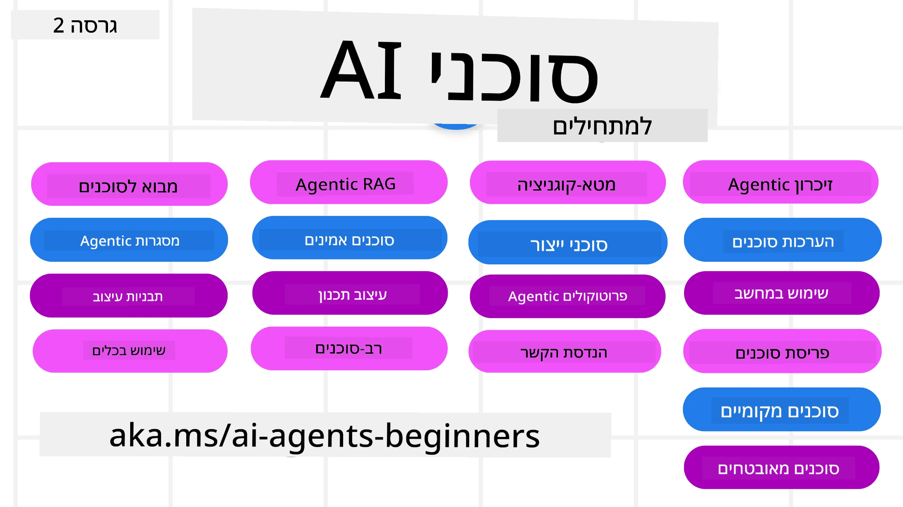

# סוכני בינה מלאכותית למתחילים - קורס



## קורס המלמד את כל מה שצריך לדעת כדי להתחיל לבנות סוכני בינה מלאכותית

[](https://github.com/microsoft/ai-agents-for-beginners/blob/master/LICENSE?WT.mc_id=academic-105485-koreyst)
[](https://GitHub.com/microsoft/ai-agents-for-beginners/graphs/contributors/?WT.mc_id=academic-105485-koreyst)
[](https://GitHub.com/microsoft/ai-agents-for-beginners/issues/?WT.mc_id=academic-105485-koreyst)
[](https://GitHub.com/microsoft/ai-agents-for-beginners/pulls/?WT.mc_id=academic-105485-koreyst)
[](http://makeapullrequest.com?WT.mc_id=academic-105485-koreyst)

### 🌐 תמיכה רב-שפתית

#### נתמך דרך GitHub Action (אוטומטי ותמיד מעודכן)

<!-- CO-OP TRANSLATOR LANGUAGES TABLE START -->
[Arabic](../ar/README.md) | [Bengali](../bn/README.md) | [Bulgarian](../bg/README.md) | [Burmese (Myanmar)](../my/README.md) | [Chinese (Simplified)](../zh-CN/README.md) | [Chinese (Traditional, Hong Kong)](../zh-HK/README.md) | [Chinese (Traditional, Macau)](../zh-MO/README.md) | [Chinese (Traditional, Taiwan)](../zh-TW/README.md) | [Croatian](../hr/README.md) | [Czech](../cs/README.md) | [Danish](../da/README.md) | [Dutch](../nl/README.md) | [Estonian](../et/README.md) | [Finnish](../fi/README.md) | [French](../fr/README.md) | [German](../de/README.md) | [Greek](../el/README.md) | [Hebrew](./README.md) | [Hindi](../hi/README.md) | [Hungarian](../hu/README.md) | [Indonesian](../id/README.md) | [Italian](../it/README.md) | [Japanese](../ja/README.md) | [Kannada](../kn/README.md) | [Khmer](../km/README.md) | [Korean](../ko/README.md) | [Lithuanian](../lt/README.md) | [Malay](../ms/README.md) | [Malayalam](../ml/README.md) | [Marathi](../mr/README.md) | [Nepali](../ne/README.md) | [Nigerian Pidgin](../pcm/README.md) | [Norwegian](../no/README.md) | [Persian (Farsi)](../fa/README.md) | [Polish](../pl/README.md) | [Portuguese (Brazil)](../pt-BR/README.md) | [Portuguese (Portugal)](../pt-PT/README.md) | [Punjabi (Gurmukhi)](../pa/README.md) | [Romanian](../ro/README.md) | [Russian](../ru/README.md) | [Serbian (Cyrillic)](../sr/README.md) | [Slovak](../sk/README.md) | [Slovenian](../sl/README.md) | [Spanish](../es/README.md) | [Swahili](../sw/README.md) | [Swedish](../sv/README.md) | [Tagalog (Filipino)](../tl/README.md) | [Tamil](../ta/README.md) | [Telugu](../te/README.md) | [Thai](../th/README.md) | [Turkish](../tr/README.md) | [Ukrainian](../uk/README.md) | [Urdu](../ur/README.md) | [Vietnamese](../vi/README.md)

> **מעדיפים לשכפל מקומי?**
>
> מאגר זה כולל למעלה מ-50 תרגומים בשפות שונות, מה שמגדיל משמעותית את גודל ההורדה. כדי לשכפל בלי תרגומים, השתמשו ב-sparse checkout:
>
> **Bash / macOS / Linux:**
> ```bash
> git clone --filter=blob:none --sparse https://github.com/microsoft/ai-agents-for-beginners.git
> cd ai-agents-for-beginners
> git sparse-checkout set --no-cone '/*' '!translations' '!translated_images'
> ```
>
> **CMD (Windows):**
> ```cmd
> git clone --filter=blob:none --sparse https://github.com/microsoft/ai-agents-for-beginners.git
> cd ai-agents-for-beginners
> git sparse-checkout set --no-cone "/*" "!translations" "!translated_images"
> ```
>
> זה נותן לכם את כל מה שצריך כדי להשלים את הקורס עם הורדה הרבה יותר מהירה.
<!-- CO-OP TRANSLATOR LANGUAGES TABLE END -->

**אם אתם מעוניינים בתמיכה בשפות תרגום נוספות, הן מופיעות [כאן](https://github.com/Azure/co-op-translator/blob/main/getting_started/supported-languages.md)**

[](https://GitHub.com/microsoft/ai-agents-for-beginners/watchers/?WT.mc_id=academic-105485-koreyst)
[](https://GitHub.com/microsoft/ai-agents-for-beginners/network/?WT.mc_id=academic-105485-koreyst)
[](https://GitHub.com/microsoft/ai-agents-for-beginners/stargazers/?WT.mc_id=academic-105485-koreyst)

[](https://discord.gg/nTYy5BXMWG)


## 🌱 התחלה

בקורס זה יש שיעורים המכסים את היסודות של בניית סוכני בינה מלאכותית. כל שיעור מכסה נושא משלו, אז התחילו איפה שרוצים!

ישנה תמיכה רב-שפתית לקורס זה. עברו אל [השפות הזמינות כאן](#-multi-language-support).

אם זו הפעם הראשונה שאתם מפתחים עם מודלים של בינה מלאכותית יצירתית, בדקו את קורס [בינה מלאכותית יצירתית למתחילים](https://aka.ms/genai-beginners), הכולל 21 שיעורים על בנייה עם GenAI.

אל תשכחו [לתת כוכב (🌟) למאגר זה](https://docs.github.com/en/get-started/exploring-projects-on-github/saving-repositories-with-stars?WT.mc_id=academic-105485-koreyst) ו[ליצור Fork למאגר זה](https://github.com/microsoft/ai-agents-for-beginners/fork) כדי להריץ את הקוד.

### הכירו לומדים אחרים, קבלו מענה לשאלות שלכם

אם תתקעו או יהיו לכם שאלות לגבי בניית סוכני בינה מלאכותית, הצטרפו לערוץ ה-Discord הייעודי שלנו ב-[Microsoft Foundry Discord](https://aka.ms/ai-agents/discord).

### מה צריך

כל שיעור בקורס זה כולל דוגמאות קוד שנמצאות בתיקיית code_samples. אתם יכולים [ליצור Fork למאגר זה](https://github.com/microsoft/ai-agents-for-beginners/fork) כדי ליצור עותק משלכם.

דוגמאות הקוד בתרגילים אלו משתמשות במסגרת Microsoft Agent Framework עם שירות Azure AI Foundry Agent V2:

- [Microsoft Foundry](https://aka.ms/ai-agents-beginners/ai-foundry) - דרוש חשבון Azure

בקורס זה נעשה שימוש במסגרת סוכני AI ושירותים הבאים מ-Microsoft:

- [Microsoft Agent Framework (MAF)](https://aka.ms/ai-agents-beginners/agent-framework)
- [שירות Azure AI Foundry Agent V2](https://aka.ms/ai-agents-beginners/ai-agent-service)

חלק מדוגמאות הקוד תומכות גם בספקים חלופיים התומכים ב-OpenAI כגון [MiniMax](https://platform.minimaxi.com/), המציע מודלים להקשר רחב (עד 204K טוקנים). ראו את [הגדרת הקורס](./00-course-setup/README.md) לפרטים על ההגדרות.

למידע נוסף על הרצת הקוד של הקורס, עברו אל [הגדרת הקורס](./00-course-setup/README.md).

## 🙏 רוצים לעזור?

יש לכם הצעות או מצאתם טעויות כתיב או קוד? [העלו נושא](https://github.com/microsoft/ai-agents-for-beginners/issues?WT.mc_id=academic-105485-koreyst) או [צרו בקשת משיכה](https://github.com/microsoft/ai-agents-for-beginners/pulls?WT.mc_id=academic-105485-koreyst)


## 📂 כל שיעור כולל

- שיעור כתוב הממוקם בקובץ README וסרטון קצר
- דוגמאות קוד בפייתון המשתמשות במסגרת Microsoft Agent Framework עם Azure AI Foundry
- קישורים למשאבים נוספים להמשך הלמידה שלכם


## 🗃️ שיעורים

| **שיעור**                                   | **טקסט וקוד**                                    | **סרטון**                                                  | **למידה נוספת**                                                                     |
|----------------------------------------------|----------------------------------------------------|------------------------------------------------------------|----------------------------------------------------------------------------------------|
| מבוא לסוכני AI ומקרי שימוש בסוכנים          | [קישור](./01-intro-to-ai-agents/README.md)          | [סרטון](https://youtu.be/3zgm60bXmQk?si=z8QygFvYQv-9WtO1)  | [קישור](https://aka.ms/ai-agents-beginners/collection?WT.mc_id=academic-105485-koreyst) |
| חקר מסגרות סוכניות של AI                     | [קישור](./02-explore-agentic-frameworks/README.md)  | [סרטון](https://youtu.be/ODwF-EZo_O8?si=Vawth4hzVaHv-u0H)  | [קישור](https://aka.ms/ai-agents-beginners/collection?WT.mc_id=academic-105485-koreyst) |
| הבנת דפוסי עיצוב סוכניים                      | [קישור](./03-agentic-design-patterns/README.md)     | [סרטון](https://youtu.be/m9lM8qqoOEA?si=BIzHwzstTPL8o9GF)  | [קישור](https://aka.ms/ai-agents-beginners/collection?WT.mc_id=academic-105485-koreyst) |
| דפוס עיצוב לשימוש בכלים                       | [קישור](./04-tool-use/README.md)                    | [סרטון](https://youtu.be/vieRiPRx-gI?si=2z6O2Xu2cu_Jz46N)  | [קישור](https://aka.ms/ai-agents-beginners/collection?WT.mc_id=academic-105485-koreyst) |
| סוכני RAG סוכניים                             | [קישור](./05-agentic-rag/README.md)                 | [סרטון](https://youtu.be/WcjAARvdL7I?si=gKPWsQpKiIlDH9A3)  | [קישור](https://aka.ms/ai-agents-beginners/collection?WT.mc_id=academic-105485-koreyst) |
| בניית סוכני AI אמינים                         | [קישור](./06-building-trustworthy-agents/README.md) | [סרטון](https://youtu.be/iZKkMEGBCUQ?si=jZjpiMnGFOE9L8OK ) | [קישור](https://aka.ms/ai-agents-beginners/collection?WT.mc_id=academic-105485-koreyst) |
| דפוס עיצוב לתכנון                             | [קישור](./07-planning-design/README.md)             | [סרטון](https://youtu.be/kPfJ2BrBCMY?si=6SC_iv_E5-mzucnC)  | [קישור](https://aka.ms/ai-agents-beginners/collection?WT.mc_id=academic-105485-koreyst) |
| דפוס עיצוב לרב-סוכני                         | [קישור](./08-multi-agent/README.md)                 | [סרטון](https://youtu.be/V6HpE9hZEx0?si=rMgDhEu7wXo2uo6g)  | [קישור](https://aka.ms/ai-agents-beginners/collection?WT.mc_id=academic-105485-koreyst) |
| דפוס עיצוב מטה-קוגניציה                 | [קישור](./09-metacognition/README.md)               | [וידאו](https://youtu.be/His9R6gw6Ec?si=8gck6vvdSNCt6OcF)  | [קישור](https://aka.ms/ai-agents-beginners/collection?WT.mc_id=academic-105485-koreyst) |
| סוכני בינה מלאכותית בפרודקשן                      | [קישור](./10-ai-agents-production/README.md)        | [וידאו](https://youtu.be/l4TP6IyJxmQ?si=31dnhexRo6yLRJDl)  | [קישור](https://aka.ms/ai-agents-beginners/collection?WT.mc_id=academic-105485-koreyst) |
| שימוש בפרוטוקולים אגנטיים (MCP, A2A ו-NLWeb) | [קישור](./11-agentic-protocols/README.md)           | [וידאו](https://youtu.be/X-Dh9R3Opn8)                                 | [קישור](https://aka.ms/ai-agents-beginners/collection?WT.mc_id=academic-105485-koreyst) |
| הנדסת הקשר עבור סוכני בינה מלאכותית            | [קישור](./12-context-engineering/README.md)         | [וידאו](https://youtu.be/F5zqRV7gEag)                                 | [קישור](https://aka.ms/ai-agents-beginners/collection?WT.mc_id=academic-105485-koreyst) |
| ניהול זיכרון אגנטי                      | [קישור](./13-agent-memory/README.md)     |      [וידאו](https://youtu.be/QrYbHesIxpw?si=vZkVwKrQ4ieCcIPx)                                                      |                                                                                        |
| חקר מסגרת הסוכנים של מיקרוסופט                         | [קישור](./14-microsoft-agent-framework/README.md)                            |                                                            |                                                                                        |
| בניית סוכני שימוש במחשב (CUA)           | [קישור](./15-browser-use/README.md)     |                                                            | [קישור](https://docs.browser-use.com/examples/templates/playwright-integration)         |
| פריסה של סוכנים מדרגיים                    | בקרוב                            |                                                            |                                                                                        |
| יצירת סוכני בינה מלאכותית מקומיים                     | בקרוב                               |                                                            |                                                                                        |
| אבטחת סוכני בינה מלאכותית                           | [קישור](./18-securing-ai-agents/README.md)  |                                                            | [קישור](https://aka.ms/ai-agents-beginners/collection?WT.mc_id=academic-105485-koreyst) |

## 🎒 קורסים נוספים

הצוות שלנו מייצר קורסים נוספים! בדקו את:

<!-- CO-OP TRANSLATOR OTHER COURSES START -->
### LangChain
[](https://aka.ms/langchain4j-for-beginners)
[](https://aka.ms/langchainjs-for-beginners?WT.mc_id=m365-94501-dwahlin)
[](https://github.com/microsoft/langchain-for-beginners?WT.mc_id=m365-94501-dwahlin)
---

### Azure / Edge / MCP / סוכנים
[](https://github.com/microsoft/AZD-for-beginners?WT.mc_id=academic-105485-koreyst)
[](https://github.com/microsoft/edgeai-for-beginners?WT.mc_id=academic-105485-koreyst)
[](https://github.com/microsoft/mcp-for-beginners?WT.mc_id=academic-105485-koreyst)
[](https://github.com/microsoft/ai-agents-for-beginners?WT.mc_id=academic-105485-koreyst)

---
 
### סדרת בינה מלאכותית גנרטיבית
[](https://github.com/microsoft/generative-ai-for-beginners?WT.mc_id=academic-105485-koreyst)
[-9333EA?style=for-the-badge&labelColor=E5E7EB&color=9333EA)](https://github.com/microsoft/Generative-AI-for-beginners-dotnet?WT.mc_id=academic-105485-koreyst)
[-C084FC?style=for-the-badge&labelColor=E5E7EB&color=C084FC)](https://github.com/microsoft/generative-ai-for-beginners-java?WT.mc_id=academic-105485-koreyst)
[-E879F9?style=for-the-badge&labelColor=E5E7EB&color=E879F9)](https://github.com/microsoft/generative-ai-with-javascript?WT.mc_id=academic-105485-koreyst)

---
 
### למידה בסיסית
[](https://aka.ms/ml-beginners?WT.mc_id=academic-105485-koreyst)
[](https://aka.ms/datascience-beginners?WT.mc_id=academic-105485-koreyst)
[](https://aka.ms/ai-beginners?WT.mc_id=academic-105485-koreyst)
[](https://github.com/microsoft/Security-101?WT.mc_id=academic-96948-sayoung)
[](https://aka.ms/webdev-beginners?WT.mc_id=academic-105485-koreyst)
[](https://aka.ms/iot-beginners?WT.mc_id=academic-105485-koreyst)
[](https://github.com/microsoft/xr-development-for-beginners?WT.mc_id=academic-105485-koreyst)

---
 
### סדרת קופיילוט
[](https://aka.ms/GitHubCopilotAI?WT.mc_id=academic-105485-koreyst)
[](https://github.com/microsoft/mastering-github-copilot-for-dotnet-csharp-developers?WT.mc_id=academic-105485-koreyst)
[](https://github.com/microsoft/CopilotAdventures?WT.mc_id=academic-105485-koreyst)
<!-- CO-OP TRANSLATOR OTHER COURSES END -->

## 🌟 תודה לקהילה

תודה ל-[Shivam Goyal](https://www.linkedin.com/in/shivam2003/) על התרומה בדוגמאות קוד חשובות המדגימות RAG אגנטי.

## תרומה

פרויקט זה מקבל בברכה תרומות והצעות. רוב התרומות מחייבות הסכמתכם ל-
הסכם רישיון תורם (CLA) המצהיר כי יש לכם את הזכות, וכי במציאות אתם מעניקים לנו
את הזכויות להשתמש בתרומתכם. לפרטים, בקרו ב-<https://cla.opensource.microsoft.com>.

כאשר אתם שולחים בקשת משיכה, רובוט CLA יקבע אוטומטית אם אתם צריכים לספק
הסכם CLA וייציג זאת בכותרת הבקשה (למשל, בדיקת מצב, תגובה). פשוט עקבו אחר ההוראות
המסופקות על ידי הרובוט. תצטרכו לעשות זאת פעם אחת בלבד בכל הריפוזיטוריות המשתמשות ב-CLA שלנו.

פרויקט זה אימץ את [קוד ההתנהגות של מיקרוסופט בקוד פתוח](https://opensource.microsoft.com/codeofconduct/).
למידע נוסף ראו את [שאלות נפוצות על קוד ההתנהגות](https://opensource.microsoft.com/codeofconduct/faq/) או
צרו קשר ב-[opencode@microsoft.com](mailto:opencode@microsoft.com) עם שאלות או תגובות נוספות.

## סימני מסחר

פרויקט זה עשוי להכיל סימני מסחר או לוגואים של פרויקטים, מוצרים או שירותים. השימוש המורשה בסימני המסחר או הלוגואים של מיקרוסופט כפוף וצריך לעמוד
ב[הנחיות סימני המסחר והמותג של מיקרוסופט](https://www.microsoft.com/legal/intellectualproperty/trademarks/usage/general).
שימוש בסימני מסחר או לוגואים של מיקרוסופט בגרסאות משודרגות של פרויקט זה לא יגרום לבלבול או ייצג חסות של מיקרוסופט.
שימוש כלשהו בסימני המסחר או הלוגואים של צדדים שלישיים כפוף למדיניות של אותם צדדים שלישיים.

## לקבלת עזרה

אם אתם נתקעים או יש לכם שאלות על בניית אפליקציות בינה מלאכותית, הצטרפו ל:

[](https://aka.ms/foundry/discord)

אם יש לכם משוב על מוצר או שגיאות במהלך הפיתוח בקרו:

[](https://aka.ms/foundry/forum)

---

<!-- CO-OP TRANSLATOR DISCLAIMER START -->
**כתב ויתור**:
מסמך זה תורגם באמצעות שירות תרגום אוטומטי [Co-op Translator](https://github.com/Azure/co-op-translator). למרות שאנו שואפים לדיוק, יש לקחת בחשבון שתרגומים אוטומטיים עלולים להכיל שגיאות או אי-דיוקים. יש להחשיב את המסמך המקורי בשפתו הטבעית כמקור הסמכות. למידע קריטי מומלץ להשתמש בתרגום מקצועי על ידי מתרגם אדם. אנו לא אחראים לכל אי-הבנה או פירוש שגוי הנובע מהשימוש בתרגום זה.
<!-- CO-OP TRANSLATOR DISCLAIMER END -->