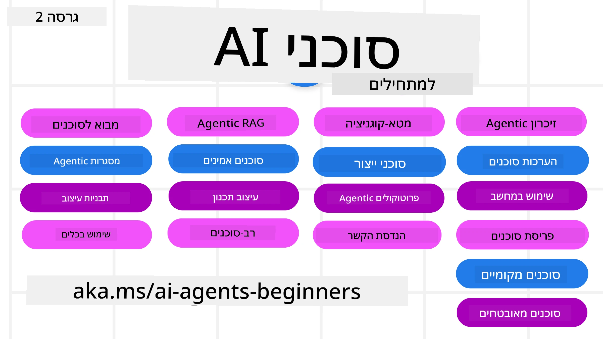

# סוכני בינה מלאכותית למתחילים - קורס



## קורס המלמד הכל שעלייך לדעת כדי להתחיל לבנות סוכני בינה מלאכותית

[](https://github.com/microsoft/ai-agents-for-beginners/blob/master/LICENSE?WT.mc_id=academic-105485-koreyst)
[](https://GitHub.com/microsoft/ai-agents-for-beginners/graphs/contributors/?WT.mc_id=academic-105485-koreyst)
[](https://GitHub.com/microsoft/ai-agents-for-beginners/issues/?WT.mc_id=academic-105485-koreyst)
[](https://GitHub.com/microsoft/ai-agents-for-beginners/pulls/?WT.mc_id=academic-105485-koreyst)
[](http://makeapullrequest.com?WT.mc_id=academic-105485-koreyst)

### 🌐 תמיכה רב-לשונית

#### נתמך באמצעות GitHub Action (אוטומטי ותמיד מעודכן)

<!-- CO-OP TRANSLATOR LANGUAGES TABLE START -->
[Arabic](../ar/README.md) | [Bengali](../bn/README.md) | [Bulgarian](../bg/README.md) | [Burmese (Myanmar)](../my/README.md) | [Chinese (Simplified)](../zh-CN/README.md) | [Chinese (Traditional, Hong Kong)](../zh-HK/README.md) | [Chinese (Traditional, Macau)](../zh-MO/README.md) | [Chinese (Traditional, Taiwan)](../zh-TW/README.md) | [Croatian](../hr/README.md) | [Czech](../cs/README.md) | [Danish](../da/README.md) | [Dutch](../nl/README.md) | [Estonian](../et/README.md) | [Finnish](../fi/README.md) | [French](../fr/README.md) | [German](../de/README.md) | [Greek](../el/README.md) | [Hebrew](./README.md) | [Hindi](../hi/README.md) | [Hungarian](../hu/README.md) | [Indonesian](../id/README.md) | [Italian](../it/README.md) | [Japanese](../ja/README.md) | [Kannada](../kn/README.md) | [Khmer](../km/README.md) | [Korean](../ko/README.md) | [Lithuanian](../lt/README.md) | [Malay](../ms/README.md) | [Malayalam](../ml/README.md) | [Marathi](../mr/README.md) | [Nepali](../ne/README.md) | [Nigerian Pidgin](../pcm/README.md) | [Norwegian](../no/README.md) | [Persian (Farsi)](../fa/README.md) | [Polish](../pl/README.md) | [Portuguese (Brazil)](../pt-BR/README.md) | [Portuguese (Portugal)](../pt-PT/README.md) | [Punjabi (Gurmukhi)](../pa/README.md) | [Romanian](../ro/README.md) | [Russian](../ru/README.md) | [Serbian (Cyrillic)](../sr/README.md) | [Slovak](../sk/README.md) | [Slovenian](../sl/README.md) | [Spanish](../es/README.md) | [Swahili](../sw/README.md) | [Swedish](../sv/README.md) | [Tagalog (Filipino)](../tl/README.md) | [Tamil](../ta/README.md) | [Telugu](../te/README.md) | [Thai](../th/README.md) | [Turkish](../tr/README.md) | [Ukrainian](../uk/README.md) | [Urdu](../ur/README.md) | [Vietnamese](../vi/README.md)

> **מעדיף לשכפל מקומית?**
>
> מאגר זה כולל למעלה מ-50 תרגומים בשפות שונות, דבר המגדיל משמעותית את גודל ההורדה. כדי לשכפל ללא תרגומים, השתמש ב-sparse checkout:
>
> **Bash / macOS / Linux:**
> ```bash
> git clone --filter=blob:none --sparse https://github.com/microsoft/ai-agents-for-beginners.git
> cd ai-agents-for-beginners
> git sparse-checkout set --no-cone '/*' '!translations' '!translated_images'
> ```
>
> **CMD (Windows):**
> ```cmd
> git clone --filter=blob:none --sparse https://github.com/microsoft/ai-agents-for-beginners.git
> cd ai-agents-for-beginners
> git sparse-checkout set --no-cone "/*" "!translations" "!translated_images"
> ```
>
> זה נותן לך את כל מה שצריך כדי להשלים את הקורס במהירות הורדה גבוהה יותר.
<!-- CO-OP TRANSLATOR LANGUAGES TABLE END -->

**אם ברצונך לתמוך בשפות תרגום נוספות, הן רשומות [כאן](https://github.com/Azure/co-op-translator/blob/main/getting_started/supported-languages.md).**

[](https://GitHub.com/microsoft/ai-agents-for-beginners/watchers/?WT.mc_id=academic-105485-koreyst)
[](https://GitHub.com/microsoft/ai-agents-for-beginners/network/?WT.mc_id=academic-105485-koreyst)
[](https://GitHub.com/microsoft/ai-agents-for-beginners/stargazers/?WT.mc_id=academic-105485-koreyst)

[](https://discord.com/invite/ATgtXmAS5D)


## 🌱 התחלת עבודה

בקורס זה יש שיעורים המכסים את היסודות בבניית סוכני בינה מלאכותית. כל שיעור מקיף נושא משלו, אז תתחיל מכל מקום שתרצה!

קיימת תמיכה רב-לשונית לקורס זה. עבור ל[שפות הזמינות כאן](#-multi-language-support).

אם זו הפעם הראשונה שלך בבניית מודלים של בינה מלאכותית יצירתית, בדוק את קורס [בינה מלאכותית יצירתית למתחילים](https://aka.ms/genai-beginners), הכולל 21 שיעורים על בנייה עם GenAI.

אל תשכח [להוסיף כוכב (🌟) למאגר זה](https://docs.github.com/en/get-started/exploring-projects-on-github/saving-repositories-with-stars?WT.mc_id=academic-105485-koreyst) ו[לשכפל אותו (fork)](https://github.com/microsoft/ai-agents-for-beginners/fork) כדי להריץ את הקוד.

### הכירו לומדים אחרים, קבלו מענה לשאלותיכם

אם תיתקע או יהיו לך שאלות לגבי בניית סוכני בינה מלאכותית, הצטרף לערוץ דיסקורד ייעודי שלנו ב-[Microsoft Foundry Discord](https://aka.ms/ai-agents/discord).

### מה אתה צריך

בכל שיעור בקורס זה יש דוגמאות קוד, שניתן למצוא בתיקיית code_samples. תוכל [לשכפל את המאגר הזה (fork)](https://github.com/microsoft/ai-agents-for-beginners/fork) כדי ליצור עותק משלך.

דוגמאות הקוד בתרגילים אלה משתמשות במסגרת הסוכנים של מיקרוסופט יחד עם שירות הסוכנים של Microsoft Foundry V2:

- [Microsoft Foundry](https://aka.ms/ai-agents-beginners/ai-foundry) - דרושה חשבון Azure

קורס זה משתמש במסגרת ושירותי סוכני בינה מלאכותית הבאים של מיקרוסופט:

- [Microsoft Agent Framework (MAF)](https://aka.ms/ai-agents-beginners/agent-framework)
- [Microsoft Foundry Agent Service V2](https://aka.ms/ai-agents-beginners/ai-agent-service)

דוגמאות קוד מסוימות תומכות גם בספקים תואמי OpenAI חלופיים כגון [MiniMax](https://platform.minimaxi.com/), שמציעים מודלים להקשר רחב (עד 204 אלף טוקנים). ראה את [הגדרת הקורס](./00-course-setup/README.md) לפרטי התצורה.

למידע נוסף על הרצת הקוד לקורס זה, עבור ל[הגדרת הקורס](./00-course-setup/README.md).

## 🙏 רוצה לעזור?

יש לך הצעות או מצאת שגיאות באיות או בקוד? [פתח נושא](https://github.com/microsoft/ai-agents-for-beginners/issues?WT.mc_id=academic-105485-koreyst) או [צור בקשת משיכה](https://github.com/microsoft/ai-agents-for-beginners/pulls?WT.mc_id=academic-105485-koreyst)


## 📂 כל שיעור כולל

- שיעור כתוב הנמצא בקובץ README ווידאו קצר
- דוגמאות קוד בפייתון המשתמשות במסגרת הסוכנים של מיקרוסופט עם Microsoft Foundry
- קישורים למשאבים נוספים להמשך הלמידה


## 🗃️ שיעורים

| **שיעור**                                  | **טקסט וקוד**                                     | **וידאו**                                                  | **למידה נוספת**                                                                       |
|-------------------------------------------|---------------------------------------------------|------------------------------------------------------------|-----------------------------------------------------------------------------------------|
| מבוא לסוכני בינה מלאכותית ושימושים שלהם  | [קישור](./01-intro-to-ai-agents/README.md)       | [וידאו](https://youtu.be/3zgm60bXmQk?si=z8QygFvYQv-9WtO1) | [קישור](https://aka.ms/ai-agents-beginners/collection?WT.mc_id=academic-105485-koreyst) |
| חקר מסגרות סוכניים                        | [קישור](./02-explore-agentic-frameworks/README.md) | [וידאו](https://youtu.be/ODwF-EZo_O8?si=Vawth4hzVaHv-u0H) | [קישור](https://aka.ms/ai-agents-beginners/collection?WT.mc_id=academic-105485-koreyst) |
| הבנת דפוסי העיצוב הסוכניים               | [קישור](./03-agentic-design-patterns/README.md) | [וידאו](https://youtu.be/m9lM8qqoOEA?si=BIzHwzstTPL8o9GF) | [קישור](https://aka.ms/ai-agents-beginners/collection?WT.mc_id=academic-105485-koreyst) |
| דפוס שימוש בכלים                          | [קישור](./04-tool-use/README.md)                  | [וידאו](https://youtu.be/vieRiPRx-gI?si=2z6O2Xu2cu_Jz46N) | [קישור](https://aka.ms/ai-agents-beginners/collection?WT.mc_id=academic-105485-koreyst) |
| Agentic RAG                               | [קישור](./05-agentic-rag/README.md)               | [וידאו](https://youtu.be/WcjAARvdL7I?si=gKPWsQpKiIlDH9A3) | [קישור](https://aka.ms/ai-agents-beginners/collection?WT.mc_id=academic-105485-koreyst) |
| בניית סוכני בינה אמינים                   | [קישור](./06-building-trustworthy-agents/README.md) | [וידאו](https://youtu.be/iZKkMEGBCUQ?si=jZjpiMnGFOE9L8OK ) | [קישור](https://aka.ms/ai-agents-beginners/collection?WT.mc_id=academic-105485-koreyst) |
| דפוס תכנון                               | [קישור](./07-planning-design/README.md)           | [וידאו](https://youtu.be/kPfJ2BrBCMY?si=6SC_iv_E5-mzucnC) | [קישור](https://aka.ms/ai-agents-beginners/collection?WT.mc_id=academic-105485-koreyst) |
| דפוס סוכנים מרובים                      | [קישור](./08-multi-agent/README.md)               | [וידאו](https://youtu.be/V6HpE9hZEx0?si=rMgDhEu7wXo2uo6g) | [קישור](https://aka.ms/ai-agents-beginners/collection?WT.mc_id=academic-105485-koreyst) |

| תבנית עיצוב מטה-קוגניציה                 | [קישור](./09-metacognition/README.md)               | [וידאו](https://youtu.be/His9R6gw6Ec?si=8gck6vvdSNCt6OcF)  | [קישור](https://aka.ms/ai-agents-beginners/collection?WT.mc_id=academic-105485-koreyst) |
| סוכני בינה מלאכותית בפרודקשן                      | [קישור](./10-ai-agents-production/README.md)        | [וידאו](https://youtu.be/l4TP6IyJxmQ?si=31dnhexRo6yLRJDl)  | [קישור](https://aka.ms/ai-agents-beginners/collection?WT.mc_id=academic-105485-koreyst) |
| שימוש בפרוטוקולי סוכנות (MCP, A2A ו-NLWeb) | [קישור](./11-agentic-protocols/README.md)           | [וידאו](https://youtu.be/X-Dh9R3Opn8)                                 | [קישור](https://aka.ms/ai-agents-beginners/collection?WT.mc_id=academic-105485-koreyst) |
| הנדסת הקשר עבור סוכני AI            | [קישור](./12-context-engineering/README.md)         | [וידאו](https://youtu.be/F5zqRV7gEag)                                 | [קישור](https://aka.ms/ai-agents-beginners/collection?WT.mc_id=academic-105485-koreyst) |
| ניהול זיכרון סוכני                      | [קישור](./13-agent-memory/README.md)     |      [וידאו](https://youtu.be/QrYbHesIxpw?si=vZkVwKrQ4ieCcIPx)                                                      |                                                                                        |
| חקר מסגרת סוכני מיקרוסופט                         | [קישור](./14-microsoft-agent-framework/README.md)                            |                                                            |                                                                                        |
| בניית סוכני שימוש במחשב (CUA)           | [קישור](./15-browser-use/README.md)     |                                                            | [קישור](https://docs.browser-use.com/examples/templates/playwright-integration)         |
| פריסת סוכנים בקנה מידה רחב                    | בקרוב                            |                                                            |                                                                                        |
| יצירת סוכני בינה מלאכותית מקומיים                     | בקרוב                               |                                                            |                                                                                        |
| אבטחת סוכני בינה מלאכותית                           | [קישור](./18-securing-ai-agents/README.md)  |                                                            | [קישור](https://aka.ms/ai-agents-beginners/collection?WT.mc_id=academic-105485-koreyst) |

## 🎒 קורסים נוספים

הצוות שלנו מייצר קורסים נוספים! בדקו:

<!-- CO-OP TRANSLATOR OTHER COURSES START -->
### LangChain
[](https://aka.ms/langchain4j-for-beginners)
[](https://aka.ms/langchainjs-for-beginners?WT.mc_id=m365-94501-dwahlin)
[](https://github.com/microsoft/langchain-for-beginners?WT.mc_id=m365-94501-dwahlin)
---

### Azure / Edge / MCP / סוכנים
[](https://github.com/microsoft/AZD-for-beginners?WT.mc_id=academic-105485-koreyst)
[](https://github.com/microsoft/edgeai-for-beginners?WT.mc_id=academic-105485-koreyst)
[](https://github.com/microsoft/mcp-for-beginners?WT.mc_id=academic-105485-koreyst)
[](https://github.com/microsoft/ai-agents-for-beginners?WT.mc_id=academic-105485-koreyst)

---
 
### סדרת בינה מלאכותית יוצרת
[](https://github.com/microsoft/generative-ai-for-beginners?WT.mc_id=academic-105485-koreyst)
[-9333EA?style=for-the-badge&labelColor=E5E7EB&color=9333EA)](https://github.com/microsoft/Generative-AI-for-beginners-dotnet?WT.mc_id=academic-105485-koreyst)
[-C084FC?style=for-the-badge&labelColor=E5E7EB&color=C084FC)](https://github.com/microsoft/generative-ai-for-beginners-java?WT.mc_id=academic-105485-koreyst)
[-E879F9?style=for-the-badge&labelColor=E5E7EB&color=E879F9)](https://github.com/microsoft/generative-ai-with-javascript?WT.mc_id=academic-105485-koreyst)

---
 
### למידה מרכזית
[](https://aka.ms/ml-beginners?WT.mc_id=academic-105485-koreyst)
[](https://aka.ms/datascience-beginners?WT.mc_id=academic-105485-koreyst)
[](https://aka.ms/ai-beginners?WT.mc_id=academic-105485-koreyst)
[](https://github.com/microsoft/Security-101?WT.mc_id=academic-96948-sayoung)
[](https://aka.ms/webdev-beginners?WT.mc_id=academic-105485-koreyst)
[](https://aka.ms/iot-beginners?WT.mc_id=academic-105485-koreyst)
[](https://github.com/microsoft/xr-development-for-beginners?WT.mc_id=academic-105485-koreyst)

---
 
### סדרת קופילוט
[](https://aka.ms/GitHubCopilotAI?WT.mc_id=academic-105485-koreyst)
[](https://github.com/microsoft/mastering-github-copilot-for-dotnet-csharp-developers?WT.mc_id=academic-105485-koreyst)
[](https://github.com/microsoft/CopilotAdventures?WT.mc_id=academic-105485-koreyst)
<!-- CO-OP TRANSLATOR OTHER COURSES END -->

## 🌟 תודה לקהילה

תודה ל-[שיבאם גוריאל](https://www.linkedin.com/in/shivam2003/) על תרומתו בדוגמאות קוד חשובות המדגימות RAG סוכני.

## תרומה לפרויקט

פרויקט זה מקבל בברכה תרומות והצעות. רוב התרומות דורשות הסכמתך ל
להסכם רישיון תורם (CLA) המצהיר כי יש לך את הזכות, וכי אתה אכן נותן לנו
את הזכויות להשתמש בתרומתך. לפרטים, בקר ב-<https://cla.opensource.microsoft.com>.

כאשר אתה מגיש בקשת משיכה, רובוט CLA יקבע אוטומטית אם עליך לספק
הסכם CLA ויעטר את בקשת המשיכה בהתאם (למשל, בדיקת סטטוס, תגובה). פשוט עקוב אחרי ההוראות
שהרובוט מספק. תצטרך לעשות זאת רק פעם אחת בכל המאגרי קוד שמשתמשים ב-CLA שלנו.

פרויקט זה אימץ את [קוד ההתנהגות של מיקרוסופט בקוד פתוח](https://opensource.microsoft.com/codeofconduct/).
למידע נוסף ראו את [שאלות נפוצות על קוד ההתנהגות](https://opensource.microsoft.com/codeofconduct/faq/) או
פנו ל-[opencode@microsoft.com](mailto:opencode@microsoft.com) עם כל שאלה או הערה נוספת.

## סימני מסחר

פרויקט זה עשוי להכיל סימני מסחר או לוגואים של פרוייקטים, מוצרים או שירותים. שימוש מורשה בסימני המסחר או הלוגואים של מיקרוסופט כפוף ל-
וצריך לעקוב אחרי
[הנחיות סימני המסחר והמותג של מיקרוסופט](https://www.microsoft.com/legal/intellectualproperty/trademarks/usage/general).
שימוש בסימני המסחר או הלוגואים של מיקרוסופט בגרסאות מותאמות של פרויקט זה לא יגרום לבלבול או לרמז על חסות מצד מיקרוסופט.
כל שימוש בסימני מסחר או לוגואים של צד שלישי כפוף למדיניות של אותם צדדים שלישיים.

## קבלת עזרה


אם נתקעת או יש לך שאלות לגבי בניית אפליקציות בינה מלאכותית, הצטרף ל:

[](https://aka.ms/foundry/discord)

אם יש לך משוב על המוצר או תקלות במהלך הבנייה בקר ב:

[](https://aka.ms/foundry/forum)

---

<!-- CO-OP TRANSLATOR DISCLAIMER START -->
**כתב ויתור**:
מסמך זה תורגם באמצעות שירות תרגום אוטומטי [Co-op Translator](https://github.com/Azure/co-op-translator). למרות שאנו שואפים לדיוק, יש לקחת בחשבון שתרגומים אוטומטיים עלולים להכיל שגיאות או אי-דיוקים. יש להחשיב את המסמך המקורי בשפתו הטבעית כמקור הסמכות. למידע קריטי מומלץ להשתמש בתרגום מקצועי על ידי מתרגם אדם. אנו לא אחראים לכל אי-הבנה או פירוש שגוי הנובע מהשימוש בתרגום זה.
<!-- CO-OP TRANSLATOR DISCLAIMER END -->