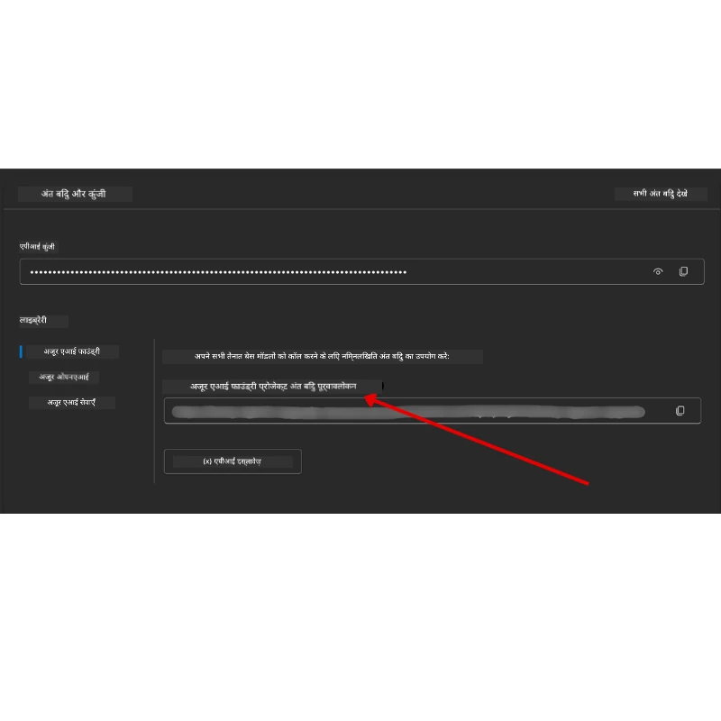

# पाठ्यक्रम सेटअप

## परिचय

इस पाठ में यह बताया जाएगा कि इस कोर्स के कोड उदाहरणों को कैसे चलाया जाए।

## अन्य शिक्षार्थियों से जुड़ें और सहायता प्राप्त करें

अपने रिपो को क्लोन करने से पहले, सेटअप में मदद पाने, कोर्स के बारे में किसी भी प्रश्न के लिए, या अन्य शिक्षार्थियों से जुड़ने के लिए [AI Agents For Beginners Discord channel](https://aka.ms/ai-agents/discord) में शामिल हों।

## इस रिपो को क्लोन या फोर्क करें

शुरू करने के लिए, कृपया GitHub रिपॉज़िटरी को क्लोन या फोर्क करें। इससे कोर्स सामग्री का आपका अपना संस्करण बन जाएगा ताकि आप कोड चला, परीक्षण कर और उसमें परिवर्तन कर सकें!

This can be done by clicking the link to <a href="https://github.com/microsoft/ai-agents-for-beginners/fork" target="_blank">रिपोजिटरी को फोर्क करें</a>

You should now have your own forked version of this course in the following link:


### शैलो क्लोन (वर्कशॉप / Codespaces के लिए अनुशंसित)

  >पूर्ण रिपॉज़िटरी का पूरा इतिहास और सभी फ़ाइलें डाउनलोड करने पर यह बड़ा (~3 GB) हो सकता है। यदि आप केवल वर्कशॉप में भाग ले रहे हैं या केवल कुछ पाठ फ़ोल्डरों की आवश्यकता है, तो एक शैलो क्लोन (या स्पैर्स क्लोन) अधिकांश डाउनलोड को इतिहास को ट्रंक करने और/या ब्लॉब्स को स्किप करके बचाता है।

#### त्वरित शैलो क्लोन — न्यूनतम इतिहास, सभी फ़ाइलें

Replace `<your-username>` in the below commands with your fork URL (or the upstream URL if you prefer).

To clone only the latest commit history (small download):

```bash|powershell
git clone --depth 1 https://github.com/<your-username>/ai-agents-for-beginners.git
```

To clone a specific branch:

```bash|powershell
git clone --depth 1 --branch <branch-name> https://github.com/<your-username>/ai-agents-for-beginners.git
```

#### Partial (sparse) clone — minimal blobs + only selected folders

This uses partial clone and sparse-checkout (requires Git 2.25+ and recommended modern Git with partial clone support):

```bash|powershell
git clone --depth 1 --filter=blob:none --sparse https://github.com/<your-username>/ai-agents-for-beginners.git
```

Traverse into the repo folder:

```bash|powershell
cd ai-agents-for-beginners
```

Then specify which folders you want (example below shows two folders):

```bash|powershell
git sparse-checkout set 00-course-setup 01-intro-to-ai-agents
```

After cloning and verifying the files, if you only need files and want to free space (no git history), please delete the repository metadata (💀irreversible — you will lose all Git functionality: no commits, pulls, pushes, or history access).

```bash
# zsh/bash
rm -rf .git
```

```powershell
# पॉवरशेल
Remove-Item -Recurse -Force .git
```

#### GitHub Codespaces का उपयोग करना (स्थानीय बड़े डाउनलोड से बचने के लिए अनुशंसित)

- Create a new Codespace for this repo via the [GitHub UI](https://github.com/codespaces).  

- In the terminal of the newly created codespace, run one of the shallow/sparse clone commands above to bring only the lesson folders you need into the Codespace workspace.
- Optional: after cloning inside Codespaces, remove .git to reclaim extra space (see removal commands above).
- Note: If you prefer to open the repo directly in Codespaces (without an extra clone), be aware Codespaces will construct the devcontainer environment and may still provision more than you need. Cloning a shallow copy inside a fresh Codespace gives you more control over disk usage.

#### सुझाव

- Always replace the clone URL with your fork if you want to edit/commit.
- If you later need more history or files, you can fetch them or adjust sparse-checkout to include additional folders.

## कोड चलाना

This course offers a series of Jupyter Notebooks that you can run with to get hands-on experience building AI Agents.

The code samples use **Microsoft Agent Framework (MAF)** with the `AzureAIProjectAgentProvider`, which connects to **Azure AI Agent Service V2** (the Responses API) through **Microsoft Foundry**.

All Python notebooks are labelled `*-python-agent-framework.ipynb`.

## आवश्यकताएँ

- Python 3.12+
  - **नोट:** यदि आपके पास Python3.12 इंस्टॉल नहीं है, तो सुनिश्चित करें कि आप इसे इंस्टॉल करें। फिर venv बनाने के लिए python3.12 का उपयोग करें ताकि requirements.txt फ़ाइल से सही संस्करण इंस्टॉल हों।
  
    >उदाहरण

    Create Python venv directory:

    ```bash|powershell
    python -m venv venv
    ```

    Then activate venv environment for:

    ```bash
    # zsh/बैश
    source venv/bin/activate
    ```
  
    ```dos
    # Command Prompt for Windows
    venv\Scripts\activate
    ```

- .NET 10+: For the sample codes using .NET, ensure you install [.NET 10 SDK](https://dotnet.microsoft.com/download/dotnet/10.0) or later. Then, check your installed .NET SDK version:

    ```bash|powershell
    dotnet --list-sdks
    ```

- **Azure CLI** — प्रमाणीकरण के लिए आवश्यक। इसे [aka.ms/installazurecli](https://aka.ms/installazurecli) से इंस्टॉल करें।
- **Azure Subscription** — Microsoft Foundry और Azure AI Agent Service तक पहुंच के लिए।
- **Microsoft Foundry Project** — नोटबुक चलाने के लिए एक प्रोजेक्ट जिसमें डिप्लॉय किया हुआ मॉडल हो (उदा., `gpt-4o`). नीचे [Step 1](../../../00-course-setup) देखें।

We have included a `requirements.txt` file in the root of this repository that contains all the required Python packages to run the code samples.

You can install them by running the following command in your terminal at the root of the repository:

```bash|powershell
pip install -r requirements.txt
```

We recommend creating a Python virtual environment to avoid any conflicts and issues.

## VSCode सेटअप

Make sure that you are using the right version of Python in VSCode.


## Microsoft Foundry और Azure AI Agent Service सेटअप

### चरण 1: एक Microsoft Foundry प्रोजेक्ट बनाएं

You need an Azure AI Foundry **hub** and **project** with a deployed model to run the notebooks.

1. Go to [ai.azure.com](https://ai.azure.com) and sign in with your Azure account.
2. Create a **hub** (or use an existing one). See: [Hub resources overview](https://learn.microsoft.com/azure/ai-foundry/concepts/ai-resources).
3. Inside the hub, create a **project**.
4. Deploy a model (e.g., `gpt-4o`) from **Models + Endpoints** → **Deploy model**.

### चरण 2: अपना प्रोजेक्ट एंडपॉइंट और मॉडल डिप्लॉयमेंट नाम प्राप्त करें

From your project in the Microsoft Foundry portal:

- **Project Endpoint** — Go to the **Overview** page and copy the endpoint URL.



- **Model Deployment Name** — Go to **Models + Endpoints**, select your deployed model, and note the **Deployment name** (e.g., `gpt-4o`).

### चरण 3: `az login` के साथ Azure में साइन इन करें

All notebooks use **`AzureCliCredential`** for authentication — no API keys to manage. This requires you to be signed in via the Azure CLI.

1. **Azure CLI इंस्टॉल करें** अगर आपने पहले से नहीं किया है: [aka.ms/installazurecli](https://aka.ms/installazurecli)

2. **साइन इन** करने के लिए चलाएँ:

    ```bash|powershell
    az login
    ```

    Or if you're in a remote/Codespace environment without a browser:

    ```bash|powershell
    az login --use-device-code
    ```

3. **अपनी सब्सक्रिप्शन चुनें** अगर संकेत दिया जाए — उस सब्सक्रिप्शन को चुनें जिसमें आपका Foundry प्रोजेक्ट है।

4. **सत्यापित करें** कि आप साइन इन हैं:

    ```bash|powershell
    az account show
    ```

> **क्यों `az login`?** The notebooks authenticate using `AzureCliCredential` from the `azure-identity` package. इसका अर्थ है कि आपकी Azure CLI सत्र क्रेडेंशियल्स प्रदान करता है — आपके `.env` फ़ाइल में कोई API कुंजी या सीक्रेट्स नहीं। यह एक [security best practice](https://learn.microsoft.com/azure/developer/ai/keyless-connections) है।

### चरण 4: अपनी `.env` फ़ाइल बनाएं

Copy the example file:

```bash
# ज़ेड-एस-एच/बैश
cp .env.example .env
```

```powershell
# पावरशेल
Copy-Item .env.example .env
```

Open `.env` and fill in these two values:

```env
AZURE_AI_PROJECT_ENDPOINT=https://<your-project>.services.ai.azure.com/api/projects/<your-project-id>
AZURE_AI_MODEL_DEPLOYMENT_NAME=gpt-4o
```

| Variable | यह कहां मिलेगा |
|----------|-----------------|
| `AZURE_AI_PROJECT_ENDPOINT` | Foundry portal → आपका प्रोजेक्ट → **Overview** पेज |
| `AZURE_AI_MODEL_DEPLOYMENT_NAME` | Foundry portal → **Models + Endpoints** → आपके डिप्लॉय किए हुए मॉडल का नाम |

That's it for most lessons! The notebooks will authenticate automatically through your `az login` session.

### चरण 5: पायथन निर्भरताएँ इंस्टॉल करें

```bash|powershell
pip install -r requirements.txt
```

We recommend running this inside the virtual environment you created earlier.

## पाठ 5 के लिए अतिरिक्त सेटअप (Agentic RAG)

Lesson 5 uses **Azure AI Search** for retrieval-augmented generation. If you plan to run that lesson, add these variables to your `.env` file:

| Variable | यह कहां मिलेगा |
|----------|-----------------|
| `AZURE_SEARCH_SERVICE_ENDPOINT` | Azure portal → आपका **Azure AI Search** रिसोर्स → **Overview** → URL |
| `AZURE_SEARCH_API_KEY` | Azure portal → आपका **Azure AI Search** रिसोर्स → **Settings** → **Keys** → primary admin key |

## पाठ 6 और पाठ 8 के लिए अतिरिक्त सेटअप (GitHub Models)

Some notebooks in lessons 6 and 8 use **GitHub Models** instead of Azure AI Foundry. If you plan to run those samples, add these variables to your `.env` file:

| Variable | यह कहां मिलेगा |
|----------|-----------------|
| `GITHUB_TOKEN` | GitHub → **Settings** → **Developer settings** → **Personal access tokens** |
| `GITHUB_ENDPOINT` | Use `https://models.inference.ai.azure.com` (default value) |
| `GITHUB_MODEL_ID` | प्रयोजन के लिए मॉडल का नाम (उदा. `gpt-4o-mini`) |

## पाठ 8 के लिए अतिरिक्त सेटअप (Bing Grounding Workflow)

The conditional workflow notebook in lesson 8 uses **Bing grounding** via Azure AI Foundry. If you plan to run that sample, add this variable to your `.env` file:

| Variable | यह कहां मिलेगा |
|----------|-----------------|
| `BING_CONNECTION_ID` | Azure AI Foundry portal → आपका प्रोजेक्ट → **Management** → **Connected resources** → अपनी Bing connection → connection ID को कॉपी करें |

## समस्या निवारण

### macOS पर SSL प्रमाणपत्र सत्यापन त्रुटियाँ

If you are on macOS and encounter an error like:

```plaintext
ssl.SSLCertVerificationError: [SSL: CERTIFICATE_VERIFY_FAILED] certificate verify failed: self-signed certificate in certificate chain
```

यह macOS पर Python के साथ एक ज्ञात समस्या है जहां सिस्टम SSL प्रमाणपत्र स्वचालित रूप से भरोसेमंद नहीं माने जाते। नीचे दिए गए समाधानों को क्रम से आज़माएँ:

**विकल्प 1: Python का Install Certificates स्क्रिप्ट चलाएँ (अनुशंसित)**

```bash
# 3.XX को अपने इंस्टॉल किए गए Python संस्करण से बदलें (उदाहरण के लिए, 3.12 या 3.13):
/Applications/Python\ 3.XX/Install\ Certificates.command
```

**विकल्प 2: अपने नोटबुक में `connection_verify=False` का उपयोग करें (केवल GitHub Models नोटबुक्स के लिए)**

In the Lesson 6 notebook (`06-building-trustworthy-agents/code_samples/06-system-message-framework.ipynb`), एक कमेंट आउट वर्कअराउंड पहले से शामिल है। क्लाइंट बनाते समय `connection_verify=False` की अन-कमेन्ट करें:

```python
client = ChatCompletionsClient(
    endpoint=endpoint,
    credential=AzureKeyCredential(token),
    connection_verify=False,  # यदि आपको प्रमाणपत्र त्रुटियाँ मिलती हैं तो SSL सत्यापन अक्षम करें
)
```

> **⚠️ चेतावनी:** SSL सत्यापन अक्षम करना (`connection_verify=False`) सुरक्षा को कम कर देता है क्योंकि यह प्रमाणपत्र सत्यापन को स्किप कर देता है। इसे केवल विकास पर्यावरणों में अस्थायी वर्कअराउंड के रूप में उपयोग करें, उत्पादन में कभी नहीं।

**विकल्प 3: `truststore` इंस्टॉल और उपयोग करें**

```bash
pip install truststore
```

फिर अपने नोटबुक या स्क्रिप्ट के शीर्ष पर नेटवर्क कॉल करने से पहले निम्न जोड़ें:

```python
import truststore
truststore.inject_into_ssl()
```

## कहीं अटके हैं?

यदि इस सेटअप को चलाने में आपको कोई समस्या आती है, तो हमारे <a href="https://discord.gg/kzRShWzttr" target="_blank">Azure AI Community Discord</a> में शामिल हों या <a href="https://github.com/microsoft/ai-agents-for-beginners/issues?WT.mc_id=academic-105485-koreyst" target="_blank">एक इश्यू बनाएं</a>।

## अगला पाठ

अब आप इस कोर्स के लिए कोड चलाने के लिए तैयार हैं। AI Agents की दुनिया के बारे में अधिक सीखने के लिए शुभकामनाएँ!

[Introduction to AI Agents and Agent Use Cases](../01-intro-to-ai-agents/README.md)

---

<!-- CO-OP TRANSLATOR DISCLAIMER START -->
अस्वीकरण:
यह दस्तावेज़ AI अनुवाद सेवा [Co-op Translator](https://github.com/Azure/co-op-translator) का उपयोग करके अनुवादित किया गया है। हम सटीकता के प्रयत्न करते हैं, फिर भी कृपया ध्यान रखें कि स्वचालित अनुवादों में त्रुटियाँ या अशुद्धियाँ हो सकती हैं। मूल भाषा में मौजूद मूल दस्तावेज़ को प्राधिकृत स्रोत माना जाना चाहिए। महत्वपूर्ण जानकारी के लिए पेशेवर मानव अनुवाद की सिफारिश की जाती है। इस अनुवाद के उपयोग से उत्पन्न किसी भी गलतफहमी या गलत व्याख्या के लिए हम उत्तरदायी नहीं हैं।
<!-- CO-OP TRANSLATOR DISCLAIMER END -->