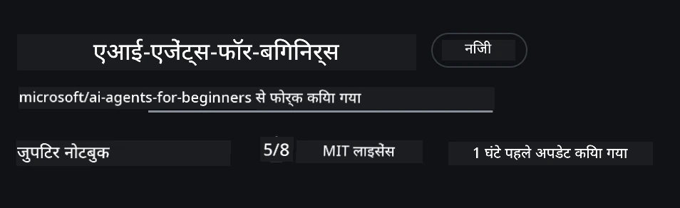
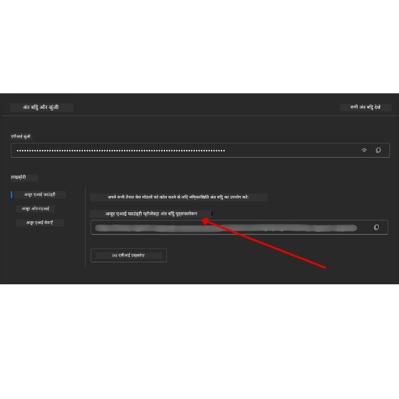

# पाठ्यक्रम सेटअप

## परिचय

यह पाठ इस कोर्स के कोड नमूनों को चलाने के तरीके को कवर करेगा।

## अन्य शिक्षार्थियों से जुड़ें और सहायता प्राप्त करें

अपने रिपॉजिटरी को क्लोन करना शुरू करने से पहले, सेटअप में सहायता पाने, कोर्स के बारे में कोई सवाल पूछने, या अन्य शिक्षार्थियों से जुड़ने के लिए [AI Agents For Beginners Discord चैनल](https://aka.ms/ai-agents/discord) में शामिल हों।

## इस रिपॉजिटरी को क्लोन या फोर्क करें

शुरू करने के लिए, कृपया GitHub रिपॉजिटरी को क्लोन या फोर्क करें। इससे आपके पास कोर्स सामग्री का अपना खुद का संस्करण होगा ताकि आप कोड चला, परीक्षण और संशोधित कर सकें!

इसे आप <a href="https://github.com/microsoft/ai-agents-for-beginners/fork" target="_blank">रिपॉजिटरी को फोर्क</a> करने के लिंक पर क्लिक करके कर सकते हैं

आपके पास अब इस कोर्स का अपना फोर्क किया गया संस्करण होना चाहिए, इस लिंक पर:



### शैलो क्लोन (वर्कशॉप / Codespaces के लिए अनुशंसित)

  >पूरा रिपॉजिटरी डाउनलोड करते समय पूरा इतिहास और सभी फाइलें बड़ी (~3 GB) हो सकती हैं। यदि आप केवल वर्कशॉप में भाग ले रहे हैं या केवल कुछ पाठ फोल्डर चाहते हैं, तो एक शैलो क्लोन (या sparse clone) बहुत कम डाउनलोड करता है।

#### त्वरित शैलो क्लोन — न्यूनतम इतिहास, सभी फाइलें

नीचे दिए गए कमांड्स में `<your-username>` को अपने फोर्क URL (या पसंद हो तो अपस्ट्रीम URL) से बदलें।

केवल नवीनतम कमिट इतिहास क्लोन करने के लिए (छोटा डाउनलोड):

```bash
git clone --depth 1 https://github.com/<your-username>/ai-agents-for-beginners.git
```

किसी विशेष शाखा को क्लोन करने के लिए:

```bash
git clone --depth 1 --branch <branch-name> https://github.com/<your-username>/ai-agents-for-beginners.git
```

#### आंशिक (sparse) क्लोन — न्यूनतम ब्लॉब + केवल चयनित फोल्डर

यह आंशिक क्लोन और sparse-checkout का उपयोग करता है (Git 2.25+ और partial clone समर्थन के साथ नवीनतम Git की आवश्यकता):

```bash
git clone --depth 1 --filter=blob:none --sparse https://github.com/<your-username>/ai-agents-for-beginners.git
```

रिपॉजिटरी फोल्डर में जाएं:

```bash
cd ai-agents-for-beginners
```

फिर निर्दिष्ट करें कि आप कौन से फोल्डरों को चाहते हैं (नीचे उदाहरण में दो फोल्डर दिखाए गए हैं):

```bash
git sparse-checkout set 00-course-setup 01-intro-to-ai-agents
```

क्लोन करने और फाइलों को सत्यापित करने के बाद, यदि आप केवल फाइलें चाहते हैं और जगह खाली करना चाहते हैं (कोई git इतिहास नहीं), तो कृपया रिपॉजिटरी मेटाडेटा हटाएं (💀अप्रतिवर्तनीय - आप सभी Git कार्यक्षमता खो देंगे):

```bash
# जेडश/बैश
rm -rf .git
```

```powershell
# पॉवरशेल
Remove-Item -Recurse -Force .git
```

#### GitHub Codespaces का उपयोग करना (स्थानीय बड़े डाउनलोड से बचने के लिए अनुशंसित)

- इस रिपॉजिटरी के लिए [GitHub UI](https://github.com/codespaces) के माध्यम से एक नया Codespace बनाएं।  

- नए बनाए गए Codespace के टर्मिनल में, ऊपर दिए गए शैलो/स्पार्स क्लोन कमांड्स में से एक चलाएं ताकि केवल आवश्यक पाठ फोल्डर ही Codespace कार्यक्षेत्र में लाए जा सकें।
- वैकल्पिक: Codespaces के अंदर क्लोन करने के बाद, अतिरिक्त स्थान मुक्त करने के लिए .git हटाएं (उपरोक्त हटाने के कमांड देखें)।
- ध्यान दें: यदि आप रिपॉजिटरी को सीधे Codespaces में खोलना पसंद करते हैं (अतिरिक्त क्लोन के बिना), तो ध्यान दें कि Codespaces devcontainer वातावरण बनाएगा और संभवतः आप जितना चाहते हैं उससे अधिक संसाधन तैयार कर सकता है।

#### सुझाव

- यदि आप संपादित/कमिट करना चाहते हैं तो हमेशा क्लोन URL को अपने फोर्क से बदलें।
- यदि बाद में अधिक इतिहास या फाइलों की आवश्यकता हो तो आप उन्हें प्राप्त कर सकते हैं या sparse-checkout समायोजित कर के अतिरिक्त फोल्डर शामिल कर सकते हैं।

## कोड चलाना

यह कोर्स AI एजेंट बनाने के लिए हाथों-हाथ अनुभव पाने के लिए कई जुपिटर नोटबुक प्रदान करता है।

कोड नमूने **Microsoft Agent Framework (MAF)** का उपयोग करते हैं `FoundryChatClient` के साथ, जो **Microsoft Foundry Agent Service V2** (Responses API) के माध्यम से **Microsoft Foundry** से जुड़ता है।

सभी Python नोटबुक `*-python-agent-framework.ipynb` नामांकित हैं।

## आवश्यकताएं

- Python 3.12+
  - **ध्यान दें**: यदि आपके पास Python3.12 स्थापित नहीं है, तो इसे स्थापित करें। फिर requirements.txt से सही संस्करण सुनिश्चित करने के लिए python3.12 का उपयोग करके अपना वर्चुअल एनवायरनमेंट (venv) बनाएं।
  
    >उदाहरण

    Python venv निर्देशिका बनाएं:

    ```bash
    python -m venv venv
    ```

    फिर इस venv वातावरण को सक्रिय करें:

    ```bash
    # zsh/bash
    source venv/bin/activate
    ```
  
    ```dos
    # Command Prompt for Windows
    venv\Scripts\activate
    ```

- .NET 10+: .NET उपयोग करने वाले सैंपल कोड के लिए, सुनिश्चित करें कि आपने [.NET 10 SDK](https://dotnet.microsoft.com/download/dotnet/10.0) या बाद में इंस्टॉल किया है। फिर अपनी .NET SDK संस्करण जांचें:

    ```bash
    dotnet --list-sdks
    ```

- **Azure CLI** — प्रमाणीकरण के लिए आवश्यक। [aka.ms/installazurecli](https://aka.ms/installazurecli) से इंस्टॉल करें।
- **Azure सब्सक्रिप्शन** — Microsoft Foundry और Microsoft Foundry Agent Service तक पहुंच के लिए।
- **Microsoft Foundry प्रोजेक्ट** — एक प्रोजेक्ट जिसमें डिप्लॉय किया गया मॉडल हो (जैसे, `gpt-5-mini`)। देखें: [चरण 1](#चरण-1-एक-microsoft-foundry-प्रोजेक्ट-बनाएं) नीचे।

हमने इस रिपॉजिटरी की रूट में एक `requirements.txt` फाइल शामिल की है जिसमें कोड नमूनों को चलाने के लिए आवश्यक सभी Python पैकेज हैं।

आप इन्हें रिपॉजिटरी की रूट डायरेक्टरी में टर्मिनल से नीचे दिए गए कमांड से इंस्टॉल कर सकते हैं:

```bash
pip install -r requirements.txt
```

हम किसी भी संघर्ष और समस्याओं से बचने के लिए Python वर्चुअल एनवायरनमेंट बनाने की सलाह देते हैं।

## VSCode सेटअप

सुनिश्चित करें कि आप VSCode में सही Python संस्करण का उपयोग कर रहे हैं।


## Microsoft Foundry और Microsoft Foundry Agent Service सेटअप करें

### चरण 1: एक Microsoft Foundry प्रोजेक्ट बनाएं

नोटबुक चलाने के लिए आपको Microsoft Foundry **hub** और एक डिप्लॉय किए गए मॉडल के साथ **project** की जरूरत है।

1. [ai.azure.com](https://ai.azure.com) पर जाएं और अपने Azure खाते से साइन इन करें।
2. एक **hub** बनाएं (या मौजूदा का उपयोग करें)। देखें: [Hub resources overview](https://learn.microsoft.com/azure/ai-foundry/concepts/ai-resources)।
3. हब के अंदर एक **project** बनाएं।
4. **Models + Endpoints** → **Deploy model** से कोई मॉडल डिप्लॉय करें (जैसे, `gpt-5-mini`)।

### चरण 2: अपने प्रोजेक्ट एंडपॉइंट और मॉडल डिप्लॉयमेंट नाम प्राप्त करें

Microsoft Foundry पोर्टल में अपने प्रोजेक्ट से:

- **Project Endpoint** — **Overview** पेज पर जाएं और एंडपॉइंट URL कॉपी करें।



- **Model Deployment Name** — **Models + Endpoints** पर जाएं, अपना डिप्लॉय किया गया मॉडल चुनें, और **Deployment name** नोट करें (जैसे, `gpt-5-mini`)।

### चरण 3: `az login` से Azure में साइन इन करें

अधिकांश नोटबुक आपके **Azure CLI साइन-इन** के माध्यम से प्रमाणित होते हैं — `AzureCliCredential` या `DefaultAzureCredential` (दोनों आपके `az login` सत्र को पकड़ते हैं) जो `azure-identity` पैकेज से हैं — इसलिए इन्हें API keys की जरूरत नहीं है। कुछ पाठ और वैकल्पिक एकीकरण API keys का उपयोग करते हैं; प्रत्येक पाठ की आवश्यकताओं में कोई अतिरिक्त पर्यावरण वेरिएबल्स देखें। इसके लिए आपके Azure CLI से साइन इन होना आवश्यक है।

1. यदि आपने अभी तक Azure CLI इंस्टॉल नहीं किया है, तो इंस्टॉल करें: [aka.ms/installazurecli](https://aka.ms/installazurecli)

2. साइन इन करें:

    ```bash
    az login
    ```

    या यदि आप रिमोट/Codespace वातावरण में हों और ब्राउज़र नहीं है:

    ```bash
    az login --use-device-code
    ```

3. यदि पूछा जाए तो अपना सब्सक्रिप्शन चुनें — वह जिसमें आपका Foundry प्रोजेक्ट हो।

4. सत्यापित करें कि आप साइन इन हैं:

    ```bash
    az account show
    ```

> **`az login` क्यों?** नोटबुक `AzureCliCredential` (या `DefaultAzureCredential`) के जरिए प्रमाणीकरण करते हैं, जो आपके Azure CLI साइन-इन सत्र से क्रेडेंशियल प्राप्त करता है — आपके `.env` फाइल में कोई API keys या सीक्रेट्स नहीं। यह एक [सुरक्षा सर्वोत्तम प्रथा](https://learn.microsoft.com/azure/developer/ai/keyless-connections) है।

### चरण 4: अपनी `.env` फाइल बनाएँ

उदाहरण फ़ाइल कॉपी करें:

```bash
# zsh/bash
cp .env.example .env
```

```powershell
# पावरशेल
Copy-Item .env.example .env
```

`.env` खोलें और इन दो मानों को भरें:

```env
AZURE_AI_PROJECT_ENDPOINT=https://<your-project>.services.ai.azure.com/api/projects/<your-project-id>
AZURE_AI_MODEL_DEPLOYMENT_NAME=gpt-5-mini
```

| वेरिएबल | कहां खोजें |
|----------|-----------------|
| `AZURE_AI_PROJECT_ENDPOINT` | Foundry पोर्टल → आपका प्रोजेक्ट → **Overview** पेज |
| `AZURE_AI_MODEL_DEPLOYMENT_NAME` | Foundry पोर्टल → **Models + Endpoints** → आपका डिप्लॉय किया गया मॉडल का नाम |

अधिकांश पाठ के लिए इतना ही! नोटबुक अपने आप आपके `az login` सत्र के जरिए प्रमाणीकरण कर लेंगे।

### चरण 5: Python Dependencies इंस्टॉल करें

```bash
pip install -r requirements.txt
```

हम सलाह देते हैं कि इसे आपने पूर्व में बनाई वर्चुअल एनवायरनमेंट के भीतर चलाएं।

## वैकल्पिक सेटअप: Azure AI Search (पाठ 5 और 16)

पाठ 5 (Agentic RAG) और पाठ 16 नोटबुक आउट-ऑफ-द-बॉक्स एक **इन-मेमोरी नॉलेज बेस** के साथ चलते हैं — कोई अतिरिक्त Azure संसाधनों की आवश्यकता नहीं। यदि आप इन्हें एक वास्तविक **Azure AI Search** इंडेक्स के साथ बैक करना चाहते हैं, तो ध्यान दें कि **पाठ 16 नोटबुक वर्तमान में key-based authentication का उपयोग करता है**: यह इन-मेमोरी सर्च से Azure AI Search में तभी स्विच करता है जब **दोनों** `AZURE_SEARCH_SERVICE_ENDPOINT` **और** `AZURE_SEARCH_API_KEY` सेट हों, अन्यथा यह इन-मेमोरी पर रहता है — इसलिए वास्तविक इंडेक्स के लिए आपको एडमिन की भी सेट करनी होगी। कीलेस प्रमाणीकरण Microsoft Entra ID (RBAC) के साथ अनुशंसित है, जैसा कि इस कोर्स में `az login` विधि उपयोग होती है।

नीचे के RBAC चरण सेटअप-गाइड उदाहरण और आपके कोड के लिए लागू हैं। वे पाठ 16 नोटबुक में कीलेस प्रमाणीकरण सक्षम नहीं करते; पाठ 16 को Azure AI Search के लिए दोनों एंडपॉइंट और एडमिन की दोनों चाहिए।

1. अपनी खोज सेवा पर **रोल-आधारित पहुँच सक्षम करें**:

    ```bash
    az search service update --name <service-name> --resource-group <resource-group> --auth-options aadOrApiKey
    ```

2. अपने आप को आवश्यक भूमिकाएँ सौंपें (इंडेक्स बनाना/लोड करना और पूछताछ करना):

    ```bash
    az role assignment create --assignee <your-user-or-principal-id> --role "Search Service Contributor" --scope $(az search service show -g <resource-group> -n <service-name> --query id -o tsv)
    az role assignment create --assignee <your-user-or-principal-id> --role "Search Index Data Contributor" --scope $(az search service show -g <resource-group> -n <service-name> --query id -o tsv)
    ```

3. अपने `.env` फ़ाइल में एंडपॉइंट जोड़ें:

| वेरिएबल | कहां खोजें |
|----------|-----------------|
| `AZURE_SEARCH_SERVICE_ENDPOINT` | Azure पोर्टल → आपकी **Azure AI Search** संसाधन → **Overview** → URL |
| `AZURE_SEARCH_API_KEY` | आवश्यक (एंडपॉइंट के साथ) पाठ 16 नोटबुक में Azure AI Search को सक्षम करने के लिए, जिसमें key-based auth होता है। Azure पोर्टल → **Settings** → **Keys** → प्राइमरी एडमिन की |

> **कीलेस क्यों?** एडमिन की आपके खोज सेवा पर पूर्ण लेखन पहुँच देती हैं और `.env` फ़ाइलों के जरिए लीक हो सकती हैं। RBAC के साथ, आपकी `az login` पहचान का उपयोग होता है — वही कीलेस Entra ID पैटर्न जो कोर्स नोटबुक्स में उपयोग होता है (AzureCliCredential / DefaultAzureCredential के जरिये)। देखें: [Azure AI Search में रोल का उपयोग](https://learn.microsoft.com/azure/search/search-security-rbac)।

पूर्ण इंडेक्स निर्माण उदाहरणों के लिए [Azure AI Search सेटअप गाइड](./AzureSearch.md) देखें Python और .NET में।

## अतिरिक्त सेटअप उन पाठों के लिए जो सीधे Azure OpenAI का उपयोग करते हैं (पाठ 6 और 8)

कुछ पाठ 6 और 8 के नोटबुक सीधे **Responses API** का उपयोग करते हुए **Azure OpenAI** से कॉल करते हैं, बिना Microsoft Foundry प्रोजेक्ट के। ये नमूने पूर्व में GitHub Models का उपयोग करते थे, जो अब अप्रचलित है और Responses API का समर्थन नहीं करता। इन्हें `.env` फाइल में ये वेरिएबल जोड़ें:

| वेरिएबल | कहां खोजें |
|----------|-----------------|
| `AZURE_OPENAI_ENDPOINT` | Azure पोर्टल → आपकी **Azure OpenAI** संसाधन → **Keys and Endpoint** → एंडपॉइंट (जैसे `https://<your-resource>.openai.azure.com`) |
| `AZURE_OPENAI_DEPLOYMENT` | आपका डिप्लॉय किया गया मॉडल का नाम (जैसे `gpt-5-mini`) जो Responses API का समर्थन करता है |
| `AZURE_OPENAI_API_KEY` | वैकल्पिक — केवल यदि आप `az login` / Entra ID के बजाय key-based auth उपयोग करते हैं |

> Responses API स्थिर `/openai/v1/` एंडपॉइंट उपयोग करता है, इसलिए `api-version` आवश्यक नहीं है। कीलेस Entra ID प्रमाणीकरण के लिए `az login` के साथ साइन इन करें।

## वैकल्पिक प्रदाता: MiniMax (OpenAI-संगत)

[MiniMax](https://platform.minimaxi.com/) बड़े कॉन्टेक्स्ट वाले मॉडल (204K टोकन तक) OpenAI-संगत API से प्रदान करता है। चूंकि Microsoft Agent Framework का `OpenAIChatClient` किसी भी OpenAI-संगत एंडपॉइंट के साथ काम करता है, आप MiniMax को उन पाठों में विशिष्ट रूप से `OpenAIChatClient` के लिए एक विकल्प के रूप में उपयोग कर सकते हैं।

अपनी `.env` फाइल में ये वेरिएबल जोड़ें:

| वेरिएबल | कहां खोजें |
|----------|-----------------|
| `MINIMAX_API_KEY` | [MiniMax Platform](https://platform.minimaxi.com/) → API Keys |
| `MINIMAX_BASE_URL` | `https://api.minimax.io/v1` (डिफ़ॉल्ट मान) का उपयोग करें |
| `MINIMAX_MODEL_ID` | उपयोग करने के लिए मॉडल नाम (जैसे, `MiniMax-M3`) |

**उदाहरण मॉडल**: `MiniMax-M3` (अनुशंसित), `MiniMax-M2.7`, `MiniMax-M2.7-highspeed` (तेजी से प्रतिक्रियाएं)। मॉडल नाम और उपलब्धता समय के साथ बदल सकती है, और किसी मॉडल तक पहुँच आपके खाते पर निर्भर हो सकती है।

जो कोड नमूने `OpenAIChatClient` का उपयोग करते हैं (जैसे पाठ 14 होटल बुकिंग वर्कफ़्लो) अपने आप ही आपके MiniMax कॉन्फ़िगरेशन का पता लगा और उपयोग कर लेंगे जब `MINIMAX_API_KEY` सेट हो।


## वैकल्पिक प्रदाता: Foundry Local (मॉडल्स को डिवाइस पर चलाएं)

[Foundry Local](https://foundrylocal.ai) एक हल्का रनटाइम है जो आपके अपने मशीन पर ही OpenAI-संगत API के माध्यम से भाषा मॉडल्स डाउनलोड, प्रबंधित और सेवा करता है — किसी क्लाउड की आवश्यकता नहीं।

चूंकि Microsoft Agent Framework का `OpenAIChatClient` किसी भी OpenAI-संगत एंडपॉइंट के साथ काम करता है, Foundry Local Azure OpenAI का एक स्थानीय विकल्प है।

**1. Foundry Local स्थापित करें**

```bash
# विंडोज़
winget install Microsoft.FoundryLocal

# मैकओएस
brew install foundrylocal
```

**2. एक मॉडल डाउनलोड करें और चलाएं** (यह स्थानीय सेवा भी शुरू करता है):

```bash
foundry model list          # उपलब्ध मॉडलों को देखें
foundry model run phi-4-mini
```

**3. Python SDK स्थापित करें** जो स्थानीय एंडपॉइंट खोजने के लिए उपयोग किया जाता है:

```bash
pip install foundry-local-sdk
```

**4. Microsoft Agent Framework को अपने स्थानीय मॉडल पर इंगित करें:**

```python
from foundry_local import FoundryLocalManager
from agent_framework.openai import OpenAIChatClient

# मॉडल को डाउनलोड करता है (यदि आवश्यक हो) और स्थानीय रूप से सेवा प्रदान करता है, फिर एंडपॉइंट/पोर्ट खोजता है।
manager = FoundryLocalManager("phi-4-mini")

chat_client = OpenAIChatClient(
    base_url=manager.endpoint,      # उदाहरण के लिए http://localhost:<port>/v1
    api_key=manager.api_key,        # Foundry Local के लिए हमेशा "not-required" होता है
    model_id=manager.get_model_info("phi-4-mini").id,
)

agent = chat_client.as_agent(
    name="LocalAgent",
    instructions="You are a helpful assistant running fully on-device.",
)
```

> **नोट:** Foundry Local एक OpenAI-संगत **Chat Completions** एंडपॉइंट प्रदान करता है। इसे स्थानीय विकास और ऑफलाइन परिदृश्यों के लिए उपयोग करें। पूर्ण **Responses API** फीचर सेट (स्थिति-पूर्ण वार्तालाप, आदि) के लिए Azure OpenAI या Microsoft Foundry प्रोजेक्ट का उपयोग करें।

## पाठ 8 के लिए अतिरिक्त सेटअप (Bing ग्राउंडिंग वर्कफ़्लो)

पाठ 8 में कंडीशनल वर्कफ़्लो नोटबुक Microsoft Foundry के माध्यम से **Bing ग्राउंडिंग** का उपयोग करता है। यदि आप वह नमूना चलाने की योजना बना रहे हैं, तो अपनी `.env` फ़ाइल में यह वेरिएबल जोड़ें:

| वेरिएबल | कहां मिलेगा |
|----------|-----------------|
| `BING_CONNECTION_ID` | Microsoft Foundry पोर्टल → आपका प्रोजेक्ट → **Management** → **Connected resources** → आपका Bing कनेक्शन → कनेक्शन ID कॉपी करें |

## समस्या निवारण

### macOS पर SSL प्रमाणपत्र सत्यापन त्रुटियां

यदि आप macOS पर हैं और इस प्रकार की त्रुटि आती है:

```plaintext
ssl.SSLCertVerificationError: [SSL: CERTIFICATE_VERIFY_FAILED] certificate verify failed: self-signed certificate in certificate chain
```

यह macOS पर Python की एक ज्ञात समस्या है जहां सिस्टम SSL प्रमाणपत्र स्वतः भरोसेमंद नहीं होते। निम्न समाधान प्रयास करें:

**विकल्प 1: Python का Install Certificates स्क्रिप्ट चलाएं (अनुशंसित)**

```bash
# अपने इंस्टॉल किए गए पायथन संस्करण के साथ 3.XX बदलें (जैसे, 3.12 या 3.13):
/Applications/Python\ 3.XX/Install\ Certificates.command
```

**विकल्प 2: अपने नोटबुक में `connection_verify=False` का उपयोग करें (केवल GitHub Models नोटबुक के लिए)**

Lesson 6 नोटबुक (`06-building-trustworthy-agents/code_samples/06-system-message-framework.ipynb`) में पहले से ही एक टिप्पणीबद्ध वर्कअराउंड शामिल है। जब प्रमाणपत्र त्रुटियां हों, तो `connection_verify=False` को अनकमेंट करें:

```python
client = ChatCompletionsClient(
    endpoint=endpoint,
    credential=AzureKeyCredential(token),
    connection_verify=False,  # अगर आपको सर्टिफिकेट त्रुटियां मिलती हैं तो SSL सत्यापन अक्षम करें
)
```

> **⚠️ चेतावनी:** SSL सत्यापन अस्थायी रूप से बंद करना (`connection_verify=False`) सुरक्षा कम करता है क्योंकि यह प्रमाणपत्र सत्यापन को छोड़ देता है। इसे केवल विकास वातावरण में अस्थायी समाधान के रूप में उपयोग करें। उत्पादन में कभी इसका उपयोग न करें।

**विकल्प 3: `truststore` स्थापित करें और उपयोग करें**

```bash
pip install truststore
```

फिर नेटवर्क कॉल करने से पहले अपनी नोटबुक या स्क्रिप्ट के शीर्ष पर निम्न जोड़ें:

```python
import truststore
truststore.inject_into_ssl()
```

## कहीं तय हो गए हैं?

यदि आपको इस सेटअप को चलाने में कोई समस्या हो, तो हमारे <a href="https://discord.gg/kzRShWzttr" target="_blank">Azure AI Community Discord</a> में शामिल हों या <a href="https://github.com/microsoft/ai-agents-for-beginners/issues?WT.mc_id=academic-105485-koreyst" target="_blank">एक इशू बनाएं</a>।

## अगला पाठ

आप अब इस कोर्स के लिए कोड चलाने के लिए तैयार हैं। एआई एजेंट्स की दुनिया के बारे में अधिक सीखने के लिए शुभकामनाएं!

[Introduction to AI Agents and Agent Use Cases](../01-intro-to-ai-agents/README.md)

---

<!-- CO-OP TRANSLATOR DISCLAIMER START -->
**अस्वीकरण**:
इस दस्तावेज़ का अनुवाद AI अनुवाद सेवा [Co-op Translator](https://github.com/Azure/co-op-translator) का उपयोग करके किया गया है। जबकि हम सटीकता के लिए प्रयास करते हैं, कृपया ध्यान दें कि स्वचालित अनुवादों में त्रुटियाँ या अशुद्धियाँ हो सकती हैं। मूल दस्तावेज़ अपनी मूल भाषा में ही प्रामाणिक स्रोत माना जाना चाहिए। महत्वपूर्ण जानकारी के लिए, पेशेवर मानव अनुवाद की सिफारिश की जाती है। इस अनुवाद के उपयोग से उत्पन्न किसी भी गलतफहमी या गलत व्याख्या के लिए हम उत्तरदायी नहीं हैं।
<!-- CO-OP TRANSLATOR DISCLAIMER END -->