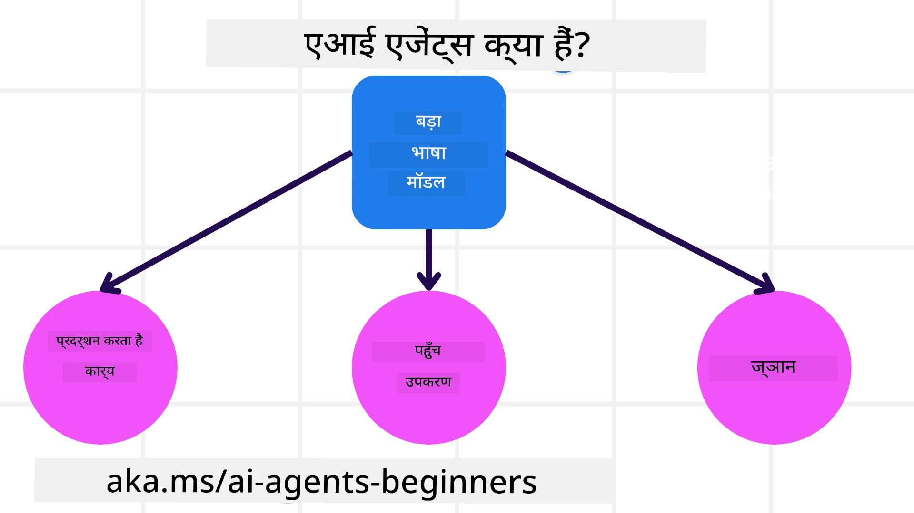
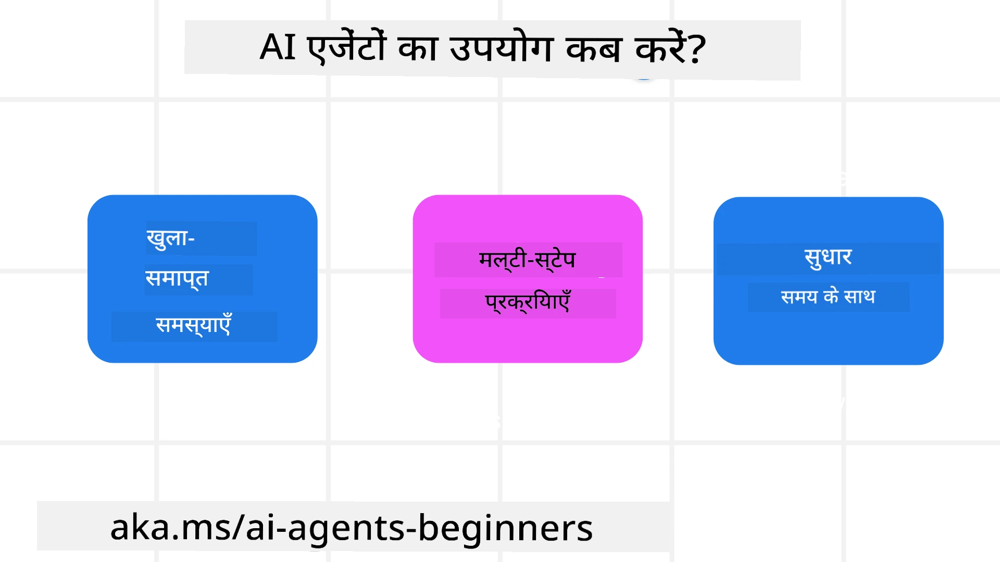

> _(ऊपर की छवि पर क्लिक करके इस पाठ का वीडियो देखें)_

# AI एजेंट्स और उपयोग के मामले (Agent Use Cases) का परिचय

"AI Agents for Beginners" कोर्स में आपका स्वागत है! यह कोर्स AI एजेंट बनाने के लिए मूलभूत ज्ञान और लागू उदाहरण प्रदान करता है।

दूसरे शिक्षार्थियों और AI एजेंट बिल्डरों से मिलें और इस कोर्स के बारे में कोई भी प्रश्न पूछने के लिए <a href="https://discord.gg/kzRShWzttr" target="_blank">Azure AI Discord समुदाय</a> में जुड़ें।

इस कोर्स की शुरुआत करने के लिए, हम पहले यह बेहतर समझेंगे कि AI एजेंट क्या हैं और हम उन्हें अपने द्वारा बनाए जा रहे अनुप्रयोगों और वर्कफ़्लोज़ में कैसे उपयोग कर सकते हैं।

## परिचय

यह पाठ निम्नलिखित विषयों को कवर करता है:

- AI एजेंट क्या हैं और एजेंटों के अलग-अलग प्रकार कौनसे हैं?
- कौन से उपयोग के मामले AI एजेंटों के लिए सबसे उपयुक्त हैं और वे हमारी कैसे मदद कर सकते हैं?
- एजेंटिक समाधान डिजाइन करते समय कुछ बुनियादी बिल्डिंग ब्लॉक्स क्या हैं?

## सीखने के लक्ष्य
इस पाठ को पूरा करने के बाद, आप सक्षम होंगे:

- AI एजेंट अवधारणाओं को समझना और यह अन्य AI समाधानों से कैसे भिन्न हैं।
- AI एजेंटों को सबसे कुशलतापूर्वक लागू करना।
- उपयोगकर्ताओं और ग्राहकों दोनों के लिए उत्पादक रूप से एजेंटिक समाधान डिज़ाइन करना।

## AI एजेंट्स की परिभाषा और प्रकार

### AI एजेंट्स क्या हैं?

AI एजेंट वे **प्रणालियाँ** हैं जो **Large Language Models(LLMs)** को उनके क्षमताओं का विस्तार करके **क्रियाएँ करने** में सक्षम बनाती हैं, LLMs को **उपकरणों तक पहुँच** और **ज्ञान** प्रदान करके।

आइए इस परिभाषा को छोटे हिस्सों में तोड़ें:

- **प्रणाली** - एजेंट्स को केवल एक घटक के रूप में न देखकर कई घटकों की एक प्रणाली के रूप में सोचना महत्वपूर्ण है। मौलिक स्तर पर, एक AI एजेंट के घटक हैं:
  - **Environment** - वह परिभाषित स्थान जहाँ AI एजेंट कार्य कर रहा होता है। उदाहरण के लिए, यदि हमारे पास एक यात्रा बुकिंग AI एजेंट है, तो पर्यावरण वह यात्रा बुकिंग सिस्टम हो सकता है जिसका AI एजेंट कार्य पूरा करने के लिए उपयोग करता है।
  - **Sensors** - पर्यावरण में जानकारी होती है और प्रतिक्रिया प्रदान की जाती है। AI एजेंट सेंसरों का उपयोग वर्तमान पर्यावरण की स्थिति के बारे में जानकारी एकत्र करने और व्याख्या करने के लिए करते हैं। यात्रा बुकिंग एजेंट उदाहरण में, यात्रा बुकिंग सिस्टम होटल उपलब्धता या उड़ान की कीमतों जैसी जानकारी प्रदान कर सकता है।
  - **Actuators** - एक बार जब AI एजेंट पर्यावरण की वर्तमान स्थिति प्राप्त कर लेता है, तो वर्तमान कार्य के लिए एजेंट यह निर्धारित करता है कि पर्यावरण को बदलने के लिए कौन सी क्रिया करनी है। यात्रा बुकिंग एजेंट के लिए, यह उपयोगकर्ता के लिए उपलब्ध कमरे को बुक करना हो सकता है।

**Large Language Models** - एजेंटों की अवधारणा LLMs के निर्माण से पहले भी मौजूद थी। LLMs के साथ AI एजेंट बनाने का लाभ उनकी मानव भाषा और डेटा की व्याख्या करने की क्षमता है। यह क्षमता LLMs को पर्यावरणीय जानकारी की व्याख्या करने और पर्यावरण को बदलने की योजना निर्धारित करने में सक्षम बनाती है।

**क्रियाएँ करना** - AI एजेंट प्रणालियों के बाहर, LLMs उन स्थितियों तक सीमित होते हैं जहाँ क्रिया उपयोगकर्ता के प्रॉम्प्ट के आधार पर सामग्री या जानकारी उत्पन्न करना होती है। AI एजेंट प्रणालियों के भीतर, LLMs उपयोगकर्ता के अनुरोध की व्याख्या करके और अपने पर्यावरण में उपलब्ध उपकरणों का उपयोग करके कार्यों को पूरा कर सकते हैं।

**उपकरणों तक पहुँच** - किस उपकरणों तक LLM की पहुँच है यह 1) उस पर्यावरण द्वारा परिभाषित होता है जिसमें वह काम कर रहा है और 2) AI एजेंट के डेवलपर द्वारा नियंत्रित किया जा सकता है। हमारे यात्रा एजेंट उदाहरण के लिए, एजेंट के उपकरण बुकिंग सिस्टम में उपलब्ध ऑपरेशनों द्वारा सीमित होते हैं, और/या डेवलपर एजेंट की उपकरण पहुँच को केवल उड़ानों तक सीमित कर सकता है।

**मेमोरी+ज्ञान** - मेमोरी बातचीत के संदर्भ में अल्पकालिक हो सकती है। दीर्घकालिक रूप से, पर्यावरण द्वारा प्रदान की गई जानकारी के अलावा, AI एजेंट अन्य सिस्टमों, सेवाओं, उपकरणों, और यहाँ तक कि अन्य एजेंटों से भी ज्ञान पुनःप्राप्त कर सकते हैं। यात्रा एजेंट उदाहरण में, यह ज्ञान ग्राहक डेटाबेस में स्थित उपयोगकर्ता की यात्रा प्राथमिकताओं की जानकारी हो सकती है।

### एजेंटों के विभिन्न प्रकार

अब जब हमारे पास AI एजेंटों की सामान्य परिभाषा है, आइए कुछ विशिष्ट एजेंट प्रकारों और इन्हें यात्रा बुकिंग AI एजेंट पर कैसे लागू किया जा सकता है, देखें।

| **एजेंट प्रकार**                | **विवरण**                                                                                                                       | **उदाहरण**                                                                                                                                                                                                                   |
| ----------------------------- | ------------------------------------------------------------------------------------------------------------------------------------- | ----------------------------------------------------------------------------------------------------------------------------------------------------------------------------------------------------------------------------- |
| **सरल रिफ्लेक्स एजेंट (Simple Reflex Agents)**      | पूर्वनिर्धारित नियमों के आधार पर तात्कालिक क्रियाएँ करते हैं।                                                                                  | यात्रा एजेंट ईमेल के संदर्भ की व्याख्या करता है और यात्रा संबंधी शिकायतों को ग्राहक सेवा को अग्रेषित कर देता है।                                                                                                                          |
| **मॉडल-आधारित रिफ्लेक्स एजेंट (Model-Based Reflex Agents)** | दुनिया के एक मॉडल और उस मॉडल में परिवर्तनों के आधार पर क्रियाएँ करते हैं।                                                              | यात्रा एजेंट ऐतिहासिक मूल्य निर्धारण डेटा तक पहुँच के आधार पर महत्वपूर्ण मूल्य परिवर्तनों वाले मार्गों को प्राथमिकता देता है।                                                                                                             |
| **लक्ष्य-आधारित एजेंट (Goal-Based Agents)**         | लक्ष्य की व्याख्या करके और उस तक पहुँचने के लिए आवश्यक क्रियाएँ निर्धारित करके विशिष्ट लक्ष्यों को प्राप्त करने की योजनाएँ बनाते हैं।                                  | यात्रा एजेंट वर्तमान स्थान से गंतव्य तक आवश्यक यात्रा व्यवस्थाओं (कार, सार्वजनिक परिवहन, उड़ानें) का निर्धारण करके यात्रा बुक करता है।                                                                                |
| **उपयोगिता-आधारित एजेंट (Utility-Based Agents)**      | प्राथमिकताओं पर विचार करते हैं और लक्ष्यों को प्राप्त करने के लिए व्यापार-ऑफ को संख्यात्मक रूप से तौलते हैं।                                               | यात्रा एजेंट यात्रा बुक करते समय सुविधा बनाम लागत के बीच तौले जाने पर उपयोगिता को अधिकतम करता है।                                                                                                                                          |
| **लर्निंग एजेंट्स (Learning Agents)**           | फीडबैक के जवाब में समय के साथ सुधार करते हैं और तदनुसार क्रियाओं को समायोजित करते हैं।                                                        | यात्रा एजेंट पोस्ट-ट्रिप सर्वेक्षणों से ग्राहक फीडबैक का उपयोग करके भविष्य की बुकिंग्स में समायोजन करके सुधार करता है।                                                                                                               |
| **हायरार्किकल एजेंट्स (Hierarchical Agents)**       | कई स्तरों में कई एजेंट होते हैं, जहाँ उच्च-स्तरीय एजेंट कार्यों को निचले-स्तरीय एजेंटों के लिए उप-कार्य में विभाजित करते हैं। | यात्रा एजेंट एक यात्रा रद्द करने के लिए कार्य को उप-कार्यों (उदाहरण के लिए, विशिष्ट बुकिंग रद्द करना) में विभाजित करता है और निचले-स्तरीय एजेंट उन्हें पूरा करके उच्च-स्तरीय एजेंट को रिपोर्ट करते हैं।                                     |
| **मल्टी-एजेंट सिस्टम (Multi-Agent Systems (MAS))** | एजेंट स्वतंत्र रूप से कार्यों को पूरा करते हैं, या तो सहयोगात्मक या प्रतिस्पर्धात्मक रूप से।                                                           | सहयोगात्मक: कई एजेंट विशिष्ट यात्रा सेवाओं जैसे होटल, उड़ानें, और मनोरंजन को बुक करते हैं। प्रतिस्पर्धात्मक: कई एजेंट साझा होटल बुकिंग कैलेंडर पर ग्राहकों को होटल में बुक करने के लिए प्रबंधित और प्रतिस्पर्धा करते हैं। |

## AI एजेंट्स का उपयोग कब करें

पिछले अनुभाग में, हमने विभिन्न प्रकार के एजेंटों का उपयोग यात्रा बुकिंग के विभिन्न परिदृश्यों में कैसे किया जा सकता है यह समझाने के लिए यात्रा एजेंट उपयोग-मामला इस्तेमाल किया। हम इस अनुप्रयोग का उपयोग पूरे कोर्स में जारी रखेंगे।

आइए उन प्रकारों के उपयोग-मामलों पर नज़र डालें जिनके लिए AI एजेंट सबसे उपयुक्त होते हैं:

- **खुले-समाप्ति समस्याएँ (Open-Ended Problems)** - ऐसे मामलों में जहाँ आवश्यक चरणों को पूरा करने के लिए LLM को निर्धारित करने की अनुमति दी जाती है क्योंकि इसे हमेशा वर्कफ़्लो में हार्डकोड नहीं किया जा सकता।
- **बहु-चरण प्रक्रियाएँ (Multi-Step Processes)** - वे कार्य जिनमें एकल-शॉट पुनर्प्राप्ति के बजाय कई चरणों में उपकरणों या जानकारी का उपयोग करने की आवश्यकता होती है।  
- **समय के साथ सुधार (Improvement Over Time)** - वे कार्य जहाँ एजेंट समय के साथ अपने पर्यावरण या उपयोगकर्ताओं से प्राप्त फीडबैक के जरिए बेहतर उपयोगिता प्रदान करने के लिए सुधार कर सकता है।

हम विश्वसनीय AI एजेंट बनाने वाले पाठ में AI एजेंटों के उपयोग के और विचार कवर करते हैं।

## एजेंटिक समाधानों के मूल सिद्धांत

### एजेंट विकास

AI एजेंट सिस्टम डिज़ाइन करने का पहला कदम उपकरणों, क्रियाओं और व्यवहारों को परिभाषित करना है। इस कोर्स में, हम अपने एजेंटों को परिभाषित करने के लिए **Azure AI Agent Service** का उपयोग करने पर ध्यान केंद्रित करते हैं। यह निम्नलिखित सुविधाएँ प्रदान करता है:

- OpenAI, Mistral, और Llama जैसे Open Models का चयन
- Tripadvisor जैसे प्रदाताओं के माध्यम से लाइसेंसयुक्त डेटा का उपयोग
- मानकीकृत OpenAPI 3.0 उपकरणों का उपयोग

### एजेंटिक पैटर्न

LLMs के साथ संचार प्रॉम्प्ट के माध्यम से होता है। AI एजेंटों की अर्ध-स्वायत्त प्रकृति को देखते हुए, पर्यावरण में बदलाव के बाद हमेशा या मैन्युअल रूप से LLM को फिर से प्रॉम्प्ट करना संभव या आवश्यक नहीं होता। हम **Agentic Patterns** का उपयोग करते हैं जो हमें कई चरणों में LLM को अधिक स्केलेबल तरीके से प्रॉम्प्ट करने की अनुमति देते हैं।

यह कोर्स कुछ प्रचलित एजेंटिक पैटर्नों में विभाजित है।

### एजेंटिक फ्रेमवर्क्स

एजेंटिक फ्रेमवर्क डेवलपर्स को कोड के माध्यम से एजेंटिक पैटर्न लागू करने की अनुमति देते हैं। ये फ्रेमवर्क टेम्प्लेट्स, प्लगइन्स, और बेहतर AI एजेंट सहयोग के लिए उपकरण प्रदान करते हैं। ये लाभ AI एजेंट प्रणालियों के लिए बेहतर ऑब्ज़र्वेबिलिटी और ट्रबलशूटिंग की क्षमताएँ प्रदान करते हैं।

इस कोर्स में, हम प्रोडक्शन-रेडी AI एजेंट बनाने के लिए Microsoft Agent Framework (MAF) का अन्वेषण करेंगे।

## नमूना कोड

- Python: [Agent Framework](./code_samples/01-python-agent-framework.ipynb)
- .NET: [Agent Framework](./code_samples/01-dotnet-agent-framework.md)

## AI एजेंट्स के बारे में और प्रश्न हैं?

[Microsoft Foundry Discord](https://aka.ms/ai-agents/discord) में जुड़ें ताकि आप अन्य शिक्षार्थियों से मिल सकें, ऑफिस ऑवर्स में भाग ले सकें और अपने AI एजेंट्स से जुड़े प्रश्नों के उत्तर प्राप्त कर सकें।

## पिछला पाठ

[Course Setup](../00-course-setup/README.md)

## अगला पाठ

[Exploring Agentic Frameworks](../02-explore-agentic-frameworks/README.md)

---

<!-- CO-OP TRANSLATOR DISCLAIMER START -->
**अस्वीकरण**:
यह दस्तावेज़ AI अनुवाद सेवा [Co-op Translator](https://github.com/Azure/co-op-translator) का उपयोग करके अनुवादित किया गया है। हालाँकि हम सटीकता के लिए प्रयासरत हैं, कृपया ध्यान दें कि स्वचालित अनुवादों में त्रुटियाँ या अशुद्धियाँ हो सकती हैं। मूल दस्तावेज़ को उसकी मूल भाषा में प्रामाणिक स्रोत माना जाना चाहिए। महत्वपूर्ण जानकारी के लिए पेशेवर मानव अनुवाद की सिफारिश की जाती है। इस अनुवाद के उपयोग से उत्पन्न किसी भी गलतफहमी या गलत व्याख्या के लिए हम उत्तरदायी नहीं हैं।
<!-- CO-OP TRANSLATOR DISCLAIMER END -->