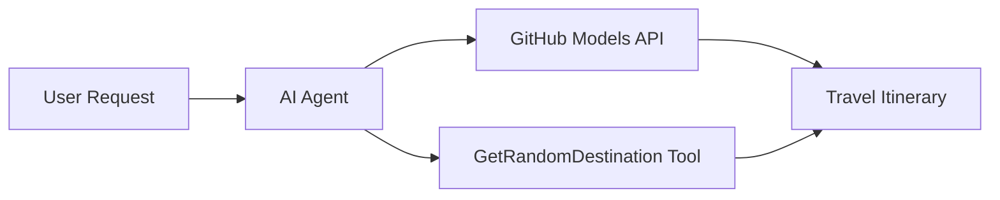

<!--
CO_OP_TRANSLATOR_METADATA:
{
  "original_hash": "23afd9be7b6ba5b69a44c3b6a78e07f6",
  "translation_date": "2025-11-06T10:02:43+00:00",
  "source_file": "01-intro-to-ai-agents/code_samples/01-dotnet-agent-framework.md",
  "language_code": "hi"
}
-->
# 🌍 माइक्रोसॉफ्ट एजेंट फ्रेमवर्क (.NET) के साथ AI ट्रैवल एजेंट

## 📋 परिदृश्य का अवलोकन

यह नोटबुक माइक्रोसॉफ्ट एजेंट फ्रेमवर्क का उपयोग करके एक बुद्धिमान यात्रा योजना एजेंट बनाने का तरीका दिखाती है। यह एजेंट दुनिया भर के रैंडम गंतव्यों के लिए व्यक्तिगत दिन-यात्रा योजनाएं स्वचालित रूप से तैयार कर सकता है।

**मुख्य क्षमताएं:**
- 🎲 **रैंडम गंतव्य चयन**: छुट्टी के स्थान चुनने के लिए एक कस्टम टूल का उपयोग करता है
- 🗺️ **बुद्धिमान यात्रा योजना**: विस्तृत दिन-प्रतिदिन की योजनाएं बनाता है
- 🔄 **रियल-टाइम स्ट्रीमिंग**: तत्काल और स्ट्रीमिंग प्रतिक्रियाओं दोनों का समर्थन करता है
- 🛠️ **कस्टम टूल इंटीग्रेशन**: एजेंट की क्षमताओं को बढ़ाने का तरीका दिखाता है

## 🔧 तकनीकी संरचना

### मुख्य तकनीकें
- **माइक्रोसॉफ्ट एजेंट फ्रेमवर्क**: AI एजेंट विकास के लिए नवीनतम .NET कार्यान्वयन
- **GitHub मॉडल्स इंटीग्रेशन**: GitHub के AI मॉडल अनुमान सेवा का उपयोग करता है
- **OpenAI API संगतता**: कस्टम एंडपॉइंट्स के साथ OpenAI क्लाइंट लाइब्रेरी का लाभ उठाता है
- **सुरक्षित कॉन्फ़िगरेशन**: पर्यावरण-आधारित API कुंजी प्रबंधन

### मुख्य घटक
1. **AIAgent**: मुख्य एजेंट ऑर्केस्ट्रेटर जो बातचीत के प्रवाह को संभालता है
2. **कस्टम टूल्स**: `GetRandomDestination()` फ़ंक्शन एजेंट के लिए उपलब्ध है
3. **चैट क्लाइंट**: GitHub मॉडल्स-समर्थित बातचीत इंटरफ़ेस
4. **स्ट्रीमिंग समर्थन**: रियल-टाइम प्रतिक्रिया उत्पन्न करने की क्षमता

### इंटीग्रेशन पैटर्न


## 🚀 आरंभ करना

**पूर्व आवश्यकताएं:**
- .NET 10.0 या उच्चतर
- GitHub मॉडल्स API एक्सेस टोकन
- `.env` फ़ाइल में कॉन्फ़िगर किए गए पर्यावरण चर

**आवश्यक पर्यावरण चर:**
```env
GITHUB_TOKEN=your_github_token
GITHUB_ENDPOINT=https://models.inference.ai.azure.com
GITHUB_MODEL_ID=gpt-4o-mini
```

नीचे दिए गए कोड नमूने को क्रम में चलाएं और ट्रैवल एजेंट को क्रियान्वित होते हुए देखें!

---

## .NET सिंगल फाइल ऐप: AI ट्रैवल एजेंट उदाहरण

पूरा रन करने योग्य कोड नमूना `01-dotnet-agent-framework.cs` में देखें।

```bash
dotnet run 01-dotnet-agent-framework.cs
```

### नमूना कोड

```csharp
static string GetRandomDestination()
{
    var destinations = new List<string>
    {
        "Paris, France",
        "Tokyo, Japan",
        "New York City, USA",
        "Sydney, Australia",
        "Rome, Italy",
        "Barcelona, Spain",
        "Cape Town, South Africa",
        "Rio de Janeiro, Brazil",
        "Bangkok, Thailand",
        "Vancouver, Canada"
    };
    var random = new Random();
    int index = random.Next(destinations.Count);
    return destinations[index];
}

// Extract configuration from environment variables
var github_endpoint = Environment.GetEnvironmentVariable("GITHUB_ENDPOINT") ?? throw new InvalidOperationException("GITHUB_ENDPOINT is not set.");
var github_model_id = Environment.GetEnvironmentVariable("GITHUB_MODEL_ID") ?? "gpt-4o-mini";
var github_token = Environment.GetEnvironmentVariable("GITHUB_TOKEN") ?? throw new InvalidOperationException("GITHUB_TOKEN is not set.");

// Configure OpenAI Client Options
var openAIOptions = new OpenAIClientOptions()
{
    Endpoint = new Uri(github_endpoint)
};

// Initialize OpenAI Client with GitHub Models Configuration
var openAIClient = new OpenAIClient(new ApiKeyCredential(github_token), openAIOptions);

// Create AI Agent with Travel Planning Capabilities
AIAgent agent = openAIClient
    .GetChatClient(github_model_id)
    .CreateAIAgent(
        instructions: "You are a helpful AI Agent that can help plan vacations for customers at random destinations",
        tools: [AIFunctionFactory.Create(GetRandomDestination)]
    );

// Execute Agent: Plan a Day Trip (Non-Streaming)
Console.WriteLine(await agent.RunAsync("Plan me a day trip"));

// Execute Agent: Plan a Day Trip (Streaming Response)
await foreach (var update in agent.RunStreamingAsync("Plan me a day trip"))
{
    Console.Write(update);
}
```

---

**अस्वीकरण**:  
यह दस्तावेज़ AI अनुवाद सेवा [Co-op Translator](https://github.com/Azure/co-op-translator) का उपयोग करके अनुवादित किया गया है। जबकि हम सटीकता के लिए प्रयास करते हैं, कृपया ध्यान दें कि स्वचालित अनुवाद में त्रुटियां या अशुद्धियां हो सकती हैं। मूल भाषा में दस्तावेज़ को आधिकारिक स्रोत माना जाना चाहिए। महत्वपूर्ण जानकारी के लिए, पेशेवर मानव अनुवाद की सिफारिश की जाती है। इस अनुवाद के उपयोग से उत्पन्न किसी भी गलतफहमी या गलत व्याख्या के लिए हम उत्तरदायी नहीं हैं।