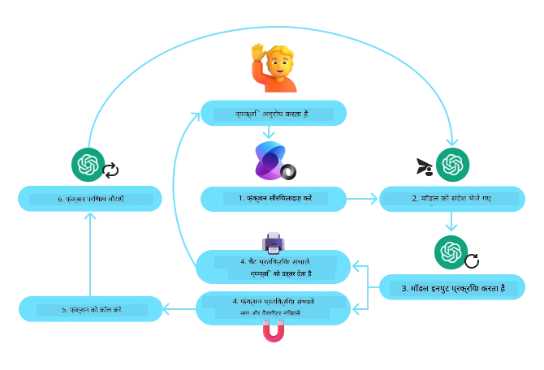
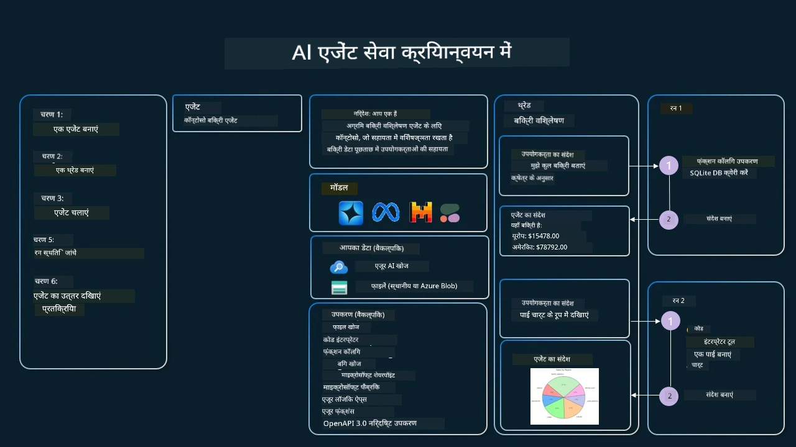

[](https://youtu.be/vieRiPRx-gI?si=cEZ8ApnT6Sus9rhn)

> _(इस पाठ का वीडियो देखने के लिए ऊपर की छवि पर क्लिक करें)_

# टूल उपयोग डिज़ाइन पैटर्न

टूल्स दिलचस्प हैं क्योंकि वे AI एजेंट्स को अधिक व्यापक क्षमताओं की अनुमति देते हैं। एजेंट के पास जो कार्य करने के लिए सीमित क्रियाओं का सेट होता है, उसके बजाय, एक टूल जोड़ने से एजेंट अब एक विस्तृत श्रृंखला के कार्य कर सकता है। इस अध्याय में, हम टूल उपयोग डिज़ाइन पैटर्न को देखेंगे, जो बताता है कि AI एजेंट कैसे विशिष्ट टूल्स का उपयोग करके अपने लक्ष्यों को प्राप्त कर सकते हैं।

## परिचय

इस पाठ में, हम निम्नलिखित प्रश्नों के उत्तर खोजने का प्रयास कर रहे हैं:

- टूल उपयोग डिज़ाइन पैटर्न क्या है?
- किन उपयोग मामलों में इसे लागू किया जा सकता है?
- डिजाइन पैटर्न को लागू करने के लिए आवश्यक तत्व/निर्माण ब्लॉक्स क्या हैं?
- विश्वसनीय AI एजेंट बनाने के लिए टूल उपयोग डिज़ाइन पैटर्न को उपयोग करते समय कौन-कौन से विशेष विचारणीय बातें हैं?

## सीखने के लक्ष्य

इस पाठ को पूरा करने के बाद, आप सक्षम होंगे:

- टूल उपयोग डिज़ाइन पैटर्न और उसके उद्देश्य को परिभाषित करना।
- ऐसे उपयोग मामलों की पहचान करना जहाँ टूल उपयोग डिज़ाइन पैटर्न लागू हो सकता है।
- डिजाइन पैटर्न को लागू करने के लिए आवश्यक मुख्य तत्वों को समझना।
- इस डिज़ाइन पैटर्न का उपयोग करने वाले AI एजेंट्स की विश्वसनीयता सुनिश्चित करने के लिए विचारों को पहचानना।

## टूल उपयोग डिज़ाइन पैटर्न क्या है?

**टूल उपयोग डिज़ाइन पैटर्न** LLMs को बाहरी टूल्स के साथ बातचीत करने की क्षमता देने पर केंद्रित है ताकि विशिष्ट लक्ष्यों को प्राप्त किया जा सके। टूल्स वे कोड होते हैं जिन्हें एजेंट चला सकता है ताकि क्रियाएं की जा सकें। एक टूल एक साधारण फ़ंक्शन हो सकता है जैसे कैलकुलेटर, या किसी तीसरे पक्ष की सेवा जैसे स्टॉक मूल्य खोज या मौसम पूर्वानुमान के लिए API कॉल। AI एजेंट्स के संदर्भ में, टूल्स को एजेंट के द्वारा **मॉडल-जनित फंक्शन कॉल्स** के जवाब में निष्पादित करने के लिए डिज़ाइन किया जाता है।

## इसे किन उपयोग मामलों में लागू किया जा सकता है?

AI एजेंट जटिल कार्यों को पूरा करने, जानकारी प्राप्त करने, या निर्णय लेने के लिए टूल्स का उपयोग कर सकते हैं। टूल उपयोग डिज़ाइन पैटर्न अक्सर ऐसे परिदृश्यों में इस्तेमाल होता है जहाँ बाहरी प्रणालियों जैसे डेटाबेस, वेब सेवाओं, या कोड इंटरप्रेटर्स के साथ गतिशील बातचीत की आवश्यकता होती है। यह कई उपयोग मामलों के लिए उपयोगी है जिनमें शामिल हैं:

- **गतिशील जानकारी प्राप्त करना:** एजेंट बाहरी APIs या डेटाबेस से नवीनतम डेटा प्राप्त कर सकते हैं (जैसे, डेटा विश्लेषण के लिए SQLite डेटाबेस से क्वेरी करना, स्टॉक की कीमतें या मौसम की जानकारी प्राप्त करना)।
- **कोड निष्पादन और व्याख्या:** एजेंट गणितीय समस्याओं को हल करने, रिपोर्ट तैयार करने, या सिमुलेशन करने के लिए कोड या स्क्रिप्ट चला सकते हैं।
- **वर्कफ़्लो स्वचालन:** कार्य अनुसूचक, ईमेल सेवाओं, या डेटा पाइपलाइनों जैसे टूल्स को एकीकृत करके दोहरावदार या बहु-चरण वर्कफ़्लो को स्वचालित करना।
- **ग्राहक सहायता:** एजेंट उपयोगकर्ता प्रश्नों को हल करने के लिए CRM सिस्टम, टिकटिंग प्लेटफ़ॉर्म, या ज्ञान आधार से बातचीत कर सकते हैं।
- **सामग्री निर्माण और संपादन:** एजेंट व्याकरण जांच, पाठ सारांश, या सामग्री सुरक्षा मूल्यांकन जैसे टूल्स का उपयोग करके सामग्री निर्माण कार्यों में सहायता कर सकते हैं।

## टूल उपयोग डिज़ाइन पैटर्न को लागू करने के लिए आवश्यक तत्व/निर्माण ब्लॉक्स क्या हैं?

ये निर्माण ब्लॉक्स AI एजेंट को विभिन्न प्रकार के कार्य करने की अनुमति देते हैं। आइए टूल उपयोग डिज़ाइन पैटर्न को लागू करने के लिए आवश्यक मुख्य तत्वों पर एक नज़र डालते हैं:

- **फ़ंक्शन/टूल स्कीमाज़:** उपलब्ध टूल्स की विस्तृत परिभाषाएं, जिनमें फ़ंक्शन का नाम, उद्देश्य, आवश्यक पैरामीटर, और अपेक्षित आउटपुट शामिल हैं। ये स्कीमाज़ LLM को यह समझने में सक्षम बनाती हैं कि कौन-कौन से टूल उपलब्ध हैं और वैध अनुरोध कैसे बनाएँ।

- **फ़ंक्शन निष्पादन तर्क:** उपयोगकर्ता की इच्छा और वार्तालाप संदर्भ के आधार पर टूल्स कब और कैसे बुलाए जाते हैं, इसका प्रबंधन करता है। इसमें योजनाकार मॉड्यूल, रूटिंग तंत्र, या शर्तीय प्रवाह शामिल हो सकते हैं जो गतिशील रूप से टूल के उपयोग को निर्धारित करते हैं।

- **संदेश प्रबंधन प्रणाली:** उपयोगकर्ता इनपुट, LLM प्रतिक्रियाओं, टूल कॉल, और टूल आउटपुट के बीच संवाद प्रवाह को प्रबंधित करने वाले घटक।

- **टूल एकीकरण फ्रेमवर्क:** एजेंट को विभिन्न टूल्स से जोड़ने वाला आधारभूत संरचना, चाहे वे सरल फ़ंक्शन हों या जटिल बाहरी सेवाएं।

- **त्रुटि प्रबंधन और सत्यापन:** टूल निष्पादन में विफलताओं को संभालने, पैरामीटरों को सत्यापित करने, और अप्रत्याशित प्रतिक्रियाओं को नियंत्रित करने के लिए तंत्र।

- **स्थिति प्रबंधन:** वार्तालाप संदर्भ, पिछले टूल इंटरैक्शन, और लगातार डेटा को ट्रैक करता है ताकि बहु-परिकल्पित इंटरैक्शन में स्थिरता सुनिश्चित की जा सके।

अब, आइए फ़ंक्शन/टूल कॉलिंग को और विस्तार से देखें।

### फ़ंक्शन/टूल कॉलिंग

फ़ंक्शन कॉलिंग LLMs को टूल्स के साथ बातचीत करने का मुख्य तरीका है। आप अक्सर 'फ़ंक्शन' और 'टूल' को परस्पर प्रयुक्त होते देखेंगे क्योंकि 'फ़ंक्शन' (पुन: उपयोग के योग्य कोड ब्लॉक्स) वे 'टूल्स' हैं जिनका उपयोग एजेंट कार्य करने के लिए करते हैं। किसी फ़ंक्शन के कोड को बुलाने के लिए, LLM को उपयोगकर्ता के अनुरोध की तुलना फ़ंक्शन्स के विवरण से करनी होती है। इसके लिए, उपलब्ध सभी फ़ंक्शन के विवरण वाले एक स्कीमा को LLM को भेजा जाता है। LLM कार्य के लिए सबसे उपयुक्त फ़ंक्शन का चयन करता है और उसका नाम तथा तर्क लौटाता है। चयनित फ़ंक्शन निष्पादित किया जाता है, उसका उत्तर LLM को वापस भेजा जाता है, जो उस जानकारी का उपयोग उपयोगकर्ता के अनुरोध का जवाब देने के लिए करता है।

डेवलपर्स के लिए एजेंट्स के लिए फ़ंक्शन कॉलिंग लागू करने के लिए, आपको चाहिए:

1. एक ऐसा LLM मॉडल जो फ़ंक्शन कॉलिंग का समर्थन करता हो
2. फ़ंक्शन विवरण वाला स्कीमा
3. प्रत्येक वर्णित फ़ंक्शन के लिए कोड

इसको समझाने के लिए चलिए एक उदाहरण लेते हैं जिसमें किसी शहर का वर्तमान समय प्राप्त किया जाता है:

1. **ऐसा LLM इनिशियलाइज़ करें जो फ़ंक्शन कॉलिंग का समर्थन करता हो:**

    सभी मॉडल फ़ंक्शन कॉलिंग का समर्थन नहीं करते, इसलिए यह जांचना महत्वपूर्ण है कि आप जो LLM उपयोग कर रहे हैं वह करता है या नहीं। <a href="https://learn.microsoft.com/azure/ai-services/openai/how-to/function-calling" target="_blank">Azure OpenAI</a> फ़ंक्शन कॉलिंग का समर्थन करता है। हम Azure OpenAI क्लाइंट को प्रारंभ करके शुरू कर सकते हैं।

    ```python
    # Azure OpenAI क्लाइंट प्रारंभ करें
    client = AzureOpenAI(
        azure_endpoint = os.getenv("AZURE_AI_PROJECT_ENDPOINT"), 
        api_key=os.getenv("AZURE_OPENAI_API_KEY"),  
        api_version="2024-05-01-preview"
    )
    ```

1. **एक फ़ंक्शन स्कीमा बनाएँ:**

    अगला हम JSON स्कीमा परिभाषित करेंगे जिसमें फ़ंक्शन का नाम, वह क्या करता है इसका विवरण, और फ़ंक्शन पैरामीटर के नाम व विवरण शामिल होंगे।
    फिर हम इस स्कीमा को पहले बनाए गए क्लाइंट को और उपयोगकर्ता के अनुरोध "San Francisco में समय बताएं" के साथ पास करेंगे। महत्वपूर्ण बात यह है कि जो वापसी होती है वह एक **टूल कॉल** होती है, **प्रश्न का अंतिम उत्तर नहीं**। जैसा कि पहले बताया गया था, LLM कार्य के लिए चुने गए फ़ंक्शन का नाम और उसे भेजे जाने वाले तर्क लौटाता है।

    ```python
    # मॉडल के पढ़ने के लिए फ़ंक्शन विवरण
    tools = [
        {
            "type": "function",
            "function": {
                "name": "get_current_time",
                "description": "Get the current time in a given location",
                "parameters": {
                    "type": "object",
                    "properties": {
                        "location": {
                            "type": "string",
                            "description": "The city name, e.g. San Francisco",
                        },
                    },
                    "required": ["location"],
                },
            }
        }
    ]
    ```
   
    ```python
  
    # प्रारंभिक उपयोगकर्ता संदेश
    messages = [{"role": "user", "content": "What's the current time in San Francisco"}] 
  
    # पहला एपीआई कॉल: मॉडल से फ़ंक्शन का उपयोग करने को कहें
      response = client.chat.completions.create(
          model=deployment_name,
          messages=messages,
          tools=tools,
          tool_choice="auto",
      )
  
      # मॉडल की प्रतिक्रिया को प्रक्रिया करें
      response_message = response.choices[0].message
      messages.append(response_message)
  
      print("Model's response:")  

      print(response_message)
  
    ```

    ```bash
    Model's response:
    ChatCompletionMessage(content=None, role='assistant', function_call=None, tool_calls=[ChatCompletionMessageToolCall(id='call_pOsKdUlqvdyttYB67MOj434b', function=Function(arguments='{"location":"San Francisco"}', name='get_current_time'), type='function')])
    ```
  
1. **कार्य को पूरा करने के लिए आवश्यक फ़ंक्शन कोड:**

    अब जब LLM ने चुना कि कौन सा फ़ंक्शन चलाना है, तो उस कार्य को पूरा करने वाला कोड लागू और निष्पादित किया जाना चाहिए।
    हम पाइथन में वर्तमान समय प्राप्त करने का कोड लिख सकते हैं। हमें अंतिम परिणाम पाने के लिए response_message से नाम और तर्क निकालने का कोड भी लिखना होगा।

    ```python
      def get_current_time(location):
        """Get the current time for a given location"""
        print(f"get_current_time called with location: {location}")  
        location_lower = location.lower()
        
        for key, timezone in TIMEZONE_DATA.items():
            if key in location_lower:
                print(f"Timezone found for {key}")  
                current_time = datetime.now(ZoneInfo(timezone)).strftime("%I:%M %p")
                return json.dumps({
                    "location": location,
                    "current_time": current_time
                })
      
        print(f"No timezone data found for {location_lower}")  
        return json.dumps({"location": location, "current_time": "unknown"})
    ```
  
     ```python
     # फ़ंक्शन कॉल को संभालें
      if response_message.tool_calls:
          for tool_call in response_message.tool_calls:
              if tool_call.function.name == "get_current_time":
     
                  function_args = json.loads(tool_call.function.arguments)
     
                  time_response = get_current_time(
                      location=function_args.get("location")
                  )
     
                  messages.append({
                      "tool_call_id": tool_call.id,
                      "role": "tool",
                      "name": "get_current_time",
                      "content": time_response,
                  })
      else:
          print("No tool calls were made by the model.")  
  
      # दूसरा एपीआई कॉल: मॉडल से अंतिम प्रतिक्रिया प्राप्त करें
      final_response = client.chat.completions.create(
          model=deployment_name,
          messages=messages,
      )
  
      return final_response.choices[0].message.content
     ```
  
     ```bash
      get_current_time called with location: San Francisco
      Timezone found for san francisco
      The current time in San Francisco is 09:24 AM.
     ```
  
फ़ंक्शन कॉलिंग अधिकांश एजेंट टूल उपयोग डिज़ाइन का मूल है, हालांकि इसे शुरू से लागू करना कभी-कभी चुनौतीपूर्ण हो सकता है।
जैसा कि हमने [Lesson 2](../../../02-explore-agentic-frameworks) में सीखा, एजेंटिक फ्रेमवर्क हमें पहले से निर्मित निर्माण ब्लॉक्स प्रदान करते हैं टूल उपयोग को लागू करने के लिए।

## एजेंटिक फ्रेमवर्क के साथ टूल उपयोग उदाहरण

यहाँ विभिन्न एजेंटिक फ्रेमवर्क का उपयोग करके टूल उपयोग डिज़ाइन पैटर्न को लागू करने के कुछ उदाहरण हैं:

### माइक्रोसॉफ्ट एजेंट फ्रेमवर्क

<a href="https://learn.microsoft.com/azure/ai-services/agents/overview" target="_blank">Microsoft Agent Framework</a> AI एजेंट्स बनाने के लिए एक ओपन-सोर्स AI फ्रेमवर्क है। यह फ़ंक्शन कॉलिंग का उपयोग सरल बनाता है, जिससे आप टूल्स को Python फंक्शन्स के रूप में `@tool` डेकोरेटर के साथ परिभाषित कर सकते हैं। यह फ्रेमवर्क मॉडल और आपके कोड के बीच द्विपक्षीय संचार को संभालता है। यह पूर्वनिर्मित टूल्स जैसे फ़ाइल खोज और कोड इंटरप्रेटर तक भी पहुंच प्रदान करता है, जो `AzureAIProjectAgentProvider` के माध्यम से उपलब्ध हैं।

निम्न चित्र माइक्रोसॉफ्ट एजेंट फ्रेमवर्क के साथ फ़ंक्शन कॉलिंग की प्रक्रिया को दर्शाता है:



Microsoft Agent Framework में, टूल्स को डेकोरेटेड फ़ंक्शन्स के रूप में परिभाषित किया जाता है। हम पहले देखे गए `get_current_time` फ़ंक्शन को `@tool` डेकोरेटर का उपयोग करके एक टूल में परिवर्तित कर सकते हैं। फ्रेमवर्क स्वचालित रूप से फ़ंक्शन और उसके पैरामीटरों को सीरियलाइज़ करेगा, जिससे LLM को भेजने के लिए स्कीमा तैयार होगा।

```python
from agent_framework import tool
from agent_framework.azure import AzureAIProjectAgentProvider
from azure.identity import AzureCliCredential

@tool
def get_current_time(location: str) -> str:
    """Get the current time for a given location"""
    ...

# क्लाइंट बनाएँ
provider = AzureAIProjectAgentProvider(credential=AzureCliCredential())

# एक एजेंट बनाएँ और टूल के साथ चलाएँ
agent = await provider.create_agent(name="TimeAgent", instructions="Use available tools to answer questions.", tools=get_current_time)
response = await agent.run("What time is it?")
```
  
### Azure AI एजेंट सेवा

<a href="https://learn.microsoft.com/azure/ai-services/agents/overview" target="_blank">Azure AI Agent Service</a> एक नया एजेंटिक फ्रेमवर्क है जिसे डेवलपर्स को उच्च गुणवत्ता वाले, सुरक्षित, और विस्तार योग्य AI एजेंट्स को बिना अंतर्निहित कंप्यूट और स्टोरेज प्रबंधित किए सुरक्षा के साथ बनाने, तैनात करने, और स्केल करने के लिए डिज़ाइन किया गया है। यह खासकर उद्यम अनुप्रयोगों के लिए उपयोगी है क्योंकि यह पूर्ण रूप से प्रबंधित सेवा है जिसमें उद्यम स्तरीय सुरक्षा है।

LLM API के सीधे विकास की तुलना में, Azure AI Agent Service कुछ लाभ प्रदान करता है, जिनमें शामिल हैं:

- स्वचालित टूल कॉलिंग – टूल कॉल पार्स करने, टूल को कॉल करने, और जवाब संभालने की ज़रूरत नहीं; यह सब अब सर्वर-साइड होता है
- सुरक्षित रूप से प्रबंधित डेटा – अपनी स्वयं की बातचीत स्थिति प्रबंधित करने के बजाय, आप थ्रेड्स पर भरोसा कर सकते हैं जो एक विशिष्ट वार्तालाप के संदेश इतिहास को ट्रैक करता है
- तैयार-टूल्स – टूल्स जिनका उपयोग आप अपने डेटा स्रोतों के साथ बातचीत करने के लिए कर सकते हैं, जैसे Bing, Azure AI Search, और Azure Functions।

Azure AI Agent Service में उपलब्ध टूल्स दो श्रेणियों में विभाजित हैं:

1. ज्ञान टूल्स:
    - <a href="https://learn.microsoft.com/azure/ai-services/agents/how-to/tools/bing-grounding?tabs=python&pivots=overview" target="_blank">Bing Search के साथ ग्राउंडिंग</a>
    - <a href="https://learn.microsoft.com/azure/ai-services/agents/how-to/tools/file-search?tabs=python&pivots=overview" target="_blank">फ़ाइल खोज</a>
    - <a href="https://learn.microsoft.com/azure/ai-services/agents/how-to/tools/azure-ai-search?tabs=azurecli%2Cpython&pivots=overview-azure-ai-search" target="_blank">Azure AI Search</a>

2. क्रिया टूल्स:
    - <a href="https://learn.microsoft.com/azure/ai-services/agents/how-to/tools/function-calling?tabs=python&pivots=overview" target="_blank">फ़ंक्शन कॉलिंग</a>
    - <a href="https://learn.microsoft.com/azure/ai-services/agents/how-to/tools/code-interpreter?tabs=python&pivots=overview" target="_blank">कोड इंटरप्रेटर</a>
    - <a href="https://learn.microsoft.com/azure/ai-services/agents/how-to/tools/openapi-spec?tabs=python&pivots=overview" target="_blank">OpenAPI परिभाषित टूल्स</a>
    - <a href="https://learn.microsoft.com/azure/ai-services/agents/how-to/tools/azure-functions?pivots=overview" target="_blank">Azure Functions</a>

एजेंट सेवा हमें इन टूल्स को `toolset` के रूप में उपयोग करने की अनुमति देती है। यह `threads` का भी उपयोग करती है जो किसी विशिष्ट वार्तालाप के संदेश इतिहास को ट्रैक करते हैं।

कल्पना करें कि आप Contoso नाम की कंपनी में एक सेल्स एजेंट हैं। आप एक संवादात्मक एजेंट विकसित करना चाहते हैं जो आपके सेल्स डेटा से जुड़े प्रश्नों का उत्तर दे सके।

निम्न चित्र यह दर्शाता है कि आप Azure AI Agent Service का उपयोग करके अपने सेल्स डेटा का विश्लेषण कैसे कर सकते हैं:



सेवा के साथ इन टूल्स का उपयोग करने के लिए, हम एक क्लाइंट बना सकते हैं और एक टूल या टूलसेट परिभाषित कर सकते हैं। व्यावहारिक रूप से इसे लागू करने के लिए हम निम्नलिखित पाइथन कोड उपयोग कर सकते हैं। LLM टूलसेट को देख पाएगा और उपयोगकर्ता अनुरोध के आधार पर उपयोगकर्ता द्वारा बनाए गए फ़ंक्शन `fetch_sales_data_using_sqlite_query` या पूर्वनिर्मित कोड इंटरप्रेटर में से किसी का उपयोग करने का निर्णय लेगा।

```python 
import os
from azure.ai.projects import AIProjectClient
from azure.identity import DefaultAzureCredential
from fetch_sales_data_functions import fetch_sales_data_using_sqlite_query # fetch_sales_data_using_sqlite_query फ़ंक्शन जिसे fetch_sales_data_functions.py फ़ाइल में पाया जा सकता है।
from azure.ai.projects.models import ToolSet, FunctionTool, CodeInterpreterTool

project_client = AIProjectClient.from_connection_string(
    credential=DefaultAzureCredential(),
    conn_str=os.environ["PROJECT_CONNECTION_STRING"],
)

# टूलसेट आरंभ करें
toolset = ToolSet()

# fetch_sales_data_using_sqlite_query फ़ंक्शन के साथ फ़ंक्शन कॉलिंग एजेंट को आरंभ करें और इसे टूलसेट में जोड़ें
fetch_data_function = FunctionTool(fetch_sales_data_using_sqlite_query)
toolset.add(fetch_data_function)

# कोड इंटरप्रेटर टूल को आरंभ करें और इसे टूलसेट में जोड़ें।
code_interpreter = code_interpreter = CodeInterpreterTool()
toolset.add(code_interpreter)

agent = project_client.agents.create_agent(
    model="gpt-4o-mini", name="my-agent", instructions="You are helpful agent", 
    toolset=toolset
)
```

## विश्वसनीय AI एजेंट बनाने के लिए टूल उपयोग डिज़ाइन पैटर्न का उपयोग करते समय विशेष विचारणीय बातें क्या हैं?

LLMs द्वारा गतिशील रूप से उत्पन्न SQL के साथ एक सामान्य चिंता सुरक्षा की होती है, विशेष रूप से SQL इंजेक्शन या दुर्भावनापूर्ण क्रियाओं का जोखिम, जैसे डेटाबेस को ड्रॉप करना या छेड़छाड़ करना। जबकि ये चिंताएं वैध हैं, इन्हें प्रभावी ढंग से परहेज किया जा सकता है उचित डेटाबेस पहुँच अनुमतियाँ सेट करके। अधिकांश डेटाबेस के लिए इसका मतलब है कि डेटाबेस को केवल-पढ़ने योग्य (read-only) के रूप में कॉन्फ़िगर करना। PostgreSQL या Azure SQL जैसी डेटाबेस सेवाओं के लिए, ऐप को केवल-पढ़ने (SELECT) भूमिका सौंपनी चाहिए।

ऐप को सुरक्षित वातावरण में चलाना सुरक्षा को और बढ़ाता है। उद्यम परिदृश्यों में, डेटा आमतौर पर परिचालन प्रणालियों से एक पढ़ने योग्य डेटाबेस या डेटा वेयरहाउस में निकाला और रूपांतरित किया जाता है जिसमें उपयोगकर्ता के अनुकूल स्कीमा होता है। इस दृष्टिकोण से, डेटा सुरक्षित रहता है, प्रदर्शन और पहुंच के लिए अनुकूलित रहता है, और ऐप की पहुँच प्रतिबंधित, केवल-पढ़ने योग्य होती है।

## नमूना कोड

- Python: [Agent Framework](./code_samples/04-python-agent-framework.ipynb)
- .NET: [Agent Framework](./code_samples/04-dotnet-agent-framework.md)

## टूल उपयोग डिज़ाइन पैटर्न के बारे में और प्रश्न हैं?

[Microsoft Foundry Discord](https://aka.ms/ai-agents/discord) में जुड़ें, अन्य शिक्षार्थियों से मिलें, ऑफिस आवर्स में भाग लें, और अपने AI एजेंट्स से जुड़ी प्रश्नों के उत्तर प्राप्त करें।

## अतिरिक्त संसाधन

- <a href="https://microsoft.github.io/build-your-first-agent-with-azure-ai-agent-service-workshop/" target="_blank">Azure AI Agents Service कार्यशाला</a>
- <a href="https://github.com/Azure-Samples/contoso-creative-writer/tree/main/docs/workshop" target="_blank">Contoso Creative Writer Multi-Agent कार्यशाला</a>
- <a href="https://learn.microsoft.com/azure/ai-services/agents/overview" target="_blank">Microsoft Agent Framework अवलोकन</a>

## पिछला पाठ

[एजेंटिक डिज़ाइन पैटर्न को समझना](../03-agentic-design-patterns/README.md)

## अगला पाठ
[Agentic RAG](../05-agentic-rag/README.md)

---

<!-- CO-OP TRANSLATOR DISCLAIMER START -->
**अस्वीकरण**:
इस दस्तावेज़ का अनुवाद AI अनुवाद सेवा [Co-op Translator](https://github.com/Azure/co-op-translator) का उपयोग करके किया गया है। यद्यपि हम सटीकता के लिए प्रयासरत हैं, कृपया ध्यान दें कि स्वचालित अनुवादों में त्रुटियाँ या अशुद्धियाँ हो सकती हैं। मूल दस्तावेज़ अपनी मूल भाषा में प्रामाणिक स्रोत माना जाना चाहिए। महत्वपूर्ण जानकारी के लिए, पेशेवर मानव अनुवाद की सलाह दी जाती है। इस अनुवाद के उपयोग से उत्पन्न किसी भी गलतफहमी या गलत व्याख्या के लिए हम उत्तरदायी नहीं हैं।
<!-- CO-OP TRANSLATOR DISCLAIMER END -->