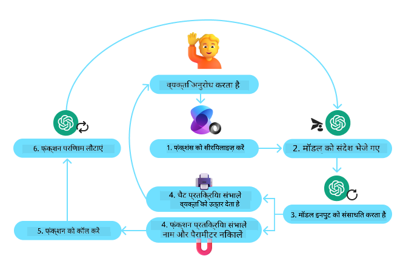
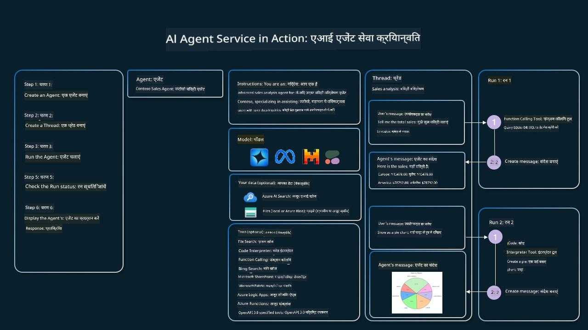

<!--
CO_OP_TRANSLATOR_METADATA:
{
  "original_hash": "e056335d729ba6e49571db7a6533825d",
  "translation_date": "2025-09-30T06:38:49+00:00",
  "source_file": "04-tool-use/README.md",
  "language_code": "hi"
}
-->
[](https://youtu.be/vieRiPRx-gI?si=cEZ8ApnT6Sus9rhn)

> _(ऊपर दी गई छवि पर क्लिक करें इस पाठ का वीडियो देखने के लिए)_

# टूल उपयोग डिज़ाइन पैटर्न

टूल्स दिलचस्प होते हैं क्योंकि वे AI एजेंट्स को अधिक व्यापक क्षमताएं प्रदान करते हैं। एजेंट के पास सीमित क्रियाओं का सेट होने के बजाय, टूल जोड़ने से एजेंट अब कई प्रकार की क्रियाएं कर सकता है। इस अध्याय में, हम टूल उपयोग डिज़ाइन पैटर्न पर चर्चा करेंगे, जो बताता है कि AI एजेंट्स कैसे विशिष्ट टूल्स का उपयोग करके अपने लक्ष्यों को प्राप्त कर सकते हैं।

## परिचय

इस पाठ में, हम निम्नलिखित प्रश्नों के उत्तर खोजने का प्रयास करेंगे:

- टूल उपयोग डिज़ाइन पैटर्न क्या है?
- इसे किन उपयोग मामलों में लागू किया जा सकता है?
- डिज़ाइन पैटर्न को लागू करने के लिए आवश्यक तत्व/निर्माण खंड क्या हैं?
- भरोसेमंद AI एजेंट्स बनाने के लिए टूल उपयोग डिज़ाइन पैटर्न का उपयोग करने के लिए विशेष विचार क्या हैं?

## सीखने के लक्ष्य

इस पाठ को पूरा करने के बाद, आप सक्षम होंगे:

- टूल उपयोग डिज़ाइन पैटर्न और इसका उद्देश्य परिभाषित करना।
- उन उपयोग मामलों की पहचान करना जहां टूल उपयोग डिज़ाइन पैटर्न लागू हो सकता है।
- डिज़ाइन पैटर्न को लागू करने के लिए आवश्यक प्रमुख तत्वों को समझना।
- इस डिज़ाइन पैटर्न का उपयोग करने वाले AI एजेंट्स में भरोसेमंदता सुनिश्चित करने के लिए विचारों को पहचानना।

## टूल उपयोग डिज़ाइन पैटर्न क्या है?

**टूल उपयोग डिज़ाइन पैटर्न** LLMs को बाहरी टूल्स के साथ इंटरैक्ट करने की क्षमता प्रदान करने पर केंद्रित है ताकि वे विशिष्ट लक्ष्यों को प्राप्त कर सकें। टूल्स कोड होते हैं जिन्हें एजेंट द्वारा क्रियान्वित किया जा सकता है। एक टूल एक साधारण फ़ंक्शन हो सकता है जैसे कि कैलकुलेटर, या किसी तृतीय-पक्ष सेवा जैसे स्टॉक मूल्य खोज या मौसम पूर्वानुमान के लिए API कॉल। AI एजेंट्स के संदर्भ में, टूल्स को **मॉडल-जनित फ़ंक्शन कॉल्स** के जवाब में एजेंट्स द्वारा क्रियान्वित करने के लिए डिज़ाइन किया गया है।

## इसे किन उपयोग मामलों में लागू किया जा सकता है?

AI एजेंट्स टूल्स का उपयोग करके जटिल कार्यों को पूरा कर सकते हैं, जानकारी प्राप्त कर सकते हैं, या निर्णय ले सकते हैं। टूल उपयोग डिज़ाइन पैटर्न अक्सर बाहरी सिस्टम जैसे डेटाबेस, वेब सेवाओं, या कोड इंटरप्रेटर्स के साथ गतिशील इंटरैक्शन की आवश्यकता वाले परिदृश्यों में उपयोग किया जाता है। यह क्षमता कई उपयोग मामलों के लिए उपयोगी है, जिनमें शामिल हैं:

- **गतिशील जानकारी प्राप्त करना:** एजेंट्स बाहरी APIs या डेटाबेस को क्वेरी कर सकते हैं ताकि अद्यतन डेटा प्राप्त किया जा सके (जैसे SQLite डेटाबेस को डेटा विश्लेषण के लिए क्वेरी करना, स्टॉक मूल्य या मौसम जानकारी प्राप्त करना)।
- **कोड निष्पादन और व्याख्या:** एजेंट्स गणितीय समस्याओं को हल करने, रिपोर्ट बनाने, या सिमुलेशन करने के लिए कोड या स्क्रिप्ट निष्पादित कर सकते हैं।
- **कार्यप्रवाह स्वचालन:** कार्य शेड्यूलर, ईमेल सेवाओं, या डेटा पाइपलाइनों जैसे टूल्स को एकीकृत करके दोहराव या बहु-चरण कार्यप्रवाह को स्वचालित करना।
- **ग्राहक सहायता:** एजेंट्स CRM सिस्टम, टिकटिंग प्लेटफॉर्म, या नॉलेज बेस के साथ इंटरैक्ट कर सकते हैं ताकि उपयोगकर्ता प्रश्नों को हल किया जा सके।
- **सामग्री निर्माण और संपादन:** एजेंट्स व्याकरण जांचकर्ता, टेक्स्ट सारांशकर्ता, या सामग्री सुरक्षा मूल्यांकनकर्ता जैसे टूल्स का उपयोग करके सामग्री निर्माण कार्यों में सहायता कर सकते हैं।

## टूल उपयोग डिज़ाइन पैटर्न को लागू करने के लिए आवश्यक तत्व/निर्माण खंड क्या हैं?

ये निर्माण खंड AI एजेंट्स को कई प्रकार के कार्य करने की अनुमति देते हैं। आइए टूल उपयोग डिज़ाइन पैटर्न को लागू करने के लिए आवश्यक प्रमुख तत्वों पर नज़र डालें:

- **फ़ंक्शन/टूल स्कीमास:** उपलब्ध टूल्स की विस्तृत परिभाषाएं, जिनमें फ़ंक्शन का नाम, उद्देश्य, आवश्यक पैरामीटर, और अपेक्षित आउटपुट शामिल हैं। ये स्कीमास LLM को यह समझने में सक्षम बनाते हैं कि कौन से टूल्स उपलब्ध हैं और वैध अनुरोध कैसे बनाए जाएं।

- **फ़ंक्शन निष्पादन लॉजिक:** यह नियंत्रित करता है कि उपयोगकर्ता के इरादे और बातचीत के संदर्भ के आधार पर टूल्स को कैसे और कब बुलाया जाए। इसमें प्लानर मॉड्यूल, रूटिंग तंत्र, या कंडीशनल फ्लो शामिल हो सकते हैं जो टूल उपयोग को गतिशील रूप से निर्धारित करते हैं।

- **मैसेज हैंडलिंग सिस्टम:** घटक जो उपयोगकर्ता इनपुट, LLM प्रतिक्रियाओं, टूल कॉल्स, और टूल आउटपुट के बीच बातचीत प्रवाह को प्रबंधित करते हैं।

- **टूल इंटीग्रेशन फ्रेमवर्क:** ऐसा इंफ्रास्ट्रक्चर जो एजेंट को विभिन्न टूल्स से जोड़ता है, चाहे वे साधारण फ़ंक्शन हों या जटिल बाहरी सेवाएं।

- **एरर हैंडलिंग और वैलिडेशन:** टूल निष्पादन में विफलताओं को संभालने, पैरामीटर को मान्य करने, और अप्रत्याशित प्रतिक्रियाओं को प्रबंधित करने के तंत्र।

- **स्टेट मैनेजमेंट:** बातचीत के संदर्भ, पिछले टूल इंटरैक्शन, और स्थायी डेटा को ट्रैक करता है ताकि बहु-टर्न इंटरैक्शन में स्थिरता सुनिश्चित की जा सके।

अब, आइए फ़ंक्शन/टूल कॉलिंग को अधिक विस्तार से देखें।

### फ़ंक्शन/टूल कॉलिंग

फ़ंक्शन कॉलिंग वह प्राथमिक तरीका है जिससे हम बड़े भाषा मॉडल्स (LLMs) को टूल्स के साथ इंटरैक्ट करने में सक्षम बनाते हैं। आप अक्सर 'फ़ंक्शन' और 'टूल' को एक-दूसरे के स्थान पर उपयोग होते हुए देखेंगे क्योंकि 'फ़ंक्शन्स' (पुन: उपयोग योग्य कोड के ब्लॉक) वे 'टूल्स' हैं जिनका उपयोग एजेंट्स कार्यों को पूरा करने के लिए करते हैं। किसी फ़ंक्शन के कोड को क्रियान्वित करने के लिए, LLM को उपयोगकर्ता के अनुरोध की तुलना फ़ंक्शन के विवरण से करनी होती है। ऐसा करने के लिए, सभी उपलब्ध फ़ंक्शन्स के विवरणों वाली एक स्कीमा LLM को भेजी जाती है। LLM फिर कार्य के लिए सबसे उपयुक्त फ़ंक्शन का चयन करता है और उसका नाम और तर्क वापस करता है। चयनित फ़ंक्शन को क्रियान्वित किया जाता है, उसकी प्रतिक्रिया LLM को वापस भेजी जाती है, जो उपयोगकर्ता के अनुरोध का उत्तर देने के लिए जानकारी का उपयोग करता है।

एजेंट्स के लिए फ़ंक्शन कॉलिंग को लागू करने के लिए डेवलपर्स को आवश्यकता होगी:

1. एक LLM मॉडल जो फ़ंक्शन कॉलिंग का समर्थन करता हो
2. फ़ंक्शन विवरणों वाली एक स्कीमा
3. प्रत्येक वर्णित फ़ंक्शन के लिए कोड

आइए एक उदाहरण का उपयोग करें जिसमें किसी शहर में वर्तमान समय प्राप्त करना शामिल है:

1. **एक LLM प्रारंभ करें जो फ़ंक्शन कॉलिंग का समर्थन करता हो:**

    सभी मॉडल्स फ़ंक्शन कॉलिंग का समर्थन नहीं करते हैं, इसलिए यह सुनिश्चित करना महत्वपूर्ण है कि आप जिस LLM का उपयोग कर रहे हैं वह करता है। <a href="https://learn.microsoft.com/azure/ai-services/openai/how-to/function-calling" target="_blank">Azure OpenAI</a> फ़ंक्शन कॉलिंग का समर्थन करता है। हम Azure OpenAI क्लाइंट को प्रारंभ करके शुरुआत कर सकते हैं।

    ```python
    # Initialize the Azure OpenAI client
    client = AzureOpenAI(
        azure_endpoint = os.getenv("AZURE_OPENAI_ENDPOINT"), 
        api_key=os.getenv("AZURE_OPENAI_API_KEY"),  
        api_version="2024-05-01-preview"
    )
    ```

1. **एक फ़ंक्शन स्कीमा बनाएं:**

    इसके बाद हम एक JSON स्कीमा को परिभाषित करेंगे जिसमें फ़ंक्शन का नाम, फ़ंक्शन क्या करता है इसका विवरण, और फ़ंक्शन पैरामीटर के नाम और विवरण शामिल होंगे। हम इस स्कीमा को पहले बनाए गए क्लाइंट को पास करेंगे, साथ ही उपयोगकर्ता के अनुरोध को भी जो सैन फ्रांसिस्को में समय खोजने के लिए है। महत्वपूर्ण बात यह है कि एक **टूल कॉल** वह है जो वापस आता है, **अंतिम उत्तर नहीं**। जैसा कि पहले उल्लेख किया गया था, LLM कार्य के लिए चुने गए फ़ंक्शन का नाम और उसे पास किए जाने वाले तर्क वापस करता है।

    ```python
    # Function description for the model to read
    tools = [
        {
            "type": "function",
            "function": {
                "name": "get_current_time",
                "description": "Get the current time in a given location",
                "parameters": {
                    "type": "object",
                    "properties": {
                        "location": {
                            "type": "string",
                            "description": "The city name, e.g. San Francisco",
                        },
                    },
                    "required": ["location"],
                },
            }
        }
    ]
    ```
   
    ```python
  
    # Initial user message
    messages = [{"role": "user", "content": "What's the current time in San Francisco"}] 
  
    # First API call: Ask the model to use the function
      response = client.chat.completions.create(
          model=deployment_name,
          messages=messages,
          tools=tools,
          tool_choice="auto",
      )
  
      # Process the model's response
      response_message = response.choices[0].message
      messages.append(response_message)
  
      print("Model's response:")  

      print(response_message)
  
    ```

    ```bash
    Model's response:
    ChatCompletionMessage(content=None, role='assistant', function_call=None, tool_calls=[ChatCompletionMessageToolCall(id='call_pOsKdUlqvdyttYB67MOj434b', function=Function(arguments='{"location":"San Francisco"}', name='get_current_time'), type='function')])
    ```
  
1. **कार्य को पूरा करने के लिए आवश्यक फ़ंक्शन कोड:**

    अब जब LLM ने चुना है कि कौन सा फ़ंक्शन चलाना है, कार्य को पूरा करने के लिए कोड को लागू और क्रियान्वित करने की आवश्यकता है। 
    हम वर्तमान समय प्राप्त करने के लिए Python में कोड लागू कर सकते हैं। हमें response_message से नाम और तर्क निकालने के लिए कोड भी लिखना होगा ताकि अंतिम परिणाम प्राप्त हो सके।

    ```python
      def get_current_time(location):
        """Get the current time for a given location"""
        print(f"get_current_time called with location: {location}")  
        location_lower = location.lower()
        
        for key, timezone in TIMEZONE_DATA.items():
            if key in location_lower:
                print(f"Timezone found for {key}")  
                current_time = datetime.now(ZoneInfo(timezone)).strftime("%I:%M %p")
                return json.dumps({
                    "location": location,
                    "current_time": current_time
                })
      
        print(f"No timezone data found for {location_lower}")  
        return json.dumps({"location": location, "current_time": "unknown"})
    ```

     ```python
     # Handle function calls
      if response_message.tool_calls:
          for tool_call in response_message.tool_calls:
              if tool_call.function.name == "get_current_time":
     
                  function_args = json.loads(tool_call.function.arguments)
     
                  time_response = get_current_time(
                      location=function_args.get("location")
                  )
     
                  messages.append({
                      "tool_call_id": tool_call.id,
                      "role": "tool",
                      "name": "get_current_time",
                      "content": time_response,
                  })
      else:
          print("No tool calls were made by the model.")  
  
      # Second API call: Get the final response from the model
      final_response = client.chat.completions.create(
          model=deployment_name,
          messages=messages,
      )
  
      return final_response.choices[0].message.content
     ```

     ```bash
      get_current_time called with location: San Francisco
      Timezone found for san francisco
      The current time in San Francisco is 09:24 AM.
     ```

फ़ंक्शन कॉलिंग अधिकांश, यदि सभी नहीं, एजेंट टूल उपयोग डिज़ाइन का केंद्र है, हालांकि इसे शुरू से लागू करना कभी-कभी चुनौतीपूर्ण हो सकता है। जैसा कि हमने [पाठ 2](../../../02-explore-agentic-frameworks) में सीखा, एजेंटिक फ्रेमवर्क हमें टूल उपयोग को लागू करने के लिए पूर्व-निर्मित निर्माण खंड प्रदान करते हैं।

## एजेंटिक फ्रेमवर्क्स के साथ टूल उपयोग के उदाहरण

यहां कुछ उदाहरण दिए गए हैं कि आप विभिन्न एजेंटिक फ्रेमवर्क्स का उपयोग करके टूल उपयोग डिज़ाइन पैटर्न को कैसे लागू कर सकते हैं:

### सेमांटिक कर्नेल

<a href="https://learn.microsoft.com/azure/ai-services/agents/overview" target="_blank">सेमांटिक कर्नेल</a> .NET, Python, और Java डेवलपर्स के लिए एक ओपन-सोर्स AI फ्रेमवर्क है जो बड़े भाषा मॉडल्स (LLMs) के साथ काम कर रहे हैं। यह फ़ंक्शन कॉलिंग का उपयोग करने की प्रक्रिया को सरल बनाता है, आपके फ़ंक्शन्स और उनके पैरामीटर को मॉडल के लिए स्वचालित रूप से वर्णित करके, जिसे <a href="https://learn.microsoft.com/semantic-kernel/concepts/ai-services/chat-completion/function-calling/?pivots=programming-language-python#1-serializing-the-functions" target="_blank">सिरीयलाइज़िंग</a> कहा जाता है। यह मॉडल और आपके कोड के बीच आगे-पीछे संचार को भी संभालता है। सेमांटिक कर्नेल जैसे एजेंटिक फ्रेमवर्क का उपयोग करने का एक और लाभ यह है कि यह आपको <a href="https://github.com/microsoft/semantic-kernel/blob/main/python/samples/getting_started_with_agents/openai_assistant/step4_assistant_tool_file_search.py" target="_blank">फ़ाइल खोज</a> और <a href="https://github.com/microsoft/semantic-kernel/blob/main/python/samples/getting_started_with_agents/openai_assistant/step3_assistant_tool_code_interpreter.py" target="_blank">कोड इंटरप्रेटर</a> जैसे पूर्व-निर्मित टूल्स तक पहुंचने की अनुमति देता है।

निम्नलिखित आरेख सेमांटिक कर्नेल के साथ फ़ंक्शन कॉलिंग की प्रक्रिया को दर्शाता है:



सेमांटिक कर्नेल में फ़ंक्शन्स/टूल्स को <a href="https://learn.microsoft.com/semantic-kernel/concepts/plugins/?pivots=programming-language-python" target="_blank">प्लगइन्स</a> कहा जाता है। हम पहले देखे गए `get_current_time` फ़ंक्शन को एक प्लगइन में बदल सकते हैं, इसे एक क्लास में बदलकर जिसमें फ़ंक्शन हो। हम `kernel_function` डेकोरेटर को भी आयात कर सकते हैं, जो फ़ंक्शन के विवरण को लेता है। जब आप फिर GetCurrentTimePlugin के साथ एक कर्नेल बनाते हैं, तो कर्नेल फ़ंक्शन और उसके पैरामीटर को स्वचालित रूप से सिरीयलाइज़ करेगा, प्रक्रिया में LLM को भेजने के लिए स्कीमा बनाएगा।

```python
from semantic_kernel.functions import kernel_function

class GetCurrentTimePlugin:
    async def __init__(self, location):
        self.location = location

    @kernel_function(
        description="Get the current time for a given location"
    )
    def get_current_time(location: str = ""):
        ...

```

```python 
from semantic_kernel import Kernel

# Create the kernel
kernel = Kernel()

# Create the plugin
get_current_time_plugin = GetCurrentTimePlugin(location)

# Add the plugin to the kernel
kernel.add_plugin(get_current_time_plugin)
```
  
### Azure AI एजेंट सेवा

<a href="https://learn.microsoft.com/azure/ai-services/agents/overview" target="_blank">Azure AI एजेंट सेवा</a> एक नया एजेंटिक फ्रेमवर्क है जिसे डेवलपर्स को उच्च गुणवत्ता वाले, और विस्तार योग्य AI एजेंट्स को सुरक्षित रूप से बनाने, तैनात करने, और स्केल करने के लिए डिज़ाइन किया गया है, बिना अंतर्निहित कंप्यूट और स्टोरेज संसाधनों को प्रबंधित करने की आवश्यकता के। यह विशेष रूप से एंटरप्राइज़ अनुप्रयोगों के लिए उपयोगी है क्योंकि यह एक पूरी तरह से प्रबंधित सेवा है जिसमें एंटरप्राइज़ ग्रेड सुरक्षा है।

LLM API के साथ सीधे विकसित करने की तुलना में, Azure AI एजेंट सेवा कुछ फायदे प्रदान करती है, जिनमें शामिल हैं:

- स्वचालित टूल कॉलिंग – टूल कॉल को पार्स करने, टूल को बुलाने, और प्रतिक्रिया को संभालने की आवश्यकता नहीं है; यह सब अब सर्वर-साइड किया जाता है।
- सुरक्षित रूप से प्रबंधित डेटा – अपनी बातचीत की स्थिति को प्रबंधित करने के बजाय, आप थ्रेड्स पर भरोसा कर सकते हैं जो आपको आवश्यक सभी जानकारी संग्रहीत करते हैं।
- आउट-ऑफ-द-बॉक्स टूल्स – टूल्स जिनका उपयोग आप अपने डेटा स्रोतों के साथ इंटरैक्ट करने के लिए कर सकते हैं, जैसे Bing, Azure AI Search, और Azure Functions।

Azure AI एजेंट सेवा में उपलब्ध टूल्स को दो श्रेणियों में विभाजित किया जा सकता है:

1. ज्ञान टूल्स:
    - <a href="https://learn.microsoft.com/azure/ai-services/agents/how-to/tools/bing-grounding?tabs=python&pivots=overview" target="_blank">Bing Search के साथ ग्राउंडिंग</a>
    - <a href="https://learn.microsoft.com/azure/ai-services/agents/how-to/tools/file-search?tabs=python&pivots=overview" target="_blank">फ़ाइल खोज</a>
    - <a href="https://learn.microsoft.com/azure/ai-services/agents/how-to/tools/azure-ai-search?tabs=azurecli%2Cpython&pivots=overview-azure-ai-search" target="_blank">Azure AI Search</a>

2. क्रिया टूल्स:
    - <a href="https://learn.microsoft.com/azure/ai-services/agents/how-to/tools/function-calling?tabs=python&pivots=overview" target="_blank">फ़ंक्शन कॉलिंग</a>
    - <a href="https://learn.microsoft.com/azure/ai-services/agents/how-to/tools/code-interpreter?tabs=python&pivots=overview" target="_blank">कोड इंटरप्रेटर</a>
    - <a href="https://learn.microsoft.com/azure/ai-services/agents/how-to/tools/openapi-spec?tabs=python&pivots=overview" target="_blank">OpenAPI परिभाषित टूल्स</a>
    - <a href="https://learn.microsoft.com/azure/ai-services/agents/how-to/tools/azure-functions?pivots=overview" target="_blank">Azure Functions</a>

एजेंट सेवा हमें इन टूल्स को एक `टूलसेट` के रूप में उपयोग करने की अनुमति देती है। यह `थ्रेड्स` का भी उपयोग करती है जो किसी विशेष बातचीत से संदेशों के इतिहास को ट्रैक करती है।

कल्पना करें कि आप Contoso नामक कंपनी में एक सेल्स एजेंट हैं। आप एक संवादात्मक एजेंट विकसित करना चाहते हैं जो आपकी सेल्स डेटा के बारे में प्रश्नों का उत्तर दे सके।

निम्नलिखित छवि दर्शाती है कि आप Azure AI एजेंट सेवा का उपयोग करके अपनी सेल्स डेटा का विश्लेषण कैसे कर सकते हैं:



इन टूल्स का उपयोग सेवा के साथ करने के लिए हम एक क्लाइंट बना सकते हैं और एक टूल या टूलसेट को परिभाषित कर सकते हैं। इसे व्यावहारिक रूप से लागू करने के लिए हम निम्नलिखित Python कोड का उपयोग कर सकते हैं। LLM टूलसेट को देख सकेगा और उपयोगकर्ता द्वारा बनाए गए फ़ंक्शन `fetch_sales_data_using_sqlite_query` या पूर्व-निर्मित कोड इंटरप्रेटर का उपयोग कर सकेगा, उपयोगकर्ता के अनुरोध के आधार पर।

```python 
import os
from azure.ai.projects import AIProjectClient
from azure.identity import DefaultAzureCredential
from fetch_sales_data_functions import fetch_sales_data_using_sqlite_query # fetch_sales_data_using_sqlite_query function which can be found in a fetch_sales_data_functions.py file.
from azure.ai.projects.models import ToolSet, FunctionTool, CodeInterpreterTool

project_client = AIProjectClient.from_connection_string(
    credential=DefaultAzureCredential(),
    conn_str=os.environ["PROJECT_CONNECTION_STRING"],
)

# Initialize function calling agent with the fetch_sales_data_using_sqlite_query function and adding it to the toolset
fetch_data_function = FunctionTool(fetch_sales_data_using_sqlite_query)
toolset = ToolSet()
toolset.add(fetch_data_function)

# Initialize Code Interpreter tool and adding it to the toolset. 
code_interpreter = code_interpreter = CodeInterpreterTool()
toolset = ToolSet()
toolset.add(code_interpreter)

agent = project_client.agents.create_agent(
    model="gpt-4o-mini", name="my-agent", instructions="You are helpful agent", 
    toolset=toolset
)
```

## भरोसेमंद AI एजेंट्स बनाने के लिए टूल उपयोग डिज़ाइन पैटर्न का उपयोग करने के लिए विशेष विचार क्या हैं?

LLMs द्वारा गतिशील रूप से उत्पन्न SQL के साथ एक सामान्य चिंता सुरक्षा है, विशेष रूप से SQL इंजेक्शन या दुर्भावनापूर्ण क्रियाओं का जोखिम, जैसे डेटाबेस को गिराना या छेड़छाड़ करना। हालांकि ये चिंताएं वैध हैं, इन्हें डेटाबेस एक्सेस अनुमतियों को ठीक से कॉन्फ़िगर करके प्रभावी ढंग से कम किया जा सकता है। अधिकांश डेटाबेस के लिए इसका मतलब है कि डेटाबेस को केवल-पढ़ने के रूप में कॉन्फ़िगर करना। PostgreSQL या Azure SQL जैसे डेटाबेस सेवाओं के लिए, ऐप को केवल-पढ़ने (SELECT) भूमिका सौंपी जानी चाहिए।
ऐप को एक सुरक्षित वातावरण में चलाना सुरक्षा को और बढ़ाता है। एंटरप्राइज़ परिदृश्यों में, डेटा आमतौर पर ऑपरेशनल सिस्टम से निकालकर एक रीड-ओनली डेटाबेस या डेटा वेयरहाउस में स्थानांतरित किया जाता है, जिसमें उपयोगकर्ता के लिए अनुकूल स्कीमा होता है। यह दृष्टिकोण सुनिश्चित करता है कि डेटा सुरक्षित है, प्रदर्शन और पहुंच के लिए अनुकूलित है, और ऐप को केवल पढ़ने की सीमित अनुमति प्राप्त है।

### टूल उपयोग डिज़ाइन पैटर्न के बारे में और सवाल हैं?

[Azure AI Foundry Discord](https://aka.ms/ai-agents/discord) से जुड़ें, अन्य शिक्षार्थियों से मिलें, ऑफिस आवर्स में भाग लें और अपने AI Agents से संबंधित सवालों के जवाब पाएं।

## अतिरिक्त संसाधन

- <a href="https://microsoft.github.io/build-your-first-agent-with-azure-ai-agent-service-workshop/" target="_blank">Azure AI Agents Service Workshop</a>
- <a href="https://github.com/Azure-Samples/contoso-creative-writer/tree/main/docs/workshop" target="_blank">Contoso Creative Writer Multi-Agent Workshop</a>
- <a href="https://learn.microsoft.com/semantic-kernel/concepts/ai-services/chat-completion/function-calling/?pivots=programming-language-python#1-serializing-the-functions" target="_blank">Semantic Kernel Function Calling Tutorial</a>
- <a href="https://github.com/microsoft/semantic-kernel/blob/main/python/samples/getting_started_with_agents/openai_assistant/step3_assistant_tool_code_interpreter.py" target="_blank">Semantic Kernel Code Interpreter</a>
- <a href="https://microsoft.github.io/autogen/dev/user-guide/core-user-guide/components/tools.html" target="_blank">Autogen Tools</a>

## पिछला पाठ

[Agentic Design Patterns को समझना](../03-agentic-design-patterns/README.md)

## अगला पाठ

[Agentic RAG](../05-agentic-rag/README.md)

---

**अस्वीकरण**:  
यह दस्तावेज़ AI अनुवाद सेवा [Co-op Translator](https://github.com/Azure/co-op-translator) का उपयोग करके अनुवादित किया गया है। जबकि हम सटीकता सुनिश्चित करने का प्रयास करते हैं, कृपया ध्यान दें कि स्वचालित अनुवाद में त्रुटियां या अशुद्धियां हो सकती हैं। मूल भाषा में उपलब्ध मूल दस्तावेज़ को प्रामाणिक स्रोत माना जाना चाहिए। महत्वपूर्ण जानकारी के लिए, पेशेवर मानव अनुवाद की सिफारिश की जाती है। इस अनुवाद के उपयोग से उत्पन्न किसी भी गलतफहमी या गलत व्याख्या के लिए हम उत्तरदायी नहीं हैं।