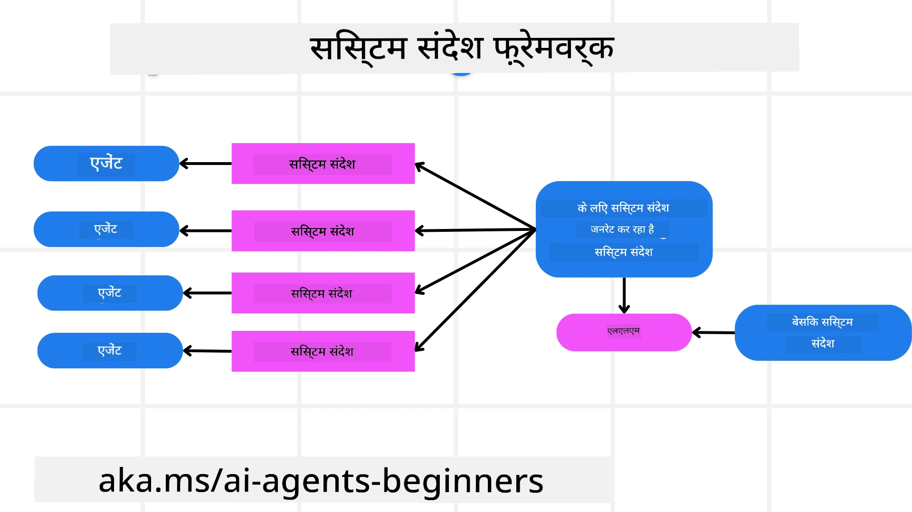
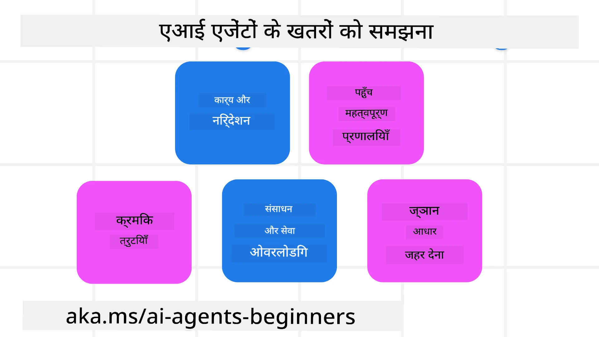
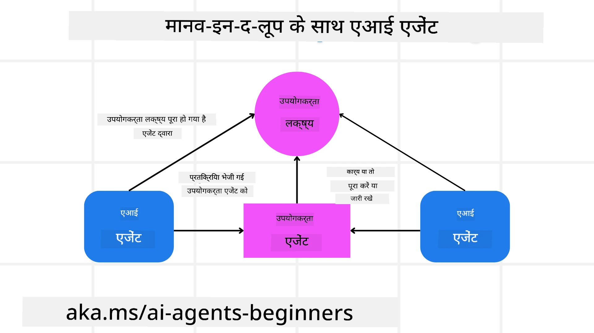

[](https://youtu.be/iZKkMEGBCUQ?si=Q-kEbcyHUMPoHp8L)

> _(इस पाठ का वीडियो देखने के लिए ऊपर चित्र पर क्लिक करें)_

# भरोसेमंद AI एजेंट बनाना

## परिचय

यह पाठ निम्नलिखित विषयों को कवर करेगा:

- सुरक्षित और प्रभावी AI एजेंट कैसे बनाएं और तैनात करें
- AI एजेंट विकसित करते समय महत्वपूर्ण सुरक्षा विचार
- AI एजेंट विकसित करते समय डेटा और उपयोगकर्ता गोपनीयता कैसे बनाए रखें

## सीखने के लक्ष्य

इस पाठ को पूरा करने के बाद, आप जान पाएंगे कि कैसे:

- AI एजेंट बनाते समय जोखिमों की पहचान करें और उन्हें कम करें
- डेटा और एक्सेस को सही ढंग से प्रबंधित करने के लिए सुरक्षा उपाय लागू करें
- ऐसे AI एजेंट बनाएँ जो डेटा गोपनीयता बनाए रखें और उच्च गुणवत्ता वाला उपयोगकर्ता अनुभव प्रदान करें

## सुरक्षा

सबसे पहले सुरक्षित एजेंटिक एप्लिकेशन बनाने पर नजर डालते हैं। सुरक्षा का अर्थ है कि AI एजेंट डिजाइन के अनुसार काम करता है। एजेंटिक एप्लिकेशन के निर्माता के रूप में, हमारे पास सुरक्षा को अधिकतम करने के लिए तरीके और उपकरण हैं:

### सिस्टम संदेश फ्रेमवर्क बनाना

यदि आपने कभी बड़े भाषा मॉडल (LLMs) का उपयोग करके AI एप्लिकेशन बनाया है, तो आप एक मजबूत सिस्टम प्रॉम्प्ट या सिस्टम संदेश डिज़ाइन करने के महत्व को जानते हैं। ये प्रॉम्प्ट मेटा नियम, निर्देश, और मार्गदर्शन स्थापित करते हैं कि LLM उपयोगकर्ता और डेटा के साथ कैसे इंटरैक्ट करेगा।

AI एजेंटों के लिए, सिस्टम प्रॉम्प्ट और भी अधिक महत्वपूर्ण है क्योंकि AI एजेंटों को उन कार्यों को पूरा करने के लिए अत्यंत विशिष्ट निर्देशों की आवश्यकता होगी जिन्हें हमने उनके लिए डिज़ाइन किया है।

स्केलेबल सिस्टम प्रॉम्प्ट बनाने के लिए, हम अपने एप्लिकेशन में एक या एक से अधिक एजेंट बनाने के लिए एक सिस्टम संदेश फ्रेमवर्क का उपयोग कर सकते हैं:



#### चरण 1: एक मेटा सिस्टम संदेश बनाएं

मेटा प्रॉम्प्ट का उपयोग LLM द्वारा उन एजेंटों के लिए सिस्टम प्रॉम्प्ट उत्पन्न करने के लिए किया जाएगा जिन्हें हम बनाते हैं। हम इसे एक टेम्प्लेट के रूप में डिज़ाइन करते हैं ताकि आवश्यकता पड़ने पर हम कई एजेंटों को कुशलतापूर्वक बना सकें।

यहाँ एक मेटा सिस्टम संदेश का उदाहरण दिया गया है जो हम LLM को देंगे:

```plaintext
You are an expert at creating AI agent assistants. 
You will be provided a company name, role, responsibilities and other
information that you will use to provide a system prompt for.
To create the system prompt, be descriptive as possible and provide a structure that a system using an LLM can better understand the role and responsibilities of the AI assistant. 
```

#### चरण 2: एक बुनियादी प्रॉम्प्ट बनाएं

अगला कदम AI एजेंट का वर्णन करने वाला एक बुनियादी प्रॉम्प्ट बनाना है। आपको एजेंट की भूमिका, एजेंट द्वारा पूर्ण किए जाने वाले कार्य, और एजेंट की अन्य जिम्मेदारियों को शामिल करना चाहिए।

यहाँ एक उदाहरण है:

```plaintext
You are a travel agent for Contoso Travel that is great at booking flights for customers. To help customers you can perform the following tasks: lookup available flights, book flights, ask for preferences in seating and times for flights, cancel any previously booked flights and alert customers on any delays or cancellations of flights.  
```

#### चरण 3: LLM को बुनियादी सिस्टम संदेश प्रदान करें

अब हम इस सिस्टम संदेश को बेहतर बनाने के लिए मेटा सिस्टम संदेश को सिस्टम संदेश के रूप में और हमारा बुनियादी सिस्टम संदेश प्रदान कर सकते हैं।

यह एक ऐसा सिस्टम संदेश उत्पन्न करेगा जो हमारे AI एजेंटों का मार्गदर्शन करने के लिए बेहतर डिज़ाइन किया गया है:

```markdown
**Company Name:** Contoso Travel  
**Role:** Travel Agent Assistant

**Objective:**  
You are an AI-powered travel agent assistant for Contoso Travel, specializing in booking flights and providing exceptional customer service. Your main goal is to assist customers in finding, booking, and managing their flights, all while ensuring that their preferences and needs are met efficiently.

**Key Responsibilities:**

1. **Flight Lookup:**
    
    - Assist customers in searching for available flights based on their specified destination, dates, and any other relevant preferences.
    - Provide a list of options, including flight times, airlines, layovers, and pricing.
2. **Flight Booking:**
    
    - Facilitate the booking of flights for customers, ensuring that all details are correctly entered into the system.
    - Confirm bookings and provide customers with their itinerary, including confirmation numbers and any other pertinent information.
3. **Customer Preference Inquiry:**
    
    - Actively ask customers for their preferences regarding seating (e.g., aisle, window, extra legroom) and preferred times for flights (e.g., morning, afternoon, evening).
    - Record these preferences for future reference and tailor suggestions accordingly.
4. **Flight Cancellation:**
    
    - Assist customers in canceling previously booked flights if needed, following company policies and procedures.
    - Notify customers of any necessary refunds or additional steps that may be required for cancellations.
5. **Flight Monitoring:**
    
    - Monitor the status of booked flights and alert customers in real-time about any delays, cancellations, or changes to their flight schedule.
    - Provide updates through preferred communication channels (e.g., email, SMS) as needed.

**Tone and Style:**

- Maintain a friendly, professional, and approachable demeanor in all interactions with customers.
- Ensure that all communication is clear, informative, and tailored to the customer's specific needs and inquiries.

**User Interaction Instructions:**

- Respond to customer queries promptly and accurately.
- Use a conversational style while ensuring professionalism.
- Prioritize customer satisfaction by being attentive, empathetic, and proactive in all assistance provided.

**Additional Notes:**

- Stay updated on any changes to airline policies, travel restrictions, and other relevant information that could impact flight bookings and customer experience.
- Use clear and concise language to explain options and processes, avoiding jargon where possible for better customer understanding.

This AI assistant is designed to streamline the flight booking process for customers of Contoso Travel, ensuring that all their travel needs are met efficiently and effectively.

```

#### चरण 4: पुनरावृत्ति और सुधार करें

इस सिस्टम संदेश फ्रेमवर्क का मूल्य यह है कि इससे एक से अधिक एजेंटों से सिस्टम संदेश बनाना आसान हो जाता है और समय के साथ आपके सिस्टम संदेशों में सुधार होता है। यह दुर्लभ है कि आपके पास आपके संपूर्ण उपयोग केस के लिए पहली बार सही सिस्टम संदेश होगा। छोटे संशोधन और सुधार करने में सक्षम होना, बुनियादी सिस्टम संदेश को बदलकर और इसे सिस्टम के माध्यम से चलाकर, आपको परिणामों की तुलना करने और मूल्यांकन करने की अनुमति देता है।

## खतरों को समझना

भरोसेमंद AI एजेंट बनाने के लिए, यह महत्वपूर्ण है कि आप अपने AI एजेंट के जोखिमों और खतरों को समझें और उन्हें कम करें। आइए AI एजेंटों के कुछ विभिन्न खतरों पर नजर डालें और देखें कि आप उनके लिए बेहतर योजना कैसे बना सकते हैं और तैयारी कैसे कर सकते हैं।



### कार्य और निर्देश

**विवरण:** हमलावर AI एजेंट के निर्देशों या लक्ष्यों को प्रॉम्प्टिंग या इनपुट्स को नियंत्रित करके बदलने का प्रयास करते हैं।

**कम करने का तरीका**: AI एजेंट द्वारा संसाधित किए जाने से पहले संभावित खतरनाक प्रॉम्प्ट का पता लगाने के लिए सत्यापन जांच और इनपुट फ़िल्टर चलाएं। चूंकि ये हमले आमतौर पर एजेंट के साथ अक्सर बातचीत की आवश्यकता होती है, इसलिए बातचीत के चरणों की संख्या सीमित करना इन प्रकार के हमलों को रोकने का एक और तरीका है।

### महत्वपूर्ण प्रणालियों तक पहुँच

**विवरण**: यदि कोई AI एजेंट संवेदनशील डेटा संग्रहीत करने वाली प्रणालियों और सेवाओं तक पहुँच रखता है, तो हमलावर एजेंट और इन सेवाओं के बीच संचार समझौता कर सकते हैं। ये सीधे हमले हो सकते हैं या एजेंट के माध्यम से इन प्रणालियों की जानकारी प्राप्त करने के अप्रत्यक्ष प्रयास हो सकते हैं।

**कम करने का तरीका**: AI एजेंटों को केवल आवश्यकतानुसार ही प्रणालियों तक पहुँच मिलनी चाहिए ताकि इन प्रकार के हमलों को रोका जा सके। एजेंट और सिस्टम के बीच संचार भी सुरक्षित होना चाहिए। प्रमाणीकरण और पहुँच नियंत्रण लागू करना इस जानकारी की सुरक्षा का एक और तरीका है।

### संसाधन और सेवा ओवरलोडिंग

**विवरण:** AI एजेंट क्रियाएं पूरी करने के लिए विभिन्न उपकरणों और सेवाओं का उपयोग कर सकते हैं। हमलावर इस क्षमता का उपयोग करके AI एजेंट के माध्यम से बड़ी मात्रा में अनुरोध भेजकर इन सेवाओं पर हमला कर सकते हैं, जिससे सिस्टम असफलता या उच्च लागत हो सकती है।

**कम करने का तरीका:** किसी सेवा को भेजे जाने वाले अनुरोधों की संख्या को सीमित करने के लिए नीतियाँ लागू करें। आपकी AI एजेंट के लिए बातचीत के चरणों और अनुरोधों की संख्या सीमित करना भी इन प्रकार के हमलों को रोकने का एक तरीका है।

### ज्ञान आधार विषाक्तता

**विवरण:** इस प्रकार का हमला सीधे AI एजेंट को लक्षित नहीं करता है बल्कि ज्ञान आधार और अन्य सेवाओं को लक्षित करता है जिन्हें AI एजेंट कार्य पूर्ण करने के लिए उपयोग करेगा। इसमें डेटा या जानकारी को भ्रष्ट करना शामिल हो सकता है, जिससे AI एजेंट उपयोगकर्ता को पक्षपाती या अनपेक्षित प्रतिक्रियाएँ दे सकता है।

**कम करने का तरीका:** उस डेटा का नियमित सत्यापन करें जिसका उपयोग AI एजेंट अपने वर्कफ़्लो में करता है। सुनिश्चित करें कि इस डेटा तक पहुँच सुरक्षित है और केवल विश्वसनीय व्यक्तियों द्वारा ही इसमें बदलाव किया जाता है ताकि इस प्रकार के हमले से बचा जा सके।

### कास्केडिंग त्रुटियाँ

**विवरण:** AI एजेंट कार्य पूर्ण करने के लिए विभिन्न उपकरणों और सेवाओं का उपयोग करता है। हमलावरों द्वारा उत्पन्न त्रुटियों के कारण अन्य प्रणालियों की विफलता हो सकती है जो AI एजेंट से जुड़ी हैं, जिससे हमला व्यापक हो जाता है और समस्या का निवारण कठिन हो जाता है।

**कम करने का तरीका**: इससे बचने का एक तरीका है कि AI एजेंट एक सीमित वातावरण में संचालित हो, जैसे Docker कंटेनर में काम करना, ताकि सीधे सिस्टम हमलों से बचा जा सके। जब कुछ सिस्टम त्रुटि प्रतिक्रिया प्रदान करें तो फॉलबैक तंत्र और पुनः प्रयास लॉजिक बनाना एक और तरीका है जिससे बड़े सिस्टम विफलताओं से बचा जा सके।

## मानव-इन-द-लूप

भरोसेमंद AI एजेंट सिस्टम बनाने का एक और प्रभावी तरीका है मानव-इन-द-लूप का उपयोग करना। यह एक प्रवाह बनाता है जिसमें उपयोगकर्ता रन के दौरान एजेंटों को प्रतिक्रिया दे सकते हैं। उपयोगकर्ता मूल रूप से एक बहु-एजेंट सिस्टम में एजेंट के रूप में कार्य करते हैं और रनिंग प्रक्रिया को स्वीकृति या समाप्ति प्रदान करते हैं।



यहाँ Microsoft Agent फ्रेमवर्क का उपयोग करते हुए कोड स्निपेट है जो दिखाता है कि यह अवधारणा कैसे लागू की जाती है:

```python
import os
from agent_framework.azure import AzureAIProjectAgentProvider
from azure.identity import AzureCliCredential

# मानव-इन-द-लूप स्वीकृति के साथ प्रदाता बनाएँ
provider = AzureAIProjectAgentProvider(
    credential=AzureCliCredential(),
)

# मानव स्वीकृति चरण के साथ एजेंट बनाएँ
response = provider.create_response(
    input="Write a 4-line poem about the ocean.",
    instructions="You are a helpful assistant. Ask for user approval before finalizing.",
)

# उपयोगकर्ता प्रतिक्रिया की समीक्षा और स्वीकृति कर सकते हैं
print(response.output_text)
user_input = input("Do you approve? (APPROVE/REJECT): ")
if user_input == "APPROVE":
    print("Response approved.")
else:
    print("Response rejected. Revising...")
```

## निष्कर्ष

भरोसेमंद AI एजेंट बनाने के लिए सावधानीपूर्वक डिज़ाइन, मजबूत सुरक्षा उपाय, और सतत पुनरावृत्ति आवश्यक है। संरचित मेटा प्रॉम्प्टिंग सिस्टम लागू करके, संभावित खतरों को समझकर, और कम करने की रणनीतियाँ अपनाकर, डेवलपर्स सुरक्षित और प्रभावी AI एजेंट बना सकते हैं। इसके अतिरिक्त, मानव-इन-द-लूप दृष्टिकोण शामिल करने से यह सुनिश्चित होता है कि AI एजेंट उपयोगकर्ता की आवश्यकताओं के अनुरूप रहे और जोखिम न्यूनतम हो। जैसे-जैसे AI विकसित होगा, सुरक्षा, गोपनीयता और नैतिक विचारों पर सक्रिय रूप में ध्यान देना AI-चालित प्रणालियों में विश्वास और विश्वसनीयता को बढ़ावा देने की कुंजी होगा।

### भरोसेमंद AI एजेंट बनाने के बारे में और प्रश्न हैं?

[Microsoft Foundry Discord](https://aka.ms/ai-agents/discord) से जुड़ें, अन्य सीखने वालों से मिलें, ऑफिस घंटों में भाग लें और अपने AI एजेंट्स से जुड़े प्रश्नों का उत्तर पाएं।

## अतिरिक्त संसाधन

- <a href="https://learn.microsoft.com/azure/ai-studio/responsible-use-of-ai-overview" target="_blank">जिम्मेदारीपूर्ण AI अवलोकन</a>
- <a href="https://learn.microsoft.com/azure/ai-studio/concepts/evaluation-approach-gen-ai" target="_blank">जेनरेटिव AI मॉडल और AI एप्लिकेशन का मूल्यांकन</a>
- <a href="https://learn.microsoft.com/azure/ai-services/openai/concepts/system-message?context=%2Fazure%2Fai-studio%2Fcontext%2Fcontext&tabs=top-techniques" target="_blank">सुरक्षा सिस्टम संदेश</a>
- <a href="https://blogs.microsoft.com/wp-content/uploads/prod/sites/5/2022/06/Microsoft-RAI-Impact-Assessment-Template.pdf?culture=en-us&country=us" target="_blank">जोखिम आकलन टेम्पलेट</a>

## पिछला पाठ

[Agentic RAG](../05-agentic-rag/README.md)

## अगला पाठ

[Planning Design Pattern](../07-planning-design/README.md)

---

<!-- CO-OP TRANSLATOR DISCLAIMER START -->
**अस्वीकरण**:
यह दस्तावेज़ AI अनुवाद सेवा [Co-op Translator](https://github.com/Azure/co-op-translator) का उपयोग करके अनूदित किया गया है। जबकि हम सटीकता के लिए प्रयासरत हैं, कृपया ध्यान दें कि स्वचालित अनुवादों में त्रुटियाँ या असंगतियाँ हो सकती हैं। मूल दस्तावेज़ अपनी मूल भाषा में ही प्रामाणिक स्रोत माना जाना चाहिए। महत्वपूर्ण जानकारी के लिए, पेशेवर मानव अनुवाद की सिफारिश की जाती है। इस अनुवाद के उपयोग से उत्पन्न किसी भी गलतफहमी या गलत व्याख्या के लिए हम उत्तरदायी नहीं हैं।
<!-- CO-OP TRANSLATOR DISCLAIMER END -->