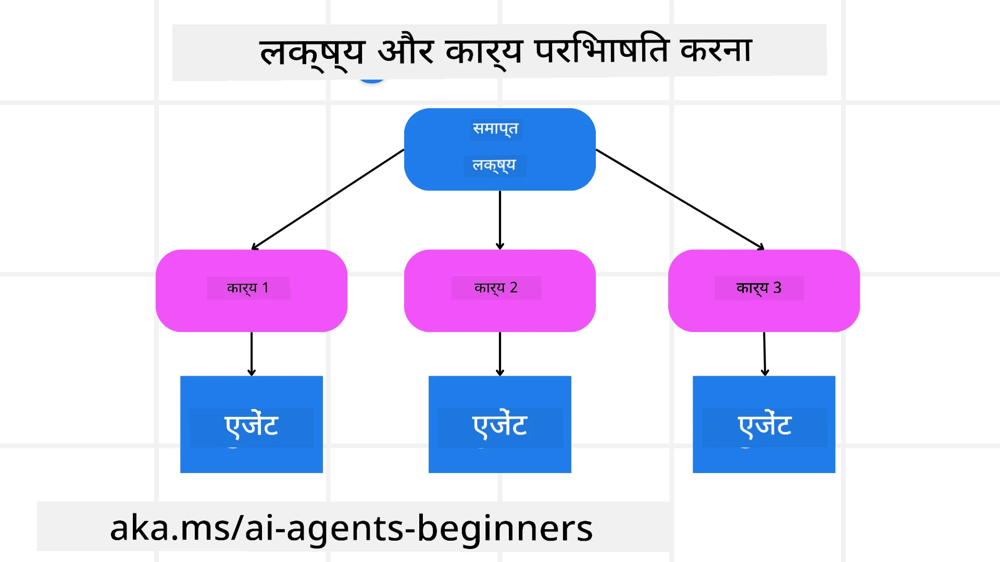

[](https://youtu.be/kPfJ2BrBCMY?si=9pYpPXp0sSbK91Dr)

> _(इस पाठ के वीडियो को देखने के लिए ऊपर की छवि पर क्लिक करें)_

# योजना डिज़ाइन

## परिचय

यह पाठ निम्नलिखित विषयों को कवर करेगा

* एक स्पष्ट समग्र लक्ष्य को परिभाषित करना और एक जटिल कार्य को प्रबंधनीय कार्यों में विभाजित करना।
* अधिक विश्वसनीय और मशीन-पठनीय प्रतिक्रियाओं के लिए संरचित आउटपुट का लाभ उठाना।
* गतिशील कार्यों और अप्रत्याशित इनपुट को संभालने के लिए एक ईवेंट-ड्रिवन दृष्टिकोण लागू करना।

## सीखने के लक्ष्य

इस पाठ को पूरा करने के बाद, आप निम्नलिखित के बारे में समझ प्राप्त करेंगे:

* एक AI एजेंट के लिए समग्र लक्ष्य की पहचान करना और उसे सेट करना, यह सुनिश्चित करते हुए कि एजेंट स्पष्ट रूप से जानता है कि क्या हासिल करना है।
* एक जटिल कार्य को प्रबंधनीय उपकार्य में विघटित करना और उन्हें तार्किक अनुक्रम में व्यवस्थित करना।
* एजेंटों को सही उपकरण (जैसे खोज उपकरण या डेटा विश्लेषण उपकरण) से लैस करना, निर्णय लेना कि कब और कैसे उनका उपयोग करना है, और उत्पन्न अप्रत्याशित परिस्थितियों को संभालना।
* उपकार्य के परिणामों का मूल्यांकन करना, प्रदर्शन को मापना, और अंतिम आउटपुट में सुधार के लिए क्रियाओं को पुनः दोहराना।

## समग्र लक्ष्य को परिभाषित करना और एक कार्य को विभाजित करना



अधिकांश वास्तविक दुनिया के कार्य एक ही चरण में समाधान के लिए बहुत जटिल होते हैं। एक AI एजेंट को अपनी योजना और क्रियाओं का मार्गदर्शन करने के लिए एक संक्षिप्त उद्देश्य की आवश्यकता होती है। उदाहरण के लिए, लक्ष्य पर विचार करें:

    "3-दिन की यात्रा कार्यक्रम तैयार करें।"

हालांकि इसे बयान करना सरल है, फिर भी इसे परिष्कृत करने की आवश्यकता होती है। लक्ष्य जितना स्पष्ट होगा, एजेंट (और कोई भी मानवीय सहयोगी) उतनी ही अच्छी तरह सही परिणाम प्राप्त करने पर ध्यान केंद्रित कर सकेंगे, जैसे कि उड़ान विकल्प, होटल सिफारिशें, और गतिविधि सुझावों के साथ एक व्यापक यात्रा कार्यक्रम बनाना।

### कार्य विघटन

बड़े या जटिल कार्य छोटे, लक्ष्य-उन्मुख उपकार्यों में विभाजित होने पर अधिक प्रबंधनीय हो जाते हैं।  
यात्रा कार्यक्रम के उदाहरण के लिए, आप लक्ष्य को निम्नलिखित में विभाजित कर सकते हैं:

* उड़ान बुकिंग  
* होटल बुकिंग  
* कार किराया  
* निजीकृत करना

प्रत्येक उपकार्य को फिर समर्पित एजेंट या प्रक्रियाओं द्वारा संभाला जा सकता है। एक एजेंट सर्वोत्तम उड़ान सौदों की खोज में विशेषज्ञ हो सकता है, दूसरा होटल बुकिंग पर केंद्रित हो सकता है, आदि। एक समन्वयक या "डाउनस्ट्रीम" एजेंट इन परिणामों को उपयोगकर्ता के लिए एक संगठित यात्रा कार्यक्रम में संकलित कर सकता है।

यह मॉड्यूलर दृष्टिकोण क्रमिक सुधारों की भी अनुमति देता है। उदाहरण के लिए, आप खाद्य सिफारिशों या स्थानीय गतिविधि सुझावों के लिए विशेष एजेंट जोड़ सकते हैं और समय के साथ यात्रा कार्यक्रम को परिष्कृत कर सकते हैं।

### संरचित आउटपुट

लार्ज लैंग्वेज मॉडल (LLMs) संरचित आउटपुट (जैसे JSON) जनरेट कर सकते हैं, जिसे डाउनस्ट्रीम एजेंट या सेवाओं के लिए पार्स और प्रोसेस करना आसान होता है। यह विशेष रूप से एक बहु-एजेंट संदर्भ में उपयोगी है, जहां हम योजना के आउटपुट के प्राप्त होने के बाद इन कार्यों को क्रियान्वित कर सकते हैं।

निम्नलिखित Python कोड एक सरल योजना एजेंट को लक्ष्य को उपकार्यों में विघटित करते हुए और एक संरचित योजना बनाते हुए दर्शाता है:

```python
from pydantic import BaseModel
from enum import Enum
from typing import List, Optional, Union
import json
import os
from typing import Optional
from pprint import pprint
from agent_framework.azure import AzureAIProjectAgentProvider
from azure.identity import AzureCliCredential

class AgentEnum(str, Enum):
    FlightBooking = "flight_booking"
    HotelBooking = "hotel_booking"
    CarRental = "car_rental"
    ActivitiesBooking = "activities_booking"
    DestinationInfo = "destination_info"
    DefaultAgent = "default_agent"
    GroupChatManager = "group_chat_manager"

# यात्रा उपकार्य मॉडल
class TravelSubTask(BaseModel):
    task_details: str
    assigned_agent: AgentEnum  # हम एजेंट को कार्य सौंपना चाहते हैं

class TravelPlan(BaseModel):
    main_task: str
    subtasks: List[TravelSubTask]
    is_greeting: bool

provider = AzureAIProjectAgentProvider(credential=AzureCliCredential())

# उपयोगकर्ता संदेश को परिभाषित करें
system_prompt = """You are a planner agent.
    Your job is to decide which agents to run based on the user's request.
    Provide your response in JSON format with the following structure:
{'main_task': 'Plan a family trip from Singapore to Melbourne.',
 'subtasks': [{'assigned_agent': 'flight_booking',
               'task_details': 'Book round-trip flights from Singapore to '
                               'Melbourne.'}
    Below are the available agents specialised in different tasks:
    - FlightBooking: For booking flights and providing flight information
    - HotelBooking: For booking hotels and providing hotel information
    - CarRental: For booking cars and providing car rental information
    - ActivitiesBooking: For booking activities and providing activity information
    - DestinationInfo: For providing information about destinations
    - DefaultAgent: For handling general requests"""

user_message = "Create a travel plan for a family of 2 kids from Singapore to Melbourne"

response = client.create_response(input=user_message, instructions=system_prompt)

response_content = response.output_text
pprint(json.loads(response_content))
```


### मल्टी-एजेंट व्यवस्था के साथ योजना एजेंट

इस उदाहरण में, एक सेमांटिक राउटर एजेंट उपयोगकर्ता के अनुरोध को प्राप्त करता है (जैसे, "मुझे मेरी यात्रा के लिए होटल योजना चाहिए।")।

फिर योजना बनाता है:

* होटल योजना प्राप्त करता है: योजना एजेंट उपयोगकर्ता के संदेश को लेता है और सिस्टम प्रॉम्प्ट (जिसमें उपलब्ध एजेंट विवरण शामिल हैं) के आधार पर एक संरचित यात्रा योजना तैयार करता है।  
* एजेंट और उनके उपकरणों की सूची बनाता है: एजेंट रजिस्ट्रि में एजेंटों की सूची होती है (जैसे कि उड़ान, होटल, कार किराया, और गतिविधियों के लिए) साथ ही वे जो कार्य या उपकरण प्रदान करते हैं।  
* योजना को संबंधित एजेंटों को रूट करता है: उपकार्यों की संख्या के आधार पर, योजना एजेंट या तो संदेश को सीधे एक समर्पित एजेंट को भेजता है (एकल-कार्य के लिए) या मल्टी-एजेंट सहयोग के लिए एक समूह चैट प्रबंधक के माध्यम से समन्वय करता है।  
* परिणाम का सारांश प्रस्तुत करता है: अंत में, योजना एजेंट स्पष्टता के लिए उत्पन्न योजना का सारांश प्रस्तुत करता है।  
निम्नलिखित Python कोड नमूना इन चरणों को दर्शाता है:

```python

from pydantic import BaseModel

from enum import Enum
from typing import List, Optional, Union

class AgentEnum(str, Enum):
    FlightBooking = "flight_booking"
    HotelBooking = "hotel_booking"
    CarRental = "car_rental"
    ActivitiesBooking = "activities_booking"
    DestinationInfo = "destination_info"
    DefaultAgent = "default_agent"
    GroupChatManager = "group_chat_manager"

# यात्रा उपकार्य मॉडल

class TravelSubTask(BaseModel):
    task_details: str
    assigned_agent: AgentEnum # हम एजेंट को कार्य सौंपना चाहते हैं

class TravelPlan(BaseModel):
    main_task: str
    subtasks: List[TravelSubTask]
    is_greeting: bool
import json
import os
from typing import Optional

from agent_framework.azure import AzureAIProjectAgentProvider
from azure.identity import AzureCliCredential

# क्लाइंट बनाएं

provider = AzureAIProjectAgentProvider(credential=AzureCliCredential())

from pprint import pprint

# उपयोगकर्ता संदेश परिभाषित करें

system_prompt = """You are a planner agent.
    Your job is to decide which agents to run based on the user's request.
    Below are the available agents specialized in different tasks:
    - FlightBooking: For booking flights and providing flight information
    - HotelBooking: For booking hotels and providing hotel information
    - CarRental: For booking cars and providing car rental information
    - ActivitiesBooking: For booking activities and providing activity information
    - DestinationInfo: For providing information about destinations
    - DefaultAgent: For handling general requests"""

user_message = "Create a travel plan for a family of 2 kids from Singapore to Melbourne"

response = client.create_response(input=user_message, instructions=system_prompt)

response_content = response.output_text

# JSON के रूप में लोड करने के बाद प्रतिक्रिया सामग्री प्रिंट करें

pprint(json.loads(response_content))
```


इसका आउटपुट नीचे दिया गया है और आप इस संरचित आउटपुट का उपयोग `assigned_agent` को रूट करने तथा यात्रा योजना का उपयोगकर्ता को सारांशित करने के लिए कर सकते हैं।

```json
{
    "is_greeting": "False",
    "main_task": "Plan a family trip from Singapore to Melbourne.",
    "subtasks": [
        {
            "assigned_agent": "flight_booking",
            "task_details": "Book round-trip flights from Singapore to Melbourne."
        },
        {
            "assigned_agent": "hotel_booking",
            "task_details": "Find family-friendly hotels in Melbourne."
        },
        {
            "assigned_agent": "car_rental",
            "task_details": "Arrange a car rental suitable for a family of four in Melbourne."
        },
        {
            "assigned_agent": "activities_booking",
            "task_details": "List family-friendly activities in Melbourne."
        },
        {
            "assigned_agent": "destination_info",
            "task_details": "Provide information about Melbourne as a travel destination."
        }
    ]
}
```


पिछले कोड नमूने का एक उदाहरण नोटबुक [यहां](07-python-agent-framework.ipynb) उपलब्ध है।

### पुनरावृत्त योजना

कुछ कार्य पीछे-पीछे या पुनः योजना बनाना मांगते हैं, जहाँ एक उपकार्य का परिणाम अगले उपकार्य को प्रभावित करता है। उदाहरण के लिए, यदि एजेंट उड़ान बुकिंग करते समय अप्रत्याशित डेटा प्रारूप पाता है, तो उसे होटल बुकिंग पर आगे बढ़ने से पहले अपनी रणनीति को अनुकूलित करना पड़ सकता है।

इसके अतिरिक्त, उपयोगकर्ता प्रतिक्रिया (जैसे कोई व्यक्ति निर्णय करता है कि वह पहले की उड़ान पसंद करता है) एक आंशिक पुनः योजना को ट्रिगर कर सकती है। यह गतिशील, पुनरावृत्त दृष्टिकोण सुनिश्चित करता है कि अंतिम समाधान वास्तविक-विश्व प्रतिबंधों और उपयोगकर्ता की बदलती प्राथमिकताओं के अनुरूप हो।

उदाहरण कोड

```python
from agent_framework.azure import AzureAIProjectAgentProvider
from azure.identity import AzureCliCredential
#.. पिछली कोड की तरह और उपयोगकर्ता इतिहास, वर्तमान योजना को पास करें

system_prompt = """You are a planner agent to optimize the
    Your job is to decide which agents to run based on the user's request.
    Below are the available agents specialized in different tasks:
    - FlightBooking: For booking flights and providing flight information
    - HotelBooking: For booking hotels and providing hotel information
    - CarRental: For booking cars and providing car rental information
    - ActivitiesBooking: For booking activities and providing activity information
    - DestinationInfo: For providing information about destinations
    - DefaultAgent: For handling general requests"""

user_message = "Create a travel plan for a family of 2 kids from Singapore to Melbourne"

response = client.create_response(
    input=user_message,
    instructions=system_prompt,
    context=f"Previous travel plan - {TravelPlan}",
)
# .. पुनः योजना बनाएं और कार्यों को संबंधित एजेंटों को भेजें
```


अधिक व्यापक योजना के लिए कृपया Magnetic One <a href="https://www.microsoft.com/research/articles/magentic-one-a-generalist-multi-agent-system-for-solving-complex-tasks" target="_blank">Blogpost</a> देखें जो जटिल कार्यों को हल करता है।

## सारांश

इस आलेख में हमने देखा कि कैसे हम एक ऐसा योजना बनाने वाला बना सकते हैं जो उपलब्ध एजेंटों का गतिशील चयन कर सके। योजना का आउटपुट कार्यों को विघटित करता है और एजेंटों को असाइन करता है ताकि वे निष्पादित किए जा सकें। यह माना जाता है कि एजेंटों के पास वे कार्य करने के लिए आवश्यक कार्य/उपकरण उपलब्ध हैं। एजेंटों के अलावा, आप प्रतिबिंब, सारांशकर्ता, और राउंड रॉबिन चैट जैसे अन्य पैटर्न भी शामिल कर सकते हैं ताकि और अधिक अनुकूलन किया जा सके।

## अतिरिक्त संसाधन

Magentic One - एक सामान्य बहु-एजेंट सिस्टम जो जटिल कार्यों को हल करता है और कई चुनौतीपूर्ण एजेंटिक बेंचमार्क पर प्रभावशाली परिणाम हासिल करता है। संदर्भ: <a href="https://www.microsoft.com/research/articles/magentic-one-a-generalist-multi-agent-system-for-solving-complex-tasks" target="_blank">Magentic One</a>. इस कार्यान्वयन में आयोजक कार्य-विशिष्ट योजनाएँ बनाता है और इन कार्यों को उपलब्ध एजेंटों को सौंपता है। योजना बनाने के अलावा आयोजक एक ट्रैकिंग प्रणाली का उपयोग करता है ताकि कार्य की प्रगति की निगरानी की जा सके और आवश्यकतानुसार पुनः योजना बनाई जा सके।

### योजना डिज़ाइन पैटर्न के बारे में और प्रश्न हैं?

[Microsoft Foundry Discord](https://aka.ms/ai-agents/discord) में शामिल हों जहाँ आप अन्य सीखने वालों से मिल सकते हैं, ऑफिस ऑवर्स में भाग ले सकते हैं और अपने AI एजेंट्स से संबंधित प्रश्नों के उत्तर पा सकते हैं।

## पिछला पाठ

[विश्वसनीय AI एजेंट बनाना](../06-building-trustworthy-agents/README.md)

## अगला पाठ

[मल्टी-एजेंट डिज़ाइन पैटर्न](../08-multi-agent/README.md)

---

<!-- CO-OP TRANSLATOR DISCLAIMER START -->
**अस्वीकरण**:  
इस दस्तावेज़ का अनुवाद AI अनुवाद सेवा [Co-op Translator](https://github.com/Azure/co-op-translator) का उपयोग करके किया गया है। जबकि हम सटीकता के लिए प्रयासरत हैं, कृपया यह समझ लें कि स्वचालित अनुवादों में गलतियाँ या त्रुटियाँ हो सकती हैं। मूल भाषा में उपलब्ध दस्तावेज़ को आधिकारिक स्रोत के रूप में माना जाना चाहिए। महत्वपूर्ण जानकारी के लिए, पेशेवर मानव अनुवाद की सिफारिश की जाती है। इस अनुवाद के उपयोग से होने वाली किसी भी गलतफहमी या गलत व्याख्या के लिए हम जिम्मेदार नहीं हैं।
<!-- CO-OP TRANSLATOR DISCLAIMER END -->