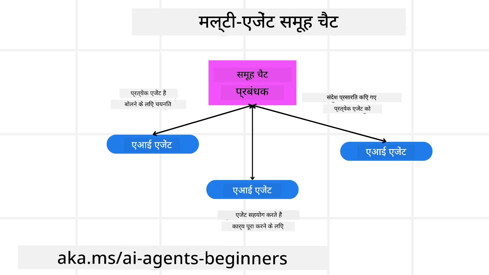
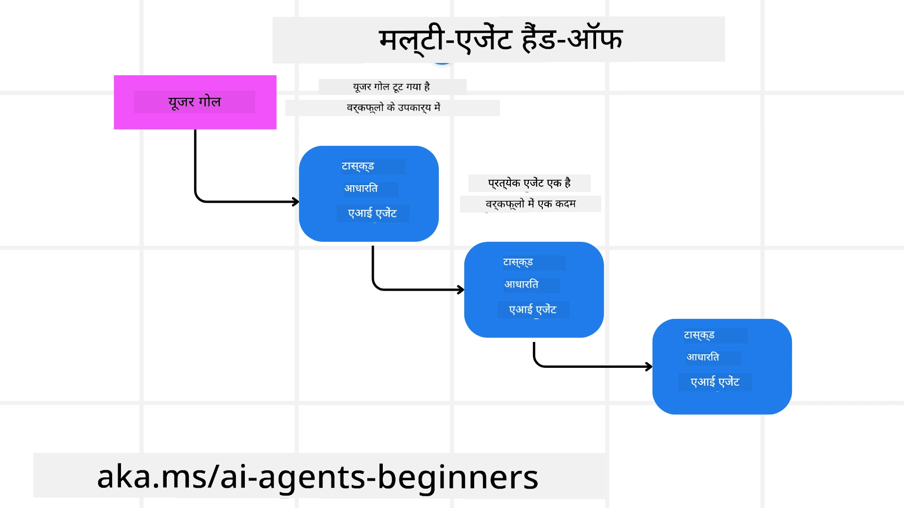
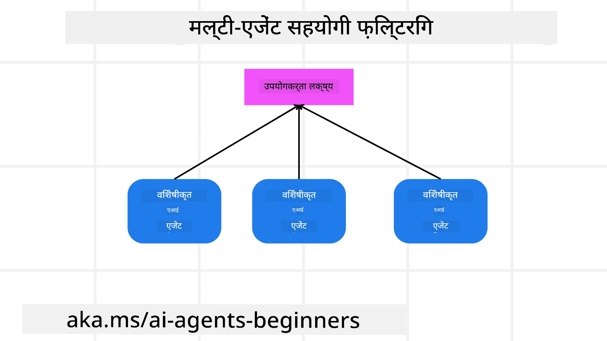

> _(इस पाठ का वीडियो देखने के लिए ऊपर दी गई छवि पर क्लिक करें)_

# बहु-एजेंट डिज़ाइन पैटर्न

जैसे ही आप एक ऐसे प्रोजेक्ट पर काम करना शुरू करते हैं जिसमें कई एजेंट शामिल होते हैं, आपको बहु-एजेंट डिज़ाइन पैटर्न पर ध्यान देना होगा। हालांकि, यह तुरंत स्पष्ट नहीं हो सकता कि कब बहु-एजेंट पर स्विच करना है और इसके फायदे क्या हैं।

## परिचय

इस पाठ में, हम निम्नलिखित सवालों के जवाब खोजने जा रहे हैं:

- वे कौन से परिदृश्य हैं जहां बहु-एजेंट लागू होते हैं?
- एकल एजेंट की तुलना में बहु-एजेंट उपयोग करने के क्या लाभ हैं?
- बहु-एजेंट डिज़ाइन पैटर्न को लागू करने के निर्माण खंड क्या हैं?
- हम कैसे देख सकते हैं कि कई एजेंट एक-दूसरे के साथ कैसे इंटरैक्ट कर रहे हैं?

## सीखने के लक्ष्य

इस पाठ के बाद, आप सक्षम होंगे:

- उन परिदृश्यों की पहचान करना जहां बहु-एजेंट लागू होते हैं
- बहु-एजेंट के उपयोग के लाभों को समझना जो एक एकल एजेंट की तुलना में अधिक हैं
- बहु-एजेंट डिज़ाइन पैटर्न को लागू करने के निर्माण खंडों को समझना

बड़ी तस्वीर क्या है?

*बहु-एजेंट एक डिज़ाइन पैटर्न है जो कई एजेंटों को एक साथ मिलकर एक सामान्य लक्ष्य प्राप्त करने की अनुमति देता है*।

यह पैटर्न विभिन्न क्षेत्रों में व्यापक रूप से उपयोग किया जाता है, जिसमें रोबोटिक्स, स्वायत्त प्रणालियाँ, और वितरित कंप्यूटिंग शामिल हैं।

## वे परिदृश्य जहां बहु-एजेंट लागू होते हैं

तो कौन से परिदृश्य बहु-एजेंट के उपयोग के लिए अच्छे हैं? जवाब यह है कि कई परिदृश्य हैं जहां कई एजेंटों को शामिल करना लाभकारी होता है खासकर निम्नलिखित मामलों में:

- **बड़ा कार्यभार**: बड़े कार्यभार को छोटे कार्यों में विभाजित किया जा सकता है और अलग-अलग एजेंटों को सौंपा जा सकता है, जिससे समानांतर प्रसंस्करण और तेज़ पूरा होना संभव होता है। इसका एक उदाहरण बड़े डेटा प्रसंस्करण कार्य में है।
- **जटिल कार्य**: बड़े कार्यभार की तरह, जटिल कार्यों को छोटे उपकार्य में विभाजित किया जा सकता है और विभिन्न एजेंटों को सौंपा जा सकता है, जो कार्य के विशिष्ट पहलुओं में विशेषज्ञ होते हैं। इसका अच्छा उदाहरण स्वायत्त वाहनों का है जहां विभिन्न एजेंट नेविगेशन, बाधा पहचान, और अन्य वाहनों से संचार का प्रबंधन करते हैं।
- **विविध विशेषज्ञता**: अलग-अलग एजेंट विभिन्न विशेषज्ञता रखते हैं, जिससे वे एकल एजेंट की तुलना में कार्य के विभिन्न पहलुओं को अधिक प्रभावी ढंग से संभाल सकते हैं। इसके लिए एक अच्छा उदाहरण स्वास्थ्य सेवा का है जहां एजेंट डायग्नोस्टिक्स, उपचार योजनाओं, और रोगी निगरानी का प्रबंधन कर सकते हैं।

## एकल एजेंट की तुलना में बहु-एजेंट उपयोग के फायदे

एक एकल एजेंट प्रणाली सरल कार्यों के लिए अच्छी हो सकती है, लेकिन जटिल कार्यों के लिए कई एजेंटों का उपयोग कई लाभ प्रदान कर सकता है:

- **विशेषीकरण**: प्रत्येक एजेंट एक विशिष्ट कार्य के लिए विशेषीकृत हो सकता है। एकल एजेंट में विशेषज्ञता की कमी होती है जिसका मतलब है कि वह हर काम कर सकता है लेकिन जटिल कार्यों से सामना करने पर भ्रमित हो सकता है। उदाहरण के लिए, वह उस कार्य को कर सकता है जिसके लिए वह सबसे उपयुक्त नहीं है।
- **स्केलेबिलिटी**: प्रणाली को स्केल करना आसान होता है क्योंकि आप अधिक एजेंट जोड़ सकते हैं बजाय एकल एजेंट को अधिक भार देने के।
- **त्रुटि सहिष्णुता**: यदि एक एजेंट फेल हो जाता है, तो अन्य एजेंट काम करना जारी रख सकते हैं, जिससे प्रणाली की विश्वसनीयता सुनिश्चित होती है।

एक उदाहरण लेते हैं, मान लीजिए हम एक उपयोगकर्ता के लिए यात्रा बुक करना चाहते हैं। एक एकल एजेंट प्रणाली को यात्रा बुकिंग प्रक्रिया के सभी पहलुओं को संभालना होगा, जैसे उड़ानें ढूंढना, होटल और किराये की कार बुक करना। इसे एक एजेंट के साथ प्राप्त करने के लिए, एजेंट को इन सभी कार्यों को संभालने के लिए उपकरण होने चाहिए। इससे एक जटिल और मोनोलिथिक सिस्टम बन सकता है जिसे बनाए रखना और स्केल करना मुश्किल होता है। दूसरी ओर, बहु-एजेंट सिस्टम में उड़ान खोजने, होटल बुकिंग, और किराये की कार की बुकिंग में विशेषज्ञ अलग-अलग एजेंट हो सकते हैं। इससे सिस्टम अधिक मॉड्यूलर, बनाए रखने में आसान और स्केलेबल होता है।

इसे एक मम्मी-पॉप स्टोर के रूप में चल रहे ट्रैवल ब्यूरो की तुलना में एक फ्रैंचाइज़ ट्रैवल ब्यूरो से तुलना करें। मम्मी-पॉप स्टोर में एक एकल एजेंट यात्रा की सभी प्रक्रियाओं का प्रबंधन करता है, जबकि फ्रैंचाइज़ में विभिन्न एजेंट अलग-अलग प्रक्रियाओं का प्रबंधन करते हैं।

## बहु-एजेंट डिज़ाइन पैटर्न लागू करने के निर्माण खंड

बहु-एजेंट डिज़ाइन पैटर्न लागू करने से पहले, आपको उन निर्माण खंडों को समझना होगा जो इस पैटर्न को बनाते हैं।

इसे अधिक स्पष्ट बनाने के लिए फिर से एक उपयोगकर्ता के लिए यात्रा बुकिंग के उदाहरण को देखते हैं। इस मामले में, निर्माण खंडों में शामिल होंगे:

- **एजेंट संचार**: उड़ान खोजने, होटल बुकिंग, और किराये की कार के एजेंटों को उपयोगकर्ता की प्राथमिकताओं और प्रतिबंधों के बारे में जानकारी साझा करने और संवाद करने की आवश्यकता होती है। आपको इस संचार के लिए प्रोटोकॉल और तरीके तय करने होंगे। इसका मतलब यह है कि उड़ान खोजने वाला एजेंट होटल बुकिंग एजेंट से संवाद करेगा ताकि सुनिश्चित किया जा सके कि होटल उसी तारीखों के लिए बुक हो जैसे उड़ान हो। इसका मतलब है कि एजेंटों को उपयोगकर्ता की यात्रा तिथियों के बारे में जानकारी साझा करनी होगी, इसलिए आपको तय करना होगा *कौन से एजेंट जानकारी साझा कर रहे हैं और वे किस प्रकार साझा कर रहे हैं*।
- **समन्वय तंत्र**: एजेंटों को अपने कार्यों का समन्वय करना चाहिए ताकि उपयोगकर्ता की प्राथमिकताएँ और प्रतिबंध पूरे हों। एक उपयोगकर्ता की प्राथमिकता हो सकती है कि वे हवाई अड्डे के पास होटल चाहता है जबकि एक प्रतिबंध हो सकता है कि किराये की कारें केवल हवाई अड्डे पर उपलब्ध हैं। इसका अर्थ है कि होटल बुकिंग एजेंट को किराये की कार बुकिंग एजेंट के साथ समन्वय करना होगा। इसका मतलब है कि आपको तय करना होगा *एजेंट अपने क्रियाकलापों का समन्वय कैसे कर रहे हैं*।
- **एजेंट वास्तुकला**: एजेंटों के पास आंतरिक संरचना होनी चाहिए जो निर्णय ले सके और उपयोगकर्ता के साथ इंटरैक्शन से सीख सके। इसका अर्थ है कि उड़ान खोजने वाला एजेंट निर्णय ले सके कि उपयोगकर्ता को कौन-सी उड़ानें सुझानी हैं। इसका मतलब यह है कि आपको तय करना होगा *एजेंट निर्णय कैसे ले रहे हैं और उपयोगकर्ता के साथ इंटरैक्शन से कैसे सीख रहे हैं*। उदाहरण के लिए, उड़ान खोजने वाला एजेंट उपयोगकर्ता की पिछली प्राथमिकताओं के आधार पर उड़ानें सुझाने के लिए मशीन लर्निंग मॉडल का उपयोग कर सकता है।
- **बहु-एजेंट इंटरैक्शन में दृश्यता**: आपको यह देखना होगा कि कई एजेंट एक-दूसरे के साथ कैसे इंटरैक्ट कर रहे हैं। इसके लिए आपको एजेंट क्रियाकलापों और इंटरैक्शन को ट्रैक करने के उपकरण और तकनीकों की आवश्यकता होगी। यह लॉगिंग और मॉनिटरिंग टूल, विज़ुअलाइज़ेशन टूल, और प्रदर्शन मेट्रिक्स के रूप में हो सकता है।
- **बहु-एजेंट पैटर्न**: बहु-एजेंट सिस्टम को लागू करने के विभिन्न पैटर्न होते हैं, जैसे केंद्रीकृत, विकेंद्रीकृत, और हाइब्रिड वास्तुकला। आपको उस पैटर्न का चयन करना होगा जो आपके उपयोग मामले के लिए सबसे उपयुक्त हो।
- **मानव तत्व**: अधिकांश मामलों में, आपके सिस्टम में एक मानव शायद शामिल होगा और आपको एजेंटों को निर्देश देना होगा कि कब मानव हस्तक्षेप के लिए पूछना चाहिए। यह उपयोगकर्ता द्वारा एक विशिष्ट होटल या उड़ान के लिए अनुरोध करने के रूप में हो सकता है जो एजेंटों ने सुझाव नहीं दिया हो, या बुकिंग से पहले पुष्टिकरण मांगना।

## बहु-एजेंट इंटरैक्शन में दृश्यता

यह आवश्यक है कि आपको यह देखने की क्षमता हो कि कई एजेंट एक-दूसरे के साथ कैसे इंटरैक्ट कर रहे हैं। यह दृश्यता डिबगिंग, अनुकूलन, और समग्र सिस्टम की प्रभावशीलता सुनिश्चित करने के लिए महत्वपूर्ण है। इसे प्राप्त करने के लिए, आपको एजेंट की गतिविधियों और इंटरैक्शन्स को ट्रैक करने के लिए उपकरण और तकनीकों की आवश्यकता होगी। यह लॉगिंग और मॉनिटरिंग टूल, विज़ुअलाइज़ेशन टूल, और प्रदर्शन मेट्रिक्स के रूप में हो सकता है।

उदाहरण के लिए, एक उपयोगकर्ता के लिए यात्रा बुकिंग के मामले में, आपके पास एक डैशबोर्ड हो सकता है जो प्रति एजेंट स्थिति दिखाता है, उपयोगकर्ता की प्राथमिकताएँ और प्रतिबंध, और एजेंटों के बीच इंटरैक्शन। यह डैशबोर्ड उपयोगकर्ता की यात्रा तिथियां, उड़ान एजेंट द्वारा सुझाई गई उड़ानें, होटल एजेंट द्वारा सुझाए गए होटल, और किराये की कार एजेंट द्वारा सुझाए गए वाहन दिखा सकता है। यह आपको स्पष्ट दृष्टिकोण देगा कि एजेंट कैसे इंटरैक्ट कर रहे हैं और क्या उपयोगकर्ता की प्राथमिकताओं और प्रतिबंधों को पूरा किया जा रहा है या नहीं।

आइए इन पहलुओं को और विस्तार से देखें।

- **लॉगिंग और मॉनिटरिंग टूल**: आप चाहते हैं कि हर क्रिया के लिए लॉगिंग की जाए जो एजेंट करता है। एक लॉग प्रविष्टि में एजेंट जिसने क्रिया की, की गई क्रिया, क्रिया का समय, और परिणाम जैसी जानकारी हो सकती है। इस जानकारी का उपयोग डिबगिंग, ऑप्टिमाइजेशन आदि के लिए किया जा सकता है।

- **विज़ुअलाइज़ेशन टूल**: विज़ुअलाइज़ेशन टूल आपको एजेंटों के बीच इंटरैक्शन को अधिक सहज तरीके से देखने में मदद कर सकते हैं। उदाहरण के लिए, आपके पास एक ग्राफ हो सकता है जो एजेंटों के बीच सूचना के प्रवाह को दिखाता हो। इससे आप सिस्टम में बाधाओं, अकार्यक्षमता, और अन्य समस्याओं की पहचान कर सकते हैं।

- **प्रदर्शन मेट्रिक्स**: प्रदर्शन मेट्रिक्स आपको बहु-एजेंट सिस्टम की प्रभावशीलता ट्रैक करने में मदद कर सकते हैं। उदाहरण के लिए, आप किसी कार्य को पूरा करने में लगने वाला समय, प्रति इकाई समय में पूर्ण हुए कार्यों की संख्या, और एजेंटों द्वारा दी गई सिफारिशों की सटीकता ट्रैक कर सकते हैं। यह जानकारी आपको सुधार के क्षेत्र पहचानने और सिस्टम को ऑप्टिमाइज़ करने में मदद कर सकती है।

## बहु-एजेंट पैटर्न

आइए कुछ ठोस पैटर्न देखें जिनका उपयोग हम बहु-एजेंट ऐप बनाने के लिए कर सकते हैं। यहाँ कुछ दिलचस्प पैटर्न हैं जिन्हें विचार करने लायक है:

### ग्रुप चैट

यह पैटर्न तब उपयोगी होता है जब आप एक ग्रुप चैट एप्लिकेशन बनाना चाहते हैं जहाँ कई एजेंट एक-दूसरे से संवाद कर सकें। इसके सामान्य उपयोग में टीम सहयोग, ग्राहक समर्थन, और सोशल नेटवर्किंग शामिल हैं।

इस पैटर्न में, प्रत्येक एजेंट समूह चैट में एक उपयोगकर्ता का प्रतिनिधित्व करता है, और संदेश एजेंटों के बीच एक संदेश प्रोटोकॉल के माध्यम से आदान-प्रदान किए जाते हैं। एजेंट समूह चैट को संदेश भेज सकते हैं, समूह चैट से संदेश प्राप्त कर सकते हैं, और अन्य एजेंटों के संदेशों का जवाब दे सकते हैं।

यह पैटर्न केंद्रीकृत वास्तुकला का उपयोग कर लागू किया जा सकता है जहां सभी संदेश केंद्र सर्वर के माध्यम से भेजे जाते हैं, या विकेंद्रीकृत वास्तुकला जहां संदेश सीधे आदान-प्रदान होते हैं।

### हैंड-ऑफ

यह पैटर्न तब उपयोगी होता है जब आप ऐसा ऐप बनाना चाहते हैं जहाँ कई एजेंट एक-दूसरे को कार्य सौंप सकें।

इस पैटर्न के सामान्य उपयोग में ग्राहक समर्थन, कार्य प्रबंधन, और वर्कफ़्लो ऑटोमेशन शामिल हैं।

इस पैटर्न में, प्रत्येक एजेंट एक कार्य या वर्कफ़्लो में एक चरण का प्रतिनिधित्व करता है, और एजेंट पूर्वनिर्धारित नियमों के आधार पर कार्यों को अन्य एजेंटों को सौंप सकते हैं।

### सहयोगी फ़िल्टरिंग

यह पैटर्न तब उपयोगी होता है जब आप ऐसा ऐप बनाना चाहते हैं जहाँ कई एजेंट मिलकर उपयोगकर्ताओं को सिफारिशें करते हैं।

क्योंकि हर एजेंट की अलग-अलग विशेषज्ञता हो सकती है और वे सिफारिश प्रक्रिया में अलग-अलग तरीके से योगदान दे सकते हैं, इसलिए कई एजेंटों का सहयोग आवश्यक होता है।

आइए एक उदाहरण लें जहाँ एक उपयोगकर्ता को स्टॉक मार्केट में सबसे अच्छे स्टॉक की सिफारिश चाहिए।

- **इंडस्ट्री विशेषज्ञ**: एक एजेंट किसी विशेष उद्योग का विशेषज्ञ हो सकता है।
- **तकनीकी विश्लेषण**: दूसरा एजेंट तकनीकी विश्लेषण में विशेषज्ञ हो सकता है।
- **मूलभूत विश्लेषण**: और एक एजेंट मूलभूत विश्लेषण में विशेषज्ञ हो सकता है। ये एजेंट मिलकर उपयोगकर्ता को एक व्यापक सिफारिश प्रदान कर सकते हैं।

## परिदृश्य: रिफंड प्रक्रिया

एक परिस्थिति सोचें जहाँ ग्राहक किसी उत्पाद के लिए रिफंड प्राप्त करने की कोशिश कर रहा है, इसमें कई एजेंट शामिल हो सकते हैं लेकिन आइए इसे रिफंड प्रक्रिया के लिए विशिष्ट एजेंटों और अन्य सामान्य एजेंटों में विभाजित करते हैं।

**रिफंड प्रक्रिया के लिए विशिष्ट एजेंट**:

निम्न एजेंट रिफंड प्रक्रिया में शामिल हो सकते हैं:

- **ग्राहक एजेंट**: यह एजेंट ग्राहक का प्रतिनिधित्व करता है और रिफंड प्रक्रिया शुरू करने के लिए जिम्मेदार होता है।
- **विक्रेता एजेंट**: यह एजेंट विक्रेता का प्रतिनिधित्व करता है और रिफंड प्रक्रिया को आगे बढ़ाने का कार्य करता है।
- **भुगतान एजेंट**: यह एजेंट भुगतान प्रक्रिया का प्रतिनिधित्व करता है और ग्राहक के भुगतान को रिफंड करने का जिम्मेदार होता है।
- **समाधान एजेंट**: यह एजेंट समाधान प्रक्रिया का प्रतिनिधित्व करता है और रिफंड प्रक्रिया के दौरान उत्पन्न समस्याओं को सुलझाने का काम करता है।
- **अनुपालन एजेंट**: यह एजेंट अनुपालन प्रक्रिया का प्रतिनिधित्व करता है और सुनिश्चित करता है कि रिफंड प्रक्रिया नियमों और नीतियों के अनुसार हो।

**सामान्य एजेंट**:

ये एजेंट आपके व्यवसाय के अन्य हिस्सों द्वारा भी उपयोग किए जा सकते हैं।

- **शिपिंग एजेंट**: यह एजेंट शिपिंग प्रक्रिया का प्रतिनिधित्व करता है और उत्पाद को विक्रेता को वापस भेजने के लिए जिम्मेदार होता है। इस एजेंट का उपयोग रिफंड प्रक्रिया और सामान्य उत्पाद शिपिंग दोनों के लिए किया जा सकता है।
- **फीडबैक एजेंट**: यह एजेंट फीडबैक प्रक्रिया का प्रतिनिधित्व करता है और ग्राहक से फीडबैक एकत्र करता है। फीडबैक किसी भी समय लिया जा सकता है, सिर्फ रिफंड प्रक्रिया के दौरान नहीं।
- **एस्केलेशन एजेंट**: यह एजेंट एस्केलेशन प्रक्रिया का प्रतिनिधित्व करता है और मुद्दों को उच्च स्तरीय समर्थन तक पहुंचाने का कार्य करता है। आप इस प्रकार के एजेंट का उपयोग किसी भी प्रक्रिया में कर सकते हैं जहाँ आपको मुद्दा बढ़ाना हो।
- **सूचना एजेंट**: यह एजेंट सूचना प्रक्रिया का प्रतिनिधित्व करता है और रिफंड प्रक्रिया के विभिन्न चरणों में ग्राहक को सूचनाएं भेजने के लिए जिम्मेदार होता है।
- **विश्लेषण एजेंट**: यह एजेंट विश्लेषण प्रक्रिया का प्रतिनिधित्व करता है और रिफंड प्रक्रिया से संबंधित डेटा का विश्लेषण करता है।
- **ऑडिट एजेंट**: यह एजेंट ऑडिट प्रक्रिया का प्रतिनिधित्व करता है और सुनिश्चित करता है कि रिफंड प्रक्रिया ठीक से की जा रही है।
- **रिपोर्टिंग एजेंट**: यह एजेंट रिपोर्टिंग प्रक्रिया का प्रतिनिधित्व करता है और रिफंड प्रक्रिया पर रिपोर्ट तैयार करता है।
- **ज्ञान एजेंट**: यह एजेंट ज्ञान प्रक्रिया का प्रतिनिधित्व करता है और रिफंड प्रक्रिया संबंधित जानकारी का ज्ञान आधार रखता है। यह एजेंट रिफंड के साथ-साथ आपके व्यवसाय के अन्य हिस्सों के बारे में भी ज्ञान रख सकता है।
- **सुरक्षा एजेंट**: यह एजेंट सुरक्षा प्रक्रिया का प्रतिनिधित्व करता है और रिफंड प्रक्रिया की सुरक्षा सुनिश्चित करता है।
- **गुणवत्ता एजेंट**: यह एजेंट गुणवत्ता प्रक्रिया का प्रतिनिधित्व करता है और रिफंड प्रक्रिया की गुणवत्ता सुनिश्चित करता है।

पहले सूचीबद्ध किए गए कई एजेंट हैं, जो न केवल रिफंड प्रक्रिया के लिए विशिष्ट हैं बल्कि आपके व्यवसाय के अन्य हिस्सों के लिए सामान्य एजेंट भी हैं। उम्मीद है इससे आपको यह समझने में मदद मिलेगी कि आप अपने बहु-एजेंट प्रणाली में किन एजेंटों का उपयोग कर सकते हैं।

## असाइनमेंट

एक ग्राहक समर्थन प्रक्रिया के लिए एक बहु-एजेंट प्रणाली डिज़ाइन करें। उस प्रक्रिया में शामिल एजेंटों की पहचान करें, उनकी भूमिकाएँ और जिम्मेदारियां क्या हैं, और वे एक-दूसरे के साथ कैसे इंटरैक्ट करते हैं। ग्राहक समर्थन प्रक्रिया के लिए विशिष्ट एजेंटों और आपके व्यवसाय के अन्य हिस्सों में उपयोग किए जा सकने वाले सामान्य एजेंटों दोनों पर विचार करें।
> नीचे दिए गए समाधान को पढ़ने से पहले सोचें, आपको जितने एजेंटों की जरूरत सोचते हैं, उससे अधिक की आवश्यकता हो सकती है।

> TIP: ग्राहक सहायता प्रक्रिया के विभिन्न चरणों के बारे में सोचें और किसी भी सिस्टम के लिए आवश्यक एजेंटों पर भी विचार करें।

## समाधान

[समाधान](./solution/solution.md)

## ज्ञान जांच

प्रश्न: आपको मल्टी-एजेंट का उपयोग कब करना चाहिए?

- [ ] A1: जब आपका कार्यभार छोटा हो और कार्य सरल हो।
- [ ] A2: जब आपका कार्यभार बड़ा हो।
- [ ] A3: जब कार्य सरल हो।

[समाधान प्रश्नोत्तरी](./solution/solution-quiz.md)

## सारांश

इस पाठ में, हमने मल्टी-एजेंट डिज़ाइन पैटर्न को देखा है, जिनमें ऐसे परिदृश्य शामिल हैं जहाँ मल्टी-एजेंट लागू होते हैं, एकल एजेंट की तुलना में मल्टी-एजेंट के उपयोग के लाभ, मल्टी-एजेंट डिज़ाइन पैटर्न को लागू करने के निर्माण खंड, और यह कैसे देखना है कि कई एजेंट एक दूसरे के साथ कैसे इंटरैक्ट कर रहे हैं।

### मल्टी-एजेंट डिज़ाइन पैटर्न के बारे में और प्रश्न हैं?

[Microsoft Foundry Discord](https://aka.ms/ai-agents/discord) में शामिल हों, जहां आप अन्य शिक्षार्थियों से मिल सकते हैं, कार्यालय समय में भाग ले सकते हैं और अपने AI एजेंट्स के सवालों के जवाब पा सकते हैं।

## अतिरिक्त संसाधन

- <a href="https://learn.microsoft.com/azure/ai-services/agents/overview" target="_blank">Microsoft Agent Framework दस्तावेज़ीकरण</a>
- <a href="https://www.analyticsvidhya.com/blog/2024/10/agentic-design-patterns/" target="_blank">एजेंटिक डिज़ाइन पैटर्न</a>

## पिछला पाठ

[योजना डिज़ाइन](../07-planning-design/README.md)

## अगला पाठ

[AI एजेंट्स में मेटाकॉग्निशन](../09-metacognition/README.md)

---

<!-- CO-OP TRANSLATOR DISCLAIMER START -->
**अस्वीकरण**:  
इस दस्तावेज़ का अनुवाद AI अनुवाद सेवा [Co-op Translator](https://github.com/Azure/co-op-translator) का उपयोग करके किया गया है। जबकि हम सटीकता के लिए प्रयासरत हैं, कृपया ध्यान दें कि स्वचालित अनुवाद में त्रुटियाँ या असंगतियाँ हो सकती हैं। मूल दस्तावेज़ अपनी मूल भाषा में आधिकारिक स्रोत माना जाना चाहिए। महत्वपूर्ण जानकारी के लिए, पेशेवर मानव अनुवाद की सलाह दी जाती है। इस अनुवाद के उपयोग से उत्पन्न किसी भी गलत समझ या गलत व्याख्या के लिए हम जिम्मेदार नहीं हैं।
<!-- CO-OP TRANSLATOR DISCLAIMER END -->