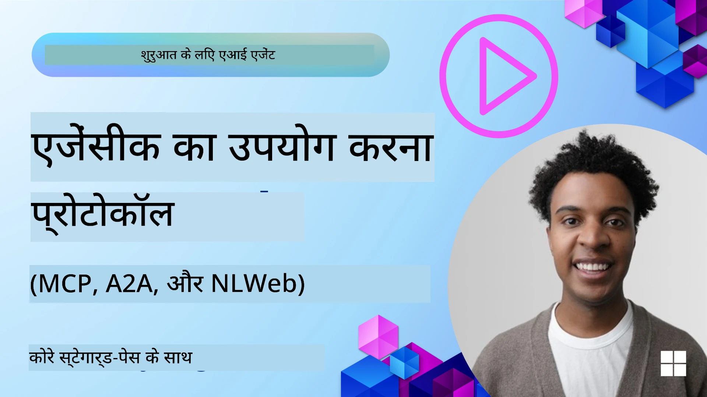
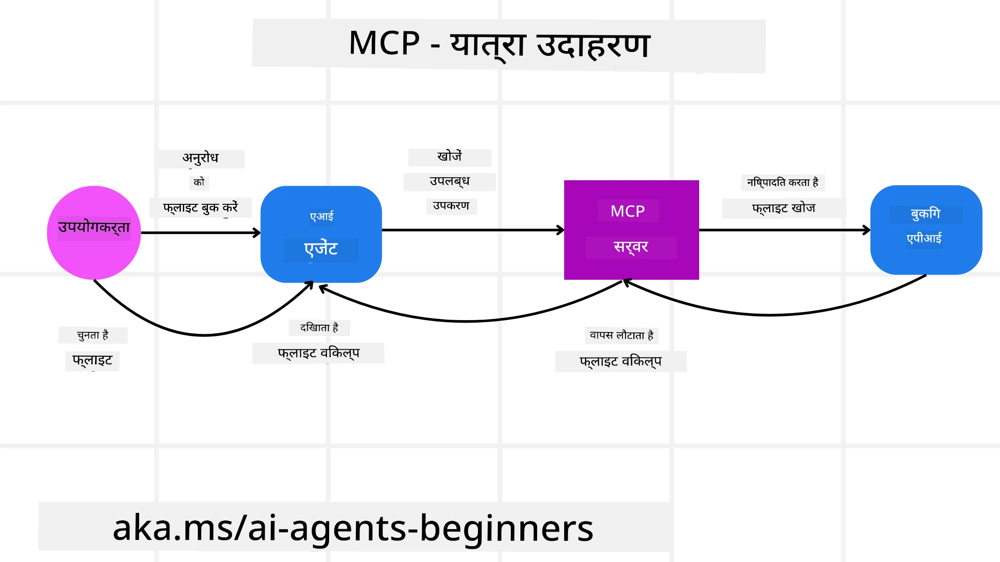
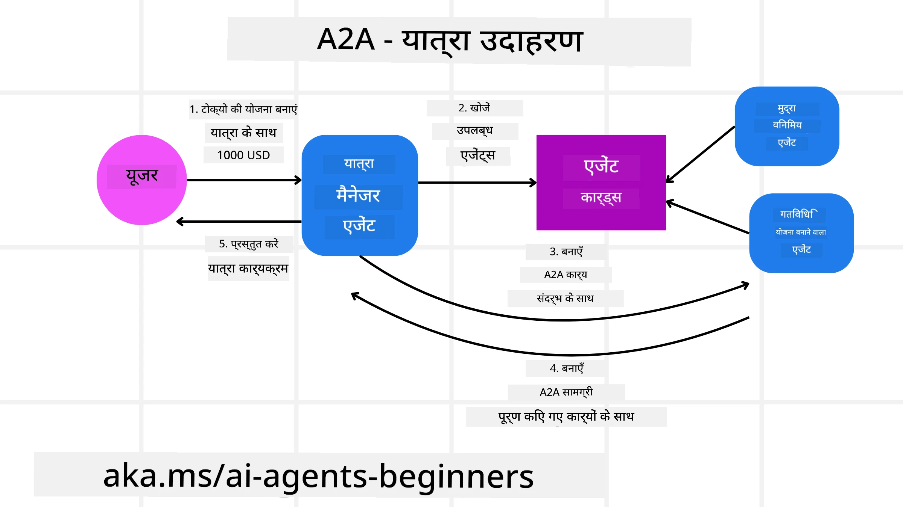
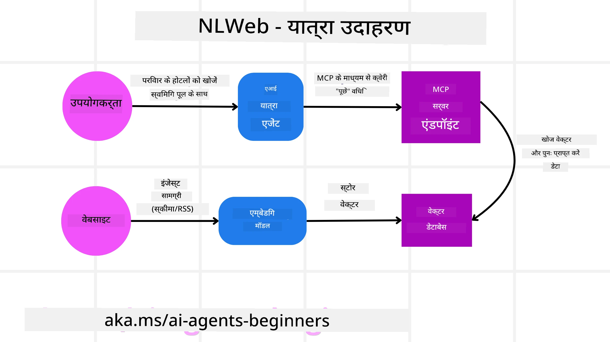

# Using Agentic Protocols (MCP, A2A and NLWeb)

> _(ऊपर की छवि पर क्लिक करके इस पाठ का वीडियो देखें)_

जैसे-जैसे एआई एजेंट्स का उपयोग बढ़ रहा है, मानकीकरण, सुरक्षा और खुली नवाचार का समर्थन सुनिश्चित करने के लिए प्रोटोकॉल की आवश्यकता भी बढ़ रही है। इस पाठ में, हम 3 प्रोटोकॉल को कवर करेंगे जो इस आवश्यकता को पूरा करने की कोशिश कर रहे हैं - Model Context Protocol (MCP), Agent to Agent (A2A) और Natural Language Web (NLWeb)।

## परिचय

इस पाठ में, हम निम्न को कवर करेंगे:

• कैसे **MCP** एआई एजेंट्स को बाहरी टूल्स और डेटा तक पहुँच प्रदान करके उपयोगकर्ता कार्यों को पूरा करने में सक्षम बनाता है।

• कैसे **A2A** विभिन्न एआई एजेंट्स के बीच संचार और सहयोग सक्षम करता है।

• कैसे **NLWeb** किसी भी वेबसाइट पर प्राकृतिक भाषा इंटरफेस लाकर एआई एजेंट्स को सामग्री का पता लगाने और उसके साथ इंटरैक्ट करने में सक्षम बनाता है।

## सीखने के उद्देश्य

• **पहचानें** कि एआई एजेंट्स के संदर्भ में MCP, A2A, और NLWeb का मूल उद्देश्य और लाभ क्या हैं।

• **समझाएँ** कि प्रत्येक प्रोटोकॉल कैसे LLMs, टूल्स, और अन्य एजेंट्स के बीच संचार और इंटरैक्शन की सुविधा प्रदान करता है।

• **पहचानें** कि जटिल एजेंटिक सिस्टम बनाने में प्रत्येक प्रोटोकॉल की अलग भूमिकाएँ क्या हैं।

## Model Context Protocol

**Model Context Protocol (MCP)** एक खुला मानक है जो अनुप्रयोगों को LLMs को संदर्भ और टूल्स प्रदान करने का मानकीकृत तरीका प्रदान करता है। यह विभिन्न डेटा स्रोतों और टूल्स के लिए एक "यूनिवर्सल एडाप्टर" सक्षम बनाता है जिससे एआई एजेंट्स सुसंगत तरीके से जुड़ सकते हैं।

आइए MCP के घटकों, सीधे API उपयोग की तुलना में इसके लाभों, और एक उदाहरण पर नज़र डालें कि एआई एजेंट्स एक MCP सर्वर का कैसे उपयोग कर सकते हैं।

### MCP कोर घटक

MCP एक **क्लाइंट-सर्वर आर्किटेक्चर** पर काम करता है और मूल घटक हैं:

• **Hosts** वे LLM अनुप्रयोग हैं (उदाहरण के लिए VSCode जैसे कोड एडिटर) जो MCP सर्वर के साथ कनेक्शन शुरू करते हैं।

• **Clients** होस्ट एप्लिकेशन के अंदर के घटक हैं जो सर्वरों के साथ एक-से-एक कनेक्शन बनाए रखते हैं।

• **Servers** हल्के प्रोग्राम हैं जो विशिष्ट क्षमताएँ प्रकट करते हैं।

प्रोटोकॉल में तीन मूल प्रिमिटिव शामिल हैं जो MCP सर्वर की क्षमताएँ हैं:

• **Tools**: ये अलग-अलग क्रियाएँ या फ़ंक्शन होते हैं जिन्हें एआई एजेंट किसी कार्रवाई को पूरा करने के लिए कॉल कर सकता है। उदाहरण के लिए, एक मौसम सेवा "get weather" टूल प्रदर्शित कर सकती है, या एक ई-कॉमर्स सर्वर "purchase product" टूल प्रदर्शित कर सकता है। MCP सर्वर अपनी क्षमताओं की सूची में प्रत्येक टूल का नाम, विवरण, और इनपुट/आउटपुट स्कीमा विज्ञापित करते हैं।

• **Resources**: ये केवल-पढ़ने योग्य डेटा आइटम या दस्तावेज़ होते हैं जिन्हें एक MCP सर्वर प्रदान कर सकता है, और क्लाइंट इन्हें माँग पर प्राप्त कर सकते हैं। उदाहरणों में फ़ाइल सामग्री, डेटाबेस रिकॉर्ड, या लॉग फ़ाइलें शामिल हैं। Resources टेक्स्ट (जैसे कोड या JSON) या बाइनरी (जैसे इमेज या PDF) हो सकते हैं।

• **Prompts**: ये पूर्वनिर्धारित टेम्पलेट होते हैं जो सुझाए गए प्रॉम्प्ट प्रदान करते हैं, जिससे अधिक जटिल वर्कफ़्लोज़ की अनुमति मिलती है।

### MCP के लाभ

MCP एआई एजेंट्स के लिए महत्वपूर्ण फायदे प्रदान करता है:

• **डायनमिक टूल डिस्कवरी**: एजेंट्स सर्वर से उपलब्ध टूल्स की एक सूची और उनके क्या करते हैं इसका विवरण डायनमिक रूप से प्राप्त कर सकते हैं। यह पारंपरिक APIs के विपरीत है, जिनके लिए अक्सर एकीकरण के लिए स्थैतिक कोडिंग की आवश्यकता होती है, जिसका अर्थ है कि किसी भी API परिवर्तन के लिए कोड अपडेट की आवश्यकता होती है। MCP "एक बार इंटीग्रेट करें" दृष्टिकोण प्रदान करता है, जिससे अधिक अनुकूलता मिलती है।

• **विभिन्न LLMs में इंटरऑपरेबिलिटी**: MCP विभिन्न LLMs के पार काम करता है, जिससे बेहतर प्रदर्शन का मूल्यांकन करने के लिए मूल मॉडलों को स्विच करने में लचीलापन मिलता है।

• **मानकीकृत सुरक्षा**: MCP में एक मानक प्रमाणीकरण विधि शामिल है, जो अतिरिक्त MCP सर्वरों तक पहुँच जोड़ते समय स्केलबिलिटी में सुधार करती है। यह विभिन्न पारंपरिक APIs के लिए अलग-अलग कुंजियाँ और प्रमाणीकरण प्रकार प्रबंधित करने की तुलना में सरल है।

### MCP उदाहरण

कल्पना करें कि एक उपयोगकर्ता MCP द्वारा संचालित एआई सहायक का उपयोग करके एक फ्लाइट बुक करना चाहता है।

1. **कनेक्शन**: एआई सहायक (MCP क्लाइंट) किसी एयरलाइन द्वारा प्रदान किए गए MCP सर्वर से जुड़ता है।

2. **टूल डिस्कवरी**: क्लाइंट एयरलाइन के MCP सर्वर से पूछता है, "आपके पास कौन-कौन से टूल उपलब्ध हैं?" सर्वर "search flights" और "book flights" जैसे टूल्स के साथ उत्तर देता है।

3. **टूल इनवोकेशन**: आप फिर एआई सहायक से पूछते हैं, "कृपया पोर्टलैंड से होनोलूलू के लिए एक फ्लाइट खोजें।" एआई सहायक, अपने LLM का उपयोग करते हुए, पहचानता है कि उसे "search flights" टूल को कॉल करने की आवश्यकता है और संबंधित पैरामीटर (origin, destination) MCP सर्वर को पास करता है।

4. **एक्जीक्यूशन और रिस्पॉन्स**: MCP सर्वर, एक रैपर के रूप में कार्य करते हुए, एयरलाइन के आंतरिक बुकिंग API को वास्तविक कॉल करता है। फिर यह फ्लाइट जानकारी (जैसे JSON डेटा) प्राप्त करता है और इसे एआई सहायक को वापस भेजता है।

5. **अगला इंटरैक्शन**: एआई सहायक फ्लाइट विकल्प प्रस्तुत करता है। एक बार आप फ्लाइट चुन लें, सहायक उसी MCP सर्वर पर "book flight" टूल को कॉल कर सकता है, बुकिंग पूरी कर देता है।

## Agent-to-Agent Protocol (A2A)

जहां MCP LLMs को टूल्स से जोड़ने पर केंद्रित है, वहीं **Agent-to-Agent (A2A) प्रोटोकॉल** इसे एक कदम आगे ले जाता है और विभिन्न एआई एजेंट्स के बीच संचार और सहयोग सक्षम करता है। A2A विभिन्न संगठनों, वातावरण और टेक स्टैक्स में एजेंट्स को एक साझा कार्य पूरा करने के लिए जोड़ता है।

हम A2A के घटकों और लाभों की जांच करेंगे, साथ ही यह हमारे यात्रा आवेदन में कैसे लागू हो सकता है इसका एक उदाहरण भी देखेंगे।

### A2A कोर घटक

A2A एजेंट्स के बीच संचार सक्षम करने और उन्हें उपयोगकर्ता के उप-कार्य को पूरा करने के लिए एक साथ काम करवाने पर केंद्रित है। प्रोटोकॉल का प्रत्येक घटक इसमें योगदान देता है:

#### Agent Card

जिस तरह एक MCP सर्वर टूल्स की सूची साझा करता है, वैसे ही एक Agent Card में होता है:
- एजेंट का नाम।
- वह **सामान्य कार्यों का विवरण** जो यह पूरा करता है।
- **विशिष्ट कौशलों की सूची** उनके वर्णनों के साथ ताकि अन्य एजेंट्स (या मानव उपयोगकर्ता भी) समझ सकें कि कब और क्यों वे उस एजेंट को कॉल करना चाहेंगे।
- एजेंट का **वर्तमान Endpoint URL**
- एजेंट का **वर्शन** और **क्षमताएँ** जैसे स्ट्रीमिंग रिस्पॉन्स और पुश नोटिफिकेशंस।

#### Agent Executor

Agent Executor के जिम्मे है **यूज़र चैट का संदर्भ रिमोट एजेंट को पास करना**, रिमोट एजेंट को यह समझने के लिए इसकी आवश्यकता होती है कि किस कार्य को पूरा किया जाना है। एक A2A सर्वर में, एक एजेंट अपने ही Large Language Model (LLM) का उपयोग करके आने वाले अनुरोधों का पार्स करता है और अपने आंतरिक टूल्स का उपयोग करके कार्य निष्पादित करता है।

#### Artifact

एक बार जब रिमोट एजेंट अनुरोधित कार्य पूरा कर लेता है, तो उसका कार्य उत्पाद एक आर्टिफैक्ट के रूप में बनाया जाता है। एक आर्टिफैक्ट **एजेंट के कार्य का परिणाम** रखता है, **क्या पूरा किया गया इसका विवरण**, और वह **टेक्स्ट संदर्भ** जो प्रोटोकॉल के माध्यम से भेजा गया था। आर्टिफैक्ट भेजने के बाद, रिमोट एजेंट के साथ कनेक्शन तब तक बंद कर दिया जाता है जब तक इसकी फिर से आवश्यकता न हो।

#### Event Queue

यह घटक **अपडेट्स और संदेश पास करने** के लिए इस्तेमाल होता है। यह उत्पादन में एजेंटिक सिस्टम्स के लिए विशेष रूप से महत्वपूर्ण है ताकि कार्य पूरा होने से पहले एजेंट्स के बीच कनेक्शन बंद न हो जाए, खासकर जब कार्य पूरा होने में लंबा समय लग सकता है।

### A2A के लाभ

• **बेहतर सहयोग**: यह विभिन्न विक्रेताओं और प्लेटफॉर्म्स के एजेंट्स को इंटरैक्ट करने, संदर्भ साझा करने और साथ में काम करने में सक्षम बनाता है, जिससे परंपरागत रूप से अलग सिस्टम्स के बीच निर्बाध ऑटोमेशन संभव होता है।

• **मॉडल चयन की लचीलापन**: प्रत्येक A2A एजेंट यह तय कर सकता है कि वह अपने अनुरोधों को सर्विस देने के लिए कौन सा LLM उपयोग करेगा, जिससे प्रत्येक एजेंट के लिए अनुकूलित या फाइन-ट्यून मॉडल की अनुमति मिलती है, जो कुछ MCP परिदृश्यों में एकल LLM कनेक्शन से अलग है।

• **इनबिल्ट ऑथेंटिकेशन**: प्रमाणीकरण सीधे A2A प्रोटोकॉल में एकीकृत होता है, जो एजेंट इंटरैक्शनों के लिए एक मज़बूत सुरक्षा फ्रेमवर्क प्रदान करता है।

### A2A उदाहरण

आइए हमारे यात्रा बुकिंग परिदृश्य को विस्तारित करें, लेकिन इस बार A2A का उपयोग करते हुए।

1. **उपयोगकर्ता का अनुरोध मल्टी-एजेंट को**: एक उपयोगकर्ता "Travel Agent" A2A क्लाइंट/एजेंट के साथ इंटरैक्ट करता है, शायद कहकर, "कृपया अगली सप्ताह के लिए होनोलूलू के लिए पूरा ट्रिप बुक करें, जिसमें फ्लाइट्स, एक होटल, और एक रेंटल कार शामिल हो"।

2. **Travel Agent द्वारा ऑर्केस्ट्रेशन**: Travel Agent इस जटिल अनुरोध को प्राप्त करता है। यह अपने LLM का उपयोग करते हुए कार्य के बारे में तर्क करता है और तय करता है कि उसे अन्य विशेषज्ञ एजेंट्स के साथ इंटरैक्ट करने की आवश्यकता है।

3. **एजेंट-टू-एजेंट संचार**: Travel Agent तब A2A प्रोटोकॉल का उपयोग करके डाउनस्ट्रीम एजेंट्स से कनेक्ट करता है, जैसे "Airline Agent," "Hotel Agent," और "Car Rental Agent" जो विभिन्न कंपनियों द्वारा बनाए गए होते हैं।

4. **प्रत्याशित कार्य निष्पादन**: Travel Agent इन विशेषज्ञ एजेंट्स को विशिष्ट कार्य भेजता है (उदाहरण के लिए, "Find flights to Honolulu," "Book a hotel," "Rent a car")। प्रत्येक विशेषज्ञ एजेंट अपने स्वयं के LLMs चला रहा होता है और अपने टूल्स (जो स्वयं MCP सर्वर हो सकते हैं) का उपयोग करके बुकिंग का अपना हिस्सा निष्पादित करता है।

5. **एकीकृत उत्तर**: एक बार सभी डाउनस्ट्रीम एजेंट्स अपना कार्य पूरा कर लेते हैं, Travel Agent परिणामों (फ्लाइट विवरण, होटल पुष्टि, कार रेंटल बुकिंग) को संकलित करता है और उपयोगकर्ता को एक समग्र, चैट-शैली उत्तर भेजता है।

## Natural Language Web (NLWeb)

वेबसाइट्स लंबे समय से उपयोगकर्ताओं के लिए इंटरनेट पर जानकारी और डेटा तक पहुँचने का प्राथमिक तरीका रही हैं।

आइए NLWeb के विभिन्न घटकों, NLWeb के लाभों और हमारे NLWeb के काम करने के तरीके का एक उदाहरण देखें जो हमारे यात्रा आवेदन पर आधारित है।

### NLWeb के घटक

- **NLWeb Application (Core Service Code)**: वह सिस्टम जो प्राकृतिक भाषा प्रश्नों को प्रोसेस करता है। यह प्लेटफ़ॉर्म के विभिन्न हिस्सों को जोड़कर प्रतिक्रियाएँ बनाता है। आप इसे किसी वेबसाइट की प्राकृतिक भाषा सुविधाओं को चलाने वाला **इंजन** समझ सकते हैं।

- **NLWeb Protocol**: यह वेबसाइट के साथ प्राकृतिक भाषा इंटरैक्शन के लिए एक **बुनियादी नियमों का सेट** है। यह अक्सर Schema.org का उपयोग करके JSON फ़ॉर्मेट में उत्तर भेजता है। इसका उद्देश्य "एआई वेब" के लिए एक सरल नींव बनाना है, उसी तरह जैसे HTML ने ऑनलाइन दस्तावेज़ साझा करना संभव बनाया।

- **MCP Server (Model Context Protocol Endpoint)**: प्रत्येक NLWeb सेटअप एक **MCP सर्वर** के रूप में भी काम करता है। इसका अर्थ है कि यह अन्य एआई सिस्टम्स के साथ **टूल्स (जैसे कि एक “ask” मेथड) और डेटा** साझा कर सकता है। व्यवहार में, यह वेबसाइट की सामग्री और क्षमताओं को एआई एजेंट्स द्वारा उपयोग योग्य बनाता है, जिससे साइट व्यापक "एजेंट इकोसिस्टम" का हिस्सा बन जाती है।

- **Embedding Models**: इन मॉडलों का उपयोग वेबसाइट सामग्री को संख्यात्मक प्रतिनिधित्वों में परिवर्तित करने के लिए किया जाता है जिन्हें वेक्टर (embeddings) कहा जाता है। ये वेक्टर अर्थ को इस तरह कैप्चर करते हैं कि कंप्यूटर उनकी तुलना और खोज कर सकते हैं। इन्हें एक विशेष डेटाबेस में संग्रहित किया जाता है, और उपयोगकर्ता चुन सकते हैं कि वे कौन सा embedding मॉडल उपयोग करना चाहते हैं।

- **Vector Database (Retrieval Mechanism)**: यह डेटाबेस **वेबसाइट सामग्री के embeddings को स्टोर** करता है। जब कोई प्रश्न पूछता है, तो NLWeb जल्दी से सबसे प्रासंगिक जानकारी खोजने के लिए वेक्टर डेटाबेस की जाँच करता है। यह समानता के आधार पर संभावित उत्तरों की एक शीघ्र सूची देता है। NLWeb विभिन्न वेक्टर स्टोरेज सिस्टम्स के साथ काम करता है जैसे Qdrant, Snowflake, Milvus, Azure AI Search, और Elasticsearch।

### NLWeb उदाहरण के रूप में

फिर से हमारे यात्रा बुकिंग वेबसाइट पर विचार करें, लेकिन इस बार यह NLWeb द्वारा संचालित है।

1. **डेटा इनजेशन**: यात्रा वेबसाइट के मौजूदा प्रोडक्ट कैटलॉग (जैसे फ्लाइट लिस्टिंग, होटल विवरण, टूर पैकेज) को Schema.org का उपयोग करके फॉर्मैट किया जाता है या RSS फीड्स के माध्यम से लोड किया जाता है। NLWeb के टूल्स इस संरचित डेटा को इनजेस्ट करते हैं, embeddings बनाते हैं, और उन्हें लोकल या रिमोट वेक्टर डेटाबेस में स्टोर करते हैं।

2. **प्राकृतिक भाषा क्वेरी (मानव)**: एक उपयोगकर्ता वेबसाइट पर आता है और मेनू नेविगेट करने के बजाय एक चैट इंटरफ़ेस में टाइप करता है: "Find me a family-friendly hotel in Honolulu with a pool for next week"।

3. **NLWeb प्रोसेसिंग**: NLWeb एप्लिकेशन यह क्वेरी प्राप्त करता है। यह समझने के लिए क्वेरी को एक LLM को भेजता है और साथ ही प्रासंगिक होटल लिस्टिंग खोजने के लिए अपने वेक्टर डेटाबेस की भी खोज करता है।

4. **सटीक परिणाम**: LLM डेटाबेस से खोज परिणामों की व्याख्या करने में मदद करता है, "family-friendly", "pool", और "Honolulu" मानदंडों के आधार पर सर्वोत्तम मेल की पहचान करता है, और फिर एक प्राकृतिक भाषा उत्तर को फ़ॉर्मैट करता है। महत्वपूर्ण बात यह है कि उत्तर वेबसाइट के कैटलॉग से वास्तविक होटलों का संदर्भ देता है, काल्पनिक जानकारी से बचते हुए।

5. **एआई एजेंट इंटरैक्शन**: क्योंकि NLWeb एक MCP सर्वर के रूप में कार्य करता है, एक बाहरी एआई ट्रैवल एजेंट भी इस वेबसाइट के NLWeb इंस्टेंस से कनेक्ट कर सकता है। एआई एजेंट तब सीधे साइट से प्रश्न करने के लिए `ask` MCP मेथड का उपयोग कर सकता है: `ask("Are there any vegan-friendly restaurants in the Honolulu area recommended by the hotel?")`। NLWeb इंस्टेंस इसे प्रोसेस करेगा, यदि लोड किया गया हो तो रेस्टोरेंट जानकारी के अपने डेटाबेस का उपयोग करेगा, और एक संरचित JSON रिस्पॉन्स लौटाएगा।

### MCP/A2A/NLWeb के बारे में और प्रश्न हैं?

Join the [Microsoft Foundry Discord](https://aka.ms/ai-agents/discord) to meet with other learners, attend office hours and get your AI Agents questions answered.

## संसाधन

- [MCP for Beginners](https://aka.ms/mcp-for-beginners)  
- [MCP Documentation](https://learn.microsoft.com/python/api/overview/azure/ai-projects-readme)
- [NLWeb Repo](https://github.com/nlweb-ai/NLWeb)
- [Microsoft Agent Framework](https://aka.ms/ai-agents-beginners/agent-framewrok)

---

<!-- CO-OP TRANSLATOR DISCLAIMER START -->
अस्वीकरण:
यह दस्तावेज़ AI अनुवाद सेवा Co-op Translator (https://github.com/Azure/co-op-translator) का उपयोग करके अनुवादित किया गया है। हम सटीकता के लिए प्रयास करते हैं, लेकिन कृपया ध्यान रखें कि स्वचालित अनुवादों में त्रुटियाँ या अशुद्धियाँ हो सकती हैं। मूल भाषा में उपलब्ध दस्तावेज़ को प्रामाणिक स्रोत माना जाना चाहिए। महत्वपूर्ण जानकारी के लिए पेशेवर मानव अनुवाद की सलाह दी जाती है। इस अनुवाद के उपयोग से उत्पन्न किसी भी गलतफहमी या गलत व्याख्या के लिए हम उत्तरदायी नहीं हैं।
<!-- CO-OP TRANSLATOR DISCLAIMER END -->