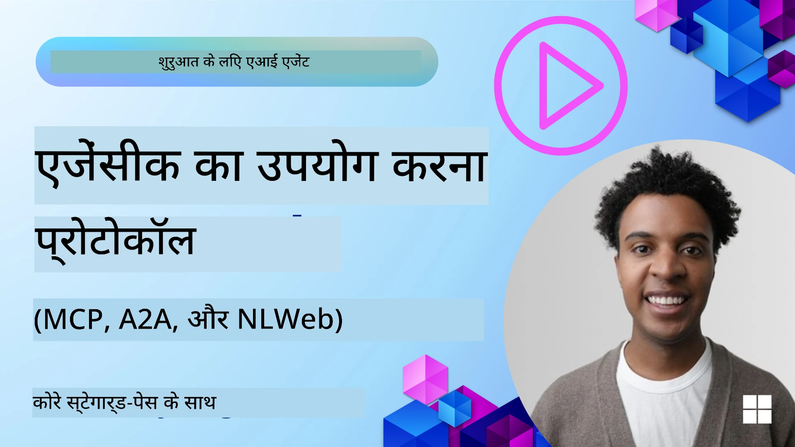
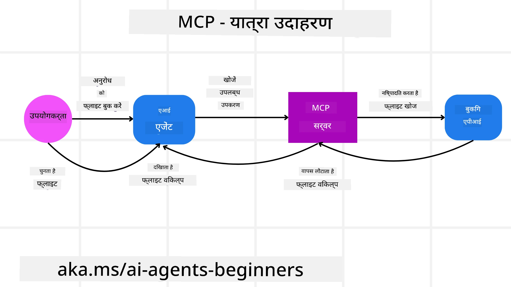
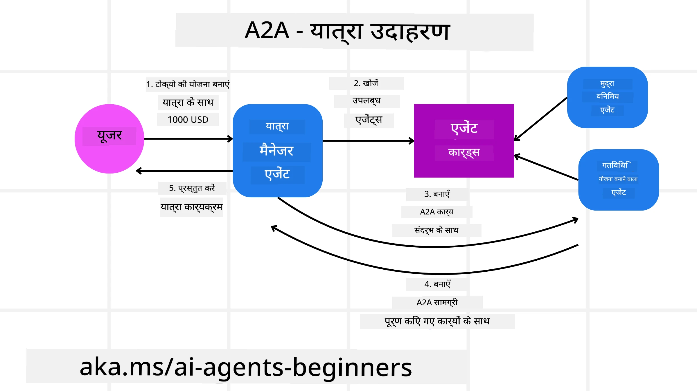
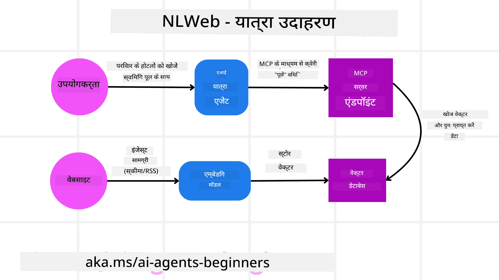

# एजेन्टिक प्रोटोकॉल का उपयोग करना (MCP, A2A और NLWeb)

> _(इस पाठ का वीडियो देखने के लिए ऊपर छवि पर क्लिक करें)_

जैसे-जैसे एआई एजेंट्स का उपयोग बढ़ रहा है, वैसे-वैसे ऐसे प्रोटोकॉल्स की आवश्यकता भी बढ़ रही है जो मानकीकरण, सुरक्षा सुनिश्चित करें और खुले नवाचार का समर्थन करें। इस पाठ में, हम इस आवश्यकता को पूरा करने वाले 3 प्रोटोकॉल्स को कवर करेंगे - मॉडल संदर्भ प्रोटोकॉल (MCP), एजेंट टू एजेंट (A2A) और नेचुरल लैंग्वेज वेब (NLWeb)।

## परिचय

इस पाठ में, हम सीखेंगे:

• कैसे **MCP** एआई एजेंट्स को बाहरी उपकरणों और डेटा तक पहुंच प्रदान करता है ताकि उपयोगकर्ता कार्य पूरे किए जा सकें।

• कैसे **A2A** विभिन्न एआई एजेंट्स के बीच संचार और सहयोग सक्षम करता है।

• कैसे **NLWeb** किसी भी वेबसाइट पर प्राकृतिक भाषा इंटरफेस लाता है जिससे एआई एजेंट्स सामग्री की खोज और बातचीत कर सकते हैं।

## सीखने के लक्ष्य

• एआई एजेंट्स के संदर्भ में MCP, A2A, और NLWeb के मुख्य उद्देश्य और लाभ **पहचानना**।

• प्रत्येक प्रोटोकॉल किस प्रकार LLMs, उपकरणों और अन्य एजेंट्स के बीच संचार और इंटरैक्शन की सुविधा प्रदान करता है, इसे **व्याख्यायित** करना।

• जटिल एजेन्टिक सिस्टम्स के निर्माण में प्रत्येक प्रोटोकॉल की अलग भूमिका को **पहचानना**।

## मॉडल संदर्भ प्रोटोकॉल

**मॉडल संदर्भ प्रोटोकॉल (MCP)** एक खुला मानक है जो एप्लिकेशन्स को LLMs को संदर्भ और उपकरण प्रदान करने का मानकीकृत तरीका देता है। यह "यूनिवर्सल एडाप्टर" के रूप में कार्य करता है जो विभिन्न डेटा स्रोतों और उपकरणों से जुड़ने के लिए एक समान तरीका सुनिश्चित करता है जिससे AI एजेंट्स कनेक्ट हो सकें।

आइए MCP के घटकों, सीधे API उपयोग की तुलना में इसके लाभों, और एक उदाहरण देखें कि कैसे AI एजेंट MCP सर्वर का उपयोग कर सकते हैं।

### MCP के मुख्य घटक

MCP **क्लाइंट-सर्वर आर्किटेक्चर** पर काम करता है और इसके मुख्य घटक हैं:

• **होस्ट्स** वे LLM एप्लिकेशन हैं (जैसे VSCode जैसे कोड एडिटर) जो MCP सर्वर के साथ कनेक्शन शुरू करते हैं।

• **क्लाइंट्स** होस्ट एप्लिकेशन के अंदर के ऐसे घटक हैं जो सर्वर्स के साथ एक-से-एक कनेक्शन बनाए रखते हैं।

• **सर्वर्स** हल्के प्रोग्राम होते हैं जो विशिष्ट क्षमताएं प्रदान करते हैं।

प्रोटोकॉल में तीन मौलिक बातें शामिल हैं जो MCP सर्वर की क्षमताएँ हैं:

• **उपकरण (Tools)**: ये वे विशिष्ट क्रियाएँ या कार्य हैं जिन्हें एक AI एजेंट कॉल कर सकता है। उदाहरण के लिए, एक मौसम सेवा "get weather" टूल प्रदान कर सकती है, या एक ई-कॉमर्स सर्वर "purchase product" टूल। MCP सर्वर हर टूल के नाम, विवरण और इनपुट/आउटपुट स्कीमा को अपनी क्षमताओं की सूची में विज्ञापित करता है।

• **संसाधन (Resources)**: ये वे केवल पढ़ने योग्य डेटा आइटम या दस्तावेज हैं जो MCP सर्वर प्रदान कर सकता है, और क्लाइंट आवश्यकतानुसार इन्हें प्राप्त कर सकते हैं। उदाहरणों में फ़ाइल सामग्री, डेटाबेस रिकॉर्ड्स, या लॉग फ़ाइलें शामिल हैं। संसाधन टेक्स्ट (जैसे कोड या JSON) या बाइनरी (जैसे इमेजेज़ या PDF) हो सकते हैं।

• **प्रॉम्प्ट्स (Prompts)**: ये पूर्वनिर्धारित टेम्पलेट हैं जो सुझावित प्रॉम्प्ट्स प्रदान करते हैं, जिससे जटिल वर्कफ़्लोज़ संभव होते हैं।

### MCP के लाभ

MCP AI एजेंट्स के लिए महत्वपूर्ण लाभ प्रदान करता है:

• **डायनामिक टूल डिस्कवरी**: एजेंट्स सर्वर से उपलब्ध टूल्स की सूची और उनके विवरण को डायनामिक रूप से प्राप्त कर सकते हैं। पारंपरिक APIs के विपरीत, जो स्टैटिक कोडिंग की आवश्यकता होती है, MCP "एक बार इंटीग्रेट करें" की सुविधा देता है जिससे अनुकूलन अधिक आसान होता है।

• **विभिन्न LLMs के बीच इंटरऑपरेबिलिटी**: MCP विभिन्न LLMs के बीच काम करता है, जिससे बेहतर प्रदर्शन के लिए कोर मॉडल स्विच करने की लचक मिलती है।

• **मानकीकृत सुरक्षा**: MCP में मानक प्रमाणीकरण विधि शामिल है, जो अतिरिक्त MCP सर्वर्स को जोड़ते समय स्केलेबिलिटी सुधारती है। यह पारंपरिक API के विभिन्न कुंजी और प्रमाणीकरण प्रकारों को प्रबंधित करने से सरल है।

### MCP का उदाहरण

मान लें कि एक उपयोगकर्ता MCP द्वारा संचालित AI सहायक का उपयोग करके उड़ान बुक करना चाहता है।

1. **कनेक्शन**: AI सहायक (MCP क्लाइंट) एक एयरलाइंस द्वारा प्रदान किए गए MCP सर्वर से जुड़ता है।

2. **टूल डिस्कवरी**: क्लाइंट एयरलाइन के MCP सर्वर से पूछता है, "आपके पास कौन-कौन से टूल उपलब्ध हैं?" सर्वर "search flights" और "book flights" जैसे टूल्स लौटाता है।

3. **टूल कॉल**: आप AI सहायक से कहते हैं, "कृपया पोर्टलैंड से होनोलूलू के लिए उड़ान खोजें।" AI सहायक अपने LLM का उपयोग कर पहचानता है कि उसे "search flights" टूल कॉल करना है और संबंधित पैरामीटर (उद्गम, गंतव्य) MCP सर्वर पर भेजता है।

4. **प्रवर्तन और प्रतिक्रिया**: MCP सर्वर वास्तविक कॉल एयरलाइन की आंतरिक बुकिंग API को करता है, उड़ान जानकारी (जैसे JSON डेटा) प्राप्त करता है और इसे AI सहायक को वापस भेजता है।

5. **अधिक बातचीत**: AI सहायक उड़ान विकल्प प्रस्तुत करता है। जब आप उड़ान चुनते हैं, तो सहायक उसी MCP सर्वर पर "book flight" टूल कॉल कर बुकिंग पूरा करता है।

## एजेंट-टू-एजेंट प्रोटोकॉल (A2A)

जहाँ MCP LLMs को उपकरणों से जोड़ने पर केंद्रित है, **Agent-to-Agent (A2A) प्रोटोकॉल** इसे एक कदम आगे ले जाता है और विभिन्न AI एजेंट्स के बीच संचार और सहयोग सक्षम करता है। A2A विभिन्न संगठनों, वातावरण और तकनीकी स्टैक्स के AI एजेंट्स को एक संयुक्त कार्य पूरा करने के लिए जोड़ता है।

हम A2A के घटकों और लाभों के साथ-साथ हमारे ट्रैवल एप्लिकेशन में इसके प्रयोग का एक उदाहरण भी देखेंगे।

### A2A के मुख्य घटक

A2A एजेंट्स के बीच संचार और उपयोगकर्ता के उप-कार्य को पूरा करने के लिए सहयोग पर केंद्रित है। प्रोटोकॉल के प्रत्येक घटक का योगदान इस प्रकार है:

#### एजेंट कार्ड

जैसा कि MCP सर्वर टूल्स की सूची साझा करता है, एक एजेंट कार्ड में होता है:
- एजेंट का नाम।
- वह **सामान्य कार्यों का विवरण** जो यह पूरा करता है।
- एक **विशिष्ट कौशलों की सूची** जिनका विवरण अन्य एजेंट्स (या मानव उपयोगकर्ताओं) को समझने में मदद करता है कि वे एजेंट को कब और क्यों कॉल करेंगे।
- एजेंट का **वर्तमान एंडपॉइंट URL**
- एजेंट का **संस्करण** और **क्षमता** जैसे स्ट्रीमिंग प्रतिक्रिया और पुश नोटिफिकेशन।

#### एजेंट एक्जीक्यूटर

एजेंट एक्जीक्यूटर का कार्य है **उपयोगकर्ता चैट का संदर्भ दूरस्थ एजेंट तक पहुंचाना**, जिससे दूरस्थ एजेंट को यह समझ में आता है कि कार्य क्या है। A2A सर्वर में, एक एजेंट अपने स्वयं के LLM का उपयोग करता है आने वाले अनुरोधों को पार्स करने और अपने आंतरिक उपकरणों के साथ कार्य करने के लिए।

#### आर्टिफैक्ट

एक बार दूरस्थ एजेंट ने अनुरोधित कार्य पूरा कर लिया, तो उसका कार्य उत्पाद एक आर्टिफैक्ट के रूप में बनाया जाता है। आर्टिफैक्ट में **एजेंट के काम का परिणाम**, पूरा किए गए कार्य का **विवरण**, और प्रोटोकॉल के माध्यम से भेजा गया **टेक्स्ट संदर्भ** होता है। आर्टिफैक्ट भेजने के बाद दूरस्थ एजेंट के साथ कनेक्शन तब तक बंद रहता है जब तक इसे फिर से आवश्यकता न हो।

#### इवेंट क्यू

यह घटक **अपडेट हैंडलिंग और संदेश पास करने** के लिए उपयोग किया जाता है। एजेन्टिक सिस्टम्स में उत्पादन के दौरान यह विशेष रूप से महत्वपूर्ण होता है ताकि कार्य पूर्ण होने से पहले एजेंट्स के बीच कनेक्शन बंद न हो, खासकर जब कार्य पूरा होने में समय ज्यादा लगे।

### A2A के लाभ

• **बेहतर सहयोग**: यह विभिन्न विक्रेताओं और प्लेटफार्मों के एजेंट्स को बातचीत करने, संदर्भ साझा करने और साथ काम करने के लिए सक्षम करता है, जिससे पारंपरिक रूप से अलग सिस्टम्स के बीच सहज स्वचालन सुनिश्चित होता है।

• **मॉडल चयन लचीलापन**: प्रत्येक A2A एजेंट यह तय कर सकता है कि वह किस LLM का उपयोग करके अपनी सेवाएं प्रदान करेगा, जिससे एजेंट की आवश्यकताओं के अनुसार मॉडल बेहतर या सूक्ष्म रूप से अनुकूलित किया जा सकता है, जो कुछ MCP परिदृश्यों से अलग है जहाँ एक LLM कनेक्शन होता है।

• **निर्मित प्रमाणीकरण**: प्रमाणीकरण सीधे A2A प्रोटोकॉल में एकीकृत है, जिससे एजेंट इंटरैक्शन के लिए एक मजबूत सुरक्षा ढांचा मिलता है।

### A2A का उदाहरण

चलिए हमारे ट्रैवल बुकिंग परिदृश्य को और विस्तार देते हैं, इस बार A2A का उपयोग करके।

1. **कई एजेंटों को उपयोगकर्ता का अनुरोध**: एक उपयोगकर्ता "ट्रैवल एजेंट" A2A क्लाइंट/एजेंट से बातचीत करता है, संभवतः कहता है, "कृपया अगले सप्ताह होनोलूलू की पूरी यात्रा बुक करें, जिसमें उड़ानें, होटल, और कार रेंटल शामिल हैं।"

2. **ट्रैवल एजेंट द्वारा संचालन**: ट्रैवल एजेंट इस जटिल अनुरोध को प्राप्त करता है। वह अपने LLM का उपयोग कार्य के तर्क के लिए करता है और निर्धारित करता है कि उसे अन्य विशेषज्ञ एजेंटों से संपर्क करना होगा।

3. **एजेंटों के बीच संचार**: ट्रैवल एजेंट A2A प्रोटोकॉल का उपयोग करके डाउनस्ट्रीम एजेंट्स जैसे "एयरलाइन एजेंट," "होटल एजेंट," और "कार रेंटल एजेंट" से जुड़ता है, जो विभिन्न कंपनियों द्वारा बनाए गए हैं।

4. **कार्य का प्रतिनिधित्व**: ट्रैवल एजेंट इन विशेषज्ञ एजेंटों को विशिष्ट कार्य भेजता है (जैसे, "होनोलूलू के लिए उड़ान खोजें," "होटल बुक करें," "कार किराए पर लें")। ये सभी विशेषज्ञ एजेंट अपने स्वयं के LLM और उपकरण (जो स्वयं MCP सर्वर्स हो सकते हैं) का उपयोग करके बुकिंग का अपना विशेष हिस्सा पूरा करते हैं।

5. **संक्षिप्त प्रतिक्रिया**: एक बार सभी डाउनस्ट्रीम एजेंट्स अपने कार्य पूरा कर लें, ट्रैवल एजेंट परिणामों (उड़ान विवरण, होटल पुष्टि, कार रेंटल बुकिंग) को संकलित करता है और उपयोगकर्ता को एक व्यापक, चैट-शैली प्रतिक्रिया भेजता है।

## नेचुरल लैंग्वेज वेब (NLWeb)

वेबसाइट्स लंबे समय से इंटरनेट पर उपयोगकर्ताओं के लिए जानकारी और डेटा तक पहुंच का प्राथमिक तरीका रही हैं।

आइए हम NLWeb के विभिन्न घटकों, NLWeb के लाभों और अपने ट्रैवल एप्लिकेशन को देखकर यह कैसे काम करता है, इसका उदाहरण देखें।

### NLWeb के घटक

- **NLWeb एप्लिकेशन (कोर सेवा कोड)**: वह प्रणाली जो प्राकृतिक भाषा के प्रश्नों को संसाधित करती है। यह प्लेटफ़ॉर्म के विभिन्न भागों को जोड़कर प्रतिक्रियाएं बनाती है। इसे आप वेबसाइट की प्राकृतिक भाषा सुविधाओं को संचालित करने वाले इंजन के रूप में सोच सकते हैं।

- **NLWeb प्रोटोकॉल**: यह वेबसाइट के साथ प्राकृतिक भाषा इंटरैक्शन के लिए **नियमों का बुनियादी सेट** है। यह JSON फ़ॉर्मेट (अक्सर Schema.org का उपयोग करते हुए) में प्रतिक्रिया भेजता है। इसका उद्देश्य "AI वेब" के लिए एक सरल आधार बनाना है, ठीक वैसे ही जैसे HTML ने ऑनलाइन दस्तावेज़ साझा करना संभव बनाया।

- **MCP सर्वर (मॉडल संदर्भ प्रोटोकॉल एंडपॉइंट)**: प्रत्येक NLWeb सेटअप एक **MCP सर्वर** के रूप में भी काम करता है। इसका मतलब है कि यह अन्य AI सिस्टम्स के साथ **उपकरण (जैसे “ask” मेथड) और डेटा साझा कर सकता है**। व्यवहार में, यह वेबसाइट की सामग्री और क्षमताओं को AI एजेंट्स के लिए उपयोगी बनाता है, जिससे साइट व्यापक “एजेंट生态系统” का हिस्सा बन जाती है।

- **एम्बेडिंग मॉडल्स**: ये मॉडल वेबसाइट की सामग्री को संख्यात्मक रूप में बदलने के लिए उपयोग किए जाते हैं, जिसे वेक्टर (एम्बेडिंग्स) कहते हैं। ये वेक्टर अर्थ को इस तरह कैप्चर करते हैं जिसे कंप्यूटर तुलना और खोज सके। इन्हें एक विशेष डेटाबेस में संग्रहीत किया जाता है, और उपयोगकर्ता चुन सकते हैं कि वे कौन सा एम्बेडिंग मॉडल उपयोग करना चाहते हैं।

- **वेक्टर डेटाबेस (रिकवरी मेकैनिज्म)**: यह डेटाबेस वेबसाइट की सामग्री के एम्बेडिंग्स को संग्रहीत करता है। जब कोई प्रश्न पूछता है, तो NLWeb वेक्टर डेटाबेस को जल्दी से सबसे प्रासंगिक जानकारी खोजने के लिए जांचता है। यह संभावित उत्तरों की एक तेज़ सूची प्रदान करता है, समानता के अनुसार रैंक की गई। NLWeb विभिन्न वेक्टर स्टोरेज सिस्टम्स जैसे Qdrant, Snowflake, Milvus, Azure AI Search, और Elasticsearch के साथ काम करता है।

### NLWeb का उदाहरण

फिर से हमारी ट्रैवल बुकिंग वेबसाइट पर विचार करें, लेकिन इस बार इसे NLWeb द्वारा संचालित किया गया है।

1. **डेटा इनटेक**: ट्रैवल वेबसाइट के मौजूदा उत्पाद कैटलॉग (जैसे उड़ान सूची, होटल विवरण, टूअर पैकेज) को Schema.org का उपयोग करके स्वरूपित किया गया है या RSS फीड्स के माध्यम से लोड किया गया है। NLWeb के उपकरण इस संरचित डेटा को ग्रहण करते हैं, एम्बेडिंग्स बनाते हैं, और उन्हें स्थानीय या दूरस्थ वेक्टर डेटाबेस में संग्रहीत करते हैं।

2. **प्राकृतिक भाषा क्वेरी (मानव)**: एक उपयोगकर्ता वेबसाइट पर आता है और मेनू के बजाय चैट इंटरफ़ेस में टाइप करता है: "मुझे होनोलूलू में अगले सप्ताह के लिए एक परिवार के अनुकूल होटल खोजो जिसमें पूल हो।"

3. **NLWeb प्रोसेसिंग**: NLWeb एप्लिकेशन इस क्वेरी को प्राप्त करता है। यह क्वेरी को समझने के लिए LLM को भेजता है और साथ ही अपने वेक्टर डेटाबेस में प्रासंगिक होटल सूची खोजता है।

4. **सटीक परिणाम**: LLM डेटाबेस से खोज परिणामों की व्याख्या करता है, "परिवार के अनुकूल," "पूल," और "होनोलूलू" मापदंडों के आधार पर सर्वश्रेष्ठ मेल पहचानता है, और फिर एक प्राकृतिक भाषा में उत्तर तैयार करता है। महत्वपूर्ण रूप से, प्रतिक्रिया वेबसाइट के कैटलॉग में वास्तविक होटलों का हवाला देती है, न कि मनगढ़ंत जानकारी।

5. **AI एजेंट इंटरैक्शन**: चूंकि NLWeb एक MCP सर्वर के रूप में काम करता है, एक बाहरी AI ट्रैवल एजेंट भी इस वेबसाइट के NLWeb उदाहरण से कनेक्ट हो सकता है। AI एजेंट `ask` MCP मेथड का उपयोग करके सीधे वेबसाइट से प्रश्न पूछ सकता है: `ask("क्या होनोलूलू क्षेत्र में होटल द्वारा सुझाए गए कोई वेगन-फ्रेंडली रेस्टोरेंट हैं?")`। NLWeb इसका प्रसंस्करण करेगा, अपनी रेस्टोरेंट जानकारी की डेटाबेस का उपयोग करते हुए (यदि लोड किया गया हो), और संरचित JSON प्रतिक्रिया लौटाएगा।

### MCP/A2A/NLWeb के बारे में और सवाल हैं?

अन्य शिक्षार्थियों से मिलने, कार्यालय समय में भाग लेने और अपने AI एजेंट के सवालों के जवाब पाने के लिए [Microsoft Foundry Discord](https://discord.com/invite/ATgtXmAS5D) से जुड़ें।

## संसाधन

- [MCP for Beginners](https://aka.ms/mcp-for-beginners)  
- [MCP Documentation](https://learn.microsoft.com/python/api/overview/azure/ai-projects-readme)
- [NLWeb Repo](https://github.com/nlweb-ai/NLWeb)
- [Microsoft Agent Framework](https://learn.microsoft.com/en-us/agent-framework/overview/?wt.mc_id=youtube_26688_organicsocial_reactor&pivots=programming-language-python)

## पिछला पाठ

[AI Agents in Production](../10-ai-agents-production/README.md)

## अगला पाठ

[Context Engineering for AI Agents](../12-context-engineering/README.md)

---

<!-- CO-OP TRANSLATOR DISCLAIMER START -->
**अस्वीकरण**:
इस दस्तावेज़ का अनुवाद AI अनुवाद सेवा [Co-op Translator](https://github.com/Azure/co-op-translator) का उपयोग करके किया गया है। जबकि हम सटीकता के लिए प्रयास करते हैं, कृपया ध्यान दें कि स्वचालित अनुवादों में त्रुटियाँ या अशुद्धियाँ हो सकती हैं। मूल दस्तावेज़ अपनी मूल भाषा में ही प्रामाणिक स्रोत माना जाना चाहिए। महत्वपूर्ण जानकारी के लिए, पेशेवर मानव अनुवाद की सिफारिश की जाती है। इस अनुवाद के उपयोग से उत्पन्न किसी भी गलतफहमी या गलत व्याख्या के लिए हम उत्तरदायी नहीं हैं।
<!-- CO-OP TRANSLATOR DISCLAIMER END -->