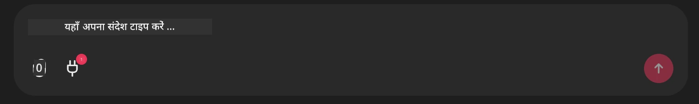

# Github MCP सर्वर उदाहरण

## विवरण

यह Microsoft Reactor के माध्यम से आयोजित AI Agents Hackathon के लिए बनाया गया एक डेमो था।

यह टूल उपयोगकर्ता के Github रेपो के आधार पर हैकथॉन प्रोजेक्ट्स की सिफारिश करने के लिए उपयोग किया जाता है।
यह निम्नलिखित द्वारा किया जाता है:

1. **Github Agent** - Github MCP सर्वर का उपयोग करके रेपो और उन रेपो के बारे में जानकारी प्राप्त करना।
2. **Hackathon Agent** - Github Agent से प्राप्त डेटा लेता है और प्रोजेक्ट्स, उपयोगकर्ता द्वारा उपयोग की गई भाषाओं और AI Agents हैकथॉन के प्रोजेक्ट ट्रैक्स के आधार पर रचनात्मक हैकथॉन प्रोजेक्ट आइडियाज़ बनाता है।
3. **Events Agent** - Hackathon एजेंट के सुझावों के आधार पर, इवेंट्स एजेंट AI Agent Hackathon सीरीज़ से संबंधित इवेंट्स की सिफारिश करेगा।
## कोड चलाना 

### पर्यावरण वेरिएबल्स

यह डेमो Microsoft Agent Framework, Azure OpenAI Service, Github MCP Server और Azure AI Search का उपयोग करता है।

सुनिश्चित करें कि इन टूल्स का उपयोग करने के लिए आपके पास आवश्यक एनवायरनमेंट वेरिएबल सेट हैं:

```python
AZURE_AI_PROJECT_ENDPOINT=""
AZURE_AI_MODEL_DEPLOYMENT_NAME=""
AZURE_SEARCH_SERVICE_ENDPOINT=""
AZURE_SEARCH_API_KEY=""
``` 

## Chainlit सर्वर चलाना

MCP सर्वर से कनेक्ट करने के लिए, यह डेमो चैट इंटरफ़ेस के रूप में Chainlit का उपयोग करता है। 

सर्वर चलाने के लिए, अपने टर्मिनल में निम्न कमांड का उपयोग करें:

```bash
chainlit run app.py -w
```

यह आपके Chainlit सर्वर को `localhost:8000` पर शुरू कर देगा और साथ ही आपके Azure AI Search Index को `event-descriptions.md` की सामग्री से भर देगा। 

## MCP सर्वर से कनेक्ट करना

Github MCP Server से कनेक्ट करने के लिए, "यहाँ अपना संदेश टाइप करें.." चैट बॉक्स के नीचे स्थित "प्लग" आइकन का चयन करें:



वहाँ से आप "एक MCP कनेक्ट करें" पर क्लिक करके Github MCP Server से कनेक्ट करने का कमांड जोड़ सकते हैं:

```bash
npx -y @modelcontextprotocol/server-github --env GITHUB_PERSONAL_ACCESS_TOKEN=[YOUR PERSONAL ACCESS TOKEN]
```

Replace "[YOUR PERSONAL ACCESS TOKEN]" with your actual Personal Access Token. 

कनेक्ट करने के बाद, पुष्टिकरण के लिए आपको प्लग आइकन के बगल में (1) दिखना चाहिए। यदि नहीं, तो `chainlit run app.py -w` के साथ chainlit सर्वर को रीस्टार्ट करने का प्रयास करें।

## डेमो का उपयोग 

हैकथॉन प्रोजेक्ट्स की सिफारिश करने वाले एजेंट वर्कफ़्लो को शुरू करने के लिए, आप इस तरह का संदेश टाइप कर सकते हैं: 

"Github उपयोगकर्ता koreyspace के लिए हैकथॉन प्रोजेक्ट्स सुझाएँ"

Router Agent आपकी अनुरोध का विश्लेषण करेगा और यह निर्धारित करेगा कि किस एजेंट्स के संयोजन (GitHub, Hackathon, और Events) आपकी क्वेरी को संभालने के लिए सबसे उपयुक्त है। एजेंट मिलकर GitHub रिपॉज़िटरी विश्लेषण, प्रोजेक्ट आइडियेशन और संबंधित टेक इवेंट्स के आधार पर व्यापक सिफारिशें प्रदान करते हैं।

---

<!-- CO-OP TRANSLATOR DISCLAIMER START -->
अस्वीकरण:
यह दस्तावेज़ AI अनुवाद सेवा Co-op Translator (https://github.com/Azure/co-op-translator) का उपयोग करके अनूदित किया गया है। हम सटीकता के लिए प्रयास करते हैं, पर कृपया ध्यान दें कि स्वचालित अनुवादों में त्रुटियाँ या अशुद्धियाँ हो सकती हैं। मूल दस्तावेज़ अपनी मूल भाषा में प्रामाणिक स्रोत माना जाना चाहिए। महत्वपूर्ण जानकारी के लिए पेशेवर मानवीय अनुवाद की सिफारिश की जाती है। इस अनुवाद के उपयोग से उत्पन्न किसी भी गलतफहमी या गलत अर्थ निकालने के लिए हम उत्तरदायी नहीं हैं।
<!-- CO-OP TRANSLATOR DISCLAIMER END -->