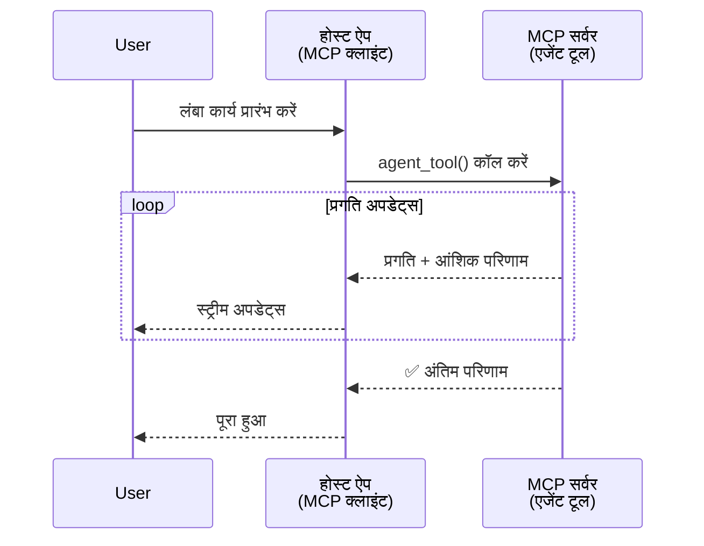
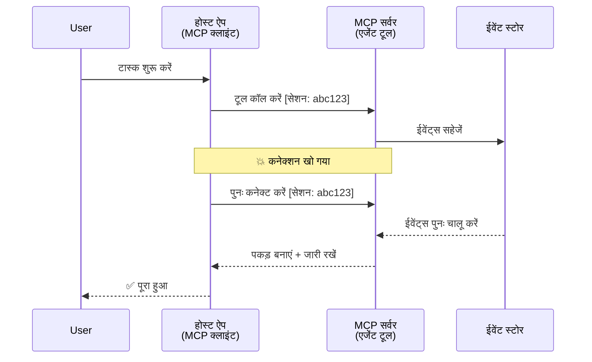
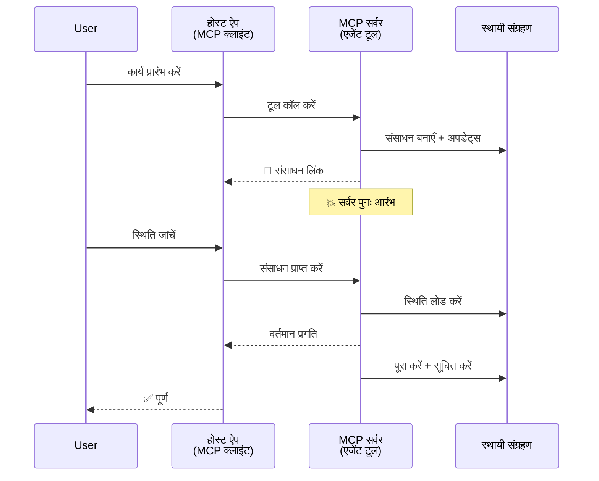
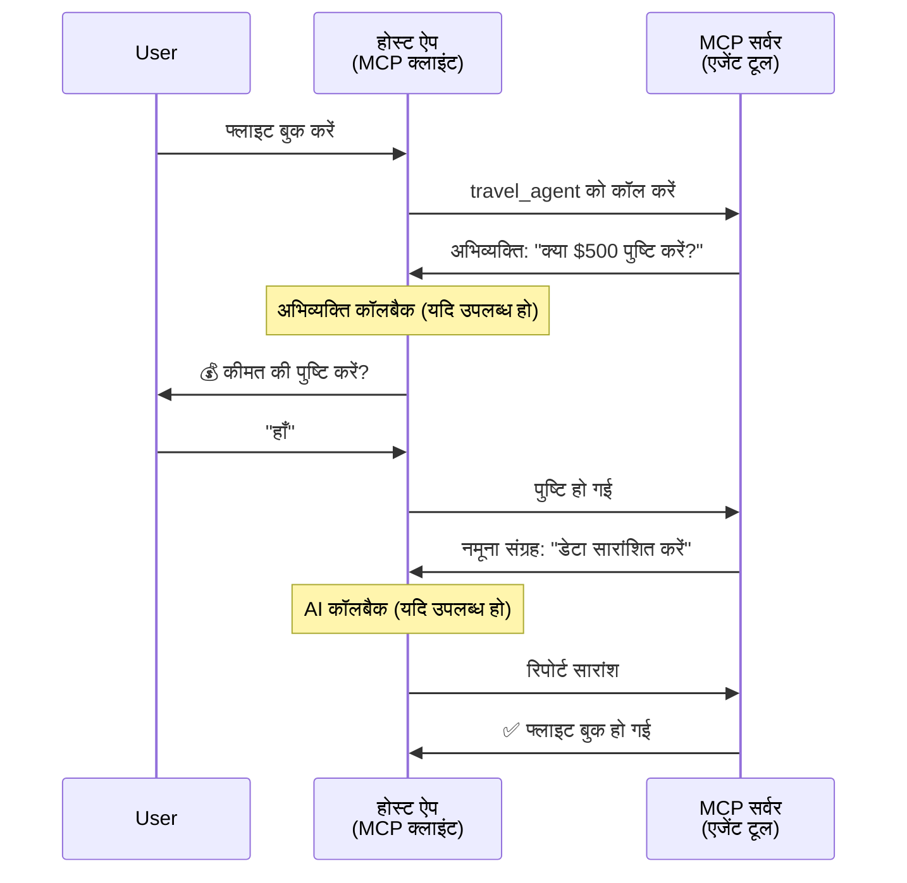
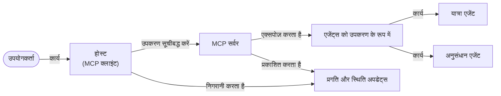

# MCP के साथ एजेंट-टू-एजेंट संचार प्रणाली बनाना

> TL;DR - क्या आप MCP पर एजेंट2एजेंट संचार बना सकते हैं? हाँ!

MCP ने "LLMs को संदर्भ प्रदान करने" के अपने मूल उद्देश्य से काफी आगे विकास किया है। हाल की सुधारों में [रिज़्यूमेंबल स्ट्रीम्स](https://modelcontextprotocol.io/docs/concepts/transports#resumability-and-redelivery), [प्रेरणा](https://modelcontextprotocol.io/specification/2025-06-18/client/elicitation), [सेम्पलिंग](https://modelcontextprotocol.io/specification/2025-06-18/client/sampling), और सूचनाएं ([प्रगति](https://modelcontextprotocol.io/specification/2025-06-18/basic/utilities/progress) और [संसाधन](https://modelcontextprotocol.io/specification/2025-06-18/schema#resourceupdatednotification)) शामिल हैं, MCP अब जटिल एजेंट-टू-एजेंट संचार प्रणालियां बनाने के लिए एक मजबूत आधार प्रदान करता है।

## एजेंट/टूल भ्रम

जैसे-जैसे अधिक डेवलपर्स एजेंटिक व्यवहार वाले टूल्स का पता लगाते हैं (लंबे समय तक चलना, निष्पादन के दौरान अतिरिक्त इनपुट की आवश्यकता हो सकती है, आदि), एक सामान्य भ्रांति यह है कि MCP अनुपयुक्त है क्योंकि इसके प्रारंभिक उदाहरणों में टूल्स का प्राथमिक ध्यान सरल अनुरोध-प्रतिक्रिया पैटर्न पर था।

यह धारणा पुरानी हो चुकी है। हाल के महीनों में MCP विनिर्देशन को काफी बढ़ाया गया है, जिन क्षमताओं ने लंबे समय तक चलने वाले एजेंटिक व्यवहार के लिए अंतर को पाट दिया है:

- **स्ट्रीमिंग और आंशिक परिणाम**: निष्पादन के दौरान वास्तविक-समय प्रगति अपडेट
- **रिज़्यूमेबिलिटी**: क्लाइंट डिसकनेक्शन के बाद पुनः कनेक्ट और जारी रखने की क्षमता
- **स्थायित्व**: परिणाम सर्वर पुनः प्रारंभ के बाद भी सुरक्षित रहते हैं (उदा., संसाधन लिंक के माध्यम से)
- **मल्टी-टर्न**: प्रेरणा और सेम्पलिंग के जरिए निष्पादन के दौरान इंटरैक्टिव इनपुट

ये सुविधाएँ मिलकर जटिल एजेंटिक और मल्टी-एजेंट अनुप्रयोगों को सक्षम कर सकती हैं, सभी MCP प्रोटोकॉल पर तैनात।

संदर्भ के लिए, हम एक एजेंट को "टूल" कहते हैं जो MCP सर्वर पर उपलब्ध होता है। इसका अर्थ है कि एक होस्ट एप्लीकेशन मौजूद है जो MCP क्लाइंट को लागू करता है, जो MCP सर्वर के साथ सेशन स्थापित करता है और एजेंट को कॉल कर सकता है।

## एक MCP टूल को "एजेंटिक" क्या बनाता है?

लागू करने से पहले, आइए निर्धारित करें कि लंबे समय तक चलने वाले एजेंटों का समर्थन करने के लिए किन अवसंरचना क्षमताओं की जरूरत है।

> हम एक एजेंट को उस इकाई के रूप में परिभाषित करेंगे जो स्वतंत्र रूप से लंबे समय तक कार्य कर सकती है, जो जटिल कार्यों को संभालने में सक्षम है जिनके लिए कई इंटरैक्शन या वास्तविक-समय प्रतिक्रिया के आधार पर समायोजन की आवश्यकता हो सकती है।

### 1. स्ट्रीमिंग और आंशिक परिणाम

पारंपरिक अनुरोध-प्रतिक्रिया पैटर्न लंबे समय तक चलने वाले कार्यों के लिए काम नहीं करते। एजेंटों को प्रदान करने की जरूरत होती है:

- वास्तविक-समय प्रगति अपडेट
- मध्यवर्ती परिणाम

**MCP समर्थन**: संसाधन अपडेट सूचनाएं आंशिक परिणामों को स्ट्रीमिंग करने में सक्षम बनाती हैं, हालांकि JSON-RPC के 1:1 अनुरोध/प्रतिक्रिया मॉडल के साथ संघर्ष से बचने के लिए सावधानी से डिजाइन आवश्यक है।

| फीचर                      | उपयोग मामला                                                                                                                                | MCP समर्थन                                                                       |
| -------------------------- | ----------------------------------------------------------------------------------------------------------------------------------------- | ---------------------------------------------------------------------------------- |
| वास्तविक-समय प्रगति अपडेट  | उपयोगकर्ता कोडबेस माइग्रेशन कार्य का अनुरोध करता है। एजेंट प्रगति स्ट्रीम करता है: "10% - निर्भरता विश्लेषण... 25% - टाइपस्क्रिप्ट फाइलें कन्वर्ट कर रहा है... 50% - इम्पोर्ट अपडेट कर रहा है..." | ✅ प्रगति सूचनाएं                                                                  |
| आंशिक परिणाम               | "एक किताब जनरेट करें" कार्य आंशिक परिणाम स्ट्रीम करता है, जैसे 1) कहानी रेखाचित्र, 2) अध्याय सूची, 3) प्रत्येक अध्याय पूरा होते ही। होस्ट किसी भी चरण पर निरीक्षण, रद्द या पुनः निर्देशित कर सकता है। | ✅ सूचनाएं "मॉडिफाईड" हो सकती हैं आंशिक परिणामों को शामिल करने के लिए, PR 383, 776 देखें |

<div align="center" style="font-style: italic; font-size: 0.95em; margin-bottom: 0.5em;">
<strong>आकृति 1:</strong> यह आरेख दिखाता है कि एक MCP एजेंट कैसे लंबे समय तक चलने वाले कार्य के दौरान होस्ट एप्लीकेशन को वास्तविक-समय प्रगति अपडेट और आंशिक परिणाम स्ट्रीम करता है, जिससे उपयोगकर्ता को निष्पादन की निगरानी करने की सुविधा मिलती है।
</div>



### 2. रिज़्यूमेबिलिटी

एजेंटों को नेटवर्क व्यवधानों को सहजता से संभालना चाहिए:

- (क्लाइंट) डिसकनेक्शन के बाद पुनः कनेक्ट करें
- जहां छोड़ा था वहां से जारी रखें (संदेश पुनः वितरण)

**MCP समर्थन**: आज MCP StreamableHTTP ट्रांसपोर्ट सेशन पुनः आरंभ और संदेश पुनः वितरण का समर्थन करता है, सेशन ID और अंतिम इवेंट ID के साथ। महत्वपूर्ण बात यह है कि सर्वर को एक EventStore को लागू करना होगा जो क्लाइंट पुनः कनेक्शन पर इवेंट पुनः चलाने की अनुमति देता हो।
ध्यान दें कि एक सामुदायिक प्रस्ताव (PR #975) तंत्र-agnostic रिज़्यूमेबल स्ट्रीम की खोज करता है।

| फीचर         | उपयोग मामला                                                                                                                                         | MCP समर्थन                                                                   |
| ------------ | ---------------------------------------------------------------------------------------------------------------------------------------------------- | ----------------------------------------------------------------------------- |
| रिज़्यूमेबिलिटी | लंबी अवधि वाले कार्य के दौरान क्लाइंट डिस्कनेक्ट हो जाता है। पुनः कनेक्शन पर, सेशन जारी रहता है और छूटे हुए इवेंट्स को पुनः चलाता है, बिना प्रगति खोए। | ✅ StreamableHTTP ट्रांसपोर्ट सेशन IDs के साथ, इवेंट रिप्ले और EventStore       |

<div align="center" style="font-style: italic; font-size: 0.95em; margin-bottom: 0.5em;">
<strong>आकृति 2:</strong> यह आरेख दिखाता है कि MCP का StreamableHTTP ट्रांसपोर्ट और इवेंट स्टोर कैसे सहज सेशन पुनः आरंभ को सक्षम करते हैं: यदि क्लाइंट डिस्कनेक्ट होता है, तो वह पुनः कनेक्ट कर छूटे हुए इवेंट्स को पुनः चला सकता है, बिना प्रगति खोए।
</div>



### 3. स्थायित्व

लंबे कार्य चलाने वाले एजेंटों को स्थायी स्थिति की आवश्यकता होती है:

- परिणाम सर्वर पुनः प्रारंभ के बाद भी सुरक्षित रहते हैं
- स्थिति बाहर से प्राप्त की जा सकती है
- सेशनों के बीच प्रगति ट्रैकिंग

**MCP समर्थन**: MCP अब टूल कॉल के लिए संसाधन लिंक रिटर्न प्रकार का समर्थन करता है। आज, एक संभावित पैटर्न है कि एक टूल डिज़ाइन करें जो संसाधन बनाए और तुरंत संसाधन लिंक लौटाए। टूल पृष्ठभूमि में कार्य जारी रख सकता है और संसाधन को अपडेट कर सकता है। इसके बदले, क्लाइंट इस संसाधन की स्थिति को पोल कर सकता है आंशिक या पूर्ण परिणाम प्राप्त करने के लिए (जो भी संसाधन अपडेट सर्वर प्रदान करता है) या अपडेट सूचनाओं के लिए संसाधन को सब्सक्राइब कर सकता है।

यहां एक सीमा यह है कि संसाधन पोलिंग या अपडेट के लिए सब्सक्रिप्शन संसाधन खपत कर सकता है, जिसका पैमाने पर प्रभाव पड़ सकता है। एक खुला सामुदायिक प्रस्ताव (जिसमें #992 भी शामिल है) वेबहुक्स या ट्रिगर्स को शामिल करने की संभावना पर विचार कर रहा है, जिन्हें सर्वर ग्राहक/होस्ट एप्लिकेशन को अपडेट्स की सूचना देने के लिए कॉल कर सकता है।

| फीचर       | उपयोग मामला                                                                                                                                      | MCP समर्थन                                                      |
| ---------- | ------------------------------------------------------------------------------------------------------------------------------------------------- | ---------------------------------------------------------------- |
| स्थायित्व  | डेटा माइग्रेशन कार्य के दौरान सर्वर क्रैश हो जाता है। परिणाम और प्रगति पुनः प्रारंभ के बाद भी सुरक्षित रहती है, क्लाइंट स्थिति चेक कर सकता है और संसाधन के आधार पर जारी रख सकता है। | ✅ संसाधन लिंक स्थायी भंडारण और स्थिति सूचनाओं के साथ           |

आज, एक सामान्य पैटर्न है कि टूल डिज़ाइन करें जो संसाधन बनाए और तुरंत संसाधन लिंक लौटाए। टूल पृष्टभूमि में कार्य को संबोधित करता है, जैसे प्रगति अपडेट के रूप में संसाधन सूचनाएं जारी करता है या आंशिक परिणाम शामिल करता है, और जरूरत के अनुसार संसाधन की सामग्री अपडेट करता है।

<div align="center" style="font-style: italic; font-size: 0.95em; margin-bottom: 0.5em;">
<strong>आकृति 3:</strong> यह आरेख दिखाता है कि कैसे MCP एजेंट स्थायी संसाधनों और स्थिति सूचनाओं का उपयोग करके सुनिश्चित करते हैं कि लंबे समय तक चलने वाले कार्य सर्वर पुनः प्रारंभ के बाद भी जीवित रहते हैं, जिससे क्लाइंट प्रगति जांच और परिणाम पुनः प्राप्त कर सकते हैं।
</div>



### 4. मल्टी-टर्न इंटरैक्शंस

एजेंटों को अक्सर निष्पादन के दौरान अतिरिक्त इनपुट की आवश्यकता होती है:

- मानव स्पष्टीकरण या अनुमोदन
- जटिल निर्णयों के लिए AI सहायता
- गतिशील पैरामीटर समायोजन

**MCP समर्थन**: सेम्पलिंग (AI इनपुट के लिए) और प्रेरणा (मानव इनपुट के लिए) के माध्यम से पूर्ण समर्थन।

| फीचर                 | उपयोग मामला                                                                                                                                    | MCP समर्थन                                             |
| --------------------- | --------------------------------------------------------------------------------------------------------------------------------------------- | ------------------------------------------------------- |
| मल्टी-टर्न इंटरैक्शंस | ट्रैवल बुकिंग एजेंट उपयोगकर्ता से मूल्य पुष्टि मांगता है, फिर बुकिंग संपन्न करने से पहले ट्रैवल डेटा का सारांश बनाने के लिए AI से पूछता है। | ✅ प्रेरणा मानव इनपुट के लिए, सेम्पलिंग AI इनपुट के लिए |

<div align="center" style="font-style: italic; font-size: 0.95em; margin-bottom: 0.5em;">
<strong>आकृति 4:</strong> यह आरेख दिखाता है कि कैसे MCP एजेंट निष्पादन के बीच मानवीय इनपुट प्राप्त करने या AI सहायता का अनुरोध करने के लिए इंटरैक्टिव रूप से प्रेरणा और सेम्पलिंग का उपयोग कर सकते हैं, जो पुष्टि और गतिशील निर्णय लेने जैसे जटिल, मल्टी-टर्न वर्कफ़्लो का समर्थन करता है।
</div>



## MCP पर लंबे समय तक चलने वाले एजेंटों को कार्यान्वित करना - कोड अवलोकन

इस लेख के भाग के रूप में, हम एक [कोड रिपॉजिटरी](https://github.com/victordibia/ai-tutorials/tree/main/MCP%20Agents) प्रदान करते हैं जो MCP Python SDK के साथ StreamableHTTP ट्रांसपोर्ट का उपयोग करके लंबे समय तक चलने वाले एजेंटों के पूर्ण कार्यान्वयन को शामिल करता है, जो सेशन पुनः आरंभ और संदेश पुनः वितरण को सक्षम करता है। यह कार्यान्वयन दिखाता है कि MCP क्षमताएँ एजेंट जैसे उन्नत व्यवहारों को सक्षम करने के लिए कैसे रचित की जा सकती हैं।

विशेष रूप से, हम दो मुख्य एजेंट टूल्स वाला सर्वर कार्यान्वित करते हैं:

- **ट्रैवल एजेंट** - प्रेरणा के माध्यम से मूल्य पुष्टि के साथ ट्रैवल बुकिंग सेवा का अनुकरण
- **रिसर्च एजेंट** - सेम्पलिंग के प्रभाव AI-सहायता प्राप्त सारांशों के साथ अनुसंधान कार्य करता है

दोनों एजेंट वास्तविक-समय प्रगति अपडेट, इंटरैक्टिव पुष्टिकरण और पूर्ण सेशन पुनः आरंभ क्षमताओं को प्रदर्शित करते हैं।

### मुख्य कार्यान्वयन अवधारणाएं

निम्न अनुभाग प्रत्येक क्षमता के लिए सर्वर-साइड एजेंट कार्यान्वयन और क्लाइंट-साइड होस्ट हैंडलिंग दिखाते हैं:

#### स्ट्रीमिंग और प्रगति अपडेट्स - वास्तविक-समय कार्य स्थिति

स्ट्रीमिंग एजेंटों को लंबी अवधि वाले कार्यों के दौरान वास्तविक-समय प्रगति अपडेट प्रदान करने में सक्षम बनाता है, उपयोगकर्ताओं को कार्य स्थिति और मध्यवर्ती परिणामों की जानकारी देता है।

**सर्वर कार्यान्वयन (एजेंट प्रगति सूचनाएं भेजता है):**

```python
# सर्वर/server.py से - यात्रा एजेंट प्रगति अपडेट भेज रहा है
for i, step in enumerate(steps):
    await ctx.session.send_progress_notification(
        progress_token=ctx.request_id,
        progress=i * 25,
        total=100,
        message=step,
        related_request_id=str(ctx.request_id)
    )
    await anyio.sleep(2)  # काम का अनुकरण करें

# विकल्प: चरण-दर-चरण अपडेट के लिए लॉग संदेश रिकॉर्ड करें
await ctx.session.send_log_message(
    level="info",
    data=f"Processing step {current_step}/{steps} ({progress_percent}%)",
    logger="long_running_agent",
    related_request_id=ctx.request_id,
)
```

**क्लाइंट कार्यान्वयन (होस्ट प्रगति अपडेट प्राप्त करता है):**

```python
# client/client.py से - क्लाइंट जो रीयल-टाइम नोटिफिकेशन को संभालता है
async def message_handler(message) -> None:
    if isinstance(message, types.ServerNotification):
        if isinstance(message.root, types.LoggingMessageNotification):
            console.print(f"📡 [dim]{message.root.params.data}[/dim]")
        elif isinstance(message.root, types.ProgressNotification):
            progress = message.root.params
            console.print(f"🔄 [yellow]{progress.message} ({progress.progress}/{progress.total})[/yellow]")

# सेशन बनाते समय संदेश हैंडलर पंजीकृत करें
async with ClientSession(
    read_stream, write_stream,
    message_handler=message_handler
) as session:
```

#### प्रेरणा - उपयोगकर्ता इनपुट का अनुरोध

प्रेरणा एजेंटों को निष्पादन के दौरान उपयोगकर्ता इनपुट का अनुरोध करने में सक्षम बनाती है। यह लंबे समय तक चलने वाले कार्यों के दौरान पुष्टि, स्पष्टीकरण, या अनुमोदन के लिए आवश्यक है।

**सर्वर कार्यान्वयन (एजेंट पुष्टि का अनुरोध करता है):**

```python
# सर्वर/server.py से - यात्रा एजेंट मूल्य पुष्टि का अनुरोध कर रहा है
elicit_result = await ctx.session.elicit(
    message=f"Please confirm the estimated price of $1200 for your trip to {destination}",
    requestedSchema=PriceConfirmationSchema.model_json_schema(),
    related_request_id=ctx.request_id,
)

if elicit_result and elicit_result.action == "accept":
    # बुकिंग के साथ जारी रखें
    logger.info(f"User confirmed price: {elicit_result.content}")
elif elicit_result and elicit_result.action == "decline":
    # बुकिंग रद्द करें
    booking_cancelled = True
```

**क्लाइंट कार्यान्वयन (होस्ट प्रेरणा कॉलबैक प्रदान करता है):**

```python
# client/client.py से - ग्राहक हैंडलिंग अनुरोध elicitation
async def elicitation_callback(context, params):
    console.print(f"💬 Server is asking for confirmation:")
    console.print(f"   {params.message}")

    response = console.input("Do you accept? (y/n): ").strip().lower()

    if response in ['y', 'yes']:
        return types.ElicitResult(
            action="accept",
            content={"confirm": True, "notes": "Confirmed by user"}
        )
    else:
        return types.ElicitResult(
            action="decline",
            content={"confirm": False, "notes": "Declined by user"}
        )

# सत्र बनाते समय कॉलबैक पंजीकृत करें
async with ClientSession(
    read_stream, write_stream,
    elicitation_callback=elicitation_callback
) as session:
```

#### सेम्पलिंग - AI सहायता का अनुरोध

सेम्पलिंग एजेंटों को जटिल निर्णय या सामग्री निर्माण के लिए LLM सहायता का अनुरोध करने की अनुमति देता है। इससे हाइब्रिड मानव-AI वर्कफ़्लो सक्षम होते हैं।

**सर्वर कार्यान्वयन (एजेंट AI सहायता का अनुरोध करता है):**

```python
# सर्वर/server.py से - अनुसंधान एजेंट AI सारांश का अनुरोध कर रहा है
sampling_result = await ctx.session.create_message(
    messages=[
        SamplingMessage(
            role="user",
            content=TextContent(type="text", text=f"Please summarize the key findings for research on: {topic}")
        )
    ],
    max_tokens=100,
    related_request_id=ctx.request_id,
)

if sampling_result and sampling_result.content:
    if sampling_result.content.type == "text":
        sampling_summary = sampling_result.content.text
        logger.info(f"Received sampling summary: {sampling_summary}")
```

**क्लाइंट कार्यान्वयन (होस्ट सेम्पलिंग कॉलबैक प्रदान करता है):**

```python
# client/client.py से - ग्राहक हैंडलिंग सैंपलिंग अनुरोध
async def sampling_callback(context, params):
    message_text = params.messages[0].content.text if params.messages else 'No message'
    console.print(f"🧠 Server requested sampling: {message_text}")

    # एक वास्तविक अनुप्रयोग में, यह एक LLM API कॉल कर सकता है
    # डेमो उद्देश्यों के लिए, हम एक नकली प्रतिक्रिया प्रदान करते हैं
    mock_response = "Based on current research, MCP has evolved significantly..."

    return types.CreateMessageResult(
        role="assistant",
        content=types.TextContent(type="text", text=mock_response),
        model="interactive-client",
        stopReason="endTurn"
    )

# सत्र बनाते समय कॉलबैक पंजीकृत करें
async with ClientSession(
    read_stream, write_stream,
    sampling_callback=sampling_callback,
    elicitation_callback=elicitation_callback
) as session:
```

#### रिज़्यूमेबिलिटी - डिसकनेक्शन के बाद सेशन निरंतरता

रिज़्यूमेबिलिटी सुनिश्चित करता है कि लंबे समय तक चलने वाले एजेंट कार्य क्लाइंट डिसकनेक्शन से जीवित रहते हैं और पुनः कनेक्शन पर बिना किसी बाधा के जारी रह सकते हैं। यह घटना स्टोर और पुनः आरंभ टोकन के माध्यम से लागू किया जाता है।

**इवेंट स्टोर कार्यान्वयन (सर्वर सेशन स्थिति रखता है):**

```python
# server/event_store.py से - सरल इन-मेमोरी इवेंट स्टोर
class SimpleEventStore(EventStore):
    def __init__(self):
        self._events: list[tuple[StreamId, EventId, JSONRPCMessage]] = []
        self._event_id_counter = 0

    async def store_event(self, stream_id: StreamId, message: JSONRPCMessage) -> EventId:
        """Store an event and return its ID."""
        self._event_id_counter += 1
        event_id = str(self._event_id_counter)
        self._events.append((stream_id, event_id, message))
        return event_id

    async def replay_events_after(self, last_event_id: EventId, send_callback: EventCallback) -> StreamId | None:
        """Replay events after the specified ID for resumption."""
        start_index = None
        stream_id = None
        for index, (event_stream_id, event_id, _) in enumerate(self._events):
            if event_id == last_event_id:
                start_index = index + 1
                stream_id = event_stream_id
                break

        if start_index is None:
            return None

        # केवल बाद के इवेंट्स को सत्र के मूल स्ट्रीम से रिप्ले करें।
        for event_stream_id, event_id, message in self._events[start_index:]:
            if event_stream_id != stream_id:
                continue
            await send_callback(EventMessage(message, event_id))

        return stream_id

# server/server.py से - इवेंट स्टोर को सत्र प्रबंधक को पास करना
def create_server_app(event_store: Optional[EventStore] = None) -> Starlette:
    server = ResumableServer()

    # पुनरारंभ के लिए ईवेंट स्टोर के साथ सत्र प्रबंधक बनाएं
    session_manager = StreamableHTTPSessionManager(
        app=server,
        event_store=event_store,  # ईवेंट स्टोर सत्र पुनरारंभ सक्षम करता है
        json_response=False,
        security_settings=security_settings,
    )

    return Starlette(routes=[Mount("/mcp", app=session_manager.handle_request)])

# उपयोग: ईवेंट स्टोर के साथ प्रारंभ करें
event_store = SimpleEventStore()
app = create_server_app(event_store)
```

**रिज़्यूमे टोकन के साथ क्लाइंट मेटाडेटा (क्लाइंट स्थान-पराधीन स्थिति का उपयोग कर पुनः कनेक्ट होता है):**

```python
# client/client.py से - मेटाडेटा के साथ क्लाइंट पुनरारंभ
if existing_tokens and existing_tokens.get("resumption_token"):
    # जहां छोड़ा था वहां से जारी रखने के लिए मौजूदा पुनरारंभ टोकन का उपयोग करें
    metadata = ClientMessageMetadata(
        resumption_token=existing_tokens["resumption_token"],
    )
else:
    # पुनरारंभ टोकन प्राप्त होने पर उसे सहेजने के लिए कॉलबैक बनाएं
    def enhanced_callback(token: str):
        protocol_version = getattr(session, 'protocol_version', None)
        token_manager.save_tokens(session_id, token, protocol_version, command, args)

    metadata = ClientMessageMetadata(
        on_resumption_token_update=enhanced_callback,
    )

# पुनरारंभ मेटाडेटा के साथ अनुरोध भेजें
result = await session.send_request(
    types.ClientRequest(
        types.CallToolRequest(
            method="tools/call",
            params=types.CallToolRequestParams(name=command, arguments=args)
        )
    ),
    types.CallToolResult,
    metadata=metadata,
)
```

होस्ट एप्लीकेशन स्थानीय रूप से सेशन IDs और रिज़्यूमे टोकन रखती है, जिससे यह बिना प्रगति या स्थिति खोए मौजूदा सेशनों से पुनः जुड़ सकती है।

### कोड संगठन

<div align="center" style="font-style: italic; font-size: 0.95em; margin-bottom: 0.5em;">
<strong>आकृति 5:</strong> MCP आधारित एजेंट सिस्टम आर्किटेक्चर
</div>



**मुख्य फ़ाइलें:**

- **`server/server.py`** - ट्रैवल और रिसर्च एजेंटों के साथ रिज़्यूमेबल MCP सर्वर जो प्रेरणा, सेम्पलिंग, और प्रगति अपडेट दिखाता है
- **`client/client.py`** - इंटरैक्टिव होस्ट एप्लीकेशन रिज़्यूमे समर्थन, कॉलबैक हैंडलर्स, और टोकन प्रबंधन के साथ
- **`server/event_store.py`** - इवेंट स्टोर कार्यान्वयन जो सेशन रिज़्यूमे और संदेश पुनः वितरण सक्षम करता है

## MCP पर मल्टी-एजेंट संचार के लिए विस्तार

ऊपर दिया गया कार्यान्वयन होस्ट एप्लीकेशन की बुद्धिमत्ता और परिधि बढ़ाकर मल्टी-एजेंट सिस्टम तक विस्तारित किया जा सकता है:

- **बुद्धिमान कार्य विखंडन**: होस्ट जटिल उपयोगकर्ता अनुरोधों का विश्लेषण करता है और उन्हें विभिन्न विशेषज्ञ एजेंटों के लिए उप-कामों में विभाजित करता है
- **मल्टी-सर्वर समन्वय**: होस्ट कई MCP सर्वरों से कनेक्शन बनाए रखता है, प्रत्येक विभिन्न एजेंट क्षमताओं को प्रदर्शित करता है
- **कार्य स्थिति प्रबंधन**: होस्ट कई समवर्ती एजेंट कार्यों के बीच प्रगति ट्रैक करता है, निर्भरताओं और अनुक्रमण को संभालता है
- **लचीलेपन और पुनः प्रयास**: होस्ट विफलताओं को संभालता है, पुनः प्रयास तर्क लागू करता है, और जब एजेंट अनुपलब्ध हो जाते हैं तो कार्यों को फिर से मार्गदर्शित करता है
- **परिणाम संश्लेषण**: होस्ट कई एजेंटों से आउटपुट को सुसंगत अंतिम परिणामों में संयोजित करता है

होस्ट एक सरल क्लाइंट से विकसित होकर एक बुद्धिमान समन्वयक बन जाता है, जो वितरित एजेंट क्षमताओं का समन्वय करता है जबकि वही MCP प्रोटोकॉल आधार बनाए रखता है।

## निष्कर्ष

MCP की बढ़ी हुई क्षमताएं - संसाधन सूचनाएं, प्रेरणा/सेम्पलिंग, पुनः आरंभ योग्य स्ट्रीम्स, और स्थायी संसाधन - जटिल एजेंट-टू-एजेंट इंटरैक्शन सक्षम करती हैं, जबकि प्रोटोकॉल की सरलता बनाए रखती हैं।

## शुरुवात कैसे करें

क्या आप अपना एजेंट2एजेंट सिस्टम बनाना चाहते हैं? इन चरणों का पालन करें:

### 1. डेमो चलाएं

```bash
# पुनरारंभ के लिए ईवेंट स्टोर के साथ सर्वर शुरू करें
python -m server.server --port 8006

# दूसरे टर्मिनल में, इंटरैक्टिव क्लाइंट चलाएं
python -m client.client --url http://127.0.0.1:8006/mcp
```

**इंटरैक्टिव मोड में उपलब्ध कमांड:**

- `travel_agent` - प्रेरणा के माध्यम से मूल्य पुष्टि के साथ यात्रा बुक करें
- `research_agent` - AI-सहायता प्राप्त सारांश के साथ विषयों पर शोध करें
- `list` - सभी उपलब्ध टूल दिखाएं
- `clean-tokens` - रिज़्यूमे टोकन साफ़ करें
- `help` - विस्तृत कमांड सहायता दिखाएं
- `quit` - क्लाइंट से बाहर निकलें

### 2. रिज़्यूमे क्षमताओं का परीक्षण करें

- एक लंबे समय तक चलने वाले एजेंट (जैसे `travel_agent`) को शुरू करें
- निष्पादन के दौरान क्लाइंट को इंटरप्ट करें (Ctrl+C)
- क्लाइंट को पुनः शुरू करें - यह अपने आप वहीं से पुनः आरंभ हो जाएगा जहां से छोड़ा था

### 3. अन्वेषण करें और विस्तार करें

- **उदाहरनों का अन्वेषण करें**: इस [mcp-agents](https://github.com/victordibia/ai-tutorials/tree/main/MCP%20Agents) को देखें
- **समुदाय में शामिल हों**: GitHub पर MCP चर्चाओं में भाग लें
- **प्रयोग करें**: एक सरल लंबे चलने वाले कार्य से शुरू करें और धीरे-धीरे स्ट्रीमिंग, रिज़्यूमेबिलिटी, और मल्टी-एजेंट समन्वय जोड़ें

यह दिखाता है कि MCP कैसे बुद्धिमान एजेंट व्यवहारों को सक्षम करता है जबकि टूल-आधारित सरलता बनाए रखता है।

समग्र रूप से, MCP प्रोटोकॉल स्पेक तेजी से विकसित हो रहा है; पाठक को अनुशंसा की जाती है कि वे नवीनतम अपडेट के लिए आधिकारिक दस्तावेज़ वेबसाइट देखे - https://modelcontextprotocol.io/introduction

---

<!-- CO-OP TRANSLATOR DISCLAIMER START -->
**अस्वीकरण**:
इस दस्तावेज़ का अनुवाद AI अनुवाद सेवा [Co-op Translator](https://github.com/Azure/co-op-translator) का उपयोग करके किया गया है। जबकि हम सटीकता के लिए प्रयास करते हैं, कृपया ध्यान दें कि स्वचालित अनुवादों में त्रुटियाँ या अशुद्धियाँ हो सकती हैं। मूल दस्तावेज़ अपनी मूल भाषा में ही प्रामाणिक स्रोत माना जाना चाहिए। महत्वपूर्ण जानकारी के लिए, पेशेवर मानव अनुवाद की सिफारिश की जाती है। इस अनुवाद के उपयोग से उत्पन्न किसी भी गलतफहमी या गलत व्याख्या के लिए हम उत्तरदायी नहीं हैं।
<!-- CO-OP TRANSLATOR DISCLAIMER END -->