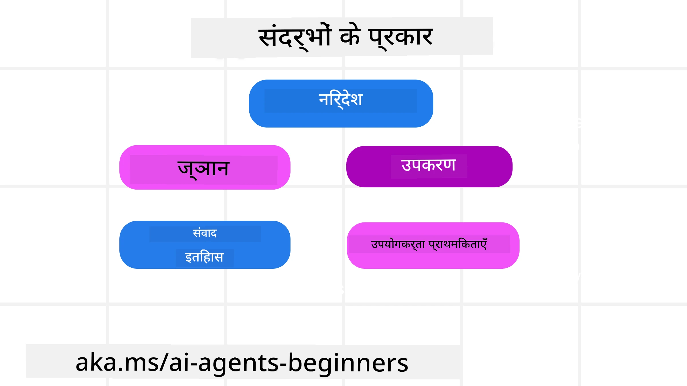
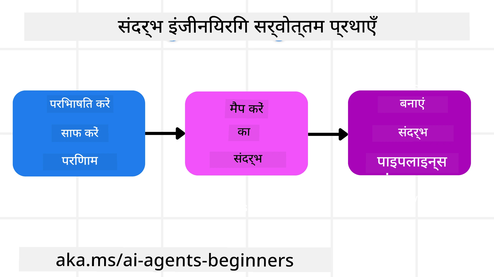

# एआई एजेंट्स के लिए संदर्भ इंजीनियरिंग

> _(इस पाठ का वीडियो देखने के लिए ऊपर दी गई छवि पर क्लिक करें)_

जिस एप्लिकेशन के लिए आप एआई एजेंट बना रहे हैं उसकी जटिलता को समझना एक भरोसेमंद एजेंट बनाने के लिए महत्वपूर्ण है। हमें ऐसे एआई एजेंट बनाने की आवश्यकता है जो प्रभावी ढंग से जानकारी प्रबंधित कर सकें ताकि जटिल आवश्यकताओं को पूरा किया जा सके, जो केवल प्रॉम्प्ट इंजीनियरिंग से परे हैं।

इस पाठ में, हम देखेंगे कि संदर्भ इंजीनियरिंग क्या है और एआई एजेंट बनाने में इसका क्या रोल है।

## परिचय

इस पाठ में इस विषयों को कवर किया जाएगा:

• **संदर्भ इंजीनियरिंग क्या है** और यह प्रॉम्प्ट इंजीनियरिंग से कैसे भिन्न है।

• **प्रभावी संदर्भ इंजीनियरिंग के लिए रणनीतियाँ**, जिसमें जानकारी लिखने, चुनने, संपीड़ित करने और पृथक्करण करने के तरीके शामिल हैं।

• **सामान्य संदर्भ विफलताएं** जो आपके एआई एजेंट को बाधित कर सकती हैं और उन्हें कैसे ठीक किया जाए।

## सीखने के लक्ष्य

इस पाठ को पूरा करने के बाद, आप समझ पाएंगे कि कैसे:

• **संदर्भ इंजीनियरिंग को परिभाषित करें** और इसे प्रॉम्प्ट इंजीनियरिंग से अलग करें।

• बड़े भाषा मॉडल (LLM) अनुप्रयोगों में संदर्भ के महत्वपूर्ण घटकों की पहचान करें।

• एजेंट के प्रदर्शन में सुधार के लिए संदर्भ को लिखने, चुनने, संपीड़ित करने और पृथक करने की रणनीतियों को लागू करें।

• सामान्य संदर्भ विफलताओं जैसे कि जहराकरण, ध्यान भटकाना, भ्रम, और टकराव को पहचानें और उनसे निपटने के उपाय लागू करें।

## संदर्भ इंजीनियरिंग क्या है?

एआई एजेंट्स के लिए, संदर्भ वह कारक है जो एजेंट को कुछ विशेष कार्य करने की योजना बनाता है। संदर्भ इंजीनियरिंग इस प्रथा को कहते हैं जिसमें यह सुनिश्चित किया जाता है कि एआई एजेंट के पास अगला कार्य पूरा करने के लिए सही जानकारी हो। संदर्भ विंडो आकार में सीमित होती है, इसलिए एजेंट बिल्डर्स को ऐसे सिस्टम और प्रक्रियाएं विकसित करनी होती हैं जो संदर्भ विंडो में जानकारी जोड़ने, हटाने और संक्षिप्त करने का प्रबंधन करें।

### प्रॉम्प्ट इंजीनियरिंग बनाम संदर्भ इंजीनियरिंग

प्रॉम्प्ट इंजीनियरिंग एक स्थिर निर्देशों के सेट पर केंद्रित होती है जो एआई एजेंट्स को नियमों के साथ प्रभावी ढंग से मार्गदर्शन करती है। संदर्भ इंजीनियरिंग यह प्रबंधन करती है कि कैसे समय के साथ गतिशील जानकारी के सेट को, जिसमें प्रारंभिक प्रॉम्प्ट भी शामिल है, संभाला जाए ताकि एजेंट के पास आवश्यक जानकारी बनी रहे। संदर्भ इंजीनियरिंग का मुख्य उद्देश्य इस प्रक्रिया को दोहराने योग्य और विश्वसनीय बनाना है।

### संदर्भ के प्रकार

यह याद रखना महत्वपूर्ण है कि संदर्भ केवल एक चीज़ नहीं है। एआई एजेंट को जिन सूचनाओं की आवश्यकता हो सकती है वे विभिन्न स्रोतों से आ सकती हैं और यह हमारे ऊपर निर्भर है कि हम एजेंट को इन स्रोतों तक पहुंच प्रदान करें:

एआई एजेंट को प्रबंधित करना पड़ने वाले संदर्भ के प्रकार निम्नलिखित हैं:

• **निर्देश:** ये एजेंट के "नियम" जैसे होते हैं – प्रॉम्प्ट, सिस्टम मैसेज, कुछ उदाहरण (जैसे एआई को कुछ करने का तरीका दिखाना), और उन टूल्स के विवरण जिन्हें एजेंट उपयोग कर सकता है। यही वह स्थान है जहाँ प्रॉम्प्ट इंजीनियरिंग और संदर्भ इंजीनियरिंग का समन्वय होता है।

• **ज्ञान:** इसमें तथ्य, डेटाबेस से प्राप्त जानकारी, या एजेंट द्वारा संचित दीर्घकालिक स्मृतियाँ शामिल हैं। इसमें Retrieval Augmented Generation (RAG) सिस्टम का समावेश भी हो सकता है यदि एजेंट को विभिन्न ज्ञान स्रोतों और डेटाबेस तक पहुंच चाहिए।

• **टूल्स:** ये बाहरी कार्य, एपीआई और MCP सर्वरों की परिभाषाएं हैं जिन्हें एजेंट कॉल कर सकता है, और उनसे प्राप्त प्रतिक्रिया (परिणाम)।

• **संवाद इतिहास:** उपयोगकर्ता के साथ चल रही बातचीत। समय के साथ ये बातचीत लंबी और अधिक जटिल होती जाती हैं, जो संदर्भ विंडो में जगह घेरती है।

• **उपयोगकर्ता प्राथमिकताएं:** समय के साथ उपयोगकर्ता के पसंद और नापसंद के बारे में जानकारी। ये संग्रहीत की जा सकती हैं और प्राथमिक निर्णयों में उपयोगकर्ता की सहायता के लिए बुलाया जा सकता है।

## प्रभावी संदर्भ इंजीनियरिंग के लिए रणनीतियाँ

### योजना बनाना

अच्छी संदर्भ इंजीनियरिंग अच्छी योजना से शुरू होती है। यहाँ एक दृष्टिकोण दिया गया है जो आपको संदर्भ इंजीनियरिंग के सिद्धांत को लागू करने के बारे में सोचने में मदद करेगा:

1. **स्पष्ट परिणाम परिभाषित करें** - उन कार्यों के परिणाम जिन्हें एआई एजेंट को सौंपा जाएगा, स्पष्ट रूप से परिभाषित करें। प्रश्न का उत्तर दें - "जब एआई एजेंट अपना कार्य पूरा कर लेगा तो दुनिया कैसी दिखेगी?" दूसरे शब्दों में, उपयोगकर्ता के लिए एआई एजेंट के साथ बातचीत के बाद क्या परिवर्तन, जानकारी या प्रतिक्रिया होनी चाहिए।

2. **संदर्भ की योजना बनाएं** - जब आपने एजेंट के परिणाम परिभाषित कर लिए, तो यह जानना जरूरी है कि "इस कार्य को पूरा करने के लिए एजेंट को किस जानकारी की आवश्यकता है?" इस तरह आप उस जानकारी के स्रोतों का मानचित्रित कर सकते हैं।

3. **संदर्भ पाइपलाइनों का निर्माण करें** - एक बार जब आप जानते हैं कि जानकारी कहाँ है, तो प्रश्न यह है, "एजेंट यह जानकारी कैसे प्राप्त करेगा?" इसे कई तरीकों से किया जा सकता है, जिनमें RAG, MCP सर्वर और अन्य टूल्स का उपयोग शामिल है।

### व्यावहारिक रणनीतियाँ

योजना बनाना आवश्यक है, लेकिन जब जानकारी एजेंट के संदर्भ विंडो में प्रवाहित होने लगती है, तो हमें इसे प्रबंधित करने के लिए व्यावहारिक रणनीतियाँ अपनानी होती हैं:

#### संदर्भ प्रबंधन

कुछ जानकारी स्वचालित रूप से संदर्भ विंडो में जोड़ी जाएगी, लेकिन संदर्भ इंजीनियरिंग इस जानकारी पर अधिक सक्रिय भूमिका निभाने के बारे में है, जो निम्न रणनीतियों से किया जा सकता है:

1. **एजेंट स्क्रैचपैड**  
यह एआई एजेंट को एकल सत्र के दौरान वर्तमान कार्यों और उपयोगकर्ता संवादों के बारे में प्रासंगिक नोट्स लेने की अनुमति देता है। यह संदर्भ विंडो के बाहर एक फ़ाइल या रनटाइम ऑब्जेक्ट के रूप में होना चाहिए जिसे एजेंट बाद में उसी सत्र में जरूरत पड़ने पर पुनः प्राप्त कर सके।

2. **स्मृतियाँ**  
स्क्रैचपैड एकल सत्र के संदर्भ विंडो के बाहर जानकारी प्रबंधित करने के लिए उपयोगी हैं। स्मृतियाँ एजेंटों को कई सत्रों में प्रासंगिक जानकारी संग्रहीत और पुनः प्राप्त करने की अनुमति देती हैं। इसमें सारांश, उपयोगकर्ता प्राथमिकताएं, और भविष्य के लिए सुधार संबंधी प्रतिक्रियाएँ शामिल हो सकती हैं।

3. **संदर्भ संपीड़न**  
जब संदर्भ विंडो बढ़ती है और उसकी सीमा के करीब पहुंचती है, तो संक्षेपण और ट्रिमिंग जैसी तकनीकों का उपयोग किया जा सकता है। इसमें सबसे प्रासंगिक जानकारी रखना या पुरानी सूचनाओं को हटाना शामिल है।

4. **मल्टी-एजेंट सिस्टम**  
मल्टी-एजेंट सिस्टम विकसित करना संदर्भ इंजीनियरिंग का एक रूप है क्योंकि प्रत्येक एजेंट की अपनी संदर्भ विंडो होती है। यह योजना बनाना महत्वपूर्ण है कि यह संदर्भ कैसे साझा और विभिन्न एजेंटों को सौंपा जाए।

5. **सैंडबॉक्स वातावरण**  
अगर एजेंट को कोई कोड चलाना हो या दस्तावेज़ में बड़ी मात्रा में जानकारी संसाधित करनी हो, तो यह टोकन की बड़ी मात्रा ले सकता है। इसके बजाय, एजेंट एक सैंडबॉक्स वातावरण का उपयोग कर सकता है जो कोड चला सके और केवल परिणाम और अन्य प्रासंगिक जानकारियाँ पढ़े।

6. **रनटाइम स्टेट ऑब्जेक्ट्स**  
यह जानकारी के कंटेनर बनाने से किया जाता है ताकि एजेंट को कुछ विशेष जानकारी की आवश्यकता हो तो वह उसे प्रबंधित कर सके। जटिल कार्यों के लिए, यह प्रत्येक उप-कार्य के परिणामों को क्रमबद्ध रूप से संग्रहीत करने की अनुमति देता है, जिससे संदर्भ केवल उस विशेष उप-कार्य से जुड़ा रहता है।

#### संदर्भ निरीक्षण

इन रणनीतियों को लागू करने के बाद, यह जांचना महत्वपूर्ण है कि वास्तव में अगले मॉडल कॉल ने क्या प्राप्त किया। एक उपयोगी डिबगिंग प्रश्न है:

> क्या एजेंट ने बहुत अधिक संदर्भ लोड किया, गलत संदर्भ लिया, या उसे आवश्यक संदर्भ छूट गया?

इस प्रश्न का उत्तर देने के लिए आपको कच्चे प्रॉम्प्ट्स, टूल आउटपुट या मेमोरी कंटेंट्स लॉग करने की आवश्यकता नहीं है। प्रोडक्शन में, छोटे संदर्भ निरीक्षण रिकॉर्ड्स पसंद करें जो काउंट्स, आईडी, हैश और पॉलिसी लेबल कैप्चर करें:

- **चयन:** कितने संभावित टुकड़े, टूल्स, या मेमोरीज़ पर विचार किया गया, कितने चुने गए, और कौन सा नियम या स्कोर अन्य को फ़िल्टर करने का कारण बना, इनकी ट्रैकिंग करें।
- **संपीड़न:** स्रोत रेंज या ट्रेस आईडी, सारांश आईडी, संपीड़न से पहले और बाद में अनुमानित टोकन संख्या और कच्ची सामग्री के अगले कॉल से बाहर रहने का रिकॉर्ड रखें।
- **पृथक्करण:** नोट करें कि कौन सा उप-कार्य अलग एजेंट, सत्र, या सैंडबॉक्स में चला, क्या बंधित सारांश लौटा, और क्या बड़े टूल आउटपुट मुख्य एजेंट संदर्भ के बाहर रहे।
- **मेमोरी और RAG:** पुनःप्राप्त दस्तावेज़ आईडी, मेमोरी आईडी, स्कोर, चयनित आईडी, और संशोधन स्थिति को पूर्ण पुनःप्राप्त पाठ के बजाय संग्रहित करें।
- **सुरक्षा और गोपनीयता:** गुप्त प्रॉम्प्ट टेक्स्ट, टूल आर्गुमेंट्स, टूल परिणाम, या उपयोगकर्ता मेमोरी बॉडी के बजाय हैश, आईडी, टोकन बाल्ट, और पॉलिसी लेबल प्राथमिकता दें।

लक्ष्य अधिक संदर्भ रखने का नहीं है, बल्कि इतना सबूत छोड़ना है कि डेवलपर यह बता सके कि कौन सी संदर्भ रणनीति चलाई गई और क्या उसने अगले मॉडल कॉल को इच्छित तरीके से बदला।

### संदर्भ इंजीनियरिंग का उदाहरण

मान लीजिए आप चाहते हैं कि एक एआई एजेंट **"मेरे लिए पेरिस की यात्रा बुक करे।"**

• केवल प्रॉम्प्ट इंजीनियरिंग का उपयोग करने वाला साधारण एजेंट शायद कहे: **"ठीक है, आप पेरिस कब जाना चाहेंगे?"** यह केवल आपके सीधे प्रश्न को उस समय प्रसंस्कृत करता है जब उपयोगकर्ता पूछता है।

• परंतु संदर्भ इंजीनियरिंग रणनीतियों का उपयोग कर एजेंट इससे कहीं अधिक करेगा। प्रतिक्रिया देने से पहले, इसका सिस्टम शायद:

  ◦ **आपके कैलेंडर की जांच करेगा** उपलब्ध तिथियों के लिए (रियल-टाइम डेटा पुनःप्राप्ति)।

 ◦ **पिछली यात्रा प्राथमिकताएं याद करेगा** (दीर्घकालिक स्मृति से) जैसे आपकी पसंदीदा एयरलाइन, बजट, या क्या आप सीधे फ्लाइट पसंद करते हैं।

 ◦ **उपलब्ध टूल्स की पहचान करेगा** फ्लाइट और होटल बुकिंग के लिए।

- फिर प्रतिक्रिया कुछ इस तरह हो सकती है: "हे [आपका नाम]! मैं देख रहा हूँ कि आप अक्टूबर के पहले सप्ताह में फ्री हैं। क्या मैं आपके बजट [Budget] के भीतर [Preferred Airline] की डायरेक्ट फ्लाइट पेरिस के लिए ढूंढ़ूं?" यह समृद्ध, संदर्भ-सचेत प्रतिक्रिया संदर्भ इंजीनियरिंग की शक्ति दिखाती है।

## आम संदर्भ विफलताएं

### संदर्भ जहराकरण

**क्या है:** जब एक हेलुसीनेशन (LLM द्वारा उत्पन्न गलत जानकारी) या त्रुटि संदर्भ में चली जाती है और बार-बार संदर्भित होती है, जिससे एजेंट असंभव लक्ष्यों का पीछा करता है या बकवास रणनीतियाँ विकसित करता है।

**क्या करें:** **संदर्भ सत्यापन** और **क्वारंटाइन** लागू करें। जानकारी को दीर्घकालिक स्मृति में जोड़ने से पहले मान्य करें। यदि संभावित जहराकरण पाया जाता है, तो नई संदर्भ धागे शुरू करें ताकि बुरी जानकारी फैलने से रोकी जा सके।

**यात्रा बुकिंग उदाहरण:** आपका एजेंट कल्पना करता है कि **एक छोटे स्थानीय हवाई अड्डे से दूर के अंतरराष्ट्रीय शहर के लिए डायरेक्ट फ्लाइट है**, जो वास्तव में अंतरराष्ट्रीय उड़ानें प्रदान नहीं करता। यह不存在 फ्लाइट विवरण संदर्भ में सहेज लिया जाता है। बाद में जब आप एजेंट से बुकिंग करने को कहते हैं, तो वह इस असंभव मार्ग के लिए टिकट खोजने की बार-बार कोशिश करता रहता है, जिससे लगातार त्रुटियां होती हैं।

**समाधान:** वह चरण लागू करें जो **फ्लाइट की वास्तविक उपस्थिति और मार्गों को रियल-टाइम API से मान्य करे** _इससे पहले_ कि फ्लाइट विवरण एजेंट के कार्य संदर्भ में जोड़ा जाए। यदि सत्यापन विफल होता है, तो त्रुटिपूर्ण जानकारी को "क्वारंटाइन" किया जाता है और आगे उपयोग नहीं किया जाता।

### संदर्भ ध्यान भटकाव

**क्या है:** जब संदर्भ इतना बड़ा हो जाता है कि मॉडल संचयित इतिहास पर बहुत अधिक ध्यान केंद्रित करता है बजाय इसके कि उसने प्रशिक्षण के दौरान क्या सीखा है, जिससे दोहराव वाली या उपयोगी नहीं क्रियाएं होती हैं। मॉडल सबसे बड़े संदर्भ विंडो के भर से पहले ही त्रुटियां करने लग सकते हैं।

**क्या करें:** **संदर्भ सारांश** का उपयोग करें। काइ-बाइइ संदेशों को समय-समय पर संक्षिप्त करें, महत्वपूर्ण विवरण रखते हुए पुनरावृत्ति इतिहास को हटा दें। यह ध्यान पुनः सेट करने में मदद करता है।

**यात्रा बुकिंग उदाहरण:** आप लंबे समय तक विभिन्न ड्रीम ट्रैवल गंतव्यों पर चर्चा कर रहे हैं, जिसमें दो साल पहले की आपकी बैकपैकिंग यात्रा का विस्तृत वर्णन भी शामिल है। जब आप अंत में पूछते हैं, **"अगले महीने के लिए सस्ती फ्लाइट ढूँढ़ो,"** तो एजेंट पुरानी, अप्रासंगिक जानकारी में उलझ जाता है और आपके वर्तमान अनुरोध की बजाय आपके बैकपैकिंग गियर या पिछले ट्रिप्स के बारे में पूछता रहता है।

**समाधान:** कुछ टर्न्स के बाद या जब संदर्भ बहुत बड़ा हो जाए, एजेंट को **संवाद के सबसे हाल के और प्रासंगिक हिस्सों का सारांश** बनाना चाहिए – आपकी वर्तमान यात्रा तिथियों और गंतव्य पर ध्यान केंद्रित करते हुए – और उस संक्षिप्त सारांश का उपयोग अगली LLM कॉल के लिए करना चाहिए, कम प्रासंगिक ऐतिहासिक चैट को छोड़ते हुए।

### संदर्भ भ्रम

**क्या है:** जब अनावश्यक संदर्भ, अक्सर बहुत सारे उपलब्ध टूल्स के रूप में, मॉडल को गलत प्रतिक्रिया देने या अप्रासंगिक टूल्स कॉल करने के लिए प्रेरित करता है। छोटे मॉडल इस प्रवृत्ति के प्रति विशेष रूप से संवेदनशील होते हैं।

**क्या करें:** RAG तकनीकों का उपयोग करते हुए **टूल लोडआउट प्रबंधन** लागू करें। टूल विवरणों को वेक्टर डेटाबेस में संग्रहीत करें और प्रत्येक कार्य के लिए केवल सबसे प्रासंगिक टूल्स चुनें। अनुसंधान से पता चलता है कि 30 से कम टूल्स तक सीमित करना बेहतर होता है।

**यात्रा बुकिंग उदाहरण:** आपके एजेंट के पास दर्जनों टूल्स तक पहुंच है: `book_flight`, `book_hotel`, `rent_car`, `find_tours`, `currency_converter`, `weather_forecast`, `restaurant_reservations`, आदि। आप पूछते हैं, **"पेरिस में घूमने का सबसे अच्छा तरीका क्या है?"** टूल्स की संख्या के कारण एजेंट भ्रमित हो जाता है और पेरिस के भीतर `book_flight` कॉल करने की कोशिश करता है, या सार्वजनिक परिवहन पसंद करने के बावजूद `rent_car` कॉल करता है क्योंकि टूल विवरण ओवरलैप कर सकते हैं या यह निर्णय नहीं ले पाता कि सबसे अच्छा टूल कौन सा है।

**समाधान:** टूल विवरणों पर **RAG का उपयोग करें**। जब आप पेरिस में घूमने के बारे में पूछें, तो सिस्टम आपकी क्वेरी के अनुसार केवल सबसे प्रासंगिक टूल्स जैसे `rent_car` या `public_transport_info` खोजकर LLM को एक केंद्रित "लोडआउट" प्रदान करता है।

### संदर्भ टकराव

**क्या है:** जब संदर्भ में विरोधाभासी जानकारी मौजूद होती है, जिससे असंगत तर्क या खराब अंतिम प्रतिक्रियाएं उत्पन्न होती हैं। यह अक्सर तब होता है जब जानकारी चरणबद्ध तरीके से आती है और प्रारंभिक गलत अनुमान संदर्भ में बने रहते हैं।

**क्या करें:** **संदर्भ छंटनी** (pruning) और **ऑफलोडिंग** का उपयोग करें। छंटनी का मतलब है पुरानी या विवादास्पद जानकारी को हटाना जब नई जानकारी आ रही हो। ऑफलोडिंग मॉडल को एक अलग "स्क्रैचपैड" वर्कस्पेस देता है जहाँ जानकारी संसाधित की जाती है बिना मुख्य संदर्भ में गड़बड़ी किए।
**यात्रा बुकिंग उदाहरण:** आप अपने एजेंट को शुरू में कहते हैं, **"मैं इकोनॉमी क्लास में उड़ान भरना चाहता हूं।"** बाद में बातचीत में, आप अपना मन बदलकर कहते हैं, **"दरअसल, इस यात्रा के लिए, चलिए बिजनेस क्लास लेते हैं।"** यदि दोनों निर्देश संदर्भ में बने रहते हैं, तो एजेंट को संभावित विरोधाभासी खोज परिणाम मिल सकते हैं या वह यह निर्णय लेने में भ्रमित हो सकता है कि किस प्राथमिकता को अधिक महत्व देना है।

**समाधान:** **संदर्भ छंटनी** लागू करें। जब नया निर्देश पुराने निर्देश के विपरीत होता है, तो पुराने निर्देश को संदर्भ से हटा दिया जाता है या स्पष्ट रूप से अधिलेखित किया जाता है। वैकल्पिक रूप से, एजेंट एक **स्क्रैचपैड** का उपयोग करके विरोधाभासी प्राथमिकताओं को सुलझा सकता है, सुनिश्चित करते हुए कि केवल अंतिम, सुसंगत निर्देश ही उसके क्रियाकलापों का मार्गदर्शन करें।

## क्या आपके पास संदर्भ अभियांत्रिकी के बारे में और प्रश्न हैं?

[Microsoft Foundry Discord](https://aka.ms/ai-agents/discord) में शामिल हों ताकि आप अन्य सीखने वालों से मिल सकें, ऑफिस ऑवर्स में भाग ले सकें और अपने AI एजेंट्स के प्रश्नों का उत्तर पा सकें।

---

<!-- CO-OP TRANSLATOR DISCLAIMER START -->
**अस्वीकरण**:
इस दस्तावेज़ का अनुवाद AI अनुवाद सेवा [Co-op Translator](https://github.com/Azure/co-op-translator) का उपयोग करके किया गया है। जबकि हम सटीकता के लिए प्रयास करते हैं, कृपया ध्यान दें कि स्वचालित अनुवादों में त्रुटियाँ या अशुद्धियाँ हो सकती हैं। मूल दस्तावेज़ अपनी मूल भाषा में ही प्रामाणिक स्रोत माना जाना चाहिए। महत्वपूर्ण जानकारी के लिए, पेशेवर मानव अनुवाद की सिफारिश की जाती है। इस अनुवाद के उपयोग से उत्पन्न किसी भी गलतफहमी या गलत व्याख्या के लिए हम उत्तरदायी नहीं हैं।
<!-- CO-OP TRANSLATOR DISCLAIMER END -->