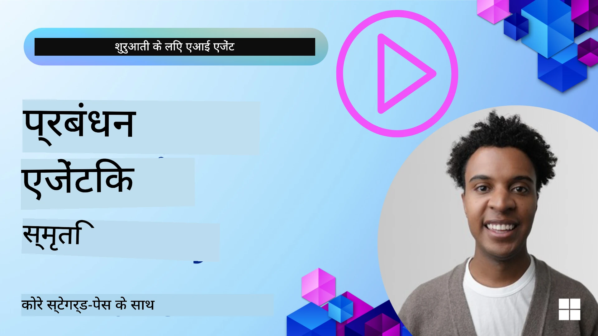

# AI एजेंट्स के लिए मेमोरी 

जब AI एजेंट्स बनाने के अनूठे लाभों पर चर्चा की जाती है, तो मुख्य रूप से दो चीज़ें चर्चा में आती हैं: कार्यों को पूरा करने के लिए टूल्स को कॉल करने की क्षमता और समय के साथ सुधार करने की क्षमता। मेमोरी उस आत्म-सुधार करने वाले एजेंट बनाने की बुनियाद है जो हमारे उपयोगकर्ताओं के लिए बेहतर अनुभव बना सके।

इस पाठ में, हम देखेंगे कि AI एजेंट्स के लिए मेमोरी क्या है और हम इसे अपने एप्लिकेशन के लाभ के लिए कैसे प्रबंधित और उपयोग कर सकते हैं।

## परिचय

यह पाठ निम्न को कवर करेगा:

• **AI एजेंट मेमोरी को समझना**: मेमोरी क्या है और एजेंट्स के लिए यह क्यों आवश्यक है।

• **मेमोरी को लागू करना और संग्रहीत करना**: आपके AI एजेंट्स में मेमोरी क्षमताएँ जोड़ने के व्यावहारिक तरीके, खासकर शॉर्ट-टर्म और लॉन्ग-टर्म मेमोरी पर ध्यान केंद्रित करते हुए।

• **AI एजेंट्स को स्वयं-सुधारने योग्य बनाना**: कैसे मेमोरी एजेंट्स को पिछले इंटरैक्शन से सीखने और समय के साथ बेहतर होने में सक्षम बनाती है।

## उपलब्ध कार्यान्वयन

यह पाठ दो व्यापक नोटबुक ट्यूटोरियल शामिल करता है:

• **[13-agent-memory.ipynb](./13-agent-memory.ipynb)**: Mem0 और Azure AI Search का उपयोग करके Microsoft Agent Framework के साथ मेमोरी को लागू करता है

• **[13-agent-memory-cognee.ipynb](./13-agent-memory-cognee.ipynb)**: Cognee का उपयोग करते हुए संरचित मेमोरी को लागू करता है, जो embeddings द्वारा समर्थित नॉलेज ग्राफ़ को स्वचालित रूप से बनाता है, ग्राफ का विज़ुअलाइज़ेशन करता है, और बुद्धिमान पुनर्प्राप्ति प्रदान करता है

## सीखने के लक्ष्य

इस पाठ को पूरा करने के बाद, आप जानेंगे कि कैसे:

• **विभिन्न प्रकार की AI एजेंट मेमोरी में अंतर करना**, जिसमें कार्यशील, अल्पकालिक और दीर्घकालिक मेमोरी शामिल हैं, साथ ही विशेष प्रकार जैसे पर्सोना और एपिसोडिक मेमोरी।

• **Microsoft Agent Framework का उपयोग करके AI एजेंट्स के लिए शॉर्ट-टर्म और लॉन्ग-टर्म मेमोरी को लागू और प्रबंधित करना**, Mem0, Cognee, Whiteboard मेमोरी जैसी टूल्स का लाभ उठाना, और Azure AI Search के साथ एकीकृत करना।

• **स्वयं-सुधार करने वाले AI एजेंट्स के पीछे के सिद्धांतों को समझना** और कैसे मजबूत मेमोरी प्रबंधन प्रणालियाँ निरंतर सीखने और अनुकूलन में योगदान देती हैं।

## AI एजेंट मेमोरी को समझना

मूल रूप में, **AI एजेंट्स के लिए मेमोरी से उन तंत्रों का तात्पर्य है जो उन्हें जानकारी को बनाए रखने और वापस याद करने की अनुमति देते हैं**। यह जानकारी किसी बातचीत के विशिष्ट विवरण, उपयोगकर्ता की प्राथमिकताएँ, पिछले कार्य, या यहां तक कि सीखी गई पैटर्न भी हो सकती है।

बिना मेमोरी के, AI एप्लिकेशन अक्सर स्टेटलेस होते हैं, जिसका मतलब है कि प्रत्येक इंटरैक्शन नये सिरे से शुरू होता है। इससे एक दोहरावदार और निराशाजनक उपयोगकर्ता अनुभव होता है जहाँ एजेंट पिछले संदर्भ या प्राथमिकताओं को "भूल" जाता है।

### मेमोरी क्यों महत्वपूर्ण है?

एजेंट की बुद्धिमत्ता गहराई से उसके पिछले जानकारी को याद करने और उपयोग करने की क्षमता से जुड़ी होती है। मेमोरी एजेंट्स को यह सक्षम बनाती है कि वे:

• **सीखने वाला**: पिछले कार्यों और परिणामों से सीखना।

• **इंटरैक्टिव**: चल रही बातचीत में संदर्भ बनाए रखना।

• **प्रोऐक्टिव और रिएक्टिव**: ऐतिहासिक डेटा के आधार पर आवश्यकताओं का अनुमान लगाना या उपयुक्त प्रतिक्रिया देना।

• **स्वायत्त**: संग्रहीत ज्ञान का उपयोग करके अधिक स्वतंत्र रूप से काम करना।

मेमोरी को लागू करने का लक्ष्य एजेंट्स को अधिक **विश्वसनीय और सक्षम** बनाना है।

### मेमोरी के प्रकार

#### कार्यशील मेमोरी

इसे उस स्क्रैच पेपर के रूप में सोचें जिसका एक एजेंट एक ही, चल रहे कार्य या विचार प्रक्रिया के दौरान उपयोग करता है। यह अगले कदम की गणना के लिए आवश्यक तात्कालिक जानकारी धारण करता है।

AI एजेंट्स के लिए, कार्यशील मेमोरी अक्सर बातचीत से सबसे प्रासंगिक जानकारी पकड़ लेती है, भले ही पूरे चैट इतिहास लंबा हो या कट गया हो। यह आवश्यक तत्वों जैसे आवश्यकताएँ, प्रस्ताव, निर्णय और कार्रवाइयों को निकालने पर केंद्रित होती है।

**कार्यशील मेमोरी का उदाहरण**

एक ट्रैवल बुकिंग एजेंट में, कार्यशील मेमोरी उपयोगकर्ता की वर्तमान मांग को पकड़ सकती है, जैसे "मैं पेरिस के लिए एक यात्रा बुक करना चाहता/चाहती हूँ"। यह विशिष्ट आवश्यकता एजेंट के तत्काल संदर्भ में रखी जाती है ताकि वर्तमान इंटरैक्शन का मार्गदर्शन हो सके।

#### अल्पकालिक मेमोरी

यह प्रकार की मेमोरी किसी एक बातचीत या सत्र की अवधि के लिए जानकारी को बनाए रखती है। यह वर्तमान चैट का संदर्भ है, जिससे एजेंट संवाद के पिछले चरणों का संदर्भ ले सकता है।

**अल्पकालिक मेमोरी का उदाहरण**

यदि एक उपयोगकर्ता पूछता है, "पेरिस के लिए फ्लाइट की कीमत कितनी होगी?" और फिर पूछता है, "वहाँ ठहरने का क्या?" तो अल्पकालिक मेमोरी सुनिश्चित करती है कि एजेंट जानता है कि "वहाँ" उसी बातचीत में "पेरिस" को संदर्भित करता है।

#### दीर्घकालिक मेमोरी

यह वह जानकारी है जो कई बातचीतों या सत्रों में बनी रहती है। यह एजेंट्स को उपयोगकर्ता की प्राथमिकताओं, ऐतिहासिक इंटरैक्शन या विस्तृत अवधि में सामान्य ज्ञान याद रखने की अनुमति देती है। यह वैयक्तिकरण के लिए महत्वपूर्ण है।

**दीर्घकालिक मेमोरी का उदाहरण**

एक दीर्घकालिक मेमोरी यह संग्रहीत कर सकती है कि "बेन को स्कीइंग और आउटडोर गतिविधियाँ पसंद हैं, उसे पर्वतीय दृश्य के साथ कॉफ़ी पसंद है, और पिछले चोट के कारण वह एडवांस्ड स्की स्लोप्स से बचना चाहता है"। यह जानकारी, पिछले इंटरैक्शन से सीखी गई, भविष्य की ट्रैवल प्लानिंग सत्रों में सिफारिशों को अत्यधिक व्यक्तिगत बनाती है।

#### व्यक्तित्व (पर्सोना) मेमोरी

यह विशेष मेमोरी प्रकार एजेंट को एक सुसंगत "व्यक्तित्व" या "पर्सोना" विकसित करने में मदद करता है। यह एजेंट को अपने बारे में या उसके इच्छित रोल के बारे में विवरण याद रखने की अनुमति देता है, जिससे इंटरैक्शन अधिक सहज और केंद्रित होते हैं।

**पर्सोना मेमोरी का उदाहरण**
यदि ट्रैवल एजेंट को "एक विशेषज्ञ स्की योजनाकार" के रूप में डिज़ाइन किया गया है, तो पर्सोना मेमोरी इस भूमिका को सुदृढ़ कर सकती है, उसके उत्तरों को एक विशेषज्ञ के टोन और ज्ञान के अनुरूप प्रभावित करते हुए।

#### वर्कफ़्लो/एपिसोडिक मेमोरी

यह मेमोरी किसी जटिल कार्य के दौरान एजेंट द्वारा उठाए गए चरणों के अनुक्रम को संग्रहीत करती है, जिसमें सफलताएँ और विफलताएँ शामिल हैं। यह विशिष्ट "एपिसोड" या पिछले अनुभवों को याद रखने जैसा है ताकि उनसे सीखा जा सके।

**एपिसोडिक मेमोरी का उदाहरण**

यदि एजेंट ने किसी विशिष्ट फ्लाइट को बुक करने का प्रयास किया लेकिन उपलब्धता न होने के कारण विफल रहा, तो एपिसोडिक मेमोरी इस विफलता को रिकॉर्ड कर सकती है, जिससे अगली बार एजेंट वैकल्पिक फ्लाइट आजमाने या उपयोगकर्ता को अधिक जानकारीपूर्ण तरीके से बताने में सक्षम होगा।

#### एंटिटी मेमोरी

इसमें बातचीत से विशिष्ट एंटिटीज़ (जैसे लोग, स्थान, या चीज़ें) और घटनाओं को निकालना और याद रखना शामिल है। यह एजेंट को चर्चित प्रमुख तत्वों की संरचित समझ बनाने की अनुमति देता है।

**एंटिटी मेमोरी का उदाहरण**

किसी पिछले ट्रिप पर हुई बातचीत से, एजेंट "पेरिस", "आइफिल टावर", और "Le Chat Noir रेस्टोरेंट में डिनर" को एंटिटीज़ के रूप में निकाल सकता है। भविष्य की बातचीत में, एजेंट "Le Chat Noir" को याद कर सकता है और वहां नई बुकिंग करने की पेशकश कर सकता है।

#### संरचित RAG (Retrieval Augmented Generation)

जबकि RAG एक व्यापक तकनीक है, "संरचित RAG" को एक शक्तिशाली मेमोरी तकनीक के रूप में उजागर किया गया है। यह विभिन्न स्रोतों (बातचीत, ईमेल, छवियाँ) से घनी, संरचित जानकारी निकालता है और उपयोग करता है ताकि प्रतिक्रियाओं में सटीकता, रिकॉल और गति बढ़ सके। क्लासिक RAG जो केवल सैमान्टिक समानता पर निर्भर करता है, उसके विपरीत, Structured RAG जानकारी की अंतर्निहित संरचना के साथ काम करता है।

**संरचित RAG का उदाहरण**

सिर्फ कीवर्ड मिलान करने के बजाय, Structured RAG ईमेल से फ्लाइट विवरण (गंतव्य, तारीख, समय, एयरलाइन) को पार्स करके संरचित तरीके से स्टोर कर सकता है। इससे "मैंने मंगलवार को पेरिस के लिए कौन सी फ्लाइट बुक की थी?" जैसे सटीक प्रश्नों का उत्तर देना संभव हो जाता है।

## मेमोरी को लागू करना और संग्रहीत करना

AI एजेंट्स के लिए मेमोरी लागू करना एक व्यवस्थित प्रक्रिया शामिल करता है जिसे **मेमोरी प्रबंधन** कहा जाता है, जिसमें जानकारी उत्पन्न करना, संग्रहीत करना, पुनः प्राप्त करना, एकीकृत करना, अद्यतन करना, और यहां तक कि "भूलना" (या हटाना) शामिल है। पुनर्प्राप्ति एक विशेष रूप से महत्वपूर्ण पहलू है।

### विशिष्ट मेमोरी टूल्स

#### Mem0

एजेंट मेमोरी को संग्रहीत और प्रबंधित करने के एक तरीके के रूप में Mem0 जैसे विशेष टूल्स का उपयोग किया जा सकता है। Mem0 एक स्थायी मेमोरी लेयर के रूप में काम करता है, जो एजेंट्स को प्रासंगिक इंटरैक्शन को याद रखने, उपयोगकर्ता प्राथमिकताओं और तथ्यात्मक संदर्भों को स्टोर करने, और समय के साथ सफलताओं और विफलताओं से सीखने की अनुमति देता है। यहाँ विचार यह है कि स्टेटलेस एजेंट्स स्टेटफुल बन जाएँ।

यह **दो-फेज मेमोरी पाइपलाइन: निष्कर्षण और अपडेट** के माध्यम से काम करता है। सबसे पहले, किसी एजेंट के थ्रेड में जो संदेश जोड़े जाते हैं उन्हें Mem0 सेवा पर भेजा जाता है, जो बातचीत के इतिहास का सारांश बनाने और नई यादें निकालने के लिए एक बड़े भाषा मॉडल (LLM) का उपयोग करती है। तत्पश्चात, LLM-संचालित अपडेट चरण यह निर्धारित करता है कि इन यादों को जोड़ना है, संशोधित करना है, या मिटाना है, और इन्हें एक हाइब्रिड डेटा स्टोर में संग्रहीत किया जाता है जिसमें वेक्टर, ग्राफ़ और की-वैल्यू डेटाबेस शामिल हो सकते हैं। यह प्रणाली विभिन्न मेमोरी प्रकारों का समर्थन भी करती है और एंटिटीज़ के बीच संबंधों के प्रबंधन के लिए ग्राफ मेमोरी को शामिल कर सकती है।

#### Cognee

एक अन्य शक्तिशाली दृष्टिकोण है **Cognee**, एक ओपन-सोर्स सेमांटिक मेमोरी जो संरचित और असंरचित डेटा को embeddings द्वारा समर्थित प्रश्न-योग्य नॉलेज ग्राफ़ में बदल देती है। Cognee एक **डुअल-स्टोर आर्किटेक्चर** प्रदान करता है जो वेक्टर समानता खोज को ग्राफ संबंधों के साथ जोड़ता है, जिससे एजेंट न केवल यह समझ पाते हैं कि कौन सी जानकारी समान है, बल्कि अवधारणाएँ एक-दूसरे से कैसे संबंधित हैं, यह भी समझ पाते हैं।

यह **हाइब्रिड पुनर्प्राप्ति** में उत्कृष्ट है जो वेक्टर समानता, ग्राफ संरचना, और LLM तर्क को मिलाता है - कच्चे चंक लुकअप से लेकर ग्राफ-आधारित प्रश्नोत्तर तक। सिस्टम **लिविंग मेमोरी** बनाए रखता है जो विकासशील और विस्तारित होती रहती है जबकि एक जुड़े हुए ग्राफ के रूप में प्रश्नयोग्य बनी रहती है, जो अल्पकालिक सत्र संदर्भ और दीर्घकालिक स्थायी मेमोरी दोनों का समर्थन करती है।

Cognee नोटबुक ट्यूटोरियल ([13-agent-memory-cognee.ipynb](./13-agent-memory-cognee.ipynb)) इस एकीकृत मेमोरी लेयर के निर्माण का प्रदर्शन करता है, जिसमें विविध डेटा स्रोतों को ingest करने, नॉलेज ग्राफ़ का विज़ुअलाइज़ेशन करने, और विशिष्ट एजेंट आवश्यकताओं के अनुसार विभिन्न खोज रणनीतियों के साथ क्वेरी करने के व्यावहारिक उदाहरण शामिल हैं।

### RAG के साथ मेमोरी स्टोर करना

mem0 जैसे विशिष्ट मेमोरी टूल्स के अलावा, आप मजबूत खोज सेवाओं जैसे **Azure AI Search** का उपयोग मेमोरी को स्टोर और पुनः प्राप्त करने के बैकएंड के रूप में कर सकते हैं, विशेष रूप से संरचित RAG के लिए।

यह आपको अपने एजेंट की प्रतिक्रियाओं को आपके अपने डेटा के साथ ग्राउंड करने की अनुमति देता है, जिससे अधिक प्रासंगिक और सटीक उत्तर सुनिश्चित होते हैं। Azure AI Search का उपयोग उपयोगकर्ता-विशिष्ट ट्रैवल मेमोरीज़, उत्पाद कैटलॉग, या किसी भी अन्य डोमेन-विशेष ज्ञान को स्टोर करने के लिए किया जा सकता है।

Azure AI Search **संरचित RAG** जैसी क्षमताओं का समर्थन करता है, जो बड़ी डेटासेट्स जैसे बातचीत इतिहास, ईमेल, या यहां तक कि छवियों से घनी, संरचित जानकारी निकालने और पुनर्प्राप्त करने में उत्कृष्ट है। यह पारंपरिक टेक्स्ट चंकिंग और एम्बेडिंग दृष्टिकोणों की तुलना में "असाधारण सटीकता और रिकॉल" प्रदान करता है।

## AI एजेंट्स को स्वयं-सुधारने योग्य बनाना

स्वयं-सुधारने वाले एजेंट्स के लिए एक सामान्य पैटर्न में एक **"ज्ञान एजेंट"** को शामिल करना शामिल है। यह अलग एजेंट मुख्य एजेंट और उपयोगकर्ता के बीच की मुख्य बातचीत का निरीक्षण करता है। उसकी भूमिका होती है:

1. **मूल्यवान जानकारी की पहचान करना**: यह निर्धारित करना कि क्या बातचीत का कोई हिस्सा सामान्य ज्ञान या किसी विशिष्ट उपयोगकर्ता प्राथमिकता के रूप में सहेजने लायक है।

2. **निकालना और सारांशित करना**: बातचीत से आवश्यक सीख या प्राथमिकता को संक्षेप में निकालना।

3. **नॉलेज बेस में स्टोर करना**: इस निकाली गई जानकारी को अक्सर वेक्टर डेटाबेस में स्थायी रूप से संग्रहीत करना, ताकि इसे बाद में पुनः प्राप्त किया जा सके।

4. **भविष्य के क्वेरीज़ को बढ़ाना**: जब उपयोगकर्ता नया क्वेरी शुरू करता है, तो ज्ञान एजेंट संबंधित संग्रहीत जानकारी पुनः प्राप्त करता है और इसे उपयोगकर्ता के प्रॉम्प्ट में जोड़ देता है, प्राथमिक एजेंट को महत्वपूर्ण संदर्भ प्रदान करते हुए (RAG के समान)।

### मेमोरी के लिए अनुकूलन

• **लेटेंसी प्रबंधन**: उपयोगकर्ता इंटरैक्शन को धीमा होने से रोकने के लिए, पहले एक सस्ता, तेज़ मॉडल प्रारंभिक जांच के लिए उपयोग किया जा सकता है कि क्या जानकारी सहेजी जानी चाहिए या पुनः प्राप्त की जानी चाहिए, और केवल आवश्यक होने पर अधिक जटिल निष्कर्षण/पुनर्प्राप्ति प्रक्रिया को कॉल किया जाता है।

• **ज्ञान आधार का रखरखाव**: बढ़ते हुए नॉलेज बेस के लिए, कम बार उपयोग की जाने वाली जानकारी को लागत प्रबंधन के लिए "कोल्ड स्टोरेज" में स्थानांतरित किया जा सकता है।

## एजेंट मेमोरी के बारे में और सवाल हैं?

अन्य शिक्षार्थियों से मिलने, ऑफिस ऑवर्स में भाग लेने और अपने AI एजेंट्स से संबंधित प्रश्नों के उत्तर पाने के लिए [Microsoft Foundry Discord](https://aka.ms/ai-agents/discord) में शामिल हों।

---

<!-- CO-OP TRANSLATOR DISCLAIMER START -->
अस्वीकरण:
यह दस्तावेज़ AI अनुवाद सेवा Co-op Translator (https://github.com/Azure/co-op-translator) का उपयोग करके अनुवादित किया गया है। हम सटीकता के लिए प्रयास करते हैं, फिर भी कृपया ध्यान रखें कि स्वचालित अनुवादों में त्रुटियाँ या असंगतियाँ हो सकती हैं। मूल दस्तावेज़ को उसकी मूल भाषा में आधिकारिक स्रोत माना जाना चाहिए। महत्वपूर्ण जानकारी के लिए, पेशेवर मानव अनुवाद की सलाह दी जाती है। इस अनुवाद के उपयोग से उत्पन्न किसी भी गलतफहमी या गलत व्याख्या के लिए हम उत्तरदायी नहीं हैं।
<!-- CO-OP TRANSLATOR DISCLAIMER END -->