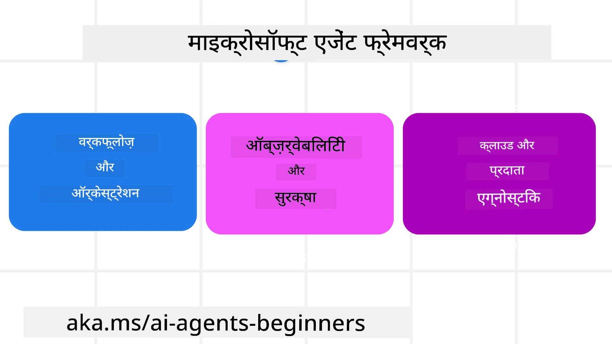
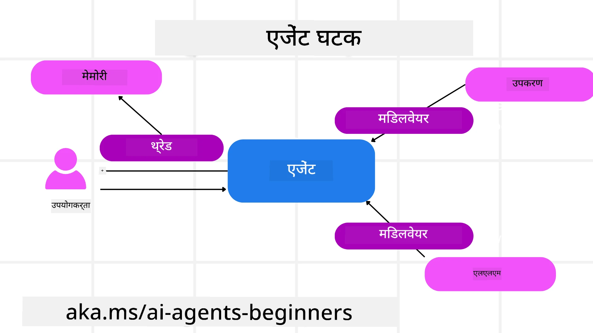

# Microsoft एजेंट फ्रेमवर्क का अन्वेषण


### परिचय

यह पाठ निम्नलिखित को कवर करेगा:

- Microsoft एजेंट फ्रेमवर्क की समझ: मुख्य विशेषताएँ और मूल्य  
- Microsoft एजेंट फ्रेमवर्क की मुख्य अवधारणाओं का अन्वेषण
- उन्नत MAF पैटर्न: वर्कफ़्लो, मिडलवेयर, और मेमोरी

## सीखने के लक्ष्य

इस पाठ को पूरा करने के बाद, आप जानेंगे कि कैसे:

- Microsoft एजेंट फ्रेमवर्क का उपयोग करके उत्पादन-तैयार AI एजेंट बनाएँ
- Microsoft एजेंट फ्रेमवर्क की मूल विशेषताओं को अपने एजेंटिक उपयोग मामलों में लागू करें
- वर्कफ़्लो, मिडलवेयर, और ऑब्जरवेबिलिटी सहित उन्नत पैटर्न का उपयोग करें

## कोड उदाहरण

[Microsoft Agent Framework (MAF)](https://aka.ms/ai-agents-beginners/agent-framewrok) के कोड उदाहरण इस रिपॉजिटरी में `xx-python-agent-framework` और `xx-dotnet-agent-framework` फाइलों के अंतर्गत पाए जा सकते हैं।

## Microsoft एजेंट फ्रेमवर्क की समझ



[Microsoft Agent Framework (MAF)](https://aka.ms/ai-agents-beginners/agent-framewrok) Microsoft का एक एकीकृत फ्रेमवर्क है जो AI एजेंट बनाने के लिए है। यह उत्पादन और शोध दोनों वातावरण में देखे गए विभिन्न एजेंटिक उपयोग मामलों को संबोधित करने के लिए लचीलापन प्रदान करता है, जिनमें शामिल हैं:

- उन परिस्थितियों में **क्रमिक एजेंट ऑर्केस्ट्रेशन** जहां चरण-दर-चरण वर्कफ़्लो आवश्यक होते हैं।
- उन परिस्थितियों में **समवर्ती ऑर्केस्ट्रेशन** जहां एजेंटों को एक साथ कार्य पूरा करना होता है।
- उन परिस्थितियों में **ग्रुप चैट ऑर्केस्ट्रेशन** जहां एजेंट एक कार्य पर एक साथ सहयोग कर सकते हैं।
- उन परिस्थितियों में **हैंडऑफ ऑर्केस्ट्रेशन** जहां एजेंट एक-दूसरे को सूक्ष्मकार्य सौंपते हैं जैसे ही उपकार्यों को पूरा किया जाता है।
- उन परिस्थितियों में **मैग्नेटिक ऑर्केस्ट्रेशन** जहां एक प्रबंधक एजेंट कार्य सूची बनाता और संशोधित करता है और उप-एजेंट्स के समन्वय को संभालता है।

उत्पादन में AI एजेंट प्रदान करने के लिए, MAF ने इन विशेषताओं को भी शामिल किया है:

- **ऑब्जरवेबिलिटी** OpenTelemetry का उपयोग करके, जहाँ AI एजेंट की प्रत्येक कार्रवाई जैसे टूल कॉल, ऑर्केस्ट्रेशन चरण, तर्क प्रवाह और प्रदर्शन की निगरानी Microsoft Foundry डैशबोर्ड के जरिये होती है।
- **सुरक्षा** एजेंटों को Microsoft Foundry पर मूल रूप से होस्ट करके, जिसमें भूमिका-आधारित पहुँच, निजी डेटा हैंडलिंग और अंतर्निहित सामग्री सुरक्षा जैसे नियंत्रण शामिल हैं।
- **टिकाऊपन** क्योंकि एजेंट थ्रेड्स और वर्कफ़्लो को रोकना, फिर से शुरू करना और त्रुटियों से पुनर्प्राप्त करना संभव है, जो लंबी प्रक्रिया को सक्षम करता है।
- **नियंत्रण** क्योंकि मानव नियंत्रण वर्कफ़्लो समर्थित हैं जहाँ कार्यों को मानव अनुमोदन आवश्यक के रूप में चिह्नित किया जाता है।

Microsoft एजेंट फ्रेमवर्क भी अंतर-संचालित होने को केंद्रित करता है:

- **क्लाउड-एग्नोस्टिक होना** - एजेंट कंटेनरों, ऑन-प्रिमाइज़ और विभिन्न क्लाउड्स में चल सकते हैं।
- **प्रदाता-एग्नोस्टिक होना** - एजेंटों को आपकी पसंदीदा SDK जैसे Azure OpenAI और OpenAI के जरिए बनाया जा सकता है।
- **खुले मानकों का एकीकरण** - एजेंट Agent-to-Agent (A2A) और Model Context Protocol (MCP) जैसे प्रोटोकॉल का उपयोग करके अन्य एजेंट और टूल खोज और उपयोग कर सकते हैं।
- **प्लगइन्स और कनेक्टर्स** - कनेक्शन डेटा और मेमोरी सेवाओं जैसे Microsoft Fabric, SharePoint, Pinecone, और Qdrant से बनाए जा सकते हैं।

आइए देखें कि ये विशेषताएँ Microsoft एजेंट फ्रेमवर्क की कुछ मुख्य अवधारणाओं पर कैसे लागू की जाती हैं।

## Microsoft एजेंट फ्रेमवर्क की मुख्य अवधारणाएँ

### एजेंट्स



**एजेंट बनाना**

एजेंट सृजन में इनफेरेंस सेवा (LLM प्रदाता), AI एजेंट को पालन करने के लिए निर्देशों का सेट, और एक निर्दिष्ट `name` शामिल है:

```python
agent = AzureOpenAIChatClient(credential=AzureCliCredential()).create_agent( instructions="You are good at recommending trips to customers based on their preferences.", name="TripRecommender" )
```

ऊपर `Azure OpenAI` का उपयोग कर रहा है लेकिन एजेंट विविध सेवाओं का उपयोग करके बनाए जा सकते हैं जैसे `Microsoft Foundry Agent Service`:

```python
AzureAIAgentClient(async_credential=credential).create_agent( name="HelperAgent", instructions="You are a helpful assistant." ) as agent
```

OpenAI के `Responses`, `ChatCompletion` APIs

```python
agent = OpenAIResponsesClient().create_agent( name="WeatherBot", instructions="You are a helpful weather assistant.", )
```

```python
agent = OpenAIChatClient().create_agent( name="HelpfulAssistant", instructions="You are a helpful assistant.", )
```

या A2A प्रोटोकॉल का उपयोग करके दूरस्थ एजेंट:

```python
agent = A2AAgent( name=agent_card.name, description=agent_card.description, agent_card=agent_card, url="https://your-a2a-agent-host" )
```

**एजेंट चलाना**

एजेंट्स को `.run` या `.run_stream` विधियों का उपयोग करके चलाया जाता है, जो गैर-स्ट्रीमिंग या स्ट्रीमिंग प्रतिक्रियाओं के लिए हैं।

```python
result = await agent.run("What are good places to visit in Amsterdam?")
print(result.text)
```

```python
async for update in agent.run_stream("What are the good places to visit in Amsterdam?"):
    if update.text:
        print(update.text, end="", flush=True)

```

प्रत्येक एजेंट रन में विकल्प भी हो सकते हैं जैसे एजेंट द्वारा उपयोग किए जाने वाले `max_tokens`, एजेंट द्वारा कॉल किए जा सकने वाले `tools`, और यहां तक कि एजेंट के लिए उपयोग किया गया `model`।

यह तब उपयोगी होता है जब किसी उपयोगकर्ता के कार्य को पूरा करने के लिए विशिष्ट मॉडल या टूल की आवश्यकता होती है।

**टूल्स**

टूल दोनों ही एजेंट परिभाषित करते समय:

```python
def get_attractions( location: Annotated[str, Field(description="The location to get the top tourist attractions for")], ) -> str: """Get the top tourist attractions for a given location.""" return f"The top attractions for {location} are." 


# जब सीधे एक ChatAgent बनाया जा रहा हो

agent = ChatAgent( chat_client=OpenAIChatClient(), instructions="You are a helpful assistant", tools=[get_attractions]

```

और एजेंट चलाते समय भी:

```python

result1 = await agent.run( "What's the best place to visit in Seattle?", tools=[get_attractions] # केवल इस रन के लिए टूल प्रदान किया गया है )
```

**एजेंट थ्रेड्स**

एजेंट थ्रेड्स का उपयोग बहु-चरण वार्तालापों को संभालने के लिए किया जाता है। थ्रेड्स को निम्न तरीकों से बनाया जा सकता है:

- `get_new_thread()` का उपयोग करके जो थ्रेड को समय के साथ सहेजने की सुविधा देता है
- एजेंट चलाते समय स्वचालित रूप से थ्रेड बनाना और केवल वर्तमान रन के दौरान थ्रेड रखना।

थ्रेड बनाने के लिए कोड इस प्रकार है:

```python
# एक नया थ्रेड बनाएं।
thread = agent.get_new_thread() # थ्रेड के साथ एजेंट चलाएं।
response = await agent.run("Hello, I am here to help you book travel. Where would you like to go?", thread=thread)

```

आप बाद में उपयोग के लिए थ्रेड को सिरीयलाइज़ कर सकते हैं:

```python
# एक नया थ्रेड बनाएं।
thread = agent.get_new_thread() 

# थ्रेड के साथ एजेंट चलाएं।

response = await agent.run("Hello, how are you?", thread=thread) 

# स्टोरेज के लिए थ्रेड को सीरियलाइज़ करें।

serialized_thread = await thread.serialize() 

# स्टोरेज से लोड करने के बाद थ्रेड की स्थिति को डीसिरियलाइज़ करें।

resumed_thread = await agent.deserialize_thread(serialized_thread)
```

**एजेंट मिडलवेयर**

एजेंट उपयोगकर्ता के कार्यों को पूरा करने के लिए टूल और LLM से इंटरैक्ट करते हैं। कुछ परिस्थितियों में, हम इन इंटरैक्शन के बीच क्रियान्वयन या ट्रैकिंग करना चाहते हैं। एजेंट मिडलवेयर हमें यह करने की अनुमति देता है:

*फ़ंक्शन मिडलवेयर*

यह मिडलवेयर एजेंट और एक फ़ंक्शन/टूल के बीच क्रिया निष्पादित करने की अनुमति देता है जिसे यह कॉल करेगा। ऐसा तब उपयोगी होता है जब आप फ़ंक्शन कॉल पर लॉगिंग करना चाहते हैं।

नीचे कोड में `next` यह परिभाषित करता है कि अगला मिडलवेयर या वास्तविक फ़ंक्शन कॉल करना चाहिए।

```python
async def logging_function_middleware(
    context: FunctionInvocationContext,
    next: Callable[[FunctionInvocationContext], Awaitable[None]],
) -> None:
    """Function middleware that logs function execution."""
    # पूर्व-प्रसंस्करण: फ़ंक्शन निष्पादन से पहले लॉग करें
    print(f"[Function] Calling {context.function.name}")

    # अगले मिडलवेयर या फ़ंक्शन निष्पादन पर जाएं
    await next(context)

    # पश्च-प्रसंस्करण: फ़ंक्शन निष्पादन के बाद लॉग करें
    print(f"[Function] {context.function.name} completed")
```

*चैट मिडलवेयर*

यह मिडलवेयर एजेंट और LLM के बीच अनुरोधों के बीच क्रिया निष्पादित या लॉग करने की अनुमति देता है।

इसमें AI सेवा को भेजे जा रहे `messages` जैसी महत्वपूर्ण जानकारी शामिल होती है।

```python
async def logging_chat_middleware(
    context: ChatContext,
    next: Callable[[ChatContext], Awaitable[None]],
) -> None:
    """Chat middleware that logs AI interactions."""
    # पूर्व-संसाधन: एआई कॉल से पहले लॉग करें
    print(f"[Chat] Sending {len(context.messages)} messages to AI")

    # अगले मिडलवेयर या एआई सेवा पर जारी रखें
    await next(context)

    # पश्च-संसाधन: एआई प्रतिक्रिया के बाद लॉग करें
    print("[Chat] AI response received")

```

**एजेंट मेमोरी**

`Agentic Memory` पाठ में कवर किए अनुसार, मेमोरी एजेंट को विभिन्न संदर्भों में संचालित करने में सक्षम बनाने के लिए महत्वपूर्ण है। MAF कई प्रकार की मेमोरी प्रदान करता है:

*इन-मेमोरी स्टोरेज*

यह मेमोरी एप्लिकेशन रनटाइम के दौरान थ्रेड्स में संग्रहित होती है।

```python
# एक नया थ्रेड बनाएँ।
thread = agent.get_new_thread() # थ्रेड के साथ एजेंट चलाएँ।
response = await agent.run("Hello, I am here to help you book travel. Where would you like to go?", thread=thread)
```

*स्थायी संदेश*

यह मेमोरी विभिन्न सेशनों में बातचीत का इतिहास संग्रहीत करने के लिए उपयोग की जाती है। इसे `chat_message_store_factory` का उपयोग करके परिभाषित किया जाता है:

```python
from agent_framework import ChatMessageStore

# एक कस्टम संदेश भंडार बनाएं
def create_message_store():
    return ChatMessageStore()

agent = ChatAgent(
    chat_client=OpenAIChatClient(),
    instructions="You are a Travel assistant.",
    chat_message_store_factory=create_message_store
)

```

*डायनामिक मेमोरी*

यह मेमोरी एजेंट के चलाने से पहले संदर्भ में जोड़ी जाती है। ये मेमोरी mem0 जैसी बाहरी सेवाओं में संग्रहीत की जा सकती हैं:

```python
from agent_framework.mem0 import Mem0Provider

# उन्नत स्मृति क्षमताओं के लिए Mem0 का उपयोग कर रहा है
memory_provider = Mem0Provider(
    api_key="your-mem0-api-key",
    user_id="user_123",
    application_id="my_app"
)

agent = ChatAgent(
    chat_client=OpenAIChatClient(),
    instructions="You are a helpful assistant with memory.",
    context_providers=memory_provider
)

```

**एजेंट ऑब्जरवेबिलिटी**

विश्वसनीय और रखरखाव योग्य एजेंटिक सिस्टम बनाने के लिए ऑब्जरवेबिलिटी महत्वपूर्ण है। MAF बेहतर ऑब्जरवेबिलिटी के लिए OpenTelemetry के साथ ट्रेसिंग और मीटर प्रदान करता है।

```python
from agent_framework.observability import get_tracer, get_meter

tracer = get_tracer()
meter = get_meter()
with tracer.start_as_current_span("my_custom_span"):
    # कुछ करें
    pass
counter = meter.create_counter("my_custom_counter")
counter.add(1, {"key": "value"})
```

### वर्कफ़्लो

MAF वर्कफ़्लो प्रदान करता है जो कार्य पूरा करने के लिए पूर्व-निर्धारित चरण होते हैं और उन चरणों में AI एजेंटों को घटकों के रूप में शामिल करते हैं।

वर्कफ़्लो विभिन्न घटकों से बने होते हैं जो बेहतर नियंत्रण प्रवाह की अनुमति देते हैं। वर्कफ़्लो **मल्टी-एजेंट ऑर्केस्ट्रेशन** और वर्तमान वर्कफ़्लो स्थिति को बचाने के लिए **चेकपॉइंटिंग** भी सक्षम करते हैं।

वर्कफ़्लो के मुख्य घटक हैं:

**एक्जीक्यूटर्स**

एक्जीक्यूटर्स इनपुट संदेश प्राप्त करते हैं, अपना असाइन किया गया कार्य करते हैं, और फिर आउटपुट संदेश उत्पन्न करते हैं। यह वर्कफ़्लो को बड़े कार्य की पूर्ति की ओर बढ़ाता है। एक्जीक्यूटर्स AI एजेंट या कस्टम लॉजिक हो सकते हैं।

**एज**

एज वर्कफ़्लो में संदेशों के प्रवाह को परिभाषित करने के लिए उपयोग किए जाते हैं। ये हो सकते हैं:

*डायरेक्ट एज* - एक्जीक्यूटर्स के बीच सरल एक-से-एक कनेक्शन:

```python
from agent_framework import WorkflowBuilder

builder = WorkflowBuilder()
builder.add_edge(source_executor, target_executor)
builder.set_start_executor(source_executor)
workflow = builder.build()
```

*सशर्त एज* - किसी विशेष शर्त पूरी होने पर सक्रिय। उदाहरण के लिए, जब होटल के कमरे उपलब्ध न हों, तो एक्जीक्यूटर अन्य विकल्प सुझा सकता है।

*स्विच-कैस एज* - परिभाषित शर्तों के आधार पर संदेशों को विभिन्न एक्जीक्यूटर्स को मार्गित करें। उदाहरण के लिए, यदि यात्रा ग्राहक के पास प्राथमिकता पहुंच है और उनके कार्य किसी अन्य वर्कफ़्लो के माध्यम से संभाले जाएं।

*फैन-आउट एज* - एक संदेश को कई लक्ष्यों को भेजें।

*फैन-इन एज* - विभिन्न एक्जीक्यूटर्स से कई संदेश एकत्र करें और एक लक्ष्य को भेजें।

**इवेंट्स**

वर्कफ़्लो की बेहतर ऑब्जरवेबिलिटी के लिए, MAF निष्पादन के लिए अंतर्निहित इवेंट्स प्रदान करता है जिनमें शामिल हैं:

- `WorkflowStartedEvent`  - वर्कफ़्लो निष्पादन शुरू होता है  
- `WorkflowOutputEvent` - वर्कफ़्लो आउटपुट देता है  
- `WorkflowErrorEvent` - वर्कफ़्लो में त्रुटि आती है  
- `ExecutorInvokeEvent`  - एक्जीक्यूटर प्रक्रिया आरंभ करता है  
- `ExecutorCompleteEvent`  -  एक्जीक्यूटर प्रक्रिया समाप्त करता है  
- `RequestInfoEvent` - एक अनुरोध जारी किया जाता है  

## उन्नत MAF पैटर्न

ऊपर के अनुभाग Microsoft एजेंट फ्रेमवर्क की मुख्य अवधारणाओं को कवर करते हैं। जैसे-जैसे आप अधिक जटिल एजेंट बनाते हैं, यहाँ कुछ उन्नत पैटर्न हैं जिन्हें ध्यान में रखना चाहिए:

- **मिडलवेयर संयोजन**: एजेंट व्यवहार पर सूक्ष्म नियंत्रण के लिए फ़ंक्शन और चैट मिडलवेयर का उपयोग करके कई मिडलवेयर हैंडलर्स (लॉगिंग, प्रमाणीकरण, दर-सीमा निर्धारण) को चेन करें।
- **वर्कफ़्लो चेकपॉइंटिंग**: लंबी चलने वाली एजेंट प्रक्रियाओं को सहेजने और फिर से शुरू करने के लिए वर्कफ़्लो इवेंट्स और सिरीयलाइज़ेशन का उपयोग करें।
- **डायनामिक टूल चयन**: MAF के टूल पंजीकरण के साथ टूल विवरणों पर RAG संयोजन करें ताकि केवल उपयुक्त टूल प्रति प्रश्न प्रस्तुत किए जा सकें।
- **मल्टी-एजेंट हैंडऑफ**: विशेषज्ञ एजेंटों के बीच हैंडऑफ को ऑर्केस्ट्रेट करने के लिए वर्कफ़्लो एज और सशर्त रूटिंग का उपयोग करें।

## कोड उदाहरण

Microsoft Agent Framework के कोड उदाहरण इस रिपॉजिटरी में `xx-python-agent-framework` और `xx-dotnet-agent-framework` फाइलों के अंतर्गत पाए जा सकते हैं।

## Microsoft Agent Framework के बारे में और प्रश्न हैं?

दूसरे शिक्षार्थियों से मिलने, ऑफिस घंटे में भाग लेने और अपने AI एजेंट प्रश्नों के उत्तर पाने के लिए [Microsoft Foundry Discord](https://aka.ms/ai-agents/discord) में जुड़ें।

---

<!-- CO-OP TRANSLATOR DISCLAIMER START -->
**अस्वीकरण**:
यह दस्तावेज़ AI अनुवाद सेवा [Co-op Translator](https://github.com/Azure/co-op-translator) का उपयोग करके अनुवादित किया गया है। जबकि हम सटीकता के लिए प्रयासरत हैं, कृपया ध्यान दें कि स्वचालित अनुवाद में त्रुटियाँ या गलतियाँ हो सकती हैं। मूल दस्तावेज़ अपनी मूल भाषा में आधिकारिक स्रोत माना जाना चाहिए। महत्वपूर्ण जानकारी के लिए, पेशेवर मानव अनुवाद की सलाह दी जाती है। इस अनुवाद के उपयोग से उत्पन्न किसी भी गलतफहमी या गलत व्याख्या के लिए हम जिम्मेदार नहीं हैं।
<!-- CO-OP TRANSLATOR DISCLAIMER END -->