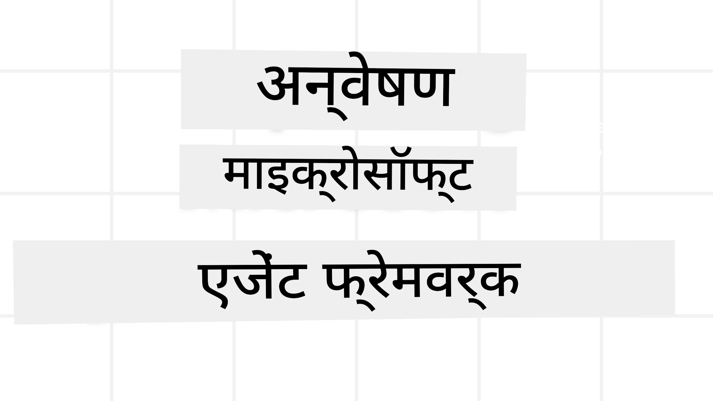
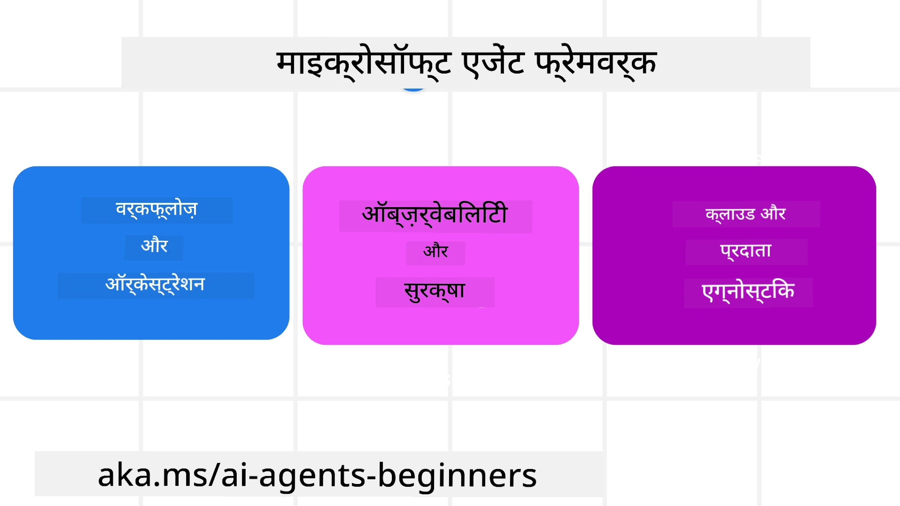
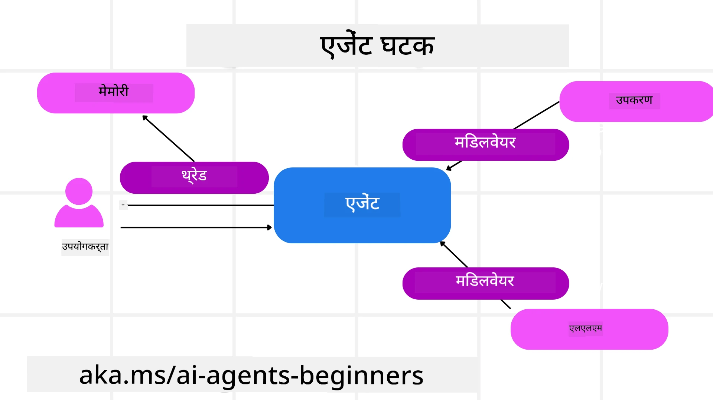

# माइक्रोसॉफ्ट एजेंट फ्रेमवर्क का अन्वेषण



### परिचय

यह पाठ कवर करेगा:

- माइक्रोसॉफ्ट एजेंट फ्रेमवर्क को समझना: प्रमुख विशेषताएँ और मूल्य  
- माइक्रोसॉफ्ट एजेंट फ्रेमवर्क की मुख्य अवधारणाओं का अन्वेषण
- उन्नत MAF पैटर्न: वर्कफ़्लोज़, मिडलवेयर, और मेमोरी

## सीखने के लक्ष्य

इस पाठ को पूरा करने के बाद, आप जान पाएंगे कि कैसे:

- माइक्रोसॉफ्ट एजेंट फ्रेमवर्क का उपयोग करते हुए प्रोडक्शन रेडी AI एजेंट बनाएं
- माइक्रोसॉफ्ट एजेंट फ्रेमवर्क की कोर विशेषताओं को अपने एजेंटिक उपयोग मामलों पर लागू करें
- वर्कफ़्लोज़, मिडलवेयर, और ऑब्ज़र्वेबिलिटी सहित उन्नत पैटर्न का उपयोग करें

## कोड नमूने 

[Microsoft Agent Framework (MAF)](https://learn.microsoft.com/en-us/agent-framework/overview/?wt.mc_id=youtube_26688_organicsocial_reactor&pivots=programming-language-python) के लिए कोड नमूने इस रिपॉजिटरी में `xx-python-agent-framework` और `xx-dotnet-agent-framework` फ़ाइलों के अंतर्गत पाए जा सकते हैं।

## माइक्रोसॉफ्ट एजेंट फ्रेमवर्क को समझना



[Microsoft Agent Framework (MAF)](https://learn.microsoft.com/en-us/agent-framework/overview/?wt.mc_id=youtube_26688_organicsocial_reactor&pivots=programming-language-python) माइक्रोसॉफ्ट का AI एजेंट बनाने के लिए एक एकीकृत फ्रेमवर्क है। यह उत्पादन और अनुसंधान दोनों वातावरण में देखे जाने वाले विभिन्न एजेंटिक उपयोग मामलों को संबोधित करने के लिए लचीलापन प्रदान करता है, जिनमें शामिल हैं:

- उन परिदृश्यों में **क्रमिक एजेंट ऑर्केस्ट्रेशन** जहां चरण-दर-चरण वर्कफ़्लोज़ की आवश्यकता होती है।
- उन परिदृश्यों में **समानान्तर ऑर्केस्ट्रेशन** जहां एजेंटों को एक ही समय में कार्य पूरे करने होते हैं।
- उन परिदृश्यों में **समूह चैट ऑर्केस्ट्रेशन** जहां एजेंट एक साथ एक कार्य पर सहयोग कर सकते हैं।
- उन परिदृश्यों में **हैंडऑफ ऑर्केस्ट्रेशन** जहां एजेंट एक-दूसरे को कार्य सौंपते हैं जैसे ही उप-कार्य पूरे होते हैं।
- उन परिदृश्यों में **मैग्नेटिक ऑर्केस्ट्रेशन** जहां एक मैनेजर एजेंट कार्य सूची बनाता और संशोधित करता है और उप-एजेंटों के समन्वय को संभालता है ताकि कार्य पूरा हो सके।

प्रोडक्शन में AI एजेंट प्रदान करने के लिए, MAF में निम्नलिखित विशेषताएं भी शामिल हैं:

- OpenTelemetry का उपयोग करके **ऑब्ज़र्वेबिलिटी**, जहां AI एजेंट की हर क्रिया, जिसमें टूल इनवोकेशन, ऑर्केस्ट्रेशन स्टेप्स, तर्क प्रवाह और Microsoft Foundry डैशबोर्ड के माध्यम से प्रदर्शन निगरानी शामिल हैं।
- **सुरक्षा**, एजेंटों को मूल रूप से Microsoft Foundry पर होस्ट करके, जिसमें भूमिका-आधारित पहुँच, निजी डेटा संचालन और बिल्ट-इन कंटेंट सुरक्षा जैसे सुरक्षा नियंत्रण शामिल हैं।
- **स्थायित्व**, क्योंकि एजेंट थ्रेड्स और वर्कफ़्लोज़ को रोकना, पुनः प्रारंभ करना और त्रुटियों से पुनर्प्राप्त करना संभव है, जिससे लंबे समय तक चलने वाली प्रक्रियाएं संभव होती हैं।
- **नियंत्रण**, क्योंकि मानव-अनुमोदन की आवश्यकता वाले कार्यों वाले मानव इन द लूप वर्कफ़्लोज़ का समर्थन किया जाता है।

माइक्रोसॉफ्ट एजेंट फ्रेमवर्क का इंटरऑपरेबिलिटी पर भी ध्यान है:

- **क्लाउड-अज्ञेयवादी होना** - एजेंट कंटेनरों, ऑन-प्रिम और विभिन्न क्लाउड्स में चल सकते हैं।
- **प्रोवाइडर-अज्ञेयवादी होना** - एजेंट को आपकी पसंदीदा SDK के माध्यम से बनाया जा सकता है, जिसमें Azure OpenAI और OpenAI शामिल हैं।
- **ओपन स्टैंडर्ड्स का एकीकरण** - एजेंट एजेंट-टू-एजेंट (A2A) और मॉडल कॉन्टेक्स्ट प्रोटोकॉल (MCP) जैसे प्रोटोकॉल का उपयोग करके अन्य एजेंट और टूल खोज सकते हैं और उपयोग कर सकते हैं।
- **प्लगइन्स और कनेक्टर्स** - Microsoft Fabric, SharePoint, Pinecone और Qdrant जैसे डेटा और मेमोरी सेवाओं के साथ कनेक्शन बन सकते हैं।

आइए देखें कि ये विशेषताएं माइक्रोसॉफ्ट एजेंट फ्रेमवर्क की कुछ कोर अवधारणाओं पर कैसे लागू होती हैं।

## माइक्रोसॉफ्ट एजेंट फ्रेमवर्क की मुख्य अवधारणाएँ

### एजेंट्स



**एजेंट बनाना**

एजेंट का निर्माण इनफेरेंस सेवा (LLM प्रदाता), AI एजेंट के लिए पालन करने के निर्देशों का सेट, और एक आवंटित `name` को परिभाषित करके किया जाता है:


```python
agent = AzureOpenAIChatClient(credential=AzureCliCredential()).create_agent( instructions="You are good at recommending trips to customers based on their preferences.", name="TripRecommender" )
```

उपरोक्त में `Azure OpenAI` का उपयोग किया गया है लेकिन एजेंट विभिन्न सेवाओं का उपयोग करके बनाए जा सकते हैं जिनमें `Microsoft Foundry Agent Service` भी शामिल है:

```python
AzureAIAgentClient(async_credential=credential).create_agent( name="HelperAgent", instructions="You are a helpful assistant." ) as agent
```

OpenAI `Responses`, `ChatCompletion` APIs

```python
agent = OpenAIResponsesClient().create_agent( name="WeatherBot", instructions="You are a helpful weather assistant.", )
```

```python
agent = OpenAIChatClient().create_agent( name="HelpfulAssistant", instructions="You are a helpful assistant.", )
```

या [MiniMax](https://platform.minimaxi.com/), जो बड़े संदर्भ विंडोज़ (204K टोकन तक) के साथ OpenAI-संगत API प्रदान करता है:

```python
agent = OpenAIChatClient(base_url="https://api.minimax.io/v1", api_key=os.environ["MINIMAX_API_KEY"], model_id="MiniMax-M3").create_agent( name="HelpfulAssistant", instructions="You are a helpful assistant.", )
```

या A2A प्रोटोकॉल का उपयोग करने वाले रिमोट एजेंट्स:

```python
agent = A2AAgent( name=agent_card.name, description=agent_card.description, agent_card=agent_card, url="https://your-a2a-agent-host" )
```

**एजेंट चलाना**

एजेंट को `.run` या `.run_stream` विधियों का उपयोग करके चलाया जाता है, जो गैर-स्ट्रीमिंग या स्ट्रीमिंग प्रतिक्रियाओं के लिए हैं।

```python
result = await agent.run("What are good places to visit in Amsterdam?")
print(result.text)
```

```python
async for update in agent.run_stream("What are the good places to visit in Amsterdam?"):
    if update.text:
        print(update.text, end="", flush=True)

```

प्रत्येक एजेंट रन के लिए एजेंट द्वारा उपयोग किए गए `max_tokens`, एजेंट द्वारा कॉल किए जा सकने वाले `tools`, और यहां तक कि एजेंट के लिए उपयोग किए गए `model` जैसे पैरामीटर्स को कस्टमाइज़ करने के विकल्प भी हो सकते हैं।

यह उन मामलों में उपयोगी होता है जहां किसी उपयोगकर्ता के कार्य को पूरा करने के लिए विशिष्ट मॉडल या टूल आवश्यक होते हैं।

**टूल्स**

टूल्स को एजेंट को परिभाषित करते समय भी परिभाषित किया जा सकता है:

```python
def get_attractions( location: Annotated[str, Field(description="The location to get the top tourist attractions for")], ) -> str: """Get the top tourist attractions for a given location.""" return f"The top attractions for {location} are." 


# जब सीधे एक ChatAgent बनाया जा रहा हो

agent = ChatAgent( chat_client=OpenAIChatClient(), instructions="You are a helpful assistant", tools=[get_attractions]

```

और एजेंट को चलाते समय भी:

```python

result1 = await agent.run( "What's the best place to visit in Seattle?", tools=[get_attractions] # केवल इस रन के लिए प्रदान किया गया उपकरण )
```

**एजेंट थ्रेड्स**

एजेंट थ्रेड्स का उपयोग बहु-टर्न वार्तालापों को संभालने के लिए किया जाता है। थ्रेड्स को या तो निम्न तरीकों से बनाया जा सकता है:

- `get_new_thread()` का उपयोग करना जो समय के साथ थ्रेड को सहेजने में सक्षम बनाता है
- एजेंट चलाते समय स्वचालित रूप से एक थ्रेड बनाना जो केवल वर्तमान रन के दौरान रहे।

थ्रेड बनाने के लिए कोड इस तरह दिखता है:

```python
# एक नया थ्रेड बनाएँ।
thread = agent.get_new_thread() # थ्रेड के साथ एजेंट को चलाएँ।
response = await agent.run("Hello, I am here to help you book travel. Where would you like to go?", thread=thread)

```

फिर आप थ्रेड को बाद में उपयोग के लिए संग्रहीत करने के लिए सीरियलाइज़ कर सकते हैं:

```python
# एक नया थ्रेड बनाएं।
thread = agent.get_new_thread() 

# थ्रेड के साथ एजेंट चलाएं।

response = await agent.run("Hello, how are you?", thread=thread) 

# संग्रहण के लिए थ्रेड को सीरियलाइज़ करें।

serialized_thread = await thread.serialize() 

# संग्रहण से लोड करने के बाद थ्रेड स्थिति को डीसीरियलाइज़ करें।

resumed_thread = await agent.deserialize_thread(serialized_thread)
```

**एजेंट मिडलवेयर**

एजेंट उपयोगकर्ता के कार्य पूरे करने के लिए टूल और LLM के साथ इंटरैक्ट करते हैं। कुछ परिदृश्यों में, हम इन इंटरैक्शन के बीच निष्पादन या ट्रैकिंग करना चाहते हैं। एजेंट मिडलवेयर हमें यह करने में सक्षम बनाता है:

*फ़ंक्शन मिडलवेयर*

यह मिडलवेयर हमें एजेंट और किसी फ़ंक्शन/टूल के बीच एक क्रिया निष्पादित करने की अनुमति देता है जिसे वह कॉल करेगा। इसका उपयोग जब हो सकता है जब आप फ़ंक्शन कॉल पर कुछ लॉगिंग करना चाहें।

नीचे कोड में `next` यह परिभाषित करता है कि अगला मिडलवेयर या वास्तविक फ़ंक्शन कॉल होना चाहिए।

```python
async def logging_function_middleware(
    context: FunctionInvocationContext,
    next: Callable[[FunctionInvocationContext], Awaitable[None]],
) -> None:
    """Function middleware that logs function execution."""
    # पूर्व-प्रसंस्करण: फ़ंक्शन निष्पादन से पहले लॉग करें
    print(f"[Function] Calling {context.function.name}")

    # अगले मिडलवेयर या फ़ंक्शन निष्पादन पर जाएं
    await next(context)

    # बाद-प्रसंस्करण: फ़ंक्शन निष्पादन के बाद लॉग करें
    print(f"[Function] {context.function.name} completed")
```

*चैट मिडलवेयर*

यह मिडलवेयर हमें एजेंट और LLM के बीच अनुरोधों के बीच कोई क्रिया निष्पादित करने या लॉग करने की अनुमति देता है।

इसमें AI सेवा को भेजे जा रहे `messages` जैसी महत्वपूर्ण जानकारी होती है।

```python
async def logging_chat_middleware(
    context: ChatContext,
    next: Callable[[ChatContext], Awaitable[None]],
) -> None:
    """Chat middleware that logs AI interactions."""
    # पूर्व-प्रसंस्करण: एआई कॉल से पहले लॉग करें
    print(f"[Chat] Sending {len(context.messages)} messages to AI")

    # अगले मिडलवेयर या एआई सेवा पर जारी रखें
    await next(context)

    # पश्च-प्रसंस्करण: एआई प्रतिक्रिया के बाद लॉग करें
    print("[Chat] AI response received")

```

**एजेंट मेमोरी**

जैसा कि `Agentic Memory` पाठ में बताया गया है, मेमोरी एजेंट को विभिन्न संदर्भों में काम करने में सक्षम बनाने का एक महत्वपूर्ण तत्व है। MAF विभिन्न प्रकार की मेमोरी प्रदान करता है:

*इन-मेमोरी स्टोरेज*

यह मेमोरी एप्लिकेशन रनटाइम के दौरान थ्रेड्स में संग्रहीत होती है।

```python
# एक नया थ्रेड बनाएं।
thread = agent.get_new_thread() # थ्रेड के साथ एजेंट चलाएं।
response = await agent.run("Hello, I am here to help you book travel. Where would you like to go?", thread=thread)
```

*स्थायी संदेश*

यह मेमोरी विभिन्न सत्रों के across बातचीत इतिहास संग्रहीत करने के लिए उपयोग की जाती है। इसे `chat_message_store_factory` के माध्यम से परिभाषित किया जाता है:

```python
from agent_framework import ChatMessageStore

# एक कस्टम संदेश स्टोर बनाएँ
def create_message_store():
    return ChatMessageStore()

agent = ChatAgent(
    chat_client=OpenAIChatClient(),
    instructions="You are a Travel assistant.",
    chat_message_store_factory=create_message_store
)

```

*डायनेमिक मेमोरी*

यह मेमोरी एजेंट्स को चलाने से पहले संदर्भ में जोड़ी जाती है। ये मेमोरी mem0 जैसी बाहरी सेवाओं में संग्रहीत की जा सकती हैं:

```python
from agent_framework.mem0 import Mem0Provider

# उन्नत मेमोरी क्षमताओं के लिए Mem0 का उपयोग करना
memory_provider = Mem0Provider(
    api_key="your-mem0-api-key",
    user_id="user_123",
    application_id="my_app"
)

agent = ChatAgent(
    chat_client=OpenAIChatClient(),
    instructions="You are a helpful assistant with memory.",
    context_providers=memory_provider
)

```

**एजेंट ऑब्ज़र्वेबिलिटी**

ऑब्ज़र्वेबिलिटी विश्वसनीय और अनुरक्षित एजेंटिक प्रणालियाँ बनाने के लिए महत्वपूर्ण है। MAF बेहतर ऑब्ज़र्वेबिलिटी के लिए ट्रेसिंग और मीटर प्रदान करने के लिए OpenTelemetry के साथ एकीकृत होता है।

```python
from agent_framework.observability import get_tracer, get_meter

tracer = get_tracer()
meter = get_meter()
with tracer.start_as_current_span("my_custom_span"):
    # कुछ करें
    pass
counter = meter.create_counter("my_custom_counter")
counter.add(1, {"key": "value"})
```

### वर्कफ़्लोज़

MAF वर्कफ़्लोज़ प्रदान करता है जो एक कार्य पूरा करने के लिए पूर्व-परिभाषित चरण होते हैं और उन चरणों में AI एजेंट को घटक के रूप में शामिल करते हैं।

वर्कफ़्लोज़ विभिन्न घटकों से बने होते हैं जो बेहतर नियंत्रण प्रवाह की अनुमति देते हैं। वर्कफ़्लोज़ **मल्टी-एजेंट ऑर्केस्ट्रेशन** और **चेकप्वाइंटिंग** को भी सक्षम करते हैं ताकि वर्कफ़्लो स्थितियों को सहेजा जा सके।

वर्कफ़्लो के मुख्य घटक हैं:

**एक्जीक्यूटर्स**

एक्जीक्यूटर्स इनपुट संदेश प्राप्त करते हैं, अपने असाइन किए गए कार्य करते हैं, और फिर आउटपुट संदेश बनाते हैं। इससे वर्कफ़्लो बड़े कार्य की ओर बढ़ता है। एक्जीक्यूटर्स AI एजेंट या कस्टम लॉजिक हो सकते हैं।

**एजेस**

एजेस का उपयोग वर्कफ़्लो में संदेशों के प्रवाह को परिभाषित करने के लिए किया जाता है। ये हो सकते हैं:

*डायरेक्ट एजेस* - एक्जीक्यूटर्स के बीच सरल एक-से-एक कनेक्शन:

```python
from agent_framework import WorkflowBuilder

builder = WorkflowBuilder()
builder.add_edge(source_executor, target_executor)
builder.set_start_executor(source_executor)
workflow = builder.build()
```

*कंडीशनल एजेस* - एक तय स्थिति पूरी होने पर सक्रिय होते हैं। उदाहरण के लिए, जब होटल के कमरे उपलब्ध नहीं होते, एक एक्जीक्यूटर अन्य विकल्प सुझा सकता है।

*स्विच-केस एजेस* - परिभाषित शर्तों के आधार पर संदेशों को विभिन्न एक्जीक्यूटर्स की ओर मार्गित करते हैं। उदाहरण के लिए, यदि यात्रा ग्राहक के पास प्राथमिकता पहुँच है तो उनके कार्य किसी अन्य वर्कफ़्लो के माध्यम से संभाले जाएंगे।

*फैन-आउट एजेस* - एक संदेश को कई लक्ष्यों पर भेजना।

*फैन-इन एजेस* - विभिन्न एक्जीक्यूटर्स से कई संदेश एकत्र करना और एक लक्ष्य को भेजना।

**इवेंट्स**

वर्कफ़्लोज़ में बेहतर ऑब्ज़र्वेबिलिटी प्रदान करने के लिए, MAF निष्पादन के लिए अंतर्निर्मित इवेंट प्रदान करता है, जिनमें शामिल हैं:

- `WorkflowStartedEvent`  - वर्कफ़्लो निष्पादन शुरू होता है
- `WorkflowOutputEvent` - वर्कफ़्लो आउटपुट उत्पन्न करता है
- `WorkflowErrorEvent` - वर्कफ़्लो में त्रुटि आती है
- `ExecutorInvokeEvent`  - एक्जीक्यूटर प्रोसेसिंग शुरू करता है
- `ExecutorCompleteEvent`  - एक्जीक्यूटर प्रोसेसिंग समाप्त करता है
- `RequestInfoEvent` - अनुरोध जारी किया जाता है

## उन्नत MAF पैटर्न

ऊपर दिए अनुभाग माइक्रोसॉफ्ट एजेंट फ्रेमवर्क की मुख्य अवधारणाओं को कवर करते हैं। जब आप अधिक जटिल एजेंट बनाते हैं, तो यहाँ कुछ उन्नत पैटर्न हैं जिन्हें ध्यान में रखना चाहिए:

- **मिडलवेयर कंपोज़िशन**: लॉगिंग, प्रमाणीकरण, रेट-लिमिटिंग जैसे कई मिडलवेयर हैंडलर्स को फ़ंक्शन और चैट मिडलवेयर के माध्यम से श्रृंखला बनाएं ताकि एजेंट व्यवहार पर सूक्ष्म नियंत्रण हो सके।
- **वर्कफ़्लो चेकप्वाइंटिंग**: लंबे चलने वाले एजेंट प्रक्रियाओं को सहेजने और पुनः शुरू करने के लिए वर्कफ़्लो इवेंट और सीरियलाइज़ेशन का उपयोग करें।
- **डायनेमिक टूल चयन**: टूल विवरणों पर RAG के संयोजन के साथ MAF के टूल रजिस्ट्रेशन का उपयोग करें ताकि प्रति क्वेरी केवल प्रासंगिक टूल प्रस्तुत किए जा सकें।
- **मल्टी-एजेंट हैंडऑफ**: विशेषज्ञ एजेंटों के बीच हैंडऑफ को ऑर्केस्ट्रेट करने के लिए वर्कफ़्लो एजेस और कंडीशनल रूटिंग का उपयोग करें।

## Microsoft Foundry पर LangChain / LangGraph एजेंट होस्टिंग

माइक्रोसॉफ्ट एजेंट फ्रेमवर्क **फ्रेमवर्क-इंटरऑपरेबल** है — आप केवल MAF के साथ लिखे गए एजेंटों तक सीमित नहीं हैं। यदि आपके पास पहले से ही **LangChain** या **LangGraph** के साथ एक एजेंट बना हुआ है, तो आप इसे **Microsoft Foundry होस्टेड एजेंट** के रूप में चला सकते हैं ताकि Foundry रनटाइम, सत्र, स्केलिंग, पहचान, और प्रोटोकॉल एंडपॉइंट्स आपके लिए प्रबंधित करे, जबकि आपकी एजेंट लॉजिक LangGraph में रहती है।

यह `langchain_azure_ai.agents.hosting` पैकेज के साथ किया जाता है, जो उसी प्रोटोकॉल पर एक संकलित LangGraph ग्राफ़ प्रदर्शित करता है जिसका उपयोग Foundry होस्टेड एजेंट करते हैं।

**1. होस्टिंग एक्सट्रा इंस्टॉल करें:**

```bash
pip install -U "langchain-azure-ai[hosting]>=1.2.4" azure-identity
```

`hosting` एक्सट्रा Foundry प्रोटोकॉल लाइब्रेरीज इंस्टॉल करता है: `azure-ai-agentserver-responses` (OpenAI-संगत `/responses` एंडपॉइंट) और `azure-ai-agentserver-invocations` (सामान्य `/invocations` एंडपॉइंट)।

**2. होस्टिंग प्रोटोकॉल चुनें:**

| प्रोटोकॉल | होस्ट क्लास | एंडपॉइंट | कब उपयोग करें |
|----------|-----------|----------|----------|
| **Responses** | `ResponsesHostServer` | `/responses` | जब आप OpenAI-संगत चैट, स्ट्रीमिंग, प्रतिक्रिया इतिहास, और वार्तालाप थ्रेडिंग चाहते हैं — वार्तालाप एजेंटों के लिए अनुशंसित डिफ़ॉल्ट। |
| **Invocations** | `InvocationsHostServer` | `/invocations` | जब आपको कस्टम JSON संरचना, वेबहुक-शैली एंडपॉइंट, या गैर-वार्तालाप प्रसंस्करण चाहिए। |

क्योंकि **Responses API Foundry में एजेंट-शैली विकास के लिए प्राथमिक API है**, अधिकांश एजेंट्स के लिए `ResponsesHostServer` से शुरू करें।

**3. पर्यावरण चर सेट करें** (`az login` पहले करें ताकि `DefaultAzureCredential` प्रमाणीकरण कर सके):

```bash
export FOUNDRY_PROJECT_ENDPOINT="https://<resource>.services.ai.azure.com/api/projects/<project>"
export FOUNDRY_MODEL_NAME="gpt-5-mini"
```

जब एजेंट बाद में Foundry में होस्टेड एजेंट के रूप में चलता है, तो प्लैटफ़ॉर्म स्वचालित रूप से `FOUNDRY_PROJECT_ENDPOINT` डालता है।

**4. Responses प्रोटोकॉल पर एक LangGraph एजेंट एक्सपोज़ करें:**

```python
import os

from azure.ai.projects import AIProjectClient
from azure.identity import DefaultAzureCredential, get_bearer_token_provider
from langchain.agents import create_agent
from langchain_openai import ChatOpenAI
from langchain_azure_ai.agents.hosting import ResponsesHostServer

_AZURE_AI_SCOPE = "https://ai.azure.com/.default"


def build_chat_model() -> ChatOpenAI:
    project_endpoint = os.environ["FOUNDRY_PROJECT_ENDPOINT"].rstrip("/")
    deployment = os.environ.get("FOUNDRY_MODEL_NAME", "gpt-5-mini")
    credential = DefaultAzureCredential()
    project = AIProjectClient(endpoint=project_endpoint, credential=credential)
    openai_client = project.get_openai_client()
    token_provider = get_bearer_token_provider(credential, _AZURE_AI_SCOPE)

    # ChatOpenAI यहाँ Foundry परियोजना के OpenAI-संगत (Responses) एंडपойн्ट को लक्षित करता है।
    return ChatOpenAI(
        model=deployment,
        base_url=str(openai_client.base_url),
        api_key=token_provider,
    )


def main() -> None:
    graph = create_agent(build_chat_model(), tools=[])
    port = int(os.environ.get("PORT", "8088"))
    ResponsesHostServer(graph).run(port=port)


if __name__ == "__main__":
    main()
```

इसे स्थानीय रूप से `python main.py` के साथ चलाएं, फिर `http://localhost:8088/responses` पर एक Responses अनुरोध भेजें।

**मुख्य व्यवहार:**

- **वार्तालाप**: क्लाइंट `previous_response_id` या `conversation` ID पास करके वार्तालाप जारी रखते हैं। यदि आपका ग्राफ़ LangGraph चेकपॉइंटर के साथ संकलित है, तो Foundry वार्तालाप स्थिति को चेकपॉइंट से जोड़ता है (प्रोडक्शन में एक टिकाऊ चेकपॉइंटर का उपयोग करें; स्थानीय परीक्षण के लिए `MemorySaver` ठीक है)।
- **मानव-इन-द-लूप**: यदि आपका ग्राफ़ LangGraph `interrupt()` का उपयोग करता है, तो `ResponsesHostServer` पेंडिंग इंटरप्ट को Responses `function_call` / `mcp_approval_request` आइटम के रूप में प्रस्तुत करता है, और क्लाइंट मेल खाते `function_call_output` / `mcp_approval_response` के साथ फिर से शुरू होते हैं।
- **Foundry पर तैनात करें**: Azure Developer CLI का उपयोग करें — `azd ext install azure.ai.agents`, `azd ai agent init -m <manifest>`, `azd ai agent run` (स्थानीय, Docker आवश्यक), फिर `azd provision` और `azd deploy`। होस्टेड-एजेंट तैनाती के लिए **Foundry Project Manager** भूमिका आवश्यक है।

इस उदाहरण का एक चलने योग्य संस्करण [code-samples/14-langchain-hosted-agent.py](../../../14-microsoft-agent-framework/code-samples/14-langchain-hosted-agent.py) में है। पूर्ण मार्गदर्शन (Invocations प्रोटोकॉल, कस्टम अनुरोध स्कीम, और समस्या निवारण) के लिए देखें [Host LangGraph agents as Foundry hosted agents](https://learn.microsoft.com/azure/foundry/how-to/develop/langchain-hosted-agents)।

## कोड नमूने 

माइक्रोसॉफ्ट एजेंट फ्रेमवर्क के लिए कोड नमूने इस रिपॉजिटरी में `xx-python-agent-framework` और `xx-dotnet-agent-framework` फ़ाइलों के अंतर्गत पाए जा सकते हैं।

## माइक्रोसॉफ्ट एजेंट फ्रेमवर्क के बारे में अधिक प्रश्न हैं?

अन्य शिक्षार्थियों से मिलने, ऑफिस आवर्स में भाग लेने और अपने AI एजेंट्स के प्रश्नों के उत्तर पाने के लिए [Microsoft Foundry Discord](https://discord.com/invite/ATgtXmAS5D) से जुड़ें।
## पिछला पाठ

[AI एजेंट्स के लिए मेमोरी](../13-agent-memory/README.md)

## अगला पाठ

[कंप्यूटर उपयोग एजेंट बनाना (CUA)](../15-browser-use/README.md)

---

<!-- CO-OP TRANSLATOR DISCLAIMER START -->
**अस्वीकरण**:
इस दस्तावेज़ का अनुवाद AI अनुवाद सेवा [Co-op Translator](https://github.com/Azure/co-op-translator) का उपयोग करके किया गया है। जबकि हम सटीकता के लिए प्रयास करते हैं, कृपया ध्यान दें कि स्वचालित अनुवादों में त्रुटियाँ या अशुद्धियाँ हो सकती हैं। मूल दस्तावेज़ अपनी मूल भाषा में ही प्रामाणिक स्रोत माना जाना चाहिए। महत्वपूर्ण जानकारी के लिए, पेशेवर मानव अनुवाद की सिफारिश की जाती है। इस अनुवाद के उपयोग से उत्पन्न किसी भी गलतफहमी या गलत व्याख्या के लिए हम उत्तरदायी नहीं हैं।
<!-- CO-OP TRANSLATOR DISCLAIMER END -->