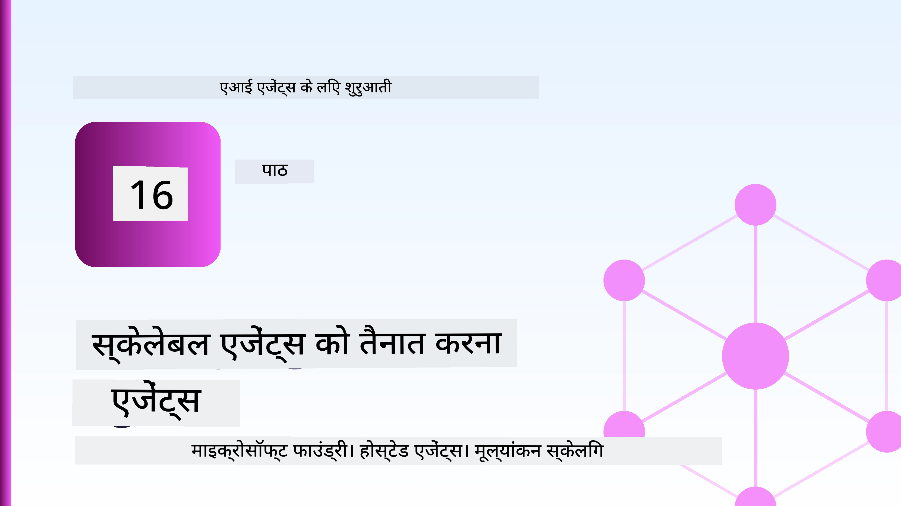
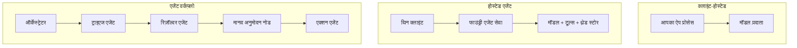
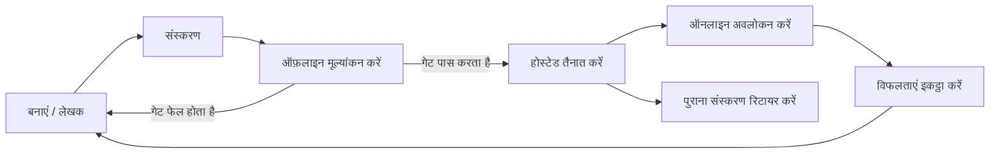
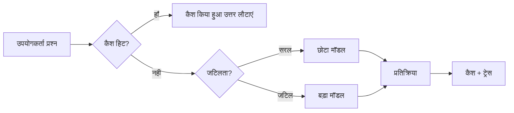
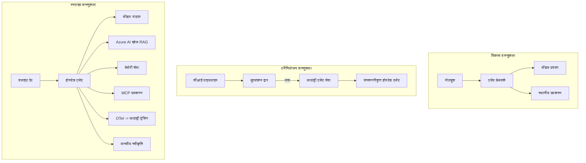

# Microsoft Foundry के साथ स्केलेबल एजेंट्स तैनात करना



अब तक आपने ऐसे एजेंट बनाए हैं जो आपके लैपटॉप पर चलते हैं, नोटबुक के अंदर, `az login` और कुछ पर्यावरण वेरिएबल्स के द्वारा संचालित होते हैं। यही सीखने का सही तरीका है। यह हजारों ग्राहकों पर निर्भर एजेंट चलाने का सही तरीका नहीं है, खासकर रात 3 बजे।

यह पाठ उस अंतर के बारे में है "यह मेरे मशीन पर काम करता है" और "यह उत्पादन में विश्वसनीयता और किफायती तरीके से काम करता है।" हम इस अंतर को **Microsoft Foundry** और **Microsoft Foundry Agent Service** का उपयोग करके पूरा करते हैं, और हम इसे एक वास्तविक ग्राहक सहायता एजेंट बनाकर करते हैं जिसमें उपकरण, पुनःप्राप्ति, मेमोरी, मूल्यांकन, और निगरानी होती है।

## परिचय

यह पाठ निम्नलिखित को कवर करेगा:

- **प्रोटोटाइप एजेंट** और **तैनात एजेंट** के बीच का अंतर, और क्यों परिवर्तन मॉडल के *आसपास* सब कुछ होता है।
- एजेंट्स के लिए **तैनाती पैटर्न**: क्लाइंट-होस्टेड, सेवा-होस्टेड (होस्टेड एजेंट्स), और वर्कफ़्लो-आयोजित।
- Microsoft Foundry पर **एजेंट जीवनचक्र** — निर्माण, संस्करण, तैनाती, मूल्यांकन, निरीक्षण, सेवानिवृत्ति।
- **स्केलिंग रणनीतियाँ**: मॉडल रूटिंग, कैशिंग, समवर्तीता, और स्टेटलेस डिज़ाइन।
- OpenTelemetry और Foundry ट्रेसिंग के साथ **पारदर्शिता**।
- मॉडल चयन, रूटिंग, और मूल्यांकन गेट्स के माध्यम से **लागत अनुकूलन**।
- **उद्यम विचार**: शासन, मानव अनुमोदन, और उत्पादन में MCP सर्वर को सुरक्षित तरीके से चलाना।

## सीखने के लक्ष्य

इस पाठ को पूरा करने के बाद, आप जानेंगे कि कैसे:

- किसी दिए गए एजेंट कार्यभार के लिए सही तैनाती पैटर्न चुनें।
- Microsoft Foundry Agent Service पर एजेंट तैनात करें ताकि यह संस्करणीकृत, शासित, और दृष्टिगोचर हो सके।
- ट्रेसिंग के लिए एजेंट को इंस्ट्रूमेंट करें और हर रिलीज़ से पहले चलने वाली मूल्यांकन पाइपलाइन जोड़ें।
- स्केल में लेटेंसी और लागत को नियंत्रित रखने के लिए मॉडल रूटिंग और कैशिंग लागू करें।
- उच्च जोखिम वाली क्रियाओं के लिए मानव अनुमोदन गेट जोड़ें और उत्पादन-सुरक्षित तरीके से MCP सर्वर को एकीकृत करें।

## पूर्व आवश्यकताएँ

यह पाठ मानता है कि आपने पहले के पाठ पूरे कर लिए हैं और निम्न में सहज हैं:

- [Microsoft Agent Framework](../14-microsoft-agent-framework/README.md) के साथ एजेंट बनाना (पाठ 14)।
- [टूल उपयोग](../04-tool-use/README.md) (पाठ 4) और [एजेंटिक RAG](../05-agentic-rag/README.md) (पाठ 5)।
- [एजेंट मेमोरी](../13-agent-memory/README.md) (पाठ 13) और [एजेंटिक प्रोटोकॉल / MCP](../11-agentic-protocols/README.md) (पाठ 11)।
- [पारदर्शिता और मूल्यांकन](../10-ai-agents-production/README.md) (पाठ 10) — यह पाठ सीधे उसी पर आधारित है।

आपको इसके अलावा आवश्यकता होगी:

- एक **Azure सदस्यता** और कम से कम एक तैनात चैट मॉडल के साथ एक **Microsoft Foundry परियोजना**।
- **Azure CLI** प्रमाणीकृत (`az login`)।
- Python 3.12+ और रिपॉजिटरी में मौजूद पैकेज [`requirements.txt`](../../../requirements.txt)।

## प्रोटोटाइप से प्रोडक्शन: वास्तव में क्या बदलता है

एक प्रोटोटाइप एजेंट और एक उत्पादन एजेंट का मूल लूप समान होता है — तर्क करें, उपकरण कॉल करें, प्रतिक्रिया दें। जो बदलाव होता है वह उस लूप के आस-पास का सब कुछ होता है। मॉडल शायद उत्पादन एजेंट का 20% होता है; बाकी 80% परिचालन ढांचा होता है।

| चिंता | प्रोटोटाइप | उत्पादन |
| --- | --- | --- |
| **होस्टिंग** | आपके नोटबुक में चलता है | होस्टेड सेवा के रूप में चलता है, संस्करणीकृत और चरणबद्ध किया जाता है |
| **पहचान** | आपका `az login` टोकन | स्कोप्ड RBAC के साथ प्रबंधित पहचान |
| **स्थिति** | इन-मेमोरी, पुनः आरंभ पर खो जाता है | बाह्यीकृत (थ्रेड स्टोर, मेमोरी सेवा) |
| **असफलता** | आप ट्रेसबैक देखते हैं | पुनः प्रयास, फॉलबैक्स, डेड-लेटर, अलर्ट |
| **लागत** | "यह कुछ सेंट है" | अनुरोध के अनुसार ट्रैक किया जाता है, रूटेड, कैश्ड, बजटेड |
| **गुणवत्ता** | आप आउटपुट देखते हैं | हर रिलीज़ से पहले स्वचालित रूप से मूल्यांकित |
| **विश्वास** | आप प्रत्येक क्रिया को स्वीकृत करते हैं | नीति + जोखिम भरे कार्यों के लिए मानव-इन-द-लूप |

इस तालिका को ध्यान में रखें। नीचे प्रत्येक अनुभाग इनमें से किसी एक पंक्ति से जुड़ा है।

## एजेंट तैनाती पैटर्न

तीन पैटर्न हैं जिन्हें आप अक्सर संयोजन में उपयोग करेंगे।

### 1. क्लाइंट-होस्टेड एजेंट्स

एजेंट ऑब्जेक्ट *आपके* आवेदन प्रक्रिया के अंदर रहता है। आपका कोड सीधे मॉडल प्रदाता को कॉल करता है; तर्क लूप आपके सेवा में चलता है। यही हर पिछले पाठ ने किया है।

- **अनुपयोग कब करें** जब आपको लूप पर पूर्ण नियंत्रण, कस्टम मिडलवेयर की जरूरत हो, या आप मौजूदा बैकएंड में एजेंट एम्बेड कर रहे हों।
- **सौदा-फ़र्क**: आपको स्केलिंग, स्थिति, और स्थिरता का स्वामी होना पड़ता है।

### 2. होस्टेड एजेंट्स (Foundry Agent Service)

एजेंट Microsoft Foundry में *एक संसाधन के रूप में पंजीकृत* होता है। Foundry तर्क लूप होस्ट करता है, थ्रेड स्टोर करता है, सामग्री सुरक्षा और RBAC लागू करता है, और एजेंट को Foundry पोर्टल में दर्शाता है। आपकी ऐप एक पतला क्लाइंट बन जाती है जो थ्रेड बनाता है और प्रतिक्रियाएँ पढ़ता है।

- **अनुपयोग कब करें** जब आपको स्थिरता, अंतर्निर्मित पारदर्शिता, शासन, और कम परिचालन क्षेत्र चाहिए।
- **सौदा-फ़र्क**: प्रबंधित रनटाइम के बदले कम निचले स्तर का नियंत्रण।

### 3. एजेंट वर्कफ़्लोज़

कई एजेंट (और उपकरण) एक ग्राफ में संयोजित होते हैं जिसमें स्पष्ट नियंत्रण प्रवाह होता है — अनुक्रमिक चरण, शाखाएँ, मानव अनुमोदन नोड, और टिकाऊ चेकपॉइंट जो रोक सकते हैं और फिर से शुरू कर सकते हैं। यह Microsoft Agent Framework की **वर्कफ़्लोज़** क्षमता है जो तैनाती पैमाने पर लागू होती है।

- **अनुपयोग कब करें** जब एक कार्य कई विशेषीकृत एजेंटों में फैला हो या बीच में अनुमोदन चरण की आवश्यकता हो।
- **सौदा-फ़र्क**: अधिक गतिशील भाग; ऑर्केस्ट्रेशन स्तर की पारदर्शिता आवश्यक।



## Microsoft Foundry पर एजेंट जीवनचक्र

एजेंट तैनात करना एक बार का `push` नहीं है। यह एक लूप है, और यह सॉफ्टवेयर रिलीज़ चक्र जैसा दिखता है क्योंकि वास्तव में यही है।



मुख्य विचार, [पाठ 10](../10-ai-agents-production/README.md) से लिया गया: **ऑफ़लाइन मूल्यांकन एक गेट है, अंत सोच नहीं।** एक नया एजेंट संस्करण तभी जारी होता है जब वह आपके मूल्यांकन मानदंडों को पार कर लेता है। ऑनलाइन पारदर्शिता फिर वास्तविक विश्व की विफलताओं को आपके ऑफ़लाइन परीक्षण सेट में वापस भेजती है। यही पूरा लूप है।

## स्केलिंग रणनीतियाँ

एजेंट को स्केल करना स्टेटलेस वेब API के स्केल से अलग है, क्योंकि हर अनुरोध कई महंगे मॉडल और टूल कॉल ट्रिगर कर सकता है। चार तकनीकें अधिकांश भार को संभालती हैं।

**स्टेटलेस अनुरोध हैंडलिंग।** अपनी प्रोसेस मेमोरी में किसी उपयोगकर्ता की स्थिति न रखें। वार्तालाप थ्रेड को Foundry थ्रेड स्टोर या मेमोरी सेवा में स्थायी बनाएं ताकि कोई भी उदाहरण कोई भी अनुरोध संभाल सके। यही आपको क्षैतिज स्केलिंग की अनुमति देता है — उदाहरण जोड़ें, कोई स्टिकी सेशन नहीं।

**मॉडल रूटिंग।** हर अनुरोध को आपके सबसे सक्षम (और सबसे महंगे) मॉडल की जरूरत नहीं होती। सरल अनुरोध — उद्देश्य वर्गीकरण, संक्षिप्त तथ्यात्मक उत्तर — को छोटे, तेज मॉडल की ओर रूट करें, और बड़े मॉडल को वास्तविक तर्क के लिए रखें। Foundry का **Model Router** आपके लिए यह कर सकता है, या आप हल्का वर्गीकर्ता खुद बना सकते हैं। आप लैब में DIY संस्करण बनाएंगे।

**प्रतिक्रिया कैशिंग।** कई समर्थन प्रश्न लगभग डुप्लिकेट होते हैं ("मैं अपना पासवर्ड कैसे रीसेट करूं?")। सामान्य प्रश्नों के उत्तर कैश करें और उन्हें मॉडल को हिट किए बिना सर्व करें। यहां तक कि मध्यम कैश हिट दर भी लागत और विलंबता को महत्वपूर्ण रूप से कम करती है।

**समवर्तीता और बैकप्रेशर।** मॉडल प्रदाताओं के पास दर सीमाएं होती हैं। अपनी समवर्तीता को सीमित करें, एक्सपोनेंशियल बैकऑफ के साथ पुनः प्रयास करें, और सुंदर रूप से असफल हों (एक कतारबद्ध "हम कार्य कर रहे हैं" प्रतिक्रिया 500 की तुलना में बेहतर है)।



## उत्पादन में पारदर्शिता

आप वह नहीं चला सकते जो आप नहीं देख सकते। जैसा कि पाठ 10 में बताया गया है, Microsoft Agent Framework स्वाभाविक रूप से **OpenTelemetry** ट्रेस जारी करता है — हर मॉडल कॉल, उपकरण आह्वान, और ऑर्केस्ट्रेशन चरण एक स्पैन बन जाता है। उत्पादन में आप उन स्पैनों को Microsoft Foundry (या किसी भी OTel-अनुकूल बैकएंड) में एक्सपोर्ट करते हैं ताकि आप:

- एक ग्राहक शिकायत को अंत से अंत तक हर मॉडल और उपकरण कॉल के पार ट्रेस कर सकें।
- समय के साथ p50/p95 विलंबता और लागत प्रति अनुरोध देख सकें।
- त्रुटि-दर उछाल और लागत असमानताओं पर आपके उपयोगकर्ताओं (या आपके वित्त विभाग) से पहले अलर्ट कर सकें।

```python
from agent_framework.observability import get_tracer

tracer = get_tracer()

with tracer.start_as_current_span("support_request") as span:
    span.set_attribute("customer.tier", "enterprise")
    span.set_attribute("routed.model", "gpt-5-nano")
    # एजेंट निष्पादन स्वचालित रूप से इस स्पैन के अंदर ट्रेस किया जाता है
```

`customer.tier` और `routed.model` जैसे गुण ट्रेसेस की दीवार को उत्तर देने योग्य सवालों में बदल देते हैं ("क्या एंटरप्राइज़ ग्राहक बहुत बार छोटे मॉडल की ओर रूट हो रहे हैं?")।

## लागत अनुकूलन

उत्पादन एजेंट्स में लागत टोकन द्वारा नियंत्रित होती है। तीन लीवर, प्रभाव के क्रम में:

1. **मॉडल का सही आकार चुनें।** एक छोटा मॉडल जो आपके मूल्यांकन गेट को पार करता है, लगभग हमेशा बड़ा मॉडल जो पार करता है उससे सस्ता होता है। आवश्यक रूप से सबसे बड़ा मॉडल चुनने के बजाय मूल्यांकन का उपयोग यह साबित करने के लिए करें कि छोटा मॉडल पर्याप्त अच्छा है।
2. **जटिलता के अनुसार रूट करें।** जैसा ऊपर बताया गया — बड़ी मॉडल की कीमत केवल उन अनुरोधों के लिए चुकाएं जिन्हें बड़ी मॉडल तर्क की जरूरत हो।
3. **ज़ोरदार कैशिंग करें।** सबसे सस्ता मॉडल कॉल वह है जो आप कभी नहीं करते।

मूल्यांकन गेट्स और लागत नियंत्रण दोनों दृष्टिकोण से एक ही अनुशासन हैं: मूल्यांकन आपको *गुणवत्ता का न्यूनतम स्तर* बताता है, रूटिंग और कैशिंग लागत को उस न्यूनतम स्तर के जितना संभव हो पास रखते हैं।

## एंटरप्राइज़ तैनाती विचार

**शासन।** होस्टेड एजेंट्स Foundry के RBAC, सामग्री सुरक्षा, और ऑडिट लॉगिंग को प्राप्त करते हैं। प्रत्येक एजेंट को न्यूनतम आवश्यक विशेषाधिकार के साथ एक प्रबंधित पहचान दें — ज्ञान आधार पढ़ने का केवल-पढ़ने का एक्सेस, टिकटिंग API के लिए सीमित एक्सेस, इससे अधिक कुछ नहीं।

**मानव-इन-द-लूप।** कुछ क्रियाएं सीधे स्वचालित करने के लिए बहुत परिणामस्वरूप होती हैं — रिफंड जारी करना, खाता हटाना, कानूनी टीम को बढ़ाना। Microsoft Agent Framework **अनुमोदन-आवश्यक** उपकरणों का समर्थन करता है: एजेंट क्रिया प्रस्तावित करता है, निष्पादन रुका रहता है, एक मानव स्वीकृत या अस्वीकृत करता है, और वर्कफ़्लो फिर से शुरू होता है। आपने इसे [पाठ 6](../06-building-trustworthy-agents/README.md) में देखा; यहां आप इसे तैनात करते हैं।

**उत्पादन में MCP।** [MCP](../11-agentic-protocols/README.md) आपके एजेंट को एक मानक इंटरफ़ेस के माध्यम से बाहरी उपकरणों का उपभोग करने देता है। उत्पादन में, हर MCP सर्वर को एक अविश्वसनीय सीमा के रूप में मानें: सर्वर संस्करण पिन करें, इसे सीमित पहचान के साथ चलाएं, इसके आउटपुट को सत्यापित करें, और इसे कभी भी सीक्रेट्स उजागर न करें। एक MCP सर्वर निर्भरता है, और निर्भरताएँ पैच, ऑडिट, और दर-सीमित होती हैं।



ये तीन आरेख — विकास, तैनाती, रनटाइम — एजेंट के जीवन के तीन चरण हैं। इसके बाद की प्रयोगशाला आपको इन्हें बनाने के लिए मार्गदर्शन करेगी।

## हैंड्स-ऑन लैब: एक उत्पादन-तैयार ग्राहक सहायता एजेंट

[`code_samples/16-python-agent-framework.ipynb`](./code_samples/16-python-agent-framework.ipynb) खोलें और इसे शुरू से अंत तक काम करें। आप एक **Contoso ग्राहक सहायता एजेंट** बनाएंगे जिसमें हर उत्पादन चिंता सम्मिलित होगी:

1. **टूल कॉलिंग** — आदेश स्थिति देखें और समर्थन टिकट खोलें।
2. **RAG** — ज्ञान आधार से नीति प्रश्नों के उत्तर (Azure AI Search, एक इन-मेमोरी फॉलबैक के साथ ताकि नोटबुक बिना सर्च संसाधन के चले)।
3. **मेमोरी** — वार्तालाप के मोड़ के दौरान ग्राहक को याद रखें।
4. **मॉडल रूटिंग** — एक जटिलता वर्गीकर्ता हर अनुरोध को छोटे या बड़े मॉडल की ओर भेजता है।
5. **प्रतिक्रिया कैशिंग** — बार-बार पूछे गए प्रश्न कैश से सर्व किए जाते हैं।
6. **मानव अनुमोदन** — एक सीमा से अधिक रिफंड मानव अनुमोदन के लिए रुकते हैं।
7. **मूल्यांकन पाइपलाइन** — एक छोटा ऑफ़लाइन परीक्षण सेट एजेंट को स्कोर करता है और रिलीज़ गेट के रूप में काम करता है।
8. **पारदर्शिता** — हर अनुरोध के चारों ओर OpenTelemetry ट्रेसिंग।

### वॉकथ्रू

नोटबुक इस प्रकार व्यवस्थित है कि हर उत्पादन चिंता एक स्व-निहित, चलाने योग्य अनुभाग है। इसका दिल रूटिंग-प्लस-कैशिंग अनुरोध हैंडलर है:

```python
async def handle_support_request(query: str, customer_id: str) -> str:
    # 1. जब संभव हो तो कैश से सेवा दें।
    cached = response_cache.get(normalize(query))
    if cached:
        return cached

    # 2. लागत नियंत्रित करने के लिए जटिलता के अनुसार मार्गदर्शन करें।
    model = "gpt-5-nano" if is_simple(query) else "gpt-5-mini"

    # 3. अवलोकनीयता के लिए एजेंट को ट्रेस स्पैन के अंदर चलाएं।
    with tracer.start_as_current_span("support_request") as span:
        span.set_attribute("routed.model", model)
        span.set_attribute("customer.id", customer_id)
        response = await support_agent.run(query, model=model)

    # 4. कैश करें और वापस करें।
    response_cache.set(normalize(query), response.text)
    return response.text
```

रिलीज़ की सुरक्षा करने वाला मूल्यांकन गेट ऐसा दिखता है:

```python
async def evaluation_gate(agent, test_cases, threshold: float = 0.8) -> bool:
    passed = 0
    for case in test_cases:
        result = await agent.run(case["input"])
        if score_response(result.text, case["expected"]) >= 0.8:
            passed += 1
    pass_rate = passed / len(test_cases)
    print(f"Evaluation pass rate: {pass_rate:.0%} (gate: {threshold:.0%})")
    return pass_rate >= threshold  # केवल तभी तैनात करें जब गेट पास हो जाए
```

प्रत्येक पंक्ति पढ़ें — नोटबुक प्राइमिटिव्स को जानबूझकर छोटा रखता है ताकि फ्रेमवर्क कॉल के पीछे कुछ छिपा न रहे।

## तैनात एजेंट की स्मोक टेस्ट से पुष्टि करना

ऊपर दिया गया मूल्यांकन गेट आपके एजेंट ऑब्जेक्ट के खिलाफ *ऑफ़लाइन* रन होता है। एक बार एजेंट को Hosted Agent के रूप में तैनात कर लेने पर, आपको एक और, और भी सस्ता जांच चाहिए: **क्या तैनात एंडपॉइंट वास्तव में जवाब दे रहा है?**

"सफलतापूर्वक" तैनात करने से केवल नियंत्रण विमान के डिफिनिशन को स्वीकार करने का प्रमाण मिलता है — यह साबित नहीं करता कि एजेंट प्रतिक्रिया देता है। एक गायब निर्भरता, खराब मॉडल रूटिंग, या समाप्त कनेक्शन एक हरी तैनाती छोड़ सकते हैं जो कुछ नहीं लौटाती। एक **स्मोक टेस्ट** इसे सेकंडों में पकड़ लेता है, हर तैनाती पर, पूरी मूल्यांकन की लागत के बिना।

यह रिपॉजिटरी [AI स्मोक टेस्ट](https://github.com/marketplace/actions/ai-smoke-test) GitHub Action पर आधारित एक तैयार उपयोग स्मोक टेस्ट पाइपलाइन भेजती है:

- **कैटलॉग** — [`tests/lesson-16-smoke-tests.json`](../../../tests/lesson-16-smoke-tests.json) में Contoso सपोर्ट एजेंट के लिए प्रॉम्प्ट और दावे होते हैं (ग्राउंडेड नीति उत्तर, आदेश जांच, टॉपिक पर बने रहना, और मल्टी-टर्न थ्रेड निरंतरता)। अन्य पाठों के एजेंटों के लिए कैटलॉग इससे साथ रहते हैं — देखें [`tests/README.md`](../tests/README.md)।
- **वर्कफ़्लो** — [`.github/workflows/smoke-test.yml`](../../../.github/workflows/smoke-test.yml) Azure OIDC के साथ लॉग इन करता है और एजेंट के Responses एंडपॉइंट पर प्रत्येक प्रॉम्प्ट पोस्ट करता है, किसी भी दावा चूक पर जॉब फेल कर देता है।

```yaml
- name: Smoke-test hosted agent
  uses: JFolberth/ai-smoketest@v1
  with:
    project_endpoint: ${{ inputs.project_endpoint }}
    agent_name: ContosoSupportAgent
    tests_file: tests/lesson-16-smoke-tests.json
```


एक बार आपका एजेंट तैनात हो जाने के बाद इसे **Actions** टैब से चलाएँ, अपनी Foundry परियोजना एंडपॉइंट और एजेंट नाम प्रदान करते हुए। फेडरेटेड आइडेंटिटी को Foundry परियोजना स्कोप पर **Azure AI User** भूमिका की आवश्यकता होती है। परतों को एक पिरामिड के रूप में सोचें: स्मोक टेस्ट (पहुंच योग्य और प्रतिक्रिया दे रहा है?) हर तैनाती पर चलें, ऑफ़लाइन मूल्यांकन (शिपिंग के लिए पर्याप्त अच्छा है?) पदोन्नति से पहले चलता है, और ऑनलाइन मूल्यांकन (यह असली स्थिति में कैसा कर रहा है?) लगातार चलता रहता है।

## ज्ञान जांच

असाइनमेंट पर जाने से पहले अपनी समझ का परीक्षण करें।

**1. लगभग उत्पादन एजेंट में "मॉडल" कितना हिस्सा होता है, और बाकी क्या होता है?**

<details>
<summary>उत्तर</summary>

मॉडल सिस्टम का एक अल्पांश होता है — अक्सर लगभग 20% माना जाता है। बाकी संचालन संबंधी ढांचा होता है: होस्टिंग और संस्करण प्रबंधन, पहचान और RBAC, बाहरीकृत स्थिति, विफलता हैंडलिंग, लागत ट्रैकिंग, मूल्यांकन, और मानव-इन-द-लूप नियंत्रण। उत्पादन में जाने का मतलब ज्यादातर तर्की लूप के *चारों ओर* सब कुछ बनाना होता है।
</details>

**2. आप कब एक Hosted Agent को क्लाइंट-होस्टेड एजेंट की बजाय चुनेंगे?**

<details>
<summary>उत्तर</summary>

जब आप एक प्रबंधित रनटाइम चाहते हैं जिसमें अंतर्निहित स्थिरता (ऐसे थ्रेड जो टिकें और फिर से शुरू हो सकें), अवलोकनीयता, सामग्री सुरक्षा, और RBAC हो, और आप कुछ निम्न-स्तरीय नियंत्रण को कम परिचालन सतह के लिए त्यागने को तैयार हों। क्लाइंट-होस्टेड तब बेहतर होता है जब आपको लूप पर पूर्ण नियंत्रण चाहिए या आप एजेंट को मौजूदा बैकएंड में एम्बेड कर रहे हों।
</details>

**3. एक स्केलेबल एजेंट को अपने स्वयं के प्रक्रिया मेमोरी में स्टेटलेस क्यों होना चाहिए?**

<details>
<summary>उत्तर</summary>

ताकि कोई भी इंस्टेंस कोई भी अनुरोध संभाल सके, जो कि बिना स्टिकी सेशंस के हॉरिज़ॉन्टल स्केलिंग की अनुमति देता है। प्रति-यूज़र बातचीत की स्थिति थ्रेड स्टोर या मेमोरी सेवा में बाहरीकृत होती है। अगर स्थिति प्रक्रिया मेमोरी में होती, तो पुनः प्रारंभ पर आप इसे खो देते और लोड को स्वतंत्र रूप से वितरित नहीं कर पाते।
</details>

**4. मॉडल राउटिंग किस समस्या का समाधान करता है, और इसका मूल्यांकन से क्या संबंध है?**

<details>
<summary>उत्तर</summary>

राउटिंग सरल अनुरोधों को छोटे, सस्ते, तेज मॉडल की ओर भेजती है और बड़े मॉडल को वास्तविक तर्क के लिए आरक्षित रखती है, जो विलंबता और लागत दोनों को नियंत्रित करती है। यह मूल्यांकन से जुड़ा है क्योंकि मूल्यांकन यह साबित करता है कि छोटा मॉडल एक वर्ग के अनुरोधों के लिए पर्याप्त अच्छा है — बिना मूल्यांकन के राउटिंग सिर्फ अनुमान है।
</details>

**5. "मूल्यांकन गेट" क्या है और यह जीवनचक्र में कहाँ स्थित होता है?**

<details>
<summary>उत्तर</summary>

एक मूल्यांकन गेट नए एजेंट संस्करण के खिलाफ एक ऑफ़लाइन टेस्ट सेट चलाता है और पास दर थ्रेशोल्ड पार न करने पर तैनाती को ब्लॉक कर देता है। यह जीवनचक्र में "संस्करण" और "तैनाती" के बीच स्थित होता है, जिससे गुणवत्ता रिलीज़ के लिए पूर्व शर्त बनती है न कि शिपिंग के बाद जाँच।
</details>

**6. उत्पादन में MCP सर्वर को अविश्वसनीय सीमा के रूप में क्यों माना जाना चाहिए?**

<details>
<summary>उत्तर</summary>

क्योंकि यह एक बाहरी निर्भरता है जिसमे आपका एजेंट कॉल करता है। आपको इसका संस्करण पिन करना चाहिए, इसे स्कोप्ड पहचान के साथ चलाना चाहिए, इसके आउटपुट को सत्यापित करना चाहिए, रेट-लिमिट लगानी चाहिए, और इसके लिए कभी भी रहस्यों को उजागर नहीं करना चाहिए — बिलकुल उसी अनुशासन के साथ जो आप किसी तीसरे पक्ष की निर्भरता के लिए अपनाते हैं। इसके आउटपुट आपके एजेंट के तर्क में बहते हैं, इसलिए बिना सत्यापन के विश्वास सुरक्षा जोखिम है।
</details>

**7. आमतौर पर उत्पादन एजेंट की लागत पर सबसे बड़ा प्रभाव कौन सा एकल परिवर्तन डालता है, और क्यों?**

<details>
<summary>उत्तर</summary>

मॉडल का उचित आकार चयन करना — सबसे छोटा मॉडल चुनना जो अभी भी आपके मूल्यांकन गेट को पास करता हो। लागत टोकनों द्वारा नियंत्रित होती है, और एक छोटा मॉडल जो गुणवत्ता पर खरा उतरता है वह लगभग हमेशा बड़े मॉडल की तुलना में सस्ता होता है। इसके बाद कैशिंग और राउटिंग लागत को और कम कर देते हैं, लेकिन सही मूल मॉडल चुनना सबसे बड़ा प्रथम-आदेश प्रभाव डालता है।
</details>

**8. `customer.tier` और `routed.model` जैसे स्पैन एट्रिब्यूट अवलोकनीयता में क्या भूमिका निभाते हैं?**

<details>
<summary>उत्तर</summary>

ये कच्चे ट्रेसेस को उत्तर योग्य व्यावसायिक सवालों में बदल देते हैं। बिना एट्रिब्यूट्स के आपके पास स्पैन्स की एक दीवार होती है; इनके साथ आप पूछ सकते हैं "क्या एंटरप्राइज ग्राहक बहुत बार छोटे मॉडल की ओर राउट हो रहे हैं?" या "हमारे सबसे धीमे अनुरोधों को कौन सा मॉडल संभाल रहा है?" एट्रिब्यूट्स वे आयाम हैं जिनके अनुसार आप टेलीमेट्री को अपने ऑपरेशन के लिए महत्वपूर्ण होते हुए स्लाइस करते हैं।
</details>

## असाइनमेंट

लैब के ग्राहक सहायता एजेंट को लेकर उसे एक विशिष्ट परिदृश्य के लिए मजबूत बनाएं: **एक SaaS कंपनी के लिए सब्सक्रिप्शन बिलिंग सहायता एजेंट।**

आपकी प्रस्तुति में:

1. **उपकरणों को बदलें**: बिलिंग-संबंधित `get_subscription_status`, `get_invoice`, और `issue_credit` टूल्स से (50$ से ऊपर के क्रेडिट के लिए मानव स्वीकृति आवश्यक है)।
2. **तीन RAG दस्तावेज़ जोड़ें** जो कंपनी की रिफंड नीति, बिलिंग चक्र, और रद्द करने की नीति को कवर करें।
3. **मूल्यांकन सेट को विस्तार दें** कम से कम आठ मामलों तक, जिनमें से कम से कम दो मानवीय-स्वीकृति पथ को ट्रिगर करने चाहिए, और सुनिश्चित करें कि आपका मूल्यांकन गेट सही ढंग से पास या फेल होता है।
4. **एक लागत रिपोर्ट जोड़ें**: एजेंट के माध्यम से दस मिश्रित प्रश्न चलाने के बाद, यह प्रिंट करें कि कितने छोटे मॉडल को, कितने बड़े मॉडल को, और कितने कैश से सेवा दी गई।

एक संक्षिप्त पैराग्राफ (मार्कडाउन सेल में) लिखें जिसमें आप बताते हैं कि आपने कौन सा मॉडल-राउटिंग नियम चुना और आप इसे वास्तविक ट्रैफ़िक के साथ कैसे मान्य करेंगे। कोई एकल सही उत्तर नहीं है — आपको यह आंका जाएगा कि क्या उत्पादन चिंता को सहसंबद्ध रूप से जोड़ा गया है।

## सारांश

इस पाठ में आपने Microsoft Foundry के साथ एक एजेंट को प्रोटोटाइप से उत्पादन में ले जाया:

- उत्पादन में छलांग ज्यादातर मॉडल के चारों ओर के **ऑपरेशनल कंकाल** के बारे में होती है — होस्टिंग, पहचान, स्थिति, विफलता हैंडलिंग, लागत, गुणवत्ता, और ट्रस्ट।
- आपने तीन **तैनाती पैटर्न** सीखे — क्लाइंट-होस्टेड, Hosted Agents, और Agent Workflows — और कब कौन सा उपयुक्त होता है।
- आपने **एजेंट जीवनचक्र** पर चलना सीखा, जहाँ ऑफ़लाइन **मूल्यांकन रिलीज़ गेट के रूप में कार्य करता है** और ऑनलाइन अवलोकनीयता विफलताओं को टेस्ट सेट में वापस डालती है।
- आपने **स्केलिंग रणनीतियाँ** लागू कीं — स्टेटलेस डिजाइन, मॉडल राउटिंग, कैशिंग, और सीमित समवर्तीपन — और इन्हें **लागत अनुकूलन** से जोड़ा।
- आपने **एंटरप्राइज नियंत्रण** लागू किए: RBAC, मानव-इन-द-लूप स्वीकृति, और उत्पादन-सुरक्षित MCP इंटीग्रेशन।
- आपने एक **उत्पादन-तैयार ग्राहक सहायता एजेंट** बनाया जो इन सभी चिंताओं को रन करने योग्य कोड में जोड़ता है।

अगला पाठ विपरीत यात्रा लेता है: क्लाउड में एजेंट्स को स्केल अप करने की बजाय, आप उन्हें एकल डेवलपर मशीन पर ला कर पूरी तरह स्थानीय रूप से चलाएंगे।

## अतिरिक्त संसाधन

- <a href="https://learn.microsoft.com/azure/ai-foundry/what-is-azure-ai-foundry" target="_blank">Microsoft Foundry डाक्यूमेंटेशन</a>
- <a href="https://learn.microsoft.com/azure/ai-foundry/agents/overview" target="_blank">Microsoft Foundry Agent Service अवलोकन</a>
- <a href="https://learn.microsoft.com/en-us/agent-framework/overview/?wt.mc_id=youtube_26688_organicsocial_reactor&pivots=programming-language-python" target="_blank">Microsoft Agent Framework</a>
- <a href="https://learn.microsoft.com/azure/ai-foundry/concepts/model-router" target="_blank">Microsoft Foundry में Model Router</a>
- <a href="https://learn.microsoft.com/azure/search/search-what-is-azure-search" target="_blank">Azure AI Search</a>
- <a href="https://opentelemetry.io/" target="_blank">OpenTelemetry</a>
- <a href="https://github.com/marketplace/actions/ai-smoke-test" target="_blank">AI Smoke Test GitHub Action</a>
- <a href="https://modelcontextprotocol.io/" target="_blank">Model Context Protocol (MCP)</a>

## पिछला पाठ

[Building Computer Use Agents (CUA)](../15-browser-use/README.md)

## अगला पाठ

[स्थानीय AI एजेंट बनाना](../17-creating-local-ai-agents/README.md)

---

<!-- CO-OP TRANSLATOR DISCLAIMER START -->
**अस्वीकरण**:
इस दस्तावेज़ का अनुवाद AI अनुवाद सेवा [Co-op Translator](https://github.com/Azure/co-op-translator) का उपयोग करके किया गया है। जबकि हम सटीकता के लिए प्रयास करते हैं, कृपया ध्यान दें कि स्वचालित अनुवादों में त्रुटियाँ या अशुद्धियाँ हो सकती हैं। मूल दस्तावेज़ अपनी मूल भाषा में ही प्रामाणिक स्रोत माना जाना चाहिए। महत्वपूर्ण जानकारी के लिए, पेशेवर मानव अनुवाद की सिफारिश की जाती है। इस अनुवाद के उपयोग से उत्पन्न किसी भी गलतफहमी या गलत व्याख्या के लिए हम उत्तरदायी नहीं हैं।
<!-- CO-OP TRANSLATOR DISCLAIMER END -->