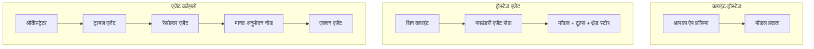
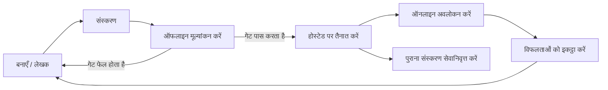
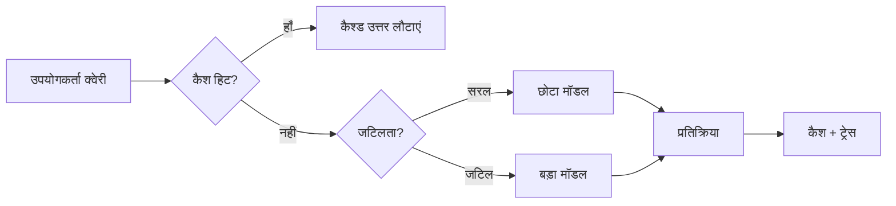
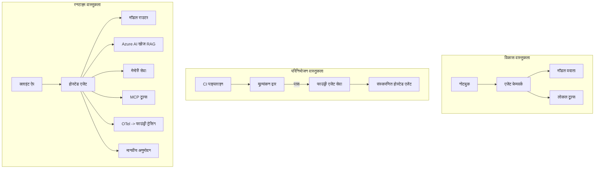

# Microsoft Foundry के साथ स्केलेबल एजेंट्स को परिनियोजित करना


इस पाठ्यक्रम के इस बिंदु तक आपने ऐसे एजेंट बनाए हैं जो आपके लैपटॉप पर, नोटबुक के अंदर, `az login` और कुछ पर्यावरण चर द्वारा संचालित होते हैं। यह सीखने का बिल्कुल सही तरीका है। यह उस एजेंट को चलाने का सही तरीका नहीं है जिस पर हजारों ग्राहक 3 बजे रात में निर्भर करते हैं।

यह पाठ "यह मेरे मशीन पर काम करता है" और "यह उत्पादन में विश्वसनीयता और किफायती तरीके से काम करता है" के बीच का अंतर है। हम इस अंतर को **Microsoft Foundry** और **Microsoft Foundry Agent Service** का उपयोग करके बंद करते हैं, और हम इसे एक वास्तविक ग्राहक सहायता एजेंट बनाकर करते हैं जिसमें टूल, पुनःप्राप्ति, मेमोरी, मूल्यांकन, और निगरानी शामिल हैं।

## परिचय

इस पाठ में शामिल होंगे:

- एक **प्रोटोटाइप एजेंट** और एक **परिनियोजित एजेंट** के बीच का अंतर, और क्यों रूपांतरण मॉडल के *आसपास* सब कुछ है।
- एजेंट के लिए **परिनियोजन पैटर्न**: क्लाइंट-होस्टेड, सेवा-होस्टेड (होस्टेड एजेंट्स), और वर्कफ़्लो-ऑर्केस्ट्रेटेड।
- Microsoft Foundry पर **एजेंट जीवनचक्र** — निर्माण, संस्करण, परिनियोजन, मूल्यांकन, निरीक्षण, सेवानिवृत्ति।
- **स्केलिंग रणनीतियाँ**: मॉडल राउटिंग, कैशिंग, समवर्तीता, और स्टेटलेस डिज़ाइन।
- OpenTelemetry और Foundry ट्रेसिंग के साथ **प्रेक्षणीयता**।
- मॉडल चयन, राउटिंग, और मूल्यांकन गेट्स के माध्यम से **लागत अनुकूलन**।
- **एंटरप्राइज़ विचार**: शासन, मानव स्वीकृति, और उत्पादन में MCP सर्वर को सुरक्षित रूप से चलाना।

## सीखने के लक्ष्य

इस पाठ को पूरा करने के बाद, आप जानेंगे कि कैसे:

- किसी दिए गए एजेंट कार्यभार के लिए सही परिनियोजन पैटर्न चुनें।
- एक एजेंट को Microsoft Foundry Agent Service पर परिनियोजित करें ताकि वह संस्करणित, शासित, और प्रेक्षणीय हो।
- ट्रेसिंग के लिए एजेंट को इंस्ट्रूमेंट करें और एक मूल्यांकन पाइपलाइन को कनेक्ट करें जो हर रिलीज़ से पहले चलती हो।
- मॉडल राउटिंग और कैशिंग लागू करें ताकि पैमाने पर विलंबता और लागत नियंत्रण में रहे।
- उच्च जोखिम वाले कार्यों के लिए मानव स्वीकृति गेट जोड़ें और MCP सर्वर को उत्पादन- सुरक्षित तरीके से एकीकृत करें।

## पूर्वापेक्षाएं

यह पाठ मानता है कि आपने पहले के पाठ पूरे कर लिए हैं और निम्न चीज़ों में आरामदायक हैं:

- [Microsoft Agent Framework](../14-microsoft-agent-framework/README.md) के साथ एजेंट बनाना (पाठ 14)।
- [टूल उपयोग](../04-tool-use/README.md) (पाठ 4) और [Agentic RAG](../05-agentic-rag/README.md) (पाठ 5)।
- [एजेंट मेमोरी](../13-agent-memory/README.md) (पाठ 13) और [Agentic प्रोटोकॉल / MCP](../11-agentic-protocols/README.md) (पाठ 11)।
- [प्रेक्षणीयता और मूल्यांकन](../10-ai-agents-production/README.md) (पाठ 10) — यह पाठ सीधे उस पर आधारित है।

आपको इसकी भी आवश्यकता होगी:

- एक **Azure सदस्यता** और एक **Microsoft Foundry प्रोजेक्ट** जिसमें कम से कम एक परिनियोजित चैट मॉडल हो।
- **Azure CLI** प्रमाणीकृत (`az login`)।
- Python 3.12+ और रिपॉजिटरी में मौजूद पैकेज [`requirements.txt`](../../../requirements.txt)।

## प्रोटोटाइप से उत्पादन तक: वास्तव में क्या बदलता है

एक प्रोटोटाइप एजेंट और एक उत्पादन एजेंट एक ही कोर लूप साझा करते हैं — तर्क देना, टूल कॉल करना, प्रतिक्रिया देना। जो बदलता है वह उस लूप के चारों ओर सब कुछ है। उत्पादन एजेंट में मॉडल लगभग 20% होता है; बाकी 80% परिचालन कंकाल होता है।

| विचार | प्रोटोटाइप | उत्पादन |
| --- | --- | --- |
| **होस्टिंग** | आपके नोटबुक में चलता है | होस्टेड सेवा के रूप में चलता है, संस्करणित और रोल आउट किया गया |
| **पहचान** | आपका `az login` टोकन | स्कोप्ड RBAC के साथ प्रबंधित पहचान |
| **स्थिति** | इन-मेमोरी, पुनः आरंभ करने पर खो जाती है | बाहरीकृत (थ्रेड स्टोर, मेमोरी सेवा) |
| **विफलता** | आप ट्रेसबैक देखते हैं | पुनः प्रयास, फॉलबैक, मृत-पत्र, अलर्ट |
| **लागत** | "यह कुछ सेंट्स है" | अनुरोध के हिसाब से ट्रैक, रूट, कैश, बजटित |
| **गुणवत्ता** | आप आउटपुट को अपनी आंखों से जांचते हैं | हर रिलीज़ से पहले स्वचालित रूप से मूल्यांकन किया जाता है |
| **विश्वास** | आप हर क्रिया को मंजूरी देते हैं | नीति + जोखिम भरे क्रियाओं के लिए मानव-इन-द-लूप |

इस तालिका को ध्यान में रखें। नीचे हर अनुभाग इनमें से एक पंक्ति से मेल खाता है।

## एजेंट परिनियोजन पैटर्न

आप जिन तीन पैटर्न का उपयोग करेंगे, अक्सर संयोजन में।

### 1. क्लाइंट-होस्टेड एजेंट्स

एजेंट ऑब्जेक्ट आपके *एप्लिकेशन प्रोसेस* के अंदर रहता है। आपका कोड सीधे मॉडल प्रदाता को कॉल करता है; तर्क लूप आपकी सेवा में चलता है। यह हर पिछले पाठ में किया गया है।

- **इसे इस्तेमाल करें जब** आपको लूप पर पूर्ण नियंत्रण, कस्टम मिडलवेयर की आवश्यकता हो, या आप एजेंट को मौजूदा बैकेंड के अंदर एम्बेड कर रहे हों।
- **समझौता**: आप खुद स्केलिंग, स्थिति, और लचीलेपन के मालिक होते हैं।

### 2. होस्टेड एजेंट्स (Foundry Agent Service)

एजेंट को Microsoft Foundry में *एक संसाधन के रूप में पंजीकृत* किया जाता है। Foundry तर्क लूप होस्ट करता है, थ्रेड स्टोर करता है, सामग्री सुरक्षा और RBAC लागू करता है, और Foundry पोर्टल में एजेंट को दिखाता है। आपकी ऐप एक पतला क्लाइंट बन जाती है जो थ्रेड्स बनाती है और प्रतिक्रियाएं पढ़ती है।

- **इसे इस्तेमाल करें जब** आप स्थिरता, अंतर्निहित प्रेक्षणीयता, शासन, और कम परिचालन क्षेत्र चाहते हैं।
- **समझौता**: प्रबंधित रनटाइम के बदले कम निचले-स्तर नियंत्रण।

### 3. एजेंट वर्कफ़्लोज़

कई एजेंट (और टूल्स) को स्पष्ट नियंत्रण प्रवाह वाले ग्राफ में जोड़ा जाता है — क्रमिक चरण, शाखाएं, मानव स्वीकृति नोड्स, और स्थायी चेकपॉइंट जो रोक और पुनः शुरू कर सकते हैं। यह Microsoft Agent Framework के **वर्कफ़्लोज़** क्षमता है जिसे परिनियोजन पैमाने पर लागू किया गया है।

- **इसे इस्तेमाल करें जब** एक कार्य कई विशेषीकृत एजेंटों में फैला हो या मध्य में स्वीकृति चरण की आवश्यकता हो।
- **समझौता**: और अधिक गतिशील भाग; ऑर्केस्ट्रेशन-स्तर की प्रेक्षणीयता आवश्यक।



## Microsoft Foundry पर एजेंट जीवनचक्र

एजेंट को परिनियोजित करना एक बार का `push` नहीं है। यह एक लूप है, और यह एक सॉफ़्टवेयर रिलीज़ चक्र की तरह दिखता है क्योंकि यह वही है।



मुख्य विचार, [Lesson 10](../10-ai-agents-production/README.md) से लिया गया है: **ऑफलाइन मूल्यांकन एक गेट है, आख़िरी सोच नहीं।** नया एजेंट संस्करण तब तक जारी नहीं होता जब तक वह आपके मूल्यांकन मानदंडों को पार नहीं कर लेता। ऑनलाइन प्रेक्षणीयता तब वास्तविक दुनिया की विफलताओं को आपके ऑफलाइन परीक्षण सेट में वापस भेजती है। यह पूरा लूप है।

## स्केलिंग रणनीतियाँ

एजेंट को स्केल करना एक स्टेटलेस वेब API को स्केल करने से अलग है, क्योंकि हर अनुरोध कई महंगे मॉडल और टूल कॉल को ट्रिगर कर सकता है। चार तकनीकें अधिकांश भार संभालती हैं।

**स्टेटलेस अनुरोध हैंडलिंग।** अपनी प्रक्रिया मेमोरी में कोई प्रति-उपयोगकर्ता स्थिति न रखें। संवाद थ्रेड्स को Foundry थ्रेड स्टोर या एक मेमोरी सेवा में स्टोर करें ताकि कोई भी इंस्टेंस किसी भी अनुरोध को संभाल सके। यह आपको क्षैतिज स्केलिंग की अनुमति देता है — इंस्टेंस जोड़ें, कोई चिपकने वाले सत्र नहीं।

**मॉडल राउटिंग।** हर अनुरोध को आपकी सबसे सक्षम (और सबसे महंगे) मॉडल की ज़रूरत नहीं होती। सरल अनुरोध — इरादा वर्गीकरण, छोटे तथ्यात्मक उत्तर — को एक छोटे, तेज मॉडल को रूट करें, और बड़े मॉडल को वास्तविक तर्क के लिए अलग रखें। Foundry का **Model Router** इसे आपके लिए कर सकता है, या आप खुद एक हल्का वर्गीकर्ता बना सकते हैं। आप लैब में DIY संस्करण बनाएंगे।

**प्रतिक्रिया कैशिंग।** कई सपोर्ट क्वेरीज़ लगभग डुप्लिकेट होती हैं ("मैं अपना पासवर्ड कैसे रीसेट करूँ?")। सामान्य प्रश्नों के उत्तर कैश करें और उन्हें बिना मॉडल हिट किए परोसें। एक मामूली कैश हिट रेट भी लागत और विलंबता को महत्वपूर्ण रूप से कम कर देता है।

**समवर्तीता और बैकप्रेशर।** मॉडल प्रदाताओं की दर सीमा होती है। अपनी समवर्तीता को सीमित करें, एक्सपोनेंशियल बैकऑफ के साथ पुनः प्रयास करें, और कुशलतापूर्वक असफल हों (एक कतारबद्ध "हम काम कर रहे हैं" प्रतिक्रिया 500 की तुलना में बेहतर है)।



## उत्पादन में प्रेक्षणीयता

आप वह नहीं चला सकते जो आप देख नहीं सकते। जैसे कि पाठ 10 में बताया गया है, Microsoft Agent Framework मूल रूप से **OpenTelemetry** ट्रेस उत्पन्न करता है — हर मॉडल कॉल, टूल इनवोकेशन, और ऑर्केस्ट्रेशन स्टेप एक स्पैन बन जाता है। उत्पादन में आप उन स्पैन्स को Microsoft Foundry (या किसी OTel- संगत बैकएंड) को एक्सपोर्ट करते हैं ताकि आप:

- एक ग्राहक शिकायत को अंत तक हर मॉडल और टूल कॉल तक ट्रेस कर सकें।
- समय के साथ p50/p95 विलंबता और प्रति अनुरोध लागत देखें।
- त्रुटि दर में अचानक वृद्धि और लागत असमानताओं पर अलर्ट करें इससे पहले कि आपके उपयोगकर्ता (या आपकी वित्त टीम) इसे महसूस करें।

```python
from agent_framework.observability import get_tracer

tracer = get_tracer()

with tracer.start_as_current_span("support_request") as span:
    span.set_attribute("customer.tier", "enterprise")
    span.set_attribute("routed.model", "gpt-5-nano")
    # एजेंट निष्पादन इस स्पैन के अंदर स्वचालित रूप से ट्रेस किया जाता है
```

`customer.tier` और `routed.model` जैसी विशेषताएं ट्रेसेस की प्रचंड दीवार को उत्तरदायी प्रश्नों ("क्या एंटरप्राइज़ ग्राहक बहुत बार छोटे मॉडल पर रूट हो रहे हैं?") में बदल देती हैं।

## लागत अनुकूलन

उत्पादन एजेंट्स में लागत टोकनों द्वारा नियंत्रित होती है। प्रभाव के क्रम में तीन लीवर:

1. **मॉडल को सही आकार दें।** एक छोटा मॉडल जो आपका मूल्यांकन गेट पार करता है, लगभग हमेशा एक बड़े मॉडल से सस्ता होता है जो भी पार करता है। सावधानी से सबसे बड़े मॉडल को उपयोग करने के बजाय मूल्यांकन का उपयोग करें कि छोटा मॉडल पर्याप्त अच्छा है।
2. **जटिलता के अनुसार रूट करें।** जैसा कि ऊपर बताया गया — केवल उन अनुरोधों के लिए बड़े मॉडल की कीमत चुकाएं जिन्हें बड़े मॉडल तर्क की आवश्यकता हो।
3. **आक्रामक रूप से कैश करें।** सबसे सस्ता मॉडल कॉल वही है जो आप कभी नहीं करते।

मूल्यांकन गेट्स और लागत नियंत्रण दोनों एक ही अनुशासन हैं जिन्हें दो दृष्टिकोणों से देखा जाता है: मूल्यांकन आपको *गुणवत्ता का निचला स्तर* बताता है, राउटिंग और कैशिंग आपको उस स्तर की *लागत* के करीब रखती हैं।

## एंटरप्राइज़ परिनियोजन विचार

**शासन।** होस्टेड एजेंट्स Foundry के RBAC, सामग्री सुरक्षा, और ऑडिट लॉगिंग को विरासत में पाते हैं। हर एजेंट को कम से कम आवश्यक विशेषाधिकार वाला प्रबंधित पहचान दें — ज्ञान आधार के लिए केवल पढ़ने की अनुमति, टिकटिंग API के लिए स्कोप्ड एक्सेस, अतिरेक नहीं।

**मानव-इन-द-लूप।** कुछ कार्य सीधे पूरी तरह से स्वचालित करने के लिए बहुत महत्वपूर्ण होते हैं — रिफंड जारी करना, खाता हटाना, कानूनी टीम को बढ़ावा देना। Microsoft Agent Framework **स्वीकृति-आवश्यक** टूल्स को सपोर्ट करता है: एजेंट कार्य का प्रस्ताव करता है, निष्पादन रुक जाता है, एक मानव स्वीकृत या अस्वीकृत करता है, और वर्कफ़्लो पुनः शुरू होता है। आपने [Lesson 6](../06-building-trustworthy-agents/README.md) में इस प्रिमिटिव को देखा था; यहां आप इसे परिनियोजित करते हैं।

**उत्पादन में MCP।** [MCP](../11-agentic-protocols/README.md) आपके एजेंट को एक मानक इंटरफ़ेस के माध्यम से बाहरी टूल्स उपयोग करने देता है। उत्पादन में, हर MCP सर्वर को अविश्वसनीय सीमा के रूप में मानें: सर्वर संस्करण पिन करें, इसे स्कोप्ड पहचान के साथ चलाएं, इसके आउटपुट को वैध करें, और इसके लिए कभी भी रहस्यों को उजागर न करें। MCP सर्वर एक निर्भरता है, और निर्भरताएं पैच, ऑडिट, और दर-सीमा वाली होती हैं।



ये तीन आरेख — विकास, परिनियोजन, रनटाइम — एक एजेंट के जीवन के तीन चरण हैं। इसके बाद का लैब आपको इसे बनाने के लिए मार्गदर्शन करता है।

## व्यावहारिक लैब: एक उत्पादन-तैयार ग्राहक सहायता एजेंट

खोलें [`code_samples/16-python-agent-framework.ipynb`](./code_samples/16-python-agent-framework.ipynb) और इसे अंत तक काम करें। आप एक **Contoso ग्राहक सहायता एजेंट** बनाएंगे जिसमें हर उत्पादन चिंता जुड़ी होगी:

1. **टूल कॉलिंग** — आदेश स्थिति देखें और समर्थन टिकट खोलें।
2. **RAG** — ज्ञान आधार से नीति प्रश्नों के उत्तर दें (Azure AI Search, एक मेमोरी बैकअप के साथ ताकि नोटबुक बिना Search संसाधन के चल सके)।
3. **मेमोरी** — बातचीत के चरणों के दौरान ग्राहक को याद रखें।
4. **मॉडल राउटिंग** — एक जटिलता वर्गीकर्ता प्रत्येक अनुरोध को छोटे या बड़े मॉडल पर रूट करता है।
5. **प्रतिक्रिया कैशिंग** — दोहराए गए प्रश्न कैश से सेवा किए जाते हैं।
6. **मानव स्वीकृति** — एक सीमा से ऊपर के रिफंड मानव अनुमोदन के लिए रोकते हैं।
7. **मूल्यांकन पाइपलाइन** — एक छोटा ऑफलाइन परीक्षण सेट एजेंट को स्कोर करता है और एक रिलीज़ गेट के रूप में कार्य करता है।
8. **प्रेक्षणीयता** — हर अनुरोध के चारों ओर OpenTelemetry ट्रेसिंग।

### मार्गदर्शन

नोटबुक इस तरह व्यवस्थित है कि प्रत्येक उत्पादन चिंता एक स्व-निहित, चलने योग्य अनुभाग है। इसका दिल राउटिंग-प्लस-कैशिंग अनुरोध हैंडलर है:

```python
async def handle_support_request(query: str, customer_id: str) -> str:
    # 1. जब हम कर सकें तो कैश से सर्व करें।
    cached = response_cache.get(normalize(query))
    if cached:
        return cached

    # 2. लागत नियंत्रित करने के लिए जटिलता के अनुसार मार्गदर्शन करें।
    model = "gpt-5-nano" if is_simple(query) else "gpt-5-mini"

    # 3. ऑब्ज़र्वेबिलिटी के लिए एजेंट को ट्रेस स्पैन के अंदर चलाएँ।
    with tracer.start_as_current_span("support_request") as span:
        span.set_attribute("routed.model", model)
        span.set_attribute("customer.id", customer_id)
        response = await support_agent.run(query, model=model)

    # 4. कैश करें और लौटाएँ।
    response_cache.set(normalize(query), response.text)
    return response.text
```

जो रिलीज़ की सुरक्षा करता मूल्यांकन गेट ऐसा दिखता है:

```python
async def evaluation_gate(agent, test_cases, threshold: float = 0.8) -> bool:
    passed = 0
    for case in test_cases:
        result = await agent.run(case["input"])
        if score_response(result.text, case["expected"]) >= 0.8:
            passed += 1
    pass_rate = passed / len(test_cases)
    print(f"Evaluation pass rate: {pass_rate:.0%} (gate: {threshold:.0%})")
    return pass_rate >= threshold  # केवल तभी तैनात करें जब गेट पास हो जाए
```

हर पंक्ति पढ़ें — नोटबुक ने प्रिमिटिव्स को जानबूझकर छोटा रखा है इसलिए कुछ भी फ्रेमवर्क कॉल के पीछे छिपा नहीं है।

## परिनियोजित एजेंट का स्मोक टेस्ट द्वारा सत्यापन

ऊपर दिया गया मूल्यांकन गेट आपके एजेंट ऑब्जेक्ट के खिलाफ *ऑफलाइन* चलता है। एक बार एजेंट को एक होस्टेड एजेंट के रूप में परिनियोजित करने के बाद, आपको एक और, और भी सस्ता परीक्षण चाहिए: **क्या परिनियोजित एंडपॉइंट वास्तव में जवाब दे रहा है?**

"सफलतापूर्वक" परिनियोजन केवल कंट्रोल प्लेन द्वारा परिभाषा को स्वीकार करने का प्रमाण है — यह यह प्रमाण नहीं है कि एजेंट प्रतिक्रिया देता है। एक गायब निर्भरता, एक खराब मॉडल राउटिंग, या एक समाप्त संयोजन एक हरा परिनियोजन छोड़ सकता है जो कुछ भी वापस नहीं करता। एक **स्मोक टेस्ट** इसे सेकंड में पकड़ लेता है, हर परिनियोजन पर, बिना पूर्ण मूल्यांकन की लागत के।

यह रिपॉजिटरी उपयोग के लिए तैयार स्मोक-टेस्ट पाइपलाइन भेजती है जो [AI Smoke Test](https://github.com/marketplace/actions/ai-smoke-test) GitHub Action पर आधारित है:

- **कैटलॉग** — [`tests/lesson-16-smoke-tests.json`](../../../tests/lesson-16-smoke-tests.json) में Contoso सपोर्ट एजेंट के लिए प्रॉम्प्ट और आश्वासन शामिल हैं (जमीनी नीति उत्तर, एक आदेश खोज, विषय पर बने रहना, और मल्टी-टर्न थ्रेड निरंतरता)। अन्य पाठों के एजेंटों के लिए कैटलॉग भी यहां रहते हैं — देखें [`tests/README.md`](../tests/README.md)।
- **वर्कफ़्लो** — [`.github/workflows/smoke-test.yml`](../../../.github/workflows/smoke-test.yml) Azure OIDC के साथ लॉगिन करता है और प्रत्येक प्रॉम्प्ट को एजेंट के Responses एंडपॉइंट पर POST करता है, किसी भी आश्वासन की असफलता पर नौकरी विफल करता है।

```yaml
- name: Smoke-test hosted agent
  uses: JFolberth/ai-smoketest@v1
  with:
    project_endpoint: ${{ inputs.project_endpoint }}
    agent_name: ContosoSupportAgent
    tests_file: tests/lesson-16-smoke-tests.json
```


अपने एजेंट को तैनात करने के बाद **Actions** टैब से इसे चलाएं, अपने Foundry प्रोजेक्ट एंडपॉइंट और एजेंट नाम प्रदान करते हुए। फेडरेटेड आइडेंटिटी को Foundry प्रोजेक्ट स्कोप पर **Azure AI User** भूमिका की आवश्यकता होती है। लेयर्स को एक पिरामिड के रूप में सोचें: स्मोक टेस्ट (क्या पहुंच योग्य है और प्रतिक्रिया दे रहा है?) हर तैनाती पर चलते हैं, ऑफलाइन मूल्यांकन (क्या इसे भेजने के लिए पर्याप्त अच्छा है?) पदोन्नति से पहले चलता है, और ऑनलाइन मूल्यांकन (यह असली क्षेत्र में कैसा कर रहा है?) लगातार चलता रहता है।

## ज्ञान जांच

असाइनमेंट पर जाने से पहले अपनी समझ का परीक्षण करें।

**1. लगभग एक प्रोडक्शन एजेंट में "मॉडल" कितना हिस्सा होता है, और बाकी क्या होता है?**

<details>
<summary>उत्तर</summary>

मॉडल सिस्टम का एक अल्पांश होता है — अक्सर लगभग 20% के रूप में उद्धृत। बाकी ऑपरेशनल कंकाल होता है: होस्टिंग और संस्करण प्रबंधन, पहचान और RBAC, बाह्यीकृत स्थिति, विफलता प्रबंधन, लागत ट्रैकिंग, मूल्यांकन, और मानव-इन-द-लूप नियंत्रण। प्रोडक्शन में जाने का अधिकांश हिस्सा तर्क संचालन के *चारों ओर* सबकुछ बनाना होता है।
</details>

**2. आप ग्राहक-होस्टेड एजेंट की तुलना में Hosted Agent कब चुनेंगे?**

<details>
<summary>उत्तर</summary>

जब आप एक प्रबंधित रनटाइम चाहते हैं जिसमें अंतर्निहित स्थिरता (ऐसे थ्रेड जो टिके रहते हैं और पुनः आरंभ हो सकते हैं), निरीक्षणीयता, सामग्री सुरक्षा, और RBAC हो, और आप तर्क संचालन के कुछ निम्न-स्तरीय नियंत्रण के लिए कम परिचालन सतह का वर्चस्व स्वीकार करते हैं। जब आपको लूप पर पूर्ण नियंत्रण चाहिए या आप एजेंट को एक मौजूदा बैकएंड में एम्बेड कर रहे हों तो ग्राहक-होस्टेड बेहतर होता है।
</details>

**3. क्यों एक मापक एजेंट को अपनी प्रक्रिया मेमोरी में स्टेटलेस होना चाहिए?**

<details>
<summary>उत्तर</summary>

ताकि कोई भी उदाहरण किसी भी अनुरोध को संभाल सके, जो कि बिना स्टिकी सेशंस के क्षैतिज स्केलिंग की अनुमति देता है। उपयोगकर्ता के अनुसार बातचीत की स्थिति एक थ्रेड स्टोर या मेमोरी सेवा में बाह्यीकृत होती है। यदि स्थिति प्रक्रिया मेमोरी में होती तो पुनः आरंभ पर खो जाती और लोड स्वतंत्र रूप से वितरित नहीं किया जा सकता था।
</details>

**4. मॉडल रूटिंग किस समस्या को हल करता है, और इसका मूल्यांकन से क्या संबंध है?**

<details>
<summary>उत्तर</summary>

रूटिंग सरल अनुरोधों को एक छोटे, सस्ते, तेज़ मॉडल को भेजती है और बड़े मॉडल को असली तर्क के लिए आरक्षित रखती है, जिससे विलंबता और लागत दोनों नियंत्रित होती हैं। इसका मूल्यांकन से संबंध इसलिए है क्योंकि मूल्यांकन यह साबित करता है कि छोटा मॉडल किसी वर्ग के अनुरोधों के लिए पर्याप्त अच्छा है — बिना मूल्यांकन के रूटिंग केवल अनुमान है।
</details>

**5. "मूल्यांकन गेट" क्या है और यह जीवनचक्र में कहाँ स्थित होता है?**

<details>
<summary>उत्तर</summary>

एक मूल्यांकन गेट नए एजेंट संस्करण के खिलाफ एक ऑफलाइन टेस्ट सेट चलाता है और तैनाती को तब तक ब्लॉक करता है जब तक पास रेट एक सीमा से ऊपर न हो। यह जीवनचक्र में "संस्करण" और "तैनाती" के बीच स्थित होता है, जिससे गुणवत्ता रिलीज के लिए पूर्वापेक्षा बन जाती है न कि बाद में जांचने का विषय।
</details>

**6. प्रोडक्शन में MCP सर्वर को अविश्वसनीय सीमा क्यों माना जाना चाहिए?**

<details>
<summary>उत्तर</summary>

क्योंकि यह एक बाहरी निर्भरता है जिसमें आपका एजेंट कॉल करता है। आपको इसका संस्करण पिन करना चाहिए, इसे स्कोप्ड पहचान के साथ चलाना चाहिए, इसके आउटपुट को मान्य करना चाहिए, उसे दर-सीमा में रखना चाहिए, और कभी भी उससे रहस्य साझा नहीं करने चाहिए — वही अनुशासन जो आप किसी तृतीय-पक्ष निर्भरता के लिए अपनाते हैं। इसके आउटपुट आपके एजेंट के तर्क में प्रवाहित होते हैं, इसलिए बिना मान्यता वाला भरोसा एक सुरक्षा जोखिम है।
</details>

**7. उत्पादन एजेंट लागत पर आमतौर पर सबसे बड़ा प्रभाव डालने वाला एकल बदलाव क्या होता है, और क्यों?**

<details>
<summary>उत्तर</summary>

मॉडल का सही आकार देना — सबसे छोटा मॉडल उपयोग करना जो आपका मूल्यांकन गेट पास करता हो। लागत प्रमुख रूप से टोकनों द्वारा नियंत्रित होती है, और एक छोटा मॉडल, जो गुणवत्ता मानदंड पूरा करता है, लगभग हमेशा एक बड़े मॉडल की तुलना में सस्ता होता है। कैशिंग और रूटिंग लागत को और कम करते हैं, लेकिन सही बेस मॉडल चुनना सबसे बड़ा पहला प्रभाव डालता है।
</details>

**8. 'customer.tier' और 'routed.model' जैसी स्पैन विशेषताएँ निरीक्षणीयता में क्या भूमिका निभाती हैं?**

<details>
<summary>उत्तर</summary>

ये कच्चे ट्रेसेस को उत्तर देने योग्य व्यापार प्रश्नों में बदल देती हैं। बिना विशेषताओं के आपके पास स्पैन्स की एक दीवार होती है; उनके साथ आप पूछ सकते हैं "क्या एंटरप्राइज ग्राहक बहुत बार छोटे मॉडल की ओर रूट किए जा रहे हैं?" या "कौन सा मॉडल हमारे सबसे धीमे अनुरोधों को संभालता है?" विशेषताएँ वे आयाम हैं जिनके द्वारा आप अपने संचालन की टेलीमेट्री को विभाजित करते हैं।
</details>

## असाइनमेंट

लैब से ग्राहक सहायता एजेंट लें और इसे एक विशेष परिदृश्य के लिए मजबूत करें: **SaaS कंपनी के लिए एक सदस्यता बिलिंग समर्थन एजेंट।**

आपकी सबमिशन में शामिल होना चाहिए:

1. **उपकरणों को बदलें**: बिलिंग-संबंधित उपकरण जैसे `get_subscription_status`, `get_invoice`, और `issue_credit` का उपयोग करें (50 डॉलर से ऊपर के क्रेडिट के लिए मानव अनुमोदन आवश्यक है)।
2. **तीन RAG दस्तावेज जोड़ें** जो कंपनी की रिफंड नीति, बिलिंग चक्र, और रद्द करने की नीति को कवर करते हैं।
3. **मूल्यांकन सेट को कम से कम आठ मामलों तक बढ़ाएं**, जिनमें कम से कम दो ऐसे शामिल हों जो मानव-स्वीकृति पथ को ट्रिगर करें, और यह सुनिश्चित करें कि आपका मूल्यांकन गेट सही ढंग से पास या फेल हो।
4. **एक लागत रिपोर्ट जोड़ें**: एजेंट के माध्यम से दस मिश्रित प्रश्न चलाने के बाद, प्रिंट करें कि कितने छोटे मॉडल को गए, कितने बड़े मॉडल को गए, और कितने कैश से परोसें गए।

एक छोटा पैराग्राफ (एक मार्कडाउन सेल में) लिखें जिसमें आप बताएं कि आपने कौन सा मॉडल-रूटिंग नियम चुना और आप इसे वास्तविक ट्रैफिक के साथ कैसे मान्य करेंगे। कोई एकल सही उत्तर नहीं है — आपको इस बात पर आंका जाएगा कि क्या प्रोडक्शन से जुड़े विचार तार्किक रूप से जुड़े हुए हैं।

## सारांश

इस पाठ में आपने Microsoft Foundry के साथ एक एजेंट को प्रोटोटाइप से प्रोडक्शन तक ले जाया:

- प्रोडक्शन की छलांग मुख्य रूप से मॉडल के चारों ओर के **ऑपरेशनल कंकाल** के बारे में है — होस्टिंग, पहचान, स्थिति, विफलता प्रबंधन, लागत, गुणवत्ता, और विश्वास।
- आपने तीन **तैनाती पैटर्न** सीखे — ग्राहक-होस्टेड, Hosted Agents, और Agent Workflows — और कब कौन उपयुक्त होता है।
- आपने **एजेंट जीवनचक्र** का अनुभव किया, जहां ऑफलाइन **मूल्यांकन रिलीज गेट के रूप में कार्य करता है** और ऑनलाइन निरीक्षणीयता विफलताओं को टेस्ट सेट में वापस भेजती है।
- आपने **स्केलिंग रणनीतियाँ** लागू कीं — स्टेटलेस डिज़ाइन, मॉडल रूटिंग, कैशिंग, और सीमित समवर्तीता — और उन्हें **लागत अनुकूलन** से जोड़ा।
- आपने **एंटरप्राइज़ नियंत्रण** जोड़े: RBAC, मानव-इन-द-लूप अनुमोदन, और प्रोडक्शन-सेफ MCP एकीकरण।
- आपने एक **प्रोडक्शन-तैयार ग्राहक सहायता एजेंट** बनाया जो इन सभी विषयों को runnable कोड में जोड़ता है।

अगला पाठ विपरीत यात्रा लेता है: एजेंट्स को क्लाउड में स्केल करने के बजाय, आप उन्हें एकल डेवलपर मशीन पर लाएंगे और पूरी तरह से स्थानीय रूप से चलाएंगे।

## अतिरिक्त संसाधन

- <a href="https://learn.microsoft.com/azure/ai-foundry/what-is-azure-ai-foundry" target="_blank">Microsoft Foundry दस्तावेज़</a>
- <a href="https://learn.microsoft.com/azure/ai-foundry/agents/overview" target="_blank">Microsoft Foundry एजेंट सेवा अवलोकन</a>
- <a href="https://learn.microsoft.com/en-us/agent-framework/overview/?wt.mc_id=youtube_26688_organicsocial_reactor&pivots=programming-language-python" target="_blank">Microsoft Agent Framework</a>
- <a href="https://learn.microsoft.com/azure/ai-foundry/concepts/model-router" target="_blank">Microsoft Foundry में मॉडल राउटर</a>
- <a href="https://learn.microsoft.com/azure/search/search-what-is-azure-search" target="_blank">Azure AI Search</a>
- <a href="https://opentelemetry.io/" target="_blank">OpenTelemetry</a>
- <a href="https://github.com/marketplace/actions/ai-smoke-test" target="_blank">AI स्मोक टेस्ट GitHub एक्शन</a>
- <a href="https://modelcontextprotocol.io/" target="_blank">Model Context Protocol (MCP)</a>

## पिछला पाठ

[Building Computer Use Agents (CUA)](../15-browser-use/README.md)

## अगला पाठ

[स्थानीय AI एजेंट बनाना](../17-creating-local-ai-agents/README.md)

---

<!-- CO-OP TRANSLATOR DISCLAIMER START -->
**अस्वीकरण**:
इस दस्तावेज़ का अनुवाद AI अनुवाद सेवा [Co-op Translator](https://github.com/Azure/co-op-translator) का उपयोग करके किया गया है। जबकि हम सटीकता के लिए प्रयास करते हैं, कृपया ध्यान दें कि स्वचालित अनुवादों में त्रुटियाँ या अशुद्धियाँ हो सकती हैं। मूल दस्तावेज़ अपनी मूल भाषा में ही प्रामाणिक स्रोत माना जाना चाहिए। महत्वपूर्ण जानकारी के लिए, पेशेवर मानव अनुवाद की सिफारिश की जाती है। इस अनुवाद के उपयोग से उत्पन्न किसी भी गलतफहमी या गलत व्याख्या के लिए हम उत्तरदायी नहीं हैं।
<!-- CO-OP TRANSLATOR DISCLAIMER END -->