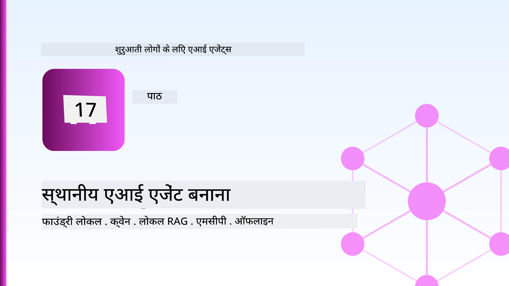
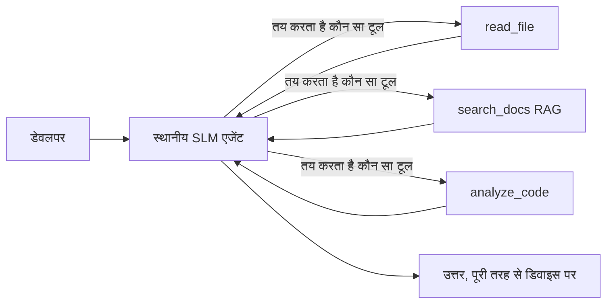
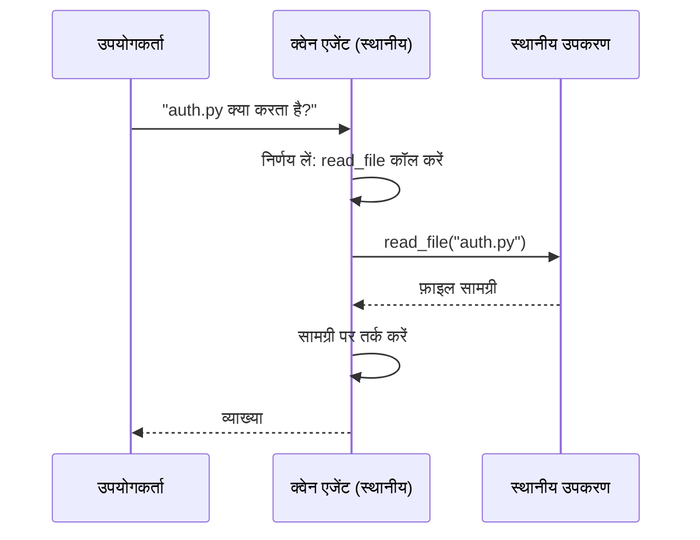
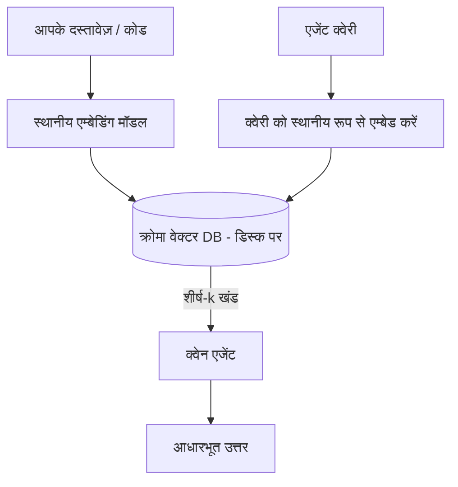
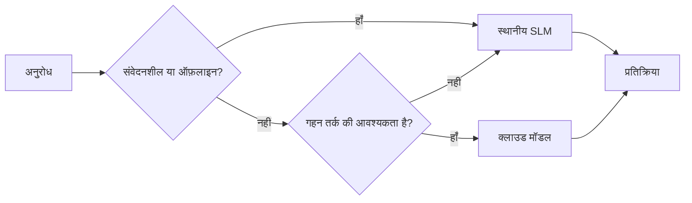

# Microsoft Foundry Local और Qwen का उपयोग करके लोकल AI एजेंट बनाना



पिछला पाठ एजेंट्स को *क्लाउड* में स्केल करता था। यह एक ही मशीन पर उन्हें *डाउन* लाता है। अंत तक आपके पास एक कार्यरत इंजीनियरिंग सहायक होगा जो तर्क करता है, उपकरण कॉल करता है, आपकी फाइलें पढ़ता है, और आपके दस्तावेज़ों में खोज करता है — **एक भी क्लाउड इनफेरेंस कॉल किए बिना।**

आप ऐसा क्यों चाहेंगे? वास्तविक इंजीनियरिंग कार्य में लगातार तीन कारण उभरते हैं:

- **गोपनीयता।** कोड और दस्तावेज़ कभी मशीन से बाहर नहीं निकलते। कोई प्रॉम्प्ट, कोई स्निपेट, कोई ग्राहक डेटा नेटवर्क सीमा पार नहीं करता।
- **लागत।** लोकल इनफेरेंस का कोई प्रति-टोकन बिल नहीं होता। आप बिजली की कीमत पर पूरे दिन तक पुनरावृत्ति कर सकते हैं।
- **ऑफ़लाइन।** एक विमान में, एक सुरक्षित सुविधा में, या आउटेज के दौरान भी एजेंट काम करता रहता है।

कमी यह है कि आप एक अग्रणी क्लाउड मॉडल को **स्मॉल लैंग्वेज मॉडल (SLM)** के लिए ट्रेड-ऑफ कर रहे हैं जो आपके CPU, GPU, या NPU पर चलता है। यह पाठ ऐसे एजेंट बनाने के बारे में है जो उस सीमा के भीतर *अच्छे* हों बजाय इसके कि उस सीमा के न होने का दिखावा करें।

## परिचय

इस पाठ में शामिल हैं:

- **स्मॉल लैंग्वेज मॉडल्स (SLMs)** — वे क्या हैं, कहां अच्छा प्रदर्शन करते हैं, और कहां नहीं।
- **Microsoft Foundry Local** — एक रनटाइम जो मॉडल्स को डिवाइस पर डाउनलोड करता है और एक **OpenAI-संगत API** के माध्यम से सेवा प्रदान करता है।
- **Qwen फ़ंक्शन-कॉलिंग मॉडल्स** — SLMs जो विश्वसनीय रूप से टूल कॉल उत्पन्न करते हैं, जो लोकल *एजेंट्स* (सिर्फ लोकल चैट नहीं) को संभव बनाते हैं।
- **लोकल टूल्स, लोकल RAG, और लोकल MCP** — एजेंट को क्लाउड के बिना क्षमता देना।
- **हाइब्रिड पैटर्न्स** — कब चीजें लोकल रखें और कब क्लाउड का उपयोग करें।

## सीखने के लक्ष्य

इस पाठ को पूरा करने के बाद, आप जानेंगे कि कैसे:

- SLMs के ट्रेड-ऑफ समझाएं और उपयुक्त लोकल-एजेंट उपयोग मामलों का चयन करें।
- Foundry Local के साथ एक Qwen मॉडल लोकल पर सर्व करें और OpenAI-संगत एंडपॉइंट के माध्यम से कनेक्ट करें।
- पूरी तरह से अपने वर्कस्टेशन पर चलने वाला एक टूल-कॉलिंग एजेंट बनाएं।
- अपने स्वयं के दस्तावेजों पर लोकल RAG जोड़ें एक लोकल वेक्टर डेटाबेस (Chroma) के माध्यम से।
- एजेंट को एक लोकल MCP सर्वर से कनेक्ट करें और हाइब्रिड लोकल/क्लाउड डिज़ाइन के बारे में तर्क करें।

## पूर्वापेक्षाएँ

यह पाठ मानता है कि आपने पहले के पाठ पूर्ण कर लिए हैं और आप सहज हैं:

- [टूल उपयोग](../04-tool-use/README.md) (पाठ 4) और [Agentic RAG](../05-agentic-rag/README.md) (पाठ 5) के साथ।
- [Agentic Protocols / MCP](../11-agentic-protocols/README.md) (पाठ 11)।
- [Microsoft Agent Framework](../14-microsoft-agent-framework/README.md) (पाठ 14)।

आपको निम्न की भी आवश्यकता होगी:

- एक डेवलपर वर्कस्टेशन। **8 GB RAM एक यथार्थवादी न्यूनतम है**; 16 GB+ आरामदायक है। GPU या NPU मदद करता है लेकिन आवश्यक नहीं है।
- **Microsoft Foundry Local** इंस्टॉल किया हुआ (नीचे सेटअप अनुभाग देखें)।
- Python 3.12+ और रिपॉजिटरी में पैकेज [`requirements.txt`](../../../requirements.txt), साथ में `foundry-local-sdk`, `openai`, और `chromadb` इस पाठ के लिए।

## स्मॉल लैंग्वेज मॉडल्स: लोकल कार्य के लिए सही उपकरण

एक अग्रणी क्लाउड मॉडल में सैकड़ों अरब पैरामीटर होते हैं और एक डेटा सेंटर उसके पीछे होता है। एक SLM में कुछ अरब पैरामीटर होते हैं और इसे आपके लैपटॉप की RAM में फिट होना होता है। यह अंतर स्पष्ट अपेक्षाएं स्थापित करता है।

**SLMs निम्न में अच्छे हैं:**

- संरचित, सीमित कार्य — वर्गीकरण, निक्षेपण, ज्ञात दस्तावेज़ का सारांश।
- **टूल कॉलिंग** — यह निर्णय लेना कि कौन सा फ़ंक्शन कॉल करना है और किस तर्क के साथ।
- अपने स्वयं के डेटा पर तेज़, सस्ता, निजी पुनरावृत्ति।

**SLMs कमजोर हैं:**

- बड़े संदर्भ में खुला, बहु-कदम तर्क।
- व्यापक विश्व ज्ञान (उन्होंने कम देखा है, और अधिक भूलते हैं)।

इसलिए लोकल एजेंट्स की विजेता रणनीति है: **SLM को संचालन करने दें, और भारी कार्य टूल्स करें।** मॉडल को आपके कोडबेस का *ज्ञान* होना जरूरी नहीं — इसे यह जानना चाहिए कि कब `read_file` और `search_docs` कॉल करें। यह सीधे SLM की ताकत को बढ़ाता है।



## Microsoft Foundry Local

**Microsoft Foundry Local** एक हल्का रनटाइम है जो मॉडल वे पूरी तरह से आपकी मशीन पर डाउनलोड करता है, प्रबंधित करता है, और सेवा प्रदान करता है। हमारे लिए इसका सबसे महत्वपूर्ण फीचर यह है कि यह एक **OpenAI-संगत HTTP एंडपॉइंट** प्रदान करता है — जिसका मतलब है OpenAI SDK और Microsoft Agent Framework का OpenAI क्लाइंट केवल `base_url` बदल कर इसके साथ काम कर सकते हैं। एजेंट बनाने के बारे में जो कुछ भी आपने सीखा, सीधे ट्रांसफर होता है; केवल एंडपॉइंट क्लाउड से `localhost` में जाता है।

Foundry Local आपके हार्डवेयर के लिए मॉडल का सबसे अच्छा निर्माण स्वचालित रूप से चुनता है — CPU बिल्ड, CUDA/GPU बिल्ड, या NPU बिल्ड — ताकि आपको मशीन के हिसाब से हाथ से ऑप्टिमाइज़ न करना पड़े।

### सेटअप

अपना OS के लिए Foundry Local इंस्टॉल करें (देखें [डॉक्यूमेंटेशन](https://learn.microsoft.com/azure/ai-foundry/foundry-local/)), फिर जांचें कि यह काम करता है:

```bash
# इंस्टॉल करें (उदाहरण; अपने प्लेटफ़ॉर्म के दस्तावेज़ का पालन करें)
winget install Microsoft.FoundryLocal      # विंडोज़
# brew install microsoft/foundrylocal/foundrylocal   # macOS

# एक Qwen मॉडल डाउनलोड करें और चलाएँ, फिर स्थानीय सेवा शुरू करें
foundry model run qwen2.5-7b-instruct
foundry service status
```

सेवा चलने के बाद आपके पास लोकल, OpenAI-संगत एंडपॉइंट होता है (सामान्यतः `http://localhost:PORT/v1`)। नोटबुक `foundry-local-sdk` का उपयोग कर एंडपॉइंट को स्वचालित रूप से खोजती है, इसलिए आपको पोर्ट हार्ड-कोड करने की जरूरत नहीं।

## Qwen फ़ंक्शन कॉलिंग: क्यों महत्वपूर्ण है

एक एजेंट तभी एजेंट होता है जब वह टूल कॉल कर सके। कई SLM चैट कर सकते हैं लेकिन असंगत, गलत टूल कॉल बनाते हैं। **Qwen** मॉडल्स फ़ंक्शन कॉलिंग के लिए प्रशिक्षित होते हैं और लगातार सही टूल-कॉल स्ट्रक्चर आउटपुट करते हैं — जो सटीक रूप से लोकल चैट मॉडल को एक लोकल *एजेंट* बनाता है।

फ्लो वही मानक टूल-कॉलिंग लूप है जिसे आप पहले जानते हैं, बस डिवाइस पर चलता है:



## लोकल RAG

दस्तावेज़ खोज वह जगह है जहां लोकल एजेंट्स की उपयोगिता है। इसके बजाय कि SLM आपके फ्रेमवर्क के दस्तावेज़ याद कर ले, आप उन दस्तावेज़ों को एक **लोकल वेक्टर डेटाबेस** में एम्बेड कर देते हैं और एजेंट को मांग पर संबंधित टुकड़े प्राप्त करने देते हैं।

हम **Chroma** का उपयोग करते हैं, एक एम्बेडेड वेक्टर स्टोर जो बिना सर्वर के प्रक्रिया के अंदर चलता है। पाइपलाइन पूरी तरह से लोकल है: लोकल एम्बेडिंग मॉडल → लोकल वेक्टर → लोकल पुनःप्राप्ति → लोकल SLM।



यह वही Agentic RAG पैटर्न है जो पाठ 5 में था — केवल बदलाव इतना है कि प्रत्येक घटक आपकी मशीन पर चलता है।

## लोकल MCP सर्वर

[MCP](../11-agentic-protocols/README.md) एक ट्रांसपोर्ट है, क्लाउड सेवा नहीं। एक MCP सर्वर एक लोकल प्रक्रिया के रूप में `stdio` पर चल सकता है, एजेंट को मानक प्रोटोकॉल पर टूल्स एक्सपोज़ करता है। यह आपको MCP सर्वर के बढ़ते इकोसिस्टम — फाइल सिस्टम एक्सेस, गिट ऑपरेशंस, डेटाबेस क्वेरीज़ — को पूरी तरह ऑफलाइन पुन: उपयोग करने देता है।

सुरक्षा दृष्टिकोण क्लाउड से अलग है, लेकिन अनुपस्थित नहीं: एक लोकल MCP सर्वर अभी भी आपके उपयोगकर्ता की अनुमति के साथ चलता है, इसलिए उसे जो छूना चाहिए उसे सीमित करें (जैसे एक प्रोजेक्ट डायरेक्टरी, न कि आपका पूरा होम फोल्डर) और उसके आउटपुट को इनपुट के रूप में मानकर सत्यापित करें।

## हाइब्रिड क्लाउड-और-लोकल पैटर्न

लोकल-फर्स्ट का मतलब लोकल-ओनली नहीं है। परिपक्व सिस्टम संवेदनशीलता और कठिनाई के आधार पर मार्गदर्शन करते हैं:

| स्थिति | कहाँ चलता है |
| --- | --- |
| संवेदनशील कोड / डेटा, या ऑफलाइन | **लोकल SLM** |
| सरल, निश्चित कार्य | **लोकल SLM** (सस्ता, तेज) |
| गैर-संवेदनशील डेटा पर कठिन बहु-कदम तर्क | **क्लाउड मॉडल** |
| आउटेज के दौरान सब कुछ | **लोकल SLM** (मुलायम कमी) |

यह पाठ 16 के **मॉडल रूटिंग** विचार की नकल करता है — सिवाय इसके कि "मॉडल" में से एक अब आपकी अपनी मशीन है। एक मजबूत डिज़ाइन क्लाउड अनुपलब्ध होने पर लोकल पर वापस गिरता है, इसलिए एजेंट गुणवत्ता में गिरता है बजाय पूरी तरह विफल होने के।



## प्रायोगिक अभ्यास: एक लोकल इंजीनियरिंग सहायक

खुली करें [`code_samples/17-local-agent-foundry-local.ipynb`](./code_samples/17-local-agent-foundry-local.ipynb) और इसे पूरा करें। आप एक **लोकल इंजीनियरिंग सहायक** बनाएंगे जो पूरी तरह आपके वर्कस्टेशन पर चलता है और कर सकता है:

1. **टूल कॉल करें** — Foundry Local के माध्यम से Qwen फ़ंक्शन कॉलिंग।
2. **लोकल फाइल ऑपरेशंस करें** — एक प्रोजेक्ट डायरेक्टरी में फाइलें सूचीबद्ध और पढ़ें।
3. **कोड का विश्लेषण करें** — सोर्स फाइल पर बुनियादी मेट्रिक्स रिपोर्ट करें।
4. **दस्तावेज़ खोजें** — Chroma के साथ एक डॉक फ़ोल्डर पर लोकल RAG।
5. **MCP का उपयोग करें** — लोकल MCP सर्वर से कनेक्ट करें (यदि कोई कॉन्फ़िगर नहीं है तो सुंदरता से स्किप करें)।

किसी भी बिंदु पर क्लाउड इनफेरेंस का उपयोग नहीं किया गया।

### चरण-दर-चरण मार्गदर्शिका

सहायक OpenAI-संगत एंडपॉइंट के माध्यम से Foundry Local से कनेक्ट होता है, इसलिए एजेंट कोड लगभग क्लाउड पाठों के समान दिखता है — केवल क्लाइंट बदलता है:

```python
from foundry_local import FoundryLocalManager
from openai import OpenAI

# फाउंड्री लोकल मॉडल को खोजता/डाउनलोड करता है और हमें एक स्थानीय एन्डपॉइंट देता है।
manager = FoundryLocalManager(\"qwen2.5-7b-instruct\")
client = OpenAI(base_url=manager.endpoint, api_key=manager.api_key)  # api_key एक स्थानीय प्लेसहोल्डर है।
```

टूल्स सामान्य Python फ़ंक्शन हैं जो एक प्रोजेक्ट डायरेक्टरी पर सीमित हैं:

```python
def read_file(path: str) -> str:
    \"\"\"Read a file, but only inside the sandboxed project directory.\"\"\"
    full = (PROJECT_ROOT / path).resolve()
    if PROJECT_ROOT not in full.parents and full != PROJECT_ROOT:
        return \"Access denied: path is outside the project directory.\"
    return full.read_text(encoding=\"utf-8\")
```

सैंडबॉक्स जांच नोट करें — यहां तक कि लोकल में भी, एक टूल जो मनमाने पथ पढ़ता है वह एक जोखिम है। नोटबुक हर टूल को एक ही प्रोजेक्ट रूट तक सीमित रखता है।

## ज्ञान जांच

असाइनमेंट पर जाने से पहले अपनी समझ का परीक्षण करें।

**1. एजेंट को क्लाउड में चलाने के बजाय स्थानीय रूप से चलाने के दो ठोस कारण बताएं।**

<details>
<summary>उत्तर</summary>

इनमें से कोई भी दो: **गोपनीयता** (कोड और डेटा कभी मशीन से बाहर नहीं निकलते), **लागत** (कोई प्रति-टोकन बिल नहीं), और **ऑफ़लाइन क्षमता** (नेटवर्क के बिना काम करता है — विमान में, सुरक्षित सुविधा में, या आउटेज के दौरान)। नियामक/अनुपालन प्रतिबंध जो डेटा को डिवाइस से बाहर भेजने से रोकते हैं वह गोपनीयता कारण का सामान्य प्रेरक है।
</details>

**2. एक लोकल एजेंट में SLM और उसके टूल्स के बीच अनुशंसित कार्य विभाजन क्या है, और क्यों?**

<details>
<summary>उत्तर</summary>

SLM को **संचालन करने दें** (निश्चित करें कौन सा टूल कॉल किया जाए और किस तर्क के साथ) और **टूल्स को भारी कार्य करने दें** (फाइलें पढ़ना, दस्तावेज़ पुनः प्राप्त करना, परिणाम निकालना)। SLM सीमित निर्णयों जैसे टूल चयन में मजबूत हैं लेकिन व्यापक ज्ञान और लंबे बहु-कदम तर्क में कमजोर हैं, इसलिए टूल्स पर निर्भर रहना उनकी ताकत को दर्शाता है।
</details>

**3. Foundry Local के साथ क्लाउड एजेंट कोड पुन: उपयोग करना क्यों संभव होता है?**

<details>
<summary>उत्तर</summary>

Foundry Local एक **OpenAI-संगत HTTP एंडपॉइंट** प्रदान करता है। OpenAI SDK और Agent Framework का OpenAI क्लाइंट केवल `base_url` बदलकर (और लोकल प्लेसहोल्डर API की का उपयोग करके) इसे उपयोग करते हैं। एजेंट कोड का बाकी सबकुछ समान रहता है।
</details>

**4. हम किसी भी SLM के बजाय विशेष रूप से Qwen फ़ंक्शन-कॉलिंग मॉडल क्यों उपयोग करते हैं?**

<details>
<summary>उत्तर</summary>

क्योंकि एक एजेंट को विश्वसनीय, सही रूप से निर्मित **टूल कॉल्स** उत्पन्न करने होते हैं। कई SLM चैट कर सकते हैं लेकिन गलत या असंगत टूल-कॉल संरचनाएं आउटपुट करते हैं। Qwen मॉडल फ़ंक्शन कॉलिंग के लिए प्रशिक्षित होते हैं और निरंतर टूल कॉल्स उत्पन्न करते हैं, जो लोकल चैट मॉडल को कार्यरत लोकल एजेंट बनाता है।
</details>

**5. लोकल RAG पाइपलाइन में कौन से घटक मशीन पर चलते हैं?**

<details>
<summary>उत्तर</summary>

सभी: एम्बेडिंग मॉडल, वेक्टर डेटाबेस (Chroma, डिस्क पर), पुनःप्राप्ति चरण, और SLM। दस्तावेज़ लोकल में एम्बेड होते हैं, लोकल में संग्रहित होते हैं, लोकल में पुनःप्राप्त किए जाते हैं, और लोकल मॉडल द्वारा तर्क किए जाते हैं — कोई घटक क्लाउड को नहीं छूता।
</details>

**6. एक लोकल MCP सर्वर आपकी मशीन पर चलता है। क्या इससे वह स्वचालित रूप से सुरक्षित हो जाता है? आपको अभी भी किस सावधानी बरतनी चाहिए?**

<details>
<summary>उत्तर</summary>

नहीं। एक लोकल MCP सर्वर आपके उपयोगकर्ता की अनुमति के साथ चलता है, इसलिए वह कुछ भी छू सकता है जो आप कर सकते हैं। इसे जो चाहिए उसी तक सीमित करें (जैसे एक प्रोजेक्ट डायरेक्टरी न कि पूरा होम फोल्डर) और उसके आउटपुट को इनपुट के रूप में मान कर कार्रवाई से पहले सत्यापित करें।
</details>

**7. एक समझदारीपूर्ण हाइब्रिड रूटिंग नियम का वर्णन करें जिसमें एक लोकल मॉडल शामिल हो।**

<details>
<summary>उत्तर</summary>

संवेदनशील या ऑफलाइन अनुरोधों को लोकल SLM पर रूट करें; सरल निश्चित कार्यों को गति और लागत के लिए लोकल SLM पर रूट करें; गैर-संवेदनशील डेटा पर कठिन बहु-कदम तर्क को क्लाउड मॉडल पर रूट करें; और क्लाउड अनुपलब्ध होने पर लोकल SLM की तरफ वापस जाएं ताकि एजेंट सुंदरता से गिरावट करे बजाय पूरी विफलता के। यह मॉडल रूटिंग (पाठ 16) है जिसमें लोकल मशीन एक मॉडल के रूप में है।
</details>

**8. इस पाठ में लोकल एजेंट चलाने के लिए वास्तविक न्यूनतम RAM क्या है, और अधिक RAM आपको क्या लाभ देता है?**

<details>
<summary>उत्तर</summary>

लगभग **8 GB** एक यथार्थवादी न्यूनतम है; 16 GB+ आरामदायक है। अधिक RAM आपको बड़े, अधिक सक्षम मॉडल चलाने और अधिक संदर्भ मेमोरी में रखने देता है। GPU या NPU इनफेरेंस को तेज करता है लेकिन आवश्यक नहीं — Foundry Local बिना एक्सेलेरेटर के CPU बिल्ड चुनता है।
</details>

## असाइनमेंट

लोकल इंजीनियरिंग सहायक को आपके चुने हुए एक छोटे प्रोजेक्ट के लिए **लोकल दस्तावेज़ समीक्षक** में विस्तारित करें (यदि चाहें तो इस रिपॉ के पाठ फ़ोल्डरों में से एक का उपयोग करें)।

आपकी प्रस्तुति में शामिल होना चाहिए:

1. एक वास्तविक डॉक/कोड फ़ोल्डर को Chroma में इंडेक्स करें (कम से कम पांच फाइलें)।
2. एक `find_todos` टूल जोड़ें जो प्रोजेक्ट में `TODO`/`FIXME` टिप्पणियों को स्कैन करता है और फ़ाइल नाम और लाइन नंबर के साथ लौटाता है — `read_file` की तरह समान सैंडबॉक्स जांच के साथ।

3. **एजेंट से तीन प्रश्न पूछें** जो इसे टूल्स को संयोजित करने के लिए मजबूर करें: एक शुद्ध RAG प्रश्न, एक जो एक विशिष्ट फ़ाइल पढ़ने की आवश्यकता हो, और एक जो TODOs ढूंढने की आवश्यकता हो।
4. **इसे मापें**: तीनों उत्तरों का समय निकालें और एक मार्कडाउन सेल में नोट करें। टिप्पणी करें कि आपकी इच्छित वर्कफ़्लो के लिए विलंबता स्वीकार्य है या नहीं।

फिर एक छोटा अनुच्छेद लिखें कि **आप इस समीक्षक के लिए क्या क्लाउड पर स्थानांतरित करेंगे और क्या स्थानीय रूप से रखेंगे**, और क्यों। आपका मूल्यांकन इस बात पर किया जाएगा कि स्थानीय घटक सही तरीके से जुड़े हुए हैं या नहीं और आपकी संकर संज्ञानात्मक प्रक्रिया सही है या नहीं — मॉडल गुणवत्ता पर नहीं।

## सारांश

इस पाठ में आपने एक ऐसा एजेंट बनाया जो पूरी तरह से आपके अपने मशीन पर चलता है:

- **SLMs** गोपनीयता, लागत, और ऑफलाइन ऑपरेशन के लिए चौड़ाई का व्यापार करते हैं — और तब चमकते हैं जब वे सभी ज्ञान खुद ले जाने के बजाय **टूल्स का संचालन** करते हैं।
- **Foundry Local** मॉडल को डिवाइस पर एक **OpenAI-संगत एंडपॉइंट** के पीछे सेवा देता है, इसलिए आपका क्लाउड एजेंट कोड एक पंक्ति परिवर्तन के साथ ट्रांसफर हो जाता है।
- **Qwen फ़ंक्शन-कॉलिंग मॉडल** विश्वसनीय स्थानीय टूल कॉलिंग — और इसलिए स्थानीय *एजेंट्स* — संभव बनाते हैं।
- **स्थानीय RAG** (Chroma) और **स्थानीय MCP** एजेंट को मशीन छोड़े बिना क्षमता देते हैं।
- **संकर पैटर्न** आपको संवेदनशीलता और कठिनाई के आधार पर मार्गदर्शन करने देते हैं, जिसमें स्थानीय एक सहज बैकअप के रूप में होता है।

यह परिनियोजन चाप को पूरा करता है: पाठ 16 ने एजेंट्स को Microsoft Foundry में स्केल किया, और यह पाठ उन्हें एकल वर्कस्टेशन पर स्केल करता है। अगला पाठ तैनात एजेंट्स को सुरक्षित रखने पर केंद्रित है।

## अतिरिक्त संसाधन

- <a href="https://learn.microsoft.com/azure/ai-foundry/foundry-local/" target="_blank">Microsoft Foundry Local दस्तावेज़</a>
- <a href="https://learn.microsoft.com/azure/ai-foundry/what-is-azure-ai-foundry" target="_blank">Microsoft Foundry दस्तावेज़</a>
- <a href="https://learn.microsoft.com/en-us/agent-framework/overview/?wt.mc_id=youtube_26688_organicsocial_reactor&pivots=programming-language-python" target="_blank">Microsoft Agent Framework</a>
- <a href="https://qwen.readthedocs.io/en/latest/framework/function_call.html" target="_blank">Qwen फ़ंक्शन कॉलिंग दस्तावेज़</a>
- <a href="https://modelcontextprotocol.io/" target="_blank">Model Context Protocol (MCP)</a>
- <a href="https://docs.trychroma.com/" target="_blank">Chroma वेक्टर डेटाबेस</a>

## पिछला पाठ

[स्केलेबल एजेंट्स की तैनाती](../16-deploying-scalable-agents/README.md)

## अगला पाठ

[AI एजेंट्स को सुरक्षित करना](../18-securing-ai-agents/README.md)

---

<!-- CO-OP TRANSLATOR DISCLAIMER START -->
**अस्वीकरण**:
इस दस्तावेज़ का अनुवाद AI अनुवाद सेवा [Co-op Translator](https://github.com/Azure/co-op-translator) का उपयोग करके किया गया है। जबकि हम सटीकता के लिए प्रयास करते हैं, कृपया ध्यान दें कि स्वचालित अनुवादों में त्रुटियाँ या अशुद्धियाँ हो सकती हैं। मूल दस्तावेज़ अपनी मूल भाषा में ही प्रामाणिक स्रोत माना जाना चाहिए। महत्वपूर्ण जानकारी के लिए, पेशेवर मानव अनुवाद की सिफारिश की जाती है। इस अनुवाद के उपयोग से उत्पन्न किसी भी गलतफहमी या गलत व्याख्या के लिए हम उत्तरदायी नहीं हैं।
<!-- CO-OP TRANSLATOR DISCLAIMER END -->