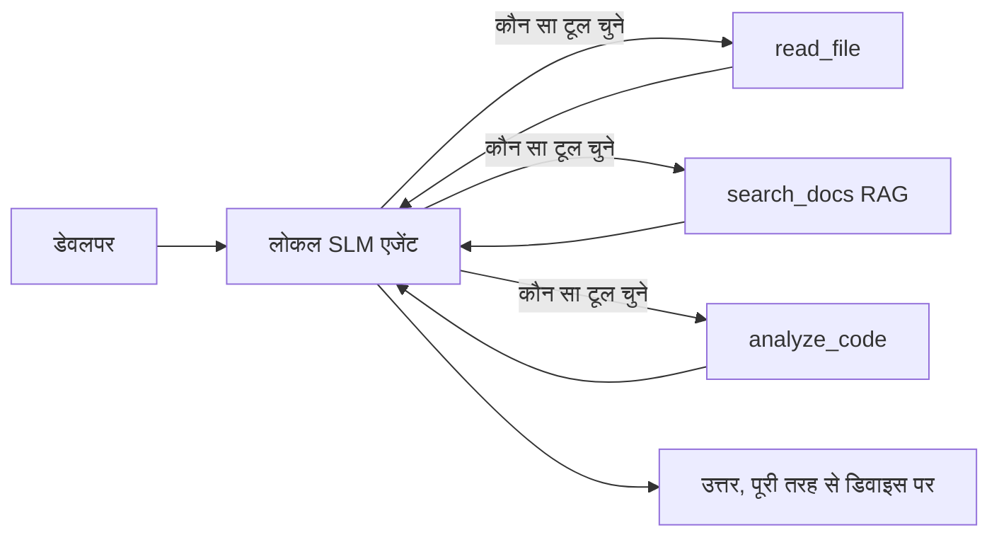
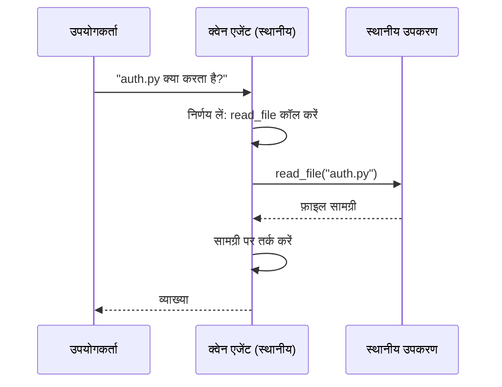
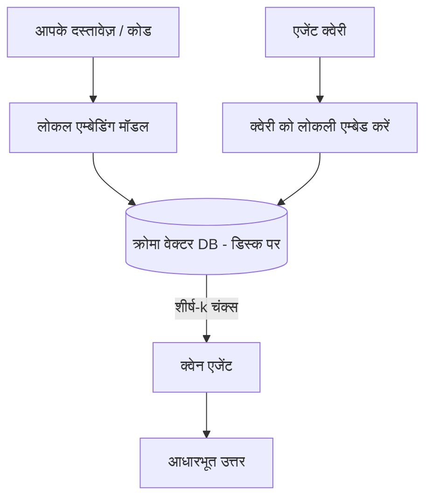
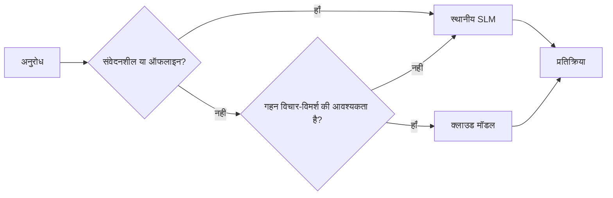

# Microsoft Foundry Local और Qwen का उपयोग करके स्थानीय AI एजेंट बनाना


पिछला पाठ एजेंट्स को क्लाउड में *बढ़ाता* था। यह इसे एक मशीन पर *ला*ता है। अंत तक आपके पास एक कार्यशील इंजीनियरिंग सहायक होगा जो तर्क करता है, टूल कॉल करता है, आपकी फाइलें पढ़ता है, और आपकी डॉक्यूमेंटेशन खोजता है — **बिना कोई क्लाउड इन्फेरेंस कॉल के।**

आप ऐसा क्यों चाहेंगे? तीन कारण जो वास्तविक इंजीनियरिंग कार्य में बार-बार आते हैं:

- **गोपनीयता।** कोड और दस्तावेज़ मशीन छोड़ते नहीं हैं। कोई प्रॉम्प्ट, कोई स्निपेट, कोई ग्राहक डेटा नेटवर्क सीमा पार नहीं करता।
- **लागत।** स्थानीय इन्फेरेंस का कोई प्रति-टोकन बिल नहीं है। आप दिन भर बिजली के खर्चे पर कई बार अनुमान लगा सकते हैं।
- **ऑफ़लाइन।** विमान में, सुरक्षित सुविधा में, या आउटेज के दौरान, एजेंट फिर भी काम करता है।

पकड़ यह है कि आप एक फ्रंटियर क्लाउड मॉडल के बदले में एक **स्मॉल लैंग्वेज मॉडल (SLM)** चला रहे हैं जो आपके CPU, GPU, या NPU पर चलता है। यह पाठ उन एजेंट्स को बनाने के बारे में है जो इस प्रतिबंध के भीतर *अच्छे* हैं बजाय इसके कि वे इस प्रतिबंध को अनदेखा करें।

## परिचय

यह पाठ कवर करेगा:

- **स्मॉल लैंग्वेज मॉडल्स (SLMs)** — वे क्या हैं, वे कहां बेहतर हैं, और कहां नहीं।
- **Microsoft Foundry Local** — एक रनटाइम जो डिवाइस पर मॉडल डाउनलोड करता है और परोसलता है **OpenAI-संगत API** के माध्यम से।
- **Qwen फंक्शन-कॉलिंग मॉडल्स** — SLMs जो विश्वसनीय टूल कॉल्स उत्पन्न करते हैं, जो स्थानीय *एजेंट्स* (सिर्फ स्थानीय चैट नहीं) को संभव बनाते हैं।
- **स्थानीय टूल्स, स्थानीय RAG, और स्थानीय MCP** — क्लाउड के बिना एजेंट को क्षमता देते हैं।
- **हाइब्रिड पैटर्न्स** — कब चीज़ें स्थानीय रखें और कब क्लाउड तक पहुंचें।

## सीखने के लक्ष्य

इस पाठ को पूरा करने के बाद आप जानेंगे कि कैसे:

- SLMs के ट्रेड-ऑफ समझें और उपयुक्त स्थानीय एजेंट उपयोग के मामलों का चयन करें।
- Foundry Local के साथ एक Qwen मॉडल को स्थानीय रूप से परोसे और इसे OpenAI-संगत एंडपॉइंट के माध्यम से कनेक्ट करें।
- एक टूल-कॉलिंग एजेंट बनाएं जो पूरी तरह आपकी कार्यस्थान मशीन पर चलता हो।
- स्थानीय वेक्टर डेटाबेस (Chroma) का उपयोग करके अपने दस्तावेज़ों पर स्थानीय RAG जोड़ें।
- एजेंट को स्थानीय MCP सर्वर से कनेक्ट करें और हाइब्रिड स्थानीय/क्लाउड डिज़ाइनों के बारे में तर्क करें।

## पूर्व आवश्यकताएँ

यह पाठ मानता है कि आपने पूर्व के पाठ पूरे कर लिए हैं और आप सहज हैं:

- [टूल उपयोग](../04-tool-use/README.md) (पाठ 4) और [एजेंटिक RAG](../05-agentic-rag/README.md) (पाठ 5)।
- [एजेंटिक प्रोटोकॉल / MCP](../11-agentic-protocols/README.md) (पाठ 11)।
- [Microsoft एजेंट फ्रेमवर्क](../14-microsoft-agent-framework/README.md) (पाठ 14)।

आपको चाहिए:

- एक डेवलपर कार्यस्थान मशीन। **8 GB RAM यथार्थवादी न्यूनतम है**; 16 GB+ आरामदायक है। GPU या NPU मदद करता है लेकिन आवश्यक नहीं है।
- **Microsoft Foundry Local** इंस्टॉल किया हो (नीचे सेटअप अनुभाग देखें)।
- Python 3.12+ और रिपॉजिटरी में पैकेजेज़ [`requirements.txt`](../../../requirements.txt), साथ ही इस पाठ के लिए `foundry-local-sdk`, `openai`, और `chromadb`।

## स्मॉल लैंग्वेज मॉडल्स: स्थानीय कार्यों के लिए सही टूल

एक फ्रंटियर क्लाउड मॉडल के सैकड़ों अरब पैरामीटर्स होते हैं और इसके पीछे एक डेटा सेंटर होता है। एक SLM में सिर्फ कुछ अरब पैरामीटर्स होते हैं और इसे आपके लैपटॉप की RAM में फिट होना होता है। यह अंतर स्पष्ट अपेक्षाएँ निर्धारित करता है।

**SLMs अच्छी हैं:**

- संरचित, सीमित कार्य — वर्गीकरण, एक ज्ञात दस्तावेज़ का निष्कर्षण, सारांश।
- **टूल कॉलिंग** — कौन सा फंक्शन कॉल करना है और किन आर्गुमेंट्स के साथ, यह तय करना।
- अपनी स्वयं की डेटा पर तेज़, सस्ता, निजी पुनरावृत्ति।

**SLMs कमजोर हैं:**

- खुले अंत वाले, बहु-हॉप तर्क बड़े संदर्भ में।
- व्यापक विश्व ज्ञान (उन्होंने कम देखा है, और भूलते भी ज्यादा हैं)।

इसलिए स्थानीय एजेंट्स के लिए विजेता रणनीति है: **SLM को संचालन करने दें, और टूल्स को भारी काम करने दें।** मॉडल को आपके कोडबेस को *जानने* की ज़रूरत नहीं है — इसे तब पता होना चाहिए जब `read_file` और `search_docs` कॉल करना है। यह सीधे SLM की ताकत को बढ़ाता है।



## Microsoft Foundry Local

**Microsoft Foundry Local** एक हल्का रनटाइम है जो मॉडल को पूरी तरह आपकी मशीन पर डाउनलोड, प्रबंधित, और परोसता है। हमारे लिए इसका सबसे महत्वपूर्ण फीचर यह है कि यह एक **OpenAI-संगत HTTP एंडपॉइंट** एक्सपोज़ करता है — जिसका मतलब है कि OpenAI SDK और Microsoft Agent Framework का OpenAI क्लाइंट इसे केवल `base_url` बदलकर उपयोग कर सकते हैं। एजेंट बनाना जो आपने सीखा है वह सीधे ट्रांसफर होता है; केवल एंडपॉइंट क्लाउड से `localhost` पर स्थानांतरित होता है।

Foundry Local आपके हार्डवेयर के लिए मॉडल का सबसे अच्छा बिल्ड अपने आप चुनता है — CPU बिल्ड, CUDA/GPU बिल्ड, या NPU बिल्ड — ताकि आपको मशीन के हिसाब से मैन्युअली ऑप्टिमाइज न करना पड़े।

### सेटअप

Foundry Local इंस्टॉल करें (अपने OS के लिए [डॉक्यूमेंटेशन](https://learn.microsoft.com/azure/ai-foundry/foundry-local/) देखें), फिर पुष्टि करें कि यह काम करता है:

```bash
# इंस्टॉल करें (उदाहरण; अपने प्लेटफ़ॉर्म के लिए डॉक्स का पालन करें)
winget install Microsoft.FoundryLocal      # विंडोज
# brew install microsoft/foundrylocal/foundrylocal   # macOS

# एक Qwen मॉडल डाउनलोड करें और चलाएं, फिर स्थानीय सेवा शुरू करें
foundry model run qwen2.5-7b-instruct
foundry service status
```

सेवा चालू होने के बाद आपके पास एक स्थानीय, OpenAI-संगत एंडपॉइंट होता है (आमतौर पर `http://localhost:PORT/v1`)। नोटबुक `foundry-local-sdk` का उपयोग करके एंडपॉइंट को अपने आप खोजती है, इसलिए आपको पोर्ट हार्ड-कोड करने की जरूरत नहीं है।

## Qwen फंक्शन कॉलिंग: क्यों यह जरूरी है

एक एजेंट तब ही एजेंट होता है जब यह टूल्स कॉल कर सके। कई SLMs चैट कर सकते हैं लेकिन भरोसेमंद, संरचित टूल कॉल नहीं बनाते। **Qwen** मॉडल फंक्शन कॉलिंग के लिए प्रशिक्षित हैं और लगातार अच्छे टूल-कॉल स्ट्रक्चर उत्पन्न करते हैं — यही वह चीज है जो एक स्थानीय चैट मॉडल को स्थानीय *एजेंट* बनाती है।

फ्लो वही मानक टूल-कॉलिंग लूप है जिसे आप पहले से जानते हैं, बस यह डिवाइस पर चलता है:



## स्थानीय RAG

डॉक्यूमेंटेशन खोज वह जगह है जहां स्थानीय एजेंट अपना मूल्य बनाते हैं। यह उम्मीद करने के बजाय कि SLM ने आपके फ्रेमवर्क के डॉक्यूमेंट्स याद कर लिए हैं, आप उन डॉक्यूमेंट्स को एक **स्थानीय वेक्टर डेटाबेस** में एम्बेड कर देते हैं और एजेंट को संबंधित हिस्से माँग पर पुनः प्राप्त करने देते हैं।

हम उपयोग करते हैं **Chroma**, एक एम्बेडेड वेक्टर स्टोर जो बिना सर्वर के प्रोसेस के अंदर चलता है। पाइपलाइन पूरी तरह स्थानीय है: स्थानीय एम्बेडिंग मॉडल → स्थानीय वेक्टर्स → स्थानीय पुनः प्राप्ति → स्थानीय SLM।



यह वही एजेंटिक RAG पैटर्न है जो पाठ 5 में था — केवल बदलाव यह है कि हर घटक आपकी मशीन पर चलता है।

## स्थानीय MCP सर्वर

[MCP](../11-agentic-protocols/README.md) एक ट्रांसपोर्ट है, क्लाउड सेवा नहीं। एक MCP सर्वर स्थानीय प्रक्रिया के रूप में `stdio` पर चल सकता है, जो आपके एजेंट को मानक प्रोटोकॉल के माध्यम से टूल एक्सपोज़ करता है। यह आपको बढ़ते MCP सर्वर इकोसिस्टम — फ़ाइल सिस्टम एक्सेस, गिट ऑपरेशन, डेटाबेस क्वेरीज — पूरी तरह ऑफलाइन पुनः उपयोग करने देता है।

सुरक्षा की स्थिति क्लाउड से अलग है लेकिन अनुपस्थित नहीं है: एक स्थानीय MCP सर्वर आपके उपयोगकर्ता की अनुमति के साथ चलता है, इसलिए इसे केवल आवश्यक चीज़ों तक सीमित रखें (जैसे किसी प्रोजेक्ट डायरेक्टरी तक, आपके पूरे होम फ़ोल्डर तक नहीं) और इसके आउटपुट को इनपुट के रूप में मान कर मान्यता करें।

## हाइब्रिड क्लाउड-एवं-लोकल पैटर्न

स्थानीय-प्रथम का मतलब केवल स्थानीय नहीं होता। परिपक्व सिस्टम संवेदनशीलता और कठिनाई के अनुसार मार्गदर्शन करते हैं:

| स्थिति | जहां चलता है |
| --- | --- |
| संवेदनशील कोड/डेटा, या ऑफलाइन | **स्थानीय SLM** |
| सरल, सीमित कार्य | **स्थानीय SLM** (सस्ता, तेज़) |
| गैर-संवेदनशील डेटा पर कठिन मल्टी-हॉप तर्क | **क्लाउड मॉडल** |
| आउटेज के दौरान सब कुछ | **स्थानीय SLM** (ग्रेसफुल डिग्रेडेशन) |

यह पाठ 16 के **मॉडल राउटिंग** विचार की तरह है — सिवाय इसके कि अब एक "मॉडल" आपकी अपनी मशीन है। एक मजबूत डिज़ाइन तब स्थानीय पर गिरता है जब क्लाउड उपलब्ध नहीं होता, ताकि एजेंट सीधे विफल होने के बजाय गुणवत्ता में गिरावट लाए।



## व्यावहारिक प्रयोगशाला: एक स्थानीय इंजीनियरिंग सहायक

[`code_samples/17-local-agent-foundry-local.ipynb`](./code_samples/17-local-agent-foundry-local.ipynb) खोलें और इसे पूरा करें। आप एक **स्थानीय इंजीनियरिंग सहायक** बनाएंगे जो पूरी तरह आपकी कार्यस्थान मशीन पर चलता है और निम्न कर सकता है:

1. **टूल कॉल करें** — Foundry Local के माध्यम से Qwen फंक्शन कॉलिंग द्वारा।
2. **स्थानीय फाइल ऑपरेशन करें** — प्रोजेक्ट डायरेक्टरी में फाइलें सूचीबद्ध करें और पढ़ें।
3. **कोड का विश्लेषण करें** — स्रोत फ़ाइल पर मूलभूत मेट्रिक्स रिपोर्ट करें।
4. **डॉक्यूमेंटेशन खोजें** — Chroma के साथ डॉक फ़ोल्डर पर स्थानीय RAG।
5. **MCP का उपयोग करें** — स्थानीय MCP सर्वर से कनेक्ट करें (अगर कोई कॉन्फ़िगर नहीं है तो विनम्रता से छोड़ दें)।

किसी भी बिंदु पर क्लाउड इन्फेरेंस उपयोग नहीं किया जाता।

### वॉकथ्रू

सहायक OpenAI-संगत एंडपॉइंट के माध्यम से Foundry Local से जुड़ता है, इसलिए एजेंट कोड लगभग क्लाउड पाठों के समान दिखता है — केवल क्लाइंट बदलता है:

```python
from foundry_local import FoundryLocalManager
from openai import OpenAI

# Foundry Local मॉडल को खोजता/डाउनलोड करता है और हमें एक स्थानीय एंडपॉइंट देता है।
manager = FoundryLocalManager(\"qwen2.5-7b-instruct\")
client = OpenAI(base_url=manager.endpoint, api_key=manager.api_key)  # api_key एक स्थानीय प्लेसहोल्डर है।
```

टूल सामान्य पायथन फंक्शन हैं जो प्रोजेक्ट डायरेक्टरी तक सीमित हैं:

```python
def read_file(path: str) -> str:
    \"\"\"Read a file, but only inside the sandboxed project directory.\"\"\"
    full = (PROJECT_ROOT / path).resolve()
    if PROJECT_ROOT not in full.parents and full != PROJECT_ROOT:
        return \"Access denied: path is outside the project directory.\"
    return full.read_text(encoding=\"utf-8\")
```

सैंडबॉक्स चेक पर ध्यान दें — यहां तक कि स्थानीय भी, एक ऐसा टूल जो मनमाने पथ पढ़ता है वह जोखिम भरा है। नोटबुक हर टूल को एक प्रोजेक्ट रूट तक सीमित रखता है।

## ज्ञान परीक्षण

असाइनमेंट पर जाने से पहले अपनी समझ का परीक्षण करें।

**1. क्लाउड की बजाय स्थानीय रूप से एजेंट चलाने के दो ठोस कारण बताएं।**

<details>
<summary>उत्तर</summary>

इनमें से कोई दो: **गोपनीयता** (कोड और डेटा मशीन छोड़ते नहीं), **लागत** (कोई प्रति-टोकन बिल नहीं), और **ऑफ़लाइन क्षमता** (नेटवर्क के बिना काम करता है — विमान में, सुरक्षित सुविधा में, या आउटेज के दौरान)। डेटा डिवाइस से बाहर भेजने पर प्रतिबंध लगाने वाले नियामक/अनुपालन प्रतिबंध गोपनीयता कारण का सामान्य चालक हैं।
</details>

**2. स्थानीय एजेंट में SLM और इसके टूल्स के बीच श्रम का अनुशंसित विभाजन क्या है, और क्यों?**

<details>
<summary>उत्तर</summary>

SLM को **संचालन** करने दें (कौन सा टूल कॉल करना है और किन आर्गुमेंट्स के साथ) और **टूल्स को भारी काम करने दें** (फाइलें पढ़ना, डॉक्युमेंट्स पुनः प्राप्त करना, परिणाम गणना करना)। SLMs टूल चयन जैसे सीमित निर्णयों में मजबूत हैं, लेकिन व्यापक ज्ञान और लंबी मल्टी-हॉप तर्क में कमजोर, इसलिए टूल पर निर्भर रहना उनकी ताकत को बढ़ाता है।
</details>

**3. Foundry Local के साथ क्लाउड एजेंट कोड को पुनः उपयोग क्यों संभव है?**

<details>
<summary>उत्तर</summary>

Foundry Local एक **OpenAI-संगत HTTP एंडपॉइंट** एक्सपोज़ करता है। OpenAI SDK और एजेंट फ्रेमवर्क के OpenAI क्लाइंट इसे केवल `base_url` बदलकर (और स्थानीय प्लेसहोल्डर API कुंजी का उपयोग करके) काम करते हैं। एजेंट कोड के बारे में बाकी सब कुछ समान रहता है।
</details>

**4. हम विशिष्ट रूप से Qwen फंक्शन-कॉलिंग मॉडल क्यों उपयोग करते हैं बजाय किसी भी SLM के?**

<details>
<summary>उत्तर</summary>

क्योंकि एजेंट को विश्वसनीय, अच्छी तरह से निर्मित **टूल कॉल** उत्पन्न करना चाहिए। कई SLMs चैट कर सकते हैं लेकिन खराब या असंगत टूल-कॉल स्ट्रक्चर उत्पन्न करते हैं। Qwen मॉडल फंक्शन कॉलिंग के लिए प्रशिक्षित हैं और लगातार टूल कॉल्स देते हैं, जो एक स्थानीय चैट मॉडल को कार्यशील स्थानीय एजेंट बनाते हैं।
</details>

**5. स्थानीय RAG पाइपलाइन में कौन से घटक मशीन पर चलते हैं?**

<details>
<summary>उत्तर</summary>

सभी: एम्बेडिंग मॉडल, वेक्टर डेटाबेस (Chroma, डिस्क पर), पुनः प्राप्ति चरण, और SLM। दस्तावेज़ स्थानीय रूप से एम्बेड, संग्रहीत, पुनः प्राप्त, और स्थानीय मॉडल द्वारा तर्कित किए जाते हैं — कोई घटक क्लाउड से संपर्क नहीं करता।
</details>

**6. एक स्थानीय MCP सर्वर आपकी मशीन पर चलता है। क्या यह अपने आप सुरक्षित हो जाता है? फिर भी आपको कौन सावधानी बरतनी चाहिए?**

<details>
<summary>उत्तर</summary>

नहीं। एक स्थानीय MCP सर्वर आपके उपयोगकर्ता की अनुमति के साथ चलता है, इसलिए यह आपकी पहुंच वाली किसी भी चीज़ को छू सकता है। इसे आवश्यक तक सीमित करें (उदाहरण के लिए, पूरे होम फ़ोल्डर के बजाय एक प्रोजेक्ट डायरेक्टरी) और इसके आउटपुट को इनपुट के रूप में मानकर क्रियान्वयन से पहले सत्यापित करें।
</details>

**7. एक समझदारी भरा हाइब्रिड राउटिंग नियम बताएं जिसमें एक स्थानीय मॉडल शामिल हो।**

<details>
<summary>उत्तर</summary>

संवेदनशील या ऑफलाइन अनुरोध स्थानीय SLM पर भेजें; सरल सीमित कार्य स्थानीय SLM को तेज़ी और लागत के लिए भेजें; गैर-संवेदनशील डेटा पर कठिन मल्टी-हॉप तर्क क्लाउड मॉडल को भेजें; और यदि क्लाउड अनुपलब्ध हो तो स्थानीय SLM पर वापस जाएं ताकि एजेंट सीधे विफल होने के बजाय धीरे-धीरे कार्यक्षमता खोए। यह मॉडल राउटिंग (पाठ 16) है जिसमें स्थानीय मशीन एक मॉडल है।
</details>

**8. इस पाठ में स्थानीय एजेंट चलाने के लिए वास्तविक न्यूनतम RAM कितना है, और अधिक RAM आपको क्या देता है?**

<details>
<summary>उत्तर</summary>

लगभग **8 GB** यथार्थवादी न्यूनतम है; 16 GB+ आरामदायक है। अधिक RAM आपको बड़े, अधिक सक्षम मॉडल चलाने और अधिक संदर्भ मेमोरी में रखने देता है। GPU या NPU इन्फेरेंस तेज़ करता है लेकिन आवश्यक नहीं है — Foundry Local जब कोई त्वरक उपलब्ध नहीं होता तो CPU बिल्ड चयन करता है।
</details>

## असाइनमेंट

स्थानीय इंजीनियरिंग सहायक को एक **स्थानीय डॉक्यूमेंटेशन समीक्षक** में विस्तार दें अपने पसंदीदा छोटे प्रोजेक्ट के लिए (यदि चाहें तो इस रिपॉजिटरी के पाठ फ़ोल्डर्स में से एक का उपयोग करें)।

आपकी प्रस्तुति में शामिल होना चाहिए:

1. Chroma में एक वास्तविक डॉक्यूमेंट/कोड फ़ोल्डर का सूचकांक बनाएं (कम से कम पांच फाइलें)।
2. एक `find_todos` टूल जोड़ें जो प्रोजेक्ट में `TODO`/`FIXME` टिप्पणियों को स्कैन करता है और उन्हें फाइल और लाइन नंबर के साथ लौटाता है — `read_file` जैसा सैंडबॉक्स चेक बनाए रखते हुए।

3. **एजेंट से तीन प्रश्न पूछें** जो इसे टूल्स को संयोजित करने के लिए मजबूर करें: एक शुद्ध RAG प्रश्न, एक जो एक विशिष्ट फ़ाइल पढ़ने की आवश्यकता हो, और एक जो TODOs खोजने की आवश्यकता हो।
4. **इसे मापें**: तीनों प्रतिक्रियाओं का समय मापन करें और उन्हें एक मार्कडाउन सेल में नोट करें। टिप्पणी करें कि लेटेंसी आपके इच्छित वर्कफ़्लो के लिए स्वीकार्य है या नहीं।

फिर एक छोटा पैराग्राफ लिखें कि **आप इस समीक्षक के लिए क्लाउड में क्या ले जाएंगे और स्थानीय क्या रखेंगे**, और क्यों। आपका मूल्यांकन इस बात पर होगा कि क्या स्थानीय घटक सही तरीके से जुड़े हुए हैं और क्या आपकी हाइब्रिड तर्कसंगतता ठोस है — मॉडल गुणवत्ता पर नहीं।

## सारांश

इस पाठ में आपने एक ऐसा एजेंट बनाया है जो पूरी तरह से आपकी अपनी मशीन पर चलता है:

- **SLMs** गोपनीयता, लागत, और ऑफलाइन संचालन के लिए चौड़ाई का त्याग करते हैं — और जब वे **टूल्स का समन्वय करते हैं** तो वे चमकते हैं बजाय इसके कि वे स्वयं सभी ज्ञान रखें।
- **Foundry Local** डिवाइस पर मॉडल्स को सेवा देता है एक **OpenAI-संगत एंडपॉइंट** के पीछे, इसलिए आपका क्लाउड एजेंट कोड एक लाइन के बदलाव के साथ ट्रांसफर हो जाता है।
- **Qwen फंक्शन-कॉलिंग मॉडल्स** विश्वसनीय स्थानीय टूल कॉलिंग — और इसलिए स्थानीय *एजेंट्स* — को संभव बनाते हैं।
- **Local RAG** (Chroma) और **local MCP** एजेंट को मशीन छोड़ने के बिना क्षमता देते हैं।
- **हाइब्रिड पैटर्न** आपको संवेदनशीलता और कठिनाई के अनुसार मार्गदर्शन करने देते हैं, स्थानीय को एक सुगम बैकअप के रूप में।

यह तैनाती चक्र को पूरा करता है: पाठ 16 ने एजेंट्स को Microsoft Foundry में स्केल किया, और इस पाठ ने उन्हें एक ही वर्कस्टेशन पर छोटा किया। अगला पाठ तैनात एजेंट्स को सुरक्षित रखने की ओर जाता है।

## अतिरिक्त संसाधन

- <a href="https://learn.microsoft.com/azure/ai-foundry/foundry-local/" target="_blank">Microsoft Foundry Local प्रलेखन</a>
- <a href="https://learn.microsoft.com/azure/ai-foundry/what-is-azure-ai-foundry" target="_blank">Microsoft Foundry प्रलेखन</a>
- <a href="https://learn.microsoft.com/en-us/agent-framework/overview/?wt.mc_id=youtube_26688_organicsocial_reactor&pivots=programming-language-python" target="_blank">Microsoft Agent Framework</a>
- <a href="https://qwen.readthedocs.io/en/latest/framework/function_call.html" target="_blank">Qwen फंक्शन कॉलिंग प्रलेखन</a>
- <a href="https://modelcontextprotocol.io/" target="_blank">मॉडल संदर्भ प्रोटोकॉल (MCP)</a>
- <a href="https://docs.trychroma.com/" target="_blank">Chroma वेक्टर डेटाबेस</a>

## पिछला पाठ

[स्केलेबल एजेंट्स को तैनात करना](../16-deploying-scalable-agents/README.md)

## अगला पाठ

[AI एजेंटों को सुरक्षित करना](../18-securing-ai-agents/README.md)

---

<!-- CO-OP TRANSLATOR DISCLAIMER START -->
**अस्वीकरण**:
इस दस्तावेज़ का अनुवाद AI अनुवाद सेवा [Co-op Translator](https://github.com/Azure/co-op-translator) का उपयोग करके किया गया है। जबकि हम सटीकता के लिए प्रयास करते हैं, कृपया ध्यान दें कि स्वचालित अनुवादों में त्रुटियाँ या अशुद्धियाँ हो सकती हैं। मूल दस्तावेज़ अपनी मूल भाषा में ही प्रामाणिक स्रोत माना जाना चाहिए। महत्वपूर्ण जानकारी के लिए, पेशेवर मानव अनुवाद की सिफारिश की जाती है। इस अनुवाद के उपयोग से उत्पन्न किसी भी गलतफहमी या गलत व्याख्या के लिए हम उत्तरदायी नहीं हैं।
<!-- CO-OP TRANSLATOR DISCLAIMER END -->