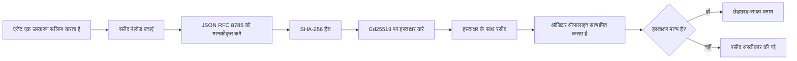
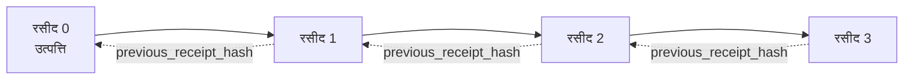

[पाठ वीडियो देखें: क्रिप्टोग्राफिक रसीदों के साथ AI एजेंट्स की सुरक्षा](https://youtu.be/PLACEHOLDER_VIDEO_ID)

> _(पाठ वीडियो और थंबनेल Microsoft कंटेंट टीम द्वारा मर्ज के बाद जोड़े जाएंगे, जो पाठ 14 / 15 के पैटर्न से मेल खाते हैं।)_

# क्रिप्टोग्राफिक रसीदों के साथ AI एजेंट्स की सुरक्षा

## परिचय

यह पाठ कवर करेगा:

- अनुपालन, डिबगिंग, और विश्वास के लिए AI एजेंट्स के ऑडिट ट्रेल क्यों महत्वपूर्ण हैं।
- क्रिप्टोग्राफिक रसीद क्या है और यह एक बिना साइन किए लॉग लाइन से कैसे भिन्न है।
- एक एजेंट के टूल कॉल के लिए साइन की गई रसीद को प्लेन पायथन में कैसे बनाएं।
- एक रसीद को ऑफ़लाइन कैसे सत्यापित करें और छेड़छाड़ का पता लगाएं।
- कैसे रसीदों की चेन बनाएं ताकि किसी एक को हटाने या पुनः क्रमित करने पर चेन टूट जाए।
- रसीदें क्या प्रमाणित करती हैं और वे स्पष्ट रूप से क्या प्रमाणित नहीं करतीं।

## सीखने के लक्ष्य

इस पाठ को पूरा करने के बाद, आप जानेंगे कैसे:

- उन त्रुटि मोड्स की पहचान करें जो एजेंट क्रियाओं के लिए क्रिप्टोग्राफिक पूर्वजता को प्रेरित करते हैं।
- एक canonical JSON पेलोड पर Ed25519-सह हस्ताक्षरित रसीद बनाएँ।
- केवल सिग्नेचरकर्ता की सार्वजनिक कुंजी का उपयोग करके एक रसीद को स्वतंत्र रूप से सत्यापित करें।
- संशोधित रसीद पर पुन: सत्यापन करके छेड़छाड़ का पता लगाएं।
- रसीदों की हैश-चेन की अनुक्रमणिका बनाएं और समझाएं कि चेन क्यों महत्वपूर्ण है।
- पहचानें कि रसीदें क्या प्रमाणित करती हैं (संबंध, अखंडता, क्रमिकता) और क्या नहीं (कार्य की शुद्धता, नीति की ध्वनिता)।

## समस्या: आपके एजेंट का ऑडिट ट्रेल

कल्पना करें कि आपने Contoso Travel के लिए एक AI एजेंट तैनात किया है। एजेंट ग्राहक अनुरोध पढ़ता है, एक flights API को कॉल करता है विकल्प देखने के लिए, और ग्राहक की ओर से सीटें बुक करता है। पिछले तिमाही में, एजेंट ने 50,000 बुकिंग कीं।

आज एक ऑडिटर आता है। वे एक सरल प्रश्न पूछते हैं: "मेरे सामने दिखाएं कि आपका एजेंट ने क्या किया।"

आप अपने लॉग फ़ाइलें सौंपते हैं। ऑडिटर उन्हें देखता है और एक कठिन सवाल पूछता है: "मैं कैसे जानूं कि इन लॉग्स को संपादित नहीं किया गया?"

यह ऑडिट-ट्रेल समस्या है। अधिकांश एजेंट डिप्लॉयमेंट आज निम्न पर निर्भर करते हैं:

- **एप्लिकेशन लॉग्स**: जो एजेंट स्वयं लिखता है, जिसे फाइल सिस्टम एक्सेस वाले कोई भी संपादित कर सकता है।
- **क्लाउड लॉगिंग सेवाएं**: प्लेटफ़ॉर्म स्तर पर छेड़छाड़-साक्ष्य होती हैं लेकिन केवल यदि ऑडिटर प्लेटफ़ॉर्म ऑपरेटर पर भरोसा करता है।
- **डेटाबेस ट्रांजैक्शन लॉग्स**: डेटाबेस परिवर्तनों के लिए उपयुक्त लेकिन मनमाने टूल कॉल के लिए नहीं।

इनमें से कोई भी ऑडिटर के प्रश्न का उत्तर देने में सक्षम नहीं है बिना किसी पर भरोसा किए (आप, आपका क्लाउड प्रदाता, आपका डेटाबेस विक्रेता)। आंतरिक उपयोग के लिए, वह भरोसा अक्सर स्वीकार्य होता है। विनियमित कार्यभार (वित्त, स्वास्थ्य देखभाल, EU AI अधिनियम के अंतर्गत कुछ भी) के लिए, यह स्वीकार्य नहीं है।

क्रिप्टोग्राफिक रसीदें प्रत्येक एजेंट क्रिया को स्वतंत्र रूप से सत्यापित करने योग्य बनाकर इसे हल करती हैं। ऑडिटर को आप पर भरोसा करने की जरूरत नहीं है। वे केवल आपकी सार्वजनिक कुंजी और रसीद की आवश्यकता है।

## क्रिप्टोग्राफिक रसीद क्या है?

एक रसीद एक JSON ऑब्जेक्ट है जो एजेंट ने क्या किया रिकॉर्ड करता है, और डिजिटल हस्ताक्षर के साथ हस्ताक्षरित होता है।


  
एक न्यूनतम रसीद इस प्रकार दिखती है:

```json
{
  "type": "agent.tool_call.v1",
  "agent_id": "contoso-travel-bot",
  "tool_name": "lookup_flights",
  "tool_args_hash": "sha256:a3f9c1...",
  "result_hash": "sha256:7b2e1d...",
  "policy_id": "contoso-travel-policy-v3",
  "timestamp": "2026-04-25T14:30:00Z",
  "sequence": 47,
  "previous_receipt_hash": "sha256:9d4e6a...",
  "signature": {
    "alg": "EdDSA",
    "sig": "c5af83...",
    "public_key": "8f3b2c..."
  }
}
```
  
तीन गुण काम कर रहे हैं:

1. **हस्ताक्षर।** रसीद एजेंट के गेटवे द्वारा Ed25519 निजी कुंजी का उपयोग करके हस्ताक्षरित होती है। संबंधित सार्वजनिक कुंजी वाले कोई भी ऑफ़लाइन हस्ताक्षर को सत्यापित कर सकता है। किसी भी फ़ील्ड के साथ छेड़छाड़ हस्ताक्षर को अमान्य कर देती है।

2. **कैनोनिकल एन्कोडिंग।** हस्ताक्षर करने से पहले, रसीद JSON कैनोनिकलाइजेशन स्कीम (JCS, RFC 8785) का उपयोग करके सीरियलाइज़ की जाती है। यह सुनिश्चित करता है कि दो अलग-अलग कार्यान्वयन समान तार्किक रसीद के लिए समान बाइट-आधारित आउटपुट उत्पन्न करते हैं। कैनोनिकलाइजेशन के बिना, अलग-अलग JSON सीरियलाइज़र एक ही सामग्री के लिए अलग-अलग हस्ताक्षर बनाएंगे।

3. **हैश चेनिंग।** `previous_receipt_hash` फ़ील्ड प्रत्येक रसीद को उससे पहले वाली रसीद से जोड़ता है। एक रसीद को हटाने या पुनः क्रमित करने से उसके बाद की हर रसीद टूट जाती है। भले ही व्यक्तिगत हस्ताक्षर बायपास हों, छेड़छाड़ चेन स्तर पर दिखाई देती है।

ये गुण मिलकर तीन गारंटियां प्रदान करते हैं:

- **संबंध**: इस कुंजी ने इस सामग्री पर हस्ताक्षर किया।
- **अखंडता**: सामग्री हस्ताक्षर के बाद से नहीं बदली।
- **क्रमिकता**: यह रसीद चेन में उस रसीद के बाद आई।

## पाइथन में रसीद बनाना

रसीद बनाने के लिए आपको किसी विशेष लाइब्रेरी की आवश्यकता नहीं है। क्रिप्टोग्राफिक प्रिमिटिव्स व्यापक रूप से उपलब्ध हैं और लॉजिक कुछ दर्जन पंक्तियों के पाइथन कोड का है।

`code_samples/18-signed-receipts.ipynb` में हैंड्स-ऑन अभ्यास पूरे फ्लो को दिखाते हैं। सारांश संस्करण:

```python
import json
import hashlib
import base64
from nacl import signing
from jcs import canonicalize  # RFC 8785 कैनॉनिकल JSON

def b64url_nopad(data: bytes) -> str:
    return base64.urlsafe_b64encode(data).decode("ascii").rstrip("=")

def sha256_canonical(obj) -> str:
    """SHA-256 of a Python object's JCS-canonical JSON form."""
    return f"sha256:{hashlib.sha256(canonicalize(obj)).hexdigest()}"

# एक साइनिंग की जनरेट करें या लोड करें (प्रोडक्शन में, इसे की वॉल्ट में स्टोर करें)
signing_key = signing.SigningKey.generate()
verify_key = signing_key.verify_key

# रसीद पेलोड बनाएं (अभी तक कोई हस्ताक्षर नहीं)
tool_args = {"origin": "SYD", "destination": "LAX"}
tool_result = [{"flight": "QF11", "price": 1850, "stops": 0}]

payload = {
    "type": "agent.tool_call.v1",
    "agent_id": "contoso-travel-bot",
    "tool_name": "lookup_flights",
    "tool_args_hash": sha256_canonical(tool_args),
    "result_hash": sha256_canonical(tool_result),
    "policy_id": "contoso-travel-policy-v3",
    "timestamp": "2026-04-25T14:30:00Z",
    "sequence": 0,
    "previous_receipt_hash": None,
}

# कैनॉनिकलाइज करें, हैश करें, साइन करें।
canonical_bytes = canonicalize(payload)
message_hash = hashlib.sha256(canonical_bytes).digest()
signature_bytes = signing_key.sign(message_hash).signature

# एक संरचित हस्ताक्षर ऑब्जेक्ट संलग्न करें।
receipt = {
    **payload,
    "signature": {
        "alg": "EdDSA",
        "sig": b64url_nopad(signature_bytes),
        "public_key": b64url_nopad(bytes(verify_key)),
    },
}
```
  
यह पूरा साइनिंग पाइपलाइन है। नोटबुक के अभ्यास प्रत्येक चरण को विस्तार से समझाते हैं।

## रसीद सत्यापित करना और छेड़छाड़ का पता लगाना

सत्यापन इसके विपरीत ऑपरेशन है:

```python
import base64
import hashlib
from nacl import signing
from nacl.exceptions import BadSignatureError
from jcs import canonicalize

def b64url_decode(s: str) -> bytes:
    padding = "=" * ((4 - len(s) % 4) % 4)
    return base64.urlsafe_b64decode(s + padding)

def verify_receipt(receipt: dict) -> bool:
    # हस्ताक्षर एक संरचित वस्तु है: {"alg", "sig", "public_key"}।
    sig_obj = receipt.get("signature")
    if not sig_obj or sig_obj.get("alg") != "EdDSA":
        return False

    # वह पेलोड पुनर्निर्मित करें जो वास्तव में साइन किया गया था (हस्ताक्षर को छोड़कर सब कुछ)।
    payload = {k: v for k, v in receipt.items() if k != "signature"}

    canonical_bytes = canonicalize(payload)
    message_hash = hashlib.sha256(canonical_bytes).digest()

    try:
        verify_key = signing.VerifyKey(b64url_decode(sig_obj["public_key"]))
        verify_key.verify(message_hash, b64url_decode(sig_obj["sig"]))
        return True
    except BadSignatureError:
        return False
```
  
यह फ़ंक्शन एक रसीद लेता है और अगर हस्ताक्षर मान्य है तो `True` लौटाता है, अन्यथा `False`। कोई नेटवर्क कॉल, कोई सेवा निर्भरता, या किसी तीसरे पक्ष पर भरोसा आवश्यक नहीं।

छेड़छाड़ का पता लगाने के लिए, नोटबुक निम्न दिखाता है:

1. एक मान्य रसीद बनाना और पुष्टि करना कि यह सत्यापित होती है।
2. `tool_args_hash` फ़ील्ड के एक बाइट को संशोधित करना।
3. सत्यापन पुनः चलाना और विफलता देखना।

यह व्यावहारिक प्रदर्शन है कि रसीदें छेड़छाड़-साक्ष्य होती हैं: कोई भी संशोधन, चाहे छोटा हो, हस्ताक्षर को तोड़ देता है।

## मल्टी-स्टेप एजेंट्स के लिए रसीदें चेन करना

एक सिंगल साइन की गई रसीद एक क्रिया की सुरक्षा करती है। रसीदों की एक चेन एक अनुक्रम की सुरक्षा करती है।


  
प्रत्येक रसीद से पहले की रसीद के हैश को रिकॉर्ड करती है। चेन के बीच में रसीद 2 को चुपचाप हटाने के लिए, हमलावर को या तो:

- रसीद 3 के `previous_receipt_hash` फ़ील्ड को संशोधित करना होगा (रसीद 3 के हस्ताक्षर को तोड़ता है), या
- संशोधित रसीद 3 पर नया हस्ताक्षर नकली बनाना होगा (जिसके लिए एजेंट की निजी कुंजी चाहिए)।

यदि निजी कुंजी हार्डवेयर कुंजी वॉल्ट में है और आप प्रत्येक रसीद के साथ सार्वजनिक कुंजी प्रकाशित करते हैं, तो दोनों हमले बिना पता चले असंभव हैं।

नोटबुक में दिखाया गया है:

1. तीन रसीदों की चेन बनाना।
2. सत्यापित करना कि प्रत्येक रसीद का `previous_receipt_hash` पूर्ववर्ती रसीद के वास्तविक हैश से मेल खाता है।
3. चेन के बीच में एक रसीद के साथ छेड़छाड़ करना और चेन उस बिंदु पर टूटना देखना।

यह तरीका है कि आप एक ऐसा ऑडिट ट्रेल बनाएं जिसे बाहरी ऑडिटर बिना आप पर भरोसा किए सत्यापित कर सके।

## रसीदें क्या प्रमाणित करती हैं (और क्या नहीं)

यह इस पाठ का सबसे महत्वपूर्ण भाग है। रसीदें शक्तिशाली हैं लेकिन उनकी शक्ति सीमित है।

**रसीदें तीन चीजें प्रमाणित करती हैं:**

1. **संबंध**: एक विशिष्ट कुंजी ने विशिष्ट पेलोड पर हस्ताक्षर किया।
2. **अखंडता**: पेलोड हस्ताक्षर के बाद से नहीं बदला।
3. **क्रमिकता**: यह रसीद चेन में उस रसीद के बाद आई।

**रसीदें प्रमाणित नहीं करतीं:**

1. **शुद्धता**: कि एजेंट की क्रिया सही क्रिया थी। गलत उत्तर पर भी रसीद उतनी ही साफ़-सुथरी साइन हो सकती है जितनी सही उत्तर पर।
2. **नीति अनुपालन**: कि `policy_id` में उल्लिखित नीति का वास्तव में मूल्यांकन हुआ, या कि यदि जांचा गया तो यह क्रिया अनुमति देगा। रसीद रिकॉर्ड करती है क्या दावा किया गया, न कि क्या लागू किया गया।
3. **कुंजी से परे पहचान**: रसीद कहती है "इस कुंजी ने इस सामग्री पर हस्ताक्षर किया।" यह नहीं कहती "इस मानव ने इसे अधिकृत किया।" कुंजी को व्यक्ति या संगठन से जोड़ने के लिए अलग पहचान अवसंरचना चाहिए (डायरेक्टरी, सार्वजनिक कुंजी रजिस्ट्रेशन आदि)।
4. **इनपुट की सत्यता**: यदि एजेंट को एक छेड़ा गया प्रॉम्प्ट मिलता है और वह उस पर कार्य करता है, तो रसीद क्रिया को सही ढंग से रिकॉर्ड करती है। रसीदें इनपुट सत्यापन की जगह नहीं हैं।

यह सीमा महत्वपूर्ण है क्योंकि:

- यह बताती है कि रसीदें किस लिए उपयोगी हैं: एजेंट व्यवहार को ऑडिटेबल और छेड़छाड़-साक्ष्य बनाना, यहाँ तक कि संगठनात्मक सीमाओं के पार भी।
- यह बताती है कि आपको और कौन से परतों की आवश्यकता है: इनपुट सत्यापन (पाठ 6), नीति प्रवर्तन (संक्षेप में नीचे), और पहचान अवसंरचना (इस पाठ के बाहर)।

एक आम गलती यह मानना है कि "हमारे पास रसीदें हैं" का अर्थ है "हम नियंत्रित हैं।" ऐसा नहीं है। रसीदें एक आधार हैं। शासन वह प्रणाली है जिसे आप उपर बनाते हैं।

## उत्पादन संदर्भ

इस पाठ का पायथन कोड जानबूझकर न्यूनतम है ताकि आप हर पंक्ति पढ़कर ठीक से समझ सकें कि क्या हो रहा है। उत्पादन में आपके पास दो विकल्प हैं:

1. **क्रिप्टोग्राफिक प्रिमिटिव्स पर सीधे बनाएं।** ऊपर दिखाए गए 50 लाइन कई उपयोग मामलों के लिए पर्याप्त हैं। PyNaCl (Ed25519) और `jcs` पैकेज (कैनेनिकल JSON) अच्छी तरह से मेनटेंड और ऑडिट की गई लाइब्रेरी हैं।

2. **प्रोडक्शन रसीद लाइब्रेरी का उपयोग करें।** कई ओपन-सोर्स प्रोजेक्ट्स वही पैटर्न अतिरिक्त फीचर्स के साथ लागू करते हैं (कुंजी घुमाव, बैच सत्यापन, JWK सेट वितरण, नीति इंजन इंटीग्रेशन):
   - इस पाठ में उपयोग की गई रसीद प्रारूप एक IETF इंटरनेट-ड्राफ्ट (`draft-farley-acta-signed-receipts`) का पालन करता है जो वर्तमान में मानकीकरण प्रक्रिया में है।
   - Microsoft Agent Governance Toolkit Cedar-आधारित नीति निर्णयों के साथ रसीदें बनाता है; उस रिपोजिटरी में ट्यूटोरियल 33 में एक एंड-टू-एंड उदाहरण देखें।
   - `protect-mcp` (npm) और `@veritasacta/verify` (npm) पैकेजेस एक Node-आधारित रसीद साइनिंग और ऑफ़लाइन सत्यापन कार्यान्वयन प्रदान करते हैं, जो किसी भी MCP सर्वर को छेड़छाड़-साक्षी ऑडिट ट्रेल से लैस करने के लिए हैं।
   - **[nobulex](https://github.com/arian-gogani/nobulex)** पायथन SDK (`pip install nobulex`) पायथन में वही Ed25519 + JCS साइनिंग पैटर्न LangChain और CrewAI इंटीग्रेशन के साथ प्रदान करता है, जिसमें प्रकाशित क्रॉस-वैलिडेशन टेस्ट वेक्टर और OWASP PR #2210 ([लिंक](https://github.com/OWASP/CheatSheetSeries/pull/2210)) के माध्यम से अनुपालन मैपिंग शामिल है।

अपना JWT लाइब्रेरी लिखने और एक परीक्षण की हुई लाइब्रेरी उपयोग करने के बीच निर्णय की तरह, अपनी खुद की लिखने और लाइब्रेरी के बीच निर्णय दो विकल्पों को दर्शाता है: दोनों उचित हैं; लाइब्रेरी समय बचाती है और ऑडिट सतह कम करती है; शुरुआत से लिखने पर हर प्रिमिटिव समझना जरूरी होता है। यह पाठ शुरुआत से पथ सिखाता है ताकि आपके पास दोनों विकल्पों के लिए आधार हो।

## ज्ञान जांच

अभ्यास करने से पहले अपनी समझ का परीक्षण करें।

**1. एक रसीद एजेंट की निजी Ed25519 कुंजी से साइन होती है। ऑडिटर के पास केवल सार्वजनिक कुंजी है। क्या ऑडिटर रसीद को ऑफ़लाइन सत्यापित कर सकता है?**

<details>
<summary>उत्तर</summary>

हाँ। Ed25519 सत्यापन के लिए केवल सार्वजनिक कुंजी और साइन किए गए बाइट्स की जरूरत होती है। कोई नेटवर्क कॉल, कोई सेवा निर्भरता नहीं। यह वही गुण है जो रसीदों को एयर-गैप्ड, बहु-संगठन, या कम भरोसे वाली ऑडिट सेटिंग्स में उपयोगी बनाता है।
</details>

**2. एक हमलावर ने रसीद के `policy_id` फ़ील्ड को संशोधित कर दावा किया कि इसे अधिक सहज नीति द्वारा शासित किया गया था। हस्ताक्षर मूल पेलोड पर था। सत्यापन के दौरान क्या होता है?**

<details>
<summary>उत्तर</summary>

सत्यापन विफल होता है। हस्ताक्षर को मूल पेलोड के कैनोनिकल बाइट्स पर गणना किया गया था; किसी भी फ़ील्ड को बदलने से कैनोनिकल बाइट्स बदलते हैं, जिससे SHA-256 हैश बदलता है, और हस्ताक्षर अमान्य हो जाता है। हमलावर को निजी कुंजी चाहिए होगी ताकि नया मान्य हस्ताक्षर बना सके, जो उसके पास नहीं है।
</details>

**3. रसीद में कच्चे तर्कों और परिणाम की बजाय `tool_args_hash` और `result_hash` क्यों शामिल हैं?**

<details>
<summary>उत्तर</summary>

दो कारण हैं। पहला, रसीद को ऐसे वातावरण में संग्रहित या प्रसारित करना पड़ सकता है जहाँ कच्ची सामग्री (PII, व्यवसाय डेटा) लीक होना समस्या हो। हैशिंग रसीद को छोटा और सामग्री को निजी रखता है; ऑडिटर यह सत्यापित करता है कि हैश वास्तविक सामग्री की अलग से संग्रहित प्रति से मेल खाता है। दूसरा, हैश का आकार निश्चित होता है; हैश के साथ रसीद का आकार इनपुट और आउटपुट के आकार से परे सीमित रहता है।
</details>

**4. `previous_receipt_hash` फ़ील्ड प्रत्येक रसीद को उसके पूर्ववर्ती से जोड़ता है। अगर कोई हमलावर चेन के बीच से एक रसीद चुपचाप हटा देता है, तो क्या अमान्य हो जाता है?**

<details>
<summary>उत्तर</summary>

हटाए गए रसीद के बाद की हर रसीद। उनके `previous_receipt_hash` फ़ील्ड अब वास्तविक चेन से मेल नहीं खाते (क्योंकि वे जिस रसीद को संदर्भित करते थे वह अब अस्तित्व में नहीं है, या चेन अब दूसरे पूर्ववर्ती की ओर इशारा करता है)। हटाने को छुपाने के लिए हमलावर को हर बाद की रसीद फिर से हस्ताक्षरित करनी होगी, जिसके लिए निजी कुंजी जरूरी है।
</details>

**5. एक रसीद सुचारू रूप से सत्यापित होती है। क्या यह प्रमाणित करती है कि एजेंट की क्रिया सही, ध्वनिवान, या नीति-अनुपालक थी?**

<details>
<summary>उत्तर</summary>

नहीं। एक मान्य रसीद तीन बातें प्रमाणित करती है: संबंध (इस कुंजी ने इस सामग्री पर हस्ताक्षर किया), अखंडता (सामग्री नहीं बदली), और क्रमिकता (यह रसीद उस रसीद के बाद आई)। यह प्रमाणित नहीं करती कि क्रिया सही थी, `policy_id` में नामित नीति का वास्तव में मूल्यांकन हुआ था, या एजेंट ने हर नियम का पालन किया। रसीदें एजेंट व्यवहार को ऑडिटेबल बनाती हैं, जरूरी नहीं कि सही। यह इस पाठ की सबसे महत्वपूर्ण सीमा है।
</details>

## अभ्यास

`code_samples/18-signed-receipts.ipynb` खोलें और सभी चार सेक्शन पूरे करें:

1. **सेक्शन 1**: अपनी पहली रसीद साइन करें और सत्यापित करें।
2. **सेक्शन 2**: रसीद में छेड़छाड़ करें और सत्यापन विफल होना देखें।
3. **सेक्शन 3**: तीन रसीदों की चेन बनाएं और चेन की अखंडता सत्यापित करें।
4. **सेक्शन 4**: Microsoft Agent Framework के साथ बनाए गए एजेंट पर पैटर्न लागू करें: टूल कॉल को रसीद-साइनिंग में लपेटें, फिर रसीद को स्वतंत्र रूप से सत्यापित करें।
**स्ट्रेच चुनौती 1:** अपनी पसंद का एक अतिरिक्त फ़ील्ड (उदाहरण के लिए, ट्रेसिंग के लिए एक अनुरोध आईडी) के साथ रिसिप्ट स्कीमा का विस्तार करें, इसे शामिल करने के लिए कैनोनिकल साइनिंग लॉजिक को अपडेट करें, और पुष्टि करें कि रिसिप्ट अभी भी सत्यापन के माध्यम से राउंड-ट्रिप करता है। फिर साइनिंग के बाद फ़ील्ड को संशोधित करें और पुष्टि करें कि सत्यापन असफल होता है। यह आपको समझने के लिए मजबूर करता है कि कैनोनिकल एन्कोडिंग के प्रत्येक बाइट का हस्ताक्षर में कैसे योगदान होता है।

**स्ट्रेच चुनौती 2:** अपनी दो रिसिप्टों को SHA-256-हैश करें (उनके कैनोनिकल बाइट्स को एक निश्चित क्रम में जोड़ें) और साइनिंग से पहले तीसरी रिसिप्ट पर एक नए फ़ील्ड के रूप में परिणामी डाइजेस्ट को एम्बेड करें। सुनिश्चित करें कि सभी तीन रिसिप्ट अभी भी राउंड-ट्रिप करते हैं। आपने अभी एक-चरण समावेशन प्रमाण बनाया है: तीसरी रिसिप्ट रखने वाला कोई भी व्यक्ति प्रमाणित कर सकता है कि पहली दो साइनिंग के समय मौजूद थे, बिना उनकी सामग्री प्रकट किए। यही पैटर्न स्केल पर चयनात्मक-प्रकटीकरण रिसिप्ट्स उपयोग करते हैं (मर्कल प्रतिबद्धताएँ, RFC 6962)।

## निष्कर्ष

क्रिप्टोग्राफिक रिसिप्ट्स AI एजेंट्स को एक ऑडिट ट्रेल प्रदान करते हैं जो कि:

- **स्वतंत्र रूप से सत्यापनीय:** सार्वजनिक कुंजी वाला कोई भी पक्ष सत्यापित कर सकता है, कोई सेवा निर्भरता नहीं।
- **छेड़छाड़-स्पष्ट:** कोई भी संशोधन हस्ताक्षर को अमान्य कर देता है।
- **पोर्टेबल:** एक रिसिप्ट एक छोटा JSON फ़ाइल है; इसे कहीं भी संग्रहित, संप्रेषित और सत्यापित किया जा सकता है।
- **मानक-अनुकूल:** Ed25519 (RFC 8032), JCS (RFC 8785), और SHA-256 पर निर्मित, जो सभी व्यापक रूप से उपयोग किए जाने वाले प्राथमिक हैं।

वे इनपुट सत्यापन, नीति प्रवर्तन या पहचान इंफ्रास्ट्रक्चर के लिए विकल्प नहीं हैं। वे उन परतों के लिए एक आधार प्रदान करते हैं। जब आप एजेंट्स को नियामित कार्यभार में, मल्टी-ऑर्गनाइजेशन वर्कफ़्लोज़ में, या किसी भी ऐसे सेटिंग में तैनात करते हैं जहाँ भविष्य का ऑडिटर आप पर भरोसा नहीं कर सकता, रिसिप्ट्स वह तरीका हैं जिससे आप ऑडिट ट्रेल को ईमानदार बनाते हैं।

सबसे महत्वपूर्ण बात: रिसिप्ट्स यह साबित करते हैं कि किसने क्या, कब कहा। वे यह साबित नहीं करते कि जो कहा गया वह सच या सही था। इस भेद को मजबूती से पकड़ें। यह एक ईमानदार प्रोवेनेन्स सिस्टम और एक भ्रामक सिस्टम के बीच का अंतर है।

## प्रोडक्शन चेकलिस्ट

जब आप इस पाठ से स्नातक होकर रिसिप्ट-हस्ताक्षरित एजेंट्स को वास्तविक वातावरण में तैनात करने के लिए तैयार हों:

- [ ] **साइनिंग की को डिवेलपर लैपटॉप से हटाएं।** Azure Key Vault, AWS KMS, या हार्डवेयर सिक्योरिटी मॉड्यूल का उपयोग करें। जो निजी कुंजी आपके रिसिप्ट्स को साइन करती है, उसे स्रोत नियंत्रण में या ऐप मशीनों पर प्लेनटेक्स्ट में कभी न रखें।
- [ ] **सत्यापन सार्वजनिक कुंजी प्रकाशित करें।** ऑडिटर को ऑफ़लाइन सत्यापन के लिए इसकी आवश्यकता होती है। मानक पैटर्न एक JWK सेट है जो एक ज्ञात URL पर हो (RFC 7517), जैसे `https://your-org.example.com/.well-known/agent-keys.json`।
- [ ] **चेन को बाहरी रूप से एंकर करें।** समय-समय पर नवीनतम चेन हेड हैश को एक ट्रांसपैरेंसी लॉग (Sigstore Rekor, RFC 3161 टाइमस्टैम्प अथॉरिटी, या दूसरा आंतरिक सिस्टम) में लिखें ताकि कोई बाहरी पक्ष पुष्टि कर सके "यह चेन इस समय मौजूद था।"
- [ ] **रिसिप्ट्स को अपरिवर्तनीय रूप से स्टोर करें।** ऐपेंड-ओनली ब्लॉब स्टोरेज (Azure Storage इम्यूटैबिलिटी नीतियों के साथ, AWS S3 ऑब्जेक्ट लॉक) इन्साइडर को स्टोरेज स्तर पर इतिहास को पुनः लिखने से रोकता है।
- [ ] **रिटेंशन पर निर्णय लें।** कई अनुपालन नियम प्रणाली वर्षों की रिटेंशन आवश्यक करते हैं। रिसिप्ट वृद्धि की योजना बनाएं (प्रत्येक रिसिप्ट लगभग 500 बाइट्स होती है; एक एजेंट जो दैनिक 10K कॉल करता है, प्रति वर्ष लगभग 1.8 GB उत्पन्न करता है)।
- [ ] **डॉक्यूमेंट करें कि रिसिप्ट्स क्या कवर नहीं करते।** रिसिप्ट्स प्रमाणित करते हैं कि कौन, क्या, और कब; आपकी रनबुक को स्पष्ट रूप से सूचीबद्ध करना चाहिए कि अतिरिक्त नियंत्रण (इनपुट सत्यापन, नीति प्रवर्तन, दर सीमित करना, पहचान इंफ्रास्ट्रक्चर) रिसिप्ट्स के साथ आपके शासन स्थिति में कहाँ फिट बैठते हैं।

### AI एजेंट्स को सुरक्षित करने के बारे में और प्रश्न हैं?

[Microsoft Foundry Discord](https://aka.ms/ai-agents/discord) में शामिल हों ताकि आप अन्य शिक्षार्थियों से मिल सकें, ऑफिस ऑवर्स में भाग ले सकें, और अपने AI एजेंट्स के प्रश्नों के उत्तर पा सकें।

## इस पाठ से आगे

यह पाठ एकल रिसिप्ट साइनिंग और हैश-चेन अनुक्रमों को कवर करता है। वही प्राइमिटिव कई अधिक उन्नत पैटर्न में संयोजित होते हैं जो आपके शासन स्थिति के परिपक्व होने के साथ आप देख सकते हैं:

- **चयनात्मक प्रकटीकरण।** जब रिसिप्ट के फ़ील्ड स्वतंत्र रूप से प्रतिबद्ध होते हैं (RFC 6962 शैली मर्कल ट्री), आप विशिष्ट फ़ील्ड को विशिष्ट ऑडिटर्स के सामने प्रकट कर सकते हैं और बाकी को बिना प्रकट किए अनचेंज्ड साबित कर सकते हैं। तब उपयोगी है जब एक ही रिसिप्ट को एक व्यापक ऑडिट (जो पूर्णता चाहता है) और डेटा-न्यूनतम नियम जैसे GDPR (जो ऑडिटर को न्यूनतम दिखाना चाहते हैं) दोनों को संतुष्ट करना हो।
- **रिसिप्ट निरस्तीकरण।** यदि साइनिंग की समझौता हो जाती है, तो आपको उस की द्वारा साइन की गई सभी रिसिप्ट्स को एक निश्चित समय से अविश्वसनीय घोषित करने का तरीका चाहिए। मानक पैटर्न: अल्पकालिक साइनिंग की और प्रकाशित निरस्तीकरण सूची, या निरस्तीकरण प्रविष्टियों के साथ एक पारदर्शिता लॉग।
- **दो-पक्षीय / विभाजित-सिग्नेचर रिसिप्ट्स।** कुछ कार्यान्वयन साइन किए Payload को पूर्व-कार्य (`authorization_*`) और पश्च-कार्य (`result_*`) आधों में बांटते हैं जो स्वतंत्र हस्ताक्षरों के साथ होते हैं, उपयोगी जब अनुमति निर्णय और परिणाम अलग-अलग अभिनेताओं या समय पर उत्पन्न होते हैं। यह इस पाठ में सिखाए गए रिसिप्ट फॉर्मेट पर संलग्न होता है।
- **पेलोड संयोजन।** एक रिसिप्ट किसी भी बाइट्स को `result_hash` में सील करता है। वास्तविक दुनिया के पेलोड अक्सर एकल टूल कॉल से अधिक समृद्ध होते हैं: पूर्व-निर्णय तर्क (मॉडल पूर्वानुमान, विचार किए विकल्प, साक्ष्य और उसकी पूर्णता, जोखिम स्थिति, जवाबदेही श्रृंखला, गेट परिणाम) सभी पेलोड के अंदर रह सकते हैं, जिन्हें एक रिसिप्ट द्वारा सील किया जाता है। यह रिसिप्ट फॉर्मेट को न्यूनतम रखता है जबकि पेलोड स्कीमाओं को डोमेन-वार विकसित करने देता है।
- **क्रॉस-इम्प्लीमेंटेशन अनुपालन।** एक ही रिसिप्ट फॉर्मेट के कई स्वतंत्र कार्यान्वयन (Python, TypeScript, Rust, Go) साझा टेस्ट वेक्टर के खिलाफ क्रॉस-सत्यापन करते हैं। यदि आप अपना खुद का कार्यान्वयन बनाते हैं, तो प्रकाशित वेक्टर के खिलाफ सत्यापन वायर संगतता की पुष्टि करता है।
- **पोस्ट-क्वांटम माइग्रेशन।** Ed25519 आज व्यापक रूप से लागू है लेकिन क्वांटम-प्रतिरोधी नहीं है। रिसिप्ट फॉर्मेट एल्गोरिदम-लचीला है: `signature.alg` फ़ील्ड में `ML-DSA-65` (NIST पोस्ट-क्वांटम सिग्नेचर मानक) जब आप माइग्रेट करने की आवश्यकता हो तब कैरी किया जा सकता है। समयांतराल के लिए योजना बनाएं जहां रिसिप्ट ड्यूल-साइन किए जाते हैं।

## अतिरिक्त संसाधन

- <a href="https://datatracker.ietf.org/doc/draft-farley-acta-signed-receipts/" target="_blank">IETF इंटरनेट-ड्राफ्ट: मशीन-टू-मशीन एक्सेस कंट्रोल के लिए हस्ताक्षरित निर्णय रिसिप्ट्स</a>
- <a href="https://learn.microsoft.com/azure/ai-studio/responsible-use-of-ai-overview" target="_blank">उत्तरदायी AI अवलोकन (Azure AI)</a>
- <a href="https://datatracker.ietf.org/doc/html/rfc8032" target="_blank">RFC 8032: एडवर्ड्स-कर्व डिजिटल सिग्नेचर एल्गोरिदम (EdDSA)</a>
- <a href="https://datatracker.ietf.org/doc/html/rfc8785" target="_blank">RFC 8785: JSON कैनोनिकलाइज़ेशन स्कीम (JCS)</a>
- <a href="https://datatracker.ietf.org/doc/html/rfc6962" target="_blank">RFC 6962: प्रमाणपत्र पारदर्शिता</a> (चयनात्मक-प्रकटीकरण रिसिप्ट्स द्वारा उपयोग किया जाने वाला मर्कल-ट्री निर्माण)
- <a href="https://github.com/microsoft/agent-governance-toolkit/blob/main/docs/tutorials/33-offline-verifiable-receipts.md" target="_blank">Microsoft एजेंट गवर्नेंस टूलकिट, ट्यूटोरियल 33: ऑफ़लाइन-सत्यापनीय निर्णय रिसिप्ट्स</a>
- <a href="https://github.com/ScopeBlind/agent-governance-testvectors" target="_blank">इस पाठ में उपयोग किए गए रिसिप्ट फॉर्मेट के लिए क्रॉस-इम्प्लीमेंटेशन अनुपालन टेस्ट वेक्टर (Apache-2.0)</a>
- <a href="https://pynacl.readthedocs.io/" target="_blank">PyNaCl दस्तावेज़ (Python में Ed25519)</a>

## पिछला पाठ

[कंप्यूटर उपयोग एजेंट बनाना (CUA)](../15-browser-use/README.md)

## अगला पाठ

_(पाठ्यक्रम के रखरखावकर्ताओं द्वारा निर्धारित किया जाएगा)_

---

<!-- CO-OP TRANSLATOR DISCLAIMER START -->
**अस्वीकरण**:
इस दस्तावेज़ का अनुवाद AI अनुवाद सेवा [Co-op Translator](https://github.com/Azure/co-op-translator) का उपयोग करके किया गया है। जबकि हम सटीकता के लिए प्रयास करते हैं, कृपया ध्यान दें कि स्वचालित अनुवादों में त्रुटियाँ या अशुद्धियाँ हो सकती हैं। मूल दस्तावेज़ अपनी मूल भाषा में ही प्रामाणिक स्रोत माना जाना चाहिए। महत्वपूर्ण जानकारी के लिए, पेशेवर मानव अनुवाद की सिफारिश की जाती है। इस अनुवाद के उपयोग से उत्पन्न किसी भी गलतफहमी या गलत व्याख्या के लिए हम उत्तरदायी नहीं हैं।
<!-- CO-OP TRANSLATOR DISCLAIMER END -->